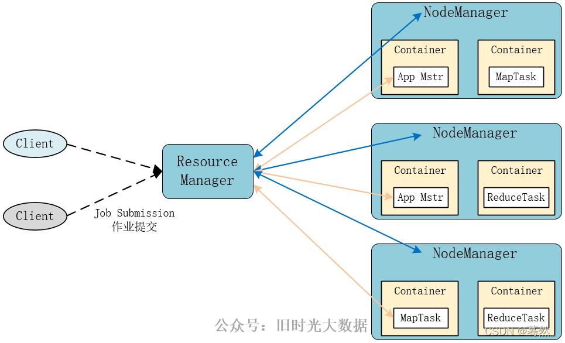

# Hadoop

## 一 Hadoop介绍

**HDFS** （**Hadoop Distributed File System**）是 Hadoop 下的分布式文件系统，具有高容错、高吞吐量等特性，可以部署在低成本的硬件上。

它的核心只有三块：**存数据的 (HDFS)**、**算数据的 (MapReduce)**、**管资源的 (YARN)**。

在大数据面试和实战中，需要从**策略、过程、放置逻辑、以及自愈**四个维度来构建知识体系。

#### 1. HDFS 的副本放置策略 (Replica Placement Policy)

这是最常被问到的考点：HDFS 并不是随机乱放副本的，它有一套**兼顾“安全”与“效率”**的算法。

**默认副本数为 3 的放置逻辑：**

- **第 1 个副本**：放在上传数据的那个 DataNode 上（如果是集群外提交，则挑一台磁盘不太满、CPU 不太忙的节点）。
- **第 2 个副本**：放在与第 1 个副本**不同机架**的某个节点上（保证即使整个机架的交换机坏了，数据还在）。
- **第 3 个副本**：放在与第 2 个副本**相同机架**但不同的节点上。

> **逻辑核心**：这样配置既保证了**机架感知（Rack Awareness）**的安全性，又在第 2 和第 3 副本之间节省了跨机架的网络带宽。

#### 2. 写数据的“流水线”复制 (Replication Pipeline)

很多人误以为是 NameNode 负责把数据复制三份，**其实不是**。

当你要往 HDFS 写一个 128MB 的块时：

1. **建立管道**：客户端向 NameNode 申请写，NameNode 返回 3 台 DataNode 地址（A, B, C）。
2. **流水线传输**：客户端只把数据发给 **A**；A 收到一部分（Packet）后，立刻传给 **B**；B 再传给 **C**。
3. ** ACK 确认**：当 C 写完返回确认给 B，B 返回给 A，最后 A 告诉客户端：“写好了”。

这种**串行流水线**的方式比起“由客户端同时向三台机器发三份数据”，极大地节省了客户端的出口带宽。

#### 3. 副本自愈：如果数据坏了怎么办？

Hadoop 体系中有一套自动化的审计和修复机制：

- **数据校验和 (Checksum)**： DataNode 在存数据时会产生一个校验码。当你（或 Hive）读取数据时，客户端会重新计算校验码，如果对不上，说明数据损坏（由于磁盘磁道坏了等原因）。
- **定期心跳 (Heartbeat)**： DataNode 每 3 秒给 NameNode 发一次心跳。如果 NameNode 超过 10 分钟没收到某台机器的心跳，就会认为它“挂了”。
- **自动补全**： NameNode 发现某块数据的副本数从 3 掉到了 2，它会下令让剩下的 DataNode 把数据复制到另一台健康的机器上。

### 4. 体系扩展：不仅仅是 HDFS

在你的大数据体系中，复制不仅发生在 HDFS 层，还发生在以下地方：

| **层次**                 | **复制内容**   | **作用**                                                     |
| ------------------------ | -------------- | ------------------------------------------------------------ |
| **元数据层 (MySQL)**     | Hive 的元数据  | 生产环境必须做 **MySQL 主从复制**，否则数据库挂了，整个 Hive 就瘫痪了。 |
| **计算中间层 (Shuffle)** | Map 输出的数据 | 在 Shuffle 阶段，数据会从 Map 节点“复制”到 Reduce 节点。**数据倾斜**往往就是这里复制的数据量不均导致的。 |
| **高可用层 (ZooKeeper)** | ZK 的状态数据  | 采用 **Paxos/ZAB 协议**的强一致性复制，保证 HS2 高可用时的信息同步。 |

## 二 HDFS基本架构及设计原理

HDFS 解决了“一台机器装不下，几千台机器怎么存”的问题。

核心架构：Master-Slave (主从) 模式 (中心化模式)

### 2.1 HDFS 架构

HDFS 遵循主/从架构，由单个 NameNode(NN) 和多个 DataNode(DN) 组成：

- **NameNode** : 负责执行有关 `文件系统命名空间` 的操作，例如打开，关闭、重命名文件和目录等。它同时还负责集群元数据的存储，记录着文件中各个数据块的位置信息。
- **DataNode**：负责提供来自文件系统客户端的读写请求，执行块的创建，删除等操作。

**NameNode (老大):**负责管理

- HDFS系统的主角色，是一个独立的进程
- 负责管理HDFS整个文件系统
- 负责管理DataNode

- 它不存真实数据，只存**元数据**（文件名、目录结构、文件被切成了几块、分别在哪台机器上）。

- *就像图书馆的索引卡。*

**DataNode (小弟): **负责干活

- HDFS系统的从角色，是一个独立进程
- 主要负责数据的存储，即存入数据和取出
  数据

- 真实的数据块（Block）存在这里。
- *就像图书馆的书架。*

**SecondaryNameNode:** 助教

- NameNode的辅助，是一个独立进程
- 主要帮助NameNode完成元数据整理工作（打杂）

- 帮老大分担压力，合并日志，防止老大挂了后启动太慢。

**核心机制：副本策略**

- **数据切块**：文件会被切成固定大小（默认 128MB）。
- **多副本**：默认每个块存 3 份。
  - *这就是为什么你在 HDFS 上删了文件，空间没立刻释放，或者挂了一台机器数据不丢失的原因。*

### 2.2 分布式系统中两种常见的工作模式

#### 2.2.1.分散汇总模式 (Scatter-Gather)

分散汇总模式（也称为 **分发-收集** 模式）是一种天然的并行计算模式，常用于需要并行处理大量数据的场景，例如 **MapReduce**。

| 步骤        | 名称                 | 执行动作                                                     | 关键特点                                                     |
| ----------- | -------------------- | ------------------------------------------------------------ | ------------------------------------------------------------ |
| 步骤 1      | 分散 (Scatter/Map)   | 主控节点（Master/Client）将一个大型任务或数据集 切分成若干独立的子任务或数据块，并将它们并行地发送给多个 工作节点（Worker/Slave）。 | 并行化：子任务之间相互独立，可以在不同的机器上同时运行。     |
| 步骤 步骤 2 | 执行 (Execute)       | 各个 工作节点 接收到自己的子任务后，独立地对分配到的数据块进行处理（例如，执行 Map 操作，数据清洗）。 | 无状态/本地计算：每个工作节点只关心自己的数据，通常不需要与其他节点通信。 |
| 步骤 3      | 汇总 (Gather/Reduce) | 各个 工作节点 完成计算后，将各自的 局部结果 返回给 主控节点 或一个指定的 汇集节点。 | 数据传输：涉及大量的网络 I/O，可能包含 Shuffle 过程（如果需要合并/分组）。 |
| 步骤 步骤 4 | 合并 (Merge)         | 主控节点/汇集节点 接收所有局部结果，执行最终的 合并、聚合或排序（例如，执行 Reduce 操作），得到最终的完整结果。 | 终态生成：生成用户所需的最终输出。                           |

**通俗总结：** 任务可以被完全切开，每个工人独立完成一部分，最后把各自的结果交上来，总指挥只负责最后相加。**速度快，但任务必须是可分割的。**

#### 2.2.2.🚦 中心调度模式 (Centralized Orchestration)

中心调度模式（也常被称为 **编排** 模式）强调由一个**中心协调者** 来定义、管理和推动整个工作流的顺序和依赖关系。它适用于涉及多个、有明确先后顺序和依赖关系的服务调用或任务。

| 步骤        | 名称                             | 执行动作                                                     | 关键特点                                                 |
| ----------- | -------------------------------- | ------------------------------------------------------------ | -------------------------------------------------------- |
| 步骤 1      | 定义工作流 (Workflow Definition) | 调度中心（Orchestrator/Master）预先加载或定义一个 有向无环图 (DAG)，明确所有任务（Task A, B, C...）的执行顺序和依赖关系。 | 任务依赖：任务 B 只有在任务 A 成功完成后才能开始。       |
| 步骤 步骤 2 | 启动与监控 (Trigger & Monitor)   | 调度中心 启动第一个 无依赖 的任务（如 Task A）。在任务执行过程中，调度中心会持续监控 任务的状态（运行中、成功、失败）。 | 状态管理：调度中心持有整个工作流的全局状态。             |
| 步骤 3      | 顺序驱动 (Sequential Drive)      | 当 调度中心 确认一个任务（如 Task A）成功完成 后，它会根据 DAG 触发其所有 下游依赖 的任务（如 Task B）。 | 单一决策点：所有任务的执行或重试都由调度中心决定和驱动。 |
| 步骤 步骤 4 | 反馈与结束 (Feedback & Complete) | 整个工作流直到所有任务都按顺序成功执行完毕，调度中心 宣布工作流完成。如果任何任务失败，调度中心负责根据策略进行 重试 或 告警。 | 流程控制：确保复杂业务流程的完整性、顺序性和可控性。     |

**通俗总结：** 任务之间有严格的 **先后顺序** 和 **依赖关系**。有一个 **总指挥（调度中心）** 像交警一样，严格控制和检查每个步骤是否完成，确保整个流水线顺利、按部就班地走下去。

### 2.3 文件系统命名空间

HDFS 的 `文件系统命名空间` 的层次结构与大多数文件系统类似 (如 Linux)， 支持目录和文件的创建、移动、删除和重命名等操作，支持配置用户和访问权限，但不支持硬链接和软连接。`NameNode` 负责维护文件系统名称空间，记录对名称空间或其属性的任何更改。

### 2.4 数据复制

由于 Hadoop 被设计运行在廉价的机器上，这意味着硬件是不可靠的，为了保证容错性，HDFS 提供了数据复制机制。HDFS 将每一个文件存储为一系列**块**，每个块由多个副本来保证容错，块的大小和复制因子可以自行配置（默认情况下，块大小是 128M，默认复制因子是 3）。

### 2.5 数据复制的实现原理

大型的 HDFS 实例在通常分布在多个机架的多台服务器上，不同机架上的两台服务器之间通过交换机进行通讯。在大多数情况下，同一机架中的服务器间的网络带宽大于不同机架中的服务器之间的带宽。因此 HDFS 采用机架感知副本放置策略，对于常见情况，当复制因子为 3 时，HDFS 的放置策略是：

在写入程序位于 `datanode` 上时，就优先将写入文件的一个副本放置在该 `datanode` 上，否则放在随机 `datanode` 上。之后在另一个远程机架上的任意一个节点上放置另一个副本，并在该机架上的另一个节点上放置最后一个副本。此策略可以减少机架间的写入流量，从而提高写入性能。

如果复制因子大于 3，则随机确定第 4 个和之后副本的放置位置，同时保持每个机架的副本数量低于上限，上限值通常为 `（复制系数 - 1）/机架数量 + 2`，需要注意的是不允许同一个 `dataNode` 上具有同一个块的多个副本。

对于以上内容 我们把这个过程拆解为三个核心逻辑：**就近原则**、**机架保命原则**和**冗余负载控制**,梳理一下:

**1. 基础逻辑：复制因子为 3 时（最经典情况）**

HDFS 就像一个聪明的快递员，他送货的逻辑是这样的：

- **第一步：就近（节省体力）**
  - 如果你就在仓库（DataNode）里操作，他就直接把第一个副本放在你脚下的机器上。
  - **目的**：本地写入速度最快，完全不占网络带宽。
- **第二步：跨机架保命（防灾）**
  - 他把第二个副本送到**另一个远程机架**。
  - **目的**：如果第一个机架的交换机坏了或停电了，第二个机架的数据还能用。这是为了**数据安全**。
- **第三步：同机架复制（省钱）**
  - 他在第二个机架里再找一台机器放下第三个副本。
  - **目的**：既然数据已经通过漫长的“跨机架”网络传到了机架 B，那么在机架 B 内部复制一次是非常快的，不需要再次跨越昂贵且拥挤的核心交换机。

**2.进阶逻辑：当复制因子 > 3 时（资源上限控制）**

这一部分也就是你提到的那个公式：`上限 = (复制系数 - 1) / 机架数量 + 2`。

你可以这样理解：**HDFS 严防“把鸡蛋放在同一个篮子里”。**

- **为什么要设上限？**

  如果你的副本数很多（比如 10 个），而你只有 3 个机架。如果 HDFS 偷懒把 8 个副本都塞进机架 A，那么机架 A 一旦断电，你瞬间就丢失了 80% 的备份，风险太高。

- **公式的意义**：它动态计算了每个机架能承受的“最大副本数”。

  - 比如：10 个副本，3 个机架。
  - 上限 $\approx (10 - 1) / 3 + 2 = 5$。
  - 这意味着没有任何一个机架可以存放超过 5 个副本。

- **禁忌**：最后那句“不允许同一个 DataNode 具有同一个块的多个副本”是死命令。哪怕你副本设为 100，只要你只有 10 台机器，你也只能存 10 份。

**3. 通俗总结：为什么要这么设计？**

这套体系的核心哲学是：**“大灾不灭，小灾不乱，平时飞快”。**

| **场景**     | **HDFS 的应对**                  | **结果**     |
| ------------ | -------------------------------- | ------------ |
| **平时写入** | 只需跨一次机架（1 次跨机架流量） | 写入性能极高 |
| **单机挂了** | 其他机器都有备份                 | 秒级恢复     |
| **整架挂了** | 另一个机架还有两份备份           | 业务不中断   |

**面试常考题：**

> “如果用户在上传文件时，机架感知（Rack Awareness）没配置好，会发生什么？”
>
> **答案**：HDFS 会认为所有机器都在同一个机架上。这样它就会随机放副本。万一那个机架的交换机坏了，你的数据就彻底丢失了（Data Lost），即便你设了 3 副本也没用。

### 2.6 副本的选择

为了最大限度地减少带宽消耗和读取延迟，HDFS 在执行读取请求时，优先读取距离读取器最近的副本。如果在与读取器节点相同的机架上存在副本，则优先选择该副本。如果 HDFS 群集跨越多个数据中心，则优先选择本地数据中心上的副本。

这段话，揭示了大数据(分布式)处理中一个至高无上的准则：**移动计算，而不是移动数据（Move Code, Not Data）。**

在大数据环境下，由于数据量动辄几百 GB 甚至 TB，通过网络“搬运”数据是非常昂贵的。因此，HDFS 的读取策略本质上就是一个**“省体力”的选择过程**。

**1. 读取副本的“优先级（Distance）”算法**

HDFS 将节点间的距离量化，优先级由高到低排列如下：

1. **Node-Local（节点本地）**：
   - **场景**：计算任务（比如 Map 任务）恰好被分配到了存有该数据块的 DataNode 上。
   - **优势**：直接从本地磁盘读，**带宽消耗为 0**。
2. **Rack-Local（机架本地）**：
   - **场景**：同一个机架内，DataNode A 想读 DataNode B 的数据。
   - **优势**：数据只经过机架顶部的交换机，**延迟极低**。
3. **Off-Rack（跨机架）**：
   - **场景**：数据在机架 1，读取器在机架 2。
   - **优势**：没有优势，这是**最差情况**，会占用核心交换机带宽。
4. **Cross-Data-Center（跨数据中心）**：
   - **场景**：数据在北京机房，读取器在上海机房。
   - **优势**：极其罕见。除非本地机房副本全部损坏，否则 HDFS 不会这么干。

**2. 这个策略对你写 Hive SQL 有什么影响？**

虽然读取策略是自动的，但它解释了你之前遇到的一些疑惑：

- **为什么有时候 Hive 运行得飞快，有时候又很慢？** 如果你的 YARN 集群非常拥挤，它可能无法将任务分配到数据所在的节点（Node-Local 失败），甚至无法分配到同一个机架（Rack-Local 失败）。当大量的计算都变成了“跨机架读取”时，你的 SQL 就会变慢。
- **短路读取（Short-Circuit Local Reads）**： 在高级配置中，如果计算和数据在同一个节点，HDFS 甚至可以跳过 DataNode 的网络接口，直接由客户端去读磁盘文件。这比走网络协议栈还要快。

**3. 体系化串联：从“存”到“读”**

我们将你之前学到的知识点连起来看：

- **存的时候（Write）**：为了安全，HDFS 故意把副本分散在**不同机架**（机架感知策略）。
- **读的时候（Read）**：为了速度，HDFS 拼命寻找**最近**的那个副本（读取优先级策略）。

> **这就是分布式系统的艺术**：写的时候多花点网络代价去分散数据（保命），读的时候利用这种分散性，让全集群的机器都能就近拿到数据（提速）。

**4. 数据倾斜的“预警”**

读数据虽然有优先级，但如果**所有读取器**都发现：

> “哎呀，最近的副本都在 DataNode 1 号机上！”

于是几千个任务都涌向 1 号机去读数据，那么 1 号机的**网卡和磁盘 IO** 就会瞬间爆炸。这种现象被称为**“热点（Hotspot）”**，也是数据倾斜的一种表现形式。

### 2.7 架构的稳定性

#### 1. 心跳机制和重新复制

每个 DataNode 定期向 NameNode 发送心跳消息，如果超过指定时间没有收到心跳消息，则将 DataNode 标记为死亡。NameNode 不会将任何新的 IO 请求转发给标记为死亡的 DataNode，也不会再使用这些 DataNode 上的数据。 由于数据不再可用，可能会导致某些块的复制因子小于其指定值，NameNode 会跟踪这些块，并在必要的时候进行重新复制。

#### 2. 数据的完整性

由于存储设备故障等原因，存储在 DataNode 上的数据块也会发生损坏。为了避免读取到已经损坏的数据而导致错误，HDFS 提供了数据完整性校验机制来保证数据的完整性，具体操作如下：

当客户端创建 HDFS 文件时，它会计算文件的每个块的 `校验和`，并将 `校验和` 存储在同一 HDFS 命名空间下的单独的隐藏文件中。当客户端检索文件内容时，它会验证从每个 DataNode 接收的数据是否与存储在关联校验和文件中的 `校验和` 匹配。如果匹配失败，则证明数据已经损坏，此时客户端会选择从其他 DataNode 获取该块的其他可用副本。

#### 3.元数据的磁盘故障

`FsImage` 和 `EditLog` 是 HDFS 的核心数据，这些数据的意外丢失可能会导致整个 HDFS 服务不可用。为了避免这个问题，可以配置 NameNode 使其支持 `FsImage` 和 `EditLog` 多副本同步，这样 `FsImage` 或 `EditLog` 的任何改变都会引起每个副本 `FsImage` 和 `EditLog` 的同步更新。

#### 4.支持快照

快照支持在特定时刻存储数据副本，在数据意外损坏时，可以通过回滚操作恢复到健康的数据状态。

#### 5. 安全模式 (SafeMode) 

**—— “工厂启动的保护期”**

这是 NameNode 启动时的自我保护机制。

- **逻辑**：当 NameNode 刚启动时，它并不知道哪些 DataNode 还活着，也不知道数据块是否全。此时它进入 **SafeMode**。
- **操作**：在安全模式下，HDFS **只读不写**。NameNode 会等待 DataNode 上报块信息（Block Report），只有当副本数正常的块比例达到一个阈值（默认 **99.9%**）后，才会自动退出。
- **实战提示**：有时候你刚开机就去写数据会报错，就是因为还没过这个保护期。

#### 6. 脑裂预防与高可用 (HA & ZKFC) 

**—— “谁才是真老大”**

第 3 点（元数据磁盘故障）解决了“记录丢了”的问题，但没解决“老板跑了”的问题。

- **双 NameNode**：生产环境通常有 **Active**（干活）和 **Standby**（备份）两个老大。
- **共享存储 (QJM)**：它们通过一组 **JournalNodes** 共享 EditLog，保证元数据绝对一致。
- **ZKFC (ZooKeeper Failover Controller)**：监控老大的健康。如果 Active 挂了，ZooKeeper 自动把 Standby 顶上去。
- **隔离 (Fencing)**：防止出现两个 Active（脑裂），系统会强制关掉旧老大的权限。

#### 7. 数据平衡 (Balancer) 

**—— “别让有的机器累死”**

随着时间推移，你的 DataNode 可能会出现“贫富差距”：新加的机器空得很，旧机器快爆了。

- **问题**：数据分布不均会导致 IO 性能不均衡，引发你最担心的**数据倾斜**。
- **解决**：HDFS 提供了 `balancer` 工具。它会在后台默默地把数据块从忙的机器移动到闲的机器，且不影响业务运行。

#### 8. 集中式缓存管理 (Centralized Cache Management)

这是 Hadoop 2.x 引入的提速黑科技。

- **原理**：你可以指定某些高频访问的热点数据（比如 Hive 的维度表）**永久驻留在 DataNode 的内存中**，而不是磁盘上。
- **效果**：这样读取时可以实现“零拷贝”，极大地提升了稳定性查询的响应速度。

### 2.8其他

|      |      |      |
| ---- | ---- | ---- |
|      |      |      |
|      |      |      |
|      |      |      |

## 三、HDFS 的特点

### 3.1 高容错

由于 HDFS 采用数据的多副本方案，所以部分硬件的损坏不会导致全部数据的丢失。

但是高容错也会带来代价:需要考虑时间与空间的平衡

**深入理解**：高容错不代表“零风险”。副本策略是**以空间换安全**（3倍存储成本）。

**补充点——延迟感知**：当某个 DataNode 响应极慢（尚未完全损坏）时，HDFS 会启动**推测执行（Speculative Execution）**。它会在另一台节点上启动相同的读取任务，谁先返回用谁。

### 3.2 高吞吐量

HDFS 设计的重点是支持高吞吐量的数据访问，而不是低延迟的数据访问。

**深入理解**：为什么 HDFS 做不到低延迟？

- **寻道时间**：HDFS 的设计假设是“读取大块数据的时间远大于寻道时间”。
- **元数据开销**：每次请求都要先问 NameNode，这个往返过程对毫秒级的请求太慢了。

**补充点——适用场景**：HDFS 像一列**货运火车**（一次运几千吨，起步慢）；MySQL 像一辆**顺风车**（一次坐几个人，随叫随到）。

### 3.3 大文件支持

HDFS 适合于大文件的存储，文档的大小应该是是 GB 到 TB 级别的。

为什么讨厌“小文件”？

**深入理解**：这是你必须记住的**“150字节法则”**。

- 无论文件多小（哪怕只有 1KB），NameNode 都要在内存中用大约 **150 字节**来存它的元数据。
- **后果**：1 亿个 1KB 的文件会吃掉 NameNode 约 15GB 内存，而实际才存了 100GB 数据。这会让价值百万的集群因为 NameNode 内存溢出而瘫痪。

**补充点——解决方案**：如果你有大量小文件，通常需要用到 **Hadoop Archives (HAR)** 或序列化文件（**Sequence Files**）来合并它们。

### 3.4 简单一致性模型

HDFS 更适合于一次写入多次读取 (write-once-read-many) 的访问模型。支持将内容追加到文件末尾，但不支持数据的随机访问，不能从文件任意位置新增数据。

为什么不支持随机访问?

**深入理解**：

- HDFS 的数据是**分块（Block）** 存储且有副本的。如果你在文件中间插入 1 字节，会导致后面所有的字节位移，这意味着所有的副本、所有的块都要重新计算和重写。在分布式环境下，这会导致极严重的 **一致性冲突** 。

**补充点——追加（Append）的局限**：

- 虽然 2.x 版本支持了 `Append`，但也只能在文件末尾追加，且同一时间只能有一个写入者（单 Writer 模式）。

### 3.5 跨平台移植性

HDFS 具有良好的跨平台移植性，这使得其他大数据计算框架都将其作为数据持久化存储的首选方案。

**深入理解**：HDFS 是用 **Java** 编写的。

**补充点——生态护城河**：

- 因为 HDFS 稳定且开源，所以 Spark、Flink、HBase、Impala 等框架都优先适配它。学好 HDFS，就等于拿到了进入所有大数据框架的“入场券”。

## 附：图解HDFS存储原理

### 1. HDFS写数据原理

### 2. HDFS读数据原理

  

### 3. HDFS故障类型和其检测方法

  

  

**第二部分：读写故障的处理**

  

**第三部分：DataNode 故障处理**

  

**副本布局策略**：

  

# Yarn

我们始终需要思考:

1）如何管理集群资源？

2）如何给任务合理分配资源？

YARN是一个资源调度平台，负责为运算程序提供服务器运算资源，相当于一个分布式的操作系统平台，而MapReduce等运算程序则相当于运行于操作系统之上的应用程序。所以YARN负责调度,MapReduce在此基础上才能进行运算.

YARN 作为一个资源管理、任务调度的框架，主要包含ResourceManager、NodeManager、ApplicationMaster和Container模块。

主角色:Resource Manager:整个集群资源的调度者,负责协调调度各个程序所需要的资源

从角色:NodeManager:单个服务器的资源调度者,负责调度单个服务器上的资源提供给应用程序使用

**1. ResourceManager (RM) —— 总经理 / CEO**

**角色**：整个集群的最高决策者。

**职责**：负责整个集群资源的**统一分配和调度**。它知道每一台机器还有多少内存和 CPU。

**面试重点**：RM 包含两个主要组件：**调度器 (Scheduler)**（负责分配资源，不负责监控）和 **应用程序管理器 (ApplicationsManager)**（负责接收任务提交）。

处理客户端请求,监控NodeManager,启动或监控ApplicationMaster,资源的分配与调度

**2.NodeManager (NM) —— 车间主任 / 门店经理**

**角色**：管理**单台机器**的资源。

**职责**：负责该节点上所有 Container 的生命周期管理，并向 RM 汇报自己家里的“余粮”（剩余资源）和运行情况。

管理单个节点上的资源

处理来自ResourceManager的命令

处理来自ApplicationMaster的命令

**3.ApplicationMaster (AM) —— 项目经理 (每个任务一个)**

**角色**：每个具体任务（如一个 Spark 作业）的负责人。

**职责**：

- 向 RM **申请资源**（要 Container）。
- 拿到资源后，告诉 NM 启动计算。
- **监控任务进度**。如果某个子任务挂了，AM 负责让它重启。

**注意**：AM 是运行在 Container 里的。

为应用程序申请资源并分配给内部的任务

任务的监督与容错

**4.Container —— 生产车间 / 资源箱**

**角色**：YARN 中的**资源抽象单元**。

**职责**：它封装了具体的资源（例如 **2核 CPU + 4GB 内存**）。所有的计算任务（包括 AM 和真正的计算逻辑）都必须运行在 Container 中。

Container是YARN中的资源抽象，它封装了某个节点上的多维度资源，如内存、CPU、磁盘、网络等。

🛠️ 辅助组件：日志与安全

**5.代理服务器 (Web App Proxy)**

**作用**：为了安全。当你想通过浏览器查看运行中的任务 UI 时，Proxy 负责转发请求。它能防止 Web 攻击，并隐藏真实节点的 IP 端口。

**6.历史服务器 (JobHistoryServer)**

**作用**：**查账本**。

**重要性**：当任务运行结束，AM 就会消失。如果你想看昨天运行失败的那个任务报错日志，就必须去历史服务器里查。**数据开发调试离线任务（Hive/Spark）时离不开它。**

## MapReduce

 **Hive 就像是一个自动驾驶系统，而 MapReduce 就是这台车的引擎原理。**

面试官问 MapReduce，其实是想看你懂不懂分布式计算的底层逻辑。

既然你已经搞定了 Hive，并且理解了它如何把 SQL 变成底层的任务，那么现在学习 **MapReduce** 正是时候。

因为 **Hive 就像是一个自动驾驶系统，而 MapReduce 就是这台车的引擎原理。** 面试官问 MapReduce，其实是想看你懂不懂分布式计算的底层逻辑。

### 1. 核心思想：分而治之 (Divide and Conquer)

想象你要数 10000 枚硬币，一个人数很慢。

- **Map（分）：** 你找 10 个朋友，每人发 1000 枚，让他们各自数出结果。
- **Reduce（合）：** 你把这 10 个朋友数出来的数字加在一起。

这就是 MapReduce 的全部真相。

### 2. MapReduce 的三大阶段（面试必考）

在 Hadoop 中，一个 MapReduce 任务必须经历三个核心阶段：

**① Map 阶段（切分与映射）**

- **输入：** 原始数据（比如几百 GB 的日志文件）。
- **动作：** 每一行数据被解析成 `key-value` 对。
- **例子：** 统计单词频率时，Map 会把 "Apple" 变成 `(Apple, 1)`。

**② Shuffle 阶段（洗牌/核心枢纽）**

这是 **MapReduce 的灵魂**，也是面试最爱问的地方。

- **动作：** 系统自动把所有相同的 `Key` 收集到一起。
- **例子：** 把所有 Map 出来的 `(Apple, 1)` 都送到同一个 Reduce 任务那里。
- **注意：** 这里涉及**排序 (Sort)**、**分组 (Group)** 和**网络传输**，是性能瓶颈所在。

**③ Reduce 阶段（规约/聚合）**

- **动作：** 接收 Shuffle 过来的数据，进行逻辑计算。
- **例子：** 收到一群 `(Apple, [1, 1, 1])`，相加得出 `(Apple, 3)`。

------

### **3. 一个完整的 WordCount 流程图**

假设我们有一行文本：`Hello Hive Hello Hadoop`

1. **InputSplit**: 系统切分数据。
2. **Map**: 产出 `(Hello, 1), (Hive, 1), (Hello, 1), (Hadoop, 1)`。
3. **Shuffle**: 排序并分发，变成 `(Hadoop, 1), (Hello, [1, 1]), (Hive, 1)`。
4. **Reduce**: 汇总，变成 `(Hadoop, 1), (Hello, 2), (Hive, 1)`。
5. **Output**: 写入 HDFS。

------

### **4. 为什么现在大家说 MapReduce“慢”？（面试深度题）**

作为数据科学专业的学生，你要能从**架构设计**上回答这个问题：

1. **磁盘 I/O 频繁：** MapReduce 习惯把每一步的中间结果都写到硬盘（HDFS）上。硬盘读写比内存慢几千倍。
2. **启动开销大：** 每一个任务都要启动独立的 JVM 进程，启动就要好几秒。
3. **Shuffle 过程重：** 强制排序虽然保证了数据有序，但在不需要排序的场景下浪费了大量计算资源。

*所以：* **Spark** 出现了，它把中间结果留在**内存**里，极大地提升了速度。

------

### **5. MapReduce 的各个角色 (YARN 环境下)**

你在 `jps` 中看到的那些进程，在跑 MapReduce 时是这样分工的：

- **ResourceManager (RM)**：大 Boss，负责全集群资源的分配。
- **NodeManager (NM)**：小弟，每台机器上的资源监工。
- **ApplicationMaster (AM)**：一个任务的“包工头”，负责监督这一个 MapReduce 任务的生死。

------

### **6. 系统学习建议：你的第一个 MapReduce 程序**

虽然现在写 Hive SQL 多，但面试官可能会让你手写（或伪代码描述）一个 MapReduce 程序。

**你需要掌握的代码结构：**

1. **Mapper 类**：重写 `map` 方法。
2. **Reducer 类**：重写 `reduce` 方法。
3. **Driver 类**：配置 Job（如输入输出路径、关联 Map/Reduce 类等）。

------

### 💡 思考题（准备下一次交流）：

**如果在 Map 阶段数据不均匀，比如某一个单词出现了 1 亿次，而其他单词只出现了 1 次，会发生什么？**

这就是大数据里著名的 **“数据倾斜 (Data Skew)”**。它是所有大数据组件（Hive, Spark, Flink）共同的敌人。

**你想了解如何通过 MapReduce 的原理来解决数据倾斜吗？这直接决定了你面试能否拿到高薪。**

## MySql

普通用户密码:202428

远程密码:202428 / root(存疑 )

