# Hadoop

## 一 Hadoop介绍

**HDFS** （**Hadoop Distributed File System**）是 Hadoop 下的分布式文件系统，具有高容错、高吞吐量等特性，可以部署在低成本的硬件上。

它的核心只有三块：**存数据的 (HDFS)**、**算数据的 (MapReduce)**、**管资源的 (YARN)**。


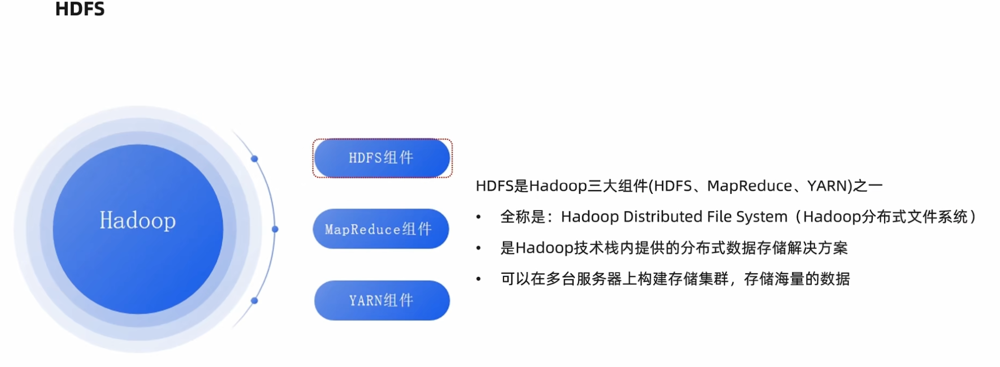


在大数据面试和实战中，需要从**策略、过程、放置逻辑、以及自愈**四个维度来构建知识体系。

#### 1. HDFS 的副本放置策略 (Replica Placement Policy)

这是最常被问到的考点：HDFS 并不是随机乱放副本的，它有一套**兼顾“安全”与“效率”**的算法。

**默认副本数为 3 的放置逻辑：**

- **第 1 个副本**：放在上传数据的那个 DataNode 上（如果是集群外提交，则挑一台磁盘不太满、CPU 不太忙的节点）。
- **第 2 个副本**：放在与第 1 个副本**不同机架**的某个节点上（保证即使整个机架的交换机坏了，数据还在）。
- **第 3 个副本**：放在与第 2 个副本**相同机架**但不同的节点上。

> **逻辑核心**：这样配置既保证了**机架感知（Rack Awareness）**的安全性，又在第 2 和第 3 副本之间节省了跨机架的网络带宽。


#### 2. 写数据的“流水线”复制 (Replication Pipeline)

很多人误以为是 NameNode 负责把数据复制三份，**其实不是**。

当你要往 HDFS 写一个 128MB 的块时：

1. **建立管道**：客户端向 NameNode 申请写，NameNode 返回 3 台 DataNode 地址（A, B, C）。
2. **流水线传输**：客户端只把数据发给 **A**；A 收到一部分（Packet）后，立刻传给 **B**；B 再传给 **C**。
3. **ACK 确认**：当 C 写完返回确认给 B，B 返回给 A，最后 A 告诉客户端：“写好了”。

这种**串行流水线**的方式比起“由客户端同时向三台机器发三份数据”，极大地节省了客户端的出口带宽。


**面试点**：客户端是怎么知道该去哪台机器读的？如果读到一半 DataNode 挂了怎么办？

**补充逻辑**：

1. **打开文件**：客户端调用 `DistributedFileSystem.open()`。
2. **获取块位置**：客户端请求 NameNode，NN 返回该文件部分或全部 Block 的位置（按距离排序）。
3. **读取数据**：客户端连接最近的 DataNode。
4. **容错处理**：如果读取过程中出错，客户端会记录该 DN 的故障，并去尝试该块的第二个副本。
5. **校验**：读取完成后，客户端会验证 Checksum。

> **Checksum（校验和）** 就像是给每一段数据打上的“**数字指纹**”。它的核心作用是：**检测数据在传输或存储过程中是否发生了损坏（位翻转、丢包等）。**
>
> 具体内容可以查看2.8.1的Checksum单元内容


#### 3. 副本自愈：如果数据坏了怎么办？

Hadoop 体系中有一套自动化的审计和修复机制：

- **数据校验和 (Checksum)**： DataNode 在存数据时会产生一个校验码。当你（或 Hive）读取数据时，客户端会重新计算校验码，如果对不上，说明数据损坏（由于磁盘磁道坏了等原因）。
- **定期心跳 (Heartbeat)**： DataNode 每 3 秒给 NameNode 发一次心跳。如果 NameNode 超过 10 分钟没收到某台机器的心跳，就会认为它“挂了”。
- **自动补全**： NameNode 发现某块数据的副本数从 3 掉到了 2，它会下令让剩下的 DataNode 把数据复制到另一台健康的机器上。


#### 4. 体系扩展：不仅仅是 HDFS

在你的大数据体系中，复制不仅发生在 HDFS 层，还发生在以下地方：

| **层次**                 | **复制内容**   | **作用**                                                     |
| ------------------------ | -------------- | ------------------------------------------------------------ |
| **元数据层 (MySQL)**     | Hive 的元数据  | 生产环境必须做 **MySQL 主从复制**，否则数据库挂了，整个 Hive 就瘫痪了。 |
| **计算中间层 (Shuffle)** | Map 输出的数据 | 在 Shuffle 阶段，数据会从 Map 节点“复制”到 Reduce 节点。**数据倾斜**往往就是这里复制的数据量不均导致的。 |
| **高可用层 (ZooKeeper)** | ZK 的状态数据  | 采用 **Paxos/ZAB 协议**的强一致性复制，保证 HS2 高可用时的信息同步。 |


## 二 HDFS基本架构及设计原理

HDFS 解决了“一台机器装不下，几千台机器怎么存”的问题。

核心架构：Master-Slave (主从) 模式 (中心化模式)


### 2.1 HDFS 架构

#### 1.基础架构分工

HDFS 遵循主/从架构，由单个 NameNode(NN) 和多个 DataNode(DN) 组成：

- **NameNode** : 负责执行有关 `文件系统命名空间` 的操作，例如打开，关闭、重命名文件和目录等。它同时还负责集群元数据的存储，记录着文件中各个数据块的位置信息。
- **DataNode**：负责提供来自文件系统客户端的读写请求，执行块的创建，删除等操作。


**NameNode (老大):**负责管理

- HDFS系统的主角色，是一个独立的进程
- 负责管理HDFS整个文件系统
- 负责管理DataNode


- 它不存真实数据，只存**元数据**（文件名、目录结构、文件被切成了几块、分别在哪台机器上）。

- <span style="color:green">*就像图书馆的索引卡。*</span>


**DataNode (小弟): **负责干活

- HDFS系统的从角色，是一个独立进程
- 主要负责数据的存储，即存入数据和取出
  数据


- 真实的数据块（Block）存在这里。
- <span style="color:green">*就像图书馆的书架。*</span>


**SecondaryNameNode:** 助教

- NameNode的辅助，是一个独立进程
- 主要帮助NameNode完成元数据整理工作（打杂）


- 帮老大分担压力，合并日志，防止老大挂了后启动太慢。


**核心机制：副本策略**

- **数据切块**：文件会被切成固定大小（默认 128MB）。
- **多副本**：默认每个块存 3 份。
  - *这就是为什么你在 HDFS 上删了文件，空间没立刻释放，或者挂了一台机器数据不丢失的原因。*


#### 2.HDFS 高可用High Availability

在 Hadoop 的早期版本中，NameNode 是整个集群的**单点故障（SPOF, Single Point of Failure）**。如果 NameNode 所在的机器掉电或宕机，整个集群就会立刻瘫痪。

目前HA 是传统的“上位替代”,在企业级生产环境中，<span style="color:red">**HA（高可用）** 已经彻底取代了传统的 **SNN（Secondary NameNode）** 模式。</span>

**HDFS HA（High Availability，高可用）** 的出现，就是为了实现“**7×24小时不间断服务**”。在面试中，这不仅是基础考点，更是考察是否理解“分布式一致性”和“故障自动转移”的分水岭。


##### **HA 的核心架构：五大组件**

要实现高可用，绝不是简单地放两台机器。它需要一套严密的组件协作体系：


**1. Active NameNode (主节点)**

- **职责**：处理客户端的所有读写请求，并把元数据的变更写入“共享存储（QJM）”。

NameNode虽然还是处理原来基本的逻辑,但是在HA里面改进了一点:

**传统 NameNode**：它是一个“单机大拿”。它把元数据改动（EditLog）直接写在**自己的本地磁盘**上。如果它挂了，磁盘里的账本别人拿不到。

**Active NN**：它是一个“透明领导”。它把元数据改动写到**共享存储（JournalNodes）**里。它必须确保这些改动被传到了“云端账本”上，这样 Standby NN 才能实时看到并跟进。


**2. Standby NameNode (备节点)**

- **职责**：实时监听“共享存储”，同步元数据。它时刻保持和 Active 节点一样的状态，随时准备顶班。

**3. JournalNodes (共享存储/QJM)**

存储的是 **EditLog（编辑日志）**。它记录的是 NameNode 上的操作记录，例如：“用户 A 在 10:01 创建了文件夹 /data”。它只存元数据的增量变化，体积非常小。

- **职责**：这是主备之间通信的“账本”。
  - Active 写，当有文件写入时，Active NN 把这条元数据修改记录写到 **JournalNodes** 集群中。
  - Standby 读,Standby NN 像看直播一样，不断从 JournalNodes 读取这些记录并应用到自己的内存里。
- **企业级重点**：通常部署为**奇数个**（如 3, 5, 7）。采用 Paxos 算法（Quorum 机制），只要超过半数（N/2 + 1）节点存活，账本就是安全的。只要 JournalNodes 集群中超过半数的节点写成功了，这条记录才算生效（这就是 **Quorum 机制**）

**4. ZKFC (ZK Failover Controller)**

- **职责**：它是 NameNode 旁边的“监视哨”。
- **动作**：它与 ZooKeeper 保持心跳。如果发现自己守护的 NameNode 挂了，它会立刻在 ZooKeeper 里发起“抢位战”。

**5. ZooKeeper (协调者)**

- **职责**：存储选举信息。它通过**临时节点（Ephemeral Node）**来判断谁是真正的“王”。

我们会在后面的内容里重点介绍ZooKeeper

> 没有提到的DataNode因为是最基本的工作方式,没有太大变化所以不属于五大组件,但是还是有一些变化需要明确
>
> 在传统模式下，DataNode 只给一个 NameNode 发心跳。但在 HA 模式下，DataNode 变得“圆滑”了：
>
> - **全量汇报**：DataNode 会同时向 Active 和 Standby 发送**块报告（Block Report）**。
> - **意义**：这让 Standby 脑子里随时有一张**“全集群块位置地图”**。一旦 Active 挂了，Standby 切换上来时不需要重新扫描几千台机器，真正实现了**“热备（Hot Standby）”**。

#####  **HA 的工作机制：元数据是如何同步的？**

这是面试中常被问到的“底层流向”题。

1. **内存同步**：Active 产生操作（如创建目录），立即写入自己的内存。
2. **写 Edits**：Active 将操作记录（EditLog）同时发送给 **JournalNodes**。
3. **读 Edits**：Standby 持续从 JournalNodes 滚动读取这些日志，并应用到自己的内存中。
4. **DataNode 汇报**：所有的 DataNode 会**同时**向 Active 和 Standby 发送块报告（Block Report）和心跳。
   - *注意*：虽然 Standby 知道块在哪，但它不会向 DataNode 发指令（比如删除块），这个权力只属于 Active。


##### **脑裂（Brain-Split）与隔离（Fencing）**

这是 HA 体系中最硬核的考点。

**1. 什么是脑裂？**

假设 Active NN 所在机器网络卡顿，ZooKeeper 以为它死了，于是把 Standby 提拔为新的 Active。此时，旧的 Active 恢复了，它觉得自己还是老大。 **结果**：两个老大同时往 JournalNodes 写数据，元数据会瞬间乱套，导致**文件系统彻底损坏**。

**2. 如何预防？—— 隔离（Fencing）机制**

HDFS 设计了多层防御（Fencing）来确保“一山不容二虎”：

- **共享存储隔离**：JournalNodes 只允许一个 NameNode 写入（基于 Epoch Number，谁的编号大谁说了算）。
- **客户端隔离**：通过 RPC 机制拒绝旧老大的请求。
- **终极手段 (SSH Fence)**：新的 Active 会通过 SSH 登录到旧老大的机器上，直接执行 `kill -9`，或者通过电源管理卡强制关机（即 **STONITH**：Shoot The Other Node In The Head）。


##### HA面试问题

**Q1：为什么 JournalNodes 必须是奇数个？**

**答**：为了满足 **Quorum（法定人数）协议**。如果是 4 个节点，挂 2 个就只剩 50%，无法确定谁是多数派。奇数个（如 3 个）挂 1 个还剩 66%，依然能保证数据的一致性和可用性。

**Q2：HA 架构下，谁负责合并 FsImage 和 Edits？**

**答**：是 **Standby NameNode**。它通过不断读取 Edits 进行 Checkpoint 操作，产生新的 FsImage 并发回给 Active。所以 HA 集群里不需要 SecondaryNameNode。

**Q3：如果 ZKFC 进程挂了，NameNode 会切换吗？**

**答**：会。ZooKeeper 会发现心跳断了，释放锁，触发 Standby 节点的 ZKFC 发起抢占。


##### HA 与非 HA 的对比

| **特性**          | **非 HA 集群 (1.x / 2.x 单点)** | **HA 高可用集群 (2.x / 3.x 企业级)** |
| ----------------- | ------------------------------- | ------------------------------------ |
| **NameNode 数量** | 1个                             | 至少 2个 (Active + Standby)          |
| **辅助角色**      | Secondary NameNode              | Standby NN + JournalNodes + ZKFC     |
| **恢复时间**      | 30分钟到数小时（需人工干预）    | **秒级**（自动完成）                 |
| **可靠性**        | 较低（有 SPOF 风险）            | **极高** (99.99% 以上)               |
| **元数据存储**    | 本地磁盘                        | **分布式共享存储 (QJM)**             |


#### 3.HDFS 联邦Federation 

在大数据面试中，如果说 **HA（高可用）** 是为了保证集群“**不死**”，那么 **Federation（联邦）** 就是为了保证集群“**能长大**”。

在原本的HA当中,图书馆只有一个管理员（NameNode），但他怕自己生病倒下（宕机），于是找了个副手（Standby NameNode）。

在顶级公司的集群里，HA和FEDRATION是**相乘**的关系，而不是**相加**的关系：

| **维度**               | **技术名称**          | **核心口诀**             | **解决的痛苦**                                               |
| ---------------------- | --------------------- | ------------------------ | ------------------------------------------------------------ |
| **纵向（Vertical）**   | **HA (高可用)**       | **“一专多能，不死之身”** | 解决“单点崩溃”导致全盘瘫痪。它让一个 NameNode 变得坚不可摧。 |
| **横向（Horizontal）** | **Federation (联邦)** | **“多官分治，无限扩容”** | 解决“单脑内存限制”。它通过增加大脑的数量来分摊负载。         |

二者互相配合

现在我们要从“痛点 -> 架构 -> 核心概念 -> 访问方式”这四个维度来系统性拆解FEDERATION。


##### 1. 为什么要搞联邦 Federation ？（痛点分析）

在 Hadoop 2.x 早期，一个集群只有一个 **NameNode**（即便有 HA，同一时间也只有一个 Active）。这会带来几个致命瓶颈：

> HA（高可用）和 Federation（联邦）并不是“二选一”的排他关系，它们更像是“插件”。
>
> 只要开启了 **HA（高可用）**，SecondaryNameNode 就已经**下岗**了。
>
>  在 HA 架构中，有一个 **Standby NameNode**。这个“副手”在闲着没事干的时候，顺手就把 SNN 以前干的活（合并日志、清理元数据）给干了。

- **内存瓶颈**：NameNode 将所有元数据（文件路径、块映射）存在内存里。1GB 内存约能管理 100 万个块。当公司业务达到数亿个文件时，单台服务器的内存再大（比如 2TB）也会被撑爆。

- **隔离性差**：全公司的任务（日志、财务、算法）都挤在一个 NameNode 上。如果某个倒霉的程序写错了逻辑，疯狂查询元数据，会导致整个公司的 HDFS 陷入瘫痪。

- **吞吐瓶颈**：单台 NameNode 的读写请求处理能力是有上限的。

不能把HA和Federation看作两个体系，实际上它们解决的是**完全不同**维度的痛苦：

| **维度**         | **HA (高可用)**                                              | **Federation (联邦)**                                        |
| ---------------- | ------------------------------------------------------------ | ------------------------------------------------------------ |
| **它救谁的命？** | 救**运维人员**的命。防止半夜 NameNode 挂了，全公司数据读不出来，导致你被叫起来修服务器。 | 救**老板钱包**和**集群上限**的命。防止数据太多，NameNode 内存撑爆了，没法再存新文件。 |
| **核心逻辑**     | **双机热备**。两个 NN 管的是**同一份**数据。                 | **多官分治**。多个 NN 分别管**不同**的数据路径。             |
| **比喻**         | 给图书馆配两个管理员，一个上班，一个在旁边看着，随时接班。   | 图书馆太大，分成了历史馆、科学馆、艺术馆，每个馆配自己的管理员。 |


##### 2. HDFS 联邦架构

在联邦架构下，NameNode 之间是**相互独立、互不通信**的。

**核心组件拆解**：

- **多个 NameNode (Namespace)**：比如 NN-1 专门管理 `/user` 目录，NN-2 专门管理 `/share` 目录。
- **共享 DataNode 资源池**：所有的 DataNode 会向集群中**所有的** NameNode 注册。
- **块池 (Block Pool)**：这是理解联邦的关键。虽然 DataNode 是共享的，但它内部会对数据进行物理隔离。


>  但是可能会问:“管理员分开了，那底层的书架（DataNode）也分开吗？”
>
> **不分开。**
>
> 所有的 DataNode（小弟）都是共享的。每一个 DataNode 都会向集群中**所有的** NameNode 注册。
>
> - 当管理员 A 说：“把这本历史书存到 1 号书架。”
> - 当管理员 B 说：“把这本科学书存到 1 号书架。”
> - 1 号书架（DataNode）会分别为它们划分出两个“抽屉”（**Block Pool**，块池），互不干扰地存放。


**业级终极形态：联邦 HA 集群 (Federated HA)**

在大厂（如阿里、美团）的 EB 级集群中，架构是长这样的：

- **横向看（联邦）：** 我们有 NN1、NN2、NN3……它们分别管不同的目录（如 `/user`、`/data`、`/tmp`）。这解决了**内存不够**的问题。
- **纵向看（HA）：** 这里的每一个 NN，其实都是**一对**（Active + Standby）。NN1 挂了，NN1 的副手顶上；NN2 挂了，NN2 的副手顶上。这解决了**服务中断**的问题。


##### 3. 核心概念：什么是块池 (Block Pool)？

这是面试官最喜欢问的细节：“既然 DataNode 是共用的，NN-1 的数据和 NN-2 的数据在磁盘上是怎么存的？”

- **定义**：Block Pool 是属于单个命名空间（Namespace）的一组 Block。
- **逻辑**：
  - 每个 NameNode 拥有一个唯一的 **Namespace ID**。
  - DataNode 上的磁盘会划分为多个目录，每个目录对应一个 Block Pool。
  - **好处**：即便 NN-1 彻底崩了，甚至格式化了，它只影响属于它的 Block Pool，而 NN-2 对应的物理数据依然稳如泰山。


##### 4. 用户怎么访问？（ViewFS vs. RBF）

有了多个 NameNode，用户就犯难了：“我以前访问 `hdfs://nameservice/data`，现在我有 5 个 NameNode，我哪知道数据在哪？”

为了实现“逻辑统一”，Hadoop 提供了两种主流方案：

**方案 A：ViewFS (旧版常用)**

- **原理**：在客户端配置一个“挂载表”。
- **效果**：
  - 访问 `/user` $\rightarrow$ 自动转给 NN-1
  - 访问 `/data` $\rightarrow$ 自动转给 NN-2
- **缺点**：配置极其麻烦。每次新增 NameNode，全公司成千上万台机器的配置文件都要改。

**方案 B：RBF (Router-Based Federation，Hadoop 3.x 推荐)**

- **原理**：在客户端和 NameNode 之间加一个**代理层 (Router)**。
- **效果**：用户只管访问 Router，Router 去查状态库（State Store），自动把请求转发到正确的 NameNode。
- **优点**：对用户透明，运维极其方便。


##### 5. 面试终极对比：HA vs. Federation

很多学生会把这两个概念搞混，面试时一定要说清楚：

> **高可用 (HA)**：是给**管理员（NameNode）**找一个“副手”。如果主管理员突然晕倒了，副手能立刻接手工作，保证图书馆不关门。

| **维度**          | **HA (高可用)**           | **Federation (联邦)**                     |
| ----------------- | ------------------------- | ----------------------------------------- |
| **解决的问题**    | **可靠性** (防止单点故障) | **扩展性** (解决内存和吞吐瓶颈)           |
| **NameNode 关系** | 一主一备 (Active/Standby) | **多个主节点**，互不隶属                  |
| **数据共享**      | 共享 EditLog (元数据同步) | **不共享元数据**，只共享 DataNode         |
| **生产建议**      | 必须配置                  | 只有当集群规模达到 PB 级/亿级文件时才考虑 |


**如果面试官问：“你们公司的 HDFS 是怎么架构的？”**

**答:**

“我们的集群采用了 **Federation 结合 HA** 的高可用架构。

1. 首先，通过 **HA 机制** 确保了 NameNode 的高可用，利用 **Standby NN** 代替了传统的 SecondaryNameNode 进行元数据检查点（Checkpoint）工作。
2. 其次，随着业务增长，单组 NameNode 的内存达到瓶颈，我们引入了 **Federation** 进行横向扩展，通过 **ViewFS**（或 RBF）实现了多命名空间的统一访问。
3. 这种架构既保证了**高可用性**，又解决了**单点内存瓶颈**。”


### 2.2 分布式系统中两种常见的工作模式

#### 2.2.1.分散汇总模式 (Scatter-Gather)

分散汇总模式（也称为 **分发-收集** 模式）是一种天然的并行计算模式，常用于需要并行处理大量数据的场景，例如 **MapReduce**。

| 步骤        | 名称                 | 执行动作                                                     | 关键特点                                                     |
| ----------- | -------------------- | ------------------------------------------------------------ | ------------------------------------------------------------ |
| 步骤 1      | 分散 (Scatter/Map)   | 主控节点（Master/Client）将一个大型任务或数据集 切分成若干独立的子任务或数据块，并将它们并行地发送给多个 工作节点（Worker/Slave）。 | 并行化：子任务之间相互独立，可以在不同的机器上同时运行。     |
| 步骤 步骤 2 | 执行 (Execute)       | 各个 工作节点 接收到自己的子任务后，独立地对分配到的数据块进行处理（例如，执行 Map 操作，数据清洗）。 | 无状态/本地计算：每个工作节点只关心自己的数据，通常不需要与其他节点通信。 |
| 步骤 3      | 汇总 (Gather/Reduce) | 各个 工作节点 完成计算后，将各自的 局部结果 返回给 主控节点 或一个指定的 汇集节点。 | 数据传输：涉及大量的网络 I/O，可能包含 Shuffle 过程（如果需要合并/分组）。 |
| 步骤 步骤 4 | 合并 (Merge)         | 主控节点/汇集节点 接收所有局部结果，执行最终的 合并、聚合或排序（例如，执行 Reduce 操作），得到最终的完整结果。 | 终态生成：生成用户所需的最终输出。                           |

**通俗总结：** 任务可以被完全切开，每个工人独立完成一部分，最后把各自的结果交上来，总指挥只负责最后相加。**速度快，但任务必须是可分割的。**


#### 2.2.2.🚦 中心调度模式 (Centralized Orchestration)

中心调度模式（也常被称为 **编排** 模式）强调由一个**中心协调者** 来定义、管理和推动整个工作流的顺序和依赖关系。它适用于涉及多个、有明确先后顺序和依赖关系的服务调用或任务。

| 步骤        | 名称                             | 执行动作                                                     | 关键特点                                                 |
| ----------- | -------------------------------- | ------------------------------------------------------------ | -------------------------------------------------------- |
| 步骤 1      | 定义工作流 (Workflow Definition) | 调度中心（Orchestrator/Master）预先加载或定义一个 有向无环图 (DAG)，明确所有任务（Task A, B, C...）的执行顺序和依赖关系。 | 任务依赖：任务 B 只有在任务 A 成功完成后才能开始。       |
| 步骤 步骤 2 | 启动与监控 (Trigger & Monitor)   | 调度中心 启动第一个 无依赖 的任务（如 Task A）。在任务执行过程中，调度中心会持续监控 任务的状态（运行中、成功、失败）。 | 状态管理：调度中心持有整个工作流的全局状态。             |
| 步骤 3      | 顺序驱动 (Sequential Drive)      | 当 调度中心 确认一个任务（如 Task A）成功完成 后，它会根据 DAG 触发其所有 下游依赖 的任务（如 Task B）。 | 单一决策点：所有任务的执行或重试都由调度中心决定和驱动。 |
| 步骤 步骤 4 | 反馈与结束 (Feedback & Complete) | 整个工作流直到所有任务都按顺序成功执行完毕，调度中心 宣布工作流完成。如果任何任务失败，调度中心负责根据策略进行 重试 或 告警。 | 流程控制：确保复杂业务流程的完整性、顺序性和可控性。     |

**通俗总结：** 任务之间有严格的 **先后顺序** 和 **依赖关系**。有一个 **总指挥（调度中心）** 像交警一样，严格控制和检查每个步骤是否完成，确保整个流水线顺利、按部就班地走下去。


### 2.3 文件系统命名空间

HDFS 的 `文件系统命名空间` 的层次结构与大多数文件系统类似 (如 Linux)， 支持目录和文件的创建、移动、删除和重命名等操作，支持配置用户和访问权限，但不支持硬链接和软连接。`NameNode` 负责维护文件系统名称空间，记录对名称空间或其属性的任何更改。


### 2.4 数据复制

由于 Hadoop 被设计运行在廉价的机器上，这意味着硬件是不可靠的，为了保证容错性，HDFS 提供了数据复制机制。HDFS 将每一个文件存储为一系列**块**，每个块由多个副本来保证容错，块的大小和复制因子可以自行配置（默认情况下，块大小是 128M，默认复制因子是 3）。

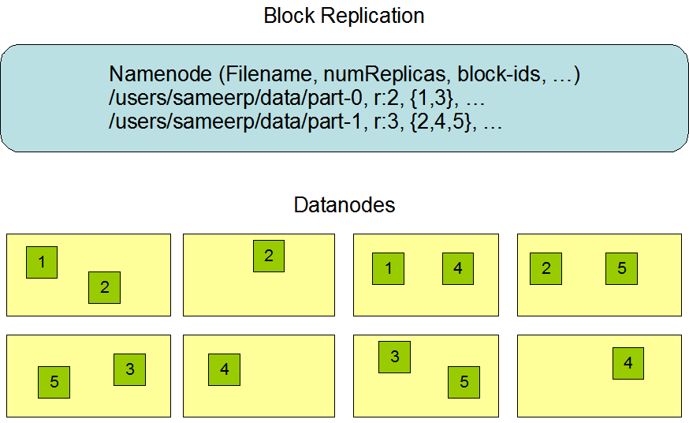


### 2.5 数据复制的实现原理

大型的 HDFS 实例在通常分布在多个机架的多台服务器上，不同机架上的两台服务器之间通过交换机进行通讯。在大多数情况下，同一机架中的服务器间的网络带宽大于不同机架中的服务器之间的带宽。因此 HDFS 采用机架感知副本放置策略，对于常见情况，当复制因子为 3 时，HDFS 的放置策略是：

在写入程序位于 `datanode` 上时，就优先将写入文件的一个副本放置在该 `datanode` 上，否则放在随机 `datanode` 上。之后在另一个远程机架上的任意一个节点上放置另一个副本，并在该机架上的另一个节点上放置最后一个副本。此策略可以减少机架间的写入流量，从而提高写入性能。

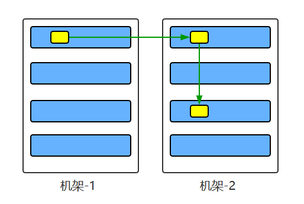

如果复制因子大于 3，则随机确定第 4 个和之后副本的放置位置，同时保持每个机架的副本数量低于上限，上限值通常为 `（复制系数 - 1）/机架数量 + 2`，需要注意的是不允许同一个 `dataNode` 上具有同一个块的多个副本。


对于以上内容 我们把这个过程拆解为三个核心逻辑：**就近原则**、**机架保命原则**和**冗余负载控制**,梳理一下:


**1. 基础逻辑：复制因子为 3 时（最经典情况）**

HDFS 就像一个聪明的快递员，他送货的逻辑是这样的：

- **第一步：就近（节省体力）**
  - 如果你就在仓库（DataNode）里操作，他就直接把第一个副本放在你脚下的机器上。
  - **目的**：本地写入速度最快，完全不占网络带宽。
- **第二步：跨机架保命（防灾）**
  - 他把第二个副本送到**另一个远程机架**。
  - **目的**：如果第一个机架的交换机坏了或停电了，第二个机架的数据还能用。这是为了**数据安全**。
- **第三步：同机架复制（省钱）**
  - 他在第二个机架里再找一台机器放下第三个副本。
  - **目的**：既然数据已经通过漫长的“跨机架”网络传到了机架 B，那么在机架 B 内部复制一次是非常快的，不需要再次跨越昂贵且拥挤的核心交换机。


**2.进阶逻辑：当复制因子 > 3 时（资源上限控制）**

这一部分也就是你提到的那个公式：`上限 = (复制系数 - 1) / 机架数量 + 2`。

你可以这样理解：**HDFS 严防“把鸡蛋放在同一个篮子里”。**

- **为什么要设上限？**

  如果你的副本数很多（比如 10 个），而你只有 3 个机架。如果 HDFS 偷懒把 8 个副本都塞进机架 A，那么机架 A 一旦断电，你瞬间就丢失了 80% 的备份，风险太高。

- **公式的意义**：它动态计算了每个机架能承受的“最大副本数”。

  - 比如：10 个副本，3 个机架。
  - 上限 $\approx (10 - 1) / 3 + 2 = 5$。
  - 这意味着没有任何一个机架可以存放超过 5 个副本。

- **禁忌**：最后那句“不允许同一个 DataNode 具有同一个块的多个副本”是死命令。哪怕你副本设为 100，只要你只有 10 台机器，你也只能存 10 份。


**3. 通俗总结：为什么要这么设计？**

这套体系的核心哲学是：**“大灾不灭，小灾不乱，平时飞快”。**

| **场景**     | **HDFS 的应对**                  | **结果**     |
| ------------ | -------------------------------- | ------------ |
| **平时写入** | 只需跨一次机架（1 次跨机架流量） | 写入性能极高 |
| **单机挂了** | 其他机器都有备份                 | 秒级恢复     |
| **整架挂了** | 另一个机架还有两份备份           | 业务不中断   |

<span style="color:red">**面试常考题：**</span>

> “如果用户在上传文件时，机架感知（Rack Awareness）没配置好，会发生什么？”
>
> **答案**：HDFS 会认为所有机器都在同一个机架上。这样它就会随机放副本。万一那个机架的交换机坏了，你的数据就彻底丢失了（Data Lost），即便你设了 3 副本也没用。


### 2.5 (拓展) Hadoop 3.x 的王牌特性：纠删码 (Erasure Coding, EC)

这是企业级生产环境节省成本的神器，也是 Hadoop 3 区别于 Hadoop 2 最重要的面试考点。

在企业级大数据平台上，存储成本往往是极高昂的一项支出。如果我有 100PB 的原始数据，按传统的 3 副本存，我得买 300PB 的硬盘。**纠删码的出现，直接把这 300PB 变成了约 150PB，且安全性几乎不变。**


#### 1. 核心原理：不再是“复印”，而是“算方程”

传统的 **副本（Replication）** 是物理拷贝，像复印件。 而 **纠删码（EC）** 是通过数学算法（通常是 **Reed-Solomon，简称 RS 算法**）计算出“校验块”。


**数学逻辑（极简版）：**

假设你有两个数据 $d1$ 和 $d2$：

1. 我们根据公式算出两个校验码：$p1 = d1 + d2$，$p2 = d1 + 2d2$。
2. 现在你手里有 $\{d1, d2, p1, p2\}$ 这 4 个数。
3. **高容错性**：即便 $d1$ 和 $d2$ 同时丢了，你通过 $p1$ 和 $p2$ 组成的二元一次方程组，依然能解出 $d1$ 和 $d2$ 的值。


**实际原理**

**方案 A：3 副本 (Replication)**

- **存储逻辑**：每一份数据原样复印 3 份。
- **总占用空间**：$100GB \times 3 = 300GB$。
- **存储开销**：额外多花了 **200%** 的空间（即 200GB 的冗余）。
- **利用率**：$1/3 \approx 33.3\%$。
- **容错能力**：挂掉任意 2 台存该数据的机器，数据不丢。

**方案 B：纠删码 RS (6,3)**

- **存储逻辑**：将 100GB 数据切成 6 份（每份约 16.6GB），再根据算法算出 3 份校验数据。
- **总占用空间**：$6 \text{份数据} + 3 \text{份校验} = 9 \text{个单元}$。
- **实际存储量**：$100GB \times (9/6) = 150GB$。
- **存储开销**：只多花了 **50%** 的空间（即 50GB 的冗余）。
- **利用率**：$6/9 \approx 66.7\%$。
- **容错能力**：挂掉任意 3 台存该单元的机器，数据不丢。

原理就是**在这 9 个块中，只要任意 6 个块还在，剩下的 3 个块无论丢了哪几个，都能通过代数运算推导出来。这就像一个方程组：$x + y + z = 10$。如果你知道其中两个数，永远能算出第三个数。**

| **指标**           | **3 副本** | **EC (RS 6,3)** | **结论**               |
| ------------------ | ---------- | --------------- | ---------------------- |
| **总空间**         | 300GB      | 150GB           | **空间直接减半 (50%)** |
| **存储效率**       | 33%        | 66%             | **效率翻倍**           |
| **最大允许宕机数** | 2 台       | **3 台**        | **更省空间，且更安全** |


#### 2. HDFS 中的 EC 布局：从“连续”到“条带”

这是理解 EC 的物理关键。

- **传统副本（Contiguous Layout）**：一个 128MB 的 Block 完完整整地存在一台机器上。
- **纠删码（Striped Layout / 条带化）**：文件不再按 Block 物理切分，而是按更小的 **Cell（默认 64KB）** 像“搓麻将”一样分发到不同机器。


**例子：RS (6,3) 方案**

- **6 个数据单元 (Data Cells)** + **3 个校验单元 (Parity Cells)**。
- 数据会被切成 6 份，算出 3 份校验。这 9 份数据分别存放在 **9 台不同的 DataNode** 上。
- **结果**：只要这 9 台机器里不同时挂掉 4 台，数据就永远能通过数学计算还原。
- **存储开销**：$9 / 6 = 1.5$ 倍（相比副本的 3 倍，节省了一半空间！）。


- **核心痛点**：传统的 3 副本策略存储开销是 200%（存 1T 需要 3T 空间）。
- **解决方案**：EC 技术。它像 RAID 5/6 一样，通过校验位来恢复数据。
- **效果**：存储开销从 3 倍降到了 **1.5 倍** 左右，且容错能力不减。
- **面试追问**：既然这么好，为什么不全部用 EC？
  - *答案*：EC 在修复数据时需要大量的网络 IO 和 CPU 计算（需要算公式还原数据），而副本策略直接复制即可。因此，**冷数据用 EC，热数据用副本**。

| **维度**       | **3 副本 (Replication)** | **纠删码 (EC)**                                   |
| -------------- | ------------------------ | ------------------------------------------------- |
| **空间利用率** | 33% (低)                 | **67%~80% (高)**                                  |
| **读取性能**   | **极高** (直接读)        | **一般** (如果是条带化读，需跨多节点凑数据)       |
| **修复代价**   | **极低** (直接拷贝副本)  | **极高** (需读出剩余所有块 + CPU 密集计算还原)    |
| **计算压力**   | 几乎为零                 | **较大** (读写都要进行编解码计算)                 |
| **小文件支持** | 好                       | **极差** (小文件强行 EC 会导致条带不满，反而浪费) |


#### 面试高频追问

##### Q1：EC 模式下，如果读一个块，是不是要同时连接 9 台机器？

**答**：是的（以 RS 6+3 为例）。在条带模式下，客户端需要从 6 台存储数据单元的 DN 上并行读取 Cell。这增加了网络连接数，所以对**网络带宽**的要求比副本模式更高。

##### Q2：HDFS 怎么开启 EC？

**答**：Hadoop 3.x 提供了 `hdfs ec` 命令。你可以给某个具体的**目录**设置“EC 策略”。比如：`hdfs ec -setPolicy -policy RS-6-3-1024k -path /archive`。这样存入该目录的文件会自动按 EC 存储。

##### Q3：为什么 EC 修复比副本修复慢很多？

**答**：副本修复只是简单的“复制粘贴”。而 EC 修复（假设挂了一台 DN）：

1. 必须从剩下的机器里读出**所有**相关的数据单元和校验单元。
2. 传回给某台机器。
3. 调用 **CPU 运算**（解方程）算出丢失的数据。
4. 再写回新的 DN。 **瓶颈在 CPU 和集群总线带宽。**


### 2.6 副本的选择

为了最大限度地减少带宽消耗和读取延迟，HDFS 在执行读取请求时，优先读取距离读取器最近的副本。如果在与读取器节点相同的机架上存在副本，则优先选择该副本。如果 HDFS 群集跨越多个数据中心，则优先选择本地数据中心上的副本。


这段话，揭示了大数据(分布式)处理中一个至高无上的准则：**移动计算，而不是移动数据（Move Code, Not Data）。**

在大数据环境下，由于数据量动辄几百 GB 甚至 TB，通过网络“搬运”数据是非常昂贵的。因此，HDFS 的读取策略本质上就是一个**“省体力”的选择过程**。

**1. 读取副本的“优先级（Distance）”算法**

HDFS 将节点间的距离量化，优先级由高到低排列如下：

1. **Node-Local（节点本地）**：
   - **场景**：计算任务（比如 Map 任务）恰好被分配到了存有该数据块的 DataNode 上。
   - **优势**：直接从本地磁盘读，**带宽消耗为 0**。
2. **Rack-Local（机架本地）**：
   - **场景**：同一个机架内，DataNode A 想读 DataNode B 的数据。
   - **优势**：数据只经过机架顶部的交换机，**延迟极低**。
3. **Off-Rack（跨机架）**：
   - **场景**：数据在机架 1，读取器在机架 2。
   - **优势**：没有优势，这是**最差情况**，会占用核心交换机带宽。
4. **Cross-Data-Center（跨数据中心）**：
   - **场景**：数据在北京机房，读取器在上海机房。
   - **优势**：极其罕见。除非本地机房副本全部损坏，否则 HDFS 不会这么干。


**2. 这个策略对你写 Hive SQL 有什么影响？**

虽然读取策略是自动的，但它解释了你之前遇到的一些疑惑：

- **为什么有时候 Hive 运行得飞快，有时候又很慢？** 如果你的 YARN 集群非常拥挤，它可能无法将任务分配到数据所在的节点（Node-Local 失败），甚至无法分配到同一个机架（Rack-Local 失败）。当大量的计算都变成了“跨机架读取”时，你的 SQL 就会变慢。
- **短路读取（Short-Circuit Local Reads）**： 在高级配置中，如果计算和数据在同一个节点，HDFS 甚至可以跳过 DataNode 的网络接口，直接由客户端去读磁盘文件。这比走网络协议栈还要快。


**3. 体系化串联：从“存”到“读”**

我们将你之前学到的知识点连起来看：

- **存的时候（Write）**：为了安全，HDFS 故意把副本分散在**不同机架**（机架感知策略）。
- **读的时候（Read）**：为了速度，HDFS 拼命寻找**最近**的那个副本（读取优先级策略）。

> **这就是分布式系统的艺术**：写的时候多花点网络代价去分散数据（保命），读的时候利用这种分散性，让全集群的机器都能就近拿到数据（提速）。


**4. 数据倾斜的“预警”**

读数据虽然有优先级，但如果**所有读取器**都发现：

> “哎呀，最近的副本都在 DataNode 1 号机上！”

于是几千个任务都涌向 1 号机去读数据，那么 1 号机的**网卡和磁盘 IO** 就会瞬间爆炸。这种现象被称为**“热点（Hotspot）”**，也是数据倾斜的一种表现形式。


### 2.7 架构的稳定性

#### 1. 心跳机制和重新复制

每个 DataNode 定期向 NameNode 发送心跳消息，如果超过指定时间没有收到心跳消息，则将 DataNode 标记为死亡。NameNode 不会将任何新的 IO 请求转发给标记为死亡的 DataNode，也不会再使用这些 DataNode 上的数据。 由于数据不再可用，可能会导致某些块的复制因子小于其指定值，NameNode 会跟踪这些块，并在必要的时候进行重新复制。


#### 2. 数据的完整性

由于存储设备故障等原因，存储在 DataNode 上的数据块也会发生损坏。为了避免读取到已经损坏的数据而导致错误，HDFS 提供了数据完整性校验机制来保证数据的完整性，具体操作如下：

当客户端创建 HDFS 文件时，它会计算文件的每个块的 `校验和`，并将 `校验和` 存储在同一 HDFS 命名空间下的单独的隐藏文件中。当客户端检索文件内容时，它会验证从每个 DataNode 接收的数据是否与存储在关联校验和文件中的 `校验和` 匹配。如果匹配失败，则证明数据已经损坏，此时客户端会选择从其他 DataNode 获取该块的其他可用副本。


#### 3.元数据的磁盘故障

`FsImage` 和 `EditLog` 是 HDFS 的核心数据，这些数据的意外丢失可能会导致整个 HDFS 服务不可用。为了避免这个问题，可以配置 NameNode 使其支持 `FsImage` 和 `EditLog` 多副本同步，这样 `FsImage` 或 `EditLog` 的任何改变都会引起每个副本 `FsImage` 和 `EditLog` 的同步更新。


#### 4.支持快照

快照支持在特定时刻存储数据副本，在数据意外损坏时，可以通过回滚操作恢复到健康的数据状态。


#### 5. 安全模式 (SafeMode) 

**—— “工厂启动的保护期”**

这是 NameNode 启动时的自我保护机制。

- **逻辑**：当 NameNode 刚启动时，它并不知道哪些 DataNode 还活着，也不知道数据块是否全。此时它进入 **SafeMode**。
- **操作**：在安全模式下，HDFS **只读不写**。NameNode 会等待 DataNode 上报块信息（Block Report），只有当副本数正常的块比例达到一个阈值（默认 **99.9%**）后，才会自动退出。
- **实战提示**：有时候你刚开机就去写数据会报错，就是因为还没过这个保护期。


#### 6. 脑裂预防与高可用 (HA & ZKFC) 

**—— “谁才是真老大”**

第 3 点（元数据磁盘故障）解决了“记录丢了”的问题，但没解决“老板跑了”的问题。

- **双 NameNode**：生产环境通常有 **Active**（干活）和 **Standby**（备份）两个老大。
- **共享存储 (QJM)**：它们通过一组 **JournalNodes** 共享 EditLog，保证元数据绝对一致。
- **ZKFC (ZooKeeper Failover Controller)**：监控老大的健康。如果 Active 挂了，ZooKeeper 自动把 Standby 顶上去。
- **隔离 (Fencing)**：防止出现两个 Active（脑裂），系统会强制关掉旧老大的权限。


#### 7. 数据平衡 (Balancer) 

**—— “别让有的机器累死”**

随着时间推移，你的 DataNode 可能会出现“贫富差距”：新加的机器空得很，旧机器快爆了。

- **问题**：数据分布不均会导致 IO 性能不均衡，引发你最担心的**数据倾斜**。
- **解决**：HDFS 提供了 `balancer` 工具。它会在后台默默地把数据块从忙的机器移动到闲的机器，且不影响业务运行。


#### 8. 集中式缓存管理 (Centralized Cache Management)

这是 Hadoop 2.x 引入的提速黑科技。

- **原理**：你可以指定某些高频访问的热点数据（比如 Hive 的维度表）**永久驻留在 DataNode 的内存中**，而不是磁盘上。
- **效果**：这样读取时可以实现“零拷贝”，极大地提升了稳定性查询的响应速度。


### 2.8其他

#### 2.8.1. Checksum **（校验和）** 

简单来说，**Checksum（校验和）** 就像是给每一段数据打上的“**数字指纹**”。

它的核心作用是：**检测数据在传输或存储过程中是否发生了损坏（位翻转、丢包等）。**

在 HDFS 这种分布式环境下，由于数据运行在廉价硬件上，磁盘坏道或网络抖动是常态。如果没有 Checksum，你读到的数据可能已经“变质”了，但程序却一无所知，这会导致灾难性的计算错误。


**所以工作原理**:

在 HDFS 中，校验并不是针对整个 128MB 的块（Block）进行的，因为块太大，一旦发现错误就要重传整个块，效率太低。

##### 1. 颗粒度：Chunk（数据块分段）

HDFS 默认每 **512 字节**（Byte）的数据就会计算一个 Checksum。这个 Checksum 本身很小（通常是 4 字节的 CRC-32 校验码）。

> 我们会在接下来2.8.2介绍**三个逻辑层级**：**Block（块）**、**Packet（数据包）** 和 **Chunk（校验块）**。

##### 2. 写入流程（计算与存储）

当客户端（Client）往 HDFS 写数据时：

- 客户端会把数据切成一个个 Chunk。
- 为每个 Chunk 计算一个 Checksum。
- **存储位置**：这些 Checksum 不会和原始数据混在一起，而是存储在 DataNode 上一个专门的 **`.meta` 隐藏文件**中。如果你去 HDFS 的底层磁盘看，你会发现每个数据块文件 `blk_xxxx` 旁边都有一个对应的 `blk_xxxx_yyyy.meta` 文件。

##### 3. 读取流程（校验与比对）

当客户端（或 Hive 任务）读取数据时：

- 它会同时读取数据块和对应的 `.meta` 文件。
- 客户端会根据读到的数据**重新计算**一遍 Checksum。
- **对暗号**：将新算的 Checksum 与 `.meta` 文件里存的旧 Checksum 进行比对。


#### 2.8.2. HDFS 数据单位“套娃”体系

上文提到了checksum会分为一个个chunck,这可能会让读者产生疑问:我记得之前hdfs也会划分block那么和这个冲突吗?

简单直接的回答是：**完全不冲突，它们是“大桶套小盆，小盆装水杯”的层级关系。**

我们需要把 HDFS 的数据单位分成**三个逻辑层级**：**Block（块）**、**Packet（数据包）** 和 **Chunk（校验块）**。


**HDFS 数据单位“套娃”体系**

我们可以用快递运输来类比：

##### 1. Block (数据块) —— 逻辑存储单位

- **大小**：默认 128MB。
- **作用**：这是 **NameNode 管理的最小单元**。NameNode 的内存里记录的就是“文件 A 由哪几个 Block 组成，分别在哪些机器上”。
- **类比**：一个巨大的**集装箱**。

##### 2. Packet (数据包) —— 网络传输单位

- **大小**：默认 64KB。
- **作用**：这是 **DataNode 之间流式传输（Pipeline）的最小单位**。写数据时，客户端不是一次性把 128MB 甩给 DataNode，而是切成一个个 64KB 的 Packet 顺着管道传过去。
- **类比**：集装箱里的一个个**纸箱**。

##### 3. Chunk (校验块) —— 磁盘校验单位

- **大小**：默认 512 字节 (+ 4 字节校验位)。
- **作用**：这是 **数据完整性的最小单位**。
- **类比**：纸箱里的一个个**小包装**。每个小包装里都有一张“合格证”（Checksum）。

------

##### 它们是如何协同工作的？（面试杀手锏）

当你向 HDFS 写入一个文件时，底层的动作是这样的：

1. **切块**：客户端把文件按 128MB 切成 **Block**。
2. **切包**：在写某个 Block 时，客户端会在内存中起一个 `dataQueue`（数据队列），把数据切成 64KB 的 **Packet**。
3. **算校验**：在每个 Packet 内部，会进一步拆成 512B 的 **Chunk**。每 512B 算出一个 4B 的校验码。
4. **封装发送**：一个 64KB 的 Packet 最终包含：**数据内容 + 所有的 Chunk 校验码**。
5. **落盘**：DataNode 收到 Packet 后，把数据写入磁盘的 `.data` 文件，把校验码写入 `.meta` 文件。

------

##### 为什么搞得这么复杂？

面试官可能会问：**“既然有 Block 了，为什么还要分 Packet 和 Chunk？”**

- **为什么要 Packet（64KB）？** 如果直接传 128MB，网络一旦波动，重传代价太大。如果只有几字节就传一次，网络请求头（Header）比数据还大，浪费带宽。**64KB 是网络吞吐量和容错重传的平衡点。**
- **为什么要 Chunk（512B）？** 为了精准定位损坏。如果 128MB 只有一个校验码，只要坏了一个比特，整个 128MB 都要作废。有了 512B 一位的 Checksum，HDFS 能迅速定位到到底是哪一小段坏了，修复效率极高。


##### 知识体系表格

| **单位**   | **默认大小** | **负责人**        | **应用场景**            |
| ---------- | ------------ | ----------------- | ----------------------- |
| **Block**  | 128MB        | NameNode          | 存储分配、负载均衡      |
| **Packet** | 64KB         | DataNode / Client | 网络流式传输 (Pipeline) |
| **Chunk**  | 512B         | Client / DataNode | 磁盘 IO 校验 (Checksum) |


#### **3.8.3 Standby NN**


## 三、HDFS 的特点

### 3.1 高容错

由于 HDFS 采用数据的多副本方案，所以部分硬件的损坏不会导致全部数据的丢失。


但是高容错也会带来代价:需要考虑时间与空间的平衡

**深入理解**：高容错不代表“零风险”。副本策略是**以空间换安全**（3倍存储成本）。

**补充点——延迟感知**：当某个 DataNode 响应极慢（尚未完全损坏）时，HDFS 会启动**推测执行（Speculative Execution）**。它会在另一台节点上启动相同的读取任务，谁先返回用谁。


### 3.2 高吞吐量

HDFS 设计的重点是支持高吞吐量的数据访问，而不是低延迟的数据访问。


**深入理解**：为什么 HDFS 做不到低延迟？

- **寻道时间**：HDFS 的设计假设是“读取大块数据的时间远大于寻道时间”。
- **元数据开销**：每次请求都要先问 NameNode，这个往返过程对毫秒级的请求太慢了。

**补充点——适用场景**：HDFS 像一列**货运火车**（一次运几千吨，起步慢）；MySQL 像一辆**顺风车**（一次坐几个人，随叫随到）。


### 3.3 大文件支持

HDFS 适合于大文件的存储，文档的大小应该是是 GB 到 TB 级别的。


为什么讨厌“小文件”？

**深入理解**：这是你必须记住的**“150字节法则”**。

- 无论文件多小（哪怕只有 1KB），NameNode 都要在内存中用大约 **150 字节**来存它的元数据。
- **后果**：1 亿个 1KB 的文件会吃掉 NameNode 约 15GB 内存，而实际才存了 100GB 数据。这会让价值百万的集群因为 NameNode 内存溢出而瘫痪。

**补充点——解决方案**：如果你有大量小文件，通常需要用到 **Hadoop Archives (HAR)** 或序列化文件（**Sequence Files**）来合并它们。


### 3.4 简单一致性模型

HDFS 更适合于一次写入多次读取 (write-once-read-many) 的访问模型。支持将内容追加到文件末尾，但不支持数据的随机访问，不能从文件任意位置新增数据。


为什么不支持随机访问?

**深入理解**：

- HDFS 的数据是**分块（Block）** 存储且有副本的。如果你在文件中间插入 1 字节，会导致后面所有的字节位移，这意味着所有的副本、所有的块都要重新计算和重写。在分布式环境下，这会导致极严重的 **一致性冲突** 。

**补充点——追加（Append）的局限**：

- 虽然 2.x 版本支持了 `Append`，但也只能在文件末尾追加，且同一时间只能有一个写入者（单 Writer 模式）。


### 3.5 跨平台移植性

HDFS 具有良好的跨平台移植性，这使得其他大数据计算框架都将其作为数据持久化存储的首选方案。

**深入理解**：HDFS 是用 **Java** 编写的。

**补充点——生态护城河**：

- 因为 HDFS 稳定且开源，所以 Spark、Flink、HBase、Impala 等框架都优先适配它。学好 HDFS，就等于拿到了进入所有大数据框架的“入场券”。


## 附：图解HDFS存储原理

### 1. HDFS写数据原理


### 2. HDFS读数据原理

<div align="center">  </div>


### 3. HDFS故障类型和其检测方法

<div align="center">  </div>

<div align="center">  </div>


**第二部分：读写故障的处理**

<div align="center">  </div>


**第三部分：DataNode 故障处理**

<div align="center">  </div>


**副本布局策略**：

<div align="center">  </div>


## Hadoop面试


**Q1:你能详细说说 NameNode 它是怎么管理元数据的吗？比如说它是如何知道每个文件分布在哪些 DataNode 上，以及如果 NameNode 挂掉，会怎么样保障数据的可用性？**


**答:**

第一部分：架构组件与核心职责

HDFS 采用经典的 **Master/Slave（主从）架构**，主要由 NameNode、DataNode 和 Client 组成

- **NameNode (Master)**：是系统的‘大脑’。它负责维护**文件系统命名空间**（Namespace），管理目录树及文件到 Block 的映射关系。关键点是：元数据全部存储在 NameNode 的**内存**中，以保证极高的查询响应速度。
- **DataNode (Slave)**：是具体工作单元。它负责实际的**物理存储**。数据被切分为固定大小的 **Block（默认128MB）** 存在 DataNode 的本地磁盘上。它通过心跳（Heartbeat）和块报告（Block Report）向 NameNode 汇报状态。
- **Client**：代表用户进行操作，它通过向 NameNode 获取元数据，然后直接与 DataNode 进行并发读写，这种‘元数据与数据流分离’的设计，避免了 Master 节点成为带宽瓶颈。”


第二部分：Master 与 Slave 的交互逻辑

“两者的关系可以概括为：**指令下达与状态上报**。

1. **心跳机制**：DataNode 定期向 NameNode 发送心跳，证明自己还活着。
2. **块汇报**：DataNode 启动或定期上报自己拥有的所有块信息，NameNode 据此构建全局的块映射表。
3. **副本补偿**：如果 NameNode 发现某个 DataNode 失联导致副本数不足，会主动下令让其他存活的 DataNode 进行异步复制，实现系统的**自我修复（Self-healing）**。”


第三部分：为什么适合大规模存储？（体现深度）

“HDFS 之所以成为大数据基石，主要因为以下三点设计哲学：

1. **块抽象与水平扩展**：通过将文件切分为 Block，一个超大文件（如 10TB）可以分布在数千台廉价服务器上，通过增加节点即可线性扩展存储容量。
2. **流式数据访问（Streaming Data Access）**：HDFS 牺牲了随机读写性能，通过‘一次写入、多次读取’的模型，实现了极高的**顺序读写吞吐量**，这非常契合离线批处理场景。
3. **高容错性与机架感知**：通过多副本策略及**机架感知（Rack Awareness）**，它能容忍单机甚至整架交换机的故障，极大地降低了对硬件稳定性的依赖（可以使用廉价机器）。”


**Q2:什么是机架感知与多副本策略**

**答:**


1.什么是机架感知 (Rack Awareness)？

简单来说，**机架感知**就是 HDFS 的一套“地理位置地图”。它让 NameNode 知道：

- 哪些 DataNode 挨在一起（在同一个机架上）？
- 哪些 DataNode 隔得很远（在不同的机架上）？

**为什么要费这个劲？** 因为在数据中心里，**同一个机架**的机器通常共用一个交换机（Switch）。

- **痛点 A**：如果这个交换机坏了，整个机架的机器都会失联。
- **痛点 B**：跨机架传输数据的速度（网络带宽），远比同一个机架内传输慢得多。


2.核心算法：副本存放策略 (以 3 副本为例)

这是面试中最爱考的**原题**，请务必背下这套“1-2-3”逻辑：

1. **第 1 个副本**：放在上传数据的那个 DataNode 上（**就近原则**）。如果是集群外提交，则随机挑一台磁盘不太满的。
2. **第 2 个副本**：放在**另一个机架**的随机节点上（**防灾原则**）。这样即使第一个机架的交换机炸了，数据还在另一个机架。
3. **第 3 个副本**：放在与第 2 个副本**相同机架**但**不同节点**上（**效率原则**）。既然数据已经跨机架传到了第二个机架，那么在机架内部再复制一次是非常快的。

**总结一句话**：既保证了“机架级”的容错，又尽量减少了“跨机架”的网络流量。


# Yarn

我们始终需要思考:

1）如何管理集群资源？

2）如何给任务合理分配资源？

YARN是一个资源调度平台，负责为运算程序提供服务器运算资源，相当于一个分布式的操作系统平台，用户可以将各种服务框架部署在 YARN 上，由 YARN 进行统一地管理和资源分配。

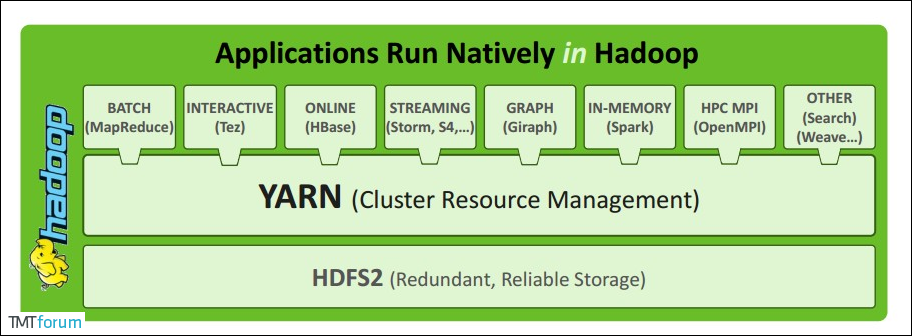

而之后会提到的MapReduce等运算程序则相当于运行于操作系统之上的应用程序。所以YARN负责调度,MapReduce在此基础上才能进行运算.


## YARN架构

YARN 作为一个资源管理、任务调度的框架，主要包含ResourceManager、NodeManager、ApplicationMaster和Container模块。


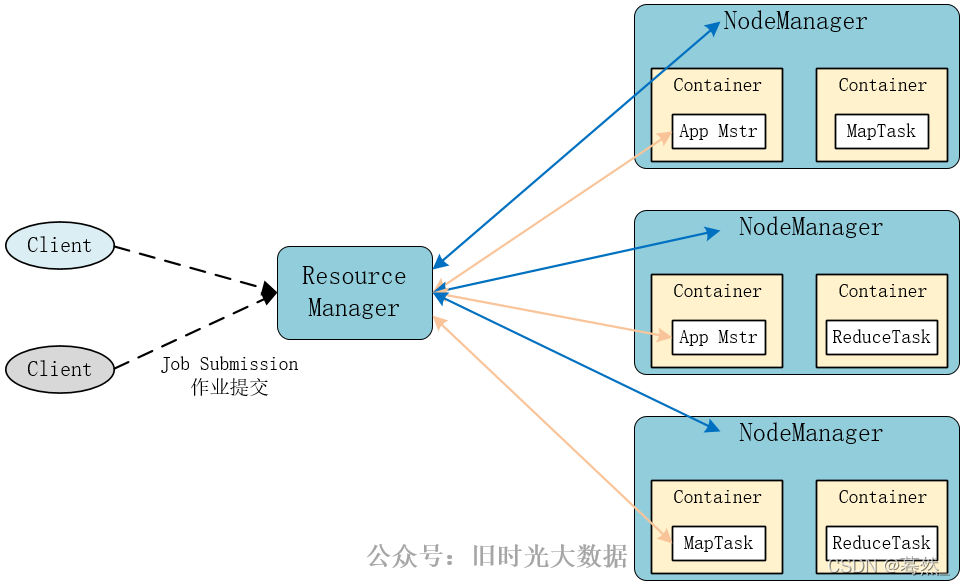


主角色:Resource Manager:整个集群资源的调度者,负责协调调度各个程序所需要的资源

从角色:NodeManager:单个服务器的资源调度者,负责调度单个服务器上的资源提供给应用程序使用


**1. ResourceManager (RM) —— 总经理 / CEO**

`ResourceManager` 通常在独立的机器上以后台进程的形式运行，它是整个集群资源的主要协调者和管理者。`ResourceManager` 负责给用户提交的所有应用程序分配资源，它根据应用程序优先级、队列容量、ACLs、数据位置等信息，做出决策，然后以共享的、安全的、多租户的方式制定分配策略，调度集群资源。

**角色**：整个集群的最高决策者。

**职责**：负责整个集群资源的**统一分配和调度**。它知道每一台机器还有多少内存和 CPU。

**面试重点**：RM 包含两个主要组件：**调度器 (Scheduler)**（负责分配资源，不负责监控）和 **应用程序管理器 (ApplicationsManager)**（负责接收任务提交）。


处理客户端请求,监控NodeManager,启动或监控ApplicationMaster,资源的分配与调度


**2.NodeManager (NM) —— 车间主任 / 门店经理**

`NodeManager` 是 YARN 集群中的每个具体节点的管理者。主要负责该节点内所有容器的生命周期的管理，监视资源和跟踪节点健康。具体如下：

- 启动时向 `ResourceManager` 注册并定时发送心跳消息，等待 `ResourceManager` 的指令；
- 维护 `Container` 的生命周期，监控 `Container` 的资源使用情况；
- 管理任务运行时的相关依赖，根据 `ApplicationMaster` 的需要，在启动 `Container` 之前将需要的程序及其依赖拷贝到本地。


**角色**：管理**单台机器**的资源。

**职责**：负责该节点上所有 Container 的生命周期管理，并向 RM 汇报自己家里的“余粮”（剩余资源）和运行情况。


管理单个节点上的资源

处理来自ResourceManager的命令

处理来自ApplicationMaster的命令


**3.ApplicationMaster (AM) —— 项目经理 (每个任务一个)**

在用户提交一个应用程序时，YARN 会启动一个轻量级的进程 `ApplicationMaster`。`ApplicationMaster` 负责协调来自 `ResourceManager` 的资源，并通过 `NodeManager` 监视容器内资源的使用情况，同时还负责任务的监控与容错。具体如下：

- 根据应用的运行状态来决定动态计算资源需求；
- 向 `ResourceManager` 申请资源，监控申请的资源的使用情况；
- 跟踪任务状态和进度，报告资源的使用情况和应用的进度信息；
- 负责任务的容错。


**角色**：每个具体任务（如一个 Spark 作业）的负责人。

**职责**：

- 向 RM **申请资源**（要 Container）。
- 拿到资源后，告诉 NM 启动计算。
- **监控任务进度**。如果某个子任务挂了，AM 负责让它重启。

**注意**：AM 是运行在 Container 里的。


为应用程序申请资源并分配给内部的任务

任务的监督与容错


**4.Container —— 生产车间 / 资源箱**

`Container` 是 YARN 中的资源抽象，它封装了某个节点上的多维度资源，如内存、CPU、磁盘、网络等。当 AM 向 RM 申请资源时，RM 为 AM 返回的资源是用 `Container` 表示的。YARN 会为每个任务分配一个 `Container`，该任务只能使用该 `Container` 中描述的资源。`ApplicationMaster` 可在 `Container` 内运行任何类型的任务。例如，`MapReduce ApplicationMaster` 请求一个容器来启动 map 或 reduce 任务，而 `Giraph ApplicationMaster` 请求一个容器来运行 Giraph 任务。

**角色**：YARN 中的**资源抽象单元**。

**职责**：它封装了具体的资源（例如 **2核 CPU + 4GB 内存**）。所有的计算任务（包括 AM 和真正的计算逻辑）都必须运行在 Container 中。

Container是YARN中的资源抽象，它封装了某个节点上的多维度资源，如内存、CPU、磁盘、网络等。


辅助组件：日志与安全

**5.代理服务器 (Web App Proxy)**

**作用**：为了安全。当你想通过浏览器查看运行中的任务 UI 时，Proxy 负责转发请求。它能防止 Web 攻击，并隐藏真实节点的 IP 端口。


**6.历史服务器 (JobHistoryServer)**

**作用**：**查账本**。

**重要性**：当任务运行结束，AM 就会消失。如果你想看昨天运行失败的那个任务报错日志，就必须去历史服务器里查。**数据开发调试离线任务（Hive/Spark）时离不开它。**


## YARN工作原理简述

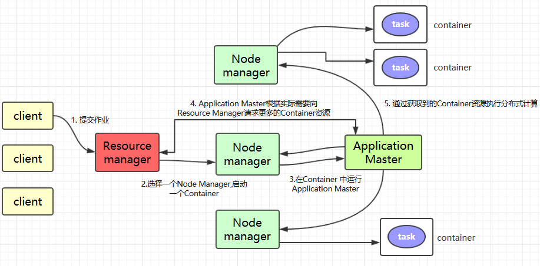

1. `Client` 提交作业到 YARN 上；
2. `Resource Manager` 选择一个 `Node Manager`，启动一个 `Container` 并运行 `Application Master` 实例；
3. `Application Master` 根据实际需要向 `Resource Manager` 请求更多的 `Container` 资源（如果作业很小, 应用管理器会选择在其自己的 JVM 中运行任务）；
4. `Application Master` 通过获取到的 `Container` 资源执行分布式计算。


## YARN工作原理详述

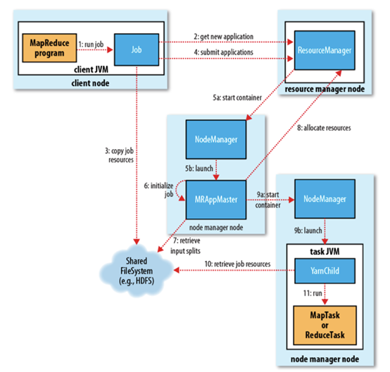


#### 1. 作业提交

client 调用 job.waitForCompletion 方法，向整个集群提交 MapReduce 作业 (第 1 步) 。新的作业 ID(应用 ID) 由资源管理器分配 (第 2 步)。作业的 client 核实作业的输出, 计算输入的 split, 将作业的资源 (包括 Jar 包，配置文件, split 信息) 拷贝给 HDFS(第 3 步)。 最后, 通过调用资源管理器的 submitApplication() 来提交作业 (第 4 步)。

#### 2. 作业初始化

当资源管理器收到 submitApplciation() 的请求时, 就将该请求发给调度器 (scheduler), 调度器分配 container, 然后资源管理器在该 container 内启动应用管理器进程, 由节点管理器监控 (第 5 步)。

MapReduce 作业的应用管理器是一个主类为 MRAppMaster 的 Java 应用，其通过创造一些 bookkeeping 对象来监控作业的进度, 得到任务的进度和完成报告 (第 6 步)。然后其通过分布式文件系统得到由客户端计算好的输入 split(第 7 步)，然后为每个输入 split 创建一个 map 任务, 根据 mapreduce.job.reduces 创建 reduce 任务对象。

#### 3. 任务分配

如果作业很小, 应用管理器会选择在其自己的 JVM 中运行任务。

如果不是小作业, 那么应用管理器向资源管理器请求 container 来运行所有的 map 和 reduce 任务 (第 8 步)。这些请求是通过心跳来传输的, 包括每个 map 任务的数据位置，比如存放输入 split 的主机名和机架 (rack)，调度器利用这些信息来调度任务，尽量将任务分配给存储数据的节点, 或者分配给和存放输入 split 的节点相同机架的节点。

#### 4. 任务运行

当一个任务由资源管理器的调度器分配给一个 container 后，应用管理器通过联系节点管理器来启动 container(第 9 步)。任务由一个主类为 YarnChild 的 Java 应用执行， 在运行任务之前首先本地化任务需要的资源，比如作业配置，JAR 文件, 以及分布式缓存的所有文件 (第 10 步。 最后, 运行 map 或 reduce 任务 (第 11 步)。

YarnChild 运行在一个专用的 JVM 中, 但是 YARN 不支持 JVM 重用。

#### 5. 进度和状态更新

YARN 中的任务将其进度和状态 (包括 counter) 返回给应用管理器, 客户端每秒 (通 mapreduce.client.progressmonitor.pollinterval 设置) 向应用管理器请求进度更新, 展示给用户。

#### 6. 作业完成

除了向应用管理器请求作业进度外, 客户端每 5 分钟都会通过调用 waitForCompletion() 来检查作业是否完成，时间间隔可以通过 mapreduce.client.completion.pollinterval 来设置。作业完成之后, 应用管理器和 container 会清理工作状态， OutputCommiter 的作业清理方法也会被调用。作业的信息会被作业历史服务器存储以备之后用户核查。


#### **DRF ** 算法

在多资源（CPU、内存、GPU等）的共享环境下，如何公平地分配资源是一个极具挑战性的数学问题。**DRF (Dominant Resource Fairness，主资源公平调度)** 算法正是为了解决这个问题而生的，它是 YARN（以及 Mesos）中多租户资源调度的核心灵魂。


##### 1. 为什么需要 DRF？

在早期的调度算法中，通常只考虑单一资源（比如只看内存）。

- **痛点**：如果集群只按内存分配，某个任务可能申请了很少的内存，但却占用了极高的 CPU。由于调度器“看不见” CPU，会导致 CPU 被耗尽，而其他真正需要 CPU 的任务被饿死。
- **需求**：在复杂的企业级开发中，我们需要一种算法，能同时兼顾 CPU、内存甚至网络带宽，确保没有任何一个“贪婪”的任务能通过消耗某种特定资源来拖垮整个集群。


##### 2. DRF 的核心概念：主资源 (Dominant Resource)

DRF 的核心思想是：**由用户消耗最多的那类资源（相对于集群总量的比例）来决定其份额。**

- **资源份额 (Resource Share)**：用户占用的某种资源量 ÷ 集群该资源总量。
- **主资源 (Dominant Resource)**：在所有资源份额中，**比例最高**的那一个。
- **主份额 (Dominant Share)**：主资源对应的那个百分比数值。


##### 3. DRF 算法的执行逻辑（三步走）

假设集群总资源为：**100 CPU, 1000GB 内存**。

1. **计算份额**：计算每个用户当前已占用的 CPU 比例和内存比例。
2. **确定主资源**：对每个用户，取其 CPU 比例和内存比例中的**最大值**。
3. **公平分配**：调度器查看所有等待任务的用户，**谁的“主份额”最小，就把下一个 Container 分给谁。**

**算法的目标**：试图让所有用户持有资产的“主份额”尽可能相等。


##### 4. 经典案例模拟（面试常考题）

**场景设定**：

- 集群总资源：**18 CPU, 72 GB RAM**
- **用户 A** 的每个任务需求：`<1 CPU, 4 GB>`
- **用户 B** 的每个任务需求：`<3 CPU, 1 GB>`

**计算过程**：

1. **确定主资源**：
   - 用户 A：1个任务占 CPU 的 $1/18=5.5\%$，占 RAM 的 $4/72=5.5\%$。两者一样，**主资源是两者皆可**，主份额 5.5%。
   - 用户 B：1个任务占 CPU 的 $3/18=16.6\%$，占 RAM 的 $1/72=1.4\%$。**主资源是 CPU**，主份额 16.6%。
2. **调度决策**：
   - 第一轮：A 和 B 都是 0。假设给 A。A 的主份额变为 5.5%。
   - 第二轮：比较 A(5.5%) 和 B(0%)。给 B 分配一个任务。B 的主份额变为 16.6%。
   - 第三轮：比较 A(5.5%) 和 B(16.6%)。给 A 分配第二个任务。A 的主份额变为 11%。
   - 第四轮：比较 A(11%) 和 B(16.6%)。再给 A 分配一个。A 的主份额变为 16.5%。
3. **最终平衡**：
   - 调度器会不断重复此过程，直到资源耗尽。最终 A 和 B 的主份额会非常接近。


##### 5. DRF 的四大特性（面试加分项）

如果你能在面试中说出这四个词，面试官会认为你对分布式调度有极深的理解：

1. **共享激励 (Sharing Incentive)**：每个用户分到的资源，绝不会比“平分集群”时拿到的少。
2. **策略证明性 (Strategy-proofness)**：用户无法通过谎报资源需求（比如故意多报不需要的资源）来获得更多好处。
3. **帕累托效率 (Pareto Efficiency)**：在不损害他人利益的前提下，资源得到了充分利用。
4. **单调性 (Envy-freeness)**：用户不会羡慕别人的分配结果，因为大家的“主份额”是公平竞争的。

> 在实际 YARN 配置中，DRF 默认是**关闭**的（默认只看内存）。 要在企业级环境中开启它，需要在 `capacity-scheduler.xml` 中配置： `yarn.scheduler.capacity.resource-calculator` = `org.apache.hadoop.yarn.util.resource.DominantResourceCalculator`
>
> **如果没有这个配置，即使你的任务需要 100 核 CPU，只要内存够，YARN 就会一直塞任务，最后导致 CPU 爆满挂掉。这就是为什么要学 DRF 的实战意义。**


##### 6.DRF在RM中的Scheduler

<span style="color:red">这部分内容和ResourceManager (RM)高度相关,属于调度器 (Scheduler) 的核心底层算法</span>

DRF 是嵌套在 ResourceManager (RM) 的调度器（Scheduler）内部的一个“核心计算逻辑”

YARN 资源调度结构:

**第一层：ResourceManager (大管家)**

- 它是整个集群的入库和指挥中心。

**第二层：Scheduler (调度器策略)**

- 这是 RM 的一个组件。你可以在配置文件里选择用哪种“管理风格”：
  - **Capacity Scheduler (容量调度器)**：注重队列隔离。
  - **Fair Scheduler (公平调度器)**：注重资源均衡。

**第三层：ResourceCalculator (资源计算器) —— DRF 就在这里**

- 这是调度器用来“数数”的工具。
- **默认工具 (DefaultResourceCalculator)**：是个“色盲”，只看内存。
- **DRF 工具 (DominantResourceCalculator)**：是个“全能扫描仪”，看内存、CPU 甚至更多。


**工作环境修改**

在 **Capacity Scheduler**（Hadoop 默认调度器）中，默认是单维度（只看内存）的。

需要修改 `capacity-scheduler.xml` 配置文件：

```xml
<property>
  <name>yarn.scheduler.capacity.resource-calculator</name>
  <value>org.apache.hadoop.yarn.util.resource.DominantResourceCalculator</value>
</property>
```


#### 调度器 (Scheduler)

在 YARN 的架构中，如果说 **ResourceManager (RM)** 是大脑，**DRF** 是度量衡，那么 **调度器 (Scheduler)** 就是这个系统的“公平法官”。它决定了在资源有限的情况下，成千上万个任务谁先跑、谁后跑、谁能占多少资源。


##### YARN 三大调度器体系对比

| **特点**     | **FIFO Scheduler (先来后到)** | **Capacity Scheduler (容量调度)** | **Fair Scheduler (公平调度)**        |
| ------------ | ----------------------------- | --------------------------------- | ------------------------------------ |
| **设计初衷** | 简单排队                      | **多租户隔离** (Yahoo 开发)       | **资源利用率最大化** (Facebook 开发) |
| **队列支持** | 不支持（只有一个队列）        | **支持层级队列**                  | **支持层级队列**                     |
| **资源分配** | 按提交时间顺序                | 预先为每个队列分配固定比例        | 动态平衡，尽量让所有任务平分资源     |
| **灵活性**   | 极差（大任务堵死小任务）      | 好（有弹性，可借用空闲资源）      | 极好（资源动态伸缩）                 |
| **适用场景** | 个人测试、简单实验            | **大型企业（Hadoop 默认）**       | 中小型企业、Spark 任务较多的集群     |


 **为什么公平调度器 (Fair) 灵活性更好？**

核心在于**“动态平衡”**

**Capacity（容量）**：像**分封制**。虽然能借，但每个队有明确的“底盘”。

**Fair（公平）**：像**公有制**。

**灵活性体现**：假设现在全公司只有一个开发者A在跑任务，Fair 调度器会让这个开发者A的任务**吃满整个集群 100% 的资源**。当另一位开发者B也提交了一个任务，调度器会立刻通过收缩开发者A的资源，让A与B变成 **50% | 50%**。

----------

##### 深入核心 A：Capacity Scheduler (容量调度器)

这是 **Apache Hadoop 默认**的调度器，也是 90% 大厂（如阿里、美团、字节）在离线数仓建设中选用的方案。

**1. 核心逻辑：层级队列 (Hierarchical Queues)**

可以把集群资源想象成一笔“巨额遗产”，**层级队列**就是家族里分钱的“树状结构”。

**逻辑结构**：根队列（root）下可以分出子队列，子队列还可以再分。

**示例**：

- `root` (100% 资源)
  - `root.production` (生产环境：70%) $\rightarrow$ 跑每天雷打不动的报表。
  - `root.dev` (开发测试：30%) $\rightarrow$ 给程序员们“折腾”用。
    - `root.dev.data_science` (15%)
    - `root.dev.etl_test` (15%)

**面试点**：为什么要层级？为了**资源继承**和**权限隔离**。比如 `dev` 队列如果欠费了，它下属的所有组都不能跑任务；同时，数据科学组的任务不能抢 ETL 组的保底资源。

> <span style="color:teal">开发队列:</span>
>
> **开发队列是什么**：它是专门划分给开发人员（DE/DA/算法工程师）用来**测试代码、调试 SQL** 的地盘。
>
> **Hadoop 上开发什么**：
>
> 1. **Hive SQL/Spark SQL 调试**：写了一个 500 行的 SQL，不确定逻辑对不对，开发者会先在“开发队列”里跑一小部分数据看看结果。
> 2. **机器学习模型训练**：算法工程师调用 SparkML 训练模型。
> 3. **代码发布前测试**：新的 ETL 程序（把 A 表数据洗到 B 表）正式上线前，必须在开发环境试运行。
>
> **为什么必须隔离**：开发人员经常写出“死循环”或“笛卡尔积” SQL。如果不隔离，一个实习生就能把公司给老板看的核心报表（生产任务）挤死。


**2. 核心特性：**

- **容量保证 (Capacity)**：每个队列都有“保底资源”。比如生产队列设置 70%，那么无论开发队列有多少任务，生产队列永远能拿到这 70%。
- **弹性伸缩 (Elasticity)**：如果生产队列现在没活干，它的 70% 资源可以**借给**开发队列使用。一旦生产任务来了，它会通过**“抢占 (Preemption)”**机制收回资源。
- **多租户限制**：可以限制每个用户、每个应用能使用的最大资源，防止某个实习生写了个死循环把整个队列资源占满。


**3.弹性借用 & 租户 ACL 权限控制**

**弹性借用 (Elastic Borrowing)**：

- **情景**：生产队列（70%）现在没任务。
- **动作**：开发队列（30%）虽然额度小，但它可以把生产队列空闲的 70% **借过来**，临时跑到 100%。这保证了集群**不空转**，钱不白花。

**租户 ACL (Access Control List)**：

- **作用**：决定“谁能往哪个队列交任务”。
- **例子**：技术部的张三，拥有 `root.dev` 的提交权限，但没有 `root.production` 的权限。这就防止了有人误操作把测试代码提交到昂贵的生产队列里。

------

##### 深入核心 B：Fair Scheduler (公平调度器)

它的信条是：**不让任何一个任务饿死，且让集群永远不空闲。**

**1.核心逻辑：动态再平衡**

- 如果集群只有一个任务，它占 100% 资源。
- 来了第二个任务，每个任务占 50%。
- 来了第 100 个任务，每个任务占 1%。
- 当大任务结束释放资源，小任务会瞬间分到更多资源。


**2.权重 (Weight) 机制**

你可以给不同的任务设置权重。权重为 2 的任务分到的资源是权重为 1 的任务的两倍。

--------

##### 调优实战

我们首先需要了解一下抢占机制以及容量配比

**抢占机制 & 最小/最大容量配比**

- **队列最小容量 (Minimum Capacity)**：**“保底线”**。比如生产队列最小 70%，哪怕集群再挤，YARN 也要腾出 70% 给它。

- **队列最大容量 (Maximum Capacity)**：**“封顶线”**。防止某个队列无限制借用资源，导致其他队列完全没法启动。

- **抢占机制 (Preemption)**：
  - **情景**：开发队列借了生产队列的资源，正跑得欢。
  - **冲突**：生产任务突然来了，发现资源被借走了。
  - **解决**：RM 会要求开发队列立刻还钱。如果开发队列的任务死皮赖脸不走，RM 会**强行杀死 (Kill)** 开发队列的任务，把资源抢回来还给生产。


**我们假设一个场景:**
是公司的 DE，今天集群突然很卡，任务全堆在 `ACCEPTED` 状态，你会怎么排查调优？

**步骤 A：检查 AM 资源限额**

- **参数**：`yarn.scheduler.capacity.maximum-am-resource-percent`
- **现象**：集群内存还有，但任务不跑。
- **调优**：每个任务都需要一个 **ApplicationMaster (AM)**。如果这个百分比设得太小（默认 0.1），说明 AM 占用的资源达到了上限。你需要调大它，允许更多任务同时启动。

**步骤 B：设置用户限制因子**

- **参数**：`user-limit-factor`
- **场景**：某同学写了个 `for` 循环连续交了 1000 个任务，把队列占满了。
- **调优**：将此值设为 1，意味着一个用户最多只能占满该队列的保底资源，不能把借来的资源也全占了，给别人留点活路。

**步骤 C：开启本地性延迟调度**

- **参数**：`yarn.scheduler.capacity.node-locality-delay`
- **场景**：为了追求快，任务随便找台机器就跑了（跨机架读数据，很慢）。
- **调优**：设置延迟（比如 40 次调度机会）。让 YARN 等一等，尽量把任务分配到数据所在的机器上（**Data Locality**），这能极大地提升 Hive/Spark 的运行效率。

--------

##### 面试问题:

**Q1：为什么生产环境大多选 Capacity 而不是 Fair？**

**答**：因为 **Capacity 更加“稳重”且“可预测”**。 在大型企业中，财务、算法、数仓各部门的成本是分开核算的。Capacity 提供了严格的**资源隔离**，能保证关键业务（如每天早晨 8 点要出的报表）绝对不会因为某个算法同学突然跑了一个超大模型而被挤占。Fair 过于追求“全集群公平”，在极其繁忙的集群中可能会导致关键任务进度不确定。


**Q2：什么是“资源抢占 (Preemption)”？**

**答**：这是调度器的自愈机制。 比如 Queue A 借用了 Queue B 的资源，此时 B 突然来了紧急任务。调度器会要求 A 归还资源。如果 A 在规定时间内不归还，ResourceManager 会**强行杀掉 (Kill)** A 的一些 Container，把资源还给 B。

> **追问**：这会带来什么问题？ **答**：被杀掉的任务需要重跑，会增加系统的计算损耗。


**Q3：如何解决“小文件任务挤死大任务”或者“大任务饿死小任务”？**

**答**：

1. 设置**最大并发任务数**。
2. 合理配置**延迟调度 (Delay Scheduling)**：如果当前节点没有本地数据，调度器可以等几秒，看有没有空闲的本地节点，而不是随便塞给一个远程节点。


**Q4: 作为数据科学专业的学生，面试时如果被问到 YARN，你可以直接抛出这个观点：**

**答:**

“调度器不只是分配 CPU 和内存，它更是一种**业务治理工具**。在实际开发中，我会根据任务的 SLA（服务等级协议）等级，合理配置 **Capacity Scheduler** 的层级队列，利用**弹性借用**提高资源利用率，并通过**抢占机制**确保核心生产链路的稳定性。”

>  能证明你不仅懂技术，还懂**企业级工程规范**。


进阶面试问题

**1. 容错与恢复（Fault Tolerance）**

**面试官问**：如果一个正在运行的任务，其 **ApplicationMaster (AM) 挂了**，YARN 会怎么处理？如果 **ResourceManager (RM) 挂了**呢？数据会丢失吗？

- **你的通关回答**：
  - **AM 挂了**：RM 会检测到 AM 心跳超时，并在另一个 NM 上重新启动一个新的 AM 容器。AM 具有“重试机制”（由 `yarn.resourcemanager.am.max-attempts` 控制）。新的 AM 启动后，会通过之前的状态日志，尝试恢复之前已经完成的任务，避免全部重跑。
  - **RM 挂了**：如果开启了 **RM HA**，备用 RM 会接管。状态数据（如队列任务、已分配资源）存在 ZooKeeper 或 HDFS 中，新 RM 启动后能恢复集群状态。
  - **结果**：计算任务可能会变慢或部分重跑，但**数据不会丢失**。


**2.请简述一个 Container 从“申请”到“销毁”的状态变化。**

**答**：

1. **NEW**: AM 向 RM 申请资源。
2. **ALLOCATED**: RM 调度器分配了资源。
3. **ACQUIRED**: AM 从 RM 处领取到资源令牌。
4. **RUNNING**: AM 联系 NM 启动容器。
5. **COMPLETED**: 任务执行结束或失败，NM 回收资源并通知 RM。


同样资源是怎么“流”起来的？

1. **提交请求**：Client 带着代码（Jar包）去找 **RM**。
2. **钦点 AM**：RM 并不亲自运行代码。它在集群中找一个空闲的 **NM**，下令：“在这个机器上启动一个 **Container**，用来跑这个任务的 **AM**。”
   - *注意：AM 自己也是跑在一个 Container 里的！它是任务的第一个进程。*
3. **AM 算账**：AM 启动后，看了一眼任务：“嘿，我需要 10 个 Map 任务，每个需要 1G 内存。”
4. **AM 申请资源**：**AM 去找 RM 谈判**：“老板，给我 10 个 Container 的支票（资源令牌）。”
5. **RM 发放令牌**：RM 根据队列（Capacity/Fair Scheduler）情况，把 10 个 Container 的 **Token** 给 AM。
6. **AM 找 NM 开工**：**AM 拿着 Token 去找各地的 NM**：“RM 老板批条子了，在你的地盘给我开个工位（Container），把这行代码跑起来！”
7. **汇报与回收**：任务跑完，AM 告诉 RM：“活干完了，资源还给你。” AM 随后自杀。


**3.架构对比（YARN vs. Kubernetes）**

**问**：现在很多公司把大数据任务往 Kubernetes (K8s) 上迁移，你觉得 YARN 相比 K8s 的核心优势在哪里？

**答**：

- **深度适配**：YARN 天生为大数据设计，对**数据本地性（Data Locality）**的调度支持远好于 K8s（YARN 知道 HDFS 的块在哪）。
- **细粒度调度**：在处理短作业（几秒钟的 Map 任务）时，YARN 的 Container 启动开销比 K8s 的 Pod 更小、更敏捷。
- **队列治理**：YARN 的层级队列和弹性借用机制在**离线批处理**场景下非常成熟，而 K8s 的 ResourceQuota 相对静态。


##### 补充知识:SLA

在企业级开发和运维中，**SLA (Service Level Agreement，服务等级协议)** 是衡量一个系统或一份工作“靠不靠谱”的唯一标准。

简单来说，SLA 就是一份**“军令状”**。它规定了服务提供者（比如你这个数据开发工程师）必须达到的服务水平，以及如果达不到要承担什么后果。

对于数据开发，而要从**指标（SLI）**、**目标（SLO）**和**协议（SLA）**这三个维度来考量。

 **SLA 的“套娃”三兄弟**:

在实际工作中，我们通常把 SLA 拆解为三个紧密相关的概念：

**1. SLI (Service Level Indicator) **

- **定义**：服务等级指标。即：**我们要测量什么？**
- **数据开发场景**：
  - **时延（Latency）**：报表每天早上几点出？SQL 跑完要多久？
  - **成功率（Success Rate）**：每天 1000 个任务，有几个是报错重跑的？
  - **数据质量（Quality）**：表里的主键有没有重复？数值有没有异常？


**2.SLO (Service Level Objective) —— “及格线”**

- **定义**：服务等级目标。即：**我们要达到什么数值？**
- **例子**：
  - “核心报表必须在 **08:30 前**生成。”
  - “数据同步任务的月度成功率必须达到 **99.9%**。”


**3.SLA (Service Level Agreement) —— “合同/惩罚”**

**定义**：服务等级协议。即：**如果 SLO 没达到，怎么办？**

**后果**：

- **外部**：如果是云服务商（如阿里云），没达到 SLA 就要赔钱给客户。
- **内部**：如果是公司内部，没达到 SLA 意味着你要写“事故报告（Post-mortem）”，甚至影响年终奖或被领导“约谈”。


**数据开发中的 SLA 简化案例**

假设你在负责公司的**“实时销售大屏”**：

| **维度**   | **SLI (测什么)**       | **SLO (目标值)**   | **SLA (没达标的后果)**                              |
| ---------- | ---------------------- | ------------------ | --------------------------------------------------- |
| **实时性** | 数据从发生到显示的延迟 | $< 5$ 秒           | 大屏黑屏 1 分钟以上，判定为 P1 级事故，负责人复盘。 |
| **完整性** | 订单流丢失率           | $< 0.01\%$         | 丢单导致财务对不上账，扣除当月绩效。                |
| **可用性** | 系统正常运行时间       | $99.99\%$ (四个 9) | 全年故障时间不能超过 52 分钟，否则团队无晋升资格。  |


**面试高频题：如果你负责的任务 SLA 经常失败，你该怎么办？**

这是一个考察你**“闭环思维”**的题目。你可以按这个思路回答：

1. **监控告警**：首先，我会在 Promethus 或 Grafana 上配置 **SLO 燃烧率告警**，在快要违约前就介入。
2. **链路优化**：分析任务执行计划，看是否是因为**数据倾斜**或 **YARN 资源分配不合理**导致的变慢。
3. **资源倾斜**：如果是业务增长导致的必然变慢，我会申请调整 **YARN 队列权重**，或者开启 **DRF 算法** 优化多维度资源分配。
4. **分级治理**：如果资源实在有限，我会和业务方沟通，**降级**非核心指标的 SLA，确保核心指标（Money 相关）的达成。


## 提交作业到YARN上运行

这里以提交 Hadoop Examples 中计算 Pi 的 MApReduce 程序为例，相关 Jar 包在 Hadoop 安装目录的 `share/hadoop/mapreduce` 目录下：

```
# 提交格式: hadoop jar jar包路径 主类名称 主类参数
# hadoop jar hadoop-mapreduce-examples-2.6.0-cdh5.15.2.jar pi 3 3
```


# MapReduce(通俗版)

>  通俗版是简易MapReduce解释 并给出简单的印象,便于快速浏览,详细可以查看体系版

**Hive 就像是一个自动驾驶系统，而 MapReduce 就是这台车的引擎原理。**


<span style="color:red">面试官问 MapReduce，其实是想看你懂不懂分布式计算的底层逻辑。</span>

既然你已经搞定了 Hive，并且理解了它如何把 SQL 变成底层的任务，那么现在学习 **MapReduce** 正是时候。

因为 **Hive 就像是一个自动驾驶系统，而 MapReduce 就是这台车的引擎原理。** 面试官问 MapReduce，其实是想看你懂不懂分布式计算的底层逻辑。


### 1. 核心思想：分而治之 (Divide and Conquer)

想象你要数 10000 枚硬币，一个人数很慢。

- **Map（分）：** 你找 10 个朋友，每人发 1000 枚，让他们各自数出结果。
- **Reduce（合）：** 你把这 10 个朋友数出来的数字加在一起。

这就是 MapReduce 的全部真相。


### 2.<span style="color:red"> MapReduce 的三大阶段（面试必考）</span>

在 Hadoop 中，一个 MapReduce 任务必须经历三个核心阶段：

**① Map 阶段（切分与映射）**

- **输入：** 原始数据（比如几百 GB 的日志文件）。
- **动作：** 每一行数据被解析成 `key-value` 对。
- **例子：** 统计单词频率时，Map 会把 "Apple" 变成 `(Apple, 1)`。

**② Shuffle 阶段（洗牌/核心枢纽）**

这是 **MapReduce 的灵魂**，也是面试最爱问的地方。

- **动作：** 系统自动把所有相同的 `Key` 收集到一起。
- **例子：** 把所有 Map 出来的 `(Apple, 1)` 都送到同一个 Reduce 任务那里。
- **注意：** 这里涉及**排序 (Sort)**、**分组 (Group)** 和**网络传输**，是性能瓶颈所在。

**③ Reduce 阶段（规约/聚合）**

- **动作：** 接收 Shuffle 过来的数据，进行逻辑计算。
- **例子：** 收到一群 `(Apple, [1, 1, 1])`，相加得出 `(Apple, 3)`。

------

### **3. 一个完整的 WordCount 流程图**

假设我们有一行文本：`Hello Hive Hello Hadoop`

1. **InputSplit**: 系统切分数据。
2. **Map**: 产出 `(Hello, 1), (Hive, 1), (Hello, 1), (Hadoop, 1)`。
3. **Shuffle**: 排序并分发，变成 `(Hadoop, 1), (Hello, [1, 1]), (Hive, 1)`。
4. **Reduce**: 汇总，变成 `(Hadoop, 1), (Hello, 2), (Hive, 1)`。
5. **Output**: 写入 HDFS。

------

### **4. 为什么现在大家说 MapReduce“慢”？<span style="color:red">（面试深度题）</span>**

作为数据科学专业的学生，你要能从**架构设计**上回答这个问题：

1. **磁盘 I/O 频繁：** MapReduce 习惯把每一步的中间结果都写到硬盘（HDFS）上。硬盘读写比内存慢几千倍。
2. **启动开销大：** 每一个任务都要启动独立的 JVM 进程，启动就要好几秒。
3. **Shuffle 过程重：** 强制排序虽然保证了数据有序，但在不需要排序的场景下浪费了大量计算资源。

*所以：* **Spark** 出现了，它把中间结果留在**内存**里，极大地提升了速度。

------

### **5. MapReduce 的各个角色 (YARN 环境下)**

你在 `jps` 中看到的那些进程，在跑 MapReduce 时是这样分工的：

- **ResourceManager (RM)**：大 Boss，负责全集群资源的分配。
- **NodeManager (NM)**：小弟，每台机器上的资源监工。
- **ApplicationMaster (AM)**：一个任务的“包工头”，负责监督这一个 MapReduce 任务的生死。

------

### **6. 系统学习建议：你的第一个 MapReduce 程序**

虽然现在写 Hive SQL 多，但面试官可能会让你手写（或伪代码描述）一个 MapReduce 程序。

**你需要掌握的代码结构：**

1. **Mapper 类**：重写 `map` 方法。
2. **Reducer 类**：重写 `reduce` 方法。
3. **Driver 类**：配置 Job（如输入输出路径、关联 Map/Reduce 类等）。

------

### 💡 思考题（准备下一次交流）：

**如果在 Map 阶段数据不均匀，比如某一个单词出现了 1 亿次，而其他单词只出现了 1 次，会发生什么？**

这就是大数据里著名的 **“数据倾斜 (Data Skew)”**。它是所有大数据组件（Hive, Spark, Flink）共同的敌人。

**你想了解如何通过 MapReduce 的原理来解决数据倾斜吗？这直接决定了你面试能否拿到高薪。**


# MapReduce(体系版)

> 体系版相交通俗版会更加注重MapReduce本身的应用以及诞生时的设计思路

## 一、MapReduce概述

Hadoop MapReduce 是一个分布式计算框架，用于编写批处理应用程序。编写好的程序可以提交到 Hadoop 集群上用于并行处理大规模的数据集。

MapReduce 的设计初衷是：**数据不动，计算动**。 它把复杂的任务拆解为两个原子操作：

1. **Map (映射)**：把“大问题”拆成“小份”，并行处理。就像把一筐杂乱的硬币分给 10 个人，每人只负责数自己手里的。
2. **Reduce (归约)**：把“小份结果”按规律合并。就像那 10 个人数完后，把结果报给组长，组长汇总出总金额。


MapReduce 作业通过将输入的数据集拆分为独立的块，这些块由 `map` 以并行的方式处理，框架对 `map` 的输出进行排序，然后输入到 `reduce` 中。MapReduce 框架专门用于 `<key，value>` 键值对处理，它将作业的输入视为一组 `<key，value>` 对，并生成一组 `<key，value>` 对作为输出。输出和输出的 `key` 和 `value` 都必须实现[Writable](http://hadoop.apache.org/docs/stable/api/org/apache/hadoop/io/Writable.html) 接口。

```
(input) <k1, v1> -> map -> <k2, v2> -> combine -> <k2, v2> -> reduce -> <k3, v3> (output)
```


## 二、MapReduce编程模型简述

这里以词频统计为例进行说明，MapReduce 处理的流程如下：

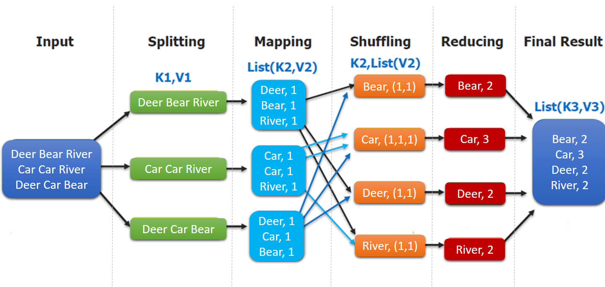

1. **input** : 读取文本文件；
2. **splitting** : 将文件按照行进行拆分，此时得到的 `K1` 行数，`V1` 表示对应行的文本内容；
3. **mapping** : 并行将每一行按照空格进行拆分，拆分得到的 `List(K2,V2)`，其中 `K2` 代表每一个单词，由于是做词频统计，所以 `V2` 的值为 1，代表出现 1 次；
4. **shuffling**：由于 `Mapping` 操作可能是在不同的机器上并行处理的，所以需要通过 `shuffling` 将相同 `key` 值的数据分发到同一个节点上去合并，这样才能统计出最终的结果，此时得到 `K2` 为每一个单词，`List(V2)` 为可迭代集合，`V2` 就是 Mapping 中的 V2；
5. **Reducing** : 这里的案例是统计单词出现的总次数，所以 `Reducing` 对 `List(V2)` 进行归约求和操作，最终输出。

MapReduce 编程模型中 `splitting` 和 `shuffing` 操作都是由框架实现的，需要我们自己编程实现的只有 `mapping` 和 `reducing`，这也就是MapReduce 这个称呼的来源。


所以可以对照完整的生命周期

**1. 输入与切片 (Input & Splitting)**

- **InputFormat**：定义了如何读取数据（如文本、数据库）。
- **InputSplit (切片)**：**逻辑概念**。Hadoop 会把 1G 文件逻辑上切成 8 份（每份 128MB），每份对应一个 Map 任务。
- **RecordReader**：把切片里的二进制数据转换成 `<K1, V1>`（如：`<行偏移量, 文本内容>`）。

**2. Map 阶段**

- 用户编写 `map()` 方法，将 `<K1, V1>` 转换为中间结果 `<K2, V2>`（如：`<单词, 1>`）。

**3. Shuffle 阶段（最核心、最昂贵）**

这是数据从 Map 端流向 Reduce 端的桥梁。它包括：

- **分区 (Partition)**：决定这个 `<K2, V2>` 该去哪一个 Reducer。
- **排序 (Sort)**：在内存和磁盘中进行排序，保证发往 Reduce 的数据是有序的。
- **合并 (Combine)**：可选操作，在本地先聚合一下（见下文）。

**4. Reduce 阶段**

- **Copy/Pull**：Reducer 主动去各个 Map 节点拉取属于自己的数据。
- **Reduce()**：用户逻辑处理，如 `sum` 求和。

**5. 输出 (Output)**

- **OutputFormat**：把结果写回 HDFS。


## 三、combiner & partitioner

两个让性能起飞的“辅助”：Combiner 与 Partitioner


### 3.1 InputFormat & RecordReaders

让我们先从开始看起,然后再仔细研究Combiner 与 Partitioner

**InputFormat**：定义了如何读取数据（如文本、数据库）。

**InputSplit (切片)**：**逻辑概念**。Hadoop 会把 1G 文件逻辑上切成 8 份（每份 128MB），每份对应一个 Map 任务。

**RecordReader**：把切片里的二进制数据转换成 `<K1, V1>`（如：`<行偏移量, 文本内容>`）。

`InputFormat` 将输出文件拆分为多个 `InputSplit`，并由 `RecordReaders` 将 `InputSplit` 转换为标准的<key，value>键值对，作为 map 的输出。这一步的意义在于只有先进行逻辑拆分并转为标准的键值对格式后，才能为多个 `map` 提供输入，以便进行并行处理。

### 3.2 Combiner

`combiner` 是 `map` 运算后的可选操作，它实际上是一个本地化的 `reduce` 操作，它主要是在 `map` 计算出中间文件后做一个简单的合并重复 `key` 值的操作。

这样做的意义是:减少了从 Map 到 Reduce 的**网络传输量**。如果 Map 产出了 100 万个 `<Hadoop, 1>`，Combiner 会把它变成一个 `<Hadoop, 1000000>`。

> !!**求和、最大值**可以用；**求平均值**绝对不能用（因为局部平均值无法推导出全局平均值）!!

这里以词频统计为例：

`map` 在遇到一个 hadoop 的单词时就会记录为 1，但是这篇文章里 hadoop 可能会出现 n 多次，那么 `map` 输出文件冗余就会很多，因此在 `reduce` 计算前对相同的 key 做一个合并操作，那么需要传输的数据量就会减少，传输效率就可以得到提升。

但并非所有场景都适合使用 `combiner`，使用它的原则是 `combiner` 的输出不会影响到 `reduce` 计算的最终输入，例如：求总数，最大值，最小值时都可以使用 `combiner`，但是做平均值计算则不能使用 `combiner`。

不使用 combiner 的情况：

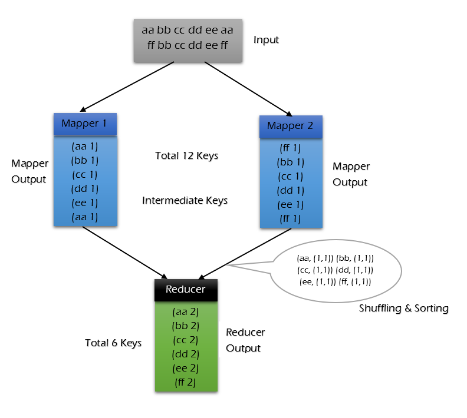


使用 combiner 的情况：

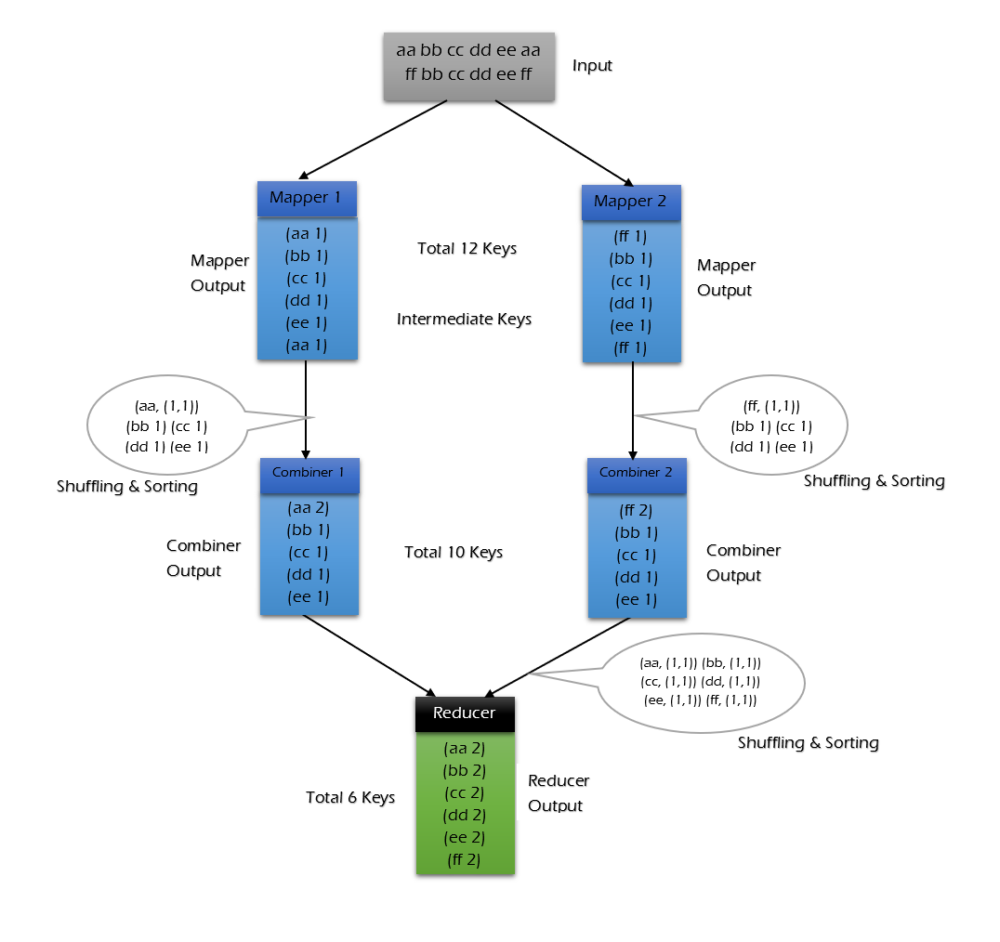

可以看到使用 combiner 的时候，在mapper1内部就进行了一次统计,这样需要传输到 reducer 中的数据由 12keys，降低到 10keys。降低的幅度取决于你 keys 的重复率，下文词频统计案例会演示用 combiner 降低数百倍的传输量。

### 3.3 Partitioner

`partitioner` 可以理解成分类器，将 `map` 的输出按照 key 值的不同分别分给对应的 `reducer`，支持自定义实现，下文案例会给出演示。

**默认逻辑**：`hash(key) % Reducer数量`。

**自定义场景**：如果你想把所有关于“手机号”的数据发往同一个结果文件，或者把特定省份的数据分在一起，就需要自定义 Partitioner。


## 四、MapReduce词频统计案例

### 4.1 项目简介

这里给出一个经典的词频统计的案例：统计如下样本数据中每个单词出现的次数。

```
Spark	HBase
Hive	Flink	Storm	Hadoop	HBase	Spark
Flink
HBase	Storm
HBase	Hadoop	Hive	Flink
HBase	Flink	Hive	Storm
Hive	Flink	Hadoop
HBase	Hive
Hadoop	Spark	HBase	Storm
HBase	Hadoop	Hive	Flink
HBase	Flink	Hive	Storm
Hive	Flink	Hadoop
HBase	Hive
```


### 4.2 项目依赖

想要进行 MapReduce 编程，需要导入 `hadoop-client` 依赖：

```xml
<dependency>
    <groupId>org.apache.hadoop</groupId>
    <artifactId>hadoop-client</artifactId>
    <version>${hadoop.version}</version>
</dependency>
```

### 4.3 WordCountMapper

将每行数据按照指定分隔符进行拆分。这里需要注意在 MapReduce 中必须使用 Hadoop 定义的类型，因为 Hadoop 预定义的类型都是可序列化，可比较的，所有类型均实现了 `WritableComparable` 接口。

```java
public class WordCountMapper extends Mapper<LongWritable, Text, Text, IntWritable> {

    @Override
    protected void map(LongWritable key, Text value, Context context) throws IOException, 
                                                                      InterruptedException {
        String[] words = value.toString().split("\t");
        for (String word : words) {
            context.write(new Text(word), new IntWritable(1));
        }
    }

}
```

`WordCountMapper` 对应下图的 Mapping 操作：

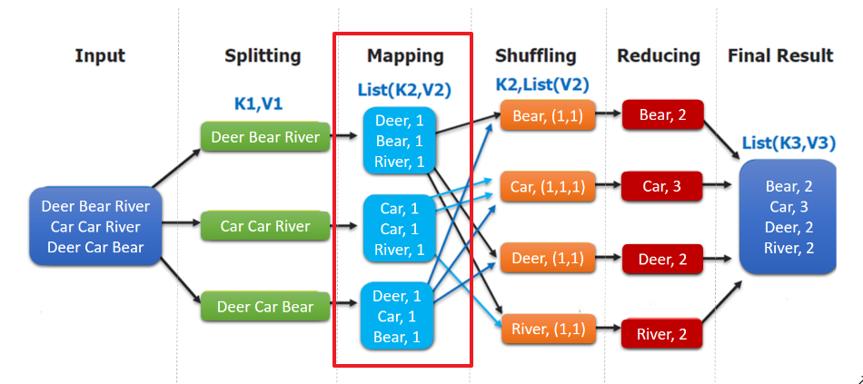

`WordCountMapper` 继承自 `Mappe` 类，这是一个泛型类，定义如下：

```java
WordCountMapper extends Mapper<LongWritable, Text, Text, IntWritable>

public class Mapper<KEYIN, VALUEIN, KEYOUT, VALUEOUT> {
   ......
}
```

- **KEYIN** : `mapping` 输入 key 的类型，即每行的偏移量 (每行第一个字符在整个文本中的位置)，`Long` 类型，对应 Hadoop 中的 `LongWritable` 类型；
- **VALUEIN** : `mapping` 输入 value 的类型，即每行数据；`String` 类型，对应 Hadoop 中 `Text` 类型；
- **KEYOUT** ：`mapping` 输出的 key 的类型，即每个单词；`String` 类型，对应 Hadoop 中 `Text` 类型；
- **VALUEOUT**：`mapping` 输出 value 的类型，即每个单词出现的次数；这里用 `int` 类型，对应 `IntWritable` 类型。


### 4.4 WordCountReducer


在 Reduce 中进行单词出现次数的统计：

```java
public class WordCountReducer extends Reducer<Text, IntWritable, Text, IntWritable> {

    @Override
    protected void reduce(Text key, Iterable<IntWritable> values, Context context) throws IOException, 
                                                                                  InterruptedException {
        int count = 0;
        for (IntWritable value : values) {
            count += value.get();
        }
        context.write(key, new IntWritable(count));
    }
}
```

如下图，`shuffling` 的输出是 reduce 的输入。这里的 key 是每个单词，values 是一个可迭代的数据类型，类似 `(1,1,1,...)`。


需要注意的是：如果不设置 `Mapper` 操作的输出类型，则程序默认它和 `Reducer` 操作输出的类型相同。


## 五、MapReduce 与 YARN 的“握手”流程

**Job 提交**：Client 向 **ResourceManager (RM)** 申请跑任务。

**AM 诞生**：RM 在某个 **NodeManager (NM)** 上启动一个 Container，运行 **MRAppMaster (AM)**。

**计算资源申请**：AM 根据切片数量，向 RM 申请更多的 Container 来跑 MapTask。

**任务分发**：AM 联系各个 NM 启动 **YarnChild**（任务进程），执行具体的 Map 或 Reduce 逻辑。

**状态监控**：AM 全程盯着这群“干活的”，如果谁挂了，AM 负责重试。


## 六、Shuffle

**Shuffle（洗牌）** 是整个 MapReduce 最具“昂贵”的阶段。

**Shuffle 的定义**：从 Map 输出开始，到 Reduce 输入之前的整个过程。 **核心任务**：将 Map 产生的无序中间结果，按 **Key** 分发到对应的 Reducer，并保证进入 Reducer 的数据是**全局分区有序**的。


### **1.Map 端的 Shuffle：在“家”先整理**

Map 任务完成后，数据并不是直接写到磁盘的，它经历了一个非常复杂的内存到磁盘的过程。

**① 环形缓冲区 (Circular Buffer)**

Map 的输出首先写入内存中的一个**环形缓冲区**（默认大小 **100MB**）。

- **为什么是环形？** 为了实现一边写一边读（溢写），互不干扰。
- **80% 阈值**：当缓冲区占用达到 **80%** 时，会启动一个后台线程开始将数据**溢写 (Spill)** 到磁盘。剩下的 20% 空间让 Map 继续写，防止阻塞。

**② 分区、排序与合并 (Sort & Partition & Combine)**

在数据写到磁盘之前，在内存里会发生三件事：

1. **分区 (Partition)**：根据 `key.hashCode() % Reduce数量` 决定这条数据该去哪个 Reducer。
2. **排序 (Sort)**：在每个分区内部，按照 **Key** 进行**快速排序 (QuickSort)**。
3. **可选的 Combiner**：如果设置了 Combiner，会在此时进行局部聚合（比如 `(a, 1), (a, 1) -> (a, 2)`），极大地减少磁盘 IO。

**③ 合并溢写文件 (Merge)**

Map 任务结束前，可能会产生很多个溢写出来的临时小文件。Shuffle 会把这些小文件合并成一个**大的有序文件**，并生成一个索引文件，记录每个分区在文件中的起始位置。


### 2. Reduce 端的 Shuffle：去“别人家”拿货

Reduce 端的工作更像是“跨城取件”。

**① 拉取数据 (Copy/Fetch)**

Reducer 启动后，会通过 HTTP 协议去各个已经完成的 Map 节点“拉取”属于自己的分区数据。

- **并发拉取**：Reducer 会启动多个线程并行地从不同的 Mapper 那里拿数据。

**② 归并排序 (Merge & Sort)**

拉取过来的数据先放在内存，放不下了就写磁盘。

1. **内存合并**：小的片段在内存里直接合并。
2. **磁盘归并**：由于来自不同 Mapper 的数据块本身已经分区有序，Reducer 只需要进行**归并排序 (MergeSort)**，就能得到一个全局有序的大文件。

③ **分组** (Grouping)

在进入 `reduce()` 方法之前，最后一步是**分组**。它把 Key 相同的所有 Value 放到一个可迭代的集合中（即 `Iterable<V>`）。


面试很喜欢问:“Shuffle 过程中一共发生了几次排序？分别是什么算法？”

| **排序阶段** | **发生位置**       | **算法**                 | **目的**                                                     |
| ------------ | ------------------ | ------------------------ | ------------------------------------------------------------ |
| **第一次**   | Map 端的环形缓冲区 | **快速排序 (QuickSort)** | 当缓冲区达到 $80\%$ 时，在内存中对分区内的数据按 Key 排序。  |
| **第二次**   | Map 端磁盘溢写文件 | **归并排序 (MergeSort)** | 将多个小的溢写文件合并成一个大的、分区内有序的文件。         |
| **第三次**   | Reduce 端内存/磁盘 | **归并排序 (MergeSort)** | 将从各个 Map 端拉取过来的数据片段合并成一个全局有序的输入流。 |


### 3.调优核心

在大厂面试中，如果你能总结出 Shuffle 的成本，层次感就出来了：

1. **磁盘 IO**：Map 端溢写、合并，Reduce 端落盘、归并。一共要经历多次磁盘读写。
2. **网络带宽**：Reduce 端跨节点拉取数据（Copy 阶段）是集群带宽的最大消耗者。
3. **CPU 损耗**：由于 Shuffle 过程中伴随大量的数据排序、压缩与解压，对 CPU 压力也很大。


如果你能背出这两个参数，面试官会觉得你很有实战经验：

- **`mapreduce.task.io.sort.mb`**：环形缓冲区大小（默认 100MB）。如果内存够，调大它可以减少溢写次数。
- **`mapreduce.map.sort.spill.percent`**：溢写阈值（默认 0.8）。
- **`mapreduce.job.reduce.slowstart.completedmaps`**：控制 Reduce 什么时候开始拉数据。默认是 Map 完成 5% 后就开始拉，可以改为更高，防止 Reduce 占用 Container 太久却没活干。


# MySql


普通用户密码:202428

远程密码:202428 / root(存疑 )


