# Ⅰ 基础知识

Hive是单机工具，只需要部署在一台服务器即可。Hive虽然是单机的，但是它可以提交分布式运行的MapReduce程序运行。

我们知道Hive是单机工具后，就需要准备一台服务器供Hive使用即可。同时Hive需要使用元数据服务，即需要提供一个关系型数据库，我们也选择一台服务器安装关系型数据库即可。


| **服务**                                                | **机器**    |
| ------------------------------------------------------- | ----------- |
| Hive本体                                                | 部署在node1 |
| 元数据服务所需的关系型数据库（课程选择最为流行的MySQL） | 部署在node1 |

为了简单起见，都安装到node1服务器上。


## 一、什么是 Hive？（形象理解）

想象有一个巨大的仓库，里面堆满了成千上万个巨大的 Excel 表格（这就是 **HDFS**，分布式文件系统）。如果你想在这些文件里找数据，得写复杂的程序去遍历。

**Hive 就像是一个“翻译官”：**

- 它坐在这些文件上面。
- 只需要对它说标准的 **SQL**（Hive 里的 SQL 叫 HQL）。
- Hive 会自动把 SQL 语句翻译成复杂的底层计算程序（比如 MapReduce 或 Spark），然后去跑那些文件。

**核心结论：** Hive 的本质是**分布式 SQL 查询引擎**。它让开发者能用写 SQL 的方式，去处理存储在 Hadoop 上的海量数据。将SQL语句 翻译成MapReduce程序运行

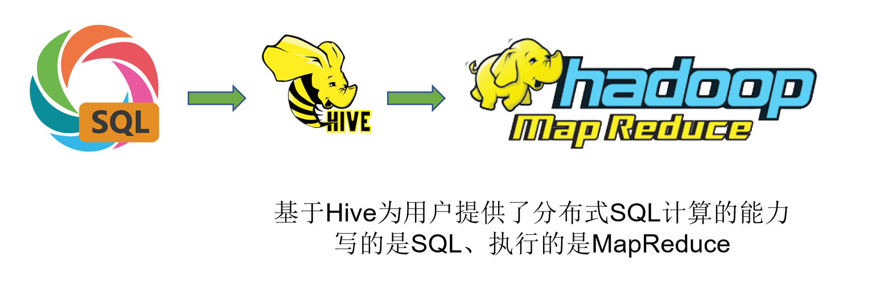

## 二、基础知识

**① 元数据 (Metadata)**

- Hive 本身**不存储**数据。真正的数据文件（如 `.txt` 或 `.orc`）存在 HDFS 上。
- Hive 只存储“关于数据的数据”：比如表名是什么、有哪些列、每一列是什么类型、文件存在 HDFS 的哪个路径下。
- 这些元数据通常存在一个关系型数据库里（通常是 **MySQL**）。


### hive mysql和元数据管理的关系

##### 1. 角色扮演：图书馆模型

想象你要管理一个拥有 **10亿本书** 的超级大图书馆：

- **HDFS（仓库）：** 是巨大的**书架区域**。书就散乱地堆在那里。它只管存，不管书里写了什么，也不管书叫什么。
- **MySQL（档案卡）：** 是门口的一个**小抽屉**，里面放着几千张纸质卡片。每张卡片记录着：*“某本书叫《大数据》，在第 99 号书架的第三层”*。
- **Hive Metastore（管理员）：** 是图书馆的**专职管理员**。
- **Hive Driver（查询系统）：** 是读者使用的**电脑查询终端**。


##### 2. 它们是怎么配合的？

当你（用户）想看《大数据》这本书时：

1. **你：** 在电脑（**Hive CLI/Beeline**）输入：“我要看《大数据》”。
2. **电脑终端（Driver）：** 它不认识书，它跑去问**管理员（Metastore）**：“喂，有位读者要看《大数据》，它在哪？”
3. **管理员（Metastore）：** 管理员也记不住所有书，但他有钥匙。他打开**小抽屉（MySQL）**，翻出一张档案卡。
4. **MySQL（档案库）：** 档案卡告诉管理员：*“书在 A 区 5 号架”*。
5. **管理员（Metastore）：** 把这个位置告诉电脑终端（Driver）。
6. **电脑终端（Driver）：** 拿着地址，直接冲向**书架（HDFS）**，把那本书取出来展示给你。


##### 3. 为什么你觉得混乱？（理清 3 个核心痛点）

**Q1：既然元数据在 MySQL 里，我能直接改 MySQL 吗？**

- **原则：绝对不要手动改！** * 如果你偷偷在 MySQL 里把表名 `test` 改成了 `test2`，管理员（Metastore）再去找表的时候就会发现“对不上号”，导致 Hive 崩溃。**一定要通过 Hive 语句（如 `ALTER TABLE`）让 Hive 帮你去改。**

**Q2：Metastore 到底是一个软件，还是一个配置？**

- **它是一个“服务（Service）”**。
- 你之前启动的那个 `nohup hive --service metastore` 就是让这个“管理员”上线。如果不启动它，Hive 就像断了线的风筝，找不到 MySQL。
- 元数据库（MySQL）是“存钱的保险柜”，而 Metastore 是“银行柜员”。

**Q3：为什么说 MySQL 是“元数据库”，而 Hive 是“数据仓库”？**

- **MySQL（元数据库）：** 存的是**结构**（表名、列名、分区）。数据量很小，通常只有几十 MB。
- **Hive（数据仓库）：** 存的是**内容**（具体的业务数据）。数据量巨大，通常是几百 TB。


### **元数据库（Metastore Database）** 和 **元数据服务（Metastore Service）**

**元数据库（MySQL）是“存钱的保险柜”，而 Metastore 是“银行柜员”。**

------

##### 1.深度辨析：元数据库 vs Metastore 服务

为了让你彻底不再混乱，我们把这两个东西剥离开来看：

**元数据库 (The Database)**

- **它是谁：** 通常就是你安装的 **MySQL**（或者是 Oracle、PostgreSQL）。
- **它的职责：** 它是**死**的。它只负责把数据持久化到硬盘上。如果你关掉 Hive，MySQL 里的那些表（TBLS, COLUMNS_V2 等）依然静静地躺在那。
- **面试术语：** 物理存储层。

**Metastore (The Service)**

- **它是谁：** 它是一个**活**的 Java 进程（即你启动的那个 `RunJar` 进程）。
- **它的职责：** 它是**中间人**。
  - 它负责连接 MySQL。
  - 它负责把 Hive 的请求翻译成 SQL 语句发给 MySQL。
  - 它通过 **Thrift 协议** 为外部（如 Spark, Presto, Beeline）提供元数据查询服务。
- **面试术语：** 逻辑服务层。

------

##### 2. 为什么非要搞个 Metastore 服务？直接让 Hive 连 MySQL 不行吗？

其实在 Hive 的早期架构（内嵌模式）里，确实是直接连的。但现在为什么要分开，这涉及大数据架构的两个核心原因：

1. **安全隔离：** 你总不希望几百个开发人员的电脑都能直接拿到 MySQL 的 root 密码吧？有了 Metastore 服务，大家只需要连接服务，由服务统一去读数据库。
2. **多组件共享：** 这是最重要的。在现代大数据生态里，**Spark**、**Flink**、**Presto** 都要读 Hive 的数据。它们不需要自己去翻 MySQL 的表结构，而是统一去问 Metastore 这个“管理员”。

------

##### **3. 一张图理清三者关系**

当你执行 `DESC test;`（查看表结构）时：

1. **Hive Client**: “告诉我 test 表的结构。”
2. **Metastore Service (活的进程)**: “好的，等我去查档。” -> *（执行一条类似 `SELECT \* FROM TBLS...` 的 SQL 发给 MySQL）*
3. **MySQL (元数据库)**: “查到了，给你。”
4. **Metastore Service**: “报告 Client，test 表有三列...”

------

4. 总结你的理解

- **元数据库 = MySQL**（存储元数据的**地方**）
- **Metastore = Hive 里的一个服务**（管理元数据的**程序**）

> **面试避坑指南：** 如果面试官问：“Hive 的元数据管理机制是怎么样的？” **你要答：** “Hive 采用 **Metastore 服务** 来解耦元数据操作。物理上，元数据存储在 **MySQL** 等关系型数据库中；逻辑上，由 **Metastore 守护进程** 通过 Thrift 协议对外提供访问接口。这样可以支持多客户端并发访问，并保证了数据库连接的安全。”


## 三、Hive组件

 Hive 的整体运作看作这样：

1. **用户接口 (UI/CLI/JDBC)：** 写代码的地方。
2. **Driver：** “大脑”，负责解析、编译、优化。
3. **Metastore：** “字典”，存表结构。
4. **Hadoop (HDFS/YARN)：** “体力劳动者”，负责存数据和跑计算。


**①Metastore**

通常是存储在关系数据库如 mysql/derby中。Hive 中的元数据包括表的名字，表的列和分区及其属性，表的属性（是否为外部表等），表的数据所在目录等。

-- Hive提供了 Metastore 服务进程提供元数据管理功能

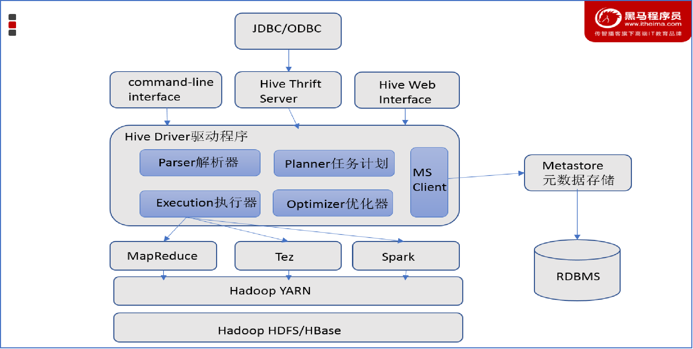


### **②Driver驱动程序**

包括语法解析器、计划编译器、优化器、执行器

完成 SQL 查询语句从词法分析、语法分析、编译、优化以及查询计划的生成。生成的查询计划存储在 HDFS 中，并在随后有执行引擎调用执行。这部分内容不是具体的服务进程，而是封装在Hive所依赖的Jar文件即Java代码中。

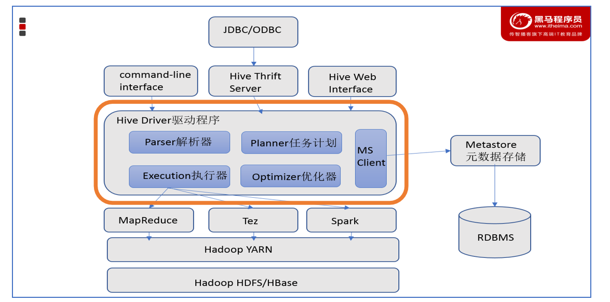


#### 1.Hive Driver 的四个核心阶段

当在终端输入一条 SQL 并按下回车，Driver 会经历以下四个关键步骤：

**① 解析器 (Parser)**

- **作用：** 检查语法。
- **干什么：** 看看你的 SQL 有没有写错（比如 `SELECT` 写成了 `SELET`）。它会将 SQL 字符串转换成一棵 **抽象语法树 (AST)**。

**② 编译器 (Compiler)**

- **作用：** 语义分析。
- **干什么：** 它会去 **Metastore（元数据库）** 确认：你查询的表是否存在？字段名对不对？
- **产出：** 逻辑执行计划。

**③ 优化器 (Optimizer) —— 面试常考**

- **作用：** 寻找最优路径。
- **干什么：** * **列裁剪：** 只读取你 `SELECT` 的那一列，没用的列不读。
  - **谓词下推：** 把 `WHERE` 条件尽早执行，过滤掉没用的数据。
  - **Join 优化：** 决定先连哪张表更快。

**④ 执行器 (Executor)**

- **作用：** 翻译成计算任务。
- **干什么：** 将优化后的执行计划翻译成底层的分布式任务。在以前是 **MapReduce**，现在主流是 **Tez** 或 **Spark**。


#### 2. Driver 工作的核心：执行计划

在大数据面试中，有一个必考的命令：`EXPLAIN`。

如果想看 Driver 是怎么工作的，可以在 SQL 前面加个关键词。比如：

```SQL
EXPLAIN SELECT name, COUNT(*) FROM student GROUP BY name;
```

你会看到一个复杂的树状结构。作为开发者，我们要通过看这个执行计划来判断：

- 这个任务产生了多少个 Map 阶段？
- 是否发生了 **数据倾斜**？
- 优化器有没有按照我们预想的方式工作？


#### 3. *面试* 为什么面试官喜欢考 Driver？

面试官问 Driver，其实是在考你对**查询性能调优**的理解。

> **面试题模拟：** **问：** “你在做 Hive 优化时，是怎么看 SQL 执行过程的？” **答：** “我会利用 **EXPLAIN** 命令查看 **Driver** 生成的执行计划。我会重点关注物理执行阶段，看是否有不必要的全表扫描，或者是否存在可以利用谓词下推（Predicate Pushdown）来减少 IO 的地方。”


**③用户接口**

包括 CLI、JDBC/ODBC、WebGUI。其中，CLI(command line interface)为shell命令行；Hive中的Thrift服务器允许外部客户端通过网络与Hive进行交互，类似于JDBC或ODBC协议。WebGUI是通过浏览器访问Hive。-- Hive提供了 Hive Shell、 ThriftServer等服务进程向用户提供操作接口


需要了解以下 **3 种核心接口**，以及它们背后对应的**连接协议**:

**1. CLI (Command Line Interface) —— 命令行接口**

这是最原始、最简单的接口。

- **Hive CLI：** 早期直接输入 `hive` 进入的黑窗口。它直接和 Driver 交互，不经过远程服务器。
- **Beeline (推荐)：** 这是现在主流的命令行工具。它基于 **JDBC** 协议，通过连接 HiveServer2 来运行。
  - *面试点：* 为什么现在大家都用 Beeline 而不是传统的 Hive CLI？
  - *答案：* 因为 Hive CLI 比较“重”，它要求客户端机器也要安装完整的 Hive 环境；而 Beeline 很轻量，只要能通过 JDBC 连上服务器就能运行，更安全稳定。

**2. JDBC / ODBC 接口 —— 编程接口**

这是作为**开发人员**最常用的接口。

- **JDBC (Java Database Connectivity)：** 如果你用 Java 代码写一个程序去操作 Hive，或者用 IDEA 里的 Database 插件连接 Hive，用的就是 JDBC。
- **ODBC：** 主要是给 C++/C# 或者一些 BI 工具（如 Tableau, PowerBI）连接 Hive 用的。

**3. Web UI (HUE / Ambari) —— 可视化界面**

在企业生产环境下，很少有人天天对着黑窗口敲代码，通常会使用 **HUE (Hadoop User Experience)**。

- **功能：** 提供了一个像网页一样的编辑器。你可以直接在网页上写 SQL、查看结果图表、甚至直接浏览 HDFS 上的文件。
- **优势：** 门槛极低，适合数据分析师和产品经理。


**核心组件：HiveServer2 (HS2)**

提到接口，就必须提到 **HiveServer2**。它是所有接口（除了旧版 CLI）背后的“大管家”。

- **它的角色：** 所有的 JDBC 连接请求、Beeline 请求都会先发给 HiveServer2。
- **它的作用：** 1.  **多用户并发：** 允许多个人同时连上来写 SQL。 2.  **身份验证：** 检查你有没有权限操作这张表。 3.  **连接池管理：** 就像酒店前台，管理着所有进进出出的连接。


> 


### HIVE客户端

Hive的客户端体系:

**HiveServer2 (HS2)** 和 **Beeline** 是考察“Hive 架构演进”和“企业级安全管理”的核心知识点。

过去我们常用 `hive` 命令行直接操作，但在生产环境中，这种方式已经逐渐被 **Beeline + HiveServer2** 的组合所取代。下面我为你系统性地梳理这部分内容。


**Beeline账户**
username:hadoop

password:无


**hive目录**

 /export/server/hive/bin/hive

**启动命令**

```bash
#注意需要在/export/server/hive目录下输入
bin/beeline

!connect jdbc:hive2://node1:10000
```

> **`!` (感叹号)** 在 Beeline（以及它底层的 SQLLine）中，所有**客户端控制命令**（如连接、退出、显示帮助）都必须以感叹号开头，以便与普通的 SQL 语句区分开。
>
> **`connect`** 这是告诉 Beeline：“我要开始建立一个新的数据库连接了”。
>
> **`jdbc:hive2://`** 这是 **JDBC 连接协议头**。
>
> - `jdbc`: 表示使用 Java 数据库连接驱动。
> - `hive2`: 明确指定连接的是 HiveServer2（而不是旧版的 HiveServer1）。
>
> **`node1:10000`**
>
> - `node1`: HiveServer2 所在服务器的主机名或 IP 地址。
> - `10000`: HiveServer2 的默认监听端口。


#### 1. 为什么需要 HiveServer2？（对比 Hive CLI）

在早期的 Hive 版本中，用户主要使用 **Hive CLI**。但它存在严重的缺陷，导致无法在大型多用户企业环境中使用：

- **胖客户端（Fat Client）：** Hive CLI 包含所有的查询编译和执行逻辑，用户必须在本地安装完整的 Hive 客户端。
- **权限隐患：** Hive CLI 直接以当前 OS 用户的身份访问 HDFS 数据，无法进行细粒度的权限控制（如使用 Ranger 或 Sentry）。
- **无并发管理：** 缺乏一个统一的服务端来协调多个用户的请求。

**HiveServer2 的出现解决了这些问题：** 它是一个基于 **Thrift** 协议的服务，允许远程客户端（如 JDBC/ODBC）并发地提交查询。它支持多用户并发、身份认证（Kerberos/LDAP）和更好的安全性。


#### 2. HiveServer2 核心架构

HiveServer2 是 Hive 的“大脑”，它负责接收请求并与 Hadoop 集群交互。

**核心组成部分：**

1. **Thrift 接口：** 提供跨语言的服务调用能力，支持 TCP 或 HTTP 模式通信。
2. **Session 管理：** 每个连接都会创建一个 Session，保存该用户的配置信息和临时状态。
3. **Operation 管理：** 负责 SQL 语句的编译（Compiler）、优化（Optimizer）和执行（Execution Engine）。
4. **安全层：** 负责认证（你是谁）和授权（你能查什么）。


#### 3. Beeline：现代化的 Hive 客户端

**Beeline** 是一个基于 **SQLLine** 的 JDBC 客户端。它的设计理念是“轻量化”，用户不需要在本地安装 Hive，只需要一个 JDBC 驱动即可连接。

**Beeline 的两种模式：**

1. **嵌入模式 (Embedded Mode)：** * 在本地启动一个隐藏的 HS2 实例。
   - 通常用于开发测试，生产环境**不推荐**。
2. **远程模式 (Remote Mode)：**
   - 通过 JDBC URL 连接远程 HS2 服务。
   - **生产环境唯一标准。**

```bash
# 基础连接方式 详细node1见上
beeline -u jdbc:hive2://<hs2-host>:10000 -n <username> -p <password>

# 生产中带 Kerberos 认证的连接
beeline -u "jdbc:hive2://<hs2-host>:10000/default;principal=hive/_HOST@REALM"
```


#### 4. <span style="color:red">关键面试考点：HS2 的高可用 (High Availability)</span>

在生产环境中，HS2 不能是单点故障。我们通常使用 **Zookeeper** 来实现高可用。

- **工作机制：** 多个 HS2 实例启动后，会在 Zookeeper 的指定目录下注册自己的节点信息（Ephemeral Nodes）。
- **客户端连接：** Beeline 连接时不再指向某个具体的 IP，而是指向 Zookeeper 地址。
- **连接字符串示例：** `jdbc:hive2://zk_host1:2181,zk_host2:2181/default;serviceDiscoveryMode=zooKeeper;zooKeeperNamespace=hiveserver2`

## 四、可能的故障

### 1.数据库突然断联

```shell
Could not open client transport with JDBC Uri: jdbc:hive2://node1:10000: java.net.ConnectException: Connection refused: connect|
```

#### 1.1可能的原因`TRUNCATE`

**导火索 (The Trigger)**：执行了 `TRUNCATE` 一个外部表。非法操作，Hive 抛出了语义异常。

由于虚拟机内存压力或异常处理机制，HiveServer2 (HS2) 进程意外退出。HS2 挂了，导致 DataGrip 的 10000 端口连接被拒绝。

当你尝试重启时，旧的 `nohup.out` 日志文件因为之前的异常写入被锁定或权限逻辑混乱，导致新进程无法写入日志，报错“权限不够”。

清理了阻塞的日志文件（`rm -f nohup.out`），使用绝对路径重新拉起 HS2，等待 JVM 加载完 Jar 包后恢复。


**解决步骤:**

当你发现 Hive 连接不上或报错时，请按以下四步走：

**第一步：诊断（确定谁挂了）**

不要盲目重启，先看进程和端口。

- **看进程**：`jps -m`
  - 必须看到两个 `RunJar`：一个是 **HiveMetaStore**，一个是 **HiveServer2**。
- **看端口**：`netstat -nltp | grep 10000`
  - 如果没有 `LISTEN`，说明 HS2 没起来。

**第二步：清理（扫清重启障碍）**

重启前先清理“战场”，防止旧文件干扰。

- **清日志**：执行 `rm -f /home/hadoop/nohup.out`。
- **杀残余**：如果 `jps` 看到死掉的进程还在，执行 `kill -9 <PID>`。

**第三步：顺序启动（先大脑，后身体）**

Hive 的服务是有依赖关系的。

1. **启动 MetaStore**（如果没起）：`nohup hive --service metastore &`
2. **启动 HiveServer2**：`nohup hive --service hiveserver2 &`
   - *建议：* 使用绝对路径 `/export/server/hive/bin/hive` 避免环境干扰。

**第四步：观察（不要急着连）**

- 执行 `tail -f nohup.out` 观察日志。
- **直到**看到 `Starting HiveServer2` 且 `netstat` 能查到 `10000` 端口再连接。


# Ⅱ 基本操作

## 一、数据库操作

### ①创建数据库

```hive
CREATE DATABASE [IF NOT EXISTS] db_name [LOCATION position];
create database if not exists myhive;

use  myhive;
```


### ②查看数据库详细信息

```hive
desc  database  myhive;
```

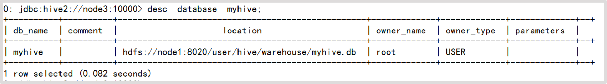

数据库本质上就是在HDFS之上的文件夹。

默认数据库的存放路径是HDFS的：`/user/hive/warehouse`内

可以通过`LOCATION`关键字在创建的时候指定存储目录

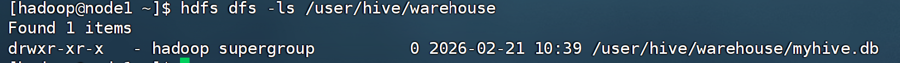


### ③创建数据库并指定hdfs存储位置

```hive
create database myhive2 location '/myhive2';
```

使用**`location`**关键字，可以指定数据库在HDFS的存储路径。


### ④删除数据库

删除一个空数据库，如果数据库下面有数据表，那么就会报错

```hive
drop  database  myhive;
```


**强制**删除数据库，包含数据库下面的表一起删除

```hive
CREATE DATABASE [IF NOT EXISTS] db_name [LOCATION position];

drop  database  myhive2  cascade; 
```


## 二、数据表操作

### 1.表操作语法和数据类型

#### ①创建/删除数据库表

创建表的语法还是比较复杂的

```hive
CREATE [EXTERNAL] TABLE [IF NOT EXISTS] table_name
[ (col_name data_type [COMMENT col_comment], ...) ]
[COMMENT table_comment]
[PARTITIONED BY (col_name data_type [COMMENT col_comment], ...)]
[CLUSTERED BY (col_name, col_name, ...)
 [SORTED BY (col_name [ASC|DESC], ...)] INTO num_buckets BUCKETS
]
[ROW FORMAT row_format]
[STORED AS file_format]
[LOCATION hdfs_path];
```

| **子句**           | **说明**                                                     | **示例**                                       |
| ------------------ | ------------------------------------------------------------ | ---------------------------------------------- |
| **EXTERNAL**       | 创建外部表。删除表时**仅删除元数据**，不删除 HDFS 上的实际数据。 | `CREATE EXTERNAL TABLE ...`                    |
| **PARTITIONED BY** | 建立分区表，用于优化查询性能（物理上表现为子目录）。         | `PARTITIONED BY (dt STRING)`                   |
| **ROW FORMAT**     | 定义数据行的序列化与反序列化规则（常用分隔符）。             | `DELIMITED FIELDS TERMINATED BY ','`           |
| **STORED AS**      | 指定文件存储格式（如文本、列式存储等）。                     | `STORED AS ORC` 或 `PARQUET`                   |
| **LOCATION**       | 指定该表在 HDFS 上的具体存储路径。                           | `LOCATION '/user/hive/warehouse/my_db/my_tbl'` |


尽管建表语法比较复杂，目前我们暂时未接触到分区、分桶等概念。所以，创建一个简答的数据库表可以有如下SQL：

```hive
CREATE TABLE test(	
    id INT,    
    name STRING,    
    gender STRING
);
```


如果要删除表可以使用：

```hive
DROP TABLE table_name;
```


#### ②数据类型

| **分类** | **类型**                                 | **描述**                                       | **字面量示例**                                               |
| -------- | ---------------------------------------- | ---------------------------------------------- | ------------------------------------------------------------ |
| 原始类型 | BOOLEAN                                  | true/false                                     | TRUE                                                         |
|          | TINYINT                                  | 1字节的有符号整数 -128~127                     | 1Y                                                           |
|          | SMALLINT                                 | 2个字节的有符号整数，-32768~32767              | 1S                                                           |
|          | <span style="color:red">INT</span>       | 4个字节的带符号整数                            | 1                                                            |
|          | BIGINT                                   | 8字节带符号整数                                | 1L                                                           |
|          | FLOAT                                    | 4字节单精度浮点数1.0                           |                                                              |
|          | <span style="color:red">DOUBLE </span>   | 8字节双精度浮点数                              | 1.0                                                          |
|          | DEICIMAL                                 | 任意精度的带符号小数                           | 1.0                                                          |
|          | <span style="color:red">STRING</span>    | 字符串，变长                                   | “a”,’b’                                                      |
|          | <span style="color:red">VARCHAR</span>   | 变长字符串                                     | “a”,’b’                                                      |
|          | CHAR                                     | 固定长度字符串                                 | “a”,’b’                                                      |
|          | BINARY                                   | 字节数组                                       |                                                              |
|          | <span style="color:red">TIMESTAMP</span> | 时间戳，毫秒值精度                             | 122327493795                                                 |
|          | <span style="color:red">DATE</span>      | 日期                                           | ‘2016-03-29’                                                 |
|          |                                          | 时间频率间隔                                   |                                                              |
| 复杂类型 | ARRAY                                    | 有序的的同类型的集合                           | array(1,2)                                                   |
|          | MAP                                      | key-value,key必须为原始类型，value可以任意类型 | map(‘a’,1,’b’,2)                                             |
|          | STRUCT                                   | 字段集合,类型可以不同                          | struct(‘1’,1,1.0), named_stract(‘col1’,’1’,’col2’,1,’clo3’,1.0) |
|          | UNION                                    | 在有限取值范围内的一个值                       | create_union(1,’a’,63)                                       |


Hive中支持的数据类型还是比较多的

其中<span style="color:red">红色</span>的是使用比较多的类型(github直接浏览可能没有颜色,请下载md文档到本地查看)


### 2.内/外部表介绍

> 开始之前,需要先介绍一下表分类
>
> Hive中可以创建的表有好几种类型， 分别是：

<span style="color:red">内部表</span>

<span style="color:red">外部表</span>

分区表

分桶表

不同类型的表有各自的用途。

我们首先学习内部表和外部表的区别。


-----

**内部表**（CREATE TABLE table_name ......）

未被`external`关键字修饰的即是内部表， 即普通表。 
内部表又称管理表,内部表数据存储的位置由`hive.metastore.warehouse.dir`参数决定（默认：/user/hive/warehouse）,
删除内部表会直接<span style="color:red">删除元数据（metadata）及存储数据</span>，因此内部表不适合和其他工具共享数据。


**外部表**（CREATE EXTERNAL TABLE table_name ......LOCATION......）

被`external`关键字修饰的即是外部表， 即关联表。
外部表是指表数据可以在任何位置，通过`LOCATION`关键字指定。 数据存储的不同也代表了这个表在理念是并不是Hive内部管理的，而是可以随意临时链接到外部数据上的。
所以，在删除外部表的时候， 仅仅是删除元数据（表的信息），不会删除数据本身。


快速对比一下内部表和外部表:

|        | **创建**                     | **存储位置**                         | **删除数据**                     | **理念**           |
| ------ | ---------------------------- | ------------------------------------ | -------------------------------- | ------------------ |
| 内部表 | CREATE TABLE ......          | Hive管理，默认`/user/hive/warehouse` | 删除 元数据（表信息）删除 数据   | Hive管理表持久使用 |
| 外部表 | CREATE EXTERNAL TABLE ...... | 随意，`LOCATION`关键字指定           | 仅删除 元数据（表信息）保留 数据 | 临时链接外部数据用 |


### 3.内部表操作

#### ①创建内部表

内部表的创建语法就是标准的：CREATE TABLE table_name......

创建一个基础的表:

```hive
create database if not exists myhive;

use myhive;

create table if not exists stu(id int,name string);

insert into stu values (1,"zhangsan"), (2, "wangwu");select * from stu;
```


查看表的数据存储在HDFS上，查看表的数据存储文件

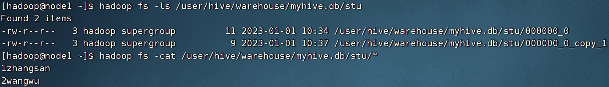


#### ②数据分隔符

可以看到，数据在HDFS上也是以明文文件存在的。


奇怪的是， 列ID和列NAME，好像没有分隔符，而是挤在一起的。这是因为，默认的数据分隔符是：”\001”是一种特殊字符，是ASCII值，键盘是打不出来在某些文本编辑器中是显示为SOH的。

例如1zhangsan其实是:1`SOH`zhangsan

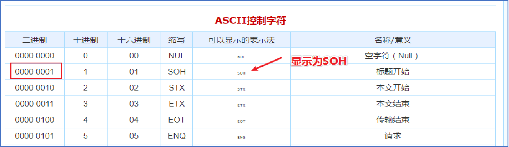


#### ③自行指定分隔符

所以我们可以自行指定

在创建表的时候可以自己决定：

```hive
create table if not exists stu2(id int ,name string) row format delimited fields terminated by '\t';
```

`row format delimited fields terminated by '\t'`：表示以`\t`分隔 `\t`是我们常见的分隔符,这个大家就很熟悉了

这样中间就更友好的分隔显示出来了

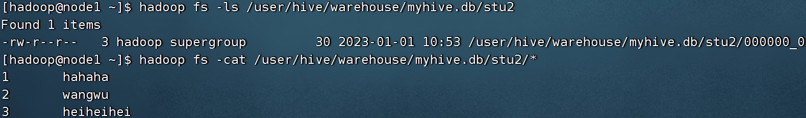


#### ④其它创建内部表的形式

除了标准的`CREATE TABLE table_name`的形式创建内部表外,我们还可以通过：

- `CREATE TABLE table_name as`，基于查询结果建表
  e.g. `create table stu3 as select * from stu2;`

- `CREATE TABLE table_name like`，基于已存在的表结构建表
  e.g.` create table stu4 like stu2;`

- 也可以使用`DESC FORMATTED table_name`，查看表类型和详情
  e.g. `DESC FORMATTED stu2;`


#### ⑥删除内部表

我们是内部表删除后，数据本身也不会保留。

- `DROP TABLE table_name`，删除表

  e.g. `drop table stu2`;

  

  可以看到，stu2文件夹已经不存在了，数据被删除了。


### 4.外部表操作

#### ①外部表创建

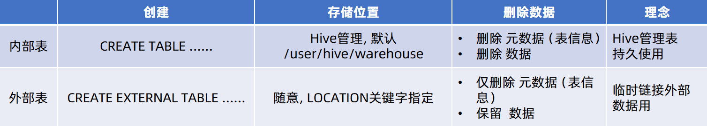

外部表，创建表被`EXTERNAL`关键字修饰，从概念是被认为并非Hive拥有的表，只是临时关联数据去使用。

创建外部表也很简单，基于外部表的特性，可以总结出： 外部表 和 数据 是相互独立的， 即：

- <span style=color:red>可以先有表</span>，然后把数据移动到表指定的LOCATION中

- <span style="color:red">也可以先有数据</span>，然后创建表通过LOCATION指向数据

1.在Linux上创建新文件，test_external.txt，并填入如下内容：

```
1	itheima
2	itcast
3	hadoop
```

数据列用`\t`分隔,我们前文提到过


2.演示<span style="color:red">先创建外部表，然后移动数据</span>到LOCATION目录

- 首先检查：`hadoop fs -ls /tmp`，确认不存在`/tmp/test_ext1`目录

- 创建外部表：

  ```hive
  create external table test_ext1(id int, name string) row format delimited fields terminated by ‘\t’ location ‘/tmp/test_ext1’;
  ```

- 可以看到，目录`/tmp/test_ext1`被创建

- ```hive
  select * from test_ext1
  ```

  空结果，无数据

- 上传数据： `hadoop fs -put test_external.txt /tmp/test_ext1/` 

- ```hive
  select * from test_ext1
  ```

  即可看到数据结果


3.演示<span style="color:red">先存在数据，后创建外部表</span>

- `hadoop fs -mkdir /tmp/test_ext2`

- `hadoop fs -put test_external.txt /tmp/test_ext2/`

- ```hive
  create external table test_ext2(id int, name string) row format delimited fields terminated by ‘\t’ location ‘/tmp/test_ext2’;
  ```

- `select * from test_ext2;`


#### ②删除外部表

```hive
drop table test_ext1;

drop table test_ext2;
```

可以发现，在Hive中通过show table，表不存在了
但是在HDFS中，数据文件<span style="color:red">依旧保留</span>


#### ③内外部表转换

Hive可以很简单的通过SQL语句转换内外部表。

- 查看表类型：desc formatted stu;


转换

- 内部表转外部表

  ```hive
  alter table stu set tblproperties('EXTERNAL'='TRUE');
  ```

- 外部表转内部表

  ```hive
  alter table stu set tblproperties('EXTERNAL'='FALSE');
  ```

  通过stu set tblproperties来修改属性

  <span style="color:red">要注意：('EXTERNAL'='FALSE') 或 ('EXTERNAL'='TRUE')为固定写法，区分大小写！！！</span>


外部表和其数据，是相互独立的，即：

- 可以先有表后有数据
- 也可以先有数据，后有表
- 表和数据只是一个链接关系
- 所以删除表，表不存在了但数据保留。


### 5.数据的加载和导出

#### 数据加载 

##### ①**数据加载 -Load语法**

我们使用 LOAD 语法，从外部将数据加载到Hive内，语法如下：


建表：

```hive
CREATE TABLE myhive.test_load(
  dt string comment '时间（时分秒）', 
  user_id string comment '用户ID', 
  word string comment '搜索词',
  url string comment '用户访问网址'
) comment '搜索引擎日志表' ROW FORMAT DELIMITED FIELDS TERMINATED BY '\t';
```


数据为:search.txt

```
00:00:01        1233215666      传智播客        http://www.itcast.cn
00:50:00        2233216666      黑马程序员      http://www.itcast.cn
01:06:00        3233217666      大数据  http://www.itcast.cn
03:36:00        3233218666      hadoop  http://www.itcast.cn
19:39:00        2233219666      python  http://www.itcast.cn
21:26:00        1233211666      大数据开发      http://www.itcast.cn
23:22:00        6233212666      itheima http://www.itcast.cn
```


加载 还是一样`local`代表从linux中加载,不加`local`代表从HDFS中加载

```hive
load data local inpath '/home/hadoop/search_log.txt' into table myhive.test_load;
load data inpath '/tmp/search_log.txt' overwrite into table myhive.test_load;
```

> <span style="color:red">注意，基于HDFS进行load加载数据，源数据文件会消失（本质是被移动到表所在的目录中）</span>


---

##### **②数据加载 - INSERT SELECT 语法**

除了`load`加载外部数据外，我们也可以通过SQL语句，从其它表中加载数据。

语法：

```hive
INSERT [OVERWRITE | INTO] TABLE tablename1 [PARTITION (partcol1=val1, partcol2=val2 ...) [IF NOT EXISTS]] select_statement1 FROM from_statement;
```

将`SELECT`查询语句的结果插入到其它表中，被SELECT查询的表可以是内部表或外部表。

示例：

```hive
INSERT INTO TABLE tbl1 SELECT * FROM tbl2;
INSERT OVERWRITE TABLE tbl1 SELECT * FROM tbl2;
```

>  `INTO`          是追加, 如果是插入相同的目标,则在末尾追加
>
>  `OVERWRITE` 是覆写,如果插入相同的目标,会覆盖旧有内容 
>
>  其中 `INSERT INTO TABLE tbl1 SELECT * FROM tbl2;`是查询结果插入,把 `tb2` 表里的所有数据，“拷贝”一份放入 `tb1` 表中。


对于数据加载，我们学习了：LOAD和INSERT SELECT的方式，那么如何选择它们使用呢？

- 数据在本地推荐 :

  `load data local`加载

- 数据在HDFS

  - 如果不保留原始文件：	推荐使用LOAD方式直接加载

  - 如果保留原始文件：	    推荐使用外部表先关联数据，然后通过INSERT SELECT 外部表的形式加载数据

- 数据已经在表中只可以INSERT SELECT


在这里关于不保留原始文件和保留原始文件做一些解释:

**场景 A：使用 `LOAD DATA`（不保留原始文件）**

当你执行：`LOAD DATA INPATH '/tmp/my_data/words.txt' INTO TABLE stu;`

- **动作**：Hive 会直接调用 HDFS 的 `mv`（移动）命令。
- **结果**：文件从 `/tmp/my_data/` 消失了，跑到了 `/user/hive/warehouse/myhive.db/stu/` 下面。
- **代价**：原始路径空了，如果别的程序（比如 Spark 或 Flink）也要用这个文件，就找不到了。


**场景 B：使用“外部表关联 + INSERT SELECT”（保留原始文件）**

这是你问的重点，它分三步走：

**第一步：创建外部表“关联”原始路径**

```hive
CREATE EXTERNAL TABLE t_ext(line string) 
LOCATION '/tmp/my_data/'; -- 这里就是“关联”，只是登记了地址
```

- 此时，文件还在 `/tmp/my_data/`，没动。

**第二步：创建正式的内部表（存放到仓库）**

```hive
CREATE TABLE t_final(line string); 
```

**第三步：通过 INSERT SELECT 搬运数据**

```hive
INSERT INTO TABLE t_final SELECT * FROM t_ext;
```


**核心逻辑**：`LOCATION` 相当于“标记”了 `t_ext`，

- **对于外部表**：这个“标记”告诉 Hive：“这块地不是我的，我只是有个观察位（Metadata）。”
- **所以**：当你对这个“标记”的表做任何操作时，Hive 的底层逻辑是 **“只读不写”**。它绝对不会去移动或删除这个路径下的原始文件。

同时`INSERT SELECT` 这个动作本身就决定了它必须是**“复制”**。

> **`LOAD DATA` 命令**：它的本质是 **“文件管理命令”**。它像是在 Linux 里执行 `mv`。为了效率，它直接把文件挪走。

**`INSERT SELECT` 命令**：它的本质是 **“计算命令”**。

- 它会启动 **MapReduce**。
- **Map 阶段**：去 `t_ext` 标记的路径下**读取**（Read）每一行数据。
- **Reduce 阶段**：把读到的数据加工后，**写入**（Write）到 `t_final` 对应的仓库路径下。
- **结果**：读操作不会破坏原文件，写操作产生了新文件。所以，**客观上完成了“复制”**。


这里有个很有意思的问题:**如果 `t_ext` 是内部表，执行 `INSERT SELECT` 会怎样？也就是为什么我们要创立外部表**

假设 `t_ext` 也是一个**内部表**，你执行： `INSERT INTO TABLE t_final SELECT * FROM t_ext;`

- **结果依然是：** 两个表里都有数据（复制）。
- **差别在于：** 如果你接下来执行 `DROP TABLE t_ext`，因为它是内部表，它的那份数据就会被删掉。
- **而如果是外部表：** 你删掉 `t_ext`，原始文件依然在。


之所以“先建外部表关联”能保留原文件，最根本的原因在于：**外部表（External Table）在设计上放弃了对数据的“所有权（Ownership）”，它只保留了“使用权”。**


在 Hive 的逻辑里：

- **内部表（Managed Table）**：Hive 认为这块数据是它“家”里的。既然是家里的东西，它有权把文件从别处**搬进**自己家（`LOAD` 操作），或者在不需要时把东西**扔掉**（`DROP` 操作）。

- **外部表（External Table）**：Hive 认为这块数据是“邻居”家或者“公共仓库”里的。建表语句里的 `LOCATION` 实际上是在说：**“喂，Hive，那儿有一堆数据，你以后查这张表时，就去那个地址看一眼，别乱动人家的东西。”**

  

​      当你执行 `CREATE EXTERNAL TABLE ... LOCATION '/tmp/data'` 时：Hive 没有任何移动文件的动作。它只是在 MySQL 的元数据库里登记了一下：表名 t2 对应路径 `/tmp/data`。


**结果**：

1. 原始文件 `words.txt` 依然在 `/tmp/my_data/`（**保留了原始文件**）。
2. 仓库里多了一份经过处理的数据（**完成了加载**）。


#### **数据导出**

##### **①数据导出 - insert overwrite 方式**

将hive表中的数据导出到其他任意目录，例如linux本地磁盘，例如hdfs，例如mysql等等

语法：

```hive
insert overwrite [local] directory ‘path’ select_statement1 FROM from_statement;
```

将查询的结果导出到本地 - 使用默认列分隔符:

```hive
insert overwrite local directory '/home/hadoop/export1' select * from test_load ;
```

将查询的结果导出到本地 - 指定列分隔符

```hive
insert overwrite local directory '/home/hadoop/export2' row format delimited fields terminated by '\t' select * from test_load;
```

将查询的结果导出到HDFS上(不带local关键字)

```hive
insert overwrite directory '/tmp/export' row format delimited fields terminated by '\t' select * from test_load;
```


##### **②hive表数据导出 - hive shell**

基本语法：（hive -f/-e 执行语句或者脚本 > file）

直接在命令行里写sql然后>导出

```shell
bin/hive -e "select * from myhive.test_load;" > /home/hadoop/export3/export4.txt
```

另一种是把sql命令vim到文件(export.sql)里,然后>导出,效果一样,只不过可预见的写入到文件里拓展性和上制更高

```shell
bin/hive -f export.sql > /home/hadoop/export4/export4.txt
```


##### ③特别内容:`>`

另外再总结一下导出`>`

在 Linux 中，每一个运行的程序默认都会打开三个“管道”。你提到的数字其实是**文件描述符 (File Descriptor)**：

| **符号** | **描述**     | **名称** | **作用**                                   |
| -------- | ------------ | -------- | ------------------------------------------ |
| **`0>`** | 标准输入     | `stdin`  | 比如你键盘输入的内容。                     |
| **`1>`** | **标准输出** | `stdout` | 程序正常运行产生的结果（默认显示在屏幕）。 |
| **`2>`** | **标准错误** | `stderr` | 程序报错时的信息（默认也显示在屏幕）。     |

常用组合技：

- **`>` (等同于 `1>`)**：**覆盖**重定向。把正常结果存入文件，报错信息依然吐在屏幕上。
- **`>>`**：**追加**重定向。不删除旧内容，在文件末尾续写。
- **`2>`**：**错误**重定向。只把报错信息存入文件。
- **`&>`**：**全都要**。把正常结果和报错信息通通存入同一个文件。
- **`1> a.txt 2> b.txt`**：**各回各家**。正常结果去 a，报错去 b。

> **关于 `3>`**：在 Linux 中，3-9 是预留给用户自定义的描述符。在大数据开发中几乎用不到，通常是写复杂脚本时用来做特殊的临时管道。


##### 总结

**为什么要加载数据而非使用外部表？**

- 外部表是临时使用的，重要数据建议存入内部表进行管理

**加载数据的语法**:

- `LOAD DATA [LOCAL] INPATH 'filepath' [OVERWRITE] INTO TABLE tablename;`
- `INSERT INTO|OVERWRITE SELECT...`

**注意事项**：
使用LOAD语句：

- 数据来源本地，本地数据文件会保留，本质是本地文件上传到
- HDFS据来自HDFS，加载后文件不存在，本质是在HDFS上进行文件移动


**Hive数据导出的方式:**

- `INSERT [LOCAL] SELECT`
- `bin/hive -e 'SQL' > file`
- `bin/hive -f ‘sql file’ > file`


## 三、分区表

在大数据中，最常用的一种思想就是分治，我们可以把大的文件切割划分成一个个的小的文件，这样每次操作一个小的文件就会很容易了

同样的道理，在hive当中也是支持这种思想的，就是我们可以把大的数据，按照每天，或者每小时进行切分成一个个的小的文件，这样去操作小的文件就会容易得多了。

**分区表 (Partitioned Table)** 也是 Hive 的“加速器”。


**为什么要分区？（解决“全表扫描”的痛苦）**

想象你有一个存了 10 年记录的表 `stu`，数据量有 100TB。

- **没有分区**：如果你只想看“昨天”的数据，Hive 必须把 10 年的数据**全部读一遍**，然后过滤出昨天的。这就像是在一个堆满 10 年报纸的房间里找昨天的头条，你会疯掉，集群也会被你跑死。
- **有了分区**：Hive 会把 10 年的数据分成 3650 个“小文件夹”。查询时，Hive 直接跳过其他文件夹，只读昨天的那个。这就是**分区裁剪 (Partition Pruning)**。


**物理本质：分区 = HDFS 子目录**

这是理解分区最直接的方法。在 Hive 里，一个分区对应的就是一个 **HDFS 目录**。

假设你创建了一个按月分区的表：

```hive
CREATE TABLE order_monthly (
    order_id string,
    price double,
    user_id string
)
PARTITIONED BY (month string)  -- 分区字段
ROW FORMAT DELIMITED FIELDS TERMINATED BY '\t';
```

你在 HDFS 看到的目录结构长这样：


> `/user/hive/warehouse/score/month=2026-01/`
>
> `/user/hive/warehouse/score/month=2026-01/`

 

#### 1. 分区表的关键语法

##### A. 创建分区表

注意：分区字段（如 `dt`）**千万不要**出现在 `CREATE TABLE` 的普通字段列表里，它定义在 `PARTITIONED BY` 中。

```hive
CREATE TABLE stu_partition (id int, name string) 
PARTITIONED BY (month string);
```

##### B. 加载数据（静态分区）

你需要手动告诉 Hive，这批数据属于哪个“文件夹”。

```hive
LOAD DATA LOCAL INPATH '/home/hadoop/words.txt' 
INTO TABLE stu_partition PARTITION (month='202602');
```

##### C. 查询数据（性能飞跃的关键）

查询时必须带上分区字段作为过滤条件，否则依然会全表扫描。

```hive
SELECT * FROM stu_partition WHERE month = '202602';
```


静态分区 vs. 动态分区

**动态分区的“坑”：** 默认为了防止你一下子创建几万个文件夹把 NameNode 搞死，动态分区是关闭或受限的。开启它需要设置

```shell
SET hive.exec.dynamic.partition=true; -- 开启动态分区
SET hive.exec.dynamic.partition.mode=nonstrict; -- 允许所有分区都是动态的
```


#### 2.动态分区

##### 介绍

**静态分区**（手动指定 `month='202006'`），**动态分区 (Dynamic Partitioning)** 会更加便利,类似于自动分拣机。

| **特性**     | **静态分区 (Static)**                             | **动态分区 (Dynamic)**                               |
| ------------ | ------------------------------------------------- | ---------------------------------------------------- |
| **决定权**   | **你(开发者)**（在 SQL 里写死：`month='202006'`） | **数据本身**（根据某列的值自动分目录）               |
| **操作命令** | `LOAD DATA` 或 `INSERT`                           | **只能用 `INSERT SELECT`**                           |
| **适用场景** | 每天处理一份确定的数据（如：昨天的日志）          | 历史数据全量入库（比如把 10 年的数据一次性按月分好） |


为了防止新手不小心创建了几万个小文件夹导致 NameNode 崩溃，Hive 默认把动态分区管得很严。你想用，必须先执行这两行“口令”：

```shell
-- 1. 开启总开关
SET hive.exec.dynamic.partition=true;

-- 2. 设置为非严格模式 (nonstrict)
-- 默认是 strict（严格），要求至少有一个静态分区。
-- 设置为 nonstrict，表示允许所有分区字段都是动态的。
SET hive.exec.dynamic.partition.mode=nonstrict;
```


##### 实战演示

假设你有一个**临时表** `score_temp`，里面存了 3 个月的数据，长这样：

| **id** | **name** | **score** | **dt_col** |
| ------ | -------- | --------- | ---------- |
| 1      | 周杰伦   | 99        | 202005     |
| 2      | 林俊杰   | 88        | 202006     |
| 3      | 王力宏   | 77        | 202007     |

你想把这些数据插到你的**分区表** `score` 里，让它自动进对应的文件夹。

**错误的直觉：** 你可能会想用 `LOAD DATA`。

- **真相**：`LOAD DATA` 只是搬运文件，它不会去读文件内容，所以**无法**实现动态分区。

**正确的姿势：使用 `INSERT SELECT`**

```hive
INSERT OVERWRITE TABLE score PARTITION (month) -- 这里只写字段名，不写具体的值
SELECT id, name, score, dt_col -- 重点：分区字段必须放在 SELECT 的最后一列！
FROM score_temp;
```


##### 规则

**同时有一些规则也是需要注意的:**

**位置决定论**： Hive 是根据 `SELECT` 语句中**最后一列**的值来决定分区的，而不是根据列名。

- 哪怕你的最后一列叫 `abc`，只要它的值是 `202005`，Hive 就会把它丢进 `month=202005` 文件夹。

**自动创建目录**： 如果 `SELECT` 出来的月份在 HDFS 里还没目录，Hive 会自动帮你 `mkdir`。

**性能压力**： 如果你的数据里有 1000 个不同的月份，这个任务会同时打开 1000 个文件写入流，非常消耗内存。


##### **使用场景**

在标准的生产环境中，静态分区和动态分区并不是非黑即白的选择，它们通常是“组合拳”,

**1. 静态分区 (Static)：**

**核心场景：每日增量离线加工。** 这是大数据开发中最常见的场景。比如每天凌晨 1 点，跑昨天的经营数据。

- **为什么用静态？**
  - **可控性极高**：你在脚本里明确知道今天要处理的是 `2026-02-20` 的数据。
  - **效率最高**：不需要 Hive 去扫描整份数据来判断该往哪投递，直接对准那个“坑”就灌进去。
- **生产实战：** 通常配合 **Shell 脚本** 或 **调度工具（如 Airflow, DolphinScheduler）** 使用。

```shell
# 脚本中的伪代码
today=$(date -d "yesterday" +%Y%m%d)
hive -e "LOAD DATA LOCAL INPATH '...' INTO TABLE score PARTITION (dt='$today')"
```


------

**2.动态分区 (Dynamic)：**

**核心场景 A：历史数据一次性补录 (Backfill)。** 老板突然说：“把过去 3 年的 Excel 成绩单全部导进 Hive。”

- **痛点**：如果你用静态，你要写 1000 多个 `LOAD` 语句（每天一个）。
- **解法**：先把 3 年数据传到一个临时表，然后一个**动态分区 `INSERT`**，Hive 自动按数据里的日期分好 1000 个目录。

**核心场景 B：数据流中包含多个分区的数据。** 比如一个埋点日志流，虽然是今天收到的，但里面可能混杂了前天因为网络延迟刚传回来的数据。

- **解法**：通过动态分区，让数据根据自己的时间戳“各回各家”，避免前天的数据被误存在今天的目录下。


#### **3. 分区表的“坑”与避坑指南**

在生产中，随意使用动态分区可能会导致集群崩溃（尤其是 OOM 或 NameNode 压力过大）。以下是职业选手的操作规范：

1. **限制分区总数**： 设置 `hive.exec.max.dynamic.partitions=1000;`。如果你的 SQL 尝试一次性创建 1 万个分区，Hive 会直接“自杀”报错，保护集群不被你搞死。

2. **强制开启 `DISTRIBUTE BY`**： 在执行动态分区 `INSERT` 时，最好在 SQL 最后加上 `DISTRIBUTE BY 分区字段`。

   - **作用**：让相同的分区数据流向同一个 Reducer，这样每个 Reducer 只会打开一个文件句柄。否则，如果每个 Reducer 都写 1000 个分区，文件句柄数会瞬间爆炸。

3. **严格模式 (Strict Mode)**： 虽然我们实验时用了 `nonstrict`，但生产环境有些公司强行要求 `strict`。即：**必须指定一个静态分区，剩下的再动态。**

   ```hive
   -- 比如：年份是定的（静态），月份是变的（动态）
   INSERT INTO table_name PARTITION (year='2026', month) 
   SELECT ..., month_col FROM tmp;
   ```


## 四、分桶表

很前文说的分区表进行对比,如果说**分区表**是按“文件夹”进行大排队，那么**分桶表（Bucketed Table）**就是按“文件”进行精细化的抽屉式管理。

在 Hive 的优化手段中，分桶表属于“重型武器”，通常用于解决**大数据量的 Join（关联）性能瓶颈**。


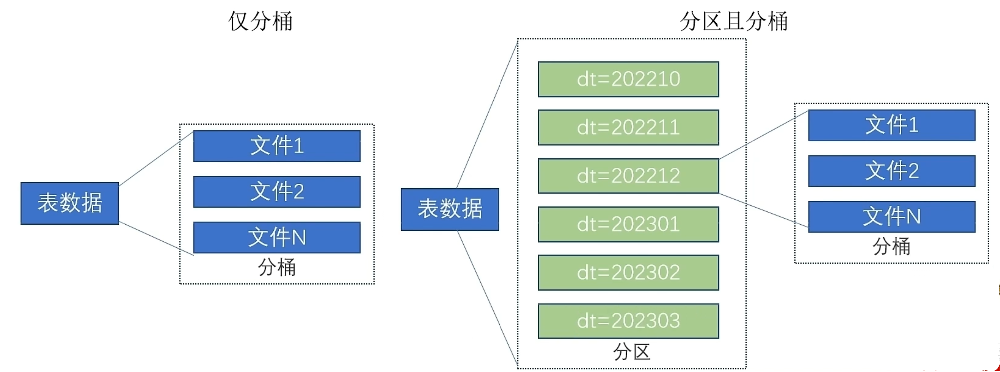


### 1. 什么是分桶表？

**（物理本质：文件分片）**

- **分区**：在 HDFS 上表现为**文件夹**。
- **分桶**：在 HDFS 上表现为**文件**。

它通过对分桶字段进行 **Hash 运算**，然后对桶数**取模**，将数据打散到固定数量的文件中。


**分桶基于一定规则:**

1. 统一的“分拣规则”

分桶不是随机扔的，而是用同一个数学公式：

> **桶编号 = 哈希值(user_id)  除以 10 的余数**

2. 确定性的“去向”

假设用户 `周杰伦` 的 `user_id` 是 `888`。

- **在表 A 中**：`888 % 10 = 8` $\rightarrow$ 进入 **第 8 号桶文件**。
- **在表 B 中**：`888 % 10 = 8` $\rightarrow$ 也必然进入 **第 8 号桶文件**。


3. “精准对位”的关联

当 Hive 执行 Join 时：

- 它不需要让表 A 的第 8 桶去和表 B 的 1、2、3...10 桶挨个碰头。
- 它非常确定：**如果表 B 里有“周杰伦”，他一定也只会在表 B 的第 8 桶里。**


**原本的“大乱斗”变成了“小组赛”：**

- **普通 Join**：像是在 1000 人的大海里捞针，每个人都要互相打个招呼（笛卡尔积或全量 Shuffle）。
- **分桶 Join**：变成了 10 个小组，每组 100 人，**1 号组只和 1 号组玩**。剩下的 9 个小组（90% 的数据）连看都不用看。


**必须满足的两个前提**：

这种“魔法”生效是有条件的：

1. **分桶字段必须相同**：比如都是 `user_id`。
2. **桶数必须成倍数关系**：最好是完全相等（比如都是 10 桶），或者是 10 桶 Join 20 桶。


### 2. 为什么需要分桶？

**（三大核心价值）**

**A. 极速 Join：SMB Join (Sort Merge Bucket Join)**

这是分桶表存在的最大意义。

- **普通 Join**：两个 1TB 的表 Join，MapReduce 需要把所有数据拉取到一起进行 Shuffle，极慢且容易内存溢出。
- **分桶 Join**：如果两个表都按 `user_id` 分了 10 个桶。Hive 知道：表 A 桶 1 里的用户，**绝对不可能**出现在表 B 的桶 2 到 10 里。
- **结果**：Hive 只需要让两个表的“对应桶”进行一对一关联。1TB 的 Join 变成了 10 个 100GB 的本地 Join。

**B. 高效抽样 (Sampling)**

如果你有 10 亿行数据，只想随机取 $1\%$ 来看逻辑对不对：

- **普通表**：需要全表扫描，费时费力。
- **分桶表**：直接抽取其中一个桶的文件即可，速度瞬间提升。

**C. 优化查询性能**

对于频繁作为过滤条件的字段进行分桶，可以显著减少扫描的数据量。


### 3.分桶表的创建

#### ①.开启自动匹配

开启分桶表的自动优化(自动匹配reduce task数量和桶数量一致)

```hive
set hive.enforce.bucketing=true
```


#### ②.创建分桶表

```hive
`create table course(c_id string,c_name string,t_id string) clustered[按照哪个列] by(c_id) into 3 buckets row format delimited fields terminated by '\t'; `
```


### 4.分桶表数据加载

桶表的数据加载，由于桶表的数据加载通过<span style="color:red">~~load data~~无法执行</span>，因为分桶就要划分数据(3个桶划分3份数据,而前文提到过数据的划分基于分桶列的值进行hash取模来决定),而load data不会触发map reduce,也就是没有计算过程(无法执行hash算法),只是简单移动而已所以无法用于分桶数据插入,后面还会解释

只能通过**`insert select.`**

所以，比较好的方式是:

1.创建一个临时表(外部表或内部表均可)，通过`load data`加载数据进入表
2.然后通过`insert select`从临时表向桶表插入数据
创建普通表:

```hive
create table course common (c id string,c name string,t id string) row format delimited fields terminated by "\t';
```

普通表中加载数据:

```hive
load data local inpath '/export/server/hivedatas/course.txt' into table course _common;
```


通过`insert overwrite`给桶表中加载数据:

```hive
insert overwrite table course select * from course_ common cluster by(c id);
```


>  这里来解释一下为什么桶表无法通过load data加载数据

只需要记住一句关键:`LOAD DATA` 是“搬运工”，而分桶需要“分拣员”。

**1.核心矛盾：搬运 vs 计算**

- **`LOAD DATA` 的本质**：它是一个 **文件级** 的操作。在 HDFS 底层，它只是简单地执行了 `mv`（移动）或 `cp`（复制）。**它根本不会打开文件去看里面的内容。**

- **分桶的本质**：它是一个 **数据级** 的操作。要实现分桶，Hive 必须读取每一行数据，取出分桶字段的值，计算：

  $$\text{Bucket ID} = \text{hash(字段值)} \pmod{\text{桶数}}$$

  然后根据计算结果，把这一行派发到对应的文件里。

**矛盾点：** 如果你用 `LOAD DATA` 把一个大文件丢进分桶表，Hive 并没有运行 MapReduce 任务去拆解这个文件。结果就是：文件夹里只有一个大文件，而不是你预期的 N 个桶文件。

**2. 如果强行 `LOAD DATA` 会发生什么？**

Hive 技术上**允许**你执行 `LOAD DATA` 往分桶表里塞数据，但这是一个**巨大的坑**：

1. **物理结构破坏**：假设你定义了 4 个桶，但 `LOAD` 进去只有一个文件。HDFS 目录里看到的不是 `000000_0` 到 `000003_0`，而是一个原始的文件名。
2. **查询结果错误**：当你执行抽样查询（Sampling）或者 SMB Join 时，Hive 会根据“这里应该有 4 个桶”的假设去读文件。因为它发现数据没按规则分布，你的查询结果会**随机丢失**或者完全牛头不对马嘴。

**3. 为什么 `INSERT SELECT` 可以？**

当你执行 `INSERT INTO ... SELECT ...` 时：

1. Hive 会启动一个 **MapReduce (或 Tez)** 任务。
2. **Reducer** 的数量会被强制设置为和你定义的**桶数**相等（或者成倍数）。
3. Shuffle 阶段，MapReduce 框架会自动根据 `hash(字段) % 桶数` 把数据分发给对应的 Reducer。
4. 每个 Reducer 最终写出一个文件。

这样，HDFS 目录下的文件数量和数据分布就完全符合分桶表的规则了。

----


#### 案例

```hive
--创建分桶表
create table course(c_id string,c_name string,t_id string) clustered by (c_id)
into 3 buckets row format delimited fields terminated by '\t';

--向分桶表加载数据
--步骤1.先创建一个临时的中转表
create table course_temp(c_id string,c_name string,t_id string) row format delimited fields terminated by'\t';

--步骤2向中转表load date
load data local inpath '/home/hadoop/course.txt' into table myhive.course_temp;

select * from course_temp;

--步骤3.从中转表进行insert select向分桶表加载数据
insert overwrite table myhive.course select * from course_temp cluster by (c_id);
```

**步骤1.**因为分桶表 `course` 没法直接 `load data`。所以先建了一个结构一模一样的普通表 `course_temp` 作为“缓冲垫”。

**步骤2.****文件变动**：

   - `/home/hadoop/course.txt` **还在**（因为用了 `LOCAL`）。
   - HDFS 的 `course_temp` 目录下多了一个 `course.txt` 的**完整副本**。


**步骤3**.

**A. 为什么用 `insert overwrite`？**

- **安全性**：即使你之前往 `course` 表里乱塞过数据，`overwrite` 会先清空目录，确保最终 `course` 表里只有 3 个整洁的桶文件。
- **原子性**：如前所述，它会先写临时文件夹，成功后再替换。


**B. `cluster by (c_id)` 的神来之笔**

这里用了 `cluster by` 而不是简单的 `select *`。对性能极致追求：

- **等价逻辑**：`cluster by (c_id)` = `distribute by (c_id)` + `sort by (c_id)`。
- **作用**：它强制 MapReduce 按 `c_id` 进行哈希分发，**并且在每个桶内按 `c_id` 排序**。
- **生产意义**：这不仅完成了分桶，还完成了排序。以后如果你用 `course` 表做 Join（SMB Join），速度会快得飞起！


**C. 文件分片 (HDFS 层面)**

当你运行完这一行，你可以去 HDFS 观察一下：

```shell
hdfs dfs -ls /user/hive/warehouse/myhive.db/course
```

**你将会看到：** 目录下不再是 `course.txt`，而是 **3 个文件**（因为你定义了 `into 3 buckets`）：

- `000000_0`
- `000001_0`
- `000002_0`


| **环节**             | **物理动作**                    | **结果**                                     |
| -------------------- | ------------------------------- | -------------------------------------------- |
| **Linux 本地**       | 原始文件 `course.txt`           | 不动，作为备份。                             |
| **`course_temp` 表** | `LOAD` 进去的完整文件           | 作为一个“中间桥梁”，供 Hive 读取。           |
| **`course` 表**      | `INSERT OVERWRITE` 计算出的结果 | 变成了 **3 个经过哈希计算且有序** 的小文件。 |


### 5.分桶表的性能提升

如果说分区表的性能提升是:在指定分区列的前提下，减少被操作的数据量，从而提升性能。
分桶表的性能提升就是:基于分桶列的特定操作，如:过滤、J0IN、分组，均可带来性能提升。


**基于分桶列,过滤单个值**

比如我们想过滤某个值,那么根据hash取余就能锁定在对应的文件里,而排除其他可能,如果分桶有3个,排除67%的数据,如果有10个,那就一下子派出了90%的数据

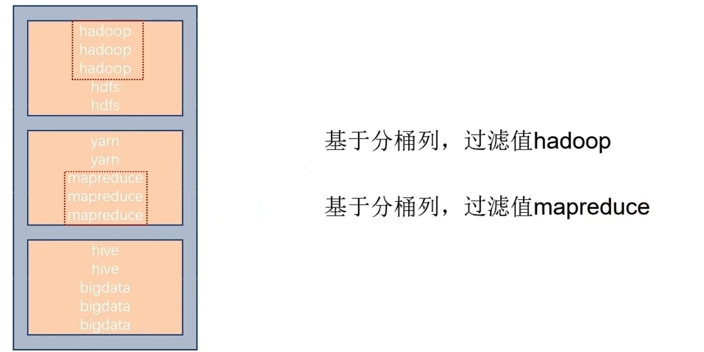


**基于分桶列,进行双表join**

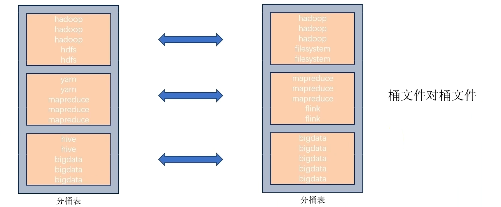

也是可以快速锁定没这也是我们前文提到过的A. 极速 Join：SMB Join (Sort Merge Bucket Join)


基于分桶列,`group by`分组

我们发现此时已经分组了,自动归并为各个组


### 6.修改表操作

**表重命名**

```hive
alter table old_table_name renametonew_table_name;

-- e.g.
alter table score4 rename to score5;
```


**修改表属性值**

```hive
ALTER TABLE table_name SET TBLPROPERTIES table_properties;

table_properties:
 (property_name = property_value, property_name = property_value,... )

-- e.g.
ALTER TABLE table_name SET TBLPROPERTIES("EXTERNAL"="TRUE"); 修改内外部表属性

-- e.g.
ALTER TABLE table_name SET TBLPROPERTIES ('comment' = new_comment); 修改表注释

--其余属性可参见: 
htps://cwiki.apache.org/confluence/display/Hive/LanguageManualtDDL# LanguageManualDoL-listTableProperties
```


**添加分区**

```hive
ALTER TABLE tablename ADD PARTITION (month='201101');
                                                        
alter table score2 add partition (year='2019',month='10',day='01');                       
```

新分区是空的没数据，需要手动添加或上传数据文件


**修改分区值**

```hive
ALTER TABLE tablename PARTITION (month='202005') RENAME TO PARTITION (month='201105');

alter table score2 partition (year='2019',month='10',day='01') rename to partition (year='2019',month='10',day='07');
```


**删除分区**

```hive
ALTER TABLE tablename DROP PARTITION (month='201105');

alter table score2 drop partition (year='2019',month='10',day='07')
```


**添加列**

```hive
ALTER TABLE table_name ADD COLUMNS (v1 int, v2 string);
```

**修改列名**

```hive
ALTER TABLE test_change CHANGE v1 v1new INT;
```

**删除表**

```hive
DROP TABLE tablename;
```

**清空表**

```hive
TRUNCATE TABLE tablename;
```

ps:只可以清空内部表


### 7.复杂类型操作

Hive支持的数据类型很多，除了基本的：int、string、varchar、timestamp等还有一些复杂的数据类型：

- array数组类型
- map映射类型
- struct结构类型

我们会一个一个来介绍


#### 7.1 array类型

如下数据文件，有2个列，locations列包含多个城市:  说明:name与locations之间制表符分隔，locations中元素之间逗号分隔

```
name		| locations
-------------------------------------------------
zhangsan	| beijing,shanghai,tianjin,hangzhou
wangwu		| changchun,chengdu,wuhan,beijin
```

可以使用array数组类型，存储locations的数据建表语句：

```hive
create table myhive.test_array(name string, work_locations array<string>)
row format delimited fields terminated by '\t'
COLLECTION ITEMS TERMINATED BY ',';
```

- `row format delimited fields terminated by '\t'` 表示列分隔符是\t
- `COLLECTION ITEMS TERMINATED BY ','` 表示集合（array）元素的分隔符是逗号