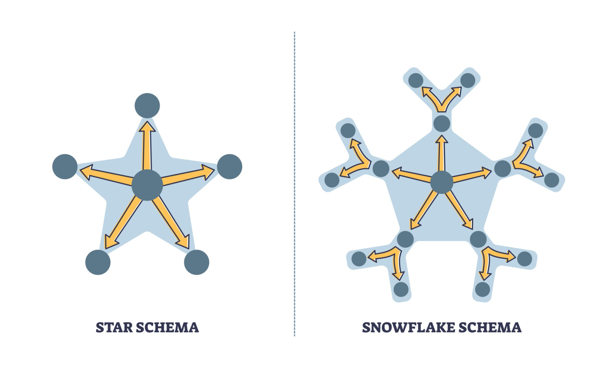

# Ⅰ 基础概念

## 一、 两大建模流派 (Inmon vs Kimball)

在面试中，你首先需要知道业界最主流的两大思想。**吉利这种互联网化程度较高的企业，目前基本采用 Kimball 维度建模。**

| **特性**     | **Inmon (范式建模)**     | **Kimball (维度建模)**         |
| ------------ | ------------------------ | ------------------------------ |
| **核心思想** | 自上而下，强调整体性     | 自下而上，强调灵活性           |
| **数据结构** | 遵循第三范式 (3NF)       | 星型模型 (Star Schema)         |
| **优点**     | 数据冗余低，一致性极高   | 建设快，查询性能好，业务易理解 |
| **缺点**     | 建设周期长，对业务响应慢 | 冗余较高，后期维护成本稍大     |

## 二、 维度建模核心概念

这是面试中最常被问到的“基础名词解释”区。

**1. 事实表 (Fact Table)**

事实表记录的是业务过程的具体事件（比如：一次车辆销售、一次充电记录）。

- **度量值：** 通常是数字（金额、次数、时长）。
- **外键：** 关联到各个维度表的 ID。

**2. 维度表 (Dimension Table)**

维度表记录的是业务环境的上下文（比如：车辆型号、客户信息、经销商地址）。

- **属性：** 主要是文本描述（颜色、品牌、城市）。

**3. 星型模型 vs 雪花模型**

- **星型模型 (Star Schema)：** 事实表周围只有一层维度表。**（大数据场景首选，减少 Join 操作，性能好）**
- **雪花模型 (Snowflake Schema)：** 维度表继续拆分出子维度表。**（节省存储空间，但查询性能差，Hadoop 环境不推荐）**

## 三、 数仓分层架构 (重点)

在吉利这种大厂，数仓通常分为 4-5 层。面试官必问：“你们公司数仓是怎么分层的？”

1. **ODS (Operational Data Store) 原始数据层**
   - **作用：** 几乎不做处理，保持与源系统数据一致。
2. **DWD (Data Warehouse Detail) 明细数据层**
   - **作用：** 数据清洗（去重、空值处理）、维度退化（为了查询性能，把一些维度直接塞进事实表）。
3. **DWS (Data Warehouse Service) 汇总数据层**
   - **作用：** 以分析的主题对象建模，进行轻度汇总（如：某台车每天的里程汇总）。
4. **ADS (Application Data Store) 应用数据层**
   - **作用：** 为最终报表或业务系统提供数据，性能要求最高。

## 四、 维度建模的 4 步设计法 (面试套路)

当面试官问：“你如何设计一个数仓模型？”请按照这个四步法回答：

1. **选择业务过程：** 确定你要建模的行为（如：车联网信号采集、用户订车）。
2. **声明粒度：** 粒度决定了事实表的一行代表什么（如：**每条**传感器上报数据，还是**每小时**汇总数据）。**原则：尽可能选择最细粒度。**
3. **确定维度：** 谁、在哪、什么时间、什么状态（Who, Where, When, What）。
4. **确定事实：** 确定要计算的指标（如：速度、油耗、里程）。