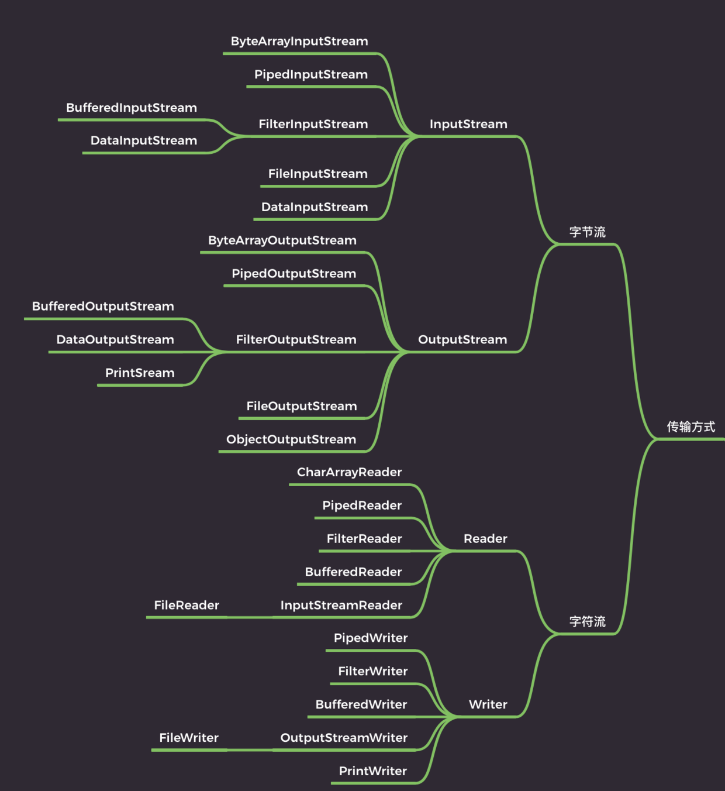
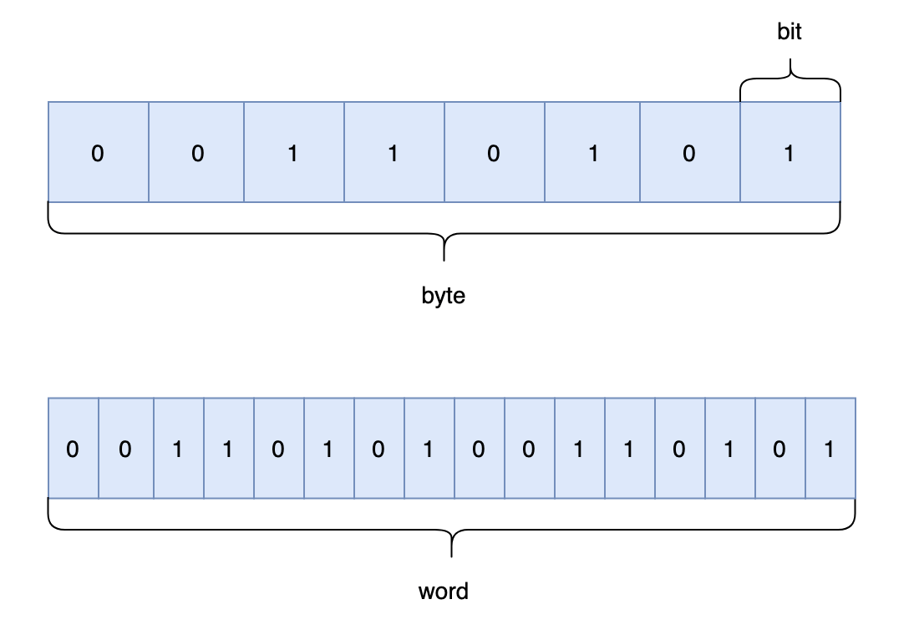
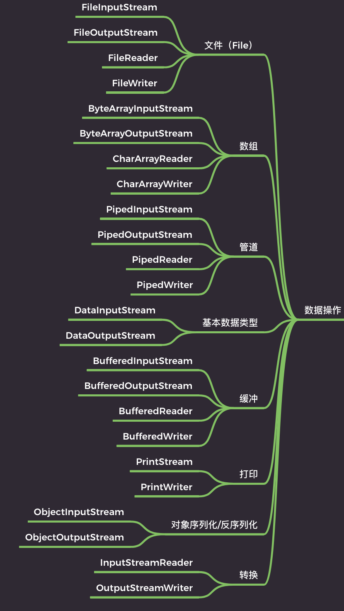
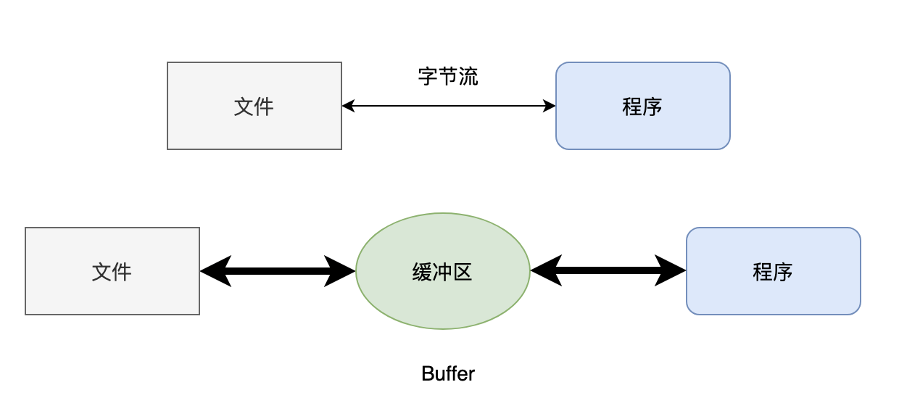
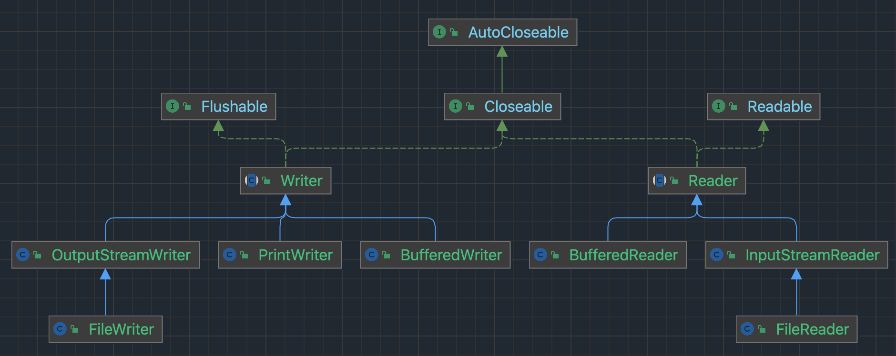
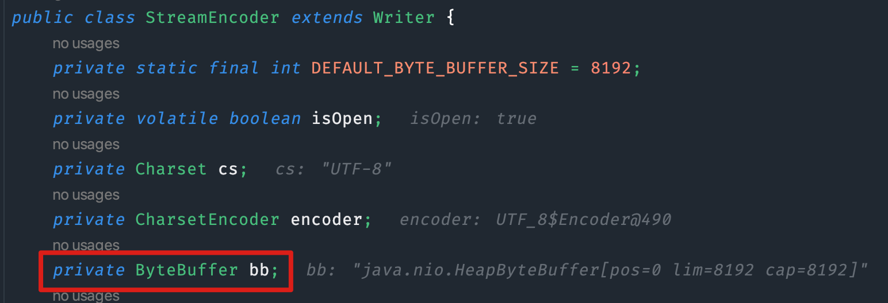
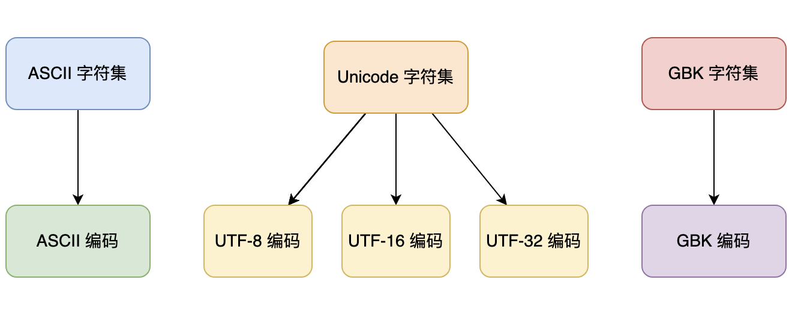

# Ⅰ知识体系

写在前面,按照传输方式对 IO 进行了一个简单的分类



Java 的设计者考虑得比较多，所以 IO 给人一种很乱的感觉，现在来梳理一下。

## 00、初识 Java IO

IO，即in和out，也就是输入和输出，指应用程序和外部设备之间的数据传递，常见的外部设备包括文件、管道、网络连接。

Java 中是通过流处理IO 的，那么什么是流？

流（Stream），是一个抽象的概念，是指一连串的数据（字符或字节），是以先进先出的方式发送信息的通道。

当程序需要读取数据的时候，就会开启一个通向数据源的流，这个数据源可以是文件，内存，或是网络连接。类似的，当程序需要写入数据的时候，就会开启一个通向目的地的流。这时候你就可以想象数据好像在这其中“流”动一样。

一般来说关于流的特性有下面几点：

- 先进先出：最先写入输出流的数据最先被输入流读取到。
- 顺序存取：可以一个接一个地往流中写入一串字节，读出时也将按写入顺序读取一串字节，不能随机访问中间的数据。（`RandomAccessFile`除外）
- 只读或只写：每个流只能是输入流或输出流的一种，不能同时具备两个功能，输入流只能进行读操作，对输出流只能进行写操作。在一个数据传输通道中，如果既要写入数据，又要读取数据，则要分别提供两个流。

### 01、传输方式划分

就按照那副思维导图来说吧。

传输方式有两种，字节和字符，那首先得搞明白字节和字符有什么区别，对吧？

字节（byte）是计算机中用来表示存储容量的一个计量单位，通常情况下，一个字节有 8 位（bit）。

字符（char）可以是计算机中使用的字母、数字、和符号，比如说 $A 1 $ 这些。

通常来说，一个字母或者一个字符占用一个字节，一个汉字占用两个字节。



具体还要看字符编码，比如说在 UTF-8 编码下，一个英文字母（不分大小写）为一个字节，一个中文汉字为三个字节；在 Unicode 编码中，一个英文字母为一个字节，一个中文汉字为两个字节。

明白了字节与字符的区别，再来看字节流和字符流就会轻松多了。

字节流用来处理二进制文件，比如说图片啊、MP3 啊、视频啊。

字符流用来处理文本文件，文本文件可以看作是一种特殊的二进制文件，只不过经过了编码，便于人们阅读。

换句话说就是，字节流可以处理一切文件，而字符流只能处理文本。

看着很多,其实核心就是：

- 抽象类：

  - 字节流：`InputStream`、`OutputStream`
  - 字符流：`Reader`、`Writer`

- 核心方法：

  - 读取数据 → `read()`

  - 写出数据 → `write()`

永远记得一点**IO 类库再复杂，本质就是“读”和“写”两件事”**。


Java IO 中有两种流：

| 类型   | 类                         | 单位         | 作用                                     |
| ------ | -------------------------- | ------------ | ---------------------------------------- |
| 字节流 | InputStream / OutputStream | byte（字节） | 处理所有二进制数据，比如图片、视频、音频 |
| 字符流 | Reader / Writer            | char（字符） | 处理文本数据，比如字符串、文本文件       |

`Stream` → “流” → **字节流**

`Reader/Writer` → “读写文本” → **字符流**


**`InputStream` 类**

- `int read()`：读取数据

  > 你可能好奇，读取一个字节明明只要 8 位，为什么要用 32 位的 `int` 来接收？
  >
  > **原因:**
  >
  > `byte` 的范围是 -128 到 127。如果读到末尾，我们需要一个特殊值来表示 **“没了”**（通常是 -1）。
  >
  > 如果返回 `byte`，-1 可能是数据本身，也可能是结束符，这就搞混了。
  >
  > 所以用 `int`，用 **0~255** 表示正常字节，用 **-1** 表示结束。

- `int read(byte b[], int off, int len)`：从第 off 位置开始读，读取 `len` 长度的字节，然后放入数组 b 中

- `long skip(long n)`：跳过指定个数的字节

- `int available()`：返回可读的字节数

- `void close()`：关闭流，释放资源

**`OutputStream` 类**

- `void write(int b)`： 写入一个字节，虽然参数是一个 `int` 类型，但只有低 8 位才会写入，高 24 位会舍弃（这块后面再讲）

  > 这就像是把一头大象（32位 int）塞进一个小冰箱（8位存储单位）。
  >
  > Java 只取最右边的那一截（低 8 位），剩下的直接扔掉。所以你在传参时，要确保这个 `int` 的值在 0~255 之间，否则数据会“变形”。

- `void write(byte b[], int off, int len)`： 将数组 b 中的从 off 位置开始，长度为 `len` 的字节写入

- `void flush()`： 强制刷新，将缓冲区的数据写入

  > 为了快，数据通常先存在内存的“缓冲区”里。如果不 `flush`，数据可能一直憋在内存里，没真正进硬盘。

- `void close()`：关闭流

  > IO 资源是有限的。如果不关，文件就会被锁死，或者内存慢慢被耗尽。
  >
  > **职业习惯**：现在的 Java 流行使用 `try-with-resources` 语法，让程序自动帮你关。

**`Reader` 类**

- `int read()`：读取单个字符
- `int read(char cbuf[], int off, int len)`：从第 off 位置开始读，读取 `len` 长度的字符，然后放入数组 b 中
- `long skip(long n)`：跳过指定个数的字符
- `int ready()`：是否可以读了
- `void close()`：关闭流，释放资源

**`Writer` 类**

- `void write(int c)`： 写入一个字符
- `void write( char cbuf[], int off, int len)`： 将数组 `cbuf` 中的从 off 位置开始，长度为 `len` 的字符写入
- `void flush()`： 强制刷新，将缓冲区的数据写入
- `void close()`：关闭流

理解了上面这些方法，基本上 IO 的灵魂也就全部掌握了。

字节流和字符流的区别：

- 字节流一般用来处理图像、视频、音频、PPT、Word等类型的文件。字符流一般用于处理纯文本类型的文件，如TXT文件等，但不能处理图像视频等非文本文件。**用一句话说就是：字节流可以处理一切文件，而字符流只能处理纯文本文件。**
- 字节流本身没有缓冲区，缓冲字节流相对于字节流，效率提升非常高。而字符流本身就带有缓冲区，缓冲字符流相对于字符流效率提升就不是那么大了。

以写文件为例，我们查看字符流的源码，发现确实有利用到缓冲区：

```java
// 声明一个 char 类型的数组，用于写入输出流
private char[] writeBuffer;

// 定义 writeBuffer 数组的大小，必须 >= 1
private static final int WRITE_BUFFER_SIZE = 1024;

// 写入给定字符串中的一部分到输出流中
public void write(String str, int off, int len) throws IOException {
    // 使用 synchronized 关键字同步代码块，确保线程安全
    synchronized (lock) {
        char cbuf[];
        // 如果 len <= WRITE_BUFFER_SIZE，则使用 writeBuffer 数组进行写入
        if (len <= WRITE_BUFFER_SIZE) {
            // 如果 writeBuffer 为 null，则创建一个大小为 WRITE_BUFFER_SIZE 的新 char 数组
            if (writeBuffer == null) {
                writeBuffer = new char[WRITE_BUFFER_SIZE];
            }
            cbuf = writeBuffer;
        } else {    // 如果 len > WRITE_BUFFER_SIZE，则不永久分配非常大的缓冲区
            // 创建一个大小为 len 的新 char 数组
            cbuf = new char[len];
        }
        // 将 str 中的一部分（从 off 开始，长度为 len）拷贝到 cbuf 数组中
        // 这一行是关键！它不是用 for 循环一个个复制，
        // 而是调用底层系统级的拷贝（类似 System.arraycopy），速度极快。
        str.getChars(off, (off + len), cbuf, 0);
        // 将 cbuf 数组中的数据写入输出流中
        write(cbuf, 0, len);
    }
}
```

> 这段代码的核心逻辑在于：**如何处理你要写入的那串字符？**
>
> #### 情况 A：小批量货物（$\le 1024$ 字符）
>
> 如果这次要写的字符串很短（不超过 1024 个字符），程序会选择 **“复用旧纸箱”**。
>
> - 它会检查 `writeBuffer`（那个成员变量）。如果还没买（为 null），就买一个固定的 1024 大小的箱子。
> - **好处**：你写一万次短字符串，它都只占用那一个 1024 的空间。这极大地减轻了 **GC（垃圾回收）** 的压力，不用频繁地扔旧箱子、造新箱子。
>
> #### 情况 B：大批量货物（$> 1024$ 字符）
>
> 如果要写的字符串太长了，程序会选择 **“定制临时大箱子”**。
>
> - 它直接 `new char[len]`。
> - **原因**：如果为了偶尔一次的大数据去永久分配一个巨型 `writeBuffer`，那这个大箱子会一直霸占内存不释放（常驻内存），非常浪费。所以对于大件，咱们“用完即焚”。

这段代码是 Java IO 类库中的 `OutputStreamWriter` 类的 write 方法，可以看到缓冲区的大小是 1024 个 char。1024 字符（2KB 内存）是一个经过大量实践得出的“甜点位”。

我们再以文件的字符流和字节流来做一下对比，代码差别很小。

```java
// 字节流
try (FileInputStream fis = new FileInputStream("input.txt");
     FileOutputStream fos = new FileOutputStream("output.txt")) {
    byte[] buffer = new byte[1024];
    int len;
    while ((len = fis.read(buffer)) != -1) {
        fos.write(buffer, 0, len);
    }
} catch (IOException e) {
    e.printStackTrace();
}

// 字符流
try (FileReader fr = new FileReader("input.txt");
     FileWriter fw = new FileWriter("output.txt")) {
    char[] buffer = new char[1024];
    int len;
    while ((len = fr.read(buffer)) != -1) {
        fw.write(buffer, 0, len);
    }
} catch (IOException e) {
    e.printStackTrace();
}
```

核心结构：`try-with-resources`

你会发现这两段代码的 `try` 后面都跟着一对圆括号 `()`。这是 Java 7 引入的“自动关窗”语法。

- **以前**：你必须在 `finally` 块里手动写 `fis.close()`，还要防备 `close` 时又抛异常。
- **现在**：只要括号里的类实现了 `AutoCloseable` 接口，不管代码是正常结束还是中途崩溃，Java 都会**百分之百保证**帮你把流关掉。这解决了“资源泄漏”的头号难题。

这两段代码对比

| **特性**     | **第一段：字节流 (FileInputStream)**             | **第二段：字符流 (FileReader)**                              |
| ------------ | ------------------------------------------------ | ------------------------------------------------------------ |
| **搬运单位** | **`byte` (8位)**                                 | **`char` (16位)**                                            |
| **操作对象** | **一切文件**（图片、视频、exe）                  | **仅限纯文本**（txt, html, json）                            |
| **编码处理** | 原始搬运，不转码。                               | 会根据系统或指定的编码（如 UTF-8）进行**解码**。             |
| **风险**     | 搬运文本时如果遇到多字节字符，可能会在中间断开。 | 搬运非文本（如图片）时，会尝试按字符解码，导致**文件损坏**。 |


#### 实战演示

在`src/assets/`路径下创建test.txt文件,内容为:你好，Java IO!

以及随便的一个jpg图片picture.jpg

创建`src/assets/output`文件夹

##### 1)字节流

```java
public class TextCharLab {
    public static void main(String[] args) {
        try(
                //FileReader：打开通往 test.txt 的“读信通道”。
                FileReader fr = new FileReader("src/assets/test.txt");
                //FileWriter：打开通往 copy_test.txt 的“写信通道”。如果这个文件不存在，它会自动帮你创建一个。
        FileWriter fw = new FileWriter("src/assets/output/copy_test.txt")){
        int data;

        while((data = fr.read())!=-1){
            System.out.print((char)data);
            fw.write(data);
        }
            System.out.println("\n文本复制成功！检查 copy_test.txt，中文依然完美。");
        }catch (IOException e){
            e.printStackTrace();
        }

    }
}
```

> 这里为-1的原因是 我们的字符流读的是 Unicode 编码,Unicode 字符集里，所有的字符（无论是中文、英文还是符号）对应的数字都是**非负数**（0 到 65535）。同时`read()` 方法在返回这个字节时，做了一个**无符号转换**：假如真的原始数据是-1,那么原始数据就是：`11111111` (byte 类型的 -1),**read() 处理后**：它把这个 8 位的数据变成了 32 位的 int，但高位全部补 0，变成了 `0000...0000 11111111`。**最终结果**：这个 `int` 的值是 **255**。
>
> 而-1是我们约定好的退出,-2可不可以?**不行!**

在普通代码里，`try` 后面直接跟大括号 `{}`。但在 IO 操作中，你看到的这种 `try (声明资源)` 叫做 **“带资源的 try 语句” (Try-with-resources)**。

IO 流（文件、网络、数据库连接）是非常占用系统资源的。用完必须关掉。

- **老办法**：你得在 `finally` 块里手动写 `fr.close()`。如果忘了写，文件就会被一直锁死，程序跑久了内存就爆了。
- **这种写法（新办法）**：圆括号里声明的 `fr` 和 `fw` 就像进了“自动关窗模式”。**只要代码离开了 `try` 的范围（无论是正常跑完，还是中途报错炸了），Java 都会保证百分之百帮你调用 `close()` 方法。**

你可以理解为一个保险丝业务,而且很适合字符流


**`fr.read()`**：每次从文件读**一个字符**。

**为什么返回 `int`？**：因为当读到文件末尾时，它需要返回 `-1` 来告诉你“没货了”。

**`(char)data`**：这是强转。如果不转，`System.out` 打印出来的就是字符对应的数字编号（ASCII/Unicode 码）。

**`fw.write(data)`**：读到一个，立刻往新文件写一个。

**`IOException`**：IO 操作是“高危动作”。如果文件被删了、硬盘满了、或者你没有读取权限，程序都会抛出这个异常。

**`e.printStackTrace()`**：打印出错误在代码的哪一行，方便你修 Bug。

这段代码采用的是 **“单挑模式”**：读一个字，写一个字。

- **优点**：代码极其直观，适合新手理解原理。
- **缺点**：**慢**。如果你复制一个 10MB 的文本，这种写法就像用勺子去掏空一个游泳池，效率很低，因为每读写一次都要跟硬盘打交道。


所以接下来我们可以改进一下,通常我们会用 **数组缓冲区**

```java
char[] buffer = new char[1024]; // 准备一个能装 1024 个字符的“大铲子”
int len;
while ((len = fr.read(buffer)) != -1) {
    fw.write(buffer, 0, len); // 一次写一铲子
}
```

关于改进也有两个版本分别是自动挡的`BufferedReader,BufferedWriter`以及手动挡的“字符数组”作为缓冲区

**自动挡:**

```java
package JavaBase.IoExample.assets;

import java.io.*;

public class BufferedTextLab {
    public static void main(String[] args) {
        // 【套娃模式】：用 BufferedReader 包裹 FileReader
        try (BufferedReader br = new BufferedReader(new FileReader("src/assets/test.txt"));
             BufferedWriter bw = new BufferedWriter(new FileWriter("src/assets/output/test_buffer.txt"))) {
            
            String line; // 这次我们按“行”收割
            
            // readLine() 是 BufferedReader 的神技，一次读一整行，没货了返回 null
            while ((line = br.readLine()) != null) {
                bw.write(line);      // 写入这一行
                bw.newLine();        // 【关键】写入一个换行符，因为 readLine() 不会带换行符
            }
            
            System.out.println("使用 BufferedReader 复制成功！速度提升了 N 倍。");
            
        } catch (IOException e) {
            e.printStackTrace();
        }
    }
}
```

手动挡:

```java
public class TextCharBufferLab {
    public static void main(String[] args) {
        try (FileReader fr = new FileReader("src/assets/test.txt");
             FileWriter fw = new FileWriter("src/assets/output/test_buffer.txt")) {

            char[] buffer = new char[1024];
            int len;
            while ((len = fr.read(buffer))!=-1){
                fw.write(buffer,0,len);
            }
            System.out.println("使用 BufferedReader 复制成功！速度提升了 N 倍。");
        } catch (IOException e) {
            e.printStackTrace();
        }
    }
}
```

##### 2)字符流

```
public class ImageByteLab {
    public static void main(String[] args) {
        try(FileInputStream fi = new FileInputStream("src/assets/picture.jpg");
            FileOutputStream fo = new FileOutputStream("src/assets/output/copy_picture.jpg")
        ){
            byte[] buffer = new byte[1024];
            int len;

            while((len = fi.read(buffer))!=-1){
                fo.write(buffer,0,len);
            }

            System.out.println("图片拷贝成功！请检查项目根目录下的 copy_cat.jpg");

        }catch (Exception e){
            e.printStackTrace();
        }
    }
}

```

你可能会觉得：这不就是把 `char` 改成 `byte` 吗？

没错！因为在操作系统的眼里，**万物皆字节**。

- **文本文件**：是字节。
- **图片文件**：是字节。
- **你的表情包、视频、甚至是 `.class` 编译文件**：通通都是字节。

**字节流（`InputStream`/`OutputStream`）** 是 IO 界的“老祖宗”。它是直接对着文件的二进制 0 和 1 进行操作的，不经过任何大脑加工（不处理编码），所以它能保证图片在搬运过程中一个比特位都不会错。


##### 3)字节流和字符流对比

| **维度**     | **字节流 Buffer (byte[])**                 | **字符流 Buffer (char[])**                     |
| ------------ | ------------------------------------------ | ---------------------------------------------- |
| **包装类**   | `BufferedInputStream`                      | `BufferedReader`                               |
| **主要用途** | 复制图片、视频、PDF、压缩包                | 读取配置文件、处理文本、按行读写               |
| **优势**     | **绝对不会损坏文件**，速度最快             | 提供 `readLine()` 等便捷方法，处理中文不乱码   |
| **风险**     | 读取文本时，如果在中文字节中间切断，会乱码 | **千万不能用来读图片**，会把二进制数据“翻译”坏 |

| **场景**                   | **使用 byte (字节流)**       | **使用 char (字符流)**             |
| -------------------------- | ---------------------------- | ---------------------------------- |
| **复制一个 MP4 视频**      | **✅ 必须用**（保证文件不坏） | ❌ 绝对不行（视频会变碎纸片）       |
| **读取一个 .txt 配置文件** | ⚠️ 可以，但处理中文很痛苦     | **✅ 首选**（自动帮你处理乱码）     |
| **发送一个 JSON 字符串**   | ⚠️ 需要手动转 byte 数组       | **✅ 首选**（配合 `Writer` 很方便） |
| **上传一张用户头像**       | **✅ 必须用**                 | ❌ 绝对不行                         |

### 02、操作对象划分

仔细想一下,IO IO，不就是输入输出（Input/Output）嘛：

- Input：将外部的数据读入内存，比如说把文件从硬盘读取到内存，从网络读取数据到内存等等
- Output：将内存中的数据写入到外部，比如说把数据从内存写入到文件，把数据从内存输出到网络等等。

所有的程序，在执行的时候，都是在内存上进行的，一旦关机，内存中的数据就没了，那如果想要持久化，就需要把内存中的数据输出到外部，比如说文件。

文件操作算是 IO 中最典型的操作了，也是最频繁的操作。那其实你可以换个角度来思考，比如说按照 IO 的操作对象来思考，IO 就可以分类为：文件、数组、管道、基本数据类型、缓冲、打印、对象序列化/反序列化，以及转换等。



#### **1）文件**

文件流也就是直接操作文件的流，可以细分为字节流（`FileInputStream` 和 `FileOuputStream`）和字符流（`FileReader` 和 `FileWriter`）。

`FileInputStream` 的例子：

```java
// 声明一个 int 类型的变量 b，用于存储读取到的字节
int b;
// 创建一个 FileInputStream 对象，用于读取文件 fis.txt 中的数据
FileInputStream fis1 = new FileInputStream("fis.txt");

// 循环读取文件中的数据
while ((b = fis1.read()) != -1) {
    // 将读取到的字节转换为对应的 ASCII 字符，并输出到控制台
    System.out.println((char)b);
}

// 关闭 FileInputStream 对象，释放资源
fis1.close();
```

`FileOutputStream` 的例子：

```java
// 创建一个 FileOutputStream 对象，用于写入数据到文件 fos.txt 中
FileOutputStream fos = new FileOutputStream("fos.txt");

// 向文件中写入数据，这里写入的是字符串 "沉默王二" 对应的字节数组
fos.write("沉默王二".getBytes());

// 关闭 FileOutputStream 对象，释放资源
fos.close();
```

`FileReader` 的例子：

```java
// 声明一个 int 类型的变量 b，用于存储读取到的字符
int b = 0;

// 创建一个 FileReader 对象，用于读取文件 read.txt 中的数据
FileReader fileReader = new FileReader("read.txt");

// 循环读取文件中的数据
while ((b = fileReader.read()) != -1) {
    // 将读取到的字符强制转换为 char 类型，并输出到控制台
    System.out.println((char)b);
}

// 关闭 FileReader 对象，释放资源
fileReader.close();
```

`FileWriter` 的例子：

```java
// 创建一个 FileWriter 对象，用于写入数据到文件 fw.txt 中
FileWriter fileWriter = new FileWriter("fw.txt");

// 将字符串 "沉默王二" 转换为字符数组
char[] chars = "沉默王二".toCharArray();

// 向文件中写入数据，这里写入的是 chars 数组中的所有字符
fileWriter.write(chars, 0, chars.length);

// 关闭 FileWriter 对象，释放资源
fileWriter.close();
```

文件流还可以用于创建、删除、重命名文件等操作。`FileOutputStream` 和 `FileWriter` 构造函数的第二个参数可以指定是否追加数据到文件末尾。

示例代码：

```java
// 创建文件
File file = new File("test.txt");
if (file.createNewFile()) {
    System.out.println("文件创建成功");
} else {
    System.out.println("文件已存在");
}

// 删除文件
if (file.delete()) {
    System.out.println("文件删除成功");
} else {
    System.out.println("文件删除失败");
}

// 重命名文件
File oldFile = new File("old.txt");
File newFile = new File("new.txt");
if (oldFile.renameTo(newFile)) {
    System.out.println("文件重命名成功");
} else {
    System.out.println("文件重命名失败");
}
```

当掌握了文件的输入输出，其他的自然也就掌握了，都大差不差。


#### 2）数组（内存）

通常来说，针对文件的读写操作，使用文件流配合缓冲流就够用了，但为了提升效率，频繁地读写文件并不是太好，那么就出现了数组流，有时候也称为内存流。

为什么"文件流+缓冲流"还不够好?

之前写的 `FileInputStream` + `BufferedInputStream` 已经很牛了，它通过一个小推车（Buffer）减少了去硬盘（Disk）的次数。

但问题在于：**只要目标是硬盘，就一定慢。**

- **物理瓶颈**：硬盘（无论是 HDD 还是 SSD）的速度比内存（RAM）慢成百上千倍。
- **系统损耗**：读写文件需要通过操作系统内核，频繁地开关文件、寻址、写入，即便有缓冲，依然会有开销。


不过**数组流**（`ByteArrayInputStream` / `ByteArrayOutputStream`）玩了个“偷梁换柱”：它让你的程序以为在读写文件，**但实际上数据全程都在内存（内存里的字节数组）里打转。**

- **它的本质**：把一块内存（`byte[]`）伪装成一个“流”。
- **它的逻辑**：
  - `ByteArrayInputStream`：把一个已有的字节数组，当成数据源，像读文件一样读它。
  - `ByteArrayOutputStream`：把数据写进一个可以自动增长的内存数组里，写完后你可以直接拿走这个数组。


wow听起来太棒了,那么既然内存流快得起飞，为什么还要费劲写文件流？ 因为内存有两个致命弱点：

1. **容量小**：你不能把 100GB 的 4K 电影塞进 16GB 的内存流里。
2. **易失性**：**断电即失！** 如果你只写到数组流里而没存盘，电脑一关，数据就人间蒸发了。


- **文件流** 是为了 **“长久保存”**。

- **缓冲流** 是为了 **“减少磨损”**（保护硬盘，加速读写）。

- **数组流** 是为了 **“临时中转”**（在内存里快速加工数据，完全不碰硬盘）。


好了 我们看回`ByteArrayInputStream` 的例子：

```java
// 创建一个 ByteArrayInputStream 对象，用于从字节数组中读取数据
InputStream is = new BufferedInputStream(
        new ByteArrayInputStream(
                "沉默王二".getBytes(StandardCharsets.UTF_8)));

// 定义一个字节数组用于存储读取到的数据
byte[] flush = new byte[1024];

// 定义一个变量用于存储每次读取到的字节数
int len = 0;

// 循环读取字节数组中的数据，并输出到控制台
while (-1 != (len = is.read(flush))) {
    // 将读取到的字节转换为对应的字符串，并输出到控制台
    System.out.println(new String(flush, 0, len));
}

// 关闭输入流，释放资源
is.close();
```

> 这里有的读者可能会疑惑(・∀・(・∀・(・∀・?) 为什么不是flush.read(is),感觉更符合直觉啊?
>
> 这里就要提出:在 Java（以及绝大多数面向对象语言）的设计哲学里，**“谁有能力，谁当主语”**。

数组流可以用于在内存中读写数据，比如将数据存储在字节数组中进行压缩、加密、序列化等操作。它的优点是不需要创建临时文件(其他流也不需要,这也是流被设计的意义)，可以提高程序的效率。但是，数组流也有缺点，它只能存储有限的数据量，如果存储的数据量过大，会导致内存溢出。


#### 3）管道

Java 中的管道和 Unix/Linux 中的管道不同，在 Unix/Linux 中，不同的进程之间可以通过管道来通信，但 Java 中，通信的双方必须在同一个进程中，也就是在同一个 JVM 中，管道为线程之间的通信提供了通信能力。

也就是说 **Unix 管道**更类似于两条高速公路之间的**互通立交桥**（连接两个独立的系统）

 **Java 管道**更像是同一个大厦里两个房间之间的**传声筒**（连接同一个进程里的两个线程）。


| **特性**     | **Unix/Linux 管道**                         | **Java 管道 (PipedStream)**  |
| ------------ | ------------------------------------------- | ---------------------------- |
| **作用范围** | **跨进程**（比如把 `ls` 的结果传给 `grep`） | **同进程/跨线程**            |
| **内存空间** | 由操作系统内核管理                          | 由 JVM 堆内存管理            |
| **生命周期** | 随进程存在或作为独立管道文件                | 随 JVM 对象存在              |
| **实现机制** | 系统级调用，利用内核缓冲区                  | 利用 `byte[]` 循环数组缓冲区 |

然后一个重要的概念就是:**绝对不能在同一个线程里同时操作管道的读和写。**

- **原因**：管道内部有一个固定的缓冲区（默认 1024 字节）。
- **场景**：如果你在线程 A 里写数据，写满了 1024 字节，管道会**阻塞**（停下来等别人读）。
- **死锁**：如果这时候还是线程 A 准备去读，因为他已经被“写”动作阻塞住了，根本没机会执行后面的“读”代码。
- **结果**：整个程序就像是**把自己锁在门外的人**，彻底卡死。

> **职业规则**：使用管道时，必须一个线程专门负责写，另一个线程专门负责读。

当然我们现代Java 开发中，管道流（PipedStream）的出场率其实**并不高**。因为有了更好的,更高效的“线程通信”方式：

1. **BlockingQueue（阻塞队列）**：如果你只是想传输对象或数据块，用 `ArrayBlockingQueue` 会简单得多，而且性能更好。
2. **消息中间件**：跨进程的通信。
3. **响应式流 (Reactive Streams)**：处理高并发下的流式数据。


话说回来,我们还是要对于基础的部分进行了解,一个线程通过 `PipedOutputStream` 写入的数据可以被另外一个线程通过相关联的 `PipedInputStream` 读取出来。

```java
// 创建一个 PipedOutputStream 对象和一个 PipedInputStream 对象
final PipedOutputStream pipedOutputStream = new PipedOutputStream();
final PipedInputStream pipedInputStream = new PipedInputStream(pipedOutputStream);

// 创建一个线程，向 PipedOutputStream 中写入数据
Thread thread1 = new Thread(new Runnable() {
    @Override
    public void run() {
        try {
            // 将字符串 "沉默王二" 转换为字节数组，并写入到 PipedOutputStream 中
            pipedOutputStream.write("沉默王二".getBytes(StandardCharsets.UTF_8));
            // 关闭 PipedOutputStream，释放资源
            pipedOutputStream.close();
        } catch (IOException e) {
            e.printStackTrace();
        }
    }
});

// 创建一个线程，从 PipedInputStream 中读取数据并输出到控制台
Thread thread2 = new Thread(new Runnable() {
    @Override
    public void run() {
        try {
            // 定义一个字节数组用于存储读取到的数据
            byte[] flush = new byte[1024];
            // 定义一个变量用于存储每次读取到的字节数
            int len = 0;
            // 循环读取字节数组中的数据，并输出到控制台
            while (-1 != (len = pipedInputStream.read(flush))) {
                // 将读取到的字节转换为对应的字符串，并输出到控制台
                System.out.println(new String(flush, 0, len));
            }
            // 关闭 PipedInputStream，释放资源
            pipedInputStream.close();
        } catch (IOException e) {
            e.printStackTrace();
        }
    }
});

// 启动线程1和线程2
thread1.start();
thread2.start();
```

使用管道流可以实现不同线程之间的数据传输，可以用于线程间的通信、数据的传递等。但是，管道流也有一些局限性，比如只能在同一个 JVM 中的线程之间使用，不能跨越不同的 JVM 进程。

#### 4）基本数据类型

基本数据类型输入输出流是一个字节流，该流不仅可以读写字节和字符，还可以读写基本数据类型。

`DataInputStream` 提供了一系列可以读基本数据类型的方法：

```java
// 创建一个 DataInputStream 对象，用于从文件中读取数据
DataInputStream dis = new DataInputStream(new FileInputStream("das.txt"));

// 读取一个字节，将其转换为 byte 类型
byte b = dis.readByte();

// 读取两个字节，将其转换为 short 类型
short s = dis.readShort();

// 读取四个字节，将其转换为 int 类型
int i = dis.readInt();

// 读取八个字节，将其转换为 long 类型
long l = dis.readLong();

// 读取四个字节，将其转换为 float 类型
float f = dis.readFloat();

// 读取八个字节，将其转换为 double 类型
double d = dis.readDouble();

// 读取一个字节，将其转换为 boolean 类型
boolean bb = dis.readBoolean();

// 读取两个字节，将其转换为 char 类型
char ch = dis.readChar();

// 关闭 DataInputStream，释放资源
dis.close();
```

`DataOutputStream` 提供了一系列可以写基本数据类型的方法：

```java
// 创建一个 DataOutputStream 对象，用于将数据写入到文件中
DataOutputStream das = new DataOutputStream(new FileOutputStream("das.txt"));

// 将一个 byte 类型的数据写入到文件中
das.writeByte(10);

// 将一个 short 类型的数据写入到文件中
das.writeShort(100);

// 将一个 int 类型的数据写入到文件中
das.writeInt(1000);

// 将一个 long 类型的数据写入到文件中
das.writeLong(10000L);

// 将一个 float 类型的数据写入到文件中
das.writeFloat(12.34F);

// 将一个 double 类型的数据写入到文件中
das.writeDouble(12.56);

// 将一个 boolean 类型的数据写入到文件中
das.writeBoolean(true);

// 将一个 char 类型的数据写入到文件中
das.writeChar('A');

// 关闭 DataOutputStream，释放资源
das.close();
```

除了 DataInputStream 和 DataOutputStream，Java IO 还提供了其他一些读写基本数据类型和字符串的流类，包括 ObjectInputStream 和 ObjectOutputStream（用于读写对象）。

示例代码：

```java
public static void main(String[] args) {
    try (ObjectOutputStream oos = new ObjectOutputStream(new FileOutputStream("person.dat"))) {
        Person p = new Person("张三", 20);
        oos.writeObject(p);
    } catch (IOException e) {
        e.printStackTrace();
    }

    try (ObjectInputStream ois = new ObjectInputStream(new FileInputStream("person.dat"))) {
        Person p = (Person) ois.readObject();
        System.out.println(p);
    } catch (IOException | ClassNotFoundException e) {
        e.printStackTrace();
    }
}
```

以上代码创建了一个 Person 对象，将其写入文件中，然后从文件中读取该对象，并打印在控制台上。

除了 `DataInputStream` 和 `DataOutputStream`，Java IO 还提供了其他一些读写基本数据类型和字符串的流类，包括 `ObjectInputStream` 和 `ObjectOutputStream`（用于读写对象）。


#### 5) 对象读写/序列化

**对象读写（Object I/O）**能把一个内存里活生生的、复杂的 **对象（Object）**，直接“脱水”成字节流存起来，或者在需要的时候“复活”回来。这在专业术语里叫 **序列化（Serialization）** 和 **反序列化（Deserialization）**。

序列化本质上是将一个 Java 对象转成字节数组，然后可以将其保存到文件中，或者通过网络传输到远程。

- **序列化 (Serialization)**：把内存中的对象变成一串字节序列。就像把一头大象变成一箱罐头，方便运输和储存。

- **反序列化 (Deserialization)**：把字节序列恢复为内存中的对象。就像把罐头还原成一头活生生的大象。


并不是所有的对象都能被序列化。Java 规定：**如果你想让一个类支持序列化，它必须实现 `java.io.Serializable` 接口。**

> **注意**：这个接口里**没有任何方法**。它只是一个“标记接口”，告诉 JVM：“这个类已经通过了安全审查，允许被打包带走。”

对象流也是装饰器流，必须套在字节流外面使用：

1. **`ObjectOutputStream`**：负责写对象。核心方法：**`writeObject(Object obj)`**。
2. **`ObjectInputStream`**：负责读对象。核心方法：**`readObject()`**。


**实战演示：如何“瞬间移动”一个用户**

**第一步：准备实体类**

```java
import java.io.Serializable;

// 必须实现 Serializable 接口
public class User implements Serializable {
    // 建议手动指定版本号，防止类修改后无法读取
    private static final long serialVersionUID = 1L; 
    
    private String name;
    private int age;
    // transient 关键字：这个属性不会被序列化（比如密码等敏感信息）
    private transient String password; 

    public User(String name, int age, String password) {
        this.name = name;
        this.age = age;
        this.password = password;
    }

    @Override
    public String toString() {
        return "User{name='" + name + "', age=" + age + ", password='" + password + "'}";
    }
}
```

**第二步：序列化（保存对象）**

```java
try (ObjectOutputStream oos = new ObjectOutputStream(new FileOutputStream("user.obj"))) {
    User user = new User("沉默王二", 18, "123456");
    oos.writeObject(user); // 直接把整个对象丢进去
    System.out.println("对象已保存到硬盘！");
} catch (IOException e) {
    e.printStackTrace();
}
```

**第三步：反序列化（读取对象）**

```java
try (ObjectInputStream ois = new ObjectInputStream(new FileInputStream("user.obj"))) {
    // readObject 返回的是 Object 类型，需要强转成 User
    User user = (User) ois.readObject(); 
    System.out.println("读取到的对象：" + user);
    // 注意：password 是 transient 标记的，读取出来会是 null
} catch (IOException | ClassNotFoundException e) {
    e.printStackTrace();
}
```

------

5. 必须掌握的三个关键细节

**A. `transient` 关键字（隐身术）**

如果你不想让对象的某个字段被保存（比如：敏感的银行卡号、临时的缓存数据），就在前面加 `transient`。序列化时会直接跳过它。

**B. `serialVersionUID`（版本识别码）**

这相当于文件的“数字指纹”。

- 如果你不写，Java 会根据你的类结构自动算一个。
- **坑点**：如果你改了类的一个字段，自动算的号就变了。当你尝试读取旧文件时，Java 会报 `InvalidClassException`，认为这不是同一个类。
- **职业写法**：手动写死一个 `private static final long serialVersionUID = 1L;`。

**C. 对象的引用树**

如果 `User` 类里包含一个 `Address` 类的对象，那么 `Address` 也必须实现 `Serializable` 接口。否则，在序列化 `User` 时会报错，因为“零件”没法打包。


**对象流 vs JSON (为什么现在流行 JSON？)**

虽然对象流很牛，但在现在的 Web 开发中，大家更爱用 JSON（如 Jackson, GSON）：

| **特性**       | **对象流 (Object Stream)**                   | **JSON 文本**              |
| -------------- | -------------------------------------------- | -------------------------- |
| **平台通用性** | **差**（仅限 Java 语言）                     | **极好**（所有语言通用）   |
| **可读性**     | **无**（二进制乱码）                         | **好**（人类直接可读）     |
| **安全性**     | **有风险**（容易被黑客利用进行反序列化攻击） | **相对安全**               |
| **主要用途**   | Java 内部远程调用 (RMI)、进程间通信          | 网页 API、移动端通讯、配置 |


#### 6) 缓冲

CPU 很快，它比内存快 100 倍，比磁盘快百万倍。那也就意味着，程序和内存交互会很快，和硬盘交互相对就很慢，这样就会导致性能问题。

为了减少程序和硬盘的交互，提升程序的效率，就引入了缓冲流，也就是类名前缀带有 Buffer 的那些，比如说 `BufferedInputStream`、`BufferedOutputStream`、`BufferedReader`、`BufferedWriter`。

你可以理解为,这里有一堆砖,要运送到目的地,原始的版本(文件到程序)依赖字节流,那么就是一砖一砖的搬运,大量时间消耗在了单个砖块的搬运来回时间里了,但是缓冲则是,等一下,让砖尽可能装的多,然后一次性运过去.

缓冲的操作逻辑可以概括为：**“攒够了再说”**。



缓冲流在内存中设置了一个缓冲区，只有缓冲区存储了足够多的带操作的数据后，才会和内存或者硬盘进行交互。简单来说，就是一次多读/写点，少读/写几次，这样程序的性能就会提高。

以下是一个使用 `BufferedInputStream` 读取文件的示例代码：

```java
// 创建一个 BufferedInputStream 对象，用于从文件中读取数据
BufferedInputStream bis = new BufferedInputStream(new FileInputStream("data.txt"));

// 创建一个字节数组，作为缓存区
byte[] buffer = new byte[1024];

// 读取文件中的数据，并将其存储到缓存区中
int bytesRead;
while ((bytesRead = bis.read(buffer)) != -1) {
    // 对缓存区中的数据进行处理
    // 这里只是简单地将读取到的字节数组转换为字符串并打印出来
    System.out.println(new String(buffer, 0, bytesRead));
}

// 关闭 BufferedInputStream，释放资源
bis.close();
```

上述代码中，首先创建了一个 `BufferedInputStream` 对象，用于从文件中读取数据。然后创建了一个字节数组作为缓存区，每次读取数据时将数据存储到缓存区中。读取数据的过程是通过 while 循环实现的，每次读取数据后对缓存区中的数据进行处理。最后关闭 `BufferedInputStream`，释放资源。

以下是一个使用 `BufferedOutputStream` 写入文件的示例代码：

```java
// 创建一个 BufferedOutputStream 对象，用于将数据写入到文件中
BufferedOutputStream bos = new BufferedOutputStream(new FileOutputStream("data.txt"));

// 创建一个字节数组，作为缓存区
byte[] buffer = new byte[1024];

// 将数据写入到文件中
String data = "沉默王二是个大傻子!";
buffer = data.getBytes();
bos.write(buffer);

// 刷新缓存区，将缓存区中的数据写入到文件中
bos.flush();

// 关闭 BufferedOutputStream，释放资源
bos.close();
```

上述代码中，首先创建了一个 `BufferedOutputStream` 对象，用于将数据写入到文件中。然后创建了一个字节数组作为缓存区，将数据写入到缓存区中。写入数据的过程是通过 write() 方法实现的，将字节数组作为参数传递给 write() 方法即可。

最后，通过 flush() 方法将缓存区中的数据写入到文件中。在写入数据时，由于使用了 `BufferedOutputStream`，数据会先被写入到缓存区中，只有在缓存区被填满或者调用了 flush() 方法时才会将缓存区中的数据写入到文件中。

以下是一个使用 `BufferedReader` 读取文件的示例代码：

```java
// 创建一个 BufferedReader 对象，用于从文件中读取数据
BufferedReader br = new BufferedReader(new FileReader("data.txt"));

// 读取文件中的数据，并将其存储到字符串中
String line;
while ((line = br.readLine()) != null) {
    // 对读取到的数据进行处理
    // 这里只是简单地将读取到的每一行字符串打印出来
    System.out.println(line);
}

// 关闭 BufferedReader，释放资源
br.close();
```

上述代码中，首先创建了一个 `BufferedReader` 对象，用于从文件中读取数据。然后使用 `readLine()` 方法读取文件中的数据，每次读取一行数据并将其存储到一个字符串中。读取数据的过程是通过 while 循环实现的。

以下是一个使用 `BufferedWriter` 写入文件的示例代码：

```java
// 创建一个 BufferedWriter 对象，用于将数据写入到文件中
BufferedWriter bw = new BufferedWriter(new FileWriter("data.txt"));

// 将数据写入到文件中
String data = "沉默王二，真帅气";
bw.write(data);

// 刷新缓存区，将缓存区中的数据写入到文件中
bw.flush();

// 关闭 BufferedWriter，释放资源
bw.close();
```

上述代码中，首先创建了一个 `BufferedWriter` 对象，用于将数据写入到文件中。然后使用 write() 方法将数据写入到缓存区中，写入数据的过程和使用 `FileWriter` 类似。需要注意的是，使用 `BufferedWriter` 写入数据时，数据会先被写入到缓存区中，只有在缓存区被填满或者调用了 flush() 方法时才会将缓存区中的数据写入到文件中。

最后，通过 flush() 方法将缓存区中的数据写入到文件中，并通过 close() 方法关闭 BufferedWriter，释放资源。

使用缓冲流可以提高读写效率，减少了频繁的读写磁盘或网络的次数，从而提高了程序的性能。但是，在使用缓冲流时需要注意缓冲区的大小和清空缓冲区的时机，以避免数据丢失或不完整的问题。


**工具箱**

| **类别**     | **基础流（没缓冲）** | **缓冲增强流（有缓冲）**   | **默认缓冲区大小** |
| ------------ | -------------------- | -------------------------- | ------------------ |
| **字节流**   | `FileInputStream`    | **`BufferedInputStream`**  | 8192 Bytes (8KB)   |
| **字节输出** | `FileOutputStream`   | **`BufferedOutputStream`** | 8192 Bytes (8KB)   |
| **字符流**   | `FileReader`         | **`BufferedReader`**       | 8192 Chars         |
| **字符输出** | `FileWriter`         | **`BufferedWriter`**       | 8192 Chars         |


虽然缓冲很好，但如果不理解它的脾气，代码会出大 Bug。

**A. 数据的“失踪”：忘记 Flush**

- **现象**：你写了数据，程序也没报错，但打开文件一看，后面少了一截。
- **原因**：数据还憋在“写缓冲区（桶）”里，没攒够 8KB，它不肯去硬盘。
- **对策**：必须调用 `.flush()`（强制清空桶）或 `.close()`（关门前自动清空）。

**B. 内存的溢出：缓冲区过大**

- **现象**：程序跑着跑着就 `OutOfMemoryError`。
- **原因**：你可能为了追求极致速度，把 Buffer 设成了 1GB。如果并发量大，内存瞬间被填满。
- **对策**：默认的 **8KB** 是经过科学测算的平衡点，除非你有特殊需求，否则不要乱改。

**C. 实时性的丧失**

- **现象**：在聊天软件里，你发了一条消息，对方半天收不到，直到你发了第十条才一起弹出来。
- **原因**：缓冲导致的延迟。
- **对策**：对于需要实时反馈的场景（如 Socket 通讯），要频繁调用 `flush()` 或者干脆关掉缓冲。


**什么时候不需要缓冲？**

- **数据量极小时**：如果你只读 10 个字节，开个 8KB 的缓冲反而浪费内存。
- **底层已经有缓冲时**：有些现代操作系统和硬盘硬件本身就有几百 MB 的缓存，这时候在 Java 层再加缓冲，收益会递减。
- **内存流 (`ByteArrayStream`)**：它本身就是在操作内存，再加缓冲就是“内存拷内存”，纯属浪费 CPU。


总结一下,缓冲就是用“空间（内存）”换取“时间（性能）”。它通过减少**系统调用**和**物理设备寻址**的次数，让原本笨重的 IO 操作变得轻盈。<span style="color:red">在 Java 中，如果你不确定要不要加缓冲，**加（Buffer）通常是不会错的默认选择。**</span>


#### 7) 打印

Java 的打印流是一组用于打印输出数据的类，包括 PrintStream 和 PrintWriter 两个类。

恐怕 Java 程序员一生当中最常用的就是打印流了：`System.out` 其实返回的就是一个 `PrintStream` 对象，可以用来打印各式各样的对象。

```java
System.out.println("我是午餐肉大侠！");
```

`PrintStream` 最终输出的是字节数据，而 `PrintWriter` 则是扩展了 Writer 接口，所以它的 `print()/println()` 方法最终输出的是字符数据。使用上几乎和 `PrintStream` 一模一样。


#### 8) 转换

`InputStreamReader` 是从字节流到字符流的桥连接，它使用指定的字符集读取字节并将它们解码为字符。

```java
// 创建一个 InputStreamReader 对象 isr，使用 FileInputStream 对象读取文件 demo.txt 的内容并将其转换为字符流
InputStreamReader isr = new InputStreamReader(new FileInputStream("demo.txt"));

// 创建一个字符数组 cha，用于存储读取的字符数据，其中 1024 表示数组的长度
char[] cha = new char[1024];

// 使用 read() 方法读取 isr 中的数据，并将读取的字符数据存储到 cha 数组中，返回值 len 表示读取的字符数
int len = isr.read(cha);

// 将 cha 数组中从下标 0 开始、长度为 len 的部分转换成字符串，并输出到控制台
System.out.println(new String(cha, 0, len));

// 关闭 InputStreamReader 对象 isr，释放资源
isr.close();
```

使用转换流可以方便地在字节流和字符流之间进行转换。在进行文本文件读写时，通常使用字符流进行操作，而在进行网络传输或与设备进行通信时，通常使用字节流进行操作。

另外，在使用转换流时需要注意字符编码的问题。如果不指定字符编码，则使用默认的字符编码，可能会出现乱码问题。因此，建议在使用转换流时，始终指定正确的字符编码，以避免出现乱码问题。


# Ⅱ 文件流

在 IO 操作中，文件的操作相对来说是比较复杂的，但也是使用频率最高的部分，我们几乎所有的项目中几乎都躺着一个叫做 FileUtil 或者 FileUtils 的工具类。

`java.io.File` 类是专门对文件进行操作的类，注意只能对文件本身进行操作，不能对文件内容进行操作，想要操作内容，必须借助输入输出流。

`File` 类是文件和目录的抽象表示，主要用于文件和目录的创建、查找和删除等操作。

怎么理解上面两句话？其实很简单！

第一句是说 File 跟流无关，File 类不能对文件进行读和写，也就是输入和输出！

第二句是说 File 可以表示`D:\\文件目录1`与`D:\\文件目录1\\文件.txt`，前者是文件夹（Directory，或者叫目录）后者是文件(file)，File 类就是用来操作它俩的。


## 一、File 构造方法

在 Java 中，一切皆是对象，File 类也不例外，不论是哪个对象都应该从该对象的构造说起，所以我们来分析分析`File`类的构造方法。

比较常用的构造方法有三个：

1、 `File(String pathname)` ：通过给定的**路径**来创建新的 File 实例。

2、 `File(String parent, String child)` ：从**父路径（字符串）和子路径**创建新的 File 实例。

3、 `File(File parent, String child)` ：从**父路径（File）和子路径名字符串**创建新的 File 实例。

> **`File` 对象的创建，并不会在你的硬盘上生成任何文件。**
>
> 1. 一个 File 对象代表硬盘中实际存在的一个文件或者目录。
> 2. File 类的构造方法不会检验这个文件或目录是否真实存在，因此无论该路径下是否存在文件或者目录，都不影响 File 对象的创建。

它仅仅是在内存里创建了一个**路径标识符**。

- 如果你想看这个路径代表的东西到底在不在，得调 `file.exists()`。
- 如果你想真的创建一个文件，得调 `file.createNewFile()`。
- 如果你想创建一个文件夹，得调 `file.mkdir()`。

看文字描述不够生动、不够形象、不得劲？没事，通过举例马上就生动形象了，代码如下：

```java
// 文件路径名
String path = "/Users/username/123.txt";
File file1 = new File(path);
// 文件路径名
String path2 = "/Users/username/1/2.txt";
File file2 = new File(path2); -------------相当于/Users/username/1/2.txt
// 通过父路径和子路径字符串
String parent = "/Users/username/aaa";
String child = "bbb.txt";
File file3 = new File(parent, child); --------相当于/Users/username/aaa/bbb.txt
// 通过父级File对象和子路径字符串
File parentDir = new File("/Users/username/aaa");
String child = "bbb.txt";
File file4 = new File(parentDir, child); --------相当于/Users/username/aaa/bbb.txt
```

为什么要通过这么多构造函数而不是`parent + "/" + child`呢?

**原因有二：**

**A. 跨平台安全（最重要！）**

- **Windows** 使用反斜杠 `\`（比如 `C:\123.txt`）。
- **Linux/Mac** 使用正斜杠 `/`（比如 `/Users/123.txt`）。
- 如果你自己用字符串拼接路径，换个系统可能就崩了。而使用 `new File(parent, child)`，Java 会自动根据你的操作系统填入正确的**路径分隔符**。

**B. 避免“拼接车祸”**

手动拼接字符串经常会漏掉或者多写一个斜杠，比如 `"/Users/username/" + "/123.txt"` 会变成 `//123.txt`。Java 的构造函数会自动帮你处理掉这些多余的斜杠，确保路径合法。


Java 中提供了一个跨平台的方法来获取路径分隔符，即使用 `File.separator`，这个属性会根据操作系统自动返回正确的路径分隔符。


## 二、File 常用方法

File 的常用方法主要分为获取功能、获取绝对路径和相对路径、判断功能、创建删除功能的方法。

### **1）获取功能的方法**

1、`getAbsolutePath()` ：返回此 File 的绝对路径。

2、`getPath()` ：结果和 getAbsolutePath 一致。

3、`getName()` ：返回文件名或目录名。

4、`length()` ：返回文件长度，以字节为单位。

测试代码如下【注意测试以你自己的电脑文件夹为准】：

```java
File f = new File("/Users/username/aaa/bbb.java");
System.out.println("文件绝对路径:"+f.getAbsolutePath());
System.out.println("文件构造路径:"+f.getPath());
System.out.println("文件名称:"+f.getName());
System.out.println("文件长度:"+f.length()+"字节");

File f2 = new File("/Users/username/aaa");
System.out.println("目录绝对路径:"+f2.getAbsolutePath());
System.out.println("目录构造路径:"+f2.getPath());
System.out.println("目录名称:"+f2.getName());
System.out.println("目录长度:"+f2.length());
```

注意：`length()` 表示文件的长度，`File` 对象表示目录的时候，返回值并无意义。


### 2) 绝对路径和相对路径

绝对路径是从文件系统的根目录开始的完整路径，它描述了一个文件或目录在文件系统中的确切位置。在 Windows 系统中，绝对路径通常以盘符（如 C:）开始，例如 "`C:\Program Files\Java\jdk1.8.0_291\bin\java.exe`"。在 macOS 和 Linux 系统中，绝对路径通常以斜杠（`/`）开始，例如 "`/usr/local/bin/python3`"。

相对路径是相对于当前工作目录的路径，它描述了一个文件或目录与当前工作目录之间的位置关系。在 Java 中，相对路径通常是相对于当前 Java 程序所在的目录，例如 "`config/config.properties`"。如果当前工作目录是 "`/Users/username/project`"，那么相对路径 "`config/config.properties`" 就表示 "`/Users/username/project/config/config.properties`"。

注意：

- 在 Windows 操作系统中，文件系统默认是不区分大小写的，即在文件系统中，文件名和路径的大小写可以混合使用。例如，"`C:\Users\username\Documents\example.txt`" 和 "`C:\Users\Username\Documents\Example.txt`" 表示的是同一个文件。但是，Windows 操作系统提供了一个区分大小写的选项，可以在格式化磁盘时选择启用，这样文件系统就会区分大小写。
- 在 macOS 和 Linux 等 Unix 系统中，文件系统默认是区分大小写的。例如，在 macOS 系统中，"`/Users/username/Documents/example.txt`" 和 "`/Users/username/Documents/Example.txt`" 表示的是两个不同的文件。

```java
// 绝对路径示例
File absoluteFile = new File("/Users/username/example/test.txt");
System.out.println("绝对路径：" + absoluteFile.getAbsolutePath());

// 相对路径示例
File relativeFile = new File("example/test.txt");
System.out.println("相对路径：" + relativeFile.getPath());
```


### 3）判断功能的方法

1、 `exists()` ：判断文件或目录是否存在。

2、 `isDirectory()` ：判断是否为目录。

3、`isFile()` ：判断是否为文件。

方法演示，代码如下：

```java
File file = new File("/Users/username/example");

// 判断文件或目录是否存在
if (file.exists()) {
    System.out.println("文件或目录存在");
} else {
    System.out.println("文件或目录不存在");
}

// 判断是否是目录
if (file.isDirectory()) {
    System.out.println("是目录");
} else {
    System.out.println("不是目录");
}

// 判断是否是文件
if (file.isFile()) {
    System.out.println("是文件");
} else {
    System.out.println("不是文件");
}
```


### 4）创建、删除功能的方法

- `createNewFile()` ：文件不存在，创建一个新的空文件并返回`true`，文件存在，不创建文件并返回`false`。
- `delete()` ：删除文件或目录。如果是目录，只有目录为空才能删除。
- `mkdir()` ：只能创建一级目录，如果父目录不存在，则创建失败。返回 true 表示创建成功，返回 false 表示创建失败。
- `mkdirs()` ：可以创建多级目录，如果父目录不存在，则会一并创建。返回 true 表示创建成功，返回 false 表示创建失败或目录已经存在。

**开发中一般用**`mkdirs()`;

方法测试，代码如下：

```java
// 创建文件
File file = new File("/Users/username/example/test.txt");
if (file.createNewFile()) {
    System.out.println("创建文件成功：" + file.getAbsolutePath());
} else {
    System.out.println("创建文件失败：" + file.getAbsolutePath());
}

// 删除文件
if (file.delete()) {
    System.out.println("删除文件成功：" + file.getAbsolutePath());
} else {
    System.out.println("删除文件失败：" + file.getAbsolutePath());
}

// 创建多级目录
File directory = new File("/Users/username/example/subdir1/subdir2");
if (directory.mkdirs()) {
    System.out.println("创建目录成功：" + directory.getAbsolutePath());
} else {
    System.out.println("创建目录失败：" + directory.getAbsolutePath());
}
```


### 5）目录的遍历

- `String[] list()` ：返回一个 String 数组，表示该 File 目录中的所有子文件或目录。
- `File[] listFiles()` ：返回一个 File 数组，表示该 File 目录中的所有的子文件或目录。

```java
File directory = new File("/Users/itwanger/Documents/Github/paicoding");

// 列出目录下的文件名
String[] files = directory.list();
System.out.println("目录下的文件名：");
for (String file : files) {
    System.out.println(file);
}

// 列出目录下的文件和子目录
File[] filesAndDirs = directory.listFiles();
System.out.println("目录下的文件和子目录：");
for (File fileOrDir : filesAndDirs) {
    if (fileOrDir.isFile()) {
        System.out.println("文件：" + fileOrDir.getName());
    } else if (fileOrDir.isDirectory()) {
        System.out.println("目录：" + fileOrDir.getName());
    }
}
```

**listFiles**在获取指定目录下的文件或者子目录时必须满足下面两个条件：

- **指定的目录必须存在**
- **指定的必须是目录。否则容易引发 `NullPointerException` 异常**


### 6）递归遍历

不说啥了，直接上代码：

```java
public static void main(String[] args) {
    File directory = new File("/Users/itwanger/Documents/Github/paicoding");

    // 递归遍历目录下的文件和子目录
    traverseDirectory(directory);
}

public static void traverseDirectory(File directory) {
    // 列出目录下的所有文件和子目录
    File[] filesAndDirs = directory.listFiles();

    // 遍历每个文件和子目录
    for (File fileOrDir : filesAndDirs) {
        if (fileOrDir.isFile()) {
            // 如果是文件，输出文件名
            System.out.println("文件：" + fileOrDir.getName());
        } else if (fileOrDir.isDirectory()) {
            // 如果是目录，递归遍历子目录
            System.out.println("目录：" + fileOrDir.getName());
            traverseDirectory(fileOrDir);
        }
    }
}
```

> <span style="color:red">这个其实很多地方可以用到</span>


### 7) RandomAccessFile

`RandomAccessFile` 是 Java 中一个非常特殊的类，它既可以用来读取文件，也可以用来写入文件。与其他 IO 类（如 `FileInputStream` 和 `FileOutputStream`）不同，`RandomAccessFile` 允许您跳转到文件的任何位置，从那里开始读取或写入。这使得它特别适用于需要在文件中随机访问数据的场景，如数据库系统。

类比于:Java IO 里的其他流是只能一路走到底的**“单行道”**（或者是从头卷到尾的“磁带”），那么 `RandomAccessFile` 就是一个带有**“进度条”**的视频播放器，或者是一个可以**随时翻页**的笔记本。

下面是一个使用 `RandomAccessFile` 的示例，包括写入和读取文件：

#### ①File Pointer

`RandomAccessFile` 的强大全靠一根**“看不见的针”**。

在普通流里，你读了一个字节，指针就自动往后挪一个，你没法回头。但在 `RandomAccessFile` 里，你可以通过代码自由移动这根针：

- **`getFilePointer()`**：告诉你这根针现在在哪（当前字节位置）。
- **`seek(long pos)`**：强行把针拨到指定的地点。


#### ②常用构造

`RandomAccessFile` 主要有两个构造方法：

- `RandomAccessFile(File file, String mode)`：使用给定的文件对象和访问模式创建一个新的 `RandomAccessFile` 实例。
- `RandomAccessFile(String name, String mode)`：使用给定的文件名和访问模式创建一个新的 `RandomAccessFile` 实例。


#### ③模式参数

当你创建一个 `RandomAccessFile` 时，你必须告诉它你的意图（Mode）：

- **`"r"`**：只读模式。如果文件不存在，直接报错。
- **`"rw"`**：读写模式。如果文件不存在，它会自动帮你创建一个。
- **`"rws"` / `"rwd"`**：进阶读写模式，确保数据实时同步到硬盘（防止断电丢失）。

```java
// 以读写模式打开
RandomAccessFile raf = new RandomAccessFile("test.txt", "rw");
```


#### ④应用场景

既然普通的流已经能读写文件了，为什么还要搞个这么复杂的家伙？

**场景 A：断点续传（下载神器）**

想象你在下载一个 1GB 的文件，下到 500MB 时断网了。

- **普通流**：下次必须从 0 开始重新写。
- **RandomAccessFile**：它先看一眼本地文件已经有 500MB 了，直接 `seek(500 * 1024 * 1024)`，然后接着往后写。

**场景 B：多线程下载**

我们可以开 4 个线程，每个线程负责下载文件的 1/4。

- 线程 1：`seek(0)` 开始写。
- 线程 2：`seek(250MB)` 开始写。
- ...以此类推。大家在同一个文件里“分头行动”，互不干扰。

**场景 C：修改文件中间的内容**

如果你想改一个 1GB 文件中间的第 100 个字节。

- **普通流**：你得把前 99 个字节读出来存着，改掉第 100 个，再把剩下的全写回去（效率极低）。
- **`RandomAccessFile`**：直接 `seek(99)`，然后 `write(data)`。搞定！


### 8) Apache FileUtils 类

`FileUtils` 类是 Apache Commons IO 库中的一个类，提供了一些更为方便的方法来操作文件或目录。

#### 1）复制文件或目录：

```java
File srcFile = new File("path/to/src/file");
File destFile = new File("path/to/dest/file");
// 复制文件
FileUtils.copyFile(srcFile, destFile);
// 复制目录
FileUtils.copyDirectory(srcFile, destFile);
```


#### 2）删除文件或目录：

```java
File file = new File("path/to/file");
// 删除文件或目录
FileUtils.delete(file);
```

需要注意的是，如果要删除一个非空目录，需要先删除目录中的所有文件和子目录。


#### 3）移动文件或目录：

```java
File srcFile = new File("path/to/src/file");
File destFile = new File("path/to/dest/file");
// 移动文件或目录
FileUtils.moveFile(srcFile, destFile);
```


#### 4）查询文件或目录的信息：

```java
File file = new File("path/to/file");
// 获取文件或目录的修改时间
Date modifyTime = FileUtils.lastModified(file);
// 获取文件或目录的大小
long size = FileUtils.sizeOf(file);
// 获取文件或目录的扩展名
String extension = FileUtils.getExtension(file.getName());
```


### 9)Hutool FileUtil 类

FileUtil 类是 [Hutool](https://hutool.cn/) 工具包中的文件操作工具类，提供了一系列简单易用的文件操作方法，可以帮助 Java 开发者快速完成文件相关的操作任务。

FileUtil 类包含以下几类操作工具：

- 文件操作：包括文件目录的新建、删除、复制、移动、改名等
- 文件判断：判断文件或目录是否非空，是否为目录，是否为文件等等。
- 绝对路径：针对 ClassPath 中的文件转换为绝对路径文件。
- 文件名：主文件名，扩展名的获取
- 读操作：包括 getReader、readXXX 操作
- 写操作：包括 getWriter、writeXXX 操作

下面是 FileUtil 类中一些常用的方法：

1、copyFile：复制文件。该方法可以将指定的源文件复制到指定的目标文件中。

```java
File dest = FileUtil.file("FileUtilDemo2.java");
FileUtil.copyFile(file, dest);
```

2、move：移动文件或目录。该方法可以将指定的源文件或目录移动到指定的目标文件或目录中。

```java
FileUtil.move(file, dest, true);
```

3、del：删除文件或目录。该方法可以删除指定的文件或目录，如果指定的文件或目录不存在，则会抛出异常。

```java
FileUtil.del(file);
```

4、rename：重命名文件或目录。该方法可以将指定的文件或目录重命名为指定的新名称。

```java
FileUtil.rename(file, "FileUtilDemo3.java", true);
```

5、readLines：从文件中读取每一行数据。

```java
FileUtil.readLines(file, "UTF-8").forEach(System.out::println);
```

更多方法，可以去看一下 hutool 的源码，里面有非常多实用的方法，多看看，绝对能提升不少编程水平。


# Ⅲ 字节流

**Java 字节流：Java IO 的基石**

我们必须得明确一点，一切文件（文本、视频、图片）的数据都是以二进制的形式存储的，传输时也是。所以，字节流可以传输任意类型的文件数据。


## 一、  字节输出流（OutputStream）

`java.io.OutputStream` 是**字节输出流**的**超类**（父类），我们来看一下它定义的一些共性方法：

1、 `close()` ：关闭此输出流并释放与此流相关联的系统资源。

2、 `flush()` ：刷新此输出流并强制缓冲区的字节被写入到目的地。

3、 `write(byte[] b)`：将 b.length 个字节从指定的字节数组写入此输出流。

4、 `write(byte[] b, int off, int len)` ：从指定的字节数组写入 len 字节到此输出流，从偏移量 off开始。 **也就是说从off个字节数开始一直到len个字节结束**


### 二、`FileOutputStream`类

`OutputStream` 有很多子类，我们从最简单的一个子类 `FileOutputStream` 开始。看名字就知道是文件输出流，用于将数据写入到文件。

#### 1）`FileOutputStrea` 的构造方法

1、使用文件名创建 `FileOutputStream` 对象。

```java
String fileName = "example.txt";
FileOutputStream fos = new FileOutputStream(fileName);
```

以上代码使用文件名 "example.txt" 创建一个 `FileOutputStream` 对象，将数据写入到该文件中。**如果文件不存在，则创建一个新文件；如果文件已经存在，则覆盖原有文件**。

2、使用文件对象创建 `FileOutputStream` 对象。

```java
File file = new File("example.txt");
FileOutputStream fos = new FileOutputStream(file);
```

`FileOutputStream` 的使用示例：

```java
FileOutputStream fos = null;
try {
  fos = new FileOutputStream("example.txt");
  fos.write("午餐肉大侠".getBytes());
} catch (IOException e) {
  e.printStackTrace();
} finally {
  if (fos != null) {
    try {
      fos.close();
    } catch (IOException e) {
      e.printStackTrace();
    }
  }
}
```

以上代码创建了一个 `FileOutputStream` 对象，将字符串 "午餐肉大侠" 写入到 example.txt 文件中，并在最后关闭了输出流。

当然上面你仔细看会很繁琐,所以我们强烈推荐try-with-resources

```java
// 这样写，Java 会自动帮你完成 null 检查、close() 调用、以及处理异常屏蔽
try (FileOutputStream fos = new FileOutputStream("src/assets/example.txt")) {
    fos.write("午餐肉大侠".getBytes());
} catch (IOException e) {
    e.printStackTrace();
}
```

一定要写在 `try()` 里才能帮你去自动完成,<span style="color:red">在 `try(...)` 括号里定义的变量，默认是 `final`（不可变的）。不能在花括号 `{}` 里面再给它重新赋值。</span>

这是因为 `try-with-resources` 是一种**语法糖**。

- **如果没写在 `()` 里**：那这就是一个普通的 `try` 块。Java 编译器会认为你只是想抓个异常，它并不知道你还想顺便关个流。
- **如果写在 `()` 里**：编译器在翻译代码时，会自动在后台帮你补全那个繁琐的的 `finally { if (fos != null) { fos.close(); } }`。


#### 2）`FileOutputStream` 写入字节数据

使用 `FileOutputStream` 写入字节数据主要通过 `write` 方法：

```java
write(int b)
write(byte[] b)
write(byte[] b,int off,int len)  //从`off`索引开始，`len`个字节
```

##### ①、**写入字节**：`write(int b)` 方法，每次可以写入一个字节，代码如下：

```java
// 使用文件名称创建流对象
FileOutputStream fos = new FileOutputStream("fos.txt");     
// 写出数据
fos.write(97); // 第1个字节
fos.write(98); // 第2个字节
fos.write(99); // 第3个字节
// 关闭资源
fos.close();
```

字符 a 的 ASCII 值为 97，字符 b 的ASCII 值为 98，字符 b 的ASCII 值为 99。也就是说，以上代码可以写成：

```java
// 使用文件名称创建流对象
FileOutputStream fos = new FileOutputStream("fos.txt");     
// 写出数据
fos.write('a'); // 第1个字节
fos.write('b'); // 第2个字节
fos.write('c'); // 第3个字节
// 关闭资源
fos.close();
```

当使用 `write(int b)` 方法写出一个字节时，参数 b 表示要写出的字节的整数值。由于一个字节只有8位，因此参数 b 的取值范围应该在 0 到 255 之间，超出这个范围的值将会被截断。例如，如果参数 b 的值为 -1，那么它会被截断为 255，如果参数 b 的值为 256，那么它会被截断为 0。

在将参数 b 写入输出流中时，write(int b) 方法只会将参数 b 的低8位写入，而忽略高24位。这是因为在 Java 中，整型类型（包括 byte、short、int、long）在内存中以二进制补码形式表示。当将一个整型值传递给 write(int b) 方法时，方法会将该值转换为 byte 类型，只保留二进制补码的低8位，而忽略高24位。

你可以理解为在 Java 中，`int` 是一个 **32 位**的“大胖子”，而 `write` 方法要求的字节（byte）是一个 **8 位**的“窄门”。当你强行把大胖子塞进窄门时，多出来的部分（高位）就被**无情地削掉**了。

Java 的 `int` 类型在内存里占 4 个字节（32 位）。而磁盘文件最小的存储单位是 1 个字节（8 位）。

当你调用 `fos.write(0x12345678)` 时：

- **原始数据**：`12 34 56 78`（十六进制，每两个数字是一个字节）
- **写出数据**：`write` 方法只看最后那 **2 位**十六进制数（即低 8 位）。
- **结果**：它只把 `78` 写到了文件里，前面的 `12 34 56` 全都被扔进了垃圾桶。


**为什么 `-1` 会变成 `255`？**我们要看计算机底层是怎么存数字的：

- **数字 `-1` 的二进制（补码）**：`11111111 11111111 11111111 11111111`（全是 1）。
  - 经过 `write` 的“窄门”截断，只剩下最后 8 位：`11111111`。
  - **`11111111` 在无符号字节里对应的十进制就是 `255`。**
- **数字 `256` 的二进制**：`00000000 00000000 00000001 00000000`。
  - 经过截断，只剩下最后 8 位：`00000000`。
  - **所以 `256` 写入的结果就是 `0`。**

我们来验证一下：

```java
FileOutputStream fos = null;
try {
    fos = new FileOutputStream("example.txt");

    fos.write(120);
    fos.write('x');
    fos.write(0x12345678);
} catch (IOException e) {
    e.printStackTrace();
} finally {
    if (fos != null) {
        try {
            fos.close();
        } catch (IOException e) {
            e.printStackTrace();
        }
    }
}
```

然后结果就是:

```java
xxx
```

果然是 3 个 x。

##### ②、**写入字节数组**：`write(byte[] b)`，代码示例：

```java
// 使用文件名称创建流对象
FileOutputStream fos = new FileOutputStream("fos.txt");     
// 字符串转换为字节数组
byte[] b = "沉默王二有点帅".getBytes();
// 写入字节数组数据
fos.write(b);
// 关闭资源
fos.close();
```


##### ③、**写入指定长度字节数组**：`write(byte[] b, int off, int len)`，代码示例：

```java
// 使用文件名称创建流对象
FileOutputStream fos = new FileOutputStream("fos.txt");     
// 字符串转换为字节数组
byte[] b = "abcde".getBytes();
// 从索引2开始，2个字节。索引2是c，两个字节，也就是cd。
fos.write(b,2,2);
// 关闭资源
fos.close();
```


#### 3）`FileOutputStream`实现数据追加、换行

在上面的代码示例中，每次运行程序都会创建新的输出流对象，于是文件中的数据也会被清空。如果想保留目标文件中的数据，还能继续**追加新数据**，该怎么办呢？以及如何实现**换行**呢？

其实很简单。

我们来学习`FileOutputStream`的另外两个构造方法，如下：

1、使用文件名和追加标志创建 `FileOutputStream` 对象

```java
String fileName = "example.txt";
boolean append = true;
FileOutputStream fos = new FileOutputStream(fileName, append);
```

以上代码使用文件名 "example.txt" 和追加标志创建一个 `FileOutputStream` 对象，将数据追加到该文件的末尾。如果文件不存在，则创建一个新文件；如果文件已经存在，则在文件末尾追加数据。


2、使用文件对象和追加标志创建 `FileOutputStream` 对象

```java
File file = new File("example.txt");
boolean append = true;
FileOutputStream fos = new FileOutputStream(file, append);
```

以上代码使用文件对象和追加标志创建一个 `FileOutputStream` 对象，将数据追加到该文件的末尾。

这两个构造方法，第二个参数中都需要传入一个boolean类型的值，`true` 表示追加数据，`false` 表示不追加也就是清空原有数据。

实现数据追加代码如下：

```java
// 使用文件名称创建流对象
FileOutputStream fos = new FileOutputStream("fos.txt",true);     
// 字符串转换为字节数组
byte[] b = "abcde".getBytes();
// 写出从索引2开始，2个字节。索引2是c，两个字节，也就是cd。
fos.write(b);
// 关闭资源
fos.close();
```

多次运行代码，你会发现数据在不断地追加。

在 Windows 系统中，换行符号是`\r\n`，具体代码如下：

```java
String filename = "example.txt";
FileOutputStream fos = new FileOutputStream(filename, true);  // 追加模式
String content = "沉默王二\r\n";  // 使用回车符和换行符的组合
fos.write(content.getBytes());
fos.close();
```

在 macOS 系统中，换行符是 `\n`，具体代码如下：

```java
String filename = "example.txt";
FileOutputStream fos = new FileOutputStream(filename, true);  // 追加模式
String content = "沉默王二\n";  // 只使用换行符
fos.write(content.getBytes());
fos.close();
```

这里再唠一唠回车符和换行符。

回车符（`\r`）和换行符（`\n`）是计算机中常见的控制字符，用于表示一行的结束或者换行的操作。它们在不同的操作系统和编程语言中的使用方式可能有所不同。

在 Windows 系统中，通常使用回车符和换行符的组合（`\r\n`）来表示一行的结束。在文本文件中，每行的末尾都会以一个回车符和一个换行符的组合结束。这是由于早期的打印机和终端设备需要回车符和换行符的组合来完成一行的结束和换行操作。在 Windows 中，文本编辑器和命令行终端等工具都支持使用回车符和换行符的组合来表示一行的结束。

而在 macOS 和 Linux 系统中，通常只使用换行符（`\n`）来表示一行的结束。在文本文件中，每行的末尾只有一个换行符。这是由于早期 Unix 系统中的终端设备只需要换行符来完成一行的结束和跨行操作。在 macOS 和 Linux 中，文本编辑器和终端等工具都支持使用换行符来表示一行的结束。

在编程语言中，通常也会使用回车符和换行符来进行字符串的操作。例如，在 Java 中，字符串中的回车符可以用 "`\r`" 来表示，换行符可以用 "`\n`" 来表示。在通过输入输出流进行文件读写时，也需要注意回车符和换行符的使用方式和操作系统的差异。


## 三、字节输入流（`InputStream`）

`java.io.InputStream` 是**字节输入流**的**超类**（父类），我们来看一下它的一些共性方法：

1、`close()` ：关闭此输入流并释放与此流相关的系统资源。

2、`int read()`： 从输入流读取数据的下一个字节。

3、`read(byte[] b)`： 该方法返回的 int 值代表的是读取了多少个字节，读到几个返回几个，读取不到返回-1


### `FileInputStream`类

`InputStream` 有很多子类，我们从最简单的一个子类 `FileInputStream` 开始。看名字就知道是文件输入流，用于将数据从文件中读取数据。

#### 1）`FileInputStream`的构造方法

1、`FileInputStream(String name)`：创建一个 `FileInputStream` 对象，并打开指定名称的文件进行读取。文件名由 name 参数指定。如果文件不存在，将会抛出 `FileNotFoundException` 异常。

2、`FileInputStream(File file)`：创建一个 `FileInputStream` 对象，并打开指定的 File 对象表示的文件进行读取。

代码示例如下：

```java
// 创建一个 FileInputStream 对象
FileInputStream fis = new FileInputStream("test.txt");

// 读取文件内容
int data;
while ((data = fis.read()) != -1) {
    System.out.print((char) data);
}

// 关闭输入流
fis.close();
```

#### 2）FileInputStream读取字节数据

##### ①、**读取字节**：

`read()`方法会读取一个字节并返回其整数表示。如果已经到达文件的末尾，则返回 -1。如果在读取时发生错误，则会抛出 IOException 异常。

代码示例如下：

```java
// 创建一个 FileInputStream 对象
FileInputStream fis = new FileInputStream("test.txt");

// 读取文件内容
int data;
while ((data = fis.read()) != -1) {
    System.out.print((char) data);
}

// 关闭输入流
fis.close();
```

##### ②、**使用字节数组读取**：

`read(byte[] b)` 方法会从输入流中最多读取 b.length 个字节，并将它们存储到缓冲区数组 b 中。

代码示例如下：

```java
// 创建一个 FileInputStream 对象
FileInputStream fis = new FileInputStream("test.txt");

// 读取文件内容到缓冲区
byte[] buffer = new byte[1024];
int count;
while ((count = fis.read(buffer)) != -1) {
    System.out.println(new String(buffer, 0, count));
}

// 关闭输入流
fis.close();
```

#### 3）字节流`FileInputstream`复制图片

原理很简单，就是把图片信息读入到字节输入流中，再通过字节输出流写入到文件中。

代码示例如下所示：

```java
// 创建一个 FileInputStream 对象以读取原始图片文件
FileInputStream fis = new FileInputStream("original.jpg");

// 创建一个 FileOutputStream 对象以写入复制后的图片文件
FileOutputStream fos = new FileOutputStream("copy.jpg");

// 创建一个缓冲区数组以存储读取的数据
byte[] buffer = new byte[1024];
int count;

// 读取原始图片文件并将数据写入复制后的图片文件
while ((count = fis.read(buffer)) != -1) {
    fos.write(buffer, 0, count);
}

// 关闭输入流和输出流
fis.close();
fos.close();
```

上面的代码创建了一个 `FileInputStream` 对象以读取原始图片文件，并创建了一个 `FileOutputStream` 对象以写入复制后的图片文件。然后，使用 while 循环逐个读取原始图片文件中的字节，并将其写入复制后的图片文件中。最后，关闭输入流和输出流释放资源。


#### 小结

`InputStream` 是字节输入流的抽象类，它定义了读取字节数据的方法，如 `read()`、`read(byte[] b)`、`read(byte[] b, int off, int len)` 等。`OutputStream` 是字节输出流的抽象类，它定义了写入字节数据的方法，如 `write(int b)`、`write(byte[] b)`、`write(byte[] b, int off, int len)` 等。这两个抽象类是字节流的基础。

`FileInputStream` 是从文件中读取字节数据的流，它继承自 `InputStream`。`FileOutputStream` 是将字节数据写入文件的流，它继承自 `OutputStream`。这两个类是字节流最常用的实现类之一。


# Ⅳ 字符流:Reader和Writer的故事

字符流 Reader 和 Writer 的故事要从它们的类关系图开始，来看图。



字符流是一种用于读取和写入字符数据的输入输出流。与字节流不同，字符流以字符为单位读取和写入数据，而不是以字节为单位。常用来处理文本信息。

如果用字节流直接读取中文，可能会遇到乱码问题，见下例：

```java
//FileInputStream为操作文件的字符输入流
FileInputStream inputStream = new FileInputStream("a.txt");//内容为“你好，Java IO!”

int len;
while ((len=inputStream.read())!=-1){
    System.out.print((char)len);
}
```

运行结果:

```
运行结果：  你好，Java IO!
```

之所以出现乱码是因为在字节流中，一个字符通常由多个字节组成，而不同的字符编码使用的字节数不同。如果我们使用了错误的字符编码，或者在读取和写入数据时没有正确处理字符编码的转换，就会导致读取出来的中文字符出现乱码。

例如，当我们使用默认的字符编码（见上例）读取一个包含中文字符的文本文件时，就会出现乱码。因为默认的字符编码通常是 ASCII 编码，它只能表示英文字符，而不能正确地解析中文字符。

那使用字节流该如何正确地读出中文呢？见下例。

```java
try(FileInputStream fis = new FileInputStream("src/assets/test.txt")){
            byte[] bytes = new byte[1024];
            int length;
            while((length = fis.read(bytes))!=-1){
                System.out.println(new String(bytes,0,length));
            }
        }
```

为什么这种方式就可以呢？

因为我们拿 String 类进行了解码，查看`new String(byte bytes[], int offset, int length)`的源码就可以发现，该构造方法有解码功能：

```java
public String(byte bytes[], int offset, int length) {
    checkBounds(bytes, offset, length);
    this.value = StringCoding.decode(bytes, offset, length);
}
```

继续追看 `StringCoding.decode()` 方法调用的 `defaultCharset()` 方法，会发现默认编码是`UTF-8`，代码如下

```java
public static Charset defaultCharset() {
    if (defaultCharset == null) {
        synchronized (Charset.class) {
            if (cs != null)
                defaultCharset = cs;
            else
                defaultCharset = forName("UTF-8");
        }
    }
    return defaultCharset;
}
static char[] decode(byte[] ba, int off, int len) {
    String csn = Charset.defaultCharset().name();
    try {
        // use charset name decode() variant which provides caching.
        return decode(csn, ba, off, len);
    } catch (UnsupportedEncodingException x) {
        warnUnsupportedCharset(csn);
    }
}
```

在 Java 中，常用的字符编码有 ASCII、ISO-8859-1、UTF-8、UTF-16 等。其中，ASCII 和 ISO-8859-1 只能表示部分字符，而 UTF-8 和 UTF-16 可以表示所有的 Unicode 字符，包括中文字符。

当我们使用 `new String(byte bytes[], int offset, int length)` 将字节流转换为字符串时，Java 会根据 UTF-8 的规则将每 3 个字节解码为一个中文字符，从而正确地解码出中文。

尽管字节流也有办法解决乱码问题，但不够直接，于是就有了字符流，`专门用于处理文本`文件（音频、图片、视频等为非文本文件）。

从另一角度来说：**字符流 = 字节流 + 编码表**


## [01、字符输入流（Reader）](https://javabetter.cn/io/reader-writer.html#_01、字符输入流-reader)

`java.io.Reader`是**字符输入流**的**超类**（父类），它定义了字符输入流的一些共性方法：

- 1、`close()`：关闭此流并释放与此流相关的系统资源。
- 2、`read()`：从输入流读取一个字符。
- 3、`read(char[] cbuf)`：从输入流中读取一些字符，并将它们存储到字符数组 `cbuf`中

FileReader 是 Reader 的子类，用于从文件中读取字符数据。它的主要特点如下：

- 可以通过构造方法指定要读取的文件路径。
- 每次可以读取一个或多个字符。
- 可以读取 Unicode 字符集中的字符，通过指定字符编码来实现字符集的转换。

### 1）`FileReader`构造方法

- 1、`FileReader(File file)`：创建一个新的 FileReader，参数为**File对象**。
- 2、`FileReader(String fileName)`：创建一个新的 FileReader，参数为文件名。

代码示例如下：

```
// 使用File对象创建流对象
File file = new File("a.txt");
FileReader fr = new FileReader(file);

// 使用文件名称创建流对象
FileReader fr = new FileReader("b.txt");
```


### 2）`FileReader`读取字符数据

#### ①、**读取字符**

`read`方法，每次可以读取一个字符，返回读取的字符（转为 int 类型），当读取到文件末尾时，返回`-1`。代码示例如下：

```java
// 使用文件名称创建流对象
FileReader fr = new FileReader("abc.txt");
// 定义变量，保存数据
int b;
// 循环读取
while ((b = fr.read())!=-1) {
    System.out.println((char)b);
}
// 关闭资源
fr.close();
```

#### ②、**读取指定长度的字符**

`read(char[] cbuf, int off, int len)`，并将其存储到字符数组中。其中，`cbuf` 表示存储读取结果的字符数组，off 表示存储结果的起始位置，`len` 表示要读取的字符数。代码示例如下：

```java
File textFile = new File("docs/约定.md");
// 给一个 FileReader 的示例
// try-with-resources FileReader
try(FileReader reader = new FileReader(textFile);) {
    // read(char[] cbuf)
    char[] buffer = new char[1024];
    int len;
    while ((len = reader.read(buffer, 0, buffer.length)) != -1) {
        System.out.print(new String(buffer, 0, len));
    }
}
```

在这个例子中，使用 FileReader 从文件中读取字符数据，并将其存储到一个大小为 1024 的字符数组中。每次读取 len 个字符，然后使用 String 构造方法将其转换为字符串并输出。

`FileReader` 实现了 `AutoCloseable` 接口，因此可以使用 [try-with-resources](https://javabetter.cn/exception/try-with-resources.html) 语句自动关闭资源，避免了手动关闭资源的繁琐操作。


## 02、字符输出流（Writer）

`java.io.Writer` 是**字符输出流**类的**超类**（父类），可以将指定的字符信息写入到目的地，来看它定义的一些共性方法：

- 1、`write(int c)` 写入单个字符。
- 2、`write(char[] cbuf)` 写入字符数组。
- 3、`write(char[] cbuf, int off, int len)` 写入字符数组的一部分，off为开始索引，len为字符个数。
- 4、`write(String str)` 写入字符串。
- 5、`write(String str, int off, int len)` 写入字符串的某一部分，off 指定要写入的子串在 str 中的起始位置，len 指定要写入的子串的长度。
- 6、`flush()` 刷新该流的缓冲。
- 7、`close()` 关闭此流，但要先刷新它。

`java.io.FileWriter` 类是 Writer 的子类，用来将字符写入到文件。


### 1）`FileWriter` 构造方法

- `FileWriter(File file)`： 创建一个新的 FileWriter，参数为要读取的File对象。
- `FileWriter(String fileName)`： 创建一个新的 FileWriter，参数为要读取的文件的名称。

代码示例如下：

```java
// 第一种：使用File对象创建流对象
File file = new File("a.txt");
FileWriter fw = new FileWriter(file);

// 第二种：使用文件名称创建流对象
FileWriter fw = new FileWriter("b.txt");
```


### 2）`FileWriter`写入数据

#### ①、**写入字符**：

`write(int b)` 方法，每次可以写出一个字符，代码示例如下：

```java
FileWriter fw = null;
try {
    fw = new FileWriter("output.txt");
    fw.write(72); // 写入字符'H'的ASCII码
    fw.write(101); // 写入字符'e'的ASCII码
    fw.write(108); // 写入字符'l'的ASCII码
    fw.write(108); // 写入字符'l'的ASCII码
    fw.write(111); // 写入字符'o'的ASCII码
} catch (IOException e) {
    e.printStackTrace();
} finally {
    try {
        if (fw != null) {
            fw.close();
        }
    } catch (IOException e) {
        e.printStackTrace();
    }
}
```

在这个示例代码中，首先创建一个 FileWriter 对象 fw，并指定要写入的文件路径 "output.txt"。然后使用 fw.write() 方法将字节写入文件中，这里分别写入字符'H'、'e'、'l'、'l'、'o'的 ASCII 码。最后在 finally 块中关闭 FileWriter 对象，释放资源。

需要注意的是，使用 `write(int b)` 方法写入的是一个字节，而不是一个字符。如果需要写入字符，可以使用 `write(char cbuf[])` 或 `write(String str)` 方法。

#### ②、**写入字符数组**：

`write(char[] cbuf)` 方法，将指定字符数组写入输出流。代码示例如下：

```java
FileWriter fw = null;
try {
    fw = new FileWriter("output.txt");
    char[] chars = {'H', 'e', 'l', 'l', 'o'};
    fw.write(chars); // 将字符数组写入文件
} catch (IOException e) {
    e.printStackTrace();
} finally {
    try {
        if (fw != null) {
            fw.close();
        }
    } catch (IOException e) {
        e.printStackTrace();
    }
}
```

#### ③、**写入指定字符数组**

`write(char[] cbuf, int off, int len)` 方法，将指定字符数组的一部分写入输出流。代码示例如下（重复的部分就不写了哈，参照上面的部分）：

```java
fw = new FileWriter("output.txt");
    char[] chars = {'H', 'e', 'l', 'l', 'o', ',', ' ', 'W', 'o', 'r', 'l', 'd', '!'};
fw.write(chars, 0, 5); // 将字符数组的前 5 个字符写入文件
```

使用 `fw.write()` 方法将字符数组的前 5 个字符写入文件中。

#### ④、**写入字符串**

`write(String str)` 方法，将指定字符串写入输出流。代码示例如下：

```java
fw = new FileWriter("output.txt");
String str = "沉默王二";
fw.write(str); // 将字符串写入文件
```

#### ⑤、**写入指定字符串**

`write(String str, int off, int len)` 方法，将指定字符串的一部分写入输出流。代码示例如下（try-with-resources形式）：

```java
String str = "沉默王二真的帅啊！";
try (FileWriter fw = new FileWriter("output.txt")) {
    fw.write(str, 0, 5); // 将字符串的前 5 个字符写入文件
} catch (IOException e) {
    e.printStackTrace();
}
```

> 【注意】如果不关闭资源，数据只是保存到缓冲区，并未保存到文件中。


### 3）关闭close和刷新flush

因为 `FileWriter` 内置了缓冲区 `ByteBuffer`，所以如果不关闭输出流，就无法把字符写入到文件中。



但是关闭了流对象，就无法继续写数据了。如果我们既想写入数据，又想继续使用流，就需要 `flush` 方法了。

`flush` ：刷新缓冲区，流对象可以继续使用。

`close` ：先刷新缓冲区，然后通知系统释放资源。流对象不可以再被使用了。

flush还是比较有趣的，来段代码体会体会：

```java
import java.io.FileWriter;
import java.io.IOException;

public class FlushLab {
    public static void main(String[] args) throws IOException {
        // 1. 创建流对象
        FileWriter fw = new FileWriter("src/assets/flush_test.txt");

        // 2. 写数据（此时数据只在内存的“小推车”里）
        fw.write("午餐肉大侠");

        // 【实验点 A】
        // 此时你立刻去你的文件夹里打开 flush_test.txt，你会发现：它是空的！
        // 为什么？因为数据还在内存里，没发车呢。

        // 3. 刷新缓冲区
        fw.flush();

        // 【实验点 B】
        // 此时你再去刷新一下那个文本文件，你会发现：字出来了！
        // 而且，流还没关，我们还能继续写。
        fw.write(" 艺术家");
        
        // 4. 关闭流（会先刷新，再释放资源）
        fw.close();

        // 【实验点 C】
        // 此时文件里应该是“午餐肉大侠 艺术家”。
        // 但如果你尝试再写一行：
        // fw.write("又写了一句"); // 这行会报错：Stream closed
    }
}
```

`flush()`这个方法是清空缓存的意思，用于清空缓冲区的数据流，进行流的操作时，数据先被读到内存中，然后再把数据写到文件中。

你可以使用下面的代码示例再体验一下：

```java
// 使用文件名称创建流对象
FileWriter fw = new FileWriter("fw.txt");
// 写出数据，通过flush
fw.write('刷'); // 写出第1个字符
fw.flush();
fw.write('新'); // 继续写出第2个字符，写出成功
fw.flush();

// 写出数据，然后close
fw.write('关'); // 写出第1个字符
fw.close();
fw.write('闭'); // 继续写出第2个字符,【报错】java.io.IOException: Stream closed
fw.close();
```

注意，即便是flush方法写出了数据，操作的最后还是要调用close方法，释放系统资源。当然你也可以用 try-with-resources 的方式。

### 4）`FileWriter`的续写和换行

**续写和换行**：操作类似于`FileOutputStream`操作，直接上代码：

```java
// 使用文件名称创建流对象，可以续写数据
FileWriter fw = new FileWriter("fw.txt",true);     
// 写出字符串
fw.write("午餐肉大侠");
// 写出换行
fw.write("\r\n");
// 写出字符串
fw.write("是帅哥");
// 关闭资源
fw.close();
```

输出结果如下所示：

```java
输出结果:
午餐肉大侠
是帅哥
```


#### 5）文本文件复制

直接上代码：

```java
import java.io.FileReader;
import java.io.FileWriter;
import java.io.IOException;

public class CopyFile {
    public static void main(String[] args) throws IOException {
        //创建输入流对象
        FileReader fr=new FileReader("aa.txt");//文件不存在会抛出java.io.FileNotFoundException
        //创建输出流对象
        FileWriter fw=new FileWriter("copyaa.txt");
        /*创建输出流做的工作：
         *      1、调用系统资源创建了一个文件
         *      2、创建输出流对象
         *      3、把输出流对象指向文件        
         * */
        //文本文件复制，一次读一个字符
        copyMethod1(fr, fw);
        //文本文件复制，一次读一个字符数组
        copyMethod2(fr, fw);
        
        fr.close();
        fw.close();
    }

    public static void copyMethod1(FileReader fr, FileWriter fw) throws IOException {
        int ch;
        while((ch=fr.read())!=-1) {//读数据
            fw.write(ch);//写数据
        }
        fw.flush();
    }

    public static void copyMethod2(FileReader fr, FileWriter fw) throws IOException {
        char chs[]=new char[1024];
        int len=0;
        while((len=fr.read(chs))!=-1) {//读数据
            fw.write(chs,0,len);//写数据
        }
        fw.flush();
    }
}
```


## 03、IO异常的处理

我们在学习的过程中可能习惯把异常抛出，而实际开发中建议使用`try...catch...finally` 代码块，处理异常部分，格式代码如下：

我们在学习的过程中可能习惯把异常抛出，而实际开发中建议使用`try...catch...finally` 代码块，处理异常部分，格式代码如下：

```java
// 声明变量
FileWriter fw = null;
try {
    //创建流对象
    fw = new FileWriter("fw.txt");
    // 写出数据
    fw.write("二哥真的帅"); //哥敢摸si
} catch (IOException e) {
    e.printStackTrace();
} finally {
    try {
        if (fw != null) {
            fw.close();
        }
    } catch (IOException e) {
        e.printStackTrace();
    }
}
```

或者直接使用 try-with-resources 的方式。

```java
try (FileWriter fw = new FileWriter("fw.txt")) {
    // 写出数据
    fw.write("二哥真的帅"); //哥敢摸si
} catch (IOException e) {
    e.printStackTrace();
}
```

在这个代码中，try-with-resources 会在 try 块执行完毕后自动关闭 `FileWriter` 对象 `fw`，不需要手动关闭流。如果在 try 块中发生了异常，也会自动关闭流并抛出异常。因此，使用 try-with-resources 可以让代码更加简洁、安全和易读。


### 04、小结

Writer 和 Reader 是 Java I/O 中用于字符输入输出的抽象类，它们提供了一系列方法用于读取和写入字符数据。它们的区别在于 Writer 用于将字符数据写入到输出流中，而 Reader 用于从输入流中读取字符数据。

Writer 和 Reader 的常用子类有 `FileWriter`、`FileReader`，可以将字符流写入和读取到文件中。

在使用 Writer 和 Reader 进行字符输入输出时，需要注意字符编码的问题。


# Ⅴ 缓冲流(TODO)

之后再做


# Ⅵ 转换流

Java 字节流和字符流的桥梁

转换流可以将一个[字节流](https://javabetter.cn/io/stream.html)包装成[字符流](https://javabetter.cn/io/reader-writer.html)，或者将一个字符流包装成字节流。这种转换通常用于处理文本数据，如读取文本文件或将数据从网络传输到应用程序。

转换流主要有两种类型：InputStreamReader 和 OutputStreamWriter。

`InputStreamReader` 将一个字节输入流转换为一个字符输入流，而 `OutputStreamWriter` 将一个字节输出流转换为一个字符输出流。它们使用指定的字符集将字节流和字符流之间进行转换。常用的字符集包括 UTF-8、GBK、ISO-8859-1 等。

## 01、编码和解码

在计算机中，数据通常以二进制形式存储和传输。

- 编码就是将原始数据（比如说文本、图像、视频、音频等）转换为二进制形式。
- 解码就是将二进制数据转换为原始数据，是一个反向的过程。

常见的编码和解码方式有很多，举几个例子：

- ASCII 编码和解码：在计算机中，常常使用 ASCII 码来表示字符，如键盘上的字母、数字和符号等。例如，字母 A 对应的 ASCII 码是 65，字符 + 对应的 ASCII 码是 43。
- Unicode 编码和解码：Unicode 是一种字符集，支持多种语言和字符集。在计算机中，Unicode 可以使用 UTF-8、UTF-16 等编码方式将字符转换为二进制数据进行存储和传输。
- Base64 编码和解码：Base64 是一种将二进制数据转换为 ASCII 码的编码方式。它将 3 个字节的二进制数据转换为 4 个 ASCII 字符，以便在网络传输中使用。例如，将字符串 "Hello, world!" 进行 Base64 编码后，得到的结果是 "SGVsbG8sIHdvcmxkIQ=="。
- 图像编码和解码：在图像处理中，常常使用 JPEG、PNG、GIF 等编码方式将图像转换为二进制数据进行存储和传输。在解码时，可以将二进制数据转换为图像，以便显示或处理。
- 视频编码和解码：在视频处理中，常常使用 H.264、AVC、MPEG-4 等编码方式将视频转换为二进制数据进行存储和传输。在解码时，可以将二进制数据转换为视频，以便播放或处理。

简单一点说就是：

- 编码：字符(能看懂的)-->字节(看不懂的)
- 解码：字节(看不懂的)-->字符(能看懂的)

我用代码来表示一下：

```java
String str = "沉默王二";
String charsetName = "UTF-8";

// 编码
byte[] bytes = str.getBytes(Charset.forName(charsetName));
System.out.println("编码: " + bytes);

// 解码
String decodedStr = new String(bytes, Charset.forName(charsetName));
System.out.println("解码: " + decodedStr);
```

在这个示例中，首先定义了一个字符串变量 str 和一个字符集名称 charsetName。然后，使用 `Charset.forName()` 方法获取指定字符集的 Charset 对象。接着，使用字符串的 getBytes() 方法将字符串编码为指定字符集的字节数组。最后，使用 `new String()` 方法将字节数组解码为字符串。

需要注意的是，在编码和解码过程中，要保证使用相同的字符集，以便正确地转换数据。


## 02、字符集

Charset：字符集，是一组字符的集合，每个字符都有一个唯一的编码值，也称为码点。

常见的字符集包括 ASCII、Unicode 和 GBK，而 Unicode 字符集包含了多种编码方式，比如说 UTF-8、UTF-16。



#### **ASCII 字符集**

ASCII（American Standard Code for Information Interchange，美国信息交换标准代码）字符集是一种最早的字符集，包含 128 个字符，其中包括控制字符、数字、英文字母以及一些标点符号。ASCII 字符集中的每个字符都有一个唯一的 7 位二进制编码（由 0 和 1 组成），可以表示为十进制数或十六进制数。

ASCII 编码方式是一种固定长度的编码方式，每个字符都使用 7 位二进制编码来表示。ASCII 编码只能表示英文字母、数字和少量的符号，不能表示其他语言的文字和符号，因此在全球范围内的应用受到了很大的限制。

#### Unicode 字符集

Unicode 包含了世界上几乎所有的字符，用于表示人类语言、符号和表情等各种信息。Unicode 字符集中的每个字符都有一个唯一的码点（code point），用于表示该字符在字符集中的位置，可以用十六进制数表示。

为了在计算机中存储和传输 Unicode 字符集中的字符，需要使用一种编码方式。UTF-8、UTF-16 和 UTF-32 都是 Unicode 字符集的编码方式，用于将 Unicode 字符集中的字符转换成字节序列，以便于存储和传输。它们的差别在于使用的字节长度不同。

- UTF-8 是一种可变长度的编码方式，对于 ASCII 字符（码点范围为 `0x00~0x7F`），使用一个字节表示，对于其他 Unicode 字符，使用两个、三个或四个字节表示。UTF-8 编码方式被广泛应用于互联网和计算机领域，因为它可以有效地压缩数据，适用于网络传输和存储。
- UTF-16 是一种固定长度的编码方式，对于基本多语言平面（Basic Multilingual Plane，Unicode 字符集中的一个码位范围，包含了世界上大部分常用的字符，总共包含了超过 65,000 个码位）中的字符（码点范围为 `0x0000~0xFFFF`），使用两个字节表示，对于其他 Unicode 字符，使用四个字节表示。
- UTF-32 是一种固定长度的编码方式，对于所有 Unicode 字符，使用四个字节表示。

#### GBK 字符集

GBK 包含了 GB2312 字符集中的字符，同时还扩展了许多其他汉字字符和符号，共收录了 21,913 个字符。GBK 采用双字节编码方式，每个汉字占用 2 个字节，其中高字节和低字节都使用了 8 位，因此 GBK 编码共有 `2^16=65536` 种可能的编码，其中大部分被用于表示汉字字符。

GBK 编码是一种变长的编码方式，对于 ASCII 字符（码位范围为 0x00 到 0x7F），使用一个字节表示，对于其他字符，使用两个字节表示。GBK 编码中的每个字节都可以采用 0x81 到 0xFE 之间的任意一个值，因此可以表示 `2^15=32768` 个字符。为了避免与 ASCII 码冲突，GBK 编码的第一个字节采用了 0x81 到 0xFE 之间除了 0x7F 的所有值，第二个字节采用了 0x40 到 0x7E 和 0x80 到 0xFE 之间的所有值，共 94 个值。

GB2312 的全名是《信息交换用汉字编码字符集基本集》，也被称为“国标码”。采用了双字节编码方式，每个汉字占用 2 个字节，其中高字节和低字节都使用了 8 位，因此 GB2312 编码共有 `2^16=65536` 种可能的编码，其中大部分被用于表示汉字字符。GB2312 编码中的每个字节都可以采用 0xA1 到 0xF7 之间的任意一个值，因此可以表示 126 个字符。

GB2312 是一个较为简单的字符集，只包含了常用的汉字和符号，因此对于一些较为罕见的汉字和生僻字，GB2312 不能满足需求，现在已经逐渐被 GBK、GB18030 等字符集所取代。

GB18030 是最新的中文码表。收录汉字 70244 个，采用多字节编码，每个字可以由 1 个、2 个或 4 个字节组成。支持中国国内少数民族的文字，同时支持繁体汉字以及日韩汉字等。


## 03、乱码

当使用不同的编码方式读取或者写入文件时，就会出现乱码问题，来看示例。

```JAVA
String s = "沉默王二！";

try {
    // 将字符串按GBK编码方式保存到文件中
    OutputStreamWriter out = new OutputStreamWriter(
            new FileOutputStream("logs/test_utf8.txt"), "GBK");
    out.write(s);
    out.close();

    FileReader fileReader = new FileReader("logs/test_utf8.txt");
    int read;
    while ((read = fileReader.read()) != -1) {
        System.out.print((char)read);
    }
    fileReader.close();
} catch (IOException e) {
    e.printStackTrace();
}
```

在上面的示例代码中，首先定义了一个包含中文字符的字符串，然后将该字符串按 GBK 编码方式保存到文件中，接着将文件按默认编码方式（UTF-8）读取，并显示内容。此时就会出现乱码问题，显示为“��Ĭ������”。

这是因为文件中的 GBK 编码的字符在使用 UTF-8 编码方式解析时无法正确解析，从而导致出现乱码问题。

那如何才能解决乱码问题呢？

这就引出我们今天的主角了——转换流。


## 04、`InputStreamReader`

`java.io.InputStreamReader` 是 Reader 类的子类。它的作用是将字节流（InputStream）转换为字符流（Reader），同时支持指定的字符集编码方式，从而实现字符流与字节流之间的转换。

#### 1）构造方法

- `InputStreamReader(InputStream in)`: 创建一个使用默认字符集的字符流。

- `InputStreamReader(InputStream in, String charsetName)`: 创建一个指定字符集的字符流。

代码示例如下：

```java
InputStreamReader isr = new InputStreamReader(new FileInputStream("in.txt"));
InputStreamReader isr2 = new InputStreamReader(new FileInputStream("in.txt") , "GBK");
```

#### 2）解决编码问题

下面是一个使用 `InputStreamReader` 解决乱码问题的示例代码：

```java
String s = "沉默王二！";

try {
    // 将字符串按GBK编码方式保存到文件中
    OutputStreamWriter outUtf8 = new OutputStreamWriter(
            new FileOutputStream("logs/test_utf8.txt"), "GBK");
    outUtf8.write(s);
    outUtf8.close();

    // 将字节流转换为字符流，使用GBK编码方式
    InputStreamReader isr = new InputStreamReader(new FileInputStream("logs/test_utf8.txt"), "GBK");
    // 读取字符流
    int c;
    while ((c = isr.read()) != -1) {
        System.out.print((char) c);
    }
    isr.close();
} catch (IOException e) {
    e.printStackTrace();
}
```

由于使用了 `InputStreamReader` 对字节流进行了编码方式的转换，因此在读取字符流时就可以正确地解析出中文字符，避免了乱码问题。


## 05、`OutputStreamWriter`

`java.io.OutputStreamWriter` 是 Writer 的子类，字面看容易误以为是转为字符流，其实是将字符流转换为字节流，是字符流到字节流的桥梁。

- `OutputStreamWriter(OutputStream in)`: 创建一个使用默认字符集的字符流。
- `OutputStreamWriter(OutputStream in, String charsetName)`：创建一个指定字符集的字符流。

代码示例如下：

```java
OutputStreamWriter isr = new OutputStreamWriter(new FileOutputStream("a.txt"));
OutputStreamWriter isr2 = new OutputStreamWriter(new FileOutputStream("b.txt") , "GBK");
```

通常为了提高读写效率，我们会在转换流上再加一层[缓冲流](https://javabetter.cn/io/buffer.html)，来看代码示例：

```java
try {
    // 从文件读取字节流，使用UTF-8编码方式
    FileInputStream fis = new FileInputStream("test.txt");
    // 将字节流转换为字符流，使用UTF-8编码方式
    InputStreamReader isr = new InputStreamReader(fis, "UTF-8");
    // 使用缓冲流包装字符流，提高读取效率
    BufferedReader br = new BufferedReader(isr);
    // 创建输出流，使用UTF-8编码方式
    FileOutputStream fos = new FileOutputStream("output.txt");
    // 将输出流包装为转换流，使用UTF-8编码方式
    OutputStreamWriter osw = new OutputStreamWriter(fos, "UTF-8");
    // 使用缓冲流包装转换流，提高写入效率
    BufferedWriter bw = new BufferedWriter(osw);

    // 读取输入文件的每一行，写入到输出文件中
    String line;
    while ((line = br.readLine()) != null) {
        bw.write(line);
        bw.newLine(); // 每行结束后写入一个换行符
    }

    // 关闭流
    br.close();
    bw.close();
} catch (IOException e) {
    e.printStackTrace();
}
```

在上面的示例代码中，首先使用 `FileInputStream` 从文件中读取字节流，使用 UTF-8 编码方式进行读取。然后，使用 `InputStreamReader` 将字节流转换为字符流，使用 UTF-8 编码方式进行转换。接着，使用 `BufferedReader` 包装字符流，提高读取效率。然后，创建 `FileOutputStream` 用于输出文件，使用 UTF-8 编码方式进行创建。接着，使用 `OutputStreamWriter` 将输出流转换为字符流，使用 UTF-8 编码方式进行转换。最后，使用 `BufferedWriter` 包装转换流，提高写入效率。


## 06、小结

InputStreamReader 和 OutputStreamWriter 是将字节流转换为字符流或者将字符流转换为字节流。通常用于解决字节流和字符流之间的转换问题，可以将字节流以指定的字符集编码方式转换为字符流，或者将字符流以指定的字符集编码方式转换为字节流。

InputStreamReader 类的常用方法包括：

- `read()`：从输入流中读取一个字符的数据。
- `read(char[] cbuf, int off, int len)`：从输入流中读取 len 个字符的数据到指定的字符数组 cbuf 中，从 off 位置开始存放。
- `ready()`：返回此流是否已准备好读取。
- `close()`：关闭输入流。

OutputStreamWriter 类的常用方法包括：

- `write(int c)`：向输出流中写入一个字符的数据。
- `write(char[] cbuf, int off, int len)`：向输出流中写入指定字符数组 cbuf 中的 len 个字符，从 off 位置开始。
- `flush()`：将缓冲区的数据写入输出流中。
- `close()`：关闭输出流。

在使用转换流时，需要指定正确的字符集编码方式，否则可能会导致数据读取或写入出现乱码。


# Ⅶ 序列流

Java 的序列流（ObjectInputStream 和 ObjectOutputStream）是一种可以将 Java 对象序列化和反序列化的流。

序列化是指将一个对象转换为一个字节序列（包含`对象的数据`、`对象的类型`和`对象中存储的属性`等信息），以便在网络上传输或保存到文件中，或者在程序之间传递。在 Java 中，序列化通过实现 java.io.Serializable 接口来实现，只有实现了 [Serializable 接口](https://javabetter.cn/io/Serializbale.html)的对象才能被序列化。

反序列化是指将一个字节序列转换为一个对象，以便在程序中使用。

你可以把 Java 对象想象成一架复杂的**乐高积木模型**（在内存里占了一块地方，有形状、有连接关系）。

- **序列化**：就像是把这架乐高拆成一块块零件，按顺序装进一个窄窄的快递盒（字节流）里。
- **ObjectOutputStream**：就是那个负责拆解积木并打包的**装箱机器**。


## 01、`ObjectOutputStream`

`java.io.ObjectOutputStream` 继承自 OutputStream 类，因此可以将序列化后的字节序列写入到文件、网络等输出流中。

来看 ObjectOutputStream 的构造方法： `ObjectOutputStream(OutputStream out)`

该构造方法接收一个 `OutputStream` 对象作为参数，用于将序列化后的字节序列输出到指定的输出流中。例如：

```java
FileOutputStream fos = new FileOutputStream("file.txt");
ObjectOutputStream oos = new ObjectOutputStream(fos);
```


一个对象要想序列化，必须满足两个条件:

- 该类必须实现[`java.io.Serializable` 接口](https://javabetter.cn/io/Serializbale.html)，否则会抛出`NotSerializableException` 。
- 该类的所有字段都必须是可序列化的。如果一个字段不需要序列化，则需要使用[`transient` 关键字](https://javabetter.cn/io/transient.html)进行修饰。


是的不是所有的对象都有资格被打包,java设计了两个门槛:

**门槛 A：必须持有“许可证” (`Serializable`)**

你提到的 `java.io.Serializable` 是一个**标记接口**。它里面一个方法都没有，它的存在纯粹是为了告诉 JVM：“我允许这个类的对象被序列化。”

- **如果不实现它**：你会收到一个冷酷的 `NotSerializableException`。
- **为什么要这么设计？**：因为有些对象代表了特定的系统资源（比如线程 Thread、Socket 链接），这些东西就像“活物”，是没法被冷冻保存的。


**门槛 B：全家都要有许可证**

如果 `Employee` 类里包含了一个 `Department` 对象，那么 `Department` 也必须实现 `Serializable` 接口。否则，打包机器在处理到一半时发现零件坏了，整个打包过程依然会失败。

> `transient`（瞬态）是序列化里的**“隐身斗篷”**。
>
> **安全性**：比如用户的 `password`。你不希望把银行密码明文存到硬盘文件里。
>
> **没必要**：比如某些计算出来的临时结果。
>
> **不能序列化**：如果某个字段引用的类没实现序列化接口，你又不想改那个类，就只能给它加 `transient`。

使用示例如下：

```java
public class Employee implements Serializable {
    public String name;
    public String address;
    public transient int age; // transient瞬态修饰成员,不会被序列化
}
```

接下来，来聊聊 `writeObject (Object obj)` 方法，该方法是 ObjectOutputStream 类中用于将对象序列化成字节序列并输出到输出流中的方法，可以处理对象之间的引用关系、继承关系、静态字段和 transient 字段。

```java
public class ObjectOutputStreamDemo {
    public static void main(String[] args) {
        Person person = new Person("沉默王二", 20);
        try {
            FileOutputStream fos = new FileOutputStream("logs/person.dat");
            ObjectOutputStream oos = new ObjectOutputStream(fos);
            oos.writeObject(person);
            oos.close();
        } catch (IOException e) {
            e.printStackTrace();
        }
    }
}
class Person implements Serializable {
    private String name;
    private int age;

    public Person(String name, int age) {
        this.name = name;
        this.age = age;
    }

    public String getName() {
        return name;
    }

    public int getAge() {
        return age;
    }
}
```

上面的代码中，首先创建了一个 Person 对象，然后使用 FileOutputStream 和 ObjectOutputStream 将 Person 对象序列化并输出到 person.dat 文件中。在 Person 类中，实现了 Serializable 接口，表示该类可以进行对象序列化。

在开始打包之前，`writeObject` 首先会检查 `person` 这个对象。

- **验证接口**：它会看 `Person` 类是否实现了 `Serializable` 接口。
- **抛出异常**：如果没有实现，它会立刻罢工，甩给你一个 `NotSerializableException`。
- **获取元数据**：它会提取类的名字、字段名、类型以及那个隐藏的 `serialVersionUID`（版本号）。


 `writeObject` 最强大的地方在于引用与继承：

- **递归打包（引用关系）**： 如果 `Person` 类里还有一个 `Address` 对象字段，`writeObject` 会自动停下来，先去把 `Address` 对象也序列化了，然后再回来继续。它能处理一整棵“对象树”。
- **循环引用检测**： 如果 A 引用了 B，B 又引用了 A。`writeObject` 非常聪明，它会给每个对象分配一个“句柄”（Handle）。如果发现这个对象已经写过了，它就只写一个“编号”，而不会陷入死循环。
- **继承关系**： 如果 `Person` 继承自 `Animal`，它会沿着继承链往上走，把父类中可序列化的状态也保存下来。


## 02、`ObjectInputStream`

我们之前提到过`ObjectOutputStream`是拆解那么,那么 **`ObjectInputStream` **就是负责把积木重新拼装还原。

`ObjectInputStream` 可以读取 `ObjectOutputStream` 写入的字节流，并将其反序列化为相应的对象（包含`对象的数据`、`对象的类型`和`对象中存储的属性`等信息）。

说简单点就是，序列化之前是什么样子，反序列化后就是什么样子。

来看一下构造方法：`ObjectInputStream(InputStream in)` ： 创建一个指定 InputStream 的 ObjectInputStream。

其中，`ObjectInputStream` 的 `readObject` 方法用来读取指定文件中的对象，示例如下：

```java
String filename = "logs/person.dat"; // 待反序列化的文件名
try (FileInputStream fileIn = new FileInputStream(filename);
     ObjectInputStream in = new ObjectInputStream(fileIn)) {
     // 从指定的文件输入流中读取对象并反序列化
     Object obj = in.readObject();
     // 将反序列化后的对象强制转换为指定类型
     Person p = (Person) obj;
     // 打印反序列化后的对象信息
     System.out.println("Deserialized Object: " + p);
} catch (IOException | ClassNotFoundException e) {
     e.printStackTrace();
}
```

我们首先指定了待反序列化的文件名（前面通过 `ObjectOutputStream` 序列化后的文件），然后创建了一个 `FileInputStream` 对象和一个 `ObjectInputStream` 对象。接着我们调用 `ObjectInputStream` 的 `readObject` 方法来读取指定文件中的对象，并将其强制转换为 Person 类型。最后我们打印了反序列化后的对象信息。


### ①`readObject()` :复活吧,我的爱人!

代码中最重要的动作就是 `Object obj = in.readObject();`。这个方法执行时，JVM 在后台忙得不可开交：

1. **读取“说明书”**：它先读取文件开头的类描述信息，看看这个对象到底属于哪个类（比如 `Person`）。
2. **寻找类文件**：它会在当前的 **Classpath**（代码库）里疯狂寻找 `Person.class`。如果找不到，它就会摔门而出，抛出 `ClassNotFoundException`。
3. **克隆数据**：它根据文件里的字节数据，把属性值（name, address）一个个填回内存。


### ②一个震惊且男默女泪的事实：不调用构造方法！

这是初学者最容易忽略的一点：**反序列化创建对象时，并不会调用你的构造方法！**

- **常规做法**：`new Person("二哥", 20)` 会执行构造函数里的逻辑（比如初始化某些变量）。
- **反序列化**：它是直接通过“上帝视角”从字节码中恢复状态。
- **结果**：如果你在构造方法里写了一些逻辑（比如 `System.out.println("构造函数被调用了")`），在反序列化时，**这行字压根不会出现**。对象就像是凭空变出来的“克隆人”。


### ③为什么要强制转型 `(Person) obj`？

你会发现 `readObject()` 返回的类型是 **`Object`**。

- **原因**：`ObjectInputStream` 很有礼貌，但它很健忘。它能读出任何对象，但它不确定读出来的是 `Person` 还是 `Dog`。
- **解决**：你作为代码的主人，必须手动加上 `(Person)` 进行强转，告诉 Java：“放心，我知道里面装的是什么。”


### ④`ClassNotFoundException`

在 `catch` 块里看到了两个异常：

1. **`IOException`**：文件丢了、硬盘坏了、或者是读取过程中断电了。
2. **`ClassNotFoundException`**：文件还在，但你的程序里把 `Person` 这个类给删了，或者类名改了。这时候 Java 就像拿到了乐高积木却没看懂图纸一样，无法复原。

### ⑤transient后来呢?

还记得之前给 `age` 加的 `transient` 吗？

- **序列化时**：`age` 被留在了原地，没进文件。
- **反序列化后**：你会发现得到的 `Person` 对象，`name` 依然是“沉默王二”，但 **`age` 变成了 0**。
- **结论**：瞬态字段不会被复活，它们会回到默认值（int 是 0，对象引用是 null）。


| **特性**     | **ObjectOutputStream (打包)** | **ObjectInputStream (复原)** |
| ------------ | ----------------------------- | ---------------------------- |
| **动作**     | `writeObject(obj)`            | `readObject()`               |
| **返回值**   | `void`                        | `Object` (需要强转)          |
| **前提条件** | 类必须实现 `Serializable`     | 类文件必须存在，且版本号一致 |
| **结果**     | 数据落地成二进制文件          | 内存中重新出现对象           |


## 03、Kryo

实际开发中，很少使用 JDK 自带的序列化和反序列化，这是因为：

- 可移植性差：Java 特有的，无法跨语言进行序列化和反序列化。
- 性能差：序列化后的字节体积大，增加了传输/保存成本。
- 安全问题：攻击者可以通过构造恶意数据来实现远程代码执行，从而对系统造成严重的安全威胁。相关阅读：[Java 反序列化漏洞之殇](https://cryin.github.io/blog/secure-development-java-deserialization-vulnerability/) 。

Kryo 是一个优秀的 Java 序列化和反序列化库，具有高性能、高效率和易于使用和扩展等特点，有效地解决了 JDK 自带的序列化机制的痛点。

> GitHub 地址：https://github.com/EsotericSoftware/kryo

使用示例：

第一步，在 pom.xml 中引入依赖。

```xml
<!-- 引入 Kryo 序列化工具 -->
<dependency>
     <groupId>com.esotericsoftware</groupId>
     <artifactId>kryo</artifactId>
     <version>5.4.0</version>
</dependency>
```

第二步，创建一个 Kryo 对象，并使用 `register()` 方法将对象进行注册。然后，使用 `writeObject()` 方法将 Java 对象序列化为二进制流，再使用 `readObject()` 方法将二进制流反序列化为 Java 对象。最后，输出反序列化后的 Java 对象。


```java
public class KryoDemo {
    public static void main(String[] args) throws FileNotFoundException {
        Kryo kryo = new Kryo();
        kryo.register(KryoParam.class);

        KryoParam object = new KryoParam("沉默王二", 123);

        Output output = new Output(new FileOutputStream("logs/kryo.bin"));
        kryo.writeObject(output, object);
        output.close();

        Input input = new Input(new FileInputStream("logs/kryo.bin"));
        KryoParam object2 = kryo.readObject(input, KryoParam.class);
        System.out.println(object2);
        input.close();
    }
}

class KryoParam {
    private String name;
    private int age;

    public KryoParam() {
    }

    public KryoParam(String name, int age) {
        this.name = name;
        this.age = age;
    }

    public String getName() {
        return name;
    }

    public void setName(String name) {
        this.name = name;
    }

    public int getAge() {
        return age;
    }

    public void setAge(int age) {
        this.age = age;
    }

    @Override
    public String toString() {
        return "KryoParam{" +
                "name='" + name + '\'' +
                ", age=" + age +
                '}';
    }
}
```


## 04、小结

本节我们介绍了 Java 的序列化机制，并推荐了一款高性能的 Java 类库 Kryo 来取代 JDK 自带的序列化机制，已经在 Twitter、Groupon、Yahoo 以及多个著名开源项目（如 Hive、Storm）中广泛使用。

以上，希望能帮助到大家。
