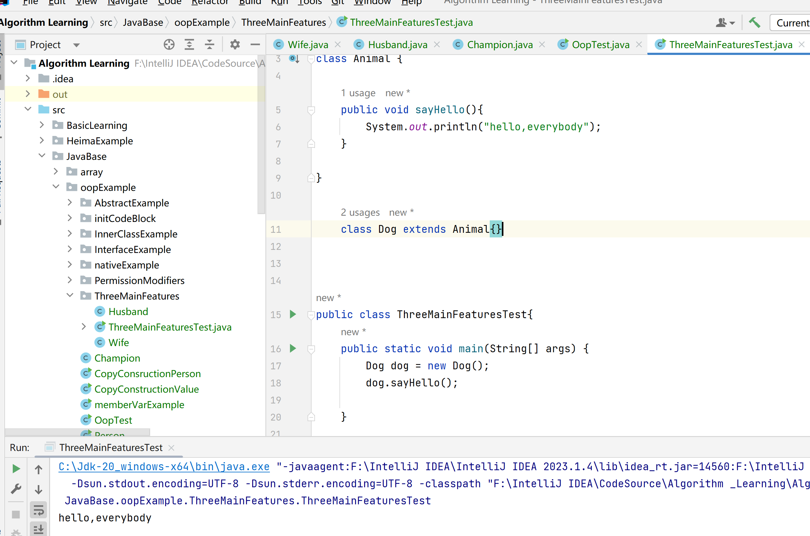
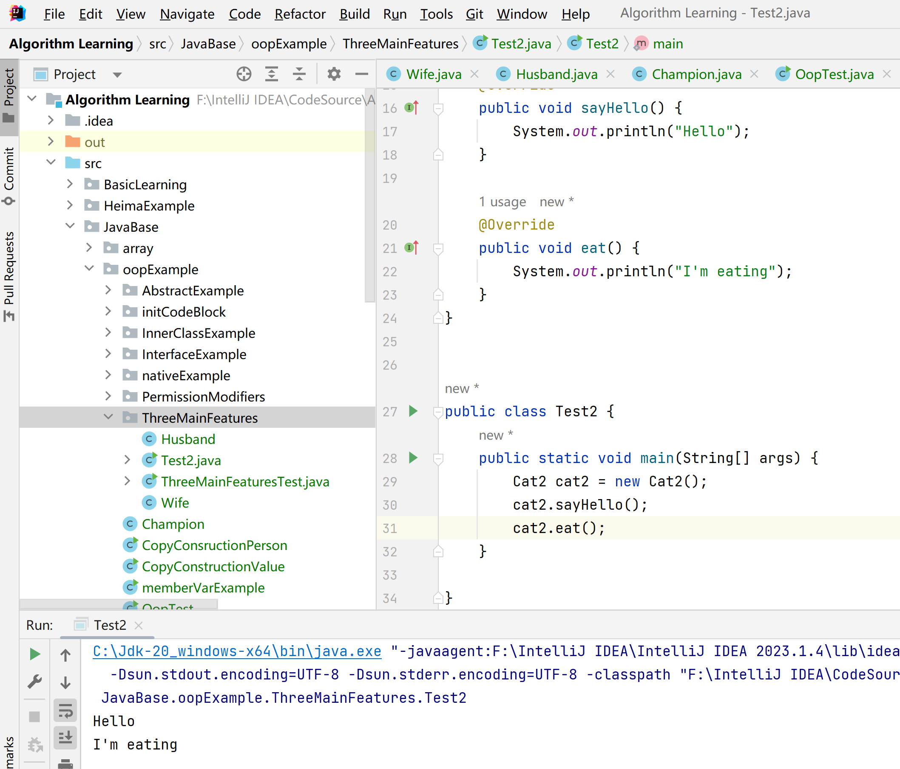
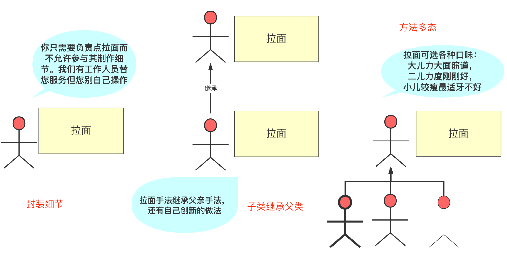

# 面向对象编程

## Java内部类

在 Java 中，可以将一个类定义在另外一个类里面或者一个方法里面，这样的类叫做内部类。

### 1）成员内部类

成员内部类是最常见的内部类，看下面的代码：

```java
class Wanger {
    int age = 18;
    
    class Wangxiaoer {
        int age = 81;
    }
}
```

看起来内部类 Wangxiaoer 就好像 Wanger 的一个成员，成员内部类可以无限制访问外部类的所有成员属性。

```java
public class Wanger {
    int age = 18;
    private String name = "沉默王二";
    static double money = 1;

    class Wangxiaoer {
        int age = 81;
        
        public void print() {
            System.out.println(name);
            System.out.println(money);
        }
    }
}
```

内部类可以随心所欲地访问外部类的成员，但外部类想要访问内部类的成员，就不那么容易了，必须先创建一个成员内部类的对象，再通过这个对象来访问：

```java
public class Wanger {
    int age = 18;
    private String name = "沉默王二";
    static double money = 1;

    public Wanger () {
        new Wangxiaoer().print();
    }

    class Wangxiaoer {
        int age = 81;

        public void print() {
            System.out.println(name);
            System.out.println(money);
        }
    }
}
```


这也就意味着，如果想要在静态方法中访问成员内部类的时候，就必须先得创建一个外部类的对象，因为内部类是依附于外部类的。

```java
public class Wanger {
    int age = 18;
    private String name = "沉默王二";
    static double money = 1;

    public Wanger () {
        new Wangxiaoer().print();
    }

    public static void main(String[] args) {
        Wanger wanger = new Wanger();
        Wangxiaoer xiaoer = wanger.new Wangxiaoer();
        xiaoer.print();
    }

    class Wangxiaoer {
        int age = 81;

        public void print() {
            System.out.println(name);
            System.out.println(money);
        }
    }
}
```

这种创建内部类的方式在实际开发中并不常用，因为内部类和外部类紧紧地绑定在一起，使用起来非常不便。


### 2）局部内部类

局部内部类是定义在一个方法或者一个作用域里面的类，所以局部内部类的生命周期仅限于作用域内。

```java
public class Champion {
    public void fight() {
        int damage = 100; // 局部变量

        // 定义在方法内部的类
        class Skill {
            public void execute() {
                System.out.println("造成伤害: " + damage);
            }
        }

        Skill s = new Skill();
        s.execute();
    }
}
```

局部内部类就好像一个局部变量一样，它是不能被权限修饰符修饰的，比如说 public、protected、private 和 static 等。

局部内部类就像是你在某个房间（方法）里临时请的一个装修工，一旦你出了这个房间，谁也不认识他。


<span style="color:red"> 面试：为什么局部变量必须是 `final`</span>

这是关于局部内部类**最常问、最经典**的面试题。

- **现象**：在 Java 8 之前，局部内部类访问的局部变量必须显式加上 `final`；Java 8 之后可以不加，但该变量必须是 **“事实上不可变”（Effectively Final）** 的（即你不能在后面修改它的值）。
- **底层原因（核心关键）**：**生命周期不一致导致的“数据备份”**。

1. **方法栈 vs 堆**：方法执行时，局部变量 `damage` 存在于**栈**中。方法跑完，栈帧销毁，变量就没了。
2. **对象永生**：局部内部类产生的对象 `s` 存在于**堆**中。方法跑完了，对象可能还没被垃圾回收（GC）。
3. **穿帮了怎么办？**：如果对象还在，但它依赖的变量已经没了，程序就会崩溃。
4. **解决办法**：Java 偷偷把这个变量**复制**了一份放进了内部类对象里。为了保证这份“备份”和原来的变量长得一模一样，Java 强制要求这个变量不能变（`final`）。


<span style="color:red">**面试常见问题清单（Q&A）**</span>

> **Q1：局部内部类和匿名内部类有什么区别？**

- **匿名内部类**：没有名字，通常是为了实现接口或继承类，随用随扔，最常用。
- **局部内部类**：有名字，可以多次实例化（在方法内），也可以定义构造方法。它更像是一个完整的类，只是限制了活动范围。

> **Q2：局部内部类能访问外部类的成员吗？**

- **能！** 它可以无障碍访问外部类的所有成员变量和方法（包括私有的）。因为它依然是在外部类这个“家”里定义的。

> **Q3：为什么局部内部类在实际开发中很少见？**

- 因为它太重了。如果只是为了临时用一下功能，大家通常首选 **Lambda 表达式**（Java 8+）或 **匿名内部类**。局部内部类只在“方法内需要定义复杂的逻辑、且需要复用、还要起个名字”这种极少数场景下才会出现。


### 3）匿名内部类

匿名内部类是我们平常用得最多的，尤其是启动多线程的时候，会经常用到，并且 IDE 也会帮我们自动生成。

```java
public class ThreadDemo {
    public static void main(String[] args) {
        Thread t = new Thread(new Runnable() {
            @Override
            public void run() {
                System.out.println(Thread.currentThread().getName());
            }
        });
        t.start();
    }
}
```

匿名内部类就好像一个方法的参数一样，用完就没了，以至于我们都不需要为它专门写一个构造方法，它的名字也是由系统自动命名的。仔细观察编译后的字节码文件也可以发现，匿名内部类连名字都不配拥有，哈哈，直接借用的外部类，然后 `$1` 就搞定了。


匿名内部类是唯一一种没有构造方法的类。就上面的写法来说，匿名内部类也不允许我们为其编写构造方法，因为它就像是直接通过 new 关键字创建出来的一个对象。

匿名内部类的作用主要是用来继承其他类或者实现接口，并不需要增加额外的方法，方便对继承的方法进行实现或者重写。

**匿名内部类（Anonymous Inner Class）** 是 Java 内部类家族中地位最高、使用频率最广的“无名英雄”。

如果说局部内部类是“大楼里的临时工”，那么匿名内部类就是**“路边临时招募的志愿者”**——它连名字都没有，干完活就走，绝不留痕迹。

**1. 它的长相：创建与实例化“合体”**

通常我们要实现一个接口，得先写个类，再 `new` 它。匿名内部类直接把这两步合二为一：

```java
// 还是你之前的教练接口
interface Coach {
    void command();
}

public class Demo {
    public static void main(String[] args) {
        // 这里的代码块就是一个匿名内部类
        Coach c = new Coach() {
            @Override
            public void command() {
                System.out.println("临时教练说：大龙集合！");
            }
        }; 
        c.command();
    }
}
```

**语法拆解：**

- **`new Coach()`**：这看起来像是在实例化接口（其实不是），它实际上是在告诉 JVM：“我要创建一个实现 `Coach` 接口的类”。
- **`{ ... }`**：这个大括号里的内容就是这个**无名类**的类体。


**2. 匿名内部类的“三大准则”**

为了在面试和开发中不出错，你需要记住这三点：

1. **没有名字**：因为它没有名字，所以它**没有构造方法**（Constructor）。
2. **只能继承一个父类或实现一个接口**：它是单干户，不能既继承 A 又实现 B。
3. **变量捕获（重要！）**：和局部内部类一样，它访问的局部变量必须是 `final` 或 **事实上不可变（Effectively Final）** 的。


**3. 它存在的意义：为了“省事”**

如果你只需要用一次某个功能，特意去写一个 `.java` 文件或者写一个具名内部类就太沉重了。

**匿名内部类的优势：**

- **高内聚**：代码就在调用的地方，逻辑非常紧凑，不需要跳到别的文件去看实现。
- **减少命名污染**：不用为了给类起个“什么什么Impl”的名字而伤脑筋。


<span style="color:red">**4. 面试必考：匿名内部类 vs Lambda 表达式**</span>

在 Java 8 之后，匿名内部类的风头被 **Lambda** 抢走了不少。面试官经常会问它们的区别：

| **特性**          | **匿名内部类**                   | **Lambda 表达式**                            |
| ----------------- | -------------------------------- | -------------------------------------------- |
| **适用范围**      | 接口、抽象类、普通类             | **仅限函数式接口**（只有一个抽象方法的接口） |
| **关键字 `this`** | 指向内部类自己                   | 指向外部类                                   |
| **底层实现**      | 编译后产生一个 `.class` 文件     | 动态生成，通常性能更好                       |
| **多方法支持**    | 支持（可以重写接口里的多个方法） | **不支持**（只能实现一个方法）               |


### 4）静态内部类

静态内部类和成员内部类类似，只是多了一个 [static 关键字](https://javabetter.cn/oo/static.html)。

```java
public class Wangsi {
    static int age;
    double money;
    
    static class Wangxxiaosi {
        public Wangxxiaosi (){
            System.out.println(age);
        }
    }
}
```

由于 static 关键字的存在，静态内部类是不允许访问外部类中非 static 的变量和方法的，这一点也非常好理解：你一个静态的内部类访问我非静态的成员变量干嘛？

<div align="center">
  
</div>

为什么要使用内部类呢？

这个问题问的非常妙

在《Think in java》中有这样一句话：

> 使用内部类最吸引人的原因是：每个内部类都能独立地继承一个（接口的）实现，所以无论外围类是否已经继承了某个（接口的）实现，对于内部类都没有影响。

在我们程序设计中有时候会存在一些使用接口很难解决的问题，这个时候我们可以利用内部类提供的、可以继承多个具体的或者抽象的类的能力来解决这些程序设计问题。可以这样说，接口只是解决了部分问题，而内部类使得多重继承的解决方案变得更加完整。

使用内部类还能够为我们带来如下特性：

- 1、内部类可以使用多个实例，每个实例都有自己的状态信息，并且与其他外围对象的信息相互独立。
- 2、在单个外部类中，可以让多个内部类以不同的方式实现同一个接口，或者继承同一个类。
- 3、创建内部类对象的时刻并不依赖于外部类对象的创建。
- 4、内部类并没有令人迷惑的“is-a”关系，他就是一个独立的实体。
- 5、内部类提供了更好的封装，除了该外围类，其他类都不能访问。


核心思想是：**内部类不是为了套娃而套娃，它是为了弥补 Java “单继承”的遗憾，并提供极致的封装。**

Java 规定一个类只能有一个亲爹（单继承）。但如果一个类既想表现得像 A，又想表现得像 B，该怎么办？

- **接口**：能解决一部分，但接口里不能存状态（变量）。
- **内部类**：这是“终极方案”。

**比喻：** 比如你（外部类）已经继承了“父亲”的基因。但你还想学习“裁缝”和“厨师”的技能，并且这两个技能都需要继承各自家族的“秘籍”（抽象类）。 你可以让 `内部类1` 继承 `裁缝秘籍`，`内部类2` 继承 `厨师秘籍`。这样，你这个整体就同时拥有了多个具体类的能力。


举例说明:

在 Java 中，一个类只能 `extends` 一个父类。假设我们有两个抽象类：`Father`（父亲，教你钓鱼）和 `Teacher`（老师，教你写代码）。如果我们想让一个 `Child` 类同时继承这两个人的本领，直接继承是不行的。

这时候，**内部类**就闪亮登场了。


```
// 抽象类 A：父亲的技能
abstract class Father {
    abstract void fish();
}

// 抽象类 B：老师的技能
abstract class Teacher {
    abstract void programming();
}

// 外部类：孩子
public class Child {
    
    // 特性 5：良好的封装，这两个内部类可以是 private，外界根本不知道它们的存在
    
    // 内部类 1：独立继承 Father
    private class FatherSide extends Father {
        @Override
        void fish() {
            System.out.println("继承了父亲的技能：去河边钓鱼");
        }
    }

    // 内部类 2：独立继承 Teacher
    private class TeacherSide extends Teacher {
        @Override
        void programming() {
            System.out.println("继承了老师的技能：在电脑前写 Java");
        }
    }

    // 暴露给外界的方法
    public void doFish() {
        new FatherSide().fish();
    }

    public void doProgram() {
        new TeacherSide().programming();
    }

    public static void main(String[] args) {
        Child xiaoming = new Child();
        // xiaoming 看起来只是一个 Child 实体
        // 但他通过内部类，同时拥有了 Father 和 Teacher 的能力
        xiaoming.doFish();
        xiaoming.doProgram();
    }
}
```

**结合你的 5 点深度拆解：**

**1. 独立继承与多继承（核心）**

> “内部类使得多重继承的解决方案变得更加完整。”

- **解释**：在上面的代码中，`Child` 类本身没有继承任何类，但它内部的两个小类分别继承了 `Father` 和 `Teacher`。这绕过了 Java 单继承的限制，让 `Child` 能够“白嫖”两个具体类的实现逻辑。

**2. 特性 1 & 2：多个实例与不同实现**

> “让多个内部类以不同的方式实现同一个接口...”

- **代码场景**：如果 `Father` 接口有一个“休息”方法，你可以在 `Child` 内部写两个内部类：`SummerRest` 和 `WinterRest`。
- **效果**：同一个外部类对象，可以根据需要产生两种完全不同的“休息”逻辑。如果是普通类实现接口，你只能写死一种逻辑。

**3. 特性 4：没有迷惑的 “is-a” 关系**

> “它就是一个独立的实体。”

- **解释**：如果 `Child extends Father`，逻辑上是“孩子是一个父亲”，这很荒谬。
- **内部类做法**：`Child` 内部有一个 `FatherSide`。这叫 **“组合（Has-a）”**。逻辑变成了“孩子拥有父亲的一部分能力”。这比强制继承更符合人类的逻辑直觉。

**4. 特性 5：完美的封装**

> “除了该外围类，其他类都不能访问。”

- **解释**：注意我代码里的 `private class`。
- **效果**：在外面你只能看到 `xiaoming.doFish()`，你根本不知道 xiaoming 内部是通过哪个类、哪行代码实现的。这种安全性是外部普通类无法提供的（普通类不能是 private）。


**这么做的意义是什么?**

在 Java 的世界里，法律规定：**一个孩子只能有一个亲生父亲（单继承）**。 如果你写 `class Child extends Father, Teacher`，编译器会直接报错。

**但是，现实需求往往很复杂：** 你既希望 `Child` 能像 `Father` 一样去钓鱼（继承 `Father` 的所有非抽象方法和属性），又希望他能像 `Teacher` 一样去写代码（继承 `Teacher` 的资源）。

**内部类完美解决了这个矛盾：**

- `Child` 本身可以空出来，去继承别的类。
- `FatherSide` 内部类作为“代理人”，替 `Child` 继承了 `Father`。
- `TeacherSide` 内部类作为另一个“代理人”，替 `Child` 继承了 `Teacher`。

**最终结果：** `Child` 这个类，通过两个“马甲”，间接拿到了两个抽象类的入场券。


**2. 实际生产生活中的场景**

这种设计在复杂的框架设计和底层开发中随处可见：

**场景 A：Android 开发中的“多路监听器”**

在 Android 中，一个界面（Activity）可能需要监听很多事件：点击、长按、滑动。这些监听器往往是抽象类（如 `GestureDetector.SimpleOnGestureListener`）。

- **问题**：Activity 已经继承了系统的 `Activity` 类，无法再继承这些手势抽象类。
- **方案**：在 Activity 内部定义多个私有的内部类，分别继承不同的手势抽象类。
- **意义**：Activity 变成了一个“大管家”，它内部雇佣了多个“专业小弟”来处理不同的手势。

**场景 B：多线程任务管理（Task Execution）**

假设你有一个“下载管理器”类（DownloadManager），它需要同时处理两个逻辑：

1. **心跳检测**：需要继承 `TimerTask` 来定时运行。
2. **文件写入**：需要继承某个 `Thread` 子类来处理 IO。

- **方案**：通过两个内部类，一个继承 `TimerTask` 负责跳动，一个继承 `Thread` 负责写盘。
- **意义**：`DownloadManager` 依然保持着它的独立性，不被任何一个父类“绑架”。

**场景 C：适配不同版本的第三方库**

想象你在做一个视频播放器，需要适配两个老旧的库：`LegacyPlayerA` 和 `LegacyPlayerB`。这两个库都要求你必须继承它们的 `BaseHandler` 才能用。

- **方案**：在你的播放器类里，写两个内部类分别继承 A 和 B 的基类。
- **意义**：你的主播放器类就像一个“适配器”，完美融合了两个完全不同的系统。


**那为什么不适用接口来完成呢?**

简单一句话：**接口只能解决“行为准则（做什么）”的问题，而内部类解决了“状态继承（是什么/怎么做）”的问题。**

**1. 状态（成员变量）的限制**

**接口**是“穷光蛋”，它不能拥有自己的**实例变量**。虽然 Java 8 之后接口有了 `default` 方法，但它依然存不了数据。

- **场景**：假设 `Father` 类里有一个 `int fishingRodCount`（鱼竿数量），每钓一次鱼，鱼竿数量就减一。
- **接口方案**：无法实现。接口里的变量默认都是 `static final` 的常量，你改不了它的值。
- **内部类方案**：内部类继承的是**真正的抽象类**，它可以拥有自己的属性，并记录状态的变化。


**2. 避免“强制实现”的臃肿**

如果你让 `Child` 直接实现两个接口，`Child` 类会变得非常混乱。

- **接口方案**：所有的实现逻辑都得堆在 `Child` 类的大括号里。如果这两个接口加起来有 20 个方法，`Child` 类瞬间就变成了一个“巨型垃圾场”。
- **内部类方案**：这叫**“逻辑拆分”**。钓鱼的逻辑全在 `FatherSide` 里，写代码的逻辑全在 `TeacherSide` 里。`Child` 只需要像插拔式 U 盘一样调用它们。这让代码结构非常清爽，符合“单一职责原则”。


**3. 处理“方法名冲突”**

这是一个非常阴险的场景：如果两个接口里恰好有两个**名字一模一样、但意义完全不同**的方法，接口就抓瞎了。

- **例子**：
  - `interface Cook { void heat(); }` （厨师的：加热食物）
  - `interface Electronics { void heat(); }` （电器的：机身发热）
- **接口方案**：如果 `Child` 同时实现这两个接口，它只能写一个 `void heat()` 方法。那么这个方法到底是做饭还是发烧？你没法区分。
- **内部类方案**：
  - `inner class MyCook implements Cook { void heat() { ... } }`
  - `inner class MyPhone implements Electronics { void heat() { ... } }`
  - **结果**：通过不同的内部类对象，你完美地区分了两个同名的动作。


**4. 访问外部类的“后门”权限**

这是内部类最核心的杀手锏。

- **接口方案**：如果你把实现逻辑写在外部的另一个普通类里，那个类是没法直接访问 `Child` 的 `private` 私有属性的。
- **内部类方案**：内部类就像是外部类的“影子”。它可以**无视任何权限修饰符**，直接拿取外部类的 `private` 数据。这种“亲密无间”的合作是接口无法提供的。


**5. 什么时候该用谁？（决策树）**

为了帮你理清思路，我们可以做个简单的判断：

| **需求场景**                         | **推荐方案**         | **理由**                                |
| ------------------------------------ | -------------------- | --------------------------------------- |
| 只是想给类加个标签（如：会跑、会跳） | **实现接口**         | 简单直接，符合 Java 标准。              |
| 需要继承某个现成的、有具体属性的类   | **内部类继承**       | 接口存不了数据，实现不了状态继承。      |
| 想要隐藏复杂的实现细节，不让外人看   | **内部类 + private** | 接口方法默认必须是 `public`，无法隐藏。 |
| 多个父类里有重名方法需要分别处理     | **内部类**           | 接口无法区分同名方法。                  |

**接口**像是一个**“法律合同”**，规定了你必须履行哪些职责； \**内部类\**则像是你雇佣的**“专业外包团队”**，它们带着自己的工具（属性）和经验（方法实现）进驻你的公司，替你处理那些复杂的、私密的、且可能互相冲突的任务。


## Java三大特性：封装、继承和多态

在谈 Java 面向对象的时候，不得不提到面向对象的三大特征：[封装](https://javabetter.cn/oo/encapsulation.html)、[继承](https://javabetter.cn/oo/extends-bigsai.html)、[多态](https://javabetter.cn/oo/polymorphism.html)。三大特征紧密联系而又有区别，合理使用继承能大大减少重复代码，**提高代码复用性。**

### 1）封装

封装从字面上来理解就是包装的意思，专业点就是信息隐藏，**是指利用抽象将数据和基于数据的操作封装在一起，使其构成一个不可分割的独立实体**。

数据被保护在类的内部，尽可能地隐藏内部的实现细节，只保留一些对外接口使之与外部发生联系。

其他对象只能通过已经授权的操作来与这个封装的对象进行交互。也就是说用户是无需知道对象内部的细节（当然也无从知道），但可以通过该对象对外的提供的接口来访问该对象。

使用封装有 4 大好处：

- 1、良好的封装能够减少耦合。
- 2、类内部的结构可以自由修改。
- 3、可以对成员进行更精确的控制。
- 4、隐藏信息，实现细节。

首先我们先来看两个类:

①Husband.java

```java
public class Husband {

    /*
     * 对属性的封装
     * 一个人的姓名、性别、年龄、妻子都是这个人的私有属性
     */
    private String name ;
    private String sex ;
    private int age ;
    private Wife wife;

    /*
     * setter()、getter()是该对象对外开发的接口
     */
    public String getName() {
        return name;
    }

    public void setName(String name) {
        this.name = name;
    }

    public String getSex() {
        return sex;
    }

    public void setSex(String sex) {
        this.sex = sex;
    }

    public int getAge() {
        return age;
    }

    public void setAge(int age) {
        this.age = age;
    }

    public void setWife(Wife wife) {
        this.wife = wife;
    }
}
```

②Wife.java

```java
public class Wife {
    private String name;
    private int age;
    private String sex;
    private Husband husband;

    public String getName() {
        return name;
    }

    public void setName(String name) {
        this.name = name;
    }

    public String getSex() {
        return sex;
    }

    public void setSex(String sex) {
        this.sex = sex;
    }

    public void setAge(int age) {
        this.age = age;
    }

    public void setHusband(Husband husband) {
        this.husband = husband;
    }

    public Husband getHusband() {
        return husband;
    }

}
```

可以看得出， Husband 类里面的 wife 属性是没有 `getter()`的，同时 Wife 类的 age 属性也是没有 `getter()`方法的。

没有哪个女人愿意别人知道她的年龄。

所以封装把一个对象的属性私有化，同时提供一些可以被外界访问的属性的方法，如果不想被外界方法，我们大可不必提供方法给外界访问。

但是如果一个类没有提供给外界任何可以访问的方法，那么这个类也没有什么意义了。

比如我们将一个房子看做是一个对象，里面有漂亮的装饰，如沙发、电视剧、空调、茶桌等等都是该房子的私有属性，但是如果我们没有那些墙遮挡，是不是别人就会一览无余呢？没有一点儿隐私！

因为存在那个遮挡的墙，我们既能够有自己的隐私而且我们可以随意的更改里面的摆设而不会影响到外面的人。

但是如果没有门窗，一个包裹的严严实实的黑盒子，又有什么存在的意义呢？所以通过门窗别人也能够看到里面的风景。所以说门窗就是房子对象留给外界访问的接口。

通过这个我们还不能真正体会封装的好处。现在我们从程序的角度来分析封装带来的好处。如果我们不使用封装，那么该对象就没有 `setter()`和 `getter()`，那么 Husband 类应该这样写：

```java
public class Husband {
    public String name ;
    public String sex ;
    public int age ;
    public Wife wife;
}
```

我们应该这样来使用它：

```java
Husband husband = new Husband();
husband.age = 30;
husband.name = "张三";
husband.sex = "男";    //貌似有点儿多余
```

但是哪天如果我们需要修改 Husband，例如将 age 修改为 String 类型的呢？你只有一处使用了这个类还好，如果你有几十个甚至上百个这样地方，你是不是要改到崩溃。如果使用了封装，我们完全可以不需要做任何修改，只需要稍微改变下 Husband 类的 `setAge()`方法即可。

```java
public class Husband {

    /*
     * 对属性的封装
     * 一个人的姓名、性别、年龄、妻子都是这个人的私有属性
     */
    private String name ;
    private String sex ;
    private String age ;    /* 改成 String类型的*/
    private Wife wife;

    public String getAge() {
        return age;
    }

    public void setAge(int age) {
        //转换即可
        this.age = String.valueOf(age);
    }

    /** 省略其他属性的setter、getter **/

}
```

其他的地方依然这样引用( `husband.setAge(22)` )保持不变。

到了这里我们确实可以看出，**封装确实可以使我们更容易地修改类的内部实现，而无需修改使用了该类的代码**。

我们再看这个好处：**封装可以对成员变量进行更精确的控制**。

还是那个 Husband，一般来说我们在引用这个对象的时候是不容易出错的，但是有时你迷糊了，写成了这样：

```java\
Husband husband = new Husband();
husband.age = 300;
```

也许你是因为粗心写成了这样，你发现了还好，如果没有发现那就麻烦大了，谁见过 300 岁的老妖怪啊！

但是使用封装我们就可以避免这个问题，我们对 age 的访问入口做一些控制(setter)如：

```java
public class Husband {

    /*
     * 对属性的封装
     * 一个人的姓名、性别、年龄、妻子都是这个人的私有属性
     */
    private String name ;
    private String sex ;
    private int age ;    /* 改成 String类型的*/
    private Wife wife;

    public int getAge() {
        return age;
    }

    public void setAge(int age) {
        if(age > 120){
            System.out.println("ERROR：error age input....");    //提示錯誤信息
        }else{
            this.age = age;
        }

    }

    /** 省略其他属性的setter、getter **/

}
```

上面都是对 setter 方法的控制，其实通过封装我们也能够对对象的出口做出很好的控制。例如性别在数据库中一般都是以 1、0 的方式来存储的，但是在前台我们又不能展示 1、0，这里我们只需要在 `getter()`方法里面做一些转换即可。

```java
public String getSexName() {
    if("0".equals(sex)){
        sexName = "女";
    }
    else if("1".equals(sex)){
        sexName = "男";
    }
    return sexName;
}
```

在使用的时候我们只需要使用 sexName 即可实现正确的性别显示。同理也可以用于针对不同的状态做出不同的操作。

```java
public String getCzHTML(){
    if("1".equals(zt)){
        czHTML = "<a href='javascript:void(0)' onclick='qy("+id+")'>启用</a>";
    }
    else{
        czHTML = "<a href='javascript:void(0)' onclick='jy("+id+")'>禁用</a>";
    }
    return czHTML;
}
```

### 2）继承

#### 01、什么是继承

**继承**（英语：inheritance）是面向对象软件技术中的一个概念。它使得**复用以前的代码非常容易。**

Java 语言是非常典型的面向对象的语言，在 Java 语言中**继承就是子类继承父类的属性和方法，使得子类对象（实例）具有父类的属性和方法，或子类从父类继承方法，使得子类具有父类相同的方法**。

我们来举个例子：动物有很多种，是一个比较大的概念。在动物的种类中，我们熟悉的有猫(Cat)、狗(Dog)等动物，它们都有动物的一般特征（比如能够吃东西，能够发出声音），不过又在细节上有区别（不同动物的吃的不同，叫声不一样）。

在 Java 语言中实现 Cat 和 Dog 等类的时候，就需要继承 Animal 这个类。继承之后 Cat、Dog 等具体动物类就是子类，Animal 类就是父类。

<div align="center">
  
</div>

#### 02、为什么需要继承

你可能会问**为什么需要继承**？

如果仅仅只有两三个类，每个类的属性和方法很有限的情况下确实没必要实现继承，但事情并非如此，事实上一个系统中往往有很多个类并且有着很多相似之处，比如猫和狗同属动物，或者学生和老师同属人。各个类可能又有很多个相同的属性和方法，这样的话如果每个类都重新写不仅代码显得很乱，代码工作量也很大。

这时继承的优势就出来了：可以直接使用父类的属性和方法，自己也可以有自己新的属性和方法满足拓展，父类的方法如果自己有需求更改也可以重写。这样**使用继承不仅大大的减少了代码量，也使得代码结构更加清晰可见**。

<div align="center">
  
</div>

所以这样从代码的层面上来看我们设计这个完整的 Animal 类是这样的：

```java
class Animal
{
    public int id;
    public String name;
    public int age;
    public int weight;

    public Animal(int id, String name, int age, int weight) {
        this.id = id;
        this.name = name;
        this.age = age;
        this.weight = weight;
    }
    //这里省略get set方法
    public void sayHello()
    {
        System.out.println("hello");
    }
    public void eat()
    {
        System.out.println("I'm eating");
    }
    public void sing()
    {
        System.out.println("sing");
    }
}
```

而 Dog，Cat，Chicken 类可以这样设计：

```java
class Dog extends Animal//继承animal
{
    public Dog(int id, String name, int age, int weight) {
        super(id, name, age, weight);//调用父类构造方法
    }
}
class Cat extends Animal{

    public Cat(int id, String name, int age, int weight) {
        super(id, name, age, weight);//调用父类构造方法
    }
}
class Chicken extends Animal{

    public Chicken(int id, String name, int age, int weight) {
        super(id, name, age, weight);//调用父类构造方法
    }
    //鸡下蛋
    public void layEggs()
    {
        System.out.println("我是老母鸡下蛋啦，咯哒咯！咯哒咯！");
    }
}
```

各自的类继承 Animal 后可以直接使用 Animal 类的属性和方法而不需要重复编写，各个类如果有自己的方法也可很容易地拓展。


#### 03、继承的分类

**单继承**

<div align="center">
  
</div>


单继承，一个子类只有一个父类，如我们上面讲过的 Animal 类和它的子类。**单继承在类层次结构上比较清晰，但缺点是结构的丰富度有时不能满足使用需求**。

**多继承**


<div align="center">
  
</div>

多继承，一个子类有多个直接的父类。这样做的好处是子类拥有所有父类的特征，**子类的丰富度很高，但是缺点就是容易造成混乱**。下图为一个混乱的例子。

<div align="center">
  
</div>

Java 虽然不支持多继承，但是 Java 有三种实现多继承效果的方式，**分别是**内部类、多层继承和实现接口。

[内部类](https://javabetter.cn/oo/inner-class.html)可以继承一个与外部类无关的类，保证了内部类的独立性，正是基于这一点，可以达到多继承的效果。

**多层继承：\**子类继承父类，父类如果还继承其他的类，那么这就叫\**多层继承**。这样子类就会拥有所有被继承类的属性和方法。

<div align="center">
  
</div>

[实现接口](https://javabetter.cn/oo/interface.html)无疑是满足多继承使用需求的最好方式，一个类可以实现多个接口满足自己在丰富性和复杂环境的使用需求。

类和接口相比，**类就是一个实体，有属性和方法，而接口更倾向于一组方法**。举个例子，就拿斗罗大陆的唐三来看，他存在的继承关系可能是这样的：

<div align="center">
  
</div>

#### 04、如何实现继承

##### **extends 关键字**

在 Java 中，类的继承是单一继承，也就是说一个子类只能拥有一个父类，所以**extends**只能继承一个类。其使用语法为

```java
class 子类名 extends 父类名{}
```

例如 Dog 类继承 Animal 类，它是这样的：

```java
class Animal{} //定义Animal类
class Dog extends Animal{} //Dog类继承Animal类
```

子类继承父类后，就拥有父类的非私有的**属性和方法**。如果不明白，请看这个案例，在 IDEA 下创建一个项目，创建一个 test 类做测试，分别创建 Animal 类和 Dog 类，Animal 作为父类写一个 sayHello()方法，Dog 类继承 Animal 类之后就可以调用 sayHello()方法。具体代码为：

```java
class Animal {
    public void  sayHello()//父类的方法
    {
        System.out.println("hello,everybody");
    }
}
class Dog extends Animal//继承animal
{ }
public class test {
    public static void main(String[] args) {
       Dog dog=new Dog();
       dog.sayHello();
    }
}
```

点击运行的时候 Dog 子类可以直接使用 Animal 父类的方法。




##### implements 关键字

使用 implements 关键字可以变相使 Java 拥有多继承的特性，使用范围为类实现接口的情况，一个类可以实现多个接口(接口与接口之间用逗号分开)。

我们来看一个案例，创建一个 test2 类做测试，分别创建 doA 接口和 doB 接口，doA 接口声明 sayHello()方法，doB 接口声明 eat()方法，创建 Cat2 类实现 doA 和 doB 接口，并且在类中需要重写 sayHello()方法和 eat()方法。具体代码为：

```java
interface doA{
     void sayHello();
}
interface doB{
     void eat();
    //以下会报错 接口中的方法不能具体定义只能声明
    //public void eat(){System.out.println("eating");}
}
class Cat2 implements  doA,doB{
    @Override//必须重写接口内的方法
    public void sayHello() {
        System.out.println("hello!");
    }
    @Override
    public void eat() {
        System.out.println("I'm eating");
    }
}
public class test2 {
    public static void main(String[] args) {
        Cat2 cat=new Cat2();
        cat.sayHello();
        cat.eat();
    }
}
```

Cat 类实现 doA 和 doB 接口的时候，需要实现其声明的方法，点击运行结果如下，这就是一个类实现接口的简单案例：



#### 05、继承的特点

继承的主要内容就是子类继承父类，并重写父类的方法。使用子类的属性或方法时候，首先要创建一个对象，而对象通过[构造方法](https://javabetter.cn/oo/construct.html)去创建，在构造方法中我们可能会调用子父类的一些属性和方法，所以就需要提前掌握 [this 和 super 关键字](https://javabetter.cn/oo/this-super.html)。

创建完这个对象之后，再调用**重写**父类后的方法，注意[重写和重载的区别](https://javabetter.cn/basic-extra-meal/override-overload.html)。

##### this 和 super 关键字

> [后面](https://javabetter.cn/oo/this-super.html)会详细讲，这里先来简单了解一下。

this 和 super 关键字是继承中**非常重要的知识点**，分别表示当前对象的引用和父类对象的引用，两者有很大相似又有一些区别。

**this 表示当前对象，是指向自己的引用。**

```java
this.属性 // 调用成员变量，要区别成员变量和局部变量
this.() // 调用本类的某个方法
this() // 表示调用本类构造方法
```

**super 表示父类对象，是指向父类的引用。**

```java
super.属性 // 表示父类对象中的成员变量
super.方法() // 表示父类对象中定义的方法
super() // 表示调用父类构造方法
```


##### 构造方法

[构造方法](https://javabetter.cn/oo/construct.html)是一种特殊的方法，**它是一个与类同名的方法**。在继承中**构造方法是一种比较特殊的方法**（比如不能继承），所以要了解和学习在继承中构造方法的规则和要求。

继承中的构造方法有以下几点需要注意：

**父类的构造方法不能被继承：**

因为构造方法语法是**与类同名**，而继承则不更改方法名，如果子类继承父类的构造方法，那明显与构造方法的语法冲突了。比如 Father 类的构造方法名为 Father()，Son 类如果继承 Father 类的构造方法 Father()，那就和构造方法定义：**构造方法与类同名**冲突了，所以在子类中不能继承父类的构造方法，但子类会调用父类的构造方法。

**子类的构造过程必须调用其父类的构造方法：**

Java 虚拟机**构造子类对象前会先构造父类对象，父类对象构造完成之后再来构造子类特有的属性，\**这被称为\**内存叠加**。而 Java 虚拟机构造父类对象会执行父类的构造方法，所以子类构造方法必须调用 super()即父类的构造方法。就比如一个简单的继承案例应该这么写：

```java
class A{
    public String name;
    public A() {//无参构造
    }
    public A (String name){//有参构造
    }
}
class B extends A{
    public B() {//无参构造
       super();
    }
    public B(String name) {//有参构造
      //super();
       super(name);
    }
}
```

**如果子类的构造方法中没有显示地调用父类构造方法，则系统默认调用父类无参数的构造方法。**

你可能有时候在写继承的时候子类并没有使用 super()调用，程序依然没问题，其实这样是为了节省代码，系统执行时会自动添加父类的无参构造方式，如果不信的话我们对上面的类稍作修改执行：


```java
第一组：执行 B b1 = new B();
调用 B() 构造方法。

Java 发现 B 继承自 A，且 B() 第一行没写代码，于是隐式自动调用了 super()。

程序跳转到 A()，打印出：“我是A类的wu参构造”（第 1 次）。

父类初始化完，回到 B()，打印出：“我是B类的wu参构造”。

第二组：执行 B b2 = new B("BigSai");
调用 B(String name) 构造方法。

虽然这是一个“有参构造”，但你看代码第 15-18 行全被注释掉了。由于没有显式写 super(name)，Java 依然会默认执行隐式的 super()。

程序再次跳转到 A()，打印出：“我是A类的wu参构造”（第 2 次）。

父类初始化完，回到 B(String name)，打印出：“BigSai我是B类的you参构造”。
```


##### 方法重写(Override)

[方法重写](https://javabetter.cn/basic-extra-meal/Overriding.html)也就是子类中出现和父类中一模一样的方法(包括返回值类型，方法名，参数列表)，它建立在继承的基础上。你可以理解为方法的**外壳不变，但是核心内容重写**。

在这里提供一个简单易懂的方法重写案例：

```java
class E1{
    public void doA(int a){
        System.out.println("这是父类的方法");
    }
}
class E2 extends E1{
    @Override
    public void doA(int a) {
        System.out.println("我重写父类方法，这是子类的方法");
    }
}
```


其中`@Override` 注解显示声明该方法为注解方法，可以帮你检查重写方法的语法正确性，当然如果不加也是可以的，但建议加上。


##### 方法重载(Overload)

如果有两个方法的**方法名相同**，但参数不一致，那么可以说一个方法是另一个方法的[重载](https://javabetter.cn/basic-extra-meal/override-overload.html)。

重载可以通常理解为完成同一个事情的方法名相同，但是参数列表不同其他条件也可能不同。一个简单的方法重载的例子，类 E3 中的 add()方法就是一个重载方法。

```java
class E3{
    public int add(int a,int b){
        return a+b;
    }
    public double add(double a,double b) {
        return a+b;
    }
    public int add(int a,int b,int c) {
        return a+b+c;
    }
}
```


#### 06、继承与修饰符

Java 修饰符的作用就是对类或类成员进行修饰或限制，每个修饰符都有自己的作用，而在继承中可能有些特殊修饰符使得被修饰的属性或方法不能被继承，或者继承需要一些其他的条件。

Java 语言提供了很多修饰符，修饰符用来定义类、方法或者变量，通常放在语句的最前端。主要分为以下两类：

- [访问权限修饰符](https://javabetter.cn/oo/access-control.html)，也就是 public、private、protected 等
- 非访问修饰符，也就是 static、final、abstract 等

##### [访问修饰符](https://javabetter.cn/oo/encapsulation-inheritance-polymorphism.html#访问修饰符)

Java 子类重写继承的方法时，**不可以降低方法的访问权限**，**子类继承父类的访问修饰符作用域不能比父类小**，也就是更加开放，假如父类是 protected 修饰的，其子类只能是 protected 或者 public，绝对不能是 default(默认的访问范围)或者 private。所以在继承中需要重写的方法不能使用 private 修饰词修饰。


如果还是不太清楚可以看几个小案例就很容易搞懂，写一个 A1 类中用四种修饰词实现四个方法，用子类 A2 继承 A1，重写 A1 方法时候你就会发现父类私有方法不能重写，非私有方法重写使用的修饰符作用域不能变小(大于等于)。


```java
class A1 {
    private void doA(){ }
    void doB(){}//default
    protected void doC(){}
    public void doD(){}
}
class A2 extends A1{

    @Override
    public void doB() { }//继承子类重写的方法访问修饰符权限可扩大

    @Override
    protected void doC() { }//继承子类重写的方法访问修饰符权限可和父类一致

    @Override
    public void doD() { }//不可用protected或者default修饰
}
```

还要注意的是，**继承当中子类抛出的异常必须是父类抛出的异常或父类抛出异常的子异常**。下面的一个案例四种方法测试可以发现子类方法的异常不可大于父类对应方法抛出异常的范围。


正确的案例应该为：

```java
class B1{
    public void doA() throws Exception{}
    public void doB() throws Exception{}
    public void doC() throws IOException{}
    public void doD() throws IOException{}
}
class B2 extends B1{
    //异常范围和父类可以一致
    @Override
    public void doA() throws Exception { }
    //异常范围可以比父类更小
    @Override
    public void doB() throws IOException { }
    //异常范围 不可以比父类范围更大
    @Override
    public void doC() throws IOException { }//不可抛出Exception等比IOException更大的异常
    @Override
    public void doD() throws IOException { }
}
```

##### [非访问修饰符](https://javabetter.cn/oo/encapsulation-inheritance-polymorphism.html#非访问修饰符)

访问修饰符用来控制访问权限，而非访问修饰符每个都有各自的作用，下面针对 static、final、abstract 修饰符进行介绍。

**static 修饰符**

static 翻译为“静态的”，能够与变量，方法和类一起使用，**称为静态变量，静态方法(也称为类变量、类方法)**。如果在一个类中使用 static 修饰变量或者方法的话，它们**可以直接通过类访问，不需要创建一个类的对象来访问成员。**

我们在设计类的时候可能会使用静态方法，有很多工具类比如`Math`，`Arrays`等类里面就写了很多静态方法。

可以看以下的案例证明上述规则：


源代码为：

```java
class C1{
    public  int a;
    public C1(){}
   // public static C1(){}// 构造方法不允许被声明为static
    public static void doA() {}
    public static void doB() {}
}
class C2 extends C1{
    public static  void doC()//静态方法中不存在当前对象，因而不能使用this和super。
    {
        //System.out.println(super.a);
    }
    public static void doA(){}//静态方法能被静态方法重写
   // public void doB(){}//静态方法不能被非静态方法重写
}
```

[final 修饰符](https://javabetter.cn/oo/final.html)

final 变量：

- final 表示"最后的、最终的"含义，**变量一旦赋值后，不能被重新赋值**。被 final 修饰的实例变量必须显式指定初始值(即不能只声明)。final 修饰符通常和 static 修饰符一起使用来创建类常量。

final 方法：

- **父类中的 final 方法可以被子类继承，但是不能被子类重写**。声明 final 方法的主要目的是防止该方法的内容被修改。

final 类：

- **final 类不能被继承**，没有类能够继承 final 类的任何特性。

所以无论是变量、方法还是类被 final 修饰之后，都有代表最终、最后的意思。内容无法被修改。

[abstract 修饰符](https://javabetter.cn/oo/abstract.html)

abstract 英文名为“抽象的”，主要用来修饰类和方法，称为抽象类和抽象方法。

**抽象方法**：有很多不同类的方法是相似的，但是具体内容又不太一样，所以我们只能抽取他的声明，没有具体的方法体，即抽象方法可以表达概念但无法具体实现。

**抽象类**：**有抽象方法的类必须是抽象类**，抽象类可以表达概念但是无法构造实体的类。


比如我们可以这样设计一个 People 抽象类以及一个抽象方法，在子类中具体完成：

```java
abstract class People{
    public abstract void sayHello();//抽象方法
}
class Chinese extends People{
    @Override
    public void sayHello() {//实现抽象方法
        System.out.println("你好");
    }
}
class Japanese extends People{
    @Override
    public void sayHello() {//实现抽象方法
        System.out.println("口你七哇");
    }
}
class American extends People{
    @Override
    public void sayHello() {//实现抽象方法
        System.out.println("hello");
    }
}
```


#### 07、Object 类和转型

提到 Java 继承，不得不提及所有类的根类：Object(java.lang.Object)类，如果一个类没有显式声明它的父类（即没有写 extends xx），那么默认这个类的父类就是 Object 类，任何类都可以使用 Object 类的方法，创建的类也可和 Object 进行向上、向下转型，所以 Object 类是掌握和理解继承所必须的知识点。

Java 向上和向下转型在 Java 中运用很多，也是建立在继承的基础上，所以 Java 转型也是掌握和理解继承所必须的知识点。

##### [Object 类概述](https://javabetter.cn/oo/encapsulation-inheritance-polymorphism.html#object-类概述)

1. Object 是类层次结构的**根类**，所有的类都隐式的继承自 Object 类。
2. Java 中，所有的对象都拥有 Object 的默认方法。
3. Object 类有一个[构造方法](https://javabetter.cn/oo/construct.html)，并且是**无参构造方法**。


Object 是 Java 所有类的父类，是整个类继承结构的顶端，也是最抽象的一个类。

像 `toString()`、`equals()`、`hashCode()`、`wait()`、`notify()`、`getClass()`等都是 Object 的方法。你以后可能会经常碰到，但其中遇到更多的就是 `toString()`方法和 equals()方法，我们经常需要重写这两种方法满足我们的使用需求。

`toString()`方法表示返回该对象的字符串，由于各个对象构造不同所以需要重写，如果不重写的话默认返回`类名@hashCode`格式。

**如果重写 `toString()`方法后**直接调用 `toString()`方法就可以返回我们自定义的该类转成字符串类型的内容输出，而不需要每次都手动的拼凑成字符串内容输出，大大简化输出操作。

equals()方法主要比较两个对象是否相等，因为对象的相等不一定非要严格要求两个对象地址上的相同，有时内容上的相同我们就会认为它相等，比如 String 类就重写了 `euqals`()方法，通过[字符串的内容比较是否相等](https://javabetter.cn/string/equals.html)。


##### 向上转型

**向上转型** : 通过子类对象(小范围)实例化父类对象(大范围)，这种属于自动转换。用一张图就能很好地表示向上转型的逻辑：


##### 向下转型

**向下转型** : 通过父类对象(大范围)实例化子类对象(小范围)，在书写上父类对象需要加括号`()`强制转换为子类类型。但父类引用变量实际引用必须是子类对象才能成功转型，这里也用一张图就能很好表示向下转型的逻辑：


子类引用变量指向父类引用变量指向的对象后(一个 Son()对象)，就完成向下转型，就可以调用一些子类特有而父类没有的方法 。

在这里写一个向上转型和向下转型的案例：

```java
Object object=new Integer(666);//向上转型

Integer i=(Integer)object;//向下转型Object->Integer，object的实质还是指向Integer

String str=(String)object;//错误的向下转型，虽然编译器不会报错但是运行会报错
```


#### 08、子父类初始化顺序

在 Java 继承中，父子类初始化先后顺序为：

1. 父类中静态成员变量和静态代码块
2. 子类中静态成员变量和静态代码块
3. 父类中普通成员变量和代码块，父类的构造方法
4. 子类中普通成员变量和代码块，子类的构造方法

总的来说，就是**静态>非静态，父类>子类，非构造方法>构造方法**。同一类别（例如普通变量和普通代码块）成员变量和代码块执行从前到后，需要注意逻辑。

这个也不难理解，静态变量也称类变量，可以看成一个全局变量，静态成员变量和静态代码块在类加载的时候就初始化，而非静态变量和代码块在对象创建的时候初始化。所以静态快于非静态初始化。

而在创建子类对象的时候需要先创建父类对象，所以父类优先于子类。

而在调用构造方法的时候，是对成员变量进行一些初始化操作，所以普通成员变量和代码块优于构造方法执行。

至于更深层次为什么这个顺序，就要更深入了解 JVM 执行流程啦。下面一个测试代码为：

```java
class Father{
    public Father() {
        System.out.println(++b1+"父类构造方法");
    }//父类构造方法 第四
    static int a1=0;//父类static 第一 注意顺序
    static {
        System.out.println(++a1+"父类static");
    }
    int b1=a1;//父类成员变量和代码块 第三
    {
        System.out.println(++b1+"父类代码块");
    }
}
class Son extends Father{
    public Son() {
        System.out.println(++b2+"子类构造方法");
    }//子类构造方法 第六
    static {//子类static第二步
        System.out.println(++a1+"子类static");
    }
    int b2=b1;//子类成员变量和代码块 第五
    {
        System.out.println(++b2 + "子类代码块");
    }
}
public class test9 {
    public static void main(String[] args) {
        Son son=new Son();
    }
}
```

执行结果:


### 3）多态

Java 的多态是指在面向对象编程中，同一个类的对象在不同情况下表现出来的不同行为和状态。

- 子类可以继承父类的字段和方法，子类对象可以直接使用父类中的方法和字段（私有的不行）。
- 子类可以重写从父类继承来的方法，使得子类对象调用这个方法时表现出不同的行为。
- 可以将子类对象赋给父类类型的引用，这样就可以通过父类类型的引用调用子类中重写的方法，实现多态。

多态的目的是为了提高代码的灵活性和可扩展性，使得代码更容易维护和扩展。

比如说，通过允许子类继承父类的方法并重写，增强了代码的复用性。

再比如说多态可以实现动态绑定，这意味着程序在运行时再确定对象的方法调用也不迟。

“光说理论很枯燥，我们再通过代码来具体地分析一下。


#### 01、多态是什么

在我的印象里，西游记里的那段孙悟空和二郎神的精彩对战就能很好的解释“多态”这个词：一个孙悟空，能七十二变；一个二郎神，也能七十二变；他们都可以变成不同的形态，只需要悄悄地喊一声“变”。

Java 的多态是什么？其实就是一种能力——同一个行为具有不同的表现形式；换句话说就是，执行一段代码，Java 在运行时能根据对象类型的不同产生不同的结果。和孙悟空和二郎神都只需要喊一声“变”，然后就变了，并且每次变得还不一样；一个道理。

多态的前提条件有三个：

- 子类继承父类
- 子类重写父类的方法
- 父类引用指向子类的对象

多态的一个简单应用，来看程序清单 1-1：

```java
//子类继承父类
public class Wangxiaoer extends Wanger {
    public void write() { // 子类重写父类方法
        System.out.println("记住仇恨，表明我们要奋发图强的心智");
    }

    public static void main(String[] args) {
        // 父类引用指向子类对象
        Wanger[] wangers = { new Wanger(), new Wangxiaoer() };

        for (Wanger wanger : wangers) {
            // 对象是王二的时候输出：勿忘国耻
            // 对象是王小二的时候输出：记住仇恨，表明我们要奋发图强的心智
            wanger.write();
        }
    }
}

class Wanger {
    public void write() {
        System.out.println("勿忘国耻");
    }
}
```


#### [02、多态与后期绑定](https://javabetter.cn/oo/encapsulation-inheritance-polymorphism.html#_02、多态与后期绑定)

现在，我们来思考一个问题：程序清单 1-1 在执行 `wanger.write()` 时，由于编译器只有一个 Wanger 引用，它怎么知道究竟该调用父类 Wanger 的 `write()` 方法，还是子类 Wangxiaoer 的 `write()` 方法呢？

答案是在运行时根据对象的类型进行后期绑定，编译器在编译阶段并不知道对象的类型，但是 Java 的方法调用机制能找到正确的方法体，然后执行，得到正确的结果。

多态机制提供的一个重要的好处就是程序具有良好的扩展性。来看程序清单 2-1：

```java
//子类继承父类
public class Wangxiaoer extends Wanger {
    public void write() { // 子类覆盖父类方法
        System.out.println("记住仇恨，表明我们要奋发图强的心智");
    }

    public void eat() {
        System.out.println("我不喜欢读书，我就喜欢吃");
    }

    public static void main(String[] args) {
        // 父类引用指向子类对象
        Wanger[] wangers = { new Wanger(), new Wangxiaoer() };

        for (Wanger wanger : wangers) {
            // 对象是王二的时候输出：勿忘国耻
            // 对象是王小二的时候输出：记住仇恨，表明我们要奋发图强的心智
            wanger.write();
        }
    }
}

class Wanger {
    public void write() {
        System.out.println("勿忘国耻");
    }

    public void read() {
        System.out.println("每周读一本好书");
    }
}
```

在程序清单 2-1 中，我们在 Wanger 类中增加了 `read()` 方法，在 Wangxiaoer 类中增加了 `eat()`方法，但这丝毫不会影响到 `write()` 方法的调用。

`write()` 方法忽略了周围代码发生的变化，依然正常运行。这让我想起了金庸《倚天屠龙记》里九阳真经的口诀：“他强由他强，清风拂山岗；他横由他横，明月照大江。”

多态的这个优秀的特性，让我们在修改代码的时候不必过于紧张，因为多态是一项让程序员“将改变的与未改变的分离开来”的重要特性。


#### 03、多态与构造方法

在构造方法中调用多态方法，会产生一个奇妙的结果，我们来看程序清单 3-1：

```java
package JavaBase.oopExample.ThreeMainFeatures;

class Adults{
    Adults(){
        System.out.println("我大于18岁");
        write();
        System.out.println("我已经毕业了");
    }

    public void write() {
        System.out.println("我是成年人");
    }
}

 class Kids extends Adults{
    private  int age = 3;
    public Kids(int age){
        this.age = age;
        System.out.println("小孩子的年龄是:"+this.age);
    }

    public void write(){
        System.out.println("小孩子上幼儿园的年龄是：" + this.age);
    }
}


public class Test4 {
    public static void main(String[] args) {
        Kids k = new Kids(4);
        k.write();
    }

}
```


拆解一下 `main` 方法执行 `new Kids(4)` 的过程：

1. **进入 `Adults` 构造器**：打印 "我大于18岁"。
2. **调用 `write()`**：因为多态，跑去执行 `Kids.write()`。
3. **打印 `age`**：你会发现这里打印的 `age` 是 **0**，而不是 3 或者 4！
   - **原因**：此时父类构造器还没跑完，子类的成员变量 `age = 3` 的赋值动作**还没开始执行**呢！内存里 `age` 还是默认初始值 0。
4. **回到 `Adults` 构造器**：打印 "我已经毕业了"。
5. **回到 `Kids` 构造器**：执行 `this.age = 4`，打印 "小孩子的年龄是:4"。


<span style="color:red">**[!WARNING] 编程金律** **永远不要在父类的构造函数中调用会被子类重写的方法！** > 就像你看到的，这会导致子类在还没“出生”完全（变量未初始化）的时候，就被迫执行逻辑，极易引发 `NullPointerException` 或数据错误。</span>


#### 04、多态与向下转型

向下转型是指将父类引用强转为子类类型；这是不安全的，因为有的时候，父类引用指向的是父类对象，向下转型就会抛出 ClassCastException，表示类型转换失败；但如果父类引用指向的是子类对象，那么向下转型就是成功的。

来看程序清单 4-1：

```java
package JavaBase.oopExample.ThreeMainFeatures;

class Mates{
    public void read(){
        System.out.println("同学们都爱读书");
    }

    public void write(){
        System.out.println("同学们都爱写题");
    }
}

class Student extends Mates{
    public void read(){
        System.out.println("这位同学喜欢读");
    }

    public void write(){
        System.out.println("这位同学喜欢写");
    }

}


public class Test5 {
    public static void main(String[] args) {
        Mates [] mates = {new Mates(),new Student()};

        ((Student) mates[1]).write();
        ((Student) mates[0]).write();


    }
}

```

打印结果:

```java
这位同学喜欢写
Exception in thread "main" java.lang.ClassCastException: class JavaBase.oopExample.ThreeMainFeatures.Mates cannot be cast to class JavaBase.oopExample.ThreeMainFeatures.Student (JavaBase.oopExample.ThreeMainFeatures.Mates and JavaBase.oopExample.ThreeMainFeatures.Student are in unnamed module of loader 'app')
	at JavaBase.oopExample.ThreeMainFeatures.Test5.main(Test5.java:30)
```


**向下转型**

```java
((Student) mates[1]).write();
```

- **括号里的 `(Student)`**：这是**强制类型转换**。
- **逻辑**：你告诉编译器：“我知道 `mates[1]` 表面上是 `Mates` 类型，但它的本体其实是个 `Student`。请把它当做 `Student` 来处理，我要调用 `Student` 的方法！”
- **结果**：成功。因为 `mates[1]` 本质确实是 `Student`。


**向上转型(错误)**

```
((Student) mates[0]).write();
```

**逻辑**：你再次告诉编译器：“把 `mates[0]` 也当做 `Student` 看待！”

**现实**：`mates[0]` 的本体就是一个纯粹的 **Mates**（父类对象）。

**结果**：**报错！** 程序会抛出 `ClassCastException`（类型转换异常）。

**原因**：**“学生一定是同学，但同学不一定是学生。”** 你不能把一个纯粹的父类对象强行看作子类，因为它根本没有子类的特征。


### 4）小结


- **封装**：是对类的封装，封装是对类的属性和方法进行封装，只对外暴露方法而不暴露具体使用细节，所以我们一般设计类成员变量时候大多设为私有而通过一些 get、set 方法去读写。
- **继承**：子类继承父类，即“子承父业”，子类拥有父类除私有的所有属性和方法，自己还能在此基础上拓展自己新的属性和方法。主要目的是**复用代码**。
- **多态**：多态是同一个行为具有多个不同表现形式或形态的能力。即一个父类可能有若干子类，各子类实现父类方法有多种多样，调用父类方法时，父类引用变量指向不同子类实例而执行不同方法，这就是所谓父类方法是多态的。




