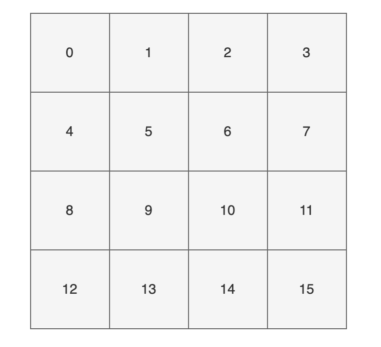
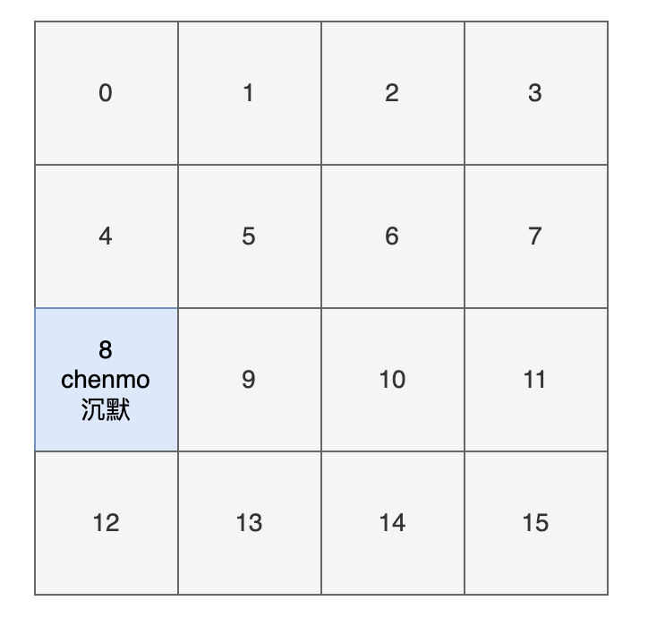

# `HashMap`详解

**本章涉及:源码分析、hash 原理、扩容机制、加载因子、线程不安全**

这篇文章将会详细透彻地讲清楚 Java 的 HashMap，包括 hash 方法的原理、HashMap 的扩容机制、HashMap 的加载因子为什么是 0.75 而不是 0.6、0.8，以及 HashMap 为什么是线程不安全的，基本上 HashMap 的[常见面试题](https://javabebetter.cn/interview/java-hashmap-13.html)，都会在这一篇文章里讲明白。

HashMap 是 Java 中常用的数据结构之一，用于存储键值对。在 HashMap 中，每个键都映射到一个唯一的值，可以通过键来快速访问对应的值，算法时间复杂度可以达到 O(1)。

HashMap 不仅在日常开发中经常用到，在面试中也是重点考察的对象。

以下是 HashMap 增删改查的简单例子：

**1）增加元素**：

将一个键值对（元素）添加到 HashMap 中，可以使用 put() 方法。例如，将名字和年龄作为键值对添加到 HashMap 中：

```java
HashMap<String, Integer> map = new HashMap<>();
map.put("沉默", 20);
map.put("王二", 25);
```


**2）删除元素**：

从 HashMap 中删除一个键值对，可以使用 remove() 方法。例如，删除名字为 "沉默" 的键值对：

```java
map.remove("沉默");
```


**3）修改元素**：

修改 HashMap 中的一个键值对，可以使用 put() 方法。例如，将名字为 "沉默" 的年龄修改为 30：

```java
map.put("沉默", 30);
```

为什么和添加元素的方法一样呢？这个我们后面会讲，先简单说一下，是因为 HashMap 的键是唯一的，所以再次 put 的时候会覆盖掉之前的键值对。


**4）查找元素**：

从 HashMap 中查找一个键对应的值，可以使用 get() 方法。例如，查找名字为 "沉默" 的年龄：

```java
int age = map.get("沉默");
```

在实际应用中，HashMap 可以用于缓存、索引等场景。例如，可以将用户 ID 作为键，用户信息作为值，将用户信息缓存到 HashMap 中，以便快速查找。又如，可以将关键字作为键，文档 ID 列表作为值，将文档索引缓存到 HashMap 中，以便快速搜索文档。

HashMap 的实现原理是基于哈希表的，它的底层是一个数组，数组的每个位置可能是一个链表或红黑树，也可能只是一个键值对（后面会讲）。当添加一个键值对时，HashMap 会根据键的哈希值计算出该键对应的数组下标（索引），然后将键值对插入到对应的位置。

当通过键查找值时，HashMap 也会根据键的哈希值计算出数组下标，并查找对应的值。

## 一 hash 方法

### 01、关于Hash

关于Hash我们要讨论三个方面

#### **①首先什么是 Hash？**

想象一下，如果你要在全中国 14 亿人里找到“张三”，你有两种办法：

- **笨办法（$O(n)$）**：从第一页户口本开始翻，直到翻到张三。
- **Hash 办法（$O(1)$）**：给张三一个**身份证号**。身份证号里隐藏了他的出生地、生日。你只要看到号码，就能直接去对应的省份、对应的城市找他。

**Hash 的本质：把任意长度的输入（对象），通过某种“公式”，转换成固定长度的输出（数字）。**


#### **②哈希函数（Hash Function）的三个绝招**

在 Java 里，每一个对象都有一个 `hashCode()` 方法，这就是它的哈希函数。它有三个钢铁般的原则：

1. **确定性**：同一个对象，只要内容没变，算出来的哈希值必须永远一样。
2. **效率高**：计算速度得飞快。
3. **分布均匀**：不同的对象，算出来的哈希值最好天差地别（减少碰撞）。


#### **③Hash 如何把 $O(n)$ 变成 $O(1)$？**

这是最关键的一步，也是它和**数组**合体的地方。

在环形数组里，我们是通过指针在跳舞。而在 HashMap 里，我们是利用 Hash 值来**算位置**。

假设我们有一个长度为 16 的物理数组。现在要存一个字符串 `"Apple"`：

1. **算哈希**：`"Apple".hashCode()` 算出结果是 `63022`。
2. **映射位置**：我们需要把这个巨大的数字放进长度为 16 的数组里。
   - 还记得最熟悉的取模公式(在环形数组中提到过)吗？
   - $$index = 63022 \pmod{16} = 14$$
   - （或者是官方那种更厉害的位运算：`63022 & (16 - 1)`）
3. **存储**：直接把 `"Apple"` 扔进数组索引为 14 的格子里。

下次你想找 "Apple" 时，你不需要遍历数组，你只需要重新算一下公式，直接去 14 号格子拿就行了！这就是 $O(1)$ 的原因。


#### ④必然发生的意外：哈希碰撞（Collision）

你肯定想到了：**如果两个不同的东西，算出来的索引一样怎么办？**

`hash("Apple")` 算出来可能是 $30$。

`hash("Banana")` 算出来可能是 $46$。

当它们都要存入长度为 16 的数组时：

- $30 \pmod{16} = 14$
- $46 \pmod{16} = 14$

 比如 `"Banana"` 算出来的索引也是 14。这就是**哈希碰撞**。

- **数组的态度**：一个格子里只能存一个东西，这下打架了。
- **HashMap 的对策**：格子里不直接存数据，而是存一个**链表（LinkedList）**的头节点。索引 14 的格子里挂着一个链表，第一个是 Apple，第二个是 Banana。


理解 Hash，你需要记住这三层递进关系：

1. **Hash 是一种转换**：把“内容”变成“数字”。
2. **Hash 是一种定位**：把“数字”变成“数组下标”（利用你刚学的取模/位运算）。
3. **Hash 是一种权衡**：它追求极致的速度，但也必须面对“碰撞”带来的复杂性。


### 02、Hash原理

简单了解 HashMap 以及Hash后，我们来讨论第一个问题：hash 方法的原理，对吃透 HashMap 会大有帮助。

来看一下 hash 方法的源码（JDK 8 中的 HashMap）：

```java
static final int hash(Object key) {
    int h;
    return (key == null) ? 0 : (h = key.hashCode()) ^ (h >>> 16);
}
```

这段代码究竟是用来干嘛的呢？

**将 key 的 hashCode 值进行处理，得到最终的哈希值**。

怎么理解这句话呢？不要着急。

我们来 new 一个 HashMap，并通过 put 方法添加一个元素。

```java
HashMap<String, String> map = new HashMap<>();
map.put("chenmo", "沉默");
```

来看一下 put 方法的源码。

```java
public V put(K key, V value) {
    return putVal(hash(key), key, value, false, true);
}
```

看到 hash 方法的身影了吧？


#### hash 方法的作用

前面也说了，HashMap 的底层是通过数组的形式实现的，初始大小是 16（这个后面会讲），先记住。

也就是说，HashMap 在添加第一个元素的时候，需要通过键的哈希码在大小为 16 的数组中确定一个位置（索引），怎么确定呢？

为了方便大家直观的感受，我这里画了一副图，16 个方格子（可以把它想象成一个一个桶），每个格子都有一个编号，对应大小为 16 的数组下标（索引）。



现在，我们要把 key 为 “chenmo”，value 为“沉默”的键值对放到这 16 个格子中的一个。

怎么确定位置（索引）呢？

我先告诉大家结论，通过这个与运算 `(n - 1) & hash`，其中变量 n 为数组的长度，变量 hash 就是通过 `hash()` 方法计算后的结果。

> `&` 运算直接在 CPU 寄存器里完成，比取模 `%` 快出几个数量级。

那“chenmo”这个 key 计算后的位置（索引）是多少呢？

答案是 8，也就是说 `map.put("chenmo", "沉默")` 会把 key 为 “chenmo”，value 为“沉默”的键值对放到下标为 8 的位置上（也就是索引为 8 的桶上）。



这样大家就会对 HashMap 存放键值对（元素）的时候有一个大致的印象。其中的一点是，hash 方法对计算键值对的位置起到了至关重要的作用。

回到 hash 方法：

```java
static final int hash(Object key) {
    int h;
    return (key == null) ? 0 : (h = key.hashCode()) ^ (h >>> 16);
}
```

下面是对该方法的一些解释：

- 参数 key：需要计算哈希码的键值。
- `key == null ? 0 : (h = key.hashCode()) ^ (h >>> 16)`：这是一个三目运算符，如果键值为 null，则哈希码为 0（依旧是说如果键为 null，则存放在第一个位置）；否则，通过调用`hashCode()`方法获取键的哈希码，并将其与右移 16 位的哈希码进行异或运算。
- `^` 运算符：异或运算符是 Java 中的一种位运算符，它用于将两个数的二进制位进行比较，如果相同则为 0，不同则为 1。
- `h >>> 16`：将哈希码向右移动 16 位，相当于将原来的哈希码分成了两个 16 位的部分。
- 最终返回的是经过异或运算后得到的哈希码值。

这短短的一行代码，汇聚不少计算机巨佬们的聪明才智。

-----

我们详细来补充一下:

这里的 `16` 并不是指 HashMap 的初始容量 16，而是因为 Java 中的 `int` 类型占据 **32 位（bit）**。

这个操作的本质是：**“让高位参与运算，哪怕数组很小。”** 让我们拆解一下这个“扰动函数”的魔法。

是 32 位一半的原因是在 Java 中，`hashCode()` 返回的是一个 32 位的整数。

- **高 16 位**：前面的 16 个 0 或 1。
- **低 16 位**：后面的 16 个 0 或 1。

官方开发者认为：如果直接拿这个哈希值去和数组长度取模，万一数组很小（比如 16），那么只有哈希值的**最后 4 位**起作用，高位的信息全部被浪费了。

所以，这个 `16` 是为了把 32 位的整数“对折”一下。

我们看这行代码的执行逻辑： `h ^ (h >>> 16)`

1. **`h = key.hashCode()`**：拿到原始的 32 位哈希值。

2. **`h >>> 16`**：无符号右移 16 位。原本的高 16 位现在跑到了低 16 位的位置，高位补 0。

3. **`^` (异或运算)**：让原始哈希值和移位后的值进行异或,

   异或有一个神奇的特性：**它能保留两个数字的特征。**

   - 如果你用 `&`（与）：只要有一个 0，结果就是 0。信息容易丢失。
   - 如果你用 `|`（或）：只要有一个 1，结果就是 1。信息也容易丢失。
   - **用 `^`（异或）**：0 和 1 出现的概率各占 50%，能够最完美地混合两个数字的特征
     - 如果高位和低位**不一样**，低位就会发生翻转（0 变 1，1 变 0）。
   
     - 如果高位和低位**一样**，低位就保持原样。
   
     **结果就是：** 最后的低位数字，不再仅仅代表它自己，而是代表了“高位和低位的综合特征”。


**因而最终结果就是：** 得到的最终哈希值，其**低 16 位**融合了原始哈希值中**高 16 位和低 16 位**的所有特征。

-----

**那么为什么要费这个劲呢?**

假设我们有两个不同的 Key，它们的哈希值如下：

- Key A: `1111 0000 0000 0000 0000 1111 0000 1010`
- Key B: `0000 1111 1111 1111 0000 1111 0000 1010`

你会发现，它们的**低 16 位是一模一样的**。 如果不做扰动处理，直接去 `& 15`（找 16 个桶里的位置）：

- 由于 15 的二进制是 `0000...1111`，它只看哈希值的最后 4 位，前面不管你是 0 还是 1，全部会被 `&` 运算抹成 0,所以在我们Key A和KeyB种就会出现一个情况,末尾都是1010,所以它们都会去 **1010 (十进制 10)** 这个桶,即被分为同一个索引
- **结果**：发生了碰撞。

**加上扰动后：** Key A 的高位 `1111...` 会和它的低位进行异或，Key B 的高位 `0000...` 也会和它的低位进行异或。因为它们的高位不同，异或后的低位结果也就变了。


扰动函数的代码：`(h = key.hashCode()) ^ (h >>> 16)`我们要让高位的信息“向下渗透”。

我们还是拿刚才的 **Key A** 举例：

1. **原始 Hash (h)**: 

   `1111 0000 1111 0000 1111 0000 0000 1010`

2. **右移 16 位 (h >>> 16)**: 把高 16 位移动到低位来：

   `0000 0000 0000 0000 1111 0000 1111 0000`

3. **异或运算 (^)**: 

​       让 (1) 和 (2) 进行异或，我们只看**最后 4 位**的变化：

- (1) 的最后 4 位是：`1010`
- (2) 的最后 4 位是：`0000`（这是由原始 Hash 的第 17-20 位移动过来的）
- **异或结果的最后 4 位**：`1010 ^ 0000 = 1010`（正好没变）


**重点来了！看 Key B：**

1. **原始 Hash (h)**: 

   `0000 1111 0000 1111 0000 1111 0000 1010`

2. **右移 16 位 (h >>> 16)**:

    `0000 0000 0000 0000 0000 1111 0000 1111`

3. **异或运算 (^)**:

   - (1) 的最后 4 位是：`1010`
   - (2) 的最后 4 位是：`1111`（这是由原始 Hash 的第 17-20 位移动过来的）
   - **异或结果的最后 4 位**：`1010 ^ 1111 = 0101`

**看结果！**

- 没加扰动前：Key A 和 Key B 的最后 4 位都是 `1010`（都去 10 号桶）。

- **加上扰动后**：

  - Key A 的最后 4 位变成了 `1010`（10 号桶）。
  - Key B 的最后 4 位变成了 `0101`（**5 号桶**）。

  

**这样，Key A 和 Key B 就大概率会被分到不同的桶里。**

**结论：** 扰动函数通过“对折异或”，让 Key B 原始哈希值中高位的 `1111` 特征，成功影响到了低位，硬生生地把 Key B 从 10 号桶“踢”到了 5 号桶，**成功避免了一次碰撞！**


理论上，哈希值（哈希码）是一个 int 类型，范围从-2147483648 到 2147483648。

前后加起来大概 40 亿的映射空间，只要哈希值映射得比较均匀松散，一般是不会出现哈希碰撞（哈希冲突会降低 HashMap 的效率）。

但问题是一个 40 亿长度的数组，内存是放不下的。HashMap 扩容之前的数组初始大小只有 16，所以这个哈希值是不能直接拿来用的，用之前要和数组的长度做与运算（前文提到的 `(n - 1) & hash`，有些地方叫取模预算，有些地方叫取余运算），用得到的值来访问数组下标才行。

同时扰动函数（High 16 XOR Low 16）只是**“降低”**了重复的概率，但**绝不可能“消除”**重复。扰动函数是**“降温剂”**（减少碰撞），而链表和红黑树是**“消防栓”**（处理碰撞）,我们后面会在红黑树当中介绍.


#### 取模运算 VS 取余运算 VS 与运算

那这里就顺带补充一些取模预算/取余运算和与运算的知识点哈。

取模运算（Modulo Operation）和取余运算（Remainder Operation）从严格意义上来讲，是两种不同的运算方式，它们在计算机中的实现也不同。

在 Java 中，通常使用 % 运算符来表示取余，用 `Math.floorMod()` 来表示取模。

- 当操作数都是正数的话，取模运算和取余运算的结果是一样的。
- 只有当操作数出现负数的情况，结果才会有所不同。
- **取模运算的商向负无穷靠近；取余运算的商向 0 靠近**。这是导致它们两个在处理有负数情况下，结果不同的根本原因。
- 当数组的长度是 2 的 n 次方，或者 n 次幂，或者 n 的整数倍时，取模运算/取余运算可以用位运算来代替，效率更高，毕竟计算机本身只认二进制嘛。

我们通过一个实际的例子来看一下。

```java
int a = -7;
int b = 3;

// a 对 b 取余
int remainder = a % b;
// a 对 b 取模
int modulus = Math.floorMod(a, b);

System.out.println("数字: a = " + a + ", b = " + b);
System.out.println("取余 (%): " + remainder);
System.out.println("取模 (Math.floorMod): " + modulus);

// 改变 a 和 b 的正负情况
a = 7;
b = -3;

remainder = a % b;
modulus = Math.floorMod(a, b);

System.out.println("\n数字: a = " + a + ", b = " + b);
System.out.println("取余 (%): " + remainder);
System.out.println("取模 (Math.floorMod): " + modulus);
```

结果是:

```
数字: a = -7, b = 3
取余 (%): -1
取模 (Math.floorMod): 2

数字: a = 7, b = -3
取余 (%): 1
取模 (Math.floorMod): -2
```

为什么会有这样的结果呢？

首先，我们来考虑一下常规除法。当我们将一个数除以另一个数时，我们将得到一个商和一个余数。

例如，当我们把 7 除以 3 时，我们得到商 2 和余数 1，因为 (7 = 3 × 2 + 1)。

推荐阅读：[Java 取模和取余](https://www.cnblogs.com/doondo/p/14678204.html)

**取余**

余数的定义是基于常规除法的，所以它的符号总是与**被除数**相同。商趋向于 0。

例如，对于 `-7 % 3`，余数是 `-1`。因为 -7 / 3 可以有两种结果，一种是商 -2 余 -1；一种是商 -3 余 2，对吧？

因为取余的商趋向于 0，-2 比 -3 更接近于 0，所以取余的结果是 -1。


**取模**：

取模也是基于除法的，只不过它的符号总是与**除数**相同。商趋向于负无穷。

例如，对于 `Math.floorMod(-7, 3)`，结果是 `2`。同理，因为 -7 / 3 可以有两种结果，一种是商 -2 余 -1；一种是商 -3 余 2，对吧？

因为取模的商趋向于负无穷，-3 比 -2 更接近于负无穷，所以取模的结果是 2。

需要注意的是，不管是取模还是取余，除数都不能为 0，因为取模和取余都是基于除法运算的。


//TODO后面再看
