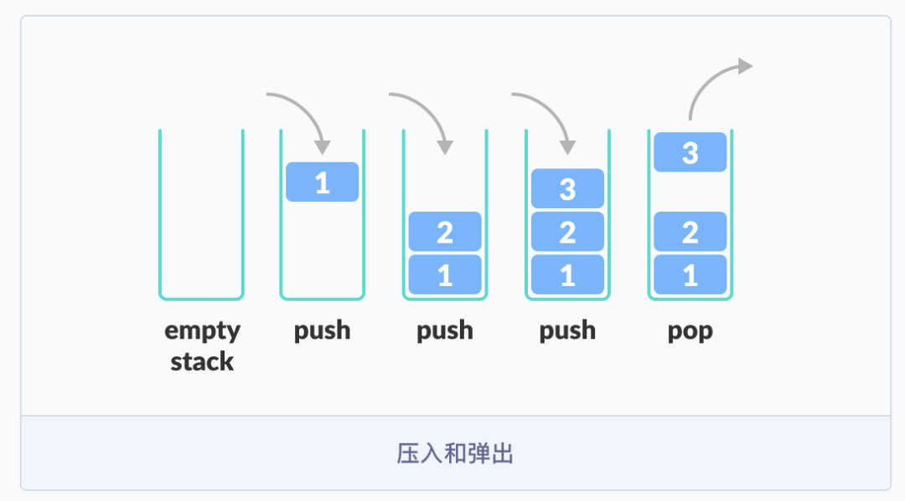
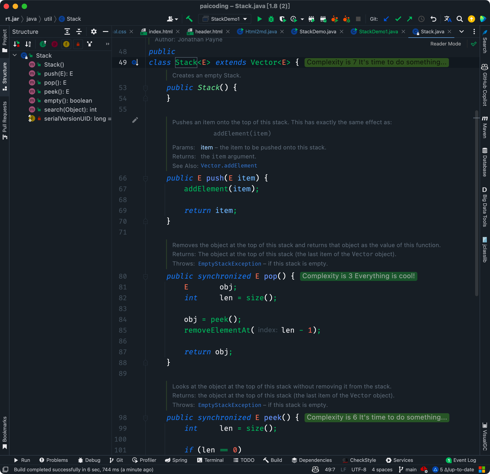
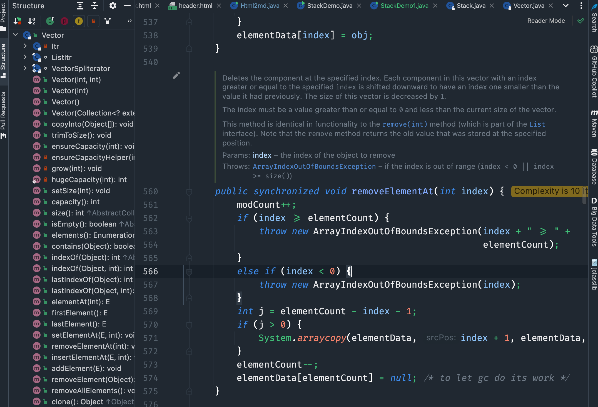

# 集合框架全面解析

以下是集合框架的结构图


Java 集合框架可以分为两条大的支线：

①、Collection，主要由 List、Set、Queue 组成：

- List 代表**有序**、**可重复**的集合，强调的是**位置**（我有索引，我想插哪就插哪,典型代表就是封装了动态数组的 [ArrayList](https://javabetter.cn/collection/arraylist.html) 和封装了链表的 [LinkedList](https://javabetter.cn/collection/linkedlist.html)；
- Set 代表**无序**、**不可重复**的集合，典型代表就是 HashSet 和 TreeSet；
- Queue 代表队列，强调的是**协议**（我有规则，必须先来后到）,典型代表就是双端队列 [ArrayDeque](https://javabetter.cn/collection/arraydeque.html)，以及优先级队列 [PriorityQueue](https://javabetter.cn/collection/PriorityQueue.html)。

| **维度**     | **List**           | **Set**              | **Queue**        |
| ------------ | ------------------ | -------------------- | ---------------- |
| **重复性**   | 允许重复           | **严禁重复**         | 允许重复         |
| **顺序性**   | 有序（索引顺序）   | 无序（TreeSet 除外） | 有序（先进先出） |
| **访问方式** | 随机访问（第几个） | 只能判断“有没有”     | 只能操作队头队尾 |
| **生活类比** | 影集、书架         | 朋友圈的点赞名单     | 食堂打饭排队     |

②、Map，代表键值对的集合，典型代表就是 [HashMap](https://javabetter.cn/collection/hashmap.html)。


再详细一些:

**① Collection（单元素集合的统称）**

它是 `List`、`Set` 和 `Queue` 的父接口。它定义了单体容器最基本的规矩：能加元素（`add`）、能删元素（`remove`）、能看大小（`size`）。

- **List**：有序、可重复（像排队）。
- **Set**：无序、不重复（像朋友圈的点赞列表，一个人只能点一次）。
- **Queue**：先进先出（像排队买票）。

**② Map（键值对集合）**

Map 和 Collection **完全没有继承关系**。它存的是 `Key-Value`（键值对）。

- **核心逻辑**：通过 `Key`（钥匙）去找 `Value`（宝箱里的东西）。
- **特点**：`Key` 必须是唯一的，就像身份证号。
- **生活类比**：字典。你查“Apple”（Key），得到它的解释“苹果”（Value）。

**③ LinkedList（一种具体的物理结构）**

它是 `Collection` 家族下 `List` 接口的实现类。它的名字揭示了它的物理本质：**链表**。

- **存储方式**：数据在内存里是乱放的，每个元素都牵着下一个人的手。
- **特长**：在头尾增加、删除元素极快（$O(1)$）。
- **对比 ArrayList**：`ArrayList` 底层是数组（排排坐），找人快但插队慢；`LinkedList`（手拉手）插队快但找人慢。


核心区别:

| **特性**     | **Collection**         | **Map**                  | **LinkedList**            |
| ------------ | ---------------------- | ------------------------ | ------------------------- |
| **本质身份** | 接口（一种标准/身份）  | 接口（另一种标准/身份）  | 类（具体的工具/实现）     |
| **存储内容** | 单个对象 (Element)     | 键值对 (Key-Value)       | 单个对象 (Element)        |
| **层级关系** | 顶层根接口             | 顶层根接口               | 实现 List 接口的具体类    |
| **如何存取** | `add(E e)`             | `put(K k, V v)`          | `add(E e)` / `offer(E e)` |
| **比喻**     | 一个**大箩筐**，装苹果 | 一个**寄存柜**，凭票领包 | 一串**手拉手的孩子**      |


List家族:

| **实现类**     | **底层结构** | **核心超能力**            | **致命弱点**                                    |
| -------------- | ------------ | ------------------------- | ----------------------------------------------- |
| **ArrayList**  | 动态数组     | **随机访问 ($O(1)$)**     | 中间插入/删除很慢                               |
| **LinkedList** | 双向链表     | **头尾操作极快 ($O(1)$)** | 随机访问很慢（假索引）                          |
| **Vector**     | 线程安全数组 | **多线程安全**            | 性能低（已经过时，现在用 CopyOnWriteArrayList） |

## 01、List

List 的特点是存取有序，可以存放重复的元素，可以用下标对元素进行操作(`LinkedList`的索引有些特殊 我们会在`LinkedList`章节特别讨论)。


**1.List 的本质：一个“有序序列”的准则**

在 Java 中，`List` 是一个**接口（Interface）**。它告诉所有的实现者（比如 `ArrayList`、`LinkedList`）：如果你想自称是一个 List，你必须保证以下三点：

1. **有序性（Ordered）**：你必须记住元素存进去的顺序。先存 A 后存 B，拿出来的时候也必须是 A 在前 B 在后。
2. **允许重复（Duplicates Allowed）**：你不能拒绝用户存入两个完全一样的东西。
3. **支持索引（Index-based）**：你必须允许用户通过“数字下标”来操作数据（即使你像 `LinkedList` 那样是靠遍历模拟出来的）。


**2.形象理解：接口 vs. 实现**

我们可以用**“插座标准”**来理解：

- **`List` 接口**：就是墙上的**插座标准**（比如三孔插座）。它规定了孔的大小、位置和电压。
- **`ArrayList` / `LinkedList`**：就是各种**电器插头**。
  - `ArrayList` 是个大功率电钻（随机读取飞快）。
  - `LinkedList` 是个多功能排插（中间插入拨出很方便）。

只要它们都符合 `List` 的标准，你（用户）就可以拿着任何一个插头插进你的代码逻辑里。


**3.为什么我们要用 List 接口来声明变量？**

你经常会看到这种写法： `List<String> data = new ArrayList<>();`

**为什么不直接写 `ArrayList<String> data = ...` 呢？**

这就是为了**“解耦（Decoupling）”**。

- **今天**：你的数据量很小，随机访问多，你用 `ArrayList`。
- **明天**：业务变了，你需要频繁在数据流中间插拔，想换成 `LinkedList`。
- **优势**：如果你之前是用 `List` 声明的，你只需要改 `new` 后面的那个词，剩下的成千上万行代码**一个字都不用改**。因为它们都遵循 `List` 的准则。

再补充一下List的情况

| **实现类**     | **底层结构** | **核心超能力**            | **致命弱点**                                    |
| -------------- | ------------ | ------------------------- | ----------------------------------------------- |
| **ArrayList**  | 动态数组     | **随机访问 ($O(1)$)**     | 中间插入/删除很慢                               |
| **LinkedList** | 双向链表     | **头尾操作极快 ($O(1)$)** | 随机访问很慢（假索引）                          |
| **Vector**     | 线程安全数组 | **多线程安全**            | 性能低（已经过时，现在用 CopyOnWriteArrayList） |


### **1）`ArrayList`**

先来一段 `ArrayList` 的增删改查，学会用。

```java
// 创建一个集合
ArrayList<String> list = new ArrayList<String>();
// 添加元素
list.add("王二");
list.add("沉默");
list.add("陈清扬");

// 遍历集合 for 循环
for (int i = 0; i < list.size(); i++) {
    String s = list.get(i);
    System.out.println(s);
}
// 遍历集合 for each
for (String s : list) {
    System.out.println(s);
}

// 删除元素
list.remove(1);
// 遍历集合
for (String s : list) {
    System.out.println(s);
}

// 修改元素
list.set(1, "王二狗");
// 遍历集合
for (String s : list) {
    System.out.println(s);
}
```

简单介绍一下 ArrayList 的特征，[后面还会详细讲](https://javabetter.cn/collection/arraylist.html)。

- ArrayList 是由数组实现的，支持随机存取，也就是可以通过下标直接存取元素；
- 从尾部插入和删除元素会比较快捷，从中间插入和删除元素会比较低效，因为涉及到数组元素的复制和移动；
- 如果内部数组的容量不足时会自动扩容，因此当元素非常庞大的时候，效率会比较低。


### **2）LinkedList**

同样先来一段 `LinkedList` 的增删改查，和 `ArrayList` 几乎没什么差别。

```java
// 创建一个集合
LinkedList<String> list = new LinkedList<String>();
// 添加元素
list.add("王二");
list.add("沉默");
list.add("陈清扬");

// 遍历集合 for 循环
for (int i = 0; i < list.size(); i++) {
    String s = list.get(i);
    System.out.println(s);
}
// 遍历集合 for each
for (String s : list) {
    System.out.println(s);
}

// 删除元素
list.remove(1);
// 遍历集合
for (String s : list) {
    System.out.println(s);
}

// 修改元素
list.set(1, "王二狗");
// 遍历集合
for (String s : list) {
    System.out.println(s);
}
```

不过，LinkedList 和 ArrayList 仍然有较大的不同，[后面也会详细地讲](https://javabetter.cn/collection/linkedlist.html)。

- LinkedList 是由双向链表实现的，不支持随机存取，只能从一端开始遍历，直到找到需要的元素后返回；
- 任意位置插入和删除元素都很方便，因为只需要改变前一个节点和后一个节点的引用即可，不像 ArrayList 那样需要复制和移动数组元素；
- 因为每个元素都存储了前一个和后一个节点的引用，所以相对来说，占用的内存空间会比 ArrayList 多一些。


### **3）Vector 和 Stack**

List 的实现类还有一个 Vector，是一个元老级的类，比 `ArrayList` 出现得更早。`ArrayList` 和 Vector 非常相似，只不过 Vector 是线程安全的，像 get、set、add 这些方法都加了 `synchronized` 关键字，就导致执行效率会比较低，所以现在已经很少用了。

我就不写太多代码了，只看一下 add 方法的源码就明白了。

```java
public synchronized boolean add(E e) {
    elementData[elementCount++] = e;
    return true;
}
```

这种加了同步方法的类，注定会被淘汰掉，就像[StringBuilder 取代 StringBuffer](https://javabetter.cn/string/builder-buffer.html)那样。JDK 源码也说了：

> 如果不需要线程安全，建议使用 `ArrayList` 代替 Vector。


Stack 是 Vector 的一个子类，本质上也是由动态数组实现的，只不过还实现了先进后出的功能（在 get、set、add 方法的基础上追加了 pop「返回并移除栈顶的元素」、peek「只返回栈顶元素」等方法），所以叫栈。

下面是这两个方法的源码，增删改查我就不写了，和 `ArrayList` 和 `LinkedList` 几乎一样。

```java
public synchronized E pop() {
    E       obj;
    int     len = size();

    obj = peek();
    removeElementAt(len - 1);

    return obj;
}

public synchronized E peek() {
    int     len = size();

    if (len == 0)
        throw new EmptyStackException();
    return elementAt(len - 1);
}
```

不过，由于 Stack 执行效率比较低（方法上同样加了 synchronized 关键字），就被双端队列 `ArrayDeque` 取代了（下面会介绍）。


## 02、Set

Set 的特点是存取无序，不可以存放重复的元素，不可以用下标对元素进行操作，和 List 有很多不同。

### 1）`HashSet`

`HashSet` 其实是由 `HashMap` 实现的，HashMap会在下文提及,具体源码也会在之后章节展示,只不过值由一个固定的 Object 对象填充，而键用于操作。来简单看一下它的源码。

```java
public class HashSet<E>
    extends AbstractSet<E>
    implements Set<E>, Cloneable, java.io.Serializable
{
    private transient HashMap<E,Object> map;

    // Dummy value to associate with an Object in the backing Map
    private static final Object PRESENT = new Object();

    public HashSet() {
        map = new HashMap<>();
    }

    public boolean add(E e) {
        return map.put(e, PRESENT)==null;
    }

    public boolean remove(Object o) {
        return map.remove(o)==PRESENT;
    }
}
```

实际开发中，HashSet 并不常用，比如，如果我们需要按照顺序存储一组元素，那么 ArrayList 和 LinkedList 可能更适合；如果我们需要存储键值对并根据键进行查找，那么 HashMap 可能更适合。


> `HashSet` 在底层“偷懒”了——它其实就是一套剥掉了“值（Value）”的 `HashMap`
>
> 它的存在主要为了解决两个核心痛点：**去重（Uniqueness）** 和 **极速查找（Performance）**。
>
> ### 1. 它是最快的“查重器”
>
> 想象你有一个拥有 100 万个用户 ID 的列表，现在又来了一个新 ID，你要判断它是否已经存在。
>
> - **用 `ArrayList`**：你得从头到尾数一遍。如果运气不好，你要对比 100 万次。在算法上这叫 $O(n)$。
> - **用 `HashSet`**：它通过 Hash 算法直接计算出这个 ID 应该在哪个“坑”里，然后直接跳过去看一眼。不管里面有 10 个还是 100 万个元素，它都只需要“看一眼”。在算法上这叫 $O(1)$。
>
> **结论**：如果你不在乎顺序，只在乎**“有没有”**，`HashSet` 的速度能把 `ArrayList` 甩出几条街。
>
> 
>
> ### 2. 它定义了“集合”的数学本质
>
> 在数学中，**集合（Set）** 的定义就是：**无序且不重复**。
>
> - **`ArrayList` 是“排队”**：谁先来谁站前面，双胞胎（重复元素）可以站在一起。
> - **`HashSet` 是“圈地”**：这个圈子里，同样的元素只能占一个位置。
>
> 当你需要自动过滤掉重复数据时（比如：统计一篇文章里出现了多少个**不同的**单词），用 `HashSet` 只需要一行 `set.add(word)`，它会自动帮你把重复的踢出去。
>
> 
>
> ### 3. 底层揭秘：它其实是 `HashMap` 的“单身版”
>
> ```java
> public class HashSet<E> {
>     // 内部其实藏着一个 HashMap
>     private transient HashMap<E, Object> map;
> 
>     // 所有的 Value 都指向这个没意义的虚设对象
>     private static final Object PRESENT = new Object();
> 
>     public boolean add(E e) {
>         // 所谓的 add，其实就是把元素当做 Key 存进 Map 里
>         return map.put(e, PRESENT) == null;
>     }
> }
> ```
>
> **既然 `HashMap` 已经能干这活了，为什么要单独封装一个 `HashSet`？** 这就是为了**语义化**。如果你只需要存一堆不重复的“名字”，用 `HashMap<String, Object>` 会让代码读起来很别扭——那个 `Object` 到底是干啥的？而用 `HashSet<String>`，别人一眼就能看懂你的意图：**你只想存一堆唯一的字符串。**


来一段增删改查体验一下：

```java
// 创建一个新的HashSet
HashSet<String> set = new HashSet<>();

// 添加元素
set.add("沉默");
set.add("王二");
set.add("陈清扬");

// 输出HashSet的元素个数
System.out.println("HashSet size: " + set.size()); // output: 3

// 判断元素是否存在于HashSet中
boolean containsWanger = set.contains("王二");
System.out.println("Does set contain '王二'? " + containsWanger); // output: true

// 删除元素
boolean removeWanger = set.remove("王二");
System.out.println("Removed '王二'? " + removeWanger); // output: true

// 修改元素，需要先删除后添加
boolean removeChenmo = set.remove("沉默");
boolean addBuChenmo = set.add("不沉默");
System.out.println("Modified set? " + (removeChenmo && addBuChenmo)); // output: true

// 输出修改后的HashSet
System.out.println("HashSet after modification: " + set); // output: [陈清扬, 不沉默]
```

HashSet 主要用于去重，比如，我们需要统计一篇文章中有多少个不重复的单词，就可以使用 HashSet 来实现。

```java
// 创建一个 HashSet 对象
HashSet<String> set = new HashSet<>();

// 添加元素
set.add("沉默");
set.add("王二");
set.add("陈清扬");
set.add("沉默");

// 输出 HashSet 的元素个数
System.out.println("HashSet size: " + set.size()); // output: 3

// 遍历 HashSet
for (String s : set) {
    System.out.println(s);
}
```

从上面的例子可以看得出，HashSet 会自动去重，因为它是用 HashMap 实现的，[HashMap](https://javabetter.cn/collection/hashmap.html) 的键是唯一的（哈希值），相同键的值会覆盖掉原来的值，于是第二次 `set.add("沉默")` 的时候就覆盖了第一次的 `set.add("沉默")`。

我在《[LeetCode 的第 15 题：三数之和](https://paicoding.com/column/7/15)》的时候用到了 HashSet，大家可以通过链接去查看一下。


### 2）LinkedHashSet

LinkedHashSet 虽然继承自 HashSet，其实是由 [LinkedHashMap](https://javabetter.cn/collection/linkedhashmap.html) 实现的。

这是 LinkedHashSet 的无参构造方法

```
public LinkedHashSet() {
    super(16, .75f, true);
}
```

> `16` —— 初始容量 (Initial Capacity)
>
> `.75f` —— 加载因子 (Load Factor)
>
> **计算公式**：`初始容量 × 加载因子 = 扩容阈值`。
>
> 在这里就是：`16 × 0.75 = 12`。
>
> **逻辑**：当你存入第 **13** 个元素时，`LinkedHashSet` 就会觉得自己快满了（为了防止拥挤导致碰撞），它会立刻触发“扩容”，把车位翻倍（从 16 变成 32），然后把旧车全部重新停一遍。

[super](https://javabetter.cn/oo/this-super.html) 的意思是它将调用父类的 HashSet 的一个有参构造方法：

```java
HashSet(int initialCapacity, float loadFactor, boolean dummy) {
    map = new LinkedHashMap<>(initialCapacity, loadFactor);
}
```

看到 [LinkedHashMap](https://javabetter.cn/collection/linkedhashmap.html) 了吧，这个我们后面会去讲。

好吧，来看一段 LinkedHashSet 的增删改查吧。

```java
LinkedHashSet<String> set = new LinkedHashSet<>();

// 添加元素
set.add("沉默");
set.add("王二");
set.add("陈清扬");

// 删除元素
set.remove("王二");

// 修改元素
set.remove("沉默");
set.add("沉默的力量");

// 查找元素
boolean hasChenQingYang = set.contains("陈清扬");
System.out.println("set包含陈清扬吗？" + hasChenQingYang);
```

在以上代码中，我们首先创建了一个 LinkedHashSet 对象，然后使用 add 方法依次添加了三个元素：沉默、王二和陈清扬。接着，我们使用 remove 方法删除了王二这个元素，并使用 remove 和 add 方法修改了沉默这个元素。最后，我们使用 contains 方法查找了陈清扬这个元素是否存在于 set 中，并打印了结果。

LinkedHashSet 是一种基于哈希表实现的 Set 接口，它继承自 HashSet，并且使用链表维护了元素的插入顺序。因此，它既具有 HashSet 的快速查找、插入和删除操作的优点，又可以维护元素的插入顺序。


#### 3）TreeSet

TreeSet 是由 [TreeMap（后面会讲）](https://javabetter.cn/collection/treemap.html) 实现的，只不过同样操作的键位，值由一个固定的 Object 对象填充。

与 TreeMap 相似，TreeSet 是一种基于红黑树实现的有序集合，它实现了 SortedSet 接口，可以自动对集合中的元素进行排序。按照键的自然顺序或指定的比较器顺序进行排序。

```java
// 创建一个 TreeSet 对象
TreeSet<String> set = new TreeSet<>();

// 添加元素
set.add("沉默");
set.add("王二");
set.add("陈清扬");
System.out.println(set); // 输出 [沉默, 王二, 陈清扬]

// 删除元素
set.remove("王二");
System.out.println(set); // 输出 [沉默, 陈清扬]

// 修改元素：TreeSet 中的元素不支持直接修改，需要先删除再添加
set.remove("陈清扬");
set.add("陈青阳");
System.out.println(set); // 输出 [沉默, 陈青阳]

// 查找元素
System.out.println(set.contains("沉默")); // 输出 true
System.out.println(set.contains("王二")); // 输出 false
```

需要注意的是，`TreeSet` 不允许插入 null 元素，否则会抛出 `NullPointerException` 异常。

总体上来说，Set 集合不是关注的重点，因为底层都是由 Map 实现的，为什么要用 Map 实现?

**答 : 因为 Map 的键不允许重复、无序**


### 03、Queue

Queue，也就是队列，通常遵循先进先出（FIFO）的原则，新元素插入到队列的尾部，访问元素返回队列的头部。

#### 1）`ArrayDeque`

从名字上可以看得出，`ArrayDeque` 是一个基于数组实现的双端队列，为了满足可以同时在数组两端插入或删除元素的需求，数组必须是循环的，也就是说数组的任何一点都可以被看作是起点或者终点。

这是一个包含了 4 个元素的双端队列，和一个包含了 5 个元素的双端队列。


head 指向队首的第一个有效的元素，tail 指向队尾第一个可以插入元素的空位，因为是循环数组，所以 head 不一定从是从 0 开始，tail 也不一定总是比 head 大。

来一段 `ArrayDeque` 的增删改查吧。

```java
// 创建一个ArrayDeque
ArrayDeque<String> deque = new ArrayDeque<>();

// 添加元素
deque.add("沉默");
deque.add("王二");
deque.add("陈清扬");

// 删除元素
deque.remove("王二");

// 修改元素
deque.remove("沉默");
deque.add("沉默的力量");

// 查找元素
boolean hasChenQingYang = deque.contains("陈清扬");
System.out.println("deque包含陈清扬吗？" + hasChenQingYang);
```


#### 2）`LinkedList`

`LinkedList` 一般应该归在 List 下，只不过，它也实现了 Deque 接口，可以作为队列来使用。等于说，`LinkedList` 同时实现了 Stack、Queue、`PriorityQueue` 的所有功能。

```java
public class LinkedList<E>
    extends AbstractSequentialList<E>
    implements List<E>, Deque<E>, Cloneable, java.io.Serializable
{}
```

换句话说，`LinkedList` 和 `ArrayDeque` 都是 Java 集合框架中的双向队列（deque），它们都支持在队列的两端进行元素的插入和删除操作。不过，`LinkedList` 和 `ArrayDeque` 在实现上有一些不同：

- 底层实现方式不同：`LinkedList` 是基于链表实现的，而 `ArrayDeque` 是基于数组实现的。
- 随机访问的效率不同：由于底层实现方式的不同，`LinkedList` 对于随机访问的效率较低，时间复杂度为 O(n)，而 `ArrayDeque` 可以通过下标随机访问元素，时间复杂度为 O(1)。
- 迭代器的效率不同：`LinkedList` 对于迭代器的效率比较低，因为需要通过链表进行遍历，时间复杂度为 O(n)，而 `ArrayDeque` 的迭代器效率比较高，因为可以直接访问数组中的元素，时间复杂度为 O(1)。
- 内存占用不同：由于 `LinkedList` 是基于链表实现的，它在存储元素时需要额外的空间来存储链表节点，因此内存占用相对较高，而 `ArrayDeque` 是基于数组实现的，内存占用相对较低。

因此，在选择使用 `LinkedList` 还是 `ArrayDeque` 时，需要根据具体的业务场景和需求来选择。如果需要在双向队列的两端进行频繁的插入和删除操作，并且需要随机访问元素，可以考虑使用 `ArrayDeque`；如果需要在队列中间进行频繁的插入和删除操作，可以考虑使用 `LinkedList`。

来一段 `LinkedList` 作为队列时候的增删改查吧，注意和它作为 List 的时候有很大的不同。

```JAVA
// 创建一个 LinkedList 对象
LinkedList<String> queue = new LinkedList<>();

// 添加元素
queue.offer("沉默");
queue.offer("王二");
queue.offer("陈清扬");
System.out.println(queue); // 输出 [沉默, 王二, 陈清扬]

// 删除元素
queue.poll();
System.out.println(queue); // 输出 [王二, 陈清扬]

// 修改元素：LinkedList 中的元素不支持直接修改，需要先删除再添加
String first = queue.poll();
queue.offer("王大二");
System.out.println(queue); // 输出 [陈清扬, 王大二]

// 查找元素：LinkedList 中的元素可以使用 get() 方法进行查找
System.out.println(queue.get(0)); // 输出 陈清扬
System.out.println(queue.contains("沉默")); // 输出 false

// 查找元素：使用迭代器的方式查找陈清扬
// 使用迭代器依次遍历元素并查找
Iterator<String> iterator = queue.iterator();
while (iterator.hasNext()) {
    String element = iterator.next();
    if (element.equals("陈清扬")) {
        System.out.println("找到了：" + element);
        break;
    }
}
```

在使用 `LinkedList` 作为队列时，可以使用 offer() 方法将元素添加到队列的末尾，使用 poll() 方法从队列的头部删除元素。另外，由于 `LinkedList` 是链表结构，不支持随机访问元素，因此不能使用下标访问元素，需要使用迭代器或者 poll() 方法依次遍历元素。


| **操作类型**       | **抛出异常 (激进派)** | **返回特殊值 (温柔派)** | **失败原因 (通常情况)** |
| ------------------ | --------------------- | ----------------------- | ----------------------- |
| **插入 (Insert)**  | **`add(e)`**          | **`offer(e)`**          | 队列已满 (容量限制)     |
| **移除 (Remove)**  | **`remove()`**        | **`poll()`**            | 队列为空 (没东西可拿)   |
| **检查 (Examine)** | **`element()`**       | **`peek()`**            | 队列为空 (没东西可看)   |


#### 3）`PriorityQueue`

`PriorityQueue` 是一种优先级队列，它的出队顺序与元素的优先级有关，执行 remove 或者 poll 方法，返回的总是优先级最高的元素。

```java
// 创建一个 PriorityQueue 对象
PriorityQueue<String> queue = new PriorityQueue<>();

// 添加元素
queue.offer("沉默");
queue.offer("王二");
queue.offer("陈清扬");
System.out.println(queue); // 输出 [沉默, 王二, 陈清扬]

// 删除元素
queue.poll();
System.out.println(queue); // 输出 [王二, 陈清扬]

// 修改元素：PriorityQueue 不支持直接修改元素，需要先删除再添加
String first = queue.poll();
queue.offer("张三");
System.out.println(queue); // 输出 [张三, 陈清扬]

// 查找元素：PriorityQueue 不支持随机访问元素，只能访问队首元素
System.out.println(queue.peek()); // 输出 张三
System.out.println(queue.contains("陈清扬")); // 输出 true

// 通过 for 循环的方式查找陈清扬
for (String element : queue) {
    if (element.equals("陈清扬")) {
        System.out.println("找到了：" + element);
        break;
    }
}
```

要想有优先级，元素就需要实现 [Comparable 接口或者 Comparator 接口](https://javabetter.cn/basic-extra-meal/comparable-omparator.html)（我们后面会讲）。

这里先来一段通过实现 Comparator 接口按照年龄姓名排序的优先级队列吧。

```java
import java.util.Comparator;
import java.util.PriorityQueue;

class Student {
    private String name;
    private int chineseScore;
    private int mathScore;

    public Student(String name, int chineseScore, int mathScore) {
        this.name = name;
        this.chineseScore = chineseScore;
        this.mathScore = mathScore;
    }

    public String getName() {
        return name;
    }

    public int getChineseScore() {
        return chineseScore;
    }

    public int getMathScore() {
        return mathScore;
    }

    @Override
    public String toString() {
        return "Student{" +
                "name='" + name + '\'' +
                ", 总成绩=" + (chineseScore + mathScore) +
                '}';
    }
}

class StudentComparator implements Comparator<Student> {
    @Override
    public int compare(Student s1, Student s2) {
        // 比较总成绩
        return Integer.compare(s2.getChineseScore() + s2.getMathScore(),
                s1.getChineseScore() + s1.getMathScore());
    }
}

public class PriorityQueueComparatorExample {

    public static void main(String[] args) {
        // 创建一个按照总成绩排序的优先级队列
        PriorityQueue<Student> queue = new PriorityQueue<>(new StudentComparator());

        // 添加元素
        queue.offer(new Student("王二", 80, 90));
        System.out.println(queue);
        queue.offer(new Student("陈清扬", 95, 95));
        System.out.println(queue);
        queue.offer(new Student("小驼铃", 90, 95));
        System.out.println(queue);
        queue.offer(new Student("沉默", 90, 80));
        while (!queue.isEmpty()) {
            System.out.print(queue.poll() + " ");
        }
    }
}
```

> ### 1.为什么不能直接 `new PriorityQueue<>()`？
>
> 之所以 `String` 和 `Integer` 可以直接 `new PriorityQueue<>()` 而不需要传裁判（Comparator），是因为它们在 Java 内部属于**“自带裁判证书”**的类。**自带规则（Comparable 接口）** `String`、`Integer`、`Double` 等这些内置类，它们的源码里都写着 `implements Comparable`。这意味着它们**天生就知道**怎么和同类比大小。
>
> 而我们的Student是一个白板,所以当queue.offer的时候就会发生:
>
> **`offer` 阶段**：你塞进第一个学生，没问题。塞进第二个学生时，`PriorityQueue` 试图执行 `(Comparable)student2.compareTo(student1)`。
>
> **爆炸**：因为 `Student` 没实现这个接口，强转失败，程序直接 **`ClassCastException`**。
>
> 所以必须在构造函数里塞进一个 **“裁判” (StudentComparator)**
>
> ### 2. 为什么能 `offer(new Student(...))`？
>
> 明明构造函数里传的是 `StudentComparator`，为什么 `offer` 进去的却是 `Student`？
>
> 这里有两个不同的角色，千万不要混淆：
>
> 1. **容器里的“住户” (Elements)**：这是 `queue.offer()` 进去的东西。你的 `queue` 声明为 `PriorityQueue<Student>`，所以它**只能**也**必须**存 `Student` 对象。
> 2. **容器的“管理员” (Comparator)**：这是 `new PriorityQueue<>(...)` 构造函数里传的东西。它不存入队列，它只是站在旁边**看**两个学生，然后告诉队列谁更强。


Student 是一个学生对象，包含姓名、语文成绩和数学成绩。

StudentComparator 实现了 Comparator 接口，对总成绩做了一个排序。

PriorityQueue 是一个优先级队列，参数为 StudentComparator，然后我们添加了 4 个学生对象进去。

来看一下输出结果：

```java
[Student{name='王二', 总成绩=170}]
[Student{name='陈清扬', 总成绩=190}, Student{name='王二', 总成绩=170}]
[Student{name='陈清扬', 总成绩=190}, Student{name='王二', 总成绩=170}, Student{name='小驼铃', 总成绩=185}]
Student{name='陈清扬', 总成绩=190} Student{name='小驼铃', 总成绩=185} Student{name='沉默', 总成绩=170} Student{name='王二', 总成绩=170}
```

我们使用 offer 方法添加元素，最后用 while 循环遍历元素（通过 poll 方法取出元素），从结果可以看得出，[PriorityQueue](https://javabetter.cn/collection/PriorityQueue.html)按照学生的总成绩由高到低进行了排序。


### 04、Map

Map 保存的是键值对，键要求保持唯一性，值可以重复。

#### 1）`HashMap`

`HashMap` 实现了 Map 接口，可以根据键快速地查找对应的值——通过哈希函数将键映射到哈希表中的一个索引位置，从而实现快速访问。[后面会详细聊到](https://javabetter.cn/collection/hashmap.html)。

这里先大致了解一下 `HashMap` 的特点：

- `HashMap` 中的键和值都可以为 null。如果键为 null，则将该键映射到哈希表的第一个位置。
- 可以使用迭代器或者 `forEach` 方法遍历 `HashMap` 中的键值对。
- `HashMap` 有一个初始容量和一个负载因子。初始容量是指哈希表的初始大小，负载因子是指哈希表在扩容之前可以存储的键值对数量与哈希表大小的比率。默认的初始容量是 16，负载因子是 0.75。


来个简单的增删改查吧:

```java
// 创建一个 HashMap 对象
HashMap<String, String> hashMap = new HashMap<>();

// 添加键值对
hashMap.put("沉默", "cenzhong");
hashMap.put("王二", "wanger");
hashMap.put("陈清扬", "chenqingyang");

// 获取指定键的值
String value1 = hashMap.get("沉默");
System.out.println("沉默对应的值为：" + value1);

// 修改键对应的值
hashMap.put("沉默", "chenmo");
String value2 = hashMap.get("沉默");
System.out.println("修改后沉默对应的值为：" + value2);

// 删除指定键的键值对
hashMap.remove("王二");

// 遍历 HashMap
for (String key : hashMap.keySet()) {
    String value = hashMap.get(key);
    System.out.println(key + " 对应的值为：" + value);
}
```


#### 2）`LinkedHashMap`

`HashMap` 已经非常强大了，但它是**无序**的。如果我们需要一个**有序**的 Map，就要用到 [`LinkedHashMap`](https://javabetter.cn/collection/linkedhashmap.html)。`LinkedHashMap` 是 `HashMap` 的子类，它使用链表来记录插入/访问元素的顺序。

`LinkedHashMap` 可以看作是 `HashMap` + `LinkedList` 的合体，它使用了哈希表来存储数据，又用了双向链表来维持顺序。

来一个简单的例子:

```java
// 创建一个 LinkedHashMap，插入的键值对为 沉默 王二 陈清扬
LinkedHashMap<String, String> linkedHashMap = new LinkedHashMap<>();
linkedHashMap.put("沉默", "cenzhong");
linkedHashMap.put("王二", "wanger");
linkedHashMap.put("陈清扬", "chenqingyang");

// 遍历 LinkedHashMap
for (String key : linkedHashMap.keySet()) {
    String value = linkedHashMap.get(key);
    System.out.println(key + " 对应的值为：" + value);
}
```

来看输出结果：

```
沉默 对应的值为：cenzhong
王二 对应的值为：wanger
陈清扬 对应的值为：chenqingyang
```

从结果中可以看得出来，LinkedHashMap 维持了键值对的插入顺序，对吧？为了和 LinkedHashMap 做对比，我们用同样的数据试验一下 HashMap。

```java
// 创建一个HashMap，插入的键值对为 沉默 王二 陈清扬
HashMap<String, String> hashMap = new HashMap<>();
hashMap.put("沉默", "cenzhong");
hashMap.put("王二", "wanger");
hashMap.put("陈清扬", "chenqingyang");

// 遍历 HashMap
for (String key : hashMap.keySet()) {
    String value = hashMap.get(key);
    System.out.println(key + " 对应的值为：" + value);
}
```

来看输出结果：

```
沉默 对应的值为：cenzhong
陈清扬 对应的值为：chenqingyang
王二 对应的值为：wanger
```

HashMap 没有维持键值对的插入顺序


> ### 1. HashMap：只管快，不管序
>
> `HashMap` 的核心目标是**极致的查找速度**。为了达到 $O(1)$ 的速度，它采用了“哈希表”结构。
>
> - **它的逻辑**：当你 `put("沉默", "...")` 时，它会给“沉默”算一卦（计算 **HashCode**），根据算出来的结果把它扔到数组的一个坑位（Bucket）里。
> - **为什么不保持顺序**：坑位的位置完全取决于哈希值和数组长度的运算结果。当你遍历时，它是按照**数组下标**从头往后扫的。
> - **形象类比**：就像去电影院找座位，大家不是按领票的先后顺序坐，而是票上写着几排几号（哈希值决定位置），你就得坐哪。你进场的时候是一个个进的，但坐下后完全是散开的。
>
> ### 2. LinkedHashMap：在哈希表上牵了根绳子
>
> `LinkedHashMap` 继承自 `HashMap`，它在 `HashMap` 的基础上额外维护了一个**双向链表**。
>
> - **它的逻辑**：它依然像 `HashMap` 一样把数据存进哈希表里，但每当新来一个元素，它都会让这个新元素和上一个元素“手拉手”。
> - **为什么能保持顺序**：当你遍历 `LinkedHashMap` 时，它并不去扫那个乱七八糟的数组下标，而是**顺着这根“手拉手”的绳子（链表）**挨个往下走。
> - **形象类比**：这就像在电影院里，大家虽然坐得乱七八糟，但每个人手里都牵着一根红线，红线的另一头连着比你晚一分钟进场的人。只要拉住第一根线，就能按进场顺序找到所有人


#### 3）`TreeMap`

[TreeMap](https://javabetter.cn/collection/treemap.html) 实现了 SortedMap 接口，可以自动将键按照自然顺序或指定的比较器顺序排序，并保证其元素的顺序。内部使用红黑树来实现键的排序和查找。

同样来一个增删改查的 demo：

```java
// 创建一个 TreeMap 对象
Map<String, String> treeMap = new TreeMap<>();

// 向 TreeMap 中添加键值对
treeMap.put("沉默", "cenzhong");
treeMap.put("王二", "wanger");
treeMap.put("陈清扬", "chenqingyang");

// 查找键值对
String name = "沉默";
if (treeMap.containsKey(name)) {
    System.out.println("找到了 " + name + ": " + treeMap.get(name));
} else {
    System.out.println("没有找到 " + name);
}

// 修改键值对
name = "王二";
if (treeMap.containsKey(name)) {
    System.out.println("修改前的 " + name + ": " + treeMap.get(name));
    treeMap.put(name, "newWanger");
    System.out.println("修改后的 " + name + ": " + treeMap.get(name));
} else {
    System.out.println("没有找到 " + name);
}

// 删除键值对
name = "陈清扬";
if (treeMap.containsKey(name)) {
    System.out.println("删除前的 " + name + ": " + treeMap.get(name));
    treeMap.remove(name);
    System.out.println("删除后的 " + name + ": " + treeMap.get(name));
} else {
    System.out.println("没有找到 " + name);
}

// 遍历 TreeMap
for (Map.Entry<String, String> entry : treeMap.entrySet()) {
    System.out.println(entry.getKey() + ": " + entry.getValue());
}
```

与 HashMap 不同的是，TreeMap 会按照键的顺序来进行排序。

```java
// 创建一个 TreeMap 对象
Map<String, String> treeMap = new TreeMap<>();

// 向 TreeMap 中添加键值对
treeMap.put("c", "cat");
treeMap.put("a", "apple");
treeMap.put("b", "banana");

// 遍历 TreeMap
for (Map.Entry<String, String> entry : treeMap.entrySet()) {
    System.out.println(entry.getKey() + ": " + entry.getValue());
}
```

来看输出结果：


```
a: apple
b: banana
c: cat
```

默认情况下，已经按照键的自然顺序排过了。

> 如果说 `HashMap` 是个**乱序派**，`LinkedHashMap` 是个**守序派**(按照输入顺序)，那么 **`TreeMap` 就是个彻底的“完美主义者”：它不看你什么时候进来，它只看你“本身的大小”,哪怕是乱序输入C D A会按照 A C D来整理,而LinkedHashMap则是怎么输入 怎么输出,他会保持CDA ,而 `HashMap`的“乱序”完全是为了极致的性能，而它表现出来的“随机感”其实是数学哈希函数的结果**


# `ArrayList`(扩容机制)

`ArrayList` 可以称得上是集合框架方面最常用的类了，可以和 `HashMap` 一较高下。

从名字就可以看得出来，`ArrayList` 实现了 List 接口，并且是基于数组实现的。

数组的大小是固定的，一旦创建的时候指定了大小，就不能再调整了。也就是说，如果数组满了，就不能再添加任何元素了。`ArrayList` 在数组的基础上实现了**自动扩容**，并且提供了比数组更丰富的预定义方法（各种增删改查），非常灵活。

Java 这门编程语言和别的编程语言，比如说 C语言的不同之处就在这里，如果是 C语言的话，你就必须得动手实现自己的 ArrayList，原生的库函数里面是没有的。


## 01、创建 `ArrayList`

创建一个`ArrayList`

```java
ArrayList<String> alist = new ArrayList<String>();
```

可以通过上面的语句来创建一个字符串类型的 ArrayList（通过尖括号来限定 ArrayList 中元素的类型，如果尝试添加其他类型的元素，将会产生编译错误），更简化的写法如下：

```java
List<String> alist = new ArrayList<>();
```

由于 `ArrayList` 实现了 List 接口，所以 `alist` 变量的类型可以是 List 类型；new 关键字声明后的尖括号中可以不再指定元素的类型，因为编译器可以通过前面尖括号中的类型进行智能推断。

此时会调用无参构造方法（见下面的代码）创建一个空的数组，常量DEFAULTCAPACITY_EMPTY_ELEMENTDATA的值为 `{}`。

```java
public ArrayList() {
    this.elementData = DEFAULTCAPACITY_EMPTY_ELEMENTDATA;
}
```

如果非常确定 `ArrayList` 中元素的个数，在创建的时候还可以指定初始大小。

```java
List<String> alist = new ArrayList<>(20);
```

这样做的好处是，可以有效地避免在添加新的元素时进行不必要的扩容。


<span style="color:orange">**面试(京东):ArrayList 的延迟初始化”/“懒加载机制**</span>


虽然我们有一个默认的初始容量,当我们创建了初始的`arrayList`,但其实是不生效的,此时还是`arrayList[空]` 我研究了一下
对于:
`new ArrayList()`	
`new ArrayList(0)`	
这种情况
此时java不会在堆内存里面开辟任何空间,只有第一次调用add()的时候才会分配

当我们执行add后,就会调用grow()


他会比较我们自己设定的长度和默认长度(10) 哪一个更加 MAX,然后进行创建,此时才是真正在堆中有了

这个目的是,我们会有很多`ArrayList`实例,一个大型项目数以万计,如果每一个在出生时就白占 10 个坑位，内存很快就会被填满。

这个在面试里叫做:`ArrayList` 的延迟初始化”/“懒加载机制

> **补充一个场景场：10 个坑位，要塞 1000 个数**
>
> 虽然 `ArrayList` 的“首选增长（preferred growth）”是 1.5 倍，但它绝对不会“死脑筋”。如果一次性要塞进的数据太多（比如调用了 `addAll` 方法），它会立刻启动**“特殊响应机制”**,这个和Stack/Vector如出一辙,后面我们也会讨论到Vector的情况
>
> 
>
> 假设此时 `ArrayList` 目前容量是 10，代码里执行了 `list.addAll(anotherList)`（这个 `anotherList` 有 1000 个元素）。
>
> **Java 的真实逻辑（`Math.max` 策略）：**
>
> 在 `ArrayList` 的扩容源码里（同样调用了类似 `newLength` 的逻辑）：
>
> 1. **计算 `minGrowth`（最小需求）**：你需要 1000 个新位置。
> 2. **计算 `prefGrowth`（首选增长）**：按照 1.5 倍惯例，它只想增加 $10 \times 0.5 = 5$ 个位置。
> 3. **博弈结果**：执行 `Math.max(1000, 5)`。
> 4. **最终决定**：直接增加 1000 个位置！


## 02、向 `ArrayList` 中添加元素

可以通过 `add()` 方法向 `ArrayList` 中添加一个元素。

```java
alist.add("沉默王二");
```

我们来跟一下源码，看看 add 方法到底执行了哪些操作。跟的过程中，我们也可以偷师到 Java 源码的作者（大师级程序员）是如何优雅地写代码的。

我先给个结论，全当抛砖引玉。

```java
堆栈过程图示：
add(element)
└── if (size == elementData.length) // 判断是否需要扩容
    ├── grow(minCapacity) // 扩容
    │   └── newCapacity = oldCapacity + (oldCapacity >> 1) // 计算新的数组容量
    │   └── Arrays.copyOf(elementData, newCapacity) // 创建新的数组
    ├── elementData[size++] = element; // 添加新元素
    └── return true; // 添加成功
```

来具体看一下，先是 `add()` 方法的源码（已添加好详细地注释）

```java
/**
 * 将指定元素添加到 ArrayList 的末尾
 * @param e 要添加的元素
 * @return 添加成功返回 true
 */
public boolean add(E e) {
    ensureCapacityInternal(size + 1);  // 确保 ArrayList 能够容纳新的元素
    elementData[size++] = e; // 在 ArrayList 的末尾添加指定元素
    return true;
}
```

参数 e 为要添加的元素，此时的值为“沉默王二”，size 为 `ArrayList` 的长度，此时为 0。

继续跟下去，来看看 `ensureCapacityInternal()`方法：

```java
/**
 * 确保 ArrayList 能够容纳指定容量的元素
 * @param minCapacity 指定容量的最小值
 */
private void ensureCapacityInternal(int minCapacity) {
    if (elementData == DEFAULTCAPACITY_EMPTY_ELEMENTDATA) { // 如果 elementData 还是默认的空数组
        minCapacity = Math.max(DEFAULT_CAPACITY, minCapacity); // 使用 DEFAULT_CAPACITY 和指定容量的最小值中的较大值
    }

    ensureExplicitCapacity(minCapacity); // 确保容量能够容纳指定容量的元素
}
```

此时：

- 参数 `minCapacity` 为 1（size+1 传过来的）
- `elementData` 为存放 `ArrayList` 元素的底层数组，前面声明 `ArrayList` 的时候讲过了，此时为空 `{}`
- `DEFAULTCAPACITY_EMPTY_ELEMENTDATA` 前面也讲过了，为 `{}`

所以，if 条件此时为 true，if 语句`minCapacity = Math.max(DEFAULT_CAPACITY, minCapacity)`要执行。

`DEFAULT_CAPACITY` 为 10（见下面的代码），所以执行完这行代码后，`minCapacity` 为 10，`Math.max()` 方法的作用是取两个当中最大的那个。

```java
private static final int DEFAULT_CAPACITY = 10;
```

接下来执行 `ensureExplicitCapacity()` 方法，来看一下源码：

```java
/**
 * 检查并确保集合容量足够，如果需要则增加集合容量。
 *
 * @param minCapacity 所需最小容量
 */
private void ensureExplicitCapacity(int minCapacity) {
    // 检查是否超出了数组范围，确保不会溢出
    if (minCapacity - elementData.length > 0)
        // 如果需要增加容量，则调用 grow 方法
        grow(minCapacity);
}
```

此时：

- 参数 minCapacity 为 10
- elementData.length 为 0（数组为空）

所以 10-0>0，if 条件为 true，进入 if 语句执行 `grow()` 方法，来看源码：

> 这部分就到我们讨论过的地方了,本处位旧版本源代码,原理一致不影响阅读

```java
/**
 * 扩容 ArrayList 的方法，确保能够容纳指定容量的元素
 * @param minCapacity 指定容量的最小值
 */
private void grow(int minCapacity) {
    // 检查是否会导致溢出，oldCapacity 为当前数组长度
    int oldCapacity = elementData.length;
    int newCapacity = oldCapacity + (oldCapacity >> 1); // 扩容至原来的1.5倍
    if (newCapacity - minCapacity < 0) // 如果还是小于指定容量的最小值
        newCapacity = minCapacity; // 直接扩容至指定容量的最小值
    if (newCapacity - MAX_ARRAY_SIZE > 0) // 如果超出了数组的最大长度
        newCapacity = hugeCapacity(minCapacity); // 扩容至数组的最大长度
    // 将当前数组复制到一个新数组中，长度为 newCapacity
    elementData = Arrays.copyOf(elementData, newCapacity);
}
```

此时：

- 参数 minCapacity 为 10
- 变量 oldCapacity 为 0

所以 newCapacity 也为 0，于是 `newCapacity - minCapacity` 等于 -10 小于 0，于是第一个 if 条件为 true，执行第一个 if 语句 `newCapacity = minCapacity`，然后 newCapacity 为 10。

紧接着执行 `elementData = Arrays.copyOf(elementData, newCapacity);`，也就是进行数组的第一次扩容，长度为 10。

回到 `add()` 方法：

```java
public boolean add(E e) {
    ensureCapacityInternal(size + 1);
    elementData[size++] = e;
    return true;
}
```

执行 `elementData[size++] = e`。

> 先上车后买票,所以是(0,"王二"),然后才会++ 执行(1,"xx"),(2,"xxx")

此时：

- size 为 0
- e 为 “沉默王二”

所以数组的第一个元素（下标为 0） 被赋值为“沉默王二”，接着返回 true，第一次 add 方法执行完毕。

PS：`add` 过程中会遇到一个令新手感到困惑的右移操作符 `>>`，借这个机会来解释一下。

`ArrayList` 在第一次执行 add 后会扩容为 10，那 `ArrayList` 第二次扩容发生在什么时候呢？

答案是添加第 11 个元素时，大家可以尝试分析一下这个过程

> 其实就是1.5倍,由于右移本质上就是➗2


## 03、右移操作符

“oldCapacity 等于 10，`oldCapacity >> 1` 这个表达式等于多少呢？

“`>>` 是右移运算符，`oldCapacity >> 1` 相当于 oldCapacity 除以 2。”我给三妹解释道，“在计算机内部，都是按照二进制存储的，10 的二进制就是 1010，也就是 `0*2^0 + 1*2^1 + 0*2^2 + 1*2^3`=0+2+0+8=10 。。。。。。”


先从位权的含义说起吧。

平常我们使用的是十进制数，比如说 39，并不是简单的 3 和 9，3 表示的是 `3*10 = 30`，9 表示的是 `9*1 = 9`，和 3 相乘的 10，和 9 相乘的 1，就是**位权**。位数不同，位权就不同，第 1 位是 10 的 0 次方（也就是 `10^0=1`），第 2 位是 10 的 1 次方（`10^1=10`），第 3 位是 10 的 2 次方（`10^2=100`），最右边的是第一位，依次类推。

位权这个概念同样适用于二进制，第 1 位是 2 的 0 次方（也就是 `2^0=1`），第 2 位是 2 的 1 次方（`2^1=2`），第 3 位是 2 的 2 次方（`2^2=4`），第 4 位是 2 的 3 次方（`2^3=8`）。

十进制的情况下，10 是基数，二进制的情况下，2 是基数。

10 在十进制的表示法是 `0*10^0+1*10^1`=0+10=10。

10 的二进制数是 1010，也就是 `0*2^0 + 1*2^1 + 0*2^2 + 1*2^3`=0+2+0+8=10。

然后是**移位运算**，移位分为左移和右移，在 Java 中，左移的运算符是 `<<`，右移的运算符 `>>`。

拿 `oldCapacity >> 1` 来说吧，`>>` 左边的是被移位的值，此时是 10，也就是二进制 `1010`；`>>` 右边的是要移位的位数，此时是 1。

1010 向右移一位就是 101，空出来的最高位此时要补 0，也就是 0101。

“你可能会问那为什么不补 1 呢？

“因为是算术右移，并且是正数，所以最高位补 0；如果表示的是负数，就需要补 1。”我慢吞吞地回答道，“0101 的十进制就刚好是 `1*2^0 + 0*2^1 + 1*2^2 + 0*2^3`=1+0+4+0=5，如果多移几个数来找规律的话，就会发现，右移 1 位是原来的 1/2，右移 2 位是原来的 1/4，诸如此类。”

也就是说，`ArrayList` 的大小会扩容为原来的大小+原来大小/2，也就是 1.5 倍。


你可以通过在 `ArrayList` 中添加第 11 个元素来 debug 验证一下。


## 04、向 `ArrayList` 的指定位置添加元素

除了 `add(E e)` 方法，还可以通过 `add(int index, E element)` 方法把元素添加到 `ArrayList` 的指定位置：

```java
alist.add(0, "沉默王三");
```

`add(int index, E element)` 方法的源码如下：

```java
/**
 * 在指定位置插入一个元素。
 *
 * @param index   要插入元素的位置
 * @param element 要插入的元素
 * @throws IndexOutOfBoundsException 如果索引超出范围，则抛出此异常
 */
public void add(int index, E element) {
    rangeCheckForAdd(index); // 检查索引是否越界

    ensureCapacityInternal(size + 1);  // 确保容量足够，如果需要扩容就扩容
    System.arraycopy(elementData, index, elementData, index + 1,
            size - index); // 将 index 及其后面的元素向后移动一位
    elementData[index] = element; // 将元素插入到指定位置
    size++; // 元素个数加一
}
```

`add(int index, E element)`方法会调用到一个非常重要的[本地方法](https://javabetter.cn/oo/native-method.html) `System.arraycopy()`，它会对数组进行复制（要插入位置上的元素往后复制）。

来细品一下。

这是 `arraycopy`() 的语法：

```java
System.arraycopy(Object src, int srcPos, Object dest, int destPos, int length);
```

在 `ArrayList.add(int index, E element)` 方法中，具体用法如下：

```java
System.arraycopy(elementData, index, elementData, index + 1, size - index);
```

- `elementData`：表示要复制的源数组，即 `ArrayList` 中的元素数组。
- `index`：表示源数组中要复制的起始位置，即需要将 `index` 及其后面的元素向后移动一位。
- `elementData`：表示要复制到的目标数组，即 `ArrayList` 中的元素数组。
- `index` + 1：表示目标数组中复制的起始位置，即将 `index` 及其后面的元素向后移动一位后，应该插入到的位置。
- `size` - `index`：表示要复制的元素个数，即需要将 `index` 及其后面的元素向后移动一位，需要移动的元素个数为 size - index。


## 05、更新 `ArrayList` 中的元素

通过使用 `set()` 方法来更改 `ArrayList` 中的元素，需要提供下标和新元素。

```java
alist.set(0, "沉默王四");
```

假设原来 0 位置上的元素为“沉默王三”，现在可以将其更新为“沉默王四”。

来看一下 `set()` 方法的源码：

```java
/**
 * 用指定元素替换指定位置的元素。
 *
 * @param index   要替换的元素的索引
 * @param element 要存储在指定位置的元素
 * @return 先前在指定位置的元素
 * @throws IndexOutOfBoundsException 如果索引超出范围，则抛出此异常
 */
public E set(int index, E element) {
    rangeCheck(index); // 检查索引是否越界

    E oldValue = elementData(index); // 获取原来在指定位置上的元素
    elementData[index] = element; // 将新元素替换到指定位置上
    return oldValue; // 返回原来在指定位置上的元素
}
```

该方法会先对指定的下标进行检查，看是否越界，然后替换新值并返回旧值。


## 06、删除 `ArrayList` 中的元素

`remove(int index)` 方法用于删除指定下标位置上的元素，`remove(Object o)` 方法用于删除指定值的元素。

```java
alist.remove(1);
alist.remove("沉默王四");
```

先来看 `remove(int index)` 方法的源码：

```java
/**
 * 删除指定位置的元素。
 *
 * @param index 要删除的元素的索引
 * @return 先前在指定位置的元素
 * @throws IndexOutOfBoundsException 如果索引超出范围，则抛出此异常
 */
public E remove(int index) {
    rangeCheck(index); // 检查索引是否越界

    E oldValue = elementData(index); // 获取要删除的元素

    int numMoved = size - index - 1; // 计算需要移动的元素个数
    if (numMoved > 0) // 如果需要移动元素，就用 System.arraycopy 方法实现
        System.arraycopy(elementData, index+1, elementData, index,
                numMoved);
    elementData[--size] = null; // 将数组末尾的元素置为 null，让 GC 回收该元素占用的空间

    return oldValue; // 返回被删除的元素
}
```

需要注意的是，在 `ArrayList` 中，删除元素时，需要将删除位置后面的元素向前移动一位，以填补删除位置留下的空缺。如果需要移动元素，则需要使用 `System.arraycopy` 方法将删除位置后面的元素向前移动一位。最后，将数组末尾的元素置为 null，以便让垃圾回收机制回收该元素占用的空间。

再来看 `remove(Object o)` 方法的源码：

```java
/**
 * 删除列表中第一次出现的指定元素（如果存在）。
 *
 * @param o 要删除的元素
 * @return 如果列表包含指定元素，则返回 true；否则返回 false
 */
public boolean remove(Object o) {
    if (o == null) { // 如果要删除的元素是 null
        for (int index = 0; index < size; index++) // 遍历列表
            if (elementData[index] == null) { // 如果找到了 null 元素
                fastRemove(index); // 调用 fastRemove 方法快速删除元素
                return true; // 返回 true，表示成功删除元素
            }
    } else { // 如果要删除的元素不是 null
        for (int index = 0; index < size; index++) // 遍历列表
            if (o.equals(elementData[index])) { // 如果找到了要删除的元素
                fastRemove(index); // 调用 fastRemove 方法快速删除元素
                return true; // 返回 true，表示成功删除元素
            }
    }
    return false; // 如果找不到要删除的元素，则返回 false
}
```

该方法通过遍历的方式找到要删除的元素，null 的时候使用 == 操作符判断，非 null 的时候使用 `equals()` 方法，然后调用 `fastRemove()` 方法。

> 对于null,只能用==来进行判断,eqals是死局,因为如果不是null,任何对象object.equals(null)都会返回false,然后如果本身是null,那么会报错,因为你不能在一个不存在的东西上调用方法。

注意：

- 有相同元素时，只会删除第一个。
- 判断两个元素是否相等，可以参考[Java如何判断两个字符串是否相等](https://javabetter.cn/string/equals.html)

> 至于设置if (numMoved > 0)的目的:
>
> 可能会疑惑,如果要删除肯定是要动数组的,为什么这里还要加一个判断,其实可以分为两点来解释:
>
> ### 1.数学逻辑：`numMoved` 算的是什么？
>
> 我们先看这个公式：
>
> $$numMoved = size - index - 1$$
>
> - **`size`**：当前列表里总共有多少人。
> - **`index`**：你要删掉的那个人的位置。
> - **`- 1`**：排除掉被删掉的那个人自己。
>
> **`numMoved` 的真实含义是：被删元素后面，还有多少个“追随者”需要往前挪？**
>
> ### 2.唯一的情况
>
> 就是删除末尾的元素,此时完全不需要动,因为没有追随者在后面
>
> ### 3.为什么要加这个 `if` 判断？
>
> 你可能会问：“就算 `numMoved` 是 0，强行调一下 `System.arraycopy` 又能怎样？”
>
> 1. **性能节约**： 虽然 `System.arraycopy` 很强大，但调用一个本地（native）方法是有开销的。如果明明不需要挪动，还去走一遍搬运逻辑，那是对 CPU 的纯粹浪费。
> 2. **避免非法操作**： 虽然 `System.arraycopy` 允许长度为 0 的拷贝，但在逻辑上，明确区分“挪动”和“直接抹除”能让代码的意图更清晰。


继续往后面跟，来看一下 `fastRemove()` 方法：

```java
/**
 * 快速删除指定位置的元素。
 *
 * @param index 要删除的元素的索引
 */
private void fastRemove(int index) {
    int numMoved = size - index - 1; // 计算需要移动的元素个数
    if (numMoved > 0) // 如果需要移动元素，就用 System.arraycopy 方法实现
        System.arraycopy(elementData, index+1, elementData, index,
                numMoved);
    elementData[--size] = null; // 将数组末尾的元素置为 null，让 GC 回收该元素占用的空间
}
```

> 你可能会问：`remove` 多跑两行代码能慢多少？为什么非要拆出来？
>
> 1. **省略“无意义”的返回**： 在某些内部场景（比如 `clear()` 清空整个列表时，或者某些内部过滤逻辑中），我们**只关心把东西删掉**，根本不在乎被删掉的是谁。如果调用 `remove`，系统还得额外做一次内存读取把旧值存起来返回，这在百万级数据操作下就是浪费。
> 2. **跳过重复的检查**： 如果内部方法已经通过循环确定了 `index` 是安全的，再跑一次 `rangeCheck` 就是纯粹的 CPU 损耗。

同样是调用 `System.arraycopy()` 方法对数组进行复制和移动。


## 07、查找 `ArrayList` 中的元素

如果要正序查找一个元素，可以使用 `indexOf()` 方法；如果要倒序查找一个元素，可以使用 `lastIndexOf()` 方法。

```java
alist.indexOf("沉默王二");
alist.lastIndexOf("沉默王二");
```

来看一下 `indexOf()` 方法的源码：

```java
/**
 * 返回指定元素在列表中第一次出现的位置。
 * 如果列表不包含该元素，则返回 -1。
 *
 * @param o 要查找的元素
 * @return 指定元素在列表中第一次出现的位置；如果列表不包含该元素，则返回 -1
 */
public int indexOf(Object o) {
    if (o == null) { // 如果要查找的元素是 null
        for (int i = 0; i < size; i++) // 遍历列表
            if (elementData[i]==null) // 如果找到了 null 元素
                return i; // 返回元素的索引
    } else { // 如果要查找的元素不是 null
        for (int i = 0; i < size; i++) // 遍历列表
            if (o.equals(elementData[i])) // 如果找到了要查找的元素
                return i; // 返回元素的索引
    }
    return -1; // 如果找不到要查找的元素，则返回 -1
}
```

如果元素为 null 的时候使用“==”操作符，否则使用 `equals()` 方法。

`lastIndexOf()` 方法和 `indexOf()` 方法类似，不过遍历的时候从最后开始。

```java
/**
 * 返回指定元素在列表中最后一次出现的位置。
 * 如果列表不包含该元素，则返回 -1。
 *
 * @param o 要查找的元素
 * @return 指定元素在列表中最后一次出现的位置；如果列表不包含该元素，则返回 -1
 */
public int lastIndexOf(Object o) {
    if (o == null) { // 如果要查找的元素是 null
        for (int i = size-1; i >= 0; i--) // 从后往前遍历列表
            if (elementData[i]==null) // 如果找到了 null 元素
                return i; // 返回元素的索引
    } else { // 如果要查找的元素不是 null
        for (int i = size-1; i >= 0; i--) // 从后往前遍历列表
            if (o.equals(elementData[i])) // 如果找到了要查找的元素
                return i; // 返回元素的索引
    }
    return -1; // 如果找不到要查找的元素，则返回 -1
}
```

`contains()` 方法可以判断 ArrayList 中是否包含某个元素，其内部就是通过 `indexOf()` 方法实现的：

```java
public boolean contains(Object o) {
    return indexOf(o) >= 0;
}
```


## 08、二分查找法

如果 ArrayList 中的元素是经过排序的，就可以使用二分查找法，效率更快。

[`Collections`](https://javabetter.cn/common-tool/collections.html) 类的 `sort()` 方法可以对 ArrayList 进行排序，该方法会按照字母顺序对 String 类型的列表进行排序。如果是自定义类型的列表，还可以指定 Comparator 进行排序。

这里先简单地了解一下，后面会详细地讲。

```java
List<String> copy = new ArrayList<>(alist);
copy.add("a");
copy.add("c");
copy.add("b");
copy.add("d");

Collections.sort(copy);
System.out.println(copy);
```

输出结果如下所示：

```java
[a, b, c, d]
```

排序后就可以使用二分查找法了：

```java
int index = Collections.binarySearch(copy, "b");
```


## 09、`ArrayList`增删改查时的时间复杂度

最后简单总结一下 `ArrayList` 的时间复杂度，方便后面学习 `LinkedList` 时对比。

### 1）查询

时间复杂度为 O(1)，因为 ArrayList 内部使用数组来存储元素，所以可以直接根据索引来访问元素。

```java
/**
 * 返回列表中指定位置的元素。
 *
 * @param index 要返回的元素的索引
 * @return 列表中指定位置的元素
 * @throws IndexOutOfBoundsException 如果索引超出范围（index < 0 || index >= size()）
 */
public E get(int index) {
    rangeCheck(index); // 检查索引是否合法
    return elementData(index); // 调用 elementData 方法获取元素
}

/**
 * 返回列表中指定位置的元素。
 * 此方法不进行边界检查，因此只应由内部方法和迭代器调用。
 *
 * @param index 要返回的元素的索引
 * @return 列表中指定位置的元素
 */
E elementData(int index) {
    return (E) elementData[index]; // 返回指定索引位置上的元素
}
```


### 2）插入

添加一个元素（调用 `add()` 方法时）的时间复杂度最好情况为 O(1)，最坏情况为 O(n)。

- 如果在列表末尾添加元素，时间复杂度为 O(1)。
- 如果要在列表的中间或开头插入元素，则需要将插入位置之后的元素全部向后移动一位，时间复杂度为 O(n)。


### 3）删除

删除一个元素（调用 `remove(Object)` 方法时）的时间复杂度最好情况 O(1)，最坏情况 O(n)。

- 如果要删除列表末尾的元素，时间复杂度为 O(1)。
- 如果要删除列表中间或开头的元素，则需要将删除位置之后的元素全部向前移动一位，时间复杂度为 O(n)


### 4）修改

修改一个元素（调用 `set()`方法时）与查询操作类似，可以直接根据索引来访问元素，时间复杂度为 O(1)。

```java
/**
 * 用指定元素替换列表中指定位置的元素。
 *
 * @param index 要替换元素的索引
 * @param element 要放入列表中的元素
 * @return 原来在指定位置上的元素
 * @throws IndexOutOfBoundsException 如果索引超出范围（index < 0 || index >= size()）
 */
public E set(int index, E element) {
    rangeCheck(index); // 检查索引是否合法

    E oldValue = elementData(index); // 获取原来在指定位置上的元素
    elementData[index] = element; // 将指定位置上的元素替换为新元素
    return oldValue; // 返回原来在指定位置上的元素
}
```


## 10、总结

`ArrayList`，如果有个中文名的话，应该叫动态数组，也就是可增长的数组，可调整大小的数组。动态数组克服了静态数组的限制，静态数组的容量是固定的，只能在首次创建的时候指定。而动态数组会随着元素的增加自动调整大小，更符合实际的开发需求。

学习集合框架，`ArrayList` 是第一课，也是新手进阶的重要一课。要想完全掌握 `ArrayList`，扩容这个机制是必须得掌握，也是面试中经常考察的一个点。

要想掌握扩容机制，就必须得读源码，也就肯定会遇到 `oldCapacity >> 1`，有些初学者会选择跳过，虽然不影响整体上的学习，但也错过了一个精进的机会。


# `LinkedList`

`LinkedList`，和 `ArrayList` 是同门师兄弟，但练的内功却完全不同。`ArrayList`练的是**动态数组**，`LinkedList`练的是链表。

选择链表的原因:

举个例子来讲吧，假如你们手头要管理一推票据，可能有一张，也可能有一亿张。

该怎么办呢？

申请一个 10G 的大数组等着？那万一票据只有 100 张呢？

申请一个默认大小的数组，随着数据量的增大扩容？要知道扩容是需要重新复制数组的，很耗时间。

关键是，数组还有一个弊端就是，假如现在有 500 万张票据，现在要从中间删除一个票据，就需要把 250 万张票据往前移动一格。

遇到这种情况的时候，动态数组属于实质性废弃，所以链表横空出世,具有以下三个层次:

- 第一层叫做“单向链表”，我只有一个后指针，指向下一个数据；
- 第二层叫做“双向链表”，我有两个指针，后指针指向下一个数据，前指针指向上一个数据。
- 第三层叫做“二叉树”，把后指针去掉，换成左右指针。

## 0 前言1 关于LinkedList索引的问题

<span style="color:red">LinkedList的索引是个很有意思的话题,虽然他因为实现了List接口,必须提供关于index的方法,但关于索引的具有:答案是：**物理上没有，逻辑上有。**</span>

**物理上的“无索引”**： 正如你观察到的，`LinkedList` 在内存里是一堆散乱的珠子，靠 `prev` 和 `next` 指针维持关系。内存里并没有一个连续的表格告诉你“5号位在哪”。

**逻辑上的“假索引”**： 因为 `LinkedList` 实现了 `List` 接口，它必须提供 `get(int index)` 方法。当你调用 `list.get(5)` 时，它在后台做了一场**“苦力活”**：

> 它从 `head` 开始，心里数着：0, 1, 2, 3, 4, 5... 数到第5个，才把这个节点给你。

**为什么说它是“演技派”？**

- **ArrayList 的索引**：是**真金白银**。通过数学公式直接算出内存地址，耗时 $O(1)$。
- **LinkedList 的索引**：是**伪造的**。它通过“遍历”模拟了索引的行为，耗时 $O(n)$。

**结论**：明面上你看它有索引方法，但那是为了让你用起来方便。在底层，它依然是那个只能“顺藤摸瓜”的链表。


## 0 前言2 关于实现 `Deque`接口的问题

`LinkedList`实现了`Dque`接口,那么为什么要设计`Deque`?

如果你把 `List` 想象成一个可以随便插队、随便从中间拿人的**“花名册”**，那么 `Queue` 就是一个严格的**“流水线”**。

#### 核心定义：FIFO (First In, First Out)

**先进先出**。第一个进去的人，必须第一个出来。


#### 为什么不直接用 List，非要设计一个 Queue？

作为一个数据开发（DE），理解这个设计哲学至关重要。设计队列主要有三个原因：

**1.约束即保护 (Restriction for Safety)**

- `List` 太自由了，你可以随便修改中间的数据。但在很多场景（比如银行排队、订单处理），**顺序就是生命**。
- `Queue` 限制了你的权限：你只能从尾巴进（`offer`），从头出（`poll`）。这种限制防止了由于“插队”导致的逻辑混乱。


**2.解耦与缓冲 (Decoupling & Buffering)** 这是 DE 领域最核心的用途。想象一个“生产者-消费者”模型：

- **生产者**：每秒产生 1000 条日志。
- **消费者**：每秒只能处理 500 条。
- **如果没有队列**：消费者会被瞬间压垮。
- **有了队列**：日志先进入队列排队，消费者按自己的节奏慢慢处理。队列在这里起到了**“蓄水池”**的作用。


**3.高性能的特定操作**

- 正如我们之前聊的，`LinkedList` 作为一个 `Deque`，它的 `addFirst` 和 `removeFirst` 都是 $O(1)$。
- 如果用 `ArrayList` 做队列，每次出队都要把后面所有元素往前挪，效率极其低下。


| **特性**     | **List (列表)**                | **Queue (队列)**                          |
| ------------ | ------------------------------ | ----------------------------------------- |
| **关注点**   | 关注**数据内容**和**特定位置** | 关注**处理顺序**                          |
| **典型场景** | 展示一个排行榜、存储配置信息   | 消息推送、任务调度、宽度优先搜索 (BFS)    |
| ** DE 应用** | 存储一批待清洗的样本           | **Kafka**（本质就是一个巨大的分布式队列） |

关于队列未来我们还会详细讨论


## 01、`LinkedList`代码

首先来看`LinkedList`主要是一个私有的静态内部类，叫 Node，也就是节点。

```java
/**
 * 链表中的节点类。
 */
private static class Node<E> {
    E item; // 节点中存储的元素
    Node<E> next; // 指向下一个节点的指针
    Node<E> prev; // 指向上一个节点的指针

    /**
     * 构造一个新的节点。
     *
     * @param prev 前一个节点
     * @param element 节点中要存储的元素
     * @param next 后一个节点
     */
    Node(Node<E> prev, E element, Node<E> next) {
        this.item = element; // 存储元素
        this.next = next; // 设置下一个节点
        this.prev = prev; // 设置上一个节点
    }
}
```

它由三部分组成：

- 节点上的元素
- 下一个节点
- 上一个节点


- 对于第一个节点来说，prev 为 null；
- 对于最后一个节点来说，next 为 null；
- 其余的节点呢，prev 指向前一个，next 指向后一个。


## 02、`LinkedList`的增删改查

和师兄 `ArrayList` 一样，我的招式也无外乎“增删改查”这 4 种。在此之前，都必须得初始化。

```java
LinkedList<String> list = new LinkedList();
```

`ArrayList `在初始化的时候可以指定大小，也可以不指定，等到添加第一个元素的时候进行第一次扩容。而`LinkedList`则没有大小，只要内存够大，就可以无穷大。

### 1）招式一：增

可以调用 add 方法添加元素：

```java
list.add("沉默王二");
list.add("沉默王三");
list.add("沉默王四");
```

add 方法内部其实调用的是 `linkLast` 方法：

```java
/**
 * 将指定的元素添加到列表的尾部。
 *
 * @param e 要添加到列表的元素
 * @return 始终为 true（根据 Java 集合框架规范）
 */
public boolean add(E e) {
    linkLast(e); // 在列表的尾部添加元素
    return true; // 添加元素成功，返回 true
}
```

`linkLast`，顾名思义，就是在链表的尾部添加元素：

```java
/**
 * 在列表的尾部添加指定的元素。
 *
 * @param e 要添加到列表的元素
 */
void linkLast(E e) {
    final Node<E> l = last; // 获取链表的最后一个节点
    final Node<E> newNode = new Node<>(l, e, null); // 创建一个新的节点，并将其设置为链表的最后一个节点
    last = newNode; // 将新的节点设置为链表的最后一个节点
    if (l == null) // 如果链表为空，则将新节点设置为头节点
        first = newNode;
    else
        l.next = newNode; // 否则将新节点链接到链表的尾部
    size++; // 增加链表的元素个数
}
```

- 添加第一个元素的时候，first 和 last 都为 null。
- 然后新建一个节点 newNode，它的 prev 和 next 也为 null。
- 然后把 last 和 first 都赋值为 newNode。

此时还不能称之为链表，因为前后节点都是断裂的。


- 添加第二个元素的时候，first 和 last 都指向的是第一个节点。
- 然后新建一个节点 newNode，它的 prev 指向的是第一个节点，next 为 null。
- 然后把第一个节点的 next 赋值为 newNode。

此时的链表还不完整。


- 添加第三个元素的时候，first 指向的是第一个节点，last 指向的是最后一个节点。
- 然后新建一个节点 newNode，它的 prev 指向的是第二个节点，next 为 null。
- 然后把第二个节点的 next 赋值为 newNode。

此时的链表已经完整了。


我这个增的招式，还可以演化成另外两个版本：

- `addFirst()` 方法将元素添加到第一位；
- `addLast()` 方法将元素添加到末尾。

`addFirst` 内部其实调用的是 `linkFirst`：

```java
/**
 * 在列表的开头添加指定的元素。
 *
 * @param e 要添加到列表的元素
 */
public void addFirst(E e) {
    linkFirst(e); // 在列表的开头添加元素
}
```

`linkFirst` 负责把新的节点设为 first，并将新的 first 的 next 更新为之前的 first。

```java
/**
 * 在列表的开头添加指定的元素。
 *
 * @param e 要添加到列表的元素
 */
private void linkFirst(E e) {
    final Node<E> f = first; // 1. 先把当前带头的那个“老大哥”记下来，叫 f
    // 2. 创建一个新节点。重点：它的右手拉着老大哥 f，左手拉着空 (null)
    final Node<E> newNode = new Node<>(null, e, f); 
    first = newNode; // 3. 宣布：现在新来的这个是新的“带头大哥”了
    
    if (f == null) 
        // 【情况 A】：如果刚才的老大哥 f 是 null，说明原来链表是空的
        last = newNode; 
    else
        // 【情况 B】：如果刚才有老大哥，让老大哥的左手拉住新大哥
        f.prev = newNode; 
        
    size++;
    modCount++;
}
```

`addLast` 的内核其实和 `addFirst` 差不多，内部调用的是 `linkLast` 方法，前面分析过了。

```java
/**
 * 在列表的尾部添加指定的元素。
 *
 * @param e 要添加到列表的元素
 * @return 始终为 true（根据 Java 集合框架规范）
 */
public boolean addLast(E e) {
    linkLast(e); // 在列表的尾部添加元素
    return true; // 添加元素成功，返回 true
}
```


### 2）招式二：删

我这个删的招式还挺多的：

- `remove()`：删除第一个节点
- `remove(int)`：删除指定位置的节点
- `remove(Object)`：删除指定元素的节点
- `removeFirst()`：删除第一个节点
- `removeLast()`：删除最后一个节点

`remove()` 内部调用的是 `removeFirst()`，所以这两个招式的功效一样。

`remove(int)` 内部其实调用的是 unlink 方法。

```java
/**
 * 删除指定位置上的元素。
 *
 * @param index 要删除的元素的索引
 * @return 从列表中删除的元素
 * @throws IndexOutOfBoundsException 如果索引越界（index &lt; 0 || index &gt;= size()）
 */
public E remove(int index) {
    checkElementIndex(index); // 检查索引是否越界
    return unlink(node(index)); // 删除指定位置的节点，并返回节点的元素
}
```

unlink 方法其实很好理解，就是更新当前节点的 next 和 prev，然后把当前节点上的元素设为 null。

```java
/**
 * 从链表中删除指定节点。
 *
 * @param x 要删除的节点
 * @return 从链表中删除的节点的元素
 */
E unlink(Node<E> x) {
    final E element = x.item; // 获取要删除节点的元素
    final Node<E> next = x.next; // 获取要删除节点的下一个节点
    final Node<E> prev = x.prev; // 获取要删除节点的上一个节点

    if (prev == null) { // 如果要删除节点是第一个节点
        first = next; // 将链表的头节点设置为要删除节点的下一个节点
    } else {
        prev.next = next; // 将要删除节点的上一个节点指向要删除节点的下一个节点
        x.prev = null; // 将要删除节点的上一个节点设置为空
    }

    if (next == null) { // 如果要删除节点是最后一个节点
        last = prev; // 将链表的尾节点设置为要删除节点的上一个节点
    } else {
        next.prev = prev; // 将要删除节点的下一个节点指向要删除节点的上一个节点
        x.next = null; // 将要删除节点的下一个节点设置为空
    }

    x.item = null; // 将要删除节点的元素设置为空
    size--; // 减少链表的元素个数
    return element; // 返回被删除节点的元素
}
```

remove(Object) 内部也调用了 unlink 方法，只不过在此之前要先找到元素所在的节点：

```java
/**
 * 从链表中删除指定元素。
 *
 * @param o 要从链表中删除的元素
 * @return 如果链表包含指定元素，则返回 true；否则返回 false
 */
public boolean remove(Object o) {
    if (o == null) { // 如果要删除的元素为 null
        for (Node<E> x = first; x != null; x = x.next) { // 遍历链表
            if (x.item == null) { // 如果节点的元素为 null
                unlink(x); // 删除节点
                return true; // 返回 true 表示删除成功
            }
        }
    } else { // 如果要删除的元素不为 null
        for (Node<E> x = first; x != null; x = x.next) { // 遍历链表
            if (o.equals(x.item)) { // 如果节点的元素等于要删除的元素
                unlink(x); // 删除节点
                return true; // 返回 true 表示删除成功
            }
        }
    }
    return false; // 如果链表中不包含要删除的元素，则返回 false 表示删除失败
}
```

元素为 null 的时候，必须使用 == 来判断；元素为非 null 的时候，要使用 equals 来判断。

> 我们之前提到过 当null时用equals来判断是死局

`removeFirst` 内部调用的是 `unlinkFirst` 方法：

```jaav
/**
 * 从链表中删除第一个元素并返回它。
 * 如果链表为空，则抛出 NoSuchElementException 异常。
 *
 * @return 从链表中删除的第一个元素
 * @throws NoSuchElementException 如果链表为空
 */
public E removeFirst() {
    final Node<E> f = first; // 获取链表的第一个节点
    if (f == null) // 如果链表为空
        throw new NoSuchElementException(); // 抛出 NoSuchElementException 异常
    return unlinkFirst(f); // 调用 unlinkFirst 方法删除第一个节点并返回它的元素
}
```

unlinkFirst 负责的就是把第一个节点毁尸灭迹，并且捎带把后一个节点的 prev 设为 null。

```java
/**
 * 删除链表中的第一个节点并返回它的元素。
 *
 * @param f 要删除的第一个节点
 * @return 被删除节点的元素
 */
private E unlinkFirst(Node<E> f) {
    final E element = f.item; // 获取要删除的节点的元素
    final Node<E> next = f.next; // 获取要删除的节点的下一个节点
    f.item = null; // 将要删除的节点的元素设置为 null
    f.next = null; // 将要删除的节点的下一个节点设置为 null
    first = next; // 将链表的头节点设置为要删除的节点的下一个节点
    if (next == null) // 如果链表只有一个节点
        last = null; // 将链表的尾节点设置为 null
    else
        next.prev = null; // 将要删除节点的下一个节点的前驱设置为 null
    size--; // 减少链表的大小
    return element; // 返回被删除节点的元素
}
```


### 3）招式三：改

可以调用 `set()` 方法来更新元素：

```java
list.set(0, "沉默王五");
```

来看一下 `set()` 方法：

```java
/**
 * 将链表中指定位置的元素替换为指定元素，并返回原来的元素。
 *
 * @param index 要替换元素的位置（从 0 开始）
 * @param element 要插入的元素
 * @return 替换前的元素
 * @throws IndexOutOfBoundsException 如果索引超出范围（index < 0 || index >= size()）
 */
public E set(int index, E element) {
    checkElementIndex(index); // 检查索引是否超出范围
    Node<E> x = node(index); // 获取要替换的节点
    E oldVal = x.item; // 获取要替换节点的元素
    x.item = element; // 将要替换的节点的元素设置为指定元素
    return oldVal; // 返回替换前的元素
}
```

来看一下node方法：

```java
/**
 * 获取链表中指定位置的节点。
 *
 * @param index 节点的位置（从 0 开始）
 * @return 指定位置的节点
 * @throws IndexOutOfBoundsException 如果索引超出范围（index < 0 || index >= size()）
 */
Node<E> node(int index) {
    if (index < (size >> 1)) { // 如果索引在链表的前半部分
        Node<E> x = first;
        for (int i = 0; i < index; i++) // 从头节点开始向后遍历链表，直到找到指定位置的节点
            x = x.next;
        return x; // 返回指定位置的节点
    } else { // 如果索引在链表的后半部分
        Node<E> x = last;
        for (int i = size - 1; i > index; i--) // 从尾节点开始向前遍历链表，直到找到指定位置的节点
            x = x.prev;
        return x; // 返回指定位置的节点
    }
}
```

> 虽然底层没有索引，但 `LinkedList` 实现了 `List` 接口。作为 `List`，它必须提供 `get(int index)`、`add(int index, E element)` 等方法。

`size >> 1`：也就是右移一位，相当于除以 2。对于计算机来说，移位比除法运算效率更高，因为数据在计算机内部都是以二进制存储的。

换句话说，node 方法会对下标进行一个初步判断，如果靠近前半截，就从下标 0 开始遍历；如果靠近后半截，就从末尾开始遍历，这样可以提高效率，最大能提高一半的效率。

找到指定下标的节点就简单了，直接把原有节点的元素替换成新的节点就 OK 了，prev 和 next 都不用改动


### 4）招式四：查

查可以分为两种：

- indexOf(Object)：查找某个元素所在的位置
- get(int)：查找某个位置上的元素

来看一下 indexOf 方法的源码。

```
/**
 * 返回链表中首次出现指定元素的位置，如果不存在该元素则返回 -1。
 *
 * @param o 要查找的元素
 * @return 首次出现指定元素的位置，如果不存在该元素则返回 -1
 */
public int indexOf(Object o) {
    int index = 0; // 初始化索引为 0
    if (o == null) { // 如果要查找的元素为 null
        for (Node<E> x = first; x != null; x = x.next) { // 从头节点开始向后遍历链表
            if (x.item == null) // 如果找到了要查找的元素
                return index; // 返回该元素的索引
            index++; // 索引加 1
        }
    } else { // 如果要查找的元素不为 null
        for (Node<E> x = first; x != null; x = x.next) { // 从头节点开始向后遍历链表
            if (o.equals(x.item)) // 如果找到了要查找的元素
                return index; // 返回该元素的索引
            index++; // 索引加 1
        }
    }
    return -1; // 如果没有找到要查找的元素，则返回 -1
}
```

get 方法的内核其实还是 node 方法，node 方法之前已经说明过了，这里略过。

```java
public E get(int index) {
    checkElementIndex(index);
    return node(index).item;
}
```

其实，查这个招式还可以演化为其他的一些，比如说：

- `getFirst()` 方法用于获取第一个元素；
- `getLast()` 方法用于获取最后一个元素；
- `poll()` 和 `pollFirst()` 方法用于删除并返回第一个元素（两个方法尽管名字不同，但方法体是完全相同的）；
- `pollLast()` 方法用于删除并返回最后一个元素；
- `peekFirst()` 方法用于返回但不删除第一个元素。


## 03、LinkedList 的挑战

尽管很多人认为总是争论LinkedList与ArrayList


想象一下，你在玩一款游戏，游戏中有一个道具栏，你需要不断地往里面添加、删除道具。如果你使用的是我的师兄 ArrayList，那么每次添加、删除道具时都需要将后面的道具向后移动或向前移动，这样就会非常耗费时间。但是如果你使用的是我 LinkedList，那么只需要将新道具插入到链表中的指定位置，或者将要删除的道具从链表中删除即可，这样就可以快速地完成道具栏的更新。

除了游戏中的道具栏，我 LinkedList 还可以用于实现 LRU（Least Recently Used）缓存淘汰算法。LRU 缓存淘汰算法是一种常用的缓存淘汰策略，它的基本思想是，当缓存空间不够时，优先淘汰最近最少使用的缓存数据。在实现 LRU 缓存淘汰算法时，你可以使用我 LinkedList 来存储缓存数据，每次访问缓存数据时，将该数据从链表中删除并移动到链表的头部，这样链表的尾部就是最近最少使用的缓存数据，当缓存空间不够时，只需要将链表尾部的缓存数据淘汰即可。

总之，各有各的好，且行且珍惜。


## 04、LinkedList 的应用

如果你打算通过我来练练手，那么推荐你试一下 LeetCode 的 [002.两数相加](https://paicoding.com/column/7/2)、[019.删除链表的第 N 个节点](https://paicoding.com/column/7/19) 题目，我把题解链接放在了技术派上：


# `ArrayList`和`LinkedList`的区别

两者各有优劣,我们该如何选择?

> PS：为了和前面两节的源码做适当的区分，这里采用的是 Java 11 的源码，请务必注意。但整体上差别很小。

## 01、`ArrayList` 是如何实现的？

`ArrayList` 实现了 List 接口，继承了 `AbstractList` 抽象类。


底层是基于数组实现的，并且实现了动态扩容（当需要添加新元素时，如果 `elementData` 数组已满，则会自动扩容，新的容量将是原来的 1.5 倍），来看一下 `ArrayList` 的部分源码。

```java
public class ArrayList<E> extends AbstractList<E>
        implements List<E>, RandomAccess, Cloneable, java.io.Serializable
{
    private static final int DEFAULT_CAPACITY = 10; // 默认容量为 10
    transient Object[] elementData; // 存储元素的数组，数组类型为 Object
    private int size; // 列表的大小，即列表中元素的个数
}
```

`ArrayList` 还实现了 `RandomAccess` 接口，这是一个标记接口：

```java
public interface RandomAccess {
}
```

内部是空的，标记“实现了这个接口的类支持快速（通常是固定时间）随机访问”。快速随机访问是什么意思呢？就是说不需要遍历，就可以通过下标（索引）直接访问到内存地址。而 `LinkedList` 没有实现该接口，表示它不支持高效的随机访问，需要通过遍历来访问元素。

> `RandomAccess` 就是一个**“身份标签”** 里面没有任何东西,只是告诉:即便我的数据量有 1 亿大，你直接找我要第 8000 万个数据，我也能瞬间给你，不需要从头数。
>
> 例如一个伪代码:
>
> ```java
> public static void shuffle(List<?> list) {
>     if (list instanceof RandomAccess) {
>         // 如果有这个标签，用 for 循环 + get(i) 遍历，速度飞快！
>         for (int i = list.size(); i > 1; i--)
>             swap(list, i - 1, rnd.nextInt(i));
>     } else {
>         // 如果没有这个标签（比如 LinkedList），用迭代器（Iterator）遍历
>         // 否则用 get(i) 遍历 LinkedList 会导致 O(n^2) 的灾难级性能
>         Object arr[] = list.toArray();
>         for (int i = arr.length; i > 1; i--)
>             swap(arr, i - 1, rnd.nextInt(i));
>     }
> }
> ```
>
> 就会通过`instance of`这种方式来扫描判断是直接遍历(如果有)还是再用迭代器(如果没有)
>
> 在这里因为`arrayList`是数组,有下标所以因为拥有 O(1) 的能力，故而贴上 `RandomAccess` 的标签,未来的一些方法(例如二分法)通过识别`randomAccess`就可以快速访问

<span style="color:red">注意:这里的$O(1)$指的是当知道下标才会瞬间找到,但还有两种情况:①假设只知道你要找的人叫“张三”，但你不知道他在哪个房间(下标),此时就要遍历,时间复杂度为$O(n)$②第二种就是要对每一个房间里的内容进行操作,仙儿时间复杂度也是$O(n)$</span>

> 下面代码接正文

```java
/**
 * 返回列表中指定位置的元素。
 *
 * @param index 要返回的元素的索引
 * @return 列表中指定位置的元素
 * @throws IndexOutOfBoundsException 如果索引越界（index < 0 || index >= size()）
 */
public E get(int index) {
    Objects.checkIndex(index, size); // 检查索引是否越界
    return elementData(index); // 调用 elementData 方法获取元素
}

/**
 * 返回列表中指定位置的元素。
 * 注意：该方法并没有检查索引是否越界，调用该方法前需要先检查索引是否越界。
 *
 * @param index 要返回的元素的索引
 * @return 列表中指定位置的元素
 */
E elementData(int index) {
    return (E) elementData[index]; // 强制类型转换，将 Object 类型转换为 E 类型
}
```


`ArrayList` 还实现了 Cloneable 接口，这表明 `ArrayList` 是支持[拷贝](https://javabetter.cn/basic-extra-meal/deep-copy.html)的。`ArrayList` 内部的确也重写了 Object 类的 `clone()` 方法。

```java
/**
 * 返回该列表的浅表副本。
 * （元素本身不会被复制。）
 *
 * @return 该列表的副本
 */
public Object clone() {
    try {
        ArrayList<?> v = (ArrayList<?>) super.clone(); // 调用 Object 类的 clone 方法，得到一个浅表副本
        v.elementData = Arrays.copyOf(elementData, size); // 复制 elementData 数组，创建一个新数组作为副本
        v.modCount = 0; // 将 modCount 置为 0
        return v; // 返回副本
    } catch (CloneNotSupportedException e) {
        // this shouldn't happen, since we are Cloneable
        throw new InternalError(e);
    }
}
```

`ArrayList` 的拷贝之所以经常被拿出来说，是因为它有**硬件级加速**：

- **`ArrayList` 的浅拷贝**：它的底层是连续数组。拷贝时，JVM 调用底层 C++ 代码执行 `memmove`。这就像是直接把这一块内存“整体平移”到新地方，速度极快。
- **`LinkedList` 的浅拷贝**：它必须老老实实地 `while` 循环，一个节点一个节点地 `new`，一个一个地连。在数据量大的时候，`LinkedList` 的拷贝速度远慢于 `ArrayList`。


`ArrayList` 还实现了 [Serializable](https://javabetter.cn/io/Serializbale.html) 接口，同样是一个标记接口：

```java
public interface Serializable {
}
```

内部也是空的，标记“实现了这个接口的类支持序列化”。序列化是什么意思呢？Java 的序列化是指，将对象转换成以字节序列的形式来表示，这些字节序中包含了对象的字段和方法。序列化后的对象可以被写到数据库、写到文件，也可用于网络传输。

眼睛雪亮的小伙伴可能会注意到，`ArrayList` 中的关键字段 `elementData` 使用了 [transient 关键字](https://javabetter.cn/io/transient.html)修饰，这个关键字的作用是，让它修饰的字段不被序列化。

这不前后矛盾吗？一个类既然实现了 Serilizable 接口，肯定是想要被序列化的，对吧？那为什么保存关键数据的 elementData 又不想被序列化呢?

这还得从 “`ArrayList` 是基于数组实现的”开始说起。大家都知道，数组是定长的，就是说，数组一旦声明了，长度（容量）就是固定的，不能像某些东西一样伸缩自如。这就很麻烦，数组一旦装满了，就不能添加新的元素进来了。

`ArrayList` 不想像数组这样活着，它想能屈能伸，所以它实现了动态扩容。一旦在添加元素的时候，发现容量用满了 `s == elementData.length`，就按照原来数组的 1.5 倍（`oldCapacity >> 1`）进行扩容。扩容之后，再将原有的数组复制到新分配的内存地址上 `Arrays.copyOf(elementData, newCapacity)`。

这部分源码我们在之前讲 [ArrayList](https://javabetter.cn/collection/arraylist.html) 的时候就已经讲的很清楚了，这里就一笔带过。


动态扩容意味着什么？

意味着数组的实际大小可能永远无法被填满的，总有多余出来空置的内存空间。

比如说，默认的数组大小是 10，当添加第 11 个元素的时候，数组的长度扩容了 1.5 倍，也就是 15，意味着还有 4 个内存空间是闲置的，对吧？

序列化的时候，如果把整个数组都序列化的话，是不是就多序列化了 4 个内存空间。当存储的元素数量非常非常多的时候，闲置的空间就非常非常大，序列化耗费的时间就会非常非常多。

于是，`ArrayList` 做了一个愉快而又聪明的决定，内部提供了两个私有方法 `writeObject` 和 `readObject` 来完成序列化和反序列化。

总之就是通过transient 关键字虽然 `elementData` 被禁用了，但数据还是得传。于是 `ArrayList` 内部实现了这两个私有的秘密方法。这两个方法不是通过继承得到的，而是 JVM 序列化机制通过**反射**寻找的“钩子（Hooks）”。未来我们会详细讲到反射.

`writeObject`：按需脱水,它绕过了“死板”的默认机制，只把**有效数据**一个一个扔进字节流。那 扩容不用到的几个个 `null` 被直接无视了。

`readObject`：精准还原,当你把字节流读回来时，JVM 会调用这个方法：

```java
/**
 * 将此列表实例的状态序列写入指定的 ObjectOutputStream。
 * （即，保存这个列表实例到一个流中。）
 *
 * @param s 要写入的流
 * @throws java.io.IOException 如果写入流时发生异常
 */
private void writeObject(java.io.ObjectOutputStream s)
        throws java.io.IOException {
    s.defaultWriteObject(); // 写出对象的默认字段

    // Write out size as capacity for behavioral compatibility with clone()
    s.writeInt(size); // 写出 size

    // Write out all elements in the proper order.
    for (int i=0; i<size; i++) {
        s.writeObject(elementData[i]); // 依次写出 elementData 数组中的元素
    }
}
```

从 `writeObject` 方法的源码中可以看得出，它使用了 `ArrayList` 的实际大小 size 而不是数组的长度（`elementData.length`）来作为元素的上限进行序列化。


这是readObject方法的源码：

```java
/**
 * 从指定的 ObjectInputStream 中读取此列表实例的状态序列。
 * （即，从流中恢复这个列表实例。）
 *
 * @param s 从中读取此列表实例的状态序列的流
 * @throws java.io.IOException 如果读取流时发生异常
 * @throws ClassNotFoundException 如果在读取流时找不到类
 */
private void readObject(java.io.ObjectInputStream s)
        throws java.io.IOException, ClassNotFoundException {
    elementData = EMPTY_ELEMENTDATA; // 初始化 elementData 数组为空数组
    //用null的话就是埋雷,必需每处都判断!=null,所以用了EMPTY_ELEMENTDATA:这是一个真实存在的数组对象（只是长度为 0）。

    // 读取默认字段
    s.defaultReadObject();

    // 读取容量，这个值被忽略，因为在 ArrayList 中，容量和长度是两个不同的概念
    // 容量（Capacity）是“容器能装多少”，长度（Size/Length）是“容器里现在装了多少”。
    s.readInt();

    if (size > 0) {
        // 分配一个新的 elementData 数组，大小为 size
        ensureCapacityInternal(size);

        Object[] a = elementData;
        // 依次从输入流中读取元素，并将其存储在数组中
        for (int i=0; i<size; i++) {
            a[i] = s.readObject(); // 读取对象并存储在 elementData 数组中
        }
    }
}
```


## 02、`LinkedList` 是如何实现的？

`LinkedList` 是一个继承自 `AbstractSequentialList` 的双向链表，因此它也可以被当作堆栈、队列或双端队列进行操作。

可以看一下和`ArrayList`的对比:


如果说 `ArrayList` 是那种**“一心一意搞速度”**的特长生，那么 `LinkedList` 就是典型的**“斜杠青年”**（List / Queue / Deque / Stack）。

它在 Java 的集合框架里承担了**双重身份**：它既是一个**列表**，也是一个**双端队列**。

`LinkedList` 底层是**双向链表**。这种结构赋予了它一个独特的物理优势：**操作头尾节点都是 $O(1)$。**

- **作为 `List`**：它支持按索引操作（虽然慢），可以存重复元素。

但是要说一下,它慢的原因是:他是一个物理上没有索引，逻辑上有索引的演技派,护体详情可以看`LinkedList`顶部红字,重点解释了这部分。

- **作为 `Deque` (Double Ended Queue)**：因为它有 `first` 和 `last` 两个指针，所以它在头部和尾部进行插入、删除的操作极快。

Java 的设计者想：*“既然双向链表做头尾操作这么快，那我不让它实现 `Deque` 接口简直是暴殄天物！”* 于是，`LinkedList` 就被赋予了同时处理队列和栈的任务。

`Deque` 接口让 `LinkedList` 拥有了“两头都能进出”的能力。这使得它能胜任以下几种角色：

**A. 它是标准的“队列 (Queue)” —— FIFO (先进先出)**

当你需要一个排队系统时，你可以把它当 `Queue` 用：

```java
Queue<String> queue = new LinkedList<>();
queue.offer("A"); // 入队
queue.poll();      // 出队
```


**B. 它是标准的“栈 (Stack)” —— LIFO (后进先出)**

Java 官方现在不推荐使用古老的 `Stack` 类，而是推荐用 `Deque`：

```java
Deque<String> stack = new LinkedList<>();
stack.push("A"); // 压栈
stack.pop();      // 弹栈
```


**C.`ArrayList` 为啥不实现 `Deque`？**

你可能会问：`ArrayList` 为啥不去凑这个热闹？

- **物理瓶颈**：`ArrayList` 在头部插入元素（`addFirst`）需要**挪动后面所有的元素**，时间复杂度是 $O(n)$。
- **设计原则**：如果让 `ArrayList` 实现 `Deque`，虽然功能上能跑通，但在性能上会误导开发者。`Deque` 承诺的是高效的双端操作，`ArrayList` 兑现不了这个承诺。

> **注**：如果你真的需要一个基于数组的高效双端队列，Java 提供了一个专门的 **`ArrayDeque`**。它通过“循环数组”的黑科技解决了头部操作慢的问题，但那是另一个维度的故事了。


来看一下部分源码：

```java
public class LinkedList<E>
    extends AbstractSequentialList<E>
    implements List<E>, Deque<E>, Cloneable, java.io.Serializable
{
    transient int size = 0; // 非序列化字段，表示链表中的节点个数
    transient Node<E> first; // 非序列化字段，指向链表中的第一个节点
    transient Node<E> last; // 非序列化字段，指向链表中的最后一个节点

    // ...
}
```

`LinkedList` 内部定义了一个 Node 节点，它包含 3 个部分：元素内容 `item`，前引用 `prev` 和后引用 `next`。这个在讲 `LinkedList` 的时候也讲过了，这里略过。

`LinkedList` 还实现了 `Cloneable` 接口，这表明 `LinkedList` 是支持拷贝的。

`LinkedList` 还实现了 `Serializable` 接口，这表明 `LinkedList` 是支持序列化的。眼睛雪亮的小伙伴可能又注意到了，`LinkedList` 中的关键字段 size、first、last 都使用了 transient 关键字修饰，这不又矛盾了吗？到底是想序列化还是不想序列化？

其中的关键我们在**`ArrayList`是如何实现**中已经讨论了

答案与`ArrayList`一样, `LinkedList` 想按照自己的方式序列化，来看它自己实现的 `writeObject()` 方法：

```java
private void writeObject(java.io.ObjectOutputStream s)
        throws java.io.IOException {
    // 写入默认的序列化标记
    s.defaultWriteObject();

    // 写入链表的节点个数
    s.writeInt(size);

    // 按正确的顺序写入所有元素
    for (LinkedList.Node<E> x = first; x != null; x = x.next)
        s.writeObject(x.item);
}
```

发现没？`LinkedList` 在序列化的时候只保留了元素的内容 item，并没有保留元素的前后引用。这样就节省了不少内存空间，对吧？

那有些小伙伴可能就疑惑了，只保留元素内容，不保留前后引用，那反序列化的时候怎么办？

```java
private void readObject(java.io.ObjectInputStream s)
        throws java.io.IOException, ClassNotFoundException {
    // 读取默认的序列化标记
    s.defaultReadObject();

    // 读取链表的节点个数
    int size = s.readInt();

    // 按正确的顺序读取所有元素
    for (int i = 0; i < size; i++)
        linkLast((E)s.readObject()); // 读取元素并将其添加到链表末尾
}

void linkLast(E e) {
    final LinkedList.Node<E> l = last;
    final LinkedList.Node<E> newNode = new LinkedList.Node<>(l, e, null);
    last = newNode; // 将新节点作为链表尾节点
    if (l == null)
        first = newNode; // 如果链表为空，将新节点作为链表头节点
    else
        l.next = newNode; // 否则将新节点链接到链表尾部
    size++; // 增加节点个数
}
```

注意 for 循环中的 `linkLast()` 方法，它可以把链表重新链接起来，这样就恢复了链表序列化之前的顺序。很妙，对吧？

和 `ArrayList` 相比，`LinkedList` 没有实现 `RandomAccess` 接口，这是因为 `LinkedList` 存储数据的内存地址是不连续的，所以不支持随机访问。


## 03、新增元素时究竟谁快？

前面我们已经从多个维度了解了 ArrayList 和 LinkedList 的实现原理和各自的特点。那接下来，我们就来聊聊 ArrayList 和 LinkedList 在新增元素时究竟谁快？

### 1）`ArrayList`

`ArrayList` 新增元素有两种情况，一种是直接将元素添加到数组末尾，一种是将元素插入到指定位置。

> 添加到数组末尾的源码（这部分前面讲 [ArrayList](https://javabetter.cn/collection/arraylist.html) 的时候讲过了，这里再温故一下）：

```java
public boolean add(E e) {
    add(e, elementData, size);
    return true;
}

private void add(E e, Object[] elementData, int s) {
    if (s == elementData.length)
        elementData = grow(); // 扩容数组
    elementData[s] = e; // 将元素添加到数组末尾
    size = s + 1; // 增加元素个数
}
```

很简单，先判断是否需要扩容，然后直接通过索引将元素添加到末尾。

插入到指定位置的源码：

```java
public void add(int index, E element) {
    rangeCheckForAdd(index); // 检查插入位置是否越界
    final int s; // 当前元素个数
    Object[] elementData; // 元素数组
    if ((s = size) == (elementData = this.elementData).length) // 如果数组已满，则扩容
        elementData = grow();
    System.arraycopy(elementData, index,
            elementData, index + 1,
            s - index); // 将插入位置后的元素向右移动一位
    elementData[index] = element; // 将新元素插入到指定位置
    size = s + 1; // 增加元素个数
}
```

| **参数**               | **代码中的值** | **形象理解**                             |
| ---------------------- | -------------- | ---------------------------------------- |
| **src** (源数组)       | `elementData`  | 从哪里搬数据？（当前数组）               |
| **srcPos** (起始位)    | `index`        | 从哪个位置开始搬？（插入点）             |
| **dest** (目标数组)    | `elementData`  | 搬到哪里去？（还是当前数组）             |
| **destPos** (目标位置) | `index + 1`    | 搬到新位置的起点。（往后挪一位）         |
| **length** (长度)      | `s - index`    | 一共要搬动多少个人？（插入点后的总人数） |


先检查插入的位置是否在合理的范围之内，然后判断是否需要扩容，再把该位置以后的元素复制到新添加元素的位置之后，最后通过索引将元素添加到指定的位置。

### 2）`LinkedListt`

LinkedList 新增元素也有两种情况，一种是直接将元素添加到队尾，一种是将元素插入到指定位置。

添加到队尾的源码：

```java
public boolean add(E e) {
    linkLast(e); // 将元素添加到链表末尾
    return true;
}

void linkLast(E e) {
    final LinkedList.Node<E> l = last; // 获取链表的尾节点
    final LinkedList.Node<E> newNode = new LinkedList.Node<>(l, e, null); // 创建新节点
    last = newNode; // 将新节点作为链表的尾节点
    if (l == null)
        first = newNode; // 如果链表为空，则将新节点作为链表的头节点
    else
        l.next = newNode; // 否则将新节点链接到链表的尾部
    size++; // 增加节点个数
}
```

> 这里可以直接获取尾节点是因为LinkedList一直维护着一个last

先将队尾的节点 last 存放到临时变量 l 中，然后生成新的 Node 节点，并赋给 last，如果 l 为 null，说明是第一次添加，所以 first 为新的节点；否则将新的节点赋给之前 last 的 next。

插入到指定位置的源码：

```java
public void add(int index, E element) {
    checkPositionIndex(index); // 检查插入位置是否越界

    if (index == size)
        linkLast(element); // 如果插入位置为链表末尾，则将元素添加到链表末尾
    else
        linkBefore(element, node(index)); // 否则将元素插入到指定位置的前面的节点后面
}

LinkedList.Node<E> node(int index) {
    if (index < (size >> 1)) { // 如果插入位置在链表前半部分，则从头节点开始查找
        LinkedList.Node<E> x = first;
        for (int i = 0; i < index; i++)
            x = x.next;
        return x;
    } else { // 否则从尾节点开始查找
        LinkedList.Node<E> x = last;
        for (int i = size - 1; i > index; i--)
            x = x.prev;
        return x;
    }
}

void linkBefore(E e, LinkedList.Node<E> succ) {
    final LinkedList.Node<E> pred = succ.prev; // 获取插入位置的前驱节点
    final LinkedList.Node<E> newNode = new LinkedList.Node<>(pred, e, succ); // 创建新节点
    succ.prev = newNode; // 将新节点链接到后继节点
    if (pred == null)
        first = newNode; // 如果前驱节点为空，则将新节点作为头节点
    else
        pred.next = newNode; // 否则将新节点链接到前驱节点
    size++; // 增加节点个数
}
```

以上代码分为**判段、寻找、接断**三个步骤

先检查插入的位置是否在合理的范围之内，然后判断插入的位置是否是队尾，如果是，添加到队尾；否则执行 `linkBefore()` 方法。

在执行 `linkBefore()` 方法之前，会调用 `node()` 方法查找指定位置上的元素，这一步是需要遍历 LinkedList 的。如果插入的位置靠前前半段，就从队头开始往后找；否则从队尾往前找。也就是说，如果插入的位置越靠近 LinkedList 的中间位置，遍历所花费的时间就越多。

找到指定位置上的元素（参数succ）之后，就开始执行 `linkBefore()` 方法，先将 succ 的前一个节点（prev）存放到临时变量 pred 中，然后生成新的 Node 节点（newNode），并将 succ 的前一个节点变更为 newNode，如果 pred 为 null，说明插入的是队头，所以 first 为新节点；否则将 pred 的后一个节点变更为 newNode。

我们详细来看这三步骤:

**1. `add(int index, E element)`：指挥官**

它是对外的入口，负责逻辑分流：

- **安全检查**：`checkPositionIndex` 确保你不会往 -1 或者超出长度的位置插数据。
- **尾部特权**：如果 `index == size`（也就是插在最后），它直接调用我们上一回聊过的 `linkLast`，省去了寻找的过程。
- **中间插入**：如果插在中间，它会先调用 `node(index)` 找到那个位置现在的“倒霉蛋”，然后调用 `linkBefore` 把新元素塞到它前面。


**2. `node(int index)`：智能雷达（核心优化）**

**这是 `LinkedList` 物理上没有索引但逻辑上有索引的秘密武器。**

**这里有一个非常聪明的 $O(n/2)$ 优化：**

- **`size >> 1`：这其实是 `size / 2` 的位运算写法（速度更快）。**
- **二分查找思想：**
  - **如果要找的位置在前半段，就从 `first` 往后数。**
  - **如果要找的位置在后半段，就利用 `last` 指针从后往前数（`x.prev`）。**
- **意义：虽然它的时间复杂度依然是 $O(n)$，但在最坏的情况下，它也只需要走链表长度的一半。**


**3.`linkBefore(E e, Node<E> succ)`：手术实施**

当雷达找到了那个位置的节点（名为 `succ`，意为后继者）后，手术开始：

1. **确定前任 (`pred`)**：先看一眼 `succ` 的前任是谁。
2. **创建新成员 (`newNode`)**：
   - 它的 `prev` 指向 `pred`。
   - 它的 `next` 指向 `succ`。
3. **重新牵手**：
   - `succ.prev = newNode`：让后继者的左手牵住新成员。
   - **判断边界**：
     - 如果 `pred == null`：说明新成员前面没人了，它就是新的 `first`（头）。
     - 如果前面有人：让前任的右手 `pred.next` 牵住新成员。


经过源码分析以后，你是不是在想：“好像 `ArrayList` 在新增元素的时候效率并不一定比 `LinkedList` 低啊！

当两者的起始长度是一样的情况下：

- 如果是从集合的头部新增元素，`ArrayList` 花费的时间应该比 `LinkedList` 多，因为需要对头部以后的元素进行复制。

我们来测试一下：

```java
public class ArrayListTest {
    public static void addFromHeaderTest(int num) {
        ArrayList<String> list = new ArrayList<String>(num);
        int i = 0;

        long timeStart = System.currentTimeMillis();

        while (i < num) {
            list.add(0, i + "沉默王二");
            i++;
        }
        long timeEnd = System.currentTimeMillis();

        System.out.println("ArrayList从集合头部位置新增元素花费的时间" + (timeEnd - timeStart));
    }
}

/**
 * @author 微信搜「沉默王二」，回复关键字 PDF
 */
public class LinkedListTest {
    public static void addFromHeaderTest(int num) {
        LinkedList<String> list = new LinkedList<String>();
        int i = 0;
        long timeStart = System.currentTimeMillis();
        while (i < num) {
            list.addFirst(i + "沉默王二");
            i++;
        }
        long timeEnd = System.currentTimeMillis();

        System.out.println("LinkedList从集合头部位置新增元素花费的时间" + (timeEnd - timeStart));
    }
}
```

num 为 10000，代码实测后的时间如下所示：

```java
ArrayList从集合头部位置新增元素花费的时间595
LinkedList从集合头部位置新增元素花费的时间15
```

此时，ArrayList 花费的时间比 LinkedList 要多很多。

- 如果是从集合的中间位置新增元素，`ArrayList` 花费的时间搞不好要比 `LinkedList` 少，因为 `LinkedList` 需要遍历。

来看测试代码。

```java
public class ArrayListTest {
    public static void addFromMidTest(int num) {
        ArrayList<String> list = new ArrayList<String>(num);
        int i = 0;

        long timeStart = System.currentTimeMillis();
        while (i < num) {
            int temp = list.size();
            list.add(temp / 2, i + "沉默王二");
            i++;
        }
        long timeEnd = System.currentTimeMillis();

        System.out.println("ArrayList从集合中间位置新增元素花费的时间" + (timeEnd - timeStart));
    }
}

public class LinkedListTest {
    public static void addFromMidTest(int num) {
        LinkedList<String> list = new LinkedList<String>();
        int i = 0;
        long timeStart = System.currentTimeMillis();
        while (i < num) {
            int temp = list.size();
            list.add(temp / 2, i + "沉默王二");
            i++;
        }
        long timeEnd = System.currentTimeMillis();

        System.out.println("LinkedList从集合中间位置新增元素花费的时间" + (timeEnd - timeStart));
    }
}
```

num 为 10000，代码实测后的时间如下所示：

```java
ArrayList从集合中间位置新增元素花费的时间16
LinkedList从集合中间位置新增元素花费的时间114
```

`ArrayList` 花费的时间比 `LinkedList` 要少很多很多。

- 如果是从集合的尾部新增元素，`ArrayList` 花费的时间应该比 `LinkedList` 少，因为数组是一段连续的内存空间，也不需要复制数组；而链表需要创建新的对象，前后引用也要重新排列。

来看测试代码：

```java
public class ArrayListTest {
    public static void addFromTailTest(int num) {
        ArrayList<String> list = new ArrayList<String>(num);
        int i = 0;

        long timeStart = System.currentTimeMillis();

        while (i < num) {
            list.add(i + "沉默王二");
            i++;
        }

        long timeEnd = System.currentTimeMillis();

        System.out.println("ArrayList从集合尾部位置新增元素花费的时间" + (timeEnd - timeStart));
    }
}

public class LinkedListTest {
    public static void addFromTailTest(int num) {
        LinkedList<String> list = new LinkedList<String>();
        int i = 0;
        long timeStart = System.currentTimeMillis();
        while (i < num) {
            list.add(i + "沉默王二");
            i++;
        }
        long timeEnd = System.currentTimeMillis();

        System.out.println("LinkedList从集合尾部位置新增元素花费的时间" + (timeEnd - timeStart));
    }
}
```

num 为 10000，代码实测后的时间如下所示：

```
ArrayList从集合尾部位置新增元素花费的时间69
LinkedList从集合尾部位置新增元素花费的时间193
```

`ArrayList` 花费的时间比 `LinkedList` 要少一些。

这样的结论和预期的是不是不太相符？`ArrayList` 在添加元素的时候如果不涉及到扩容，性能在两种情况下（中间位置新增元素、尾部新增元素）比 `LinkedList` 好很多，只有头部新增元素的时候比 `LinkedList` 差，因为数组复制的原因。

当然了，如果涉及到数组扩容的话，`ArrayList` 的性能就没那么可观了，因为扩容的时候也要复制数组。


## 04、删除元素时究竟谁快？

### 1）`ArrayList`

`ArrayList` 删除元素的时候，有两种方式，一种是直接删除元素（`remove(Object)`），需要直先遍历数组，找到元素对应的索引；一种是按照索引删除元素（`remove(int)`）。

来看一下源码（其实前面也讲过了，这里温习一下）：

```java
public boolean remove(Object o) {
    final Object[] es = elementData; // 获取数组元素
    final int size = this.size; // 获取数组大小
    int i = 0;
    found: {
        if (o == null) {
            for (; i < size; i++)
                if (es[i] == null)
                    break found;
        } else {
            for (; i < size; i++)
                if (o.equals(es[i]))
                    break found;
        }
        return false;
    }
    fastRemove(es, i); // 调用 fastRemove 方法快速移除元素
    return true;
}

public E remove(int index) {
    Objects.checkIndex(index, size); // 检查索引是否越界
    final Object[] es = elementData; // 获取数组元素

    oldValue = (E) es[index]; // 获取要删除的元素
    fastRemove(es, index); // 调用 fastRemove 方法快速移除元素

    return oldValue; // 返回被删除的元素
}
```

**它们分别代表了 `ArrayList` 的两种删除逻辑：一种是**“按长相找人”**，另一种是**“按门牌号抓人”。

**1. `remove(Object o)`：按长相找人（搜寻模式）**

这是你刚才最感兴趣的部分，它的重点在于**“找”**。

- **局部变量优化**：`final Object[] es = elementData;`。为什么要多此一举？因为直接访问局部变量比每次都去堆内存找类成员变量快一点点。源码开发者对性能的追求是近乎病态的。
- **分头行动**：
  - 如果 `o == null`：它去搜数组里第一个 `null`。
  - 如果不为 `null`：它去用 `.equals()` 一个个比对。
- **标签块跳转 (`found:`)**：
  - 一旦找到了那个人的位置（索引 `i`），立刻执行 `break found;`。
  - 注意：这里它并没有直接删，而是**仅仅确定了下标 `i`**。
- **结果**：如果跑完整个 `found` 块都没触发 `break`，说明没找到，直接 `return false` 告诉用户“查无此人”。

**2. `remove(int index)`：按门牌号抓人（精确模式）**

这个方法就简单暴力得多，因为它**不需要搜寻**。

- **安检**：`Objects.checkIndex`。先看门牌号合不合法。
- **留存证物**：`oldValue = (E) es[index]`。根据 `List` 的契约，删掉的人得还给用户看一眼。
- **直接打击**：既然知道了位置，直接传给 `fastRemove`。


本质上讲，两个方法是一样的，它们最后调用的都是 `fastRemove(Object, int)` 方法。

```java
private void fastRemove(Object[] es, int i) {
    final int newSize;
    if ((newSize = size - 1) > i) // 如果要删除的不是最后一个元素
        System.arraycopy(es, i + 1, es, i, newSize - i); // 将要删除元素后面的元素向前移动一位
    es[size = newSize] = null; // 将最后一个元素置为 null，帮助垃圾回收
}
```

从源码可以看得出，只要删除的不是最后一个元素，都需要重新移动数组。删除的元素位置越靠前，代价就越大。这与我们上一节讨论`ArrayList`新增元素同理,也是越靠前代价越大


### 2）`LinkedList`

`LinkedList` 删除元素的时候，有 4种 常用的方式：

#### 1.`remove(int)`，删除指定位置上的元素

```java
public E remove(int index) {
    checkElementIndex(index);
    return unlink(node(index));
}
```

先检查索引，再调用 `node(int)` 方法（ 前后半段遍历，和新增元素操作一样）找到节点 Node，然后调用 `unlink(Node)` 解除节点的前后引用，同时更新前节点的后引用和后节点的前引用：

```java
E unlink(Node<E> x) {
    final E element = x.item; // 获取要删除的节点的元素
    final Node<E> next = x.next; // 获取要删除的节点的后继节点
    final Node<E> prev = x.prev; // 获取要删除的节点的前驱节点

    if (prev == null) { // 如果要删除的节点是第一个节点
        first = next; // 将头节点更新为要删除的节点的后继节点
    } else {
        //前任（prev）放开了 x 的手，直接跨过 x 去牵后继者（next）的手。
        prev.next = next; // 将要删除的节点的前驱节点的后继节点指向要删除的节点的后继节点
        x.prev = null; // 将要删除的节点的前驱节点置为 null，帮助垃圾回收
    }

    if (next == null) { // 如果要删除的节点是最后一个节点
        last = prev; // 将尾节点更新为要删除的节点的前驱节点
    } else {
        next.prev = prev; // 将要删除的节点的后继节点的前驱节点指向要删除的节点的前驱节点
        x.next = null; // 将要删除的节点的后继节点置为 null，帮助垃圾回收
    }

    x.item = null; // 将要删除的节点的元素置为 null，帮助垃圾回收
    size--; // 将链表的长度减一
    return element; // 返回被删除的元素
}
```


#### 2.`remove(Object)`，直接删除元素

```java
public boolean remove(Object o) {
    if (o == null) { // 如果要删除的元素为 null
        for (LinkedList.Node<E> x = first; x != null; x = x.next) {
            if (x.item == null) { // 如果找到了要删除的节点
                unlink(x); // 调用 unlink 方法删除指定节点
                return true; // 返回删除成功
            }
        }
    } else {
        for (LinkedList.Node<E> x = first; x != null; x = x.next) {
            if (o.equals(x.item)) { // 如果找到了要删除的节点
                unlink(x); // 调用 unlink 方法删除指定节点
                return true; // 返回删除成功
            }
        }
    }
    return false; // 没有找到要删除的节点，返回删除失败
}
```

也是先前后半段遍历，找到要删除的元素后调用 `unlink(Node)`。


#### 3.`removeFirst()`，删除第一个节点

```java
public E removeFirst() {
    final LinkedList.Node<E> f = first;
    if (f == null)
        throw new NoSuchElementException();
    return unlinkFirst(f);
}

private E unlinkFirst(LinkedList.Node<E> f) {
    final E element = f.item; // 获取要删除的节点的元素
    final LinkedList.Node<E> next = f.next; // 获取要删除的节点的后继节点
    f.item = null; // 将要删除的节点的元素置为 null，帮助垃圾回收
    f.next = null; // 将要删除的节点的后继节点置为 null，帮助垃圾回收
    first = next; // 将头节点更新为要删除的节点的后继节点
    if (next == null) // 如果链表已经为空
        last = null; // 将尾节点置为 null
    else
        next.prev = null; // 将要删除的节点的后继节点的前驱节点置为 null，帮助垃圾回收
    size--; // 将链表的长度减一
    return element; // 返回被删除的元素
}
```

删除第一个节点就不需要遍历了，只需要把第二个节点更新为第一个节点即可。


#### 4.`removeLast()`，删除最后一个节点

删除最后一个节点和删除第一个节点类似，只需要把倒数第二个节点更新为最后一个节点即可。

可以看得出，LinkedList 在删除比较靠前和比较靠后的元素时，非常高效，但如果删除的是中间位置的元素，效率就比较低了。

这里就不再做代码测试了，感兴趣的话可以自己试试，结果和新增元素保持一致：

- 从集合头部删除元素时，ArrayList 花费的时间比 LinkedList 多很多；
- 从集合中间位置删除元素时，ArrayList 花费的时间比 LinkedList 少很多；
- 从集合尾部删除元素时，ArrayList 花费的时间比 LinkedList 少一点。

我本地的统计结果如下所示，可以作为参考：

```java
ArrayList从集合头部位置删除元素花费的时间380
LinkedList从集合头部位置删除元素花费的时间4

ArrayList从集合中间位置删除元素花费的时间381
LinkedList从集合中间位置删除元素花费的时间5922

ArrayList从集合尾部位置删除元素花费的时间8
LinkedList从集合尾部位置删除元素花费的时间12
```


## 05、遍历元素时究竟谁快？

### 1）`ArrayList`

遍历 `ArrayList` 找到某个元素的话，通常有 2种 形式：

#### 1.`get(int)`，根据索引找元素

```java
public E get(int index) {
    Objects.checkIndex(index, size);
    return elementData(index);
}
```

由于 `ArrayList` 是由数组实现的，所以根据索引找元素非常的快，一步到位 时间复杂的为$O(1)$。


#### 2.`indexOf(Object)`，根据元素找索引

```java
public int indexOf(Object o) {
    return indexOfRange(o, 0, size);
}

int indexOfRange(Object o, int start, int end) {
    Object[] es = elementData; // 获取 ArrayList 中的元素数组
    if (o == null) { // 如果要查找的元素为 null
        for (int i = start; i < end; i++) {
            if (es[i] == null) { // 如果找到了要查找的元素
                return i; // 返回元素在 ArrayList 中的索引
            }
        }
    } else {
        for (int i = start; i < end; i++) {
            if (o.equals(es[i])) { // 如果找到了要查找的元素
                return i; // 返回元素在 ArrayList 中的索引
            }
        }
    }
    return -1; // 没有找到要查找的元素，返回 -1
}
```

根据元素找索引的话，就需要遍历整个数组了，从头到尾依次找,时间复杂度就是$O(n)$。


### 2）`LinkedList`

遍历 `LinkedList` 找到某个元素的话，通常也有 2种 形式：

#### 1.`get(int)`，找指定位置上的元素

```java
public E get(int index) {
    checkElementIndex(index);
    return node(index).item;
}
```

既然需要调用 `node(int)` 方法，就意味着需要前后半段遍历了。


#### 2.`indexOf(Object)`，找元素所在的位置

```java
public int indexOf(Object o) {
    int index = 0; // 初始化索引为 0
    if (o == null) { // 如果要查找的元素为 null
        for (LinkedList.Node<E> x = first; x != null; x = x.next) { // 从头节点开始遍历链表
            if (x.item == null) // 如果找到了要查找的元素
                return index; // 返回元素在 LinkedList 中的索引
            index++; // 索引加一
        }
    } else {
        for (LinkedList.Node<E> x = first; x != null; x = x.next) { // 从头节点开始遍历链表
            if (o.equals(x.item)) // 如果找到了要查找的元素
                return index; // 返回元素在 LinkedList 中的索引
            index++; // 索引加一
        }
    }
    return -1; // 没有找到要查找的元素，返回 -1
}
```

在 `LinkedList` 中，`indexOf(Object o)` **无法使用** `node(int index)` 那种“对半前后遍历”的技巧。**`indexOf(Object o)` 的处境**：你只告诉了程序 **“目标长什么样”**（比如找 "Apple"）,程序不知道 "Apple" 在前半段还是后半段。


**关于遍历的警告）**：虽然 `indexOf` 这么写没问题，但如果你想“模仿”数组那种 `for (int i=0; i<size; i++)` 的方式来**遍历整个链表**，那你每一轮调用的 `get(i)` 都会去触发 `node(int)`。

需要遍历整个链表，和 `ArrayList` 的 `indexOf()` 类似。

那在我们对集合遍历的时候，通常有两种做法，一种是使用 for 循环，一种是使用[迭代器（Iterator）](https://javabetter.cn/collection/iterator-iterable.html)。

如果使用的是 for 循环，可想而知 `LinkedList` 在 get 的时候性能会非常差，因为每一次外层的 for 循环，都要执行一次 `node(int)` 方法进行前后半段的遍历。

```java
LinkedList.Node<E> node(int index) {
    // assert isElementIndex(index);

    if (index < (size >> 1)) { // 如果要查找的元素在链表的前半部分
        LinkedList.Node<E> x = first; // 从头节点开始遍历链表
        for (int i = 0; i < index; i++) // 循环查找元素
            x = x.next;
        return x; // 返回要查找的元素节点
    } else { // 如果要查找的元素在链表的后半部分
        LinkedList.Node<E> x = last; // 从尾节点开始遍历链表
        for (int i = size - 1; i > index; i--) // 循环查找元素
            x = x.prev;
        return x; // 返回要查找的元素节点
    }
}
```

这就是典型的 **“$O(n^2)$ 陷阱”**,我们可以把这两种遍历方式拆解开来看：

**1. 使用 `for` 循环遍历：重复搬砖的“西西弗斯”**

假设 `LinkedList` 有 100 个节点，需要执行：

```java
for (int i = 0; i < 100; i++) { list.get(i); }
```

**幕后的真实过程是：**

- **第一轮循环 ($i=0$)**：

  1. 进入 `get(0)`。
  2. 调用 `node(0)`。
  3. **判断**：`0 < size/2`？是的。
  4. **寻找**：从 `first` 开始，走 **0** 步。
  5. 退出 `get(0)`。

  **第二轮循环 ($i=1$)**：

  1. 进入 `get(1)`。
  2. 调用 `node(1)`。
  3. **判断**：`1 < size/2`？是的。
  4. **寻找**：**重新从 `first` 开始**，走 **1** 步。
  5. 退出 `get(1)`。

  ...

  **第 51 轮循环 ($i=50$, 假设 size=100)**：

  1. 进入 `get(50)`。
  2. 调用 `node(50)`。
  3. **判断**：`50 < 50`？不是（进入后半段）。
  4. **寻找**：**从 `last` 开始**，往回走 **50** 步。
  5. 退出 `get(50)`。

**代价计算：**

即使有“前后半段遍历”的优化（$O(n/2)$），你每一轮 `get(i)` 依然是在做重复劳动。

- **外部循环**：$n$ 次。
- **内部 `get(i)`**：平均步数约 $n/4$。$$\text{平均步数} = \frac{\text{最小步数} (0) + \text{最大步数} (n/2)}{2} = \frac{n}{4}$$
- **总步数**：$n \times \frac{n}{4} = \frac{n^2}{4}$。
- **时间复杂度**：**$O(n^2)$**。

> **形象比喻**：你想读一本 100 页的书。你读第 1 页，然后**合上书**；再从头翻到第 2 页，读完**再合上**；再从头翻到第 3 页……这样读完一本书，你会累死在翻页上。
>
> **核心问题在于：** 每一个 `get(i)` 都是一个**完全独立**的过程。它不记得上一次 `get(i-1)` 停在哪里。每次你叫它去拿第 $i$ 个元素，它都得重新站在门口（`first` 或 `last`），重新判断一次方向，然后重新数数。


**2. 使用迭代器（Iterator）遍历：顺藤摸瓜的“带路党”**

迭代器完全不同，它是“有记忆”的。当你使用 `foreach` 或者 `iterator` 时：

**幕后的真实过程是：**

- **初始化**：迭代器内部维护了一个 `next` 指针，起始指向 `first`。
- **第一轮 `it.next()`**：返回当前数据，并将 `next` 指针指向 `node.next`。
- **第二轮 `it.next()`**：直接从**上次停下的位置**出发，再跳一步。

**代价计算：**

- **外部循环**：$n$ 次。
- **内部操作**：$O(1)$（只是改一下指针地址）。
- **时间复杂度**：**$O(n)$**。

> **形象比喻**：你读同一本书，读完第 1 页直接翻到第 2 页，手指一直按在书页上。读完 100 页，你只需要翻 100 次书页。

```java
LinkedList<String> list = new LinkedList<String>();
for (Iterator<String> it = list.iterator(); it.hasNext();) {
    it.next();
}
```

迭代器只会调用一次 `node(int)` 方法，在执行 `list.iterator()` 的时候：先调用 `AbstractSequentialList` 类的 `iterator()` 方法，再调用 `AbstractList` 类的 `listIterator()` 方法，再调用 `LinkedList` 类的 `listIterator(int)` 方法，如下图所示。


最后返回的是 `LinkedList` 类的内部私有类 `ListItr` 对象：

```java
public ListIterator<E> listIterator(int index) {
    checkPositionIndex(index); // 检查索引是否在有效范围内
    return new LinkedList.ListItr(index); // 创建一个新的 ListItr 对象并返回
}

private class ListItr implements ListIterator<E> {
    private LinkedList.Node<E> lastReturned; // 上一个已返回的节点
    private LinkedList.Node<E> next; // 下一个节点
    private int nextIndex; // 下一个节点的索引
    private int expectedModCount = modCount; // 链表被修改的次数

    ListItr(int index) {
        // assert isPositionIndex(index);
        next = (index == size) ? null : node(index); // 如果 index 等于 size，next 为 null，否则返回 node(index)
        nextIndex = index; // 设置 nextIndex 为 index
    }

    public boolean hasNext() {
        return nextIndex < size; // 如果下一个节点的索引小于链表的长度，返回 true，否则返回 false
    }

    public E next() {
        checkForComodification(); // 检查链表是否已经被修改
        if (!hasNext()) // 如果没有下一个节点，抛出 NoSuchElementException 异常
            throw new NoSuchElementException();

        lastReturned = next; // 将下一个节点设置为上一个已返回节点
        next = next.next; // 将下一个节点设置为当前节点的下一个节点
        nextIndex++; // 将下一个节点的索引增加 1
        return lastReturned.item; // 返回上一个已返回节点的元素
    }
}
```

执行 ListItr 的构造方法时调用了一次 `node(int)` 方法，返回第一个节点。在此之后，迭代器就执行 `hasNext()` 判断有没有下一个，执行 `next()` 方法下一个节点。

由此，可以得出这样的结论：**遍历 LinkedList 的时候，千万不要使用 for 循环，要使用迭代器。**

也就是说，for 循环遍历的时候，`ArrayList` 花费的时间远小于 `LinkedList`；迭代器遍历的时候，两者性能差不多。


## 06、两者的使用场景

当需要频繁随机访问元素的时候，例如读取大量数据并进行处理或者需要对数据进行排序或查找的场景，可以使用 ArrayList。例如一个学生管理系统，需要对学生列表进行排序或查找操作，可以使用 ArrayList 存储学生信息，以便快速访问和处理。

当需要频繁插入和删除元素的时候，例如实现队列或栈，或者需要在中间插入或删除元素的场景，可以使用 LinkedList。例如一个实时聊天系统，需要实现一个消息队列，可以使用 LinkedList 存储消息，以便快速插入和删除消息。

在一些特殊场景下，可能需要同时支持随机访问和插入/删除操作。例如一个在线游戏系统，需要实现一个玩家列表，需要支持快速查找和遍历玩家，同时也需要支持玩家的加入和离开。在这种情况下，可以使用 `LinkedList` 和 `ArrayList` 的组合，例如使用 `LinkedList` 存储玩家，以便快速插入和删除玩家，同时使用 `ArrayList` 存储玩家列表，以便快速查找和遍历玩家。


假设场景:DE 视角下的“快递运输”（内存与性能）

这是数据开发（DE）最关注的隐藏维度：**CPU 缓存（Cache）友好度**。

- **ArrayList（顺丰包机直接送达）**： 数据在内存里是**挨在一起的**。CPU 读数据时有个特性：它会顺便把目标周围的数据也一起读进缓存。
  - **结果**：你读完 `index[1]`，`index[2]` 可能已经躺在 CPU 缓存里等你了。速度极快。
- **LinkedList（跨城快递多次中转）**： 数据散落在内存的各个角落。
  - **结果**：CPU 读完节点 A，要去读节点 B 时，发现 B 在内存的另一个遥远校区。CPU 只能停下脚步去内存里重新找（这叫 Cache Miss）。
  - **代价**：即便理论上都是遍历，`LinkedList` 往往比 `ArrayList` 慢出好几倍。


在实际的 Java 工业开发中，可以直接背下这套方案：

1. **默认选 `ArrayList`**：90% 的场景选它准没错。现代 CPU 对连续内存的优化已经强大到可以忽略小规模的搬家开销。
2. **只有以下情况选 `LinkedList`**：
   - 你需要实现一个**队列 (Queue)** 或 **双端队列 (Deque)**，频繁在头尾进出。
   - 你明确知道数据量非常大，且**只会在两端**进行 $O(1)$ 的增删操作。
   - 你绝对不会用到 `for (int i=0...)` 这种写法。


# 栈Stack

讲真，Stack 这个类在 Java 应用中并不常用，但栈这个数据结构在整个计算机体系中却十分重要。所以我们还是放到[集合框架](https://javabetter.cn/collection/gailan.html)里来讲一讲。

栈（stack），有些地方喜欢称呼它为堆栈，我就很不喜欢，很容易和 heap（堆）搞混，尤其是对于新手来说，简直就是虐心。

## 栈数据结构

栈是一种非常有用的数据结构，它就像一摞盘子，第一个放在最下面，第二个放在第一个上面，第三个放在第二个上面，最后一个放在最上面。


对于这一摞盘子，我们可以做两件事情：

- 在最上面放一个新盘子
- 把顶部的盘子拿走

这两件事情做起来很容易，但如果从中间或者底部抽出来一个盘子，就很难办到。如果我们想要拿到最下面的盘子，就必须把它上面的所有盘子都拿走，像这样的一个操作，我们称之为后进先出，也就是“Last In First Out”（简称 LIFO）——最后的一个进的，最先出去。


对于栈这样一个数据结构来说，它有两个常见的动作：

- push，中文释义有很多种，我个人更喜欢叫它“压入”，非常形象。当我们要把一个元素放入栈的顶部，这个动作就叫做 push。
- pop，同样的，我个人更喜欢叫它“弹出”，带有很强烈的动画效果，有没有？当我们要从栈中移除一个元素时，这个动作就叫做 pop。


对于上面这幅图来说，3 这个元素最后放进去，却是最先被移除的——遵循 LIFO 的原则。

明白了栈的基本操作后，我们需要去深入地思考一下，栈是如何工作的。换句话说，为了使栈这个数据结构按照栈的方式去工作，它需要什么？

1）栈需要有一个指针，我们称之为 `TOP`，用它来指向栈中最顶部的那个元素。

2）当我们初始化一个栈的时候，我们把 `TOP` 的值设置为 `-1`，这样我们就可以通过 `TOP == -1` 来判断栈是否为空。

3）当我们要在栈中压入一个元素的时候，我们把 `TOP` 的值加 1，然后把新压入的元素指向 TOP。

4）当我们要从栈中弹出一个元素的时候，我们把 `TOP` 的值减 1，然后把保持在最顶部的那个元素指向 TOP。

5）当我们压入一个元素的时候，需要检查栈是否已经满了。也就是说，需要有一个 `isFull()` 的方法来判断。

6）当我们要弹出一个元素的时候，需要检查栈是否已经空了。也就是说，需要有一个 `isEmpty()` 的方法来判断。



空栈的时候，TOP 等于 -1；把元素 1 压入栈中的时候，`stack[0]` 为 1，TOP 加 1 变为 0；把元素 2 压入栈中的时候，`stack[1]` 为 2，TOP 加 1 变为 1；把元素 3 压入栈中的时候，`stack[2]` 为 3，TOP 加 1 变为 2；把元素 3 从栈中弹出后，返回元素 `stack[2]`，TOP 减 1 变为 1。


## 自定义栈

假设栈中的元素是 int 类型，我们可以用 Java 语言来自定义一个最简单的栈。它需要 3 个字段：

- `int arr[]`，一个 int 类型的数组，来存放数据
- `int top`，一个 int 类型的标记
- `int capacity`，一个 int 类型的容量

```java
class Stack { 
     private int arr[]; 
     private int top; 
     private int capacity; 
 }
```

初始化栈：

```java
Stack(int size) { 
     arr = new int[size]; 
     capacity = size; 
     top = -1; 
 }
```

往栈中压入元素：

```java
public void push(int x) { 
     if (isFull()) { 
         System.out.println("溢出\n程序终止\n"); 
         System.exit(1); 
     } 
  
     System.out.println("压入 " + x); 
     arr[++top] = x; 
 }
```

从栈中弹出元素：

```java
public int pop() { 
     if (isEmpty()) { 
         System.out.println("栈是空的"); 
         System.exit(1); 
     } 
     return arr[top--]; 
 }
```

由于我们是通过[数组](https://javabetter.cn/array/array.html)来实现的栈，所以 `push` 和 `pop` 的[时间复杂度](https://javabetter.cn/collection/time-complexity.html)就是 `O(1)`,因为这里只需要压入和弹出,所有都只操作最上层这一步.

尽管栈是一种非常简单的数据结构，通过上面的代码大家应该也能感受得出来，轻而易举地就实现了，但是栈却是一种非常强有力的数据结构，可以在很多场景中使用，比如说：

1）**反转一串字符**：由于栈是 `LIFO` 的，所以反转一串字符很容易，按照正常的顺序把字符压入栈中，然后再弹出来就行了。

2）**用于计算器**：笔者在实习的时候，公司就给我们新人安排了我们一个小项目——模仿一个 Win 7 的计算机，用来考察我们是不是真材实料，要想计算一个复杂的表达式，比如说 `2 + 5 / 3 * (6 - 2)`，就需要一个栈来容纳这些数字和运算符，然后按照优先级弹出后进行计算。

嗯，这个计算要比想象中复杂一些，新手同学可以私底下实现一下，不仅能够提高对栈这种数据结构的理解，还能对运算符的一个优先级进行思考。

很显然，栈，给我赢得了一次实习的机会，避免了被刷下去的危机。

3）**用于浏览器**：浏览器的后退按钮会把我们访问的 URL 压入一个栈中，每次我们访问一个新的页面，新的 URL 就压入了栈的顶部，当我们点了后退按钮，最新的那个 URL 就从栈中移除，之前的那个 URL 就被访问到了。


## (接上)自定义计算器

要亲手实现一个能算 $2 + 5 / 3 * (6 - 2)$ 的计算器，我们需要把刚才聊的理论变成真正的代码逻辑。

这就像教一个小孩子做算术：你不能只给他看题目，你得教他**先看什么、把什么记在脑子里、什么时候开始动笔**。

### **第一步：准备“工具箱”**

我们需要两个栈（可以用你之前写的 `MyStack` 的进化版，或者直接用 Java 自带的 `Stack`）：

1. **数字栈 (`numStack`)**：存数字。
2. **符号栈 (`opStack`)**：存 $+、-、*、/、($。

还需要一个**优先级定义**，告诉计算机谁是大佬：

- $*、/$ 优先级为 **2**
- $+、-$ 优先级为 **1**
- 其他（如括号）优先级为 **0**


### 第二步：核心逻辑（算法灵魂）

我们要从左往右扫描这个字符串，遇到不同的东西，执行不同的动作：

1. **遇到数字**：直接入 `numStack`。
2. **遇到左括号 `(`**：直接入 `opStack`。
3. **遇到右括号 `)`**：开始“清算”。不停地弹出 `opStack` 里的符号进行计算，直到遇到左括号为止。
4. **遇到运算符 ($+、-、\(除) 、*、/$)**：
   - 如果当前符号的优先级 **小于或等于** 栈顶符号的优先级，说明栈顶的符号可以算了（比如栈顶是乘法，当前是加法）。
   - **动作**：弹出栈顶符号，弹出两个数字，算出结果，把结果塞回 `numStack`。
   - 重复上述过程，直到当前符号可以压入 `opStack` 为止。


### 第三步：手把手写代码

我们可以把整个代码想象成一个**“加工厂”**：

- **`numStack`（数字栈）**：存放原材料（数字）。
- **`opStack`（符号栈）**：存放加工指令（$+、-、*、/$）。
- **扫描器**：从左往右读字符串。

咱们把代码拆成三个部分，像看说明书一样一步步来：


#### ①核心辅助工具（优先级与计算）

```java
// 工具 1：定地位（优先级）
public static int priority(char op) {
    if (op == '*' || op == '/') return 2; // 大佬，先算
    if (op == '+' || op == '-') return 1; // 小弟，后算
    return 0; // 括号或无效字符
}

// 工具 2：动手算,定义变量的时候我们按照从左到右的出栈顺序。
// 例如对于10-2,10先压入,2后入,出栈的时候2先出来,所以第一个值b就是2,后一个a是10(被减数)
public static int calculate(int b, int a, char op) {
    switch (op) {
        case '+': return a + b; 
        case '-': return a - b; // 注意：先弹出的 b 是减数
        case '*': return a * b;
        case '/': return a / b;
    }
    return 0;
}
```

**1.为什么要定义优先级？** 

因为计算机读到 `2 + 3 * 4` 时，它不能先算 `2+3`。我们给乘除法定为 **2 级**，加减法为 **1 级**。只有当**前面的指令优先级更高**时，我们才执行它。


**2. 为什么 1 和 2 就能确定优先级？**

这个数字本身不重要，重要的是它们**大小关系**。这其实是给计算机设置了一个门槛。

在代码的 `while` 循环里，有这样一句逻辑：`while (!opStack.isEmpty()&&*priority*(opStack.peek())>=*priority*(c))`

“只要【栈顶那个符号】的优先级 $\ge$ 【我手里这个符号】的优先级，我就得先让栈顶的去算。”

**我们来代入场景：**

假设现在栈顶是 `+` (优先级 1)，你手里拿的是 `*` (优先级 2)。

- **计算机判断**：栈顶的 `1` 是否 $\ge$ 手里的 `2`？
- **结果**：**不是**。
- **动作**：`+` 没资格先算，老老实实呆在下面。`*` 压在它上面。
- **最终结果**：根据栈“后进先出”的原则，上面的 `*` 会先被弹出来算。你看，**优先级高的后入栈，反而先出战。**

如果反过来：

假设栈顶是 `*` (优先级 2)，你手里拿的是 `+` (优先级 1)。

- **计算机判断**：栈顶的 `2` 是否 $\ge$ 手里的 `1`？
- **结果**：**是**！
- **动作**：栈顶的 `*` 觉得自己等级高，不等了，立刻弹出来把数字算了。算完后，`+` 再进栈。
- **最终结果**：保证了乘法一定比加法先完成。


**3. 为什么是 `int b, int a`？（重点！）**

这是由栈的特性 **LIFO（后进先出）** 决定的。

想象一个装着数字的桶，你要算 $10 - 2$：

1. 你先往桶里丢进 `10`。
2. 你再往桶里丢进 `2`。

现在你要算减法了，你从桶（栈）里抓数字：

- **第一次抓出来的**（栈顶）：是 `2`。我们叫它 **b**（右操作数）。
- **第二次抓出来的**：是 `10`。我们叫它 **a**（左操作数）。


- 如果按 `a - b` 算：$10 - 2 = 8$ （正确 ✅）
- 如果按 `b - a` 算：$2 - 10 = -8$ （错误 ❌）

所以，代码里写成 `int b, int a` 只是为了提醒你：**第一个弹出来的是后面的那个数（右操作数），第二个弹出来的才是前面的那个数（左操作数）。**


同理对于除法

在 $2 / 10$ 这个例子里，

- **读到 `2`**：把它压入数字栈。栈里现在是：`[2]`（2 在最底下）。
- **读到 `/`**：把它压入符号栈。
- **读到 `10`**：把它压入数字栈。栈里现在是：`[2, 10]`（**10 在最顶上**）。

现在要开始弹栈（Pop）计算了。由于栈是 **“后进先出”**，最晚进去的反而离门口最近：

- **执行第一个 `pop()`**：你从门口抓出了 **10**。按照我们的代码，它被赋值给 **`b`**。所以 **`b = 10`**。
- **执行第二个 `pop()`**：你抓出了剩下的 **2**。它被赋值给 **`a`**。所以 **`a = 2`**。

 执行计算：`a / b`

- 现在进入 `case '/'`：
- 代码执行：`return a / b;`
- 代入数值：`return 2 / 10;`


我们在执行 `calculate(numStack.pop(), numStack.pop(), opStack.pop())` 时：

- 第一个 `pop()` 赋值给 `b`。
- 第二个 `pop()` 赋值给 `a`。
- 最后返回 `a - b`。


#### ②扫描字符串（工厂的流水线）

这是 `solve` 方法里的主循环，它决定了每个字符的去向：

##### 1. 遇到数字：直接入数字栈

```java
if (Character.isDigit(c)) {
    numStack.push(c - '0'); // 把字符 '2' 变成数字 2
}
```

**注意**：`c - '0'` 是个巧妙的数学题。字符 '0' 的 ASCII 码是 48，字符 '2' 是 50。$50 - 48 = 2$。


##### 2. 遇到括号：特殊对待

- **左括号 `(`**：它是“特权符号”，直接进符号栈，哪怕它优先级是 0。
- **右括号 `)`**：它是“结算信号”。一旦看到它，就命令工厂：“**把最近的一个左括号之后的所有算式都给我算了！**”

```java
else if (c == ')') {
    while (opStack.peek() != '(') { // 只要还没碰到左括号，就一直算
        numStack.push(calculate(numStack.pop(), numStack.pop(), opStack.pop()));
    }
    opStack.pop(); // 最后把那个碍事的左括号也扔了
}
```


##### 3. 遇到普通符号 ($+、-、*、/$)：最关键的逻辑！

```java
else if (c == '+' || c == '-' || c == '*' || c == '/') {
    // 只要【栈顶符号】的优先级比【当前符号】高或相等，就先算栈顶的
    while (!opStack.isEmpty() && priority(opStack.peek()) >= priority(c)) {
        numStack.push(calculate(numStack.pop(), numStack.pop(), opStack.pop()));
    }
    // 算完了（或者当前符号更牛逼），当前符号再入栈
    opStack.push(c);
}
```

**例子：** 栈里现在有 `+`，当前读到 `*`。

- `priority('+')` 是 1，`priority('*')` 是 2。
- $1 \ge 2$ 不成立！所以 `+` 不动，`*` 乖乖压在 `+` 上面。这意味着 `*` 会比 `+` 先弹出来计算。


#### ③收尾工作（清空仓库）

当字符串读完了，符号栈里可能还有剩下的符号（比如最前面的那个加号）。

```java
while (!opStack.isEmpty()) {
    numStack.push(calculate(numStack.pop(), numStack.pop(), opStack.pop()));
}
return numStack.pop(); // 数字栈最后剩下的那一个数，就是最终答案
```


#### 结尾:模拟运行：$2 + 3 * (6 - 4)$

1. **读 `2`**：`numStack: [2]`
2. **读 `+`**：`opStack: [+]`
3. **读 `3`**：`numStack: [2, 3]`
4. **读 `\*`**：`priority(*)` > `priority(+)`，不触发计算。`opStack: [+, *]`
5. **读 `(`**：直接入。`opStack: [+, *, (]`
6. **读 `6`**：`numStack: [2, 3, 6]`
7. **读 `-`**：`opStack` 顶部是 `(`，优先级低。`opStack: [+, *, (, -]`
8. **读 `4`**：`numStack: [2, 3, 6, 4]`
9. **读 `)`**：开始清算！
   - 弹出 `-`，弹出 `6, 4`。算 $6-4=2$。`numStack: [2, 3, 2]`
   - 弹出 `(`。清算结束。`opStack: [+, *]`
10. **扫描结束，清空符号栈**：
    - 弹出 `*`，弹出 `3, 2`。算 $3*2=6$。`numStack: [2, 6]`
    - 弹出 `+`，弹出 `2, 6`。算 $2+6=8$。`numStack: [8]`
11. **返回 `8`**。


## Stack 类

其实 Java 已经帮我们实现了一个栈，就是 `java.util.Stack`，它继承自 `Vector`，是线程安全的，有点 [StringBuffer](https://javabetter.cn/string/builder-buffer.html) 的感觉，笨笨的。

 Java 的 `Stack` 竟然**继承了 `Vector`**（一个动态数组）。而 `Vector` 有按索引访问的方法（比如 `get(index)`, `insertAt(index)`），导致 `Stack` 作为一个本该只能“先进后出”的结构，竟然可以光天化日之下从中间取数据。这破坏了栈的封装性。

同时其过度对于线程安全考虑(**有同步锁（Synchronized）**),因而`Stack` 的所有方法（push, pop 等）都加了 `synchronized` 关键字。这意味着每次推一个数字进去，Java 都要去申请一把“锁”，确认没有别人抢。但在 99% 的场景下（比如我们写的计算器），都是单线程在运行，这把锁完全是**白费力气，白白消耗性能**。


先来个简单的例子：

```java
Stack<String> stack = new Stack<>();
stack.push("王二");
stack.push("张三");
stack.push("菜鸟开发者");

System.out.println(stack);
```

Stack 类并不复杂，仅有几个重要的方法，比如说 `push`、`pop`、`peek`、`empty`、`search` 等等。



我们来看一下 `push` 方法的源码：

```java
public E push(E item) { 
     addElement(item); 
  
     return item; 
 }
```

`push` 方法虽然没有 [synchronized](https://javabetter.cn/thread/synchronized-1.html) 关键字，但调用了 `Vector` 类的 `addElement` 方法，该方法上添加了 `synchronized` 关键字。

```java
public synchronized void addElement(E obj) { 
     modCount++; 
     ensureCapacityHelper(elementCount + 1); 
     elementData[elementCount++] = obj; 
 }
```

而在 `Vector` 的源码中，自动扩容机制依赖于`newLength`

```java
public static int newLength(int oldLength, int minGrowth, int prefGrowth) {
    // 逻辑：新长度 = 旧长度 + (最小增长 和 理想增长 中最大的那个)
    int prefLength = oldLength + Math.max(minGrowth, prefGrowth); 
    // ... 后面的溢出检查
}
```

>  它**不是简单的 `oldLength \* 2`**，而是一个基于“**期望值**”与“**最小值**”的博弈。我们把这个公式拆解开，你就发现它的精妙之处了。
>
> 这里有三个角色：
>
> - **`oldLength`**：当前房子的面积。
> - **`prefGrowth`**（期望增长）：这就是我们之前说的策略。对于 `Stack/Vector`，这里传进来的是 `oldCapacity`（即翻倍）；对于 `ArrayList`，传进来的是 `oldCapacity >> 1`（即 0.5 倍）。
> - **`minGrowth`**（最小增长）：现实需求。比如你现在只有 5 个坑位，但你突然要 `push` 100 个元素进来，那 `minGrowth` 就是 100
>
> **逻辑是这样的：** 计算机问：“我想翻倍（`prefGrowth`），行吗？” 现实说：“不行，这次新来的客人太多了，翻倍也装不下，起码得增加 `minGrowth` 这么大！” **于是 `Math.max` 拍板：** 谁大听谁的

再来看一下 `pop` 方法的源码：

```java
public synchronized E pop() { 
     E obj; 
     int len = size(); 
  
     obj = peek(); 
     removeElementAt(len - 1); 
  
     return obj; 
 }
```

该方法添加了 `synchronized` 关键字，并且先调用 `peek` 方法获取到栈顶元素：

```java
public synchronized E peek() {
    int     len = size();

    if (len == 0)
        throw new EmptyStackException();
    return elementAt(len - 1);
}
```

接着调用 Vector 类的 `removeElementAt` 方法移除栈顶元素。



注意该方法如果移除的不是栈顶元素，还会调用 `System.arraycopy` 进行数组的拷贝，因为栈的底层是由数组实现的。

```java
public class Vector<E>
    extends AbstractList<E>
    implements List<E>, RandomAccess, Cloneable, java.io.Serializable
{
    protected Object[] elementData;
    protected int elementCount;
    protected int capacityIncrement;
}
```

### 

栈是一种非常有用的数据结构，它的特点是后进先出，可以用来反转一串字符、实现计算器、浏览器的后退按钮等等。

虽然 Stack 类并不常用，但栈这个数据结构却很重要。在 Java 中，推荐使用 `ArrayDeque` 来代替 Stack，因为 [ArrayDeque](https://javabetter.cn/collection/arraydeque.html) 是非线程安全的，性能更好。

如果想通过 LeetCode 进行练习的话，可以尝试一下这道题：

[有效的括号](https://paicoding.com/column/7/20)，我把题解放到了技术派上，大家可以参考。


# 双端队列(ArrayDeque源码解析)

Queue，也就是队列，通常遵循先进先出（FIFO）的原则，新元素插入到队列的尾部，访问元素返回队列的头部。

队列跟栈是亲兄弟,只不过栈是后进先出(LIFO),且栈:只允许在**一端**（栈顶）进行操作,**列**：只允许在**两端**操作（一头进 `Rear`，一头出 `Front`）。

它们都是对数组或链表功能的“阉割”。为什么要阉割？因为功能越简单，出错的概率就越低，性能就越能做到极致。


Java 里有一个叫做*Stack*的类，却没有叫做*Queue*的类（它只是个接口名字，和类还不一样）。

```java
public interface Queue<E> extends Collection<E> {}
```

Java 在设计“队列”时，吸取了当初设计 `Stack` 的教训，变得**聪明且狡猾**了。

- **官方的 Stack**：是一个具体的类（虽然设计得有点笨）。

- **官方的 Queue**：它只是一张“清单”，规定了一个队列应该长什么样（比如要有进、有出、有看），但它不负责具体怎么实现。


**为什么要这么设计？** 因为 Java 意识到，“排队”这件事在不同场景下需求完全不同：

- 有的排队需要“胶片式”的快（Array）。
- 有的排队需要“莲藕式”的灵活性（Linked）。
- 有的排队需要“VIP 插队”功能（Priority）。


你想用队列时，通常会从下面这三位中选一个：

**① `LinkedList`（全能莲藕）**

没错，就是刚才我们聊过的 `LinkedList`。它不仅实现了 `List` 接口，还实现了 `Queue` 接口。

- **特点**：它把“莲藕”的一头当成入口，另一头当成出口。
- **场景**：如果你需要频繁地在队列中间插入或删除（虽然这不符合纯队列定义），或者内存非常碎片，选它。

**② `ArrayDeque`（高性能胶片）**

这是 Java 官方**最推荐**的、用来替代 `Stack` 和普通 `Queue` 的利器。

- **底层**：它是“循环数组”。想象一下，把那卷胶片的头和尾接在一起，变成一个圆环。
- **特点**：没有锁，性能极高，比 `Stack` 快得多。
- **缺点**：不支持 `null` 元素。

**③ `PriorityQueue`（VIP 优先通道）**

这个队列**不讲“先来后到”**。

- **特点**：它会根据元素的大小（优先级）来排序。比如你存入 `5, 1, 10`，出的第一个数一定是 `1`。
- **DE 场景**：在处理大数据流时，比如“取前 100 个最高频词汇（Top K 问题）”，这是神兵利器。


在全局浏览完后,让我很说回来,当需要使用栈时，Java 已不推荐使用*Stack*，而是推荐使用更高效的*`ArrayDeque`*（双端队列），原因我们第一次讲[集合框架](https://javabetter.cn/collection/gailan.html)的时候，其实已经聊过了，Stack 是一个“原始”类，它的核心方法上都加了 `synchronized` 关键字以确保线程安全，当我们不需要线程安全（比如说单线程环境下）性能就会比较差。

这是 Java 里最有趣的地方。Java 提供了一个接口叫 **`Deque`** (Double-Ended Queue，发音为 "deck")。

- **Deque 是什么？** 它是可以从**两端**同时进出的队列。
- **关系**：
  - 如果你只用 Deque 的一端，它就变成了 **栈**。
  - 如果你用 Deque 的一头进、另一头出，它就变成了 **队列**。


也就是说:<span style="color:red">当需要使用栈时候，请首选*`ArrayDeque`*。</span>

## 一、当栈使用

```java
ArrayDeque<String> arrayDeque = new ArrayDeque<>();
arrayDeque.push("赵大");
arrayDeque.push("王二");
arrayDeque.push("张三");


// 获取栈顶元素(只是看一眼)
String top = arrayDeque.peek();
System.out.println("栈顶元素为：" + top); // 张三

// 弹出栈顶元素(拿走后看一眼 此时最顶部的元素就消失了)
String pop = arrayDeque.pop();
System.out.println("弹出的元素为：" + pop); // 张三

// 修改栈顶元素
arrayDeque.pop();
arrayDeque.push("李四");
System.out.println(arrayDeque);//[李四, 赵大]

// 遍历队列查找元素
Iterator<String> iterator = arrayDeque.iterator();
int index = -1;
String target = "赵大";
while (iterator.hasNext()){
    String element = iterator.next();
    index++;
    if (element.equals(target)){
        break;
    }
}

 if (index == -1) {
     System.out.println("元素 " + target + " 不存在于队列中");
 } else {
     System.out.println("元素 " + target + " 在队列中的位置为：" + index);
 }
```

在上面的示例中，我们先创建了一个 `ArrayDeque` 对象，然后使用 push 方法向栈中添加了三个元素。接着使用 peek 方法获取栈顶元素，使用 pop 方法弹出栈顶元素，使用 pop 和 push 方法修改栈顶元素，使用迭代器查找元素在栈中的位置。


>  这里插一句,这里可以再看一下迭代器在双端列表的实现
>
> ####  1.为什么它自带迭代器？
>
> 之所以能调用 `iterator()`，是因为 `ArrayDeque` 向上追溯祖宗三代时，继承了一个叫 **`Iterable`** 的接口。
>
> - **最顶层：`Iterable` 接口**。它规定了：只要你是我的子孙，你就必须提供一个 `iterator()` 方法。
> - **第二层：`Collection` 接口**。它继承了 `Iterable`，所以所有的集合（List, Set, Queue）都必须能生出迭代器。
> - **底层实现**：`ArrayDeque` 既然属于 `Collection` 家族的一员，它就必须老老实实地实现这个方法。
>
> **你可以这么理解：** `Iterable` 就像是一个“准入标准”。Java 官方规定：“凡是想在我这儿当容器的，都得给自己配一个‘遥控器’（迭代器），方便别人翻看。否则，你就别想进 `Collection` 这个大门。”
>
> 迭代器（Iterator）本质上是一个**“只读的、单向移动的游标”**。它的存在是为了解决一个核心痛点：**解耦**。
>
> #### 2.迭代器的“三板斧”：
>
> 1. **`hasNext()`**：问一句：“后面还有人吗？”（返回 boolean）
> 2. **`next()`**：喊一声：“下一个进来！”（返回元素，并把游标往后挪一格）
> 3. **`remove()`**：由于它是正在查岗的人，它有权把当前刚看完的那个人“开除”（从容器中删掉）。
>
> #### 3.为什么不直接用 `for(int i...)`？
>
> - **对 `ArrayList` 来说**：下标访问很快。
>
> - **对 `LinkedList` 来说**：下标访问是噩梦（每次都要重头数）。
>
>   ```java
>   for (int i = 0; i < n; i++) {
>       list.get(i); // 这里就是你说的 O(n) 操作
>   }
>   ```
>
>   但是每走一步就要重新开始因为get没有记忆 所以get(i=2)时还要从1开始,所以for的时间复杂度为$n^2$
>
> - **对 `ArrayDeque` 来说**：它的底层是**循环数组**，下标非常绕（可能头在索引 5，尾在索引 2）。
>
> - **迭代器的价值**：它把复杂的底层结构（胶片还是莲藕）给**屏蔽**了。你作为使用者，不需要管它是怎么存的，你只要无脑调用 `next()` 就能走完流程。


## 二、当队列使用

`ArrayDeque` 又实现了 Deque 接口（Deque 又实现了 Queue 接口）：

```java
public class ArrayDeque<E> extends AbstractCollection<E>
                           implements Deque<E>, Cloneable, Serializable
{}
```

因此，当我们需要使用队列的时候，也可以选择 `ArrayDeque`。

此时实例一个ArrayDeque对象,这个对象可以同时使用栈和队列的特性方法

```java
ArrayDeque<String> queue = new ArrayDeque<>();

// 增加元素
queue.offer("沉默");
queue.offer("王二");
queue.offer("陈清扬");

// 获取队首元素
String front = queue.peek();
System.out.println("队首元素为：" + front); // 沉默

// 弹出队首元素
String poll = queue.poll();
System.out.println("弹出的元素为：" + poll); // 沉默

// 修改队列中的元素
queue.poll();
queue.offer("小明");
System.out.println("修改后的队列为：" + queue); // [陈清扬, 小明]

// 查找元素
Iterator<String> iterator = queue.iterator();
int index = 0;
while (iterator.hasNext()) {
    String element = iterator.next();
    if (element.equals("王二")) {
        System.out.println("元素在队列中的位置为：" + index); // 0
        break;
    }
    index++;
}
```

在上面的示例中，我们先创建了一个 `ArrayDeque` 对象，然后使用 offer 方法向队列中添加了三个元素。接着使用 peek 方法获取队首元素，使用 poll 方法弹出队首元素，使用 poll 和 offer 方法修改队列中的元素，使用迭代器查找元素在队列中的位置。


[我们在集合全面解析讲了](https://javabetter.cn/collection/gailan.html)，`LinkedList`不只是个 List，还是一个 Queue，它也实现了 Deque 接口。

```java
public class LinkedList<E>
    extends AbstractSequentialList<E>
    implements List<E>, Deque<E>, Cloneable, java.io.Serializable
{}
```

所以，当我们需要使用队列时，还可以选择[LinkedList](https://javabetter.cn/collection/linkedlist.html)。

```java
// 创建一个 LinkedList 对象
LinkedList<String> queue = new LinkedList<>();

// 添加元素
queue.offer("沉默");
queue.offer("王二");
queue.offer("陈清扬");
System.out.println(queue); // 输出 [沉默, 王二, 陈清扬]

// 删除元素
queue.poll();
System.out.println(queue); // 输出 [王二, 陈清扬]

// 修改元素：LinkedList 中的元素不支持直接修改，需要先删除再添加
String first = queue.poll();
queue.offer("王大二");
System.out.println(queue); // 输出 [陈清扬, 王大二]

// 查找元素：LinkedList 中的元素可以使用 get() 方法进行查找
System.out.println(queue.get(0)); // 输出 陈清扬
System.out.println(queue.contains("沉默")); // 输出 false

// 查找元素：使用迭代器的方式查找陈清扬
// 使用迭代器依次遍历元素并查找
Iterator<String> iterator = queue.iterator();
while (iterator.hasNext()) {
    String element = iterator.next();
    if (element.equals("陈清扬")) {
        System.out.println("找到了：" + element);
        break;
    }
}
```

 在使用 LinkedList 作为队列时，可以使用 offer() 方法将元素添加到队列的末尾，使用 poll() 方法从队列的头部删除元素，使用迭代器或者 poll() 方法依次遍历元素。

> #### 既然都有 ArrayDeque 了，为什么还要 LinkedList？
>
> 既然 `ArrayDeque` 性能更好、不浪费空间，为什么还要用 `LinkedList` 当队列？这就要回到我们之前聊的**“胶片”与“莲藕”**的区别了：
>
> #### ① 处理“碎掉”的内存
>
> - **`ArrayDeque`（胶片）**：需要一整块连续的内存。如果你的内存像被炸过一样全是碎片，即使总数够大，也可能申请不出一个大的 `ArrayDeque`。
> - **`LinkedList`（莲藕）**：它可以利用任何细小的内存缝隙，因为每一节“莲藕”都是独立的。
>
> #### ② 对 `null` 的包容度
>
> - **`ArrayDeque`**：**严禁放入 `null`**。如果你尝试 `add(null)`，它会直接报错。
> - **`LinkedList`**：**可以存 `null`**。虽然在数据开发中存 `null` 通常不是好习惯，但有些特殊业务场景确实需要。
>
> #### ③ 身份切换的灵活性
>
> 如果你用 `LinkedList` 声明对象，你可以一会儿把它当队列用，一会儿突然想往中间插个数据（当 List 用）。虽然这种操作性能一般，但**灵活性**是最高的。

| **特性**          | **ArrayDeque (基于数组)**        | **LinkedList (基于链表)**                    |
| ----------------- | -------------------------------- | -------------------------------------------- |
| **底层结构**      | 循环数组（胶片）                 | 双向链表（莲藕）                             |
| **内存开销**      | **低**。基本只存数据。           | **高**。每个数据都要额外存两根“丝”（指针）。 |
| **性能 (吞吐量)** | **极高**。CPU 缓存友好，速度快。 | **一般**。频繁创建 Node 对象会产生 GC 压力。 |
| **容量限制**      | 受数组最大长度限制。             | 只要内存够，可以无限长。                     |
| **推荐场景**      | **首选**。90% 的队列需求。       | 内存极其碎片，或需要存 `null`。              |


# 栈和队列

栈和队列是“规矩”不同；而双端队列（Deque）因为“权力”太大，所以能同时兼容这两套规矩。(注意并不是所有的队列都能模拟栈，而是“双端队列（Deque）”可以模拟栈。)

要讲栈和队列，首先要讲*Deque*接口。*Deque*的含义是“double ended queue”，即双端队列，它既可以当作栈使用，也可以当作队列使用。

下表列出了*Deque*与*Queue*相对应的接口：

> 这里的queue由于是接口,其实里面是空壳声明 实际上Deque具体实现了,所以能看到方法名一一对应

| Queue Method | 等效Deque Method的操作 | 说明                                   |
| ------------ | ---------------------- | -------------------------------------- |
| add(e)       | addLast(e)             | 向队尾插入元素，失败则抛出异常         |
| offer(e)     | offerLast(e)           | 向队尾插入元素，失败则返回`false`      |
| remove()     | removeFirst()          | 获取并删除队首元素，失败则抛出异常     |
| poll()       | pollFirst()            | 获取并删除队首元素，失败则返回`null`   |
| element()    | getFirst()             | 获取但不删除队首元素，失败则抛出异常   |
| peek()       | peekFirst()            | 获取但不删除队首元素，失败则返回`null` |

下表列出了*Deque*与*Stack*对应的接口：

| Stack Method | Equivalent Deque Method | 说明                                   |
| ------------ | ----------------------- | -------------------------------------- |
| push(e)      | addFirst(e)             | 向栈顶插入元素，失败则抛出异常         |
| 无           | offerFirst(e)           | 向栈顶插入元素，失败则返回`false`      |
| pop()        | removeFirst()           | 获取并删除栈顶元素，失败则抛出异常     |
| 无           | pollFirst()             | 获取并删除栈顶元素，失败则返回`null`   |
| peek()       | getFirst()              | 获取但不删除栈顶元素，失败则抛出异常   |
| 无           | peekFirst()             | 获取但不删除栈顶元素，失败则返回`null` |

> #### 为什么要用 Deque 模拟 Stack，而不直接用 Stack 类？
>
> 这是 Java 开发者必须知道的一个**“历史巨坑”**。Java 官方现在强烈建议用 `ArrayDeque` 替代 `Stack` 类，原因有三：
>
> #### ① 遗传病（设计失误）
>
> 老旧的 `Stack` 类继承自 `Vector`。这意味着它继承了很多不该有的功能（比如它竟然允许你在栈中间插入元素）。这违背了栈的“单端操作”初衷。
>
> #### ② 性能负担（太保守）
>
> `Stack` 和 `Vector` 一样，所有方法都加了 `synchronized`（同步锁）。这意味着每次操作都要锁门、开门。在单线程环境下，这简直是**性能自杀**。而 `ArrayDeque` 是非同步的，速度快得飞起。
>
> #### ③ 接口的灵活性
>
> `Stack` 是一个类（Class），而 `Deque` 是一个接口（Interface）。 使用接口意味着你可以根据需要随时更换底层实现（比如内存不够了换 `LinkedList`，追求极致速度换 `ArrayDeque`），而不需要修改你的业务逻辑代码。

上面两个表共定义了*Deque*的 12 个接口。

添加，删除，取值都有两套接口，它们功能相同，区别是对失败情况的处理不同。

**一套接口遇到失败就会抛出异常，另一套遇到失败会返回特殊值（`false`或`null`）**。除非某种实现对容量有限制，大多数情况下，添加操作是不会失败的。

**虽然\*Deque\*的接口有 12 个之多，但无非就是对容器的两端进行操作，或添加，或删除，或查看**。明白了这一点讲解起来就会非常简单。

*`ArrayDeque`*和*`LinkedList`*是*Deque*的两个通用实现，由于官方更推荐使用*`ArrayDeque`*用作栈和队列，加之上一篇已经讲解过[`LinkedList`](https://javabetter.cn/collection/linkedlist.html)，本文将着重讲解*`ArrayDeque`*的具体实现。

从名字可以看出*`ArrayDeque`*底层通过数组实现，为了满足可以同时在数组两端插入或删除元素的需求，该数组还必须是循环的，即**循环数组（circular array）**，也就是说数组的任何一点都可能被看作起点或者终点。

*`ArrayDeque`*是非线程安全的（not thread-safe），当多个线程同时使用的时候，需要手动同步；另外，该容器不允许放入`null`元素。

> 不能为null有两个原因:
> 首先是消除 `poll()` 和 `peek()` 的歧义
>
> - `poll()`：如果队列空了，返回 `null`。
>
> - `peek()`：如果队列空了，返回 `null`。
>
> 如果 `ArrayDeque` 允许你存入一个 `null`： 当你调用 `poll()` 拿到一个 `null` 时，你会陷入深度怀疑：
>
> 1. **是因为队列本来就是空的？**
> 2. **还是因为队列里确实存了一个 `null` 元素？**
>
> 为了避免写出 `if (result == null && !queue.isEmpty())` 这种恶心的代码，Java 规定：**干脆不准存 `null`！** 这样当你拿到 `null`，就 **100% 确定**队列已经空了。
>
> 
>
> 另一个方面:
>
> `ArrayDeque` 底层是一个循环数组。在它的内部逻辑里，经常需要判断某个格子是不是空的。如果允许用户存 `null`，内部逻辑就很难区分“这个格子是还没放东西”还是“用户放了一个 null”。
>
> #### **第一派：兼容老派（允许 null）**
>
> 这些容器设计较早，或者为了极致的灵活性，允许你塞入 `null`。
>
> - **`ArrayList`**：随便塞，你想放多少个 `null` 都行。
> - **`LinkedList`**：也是全能王，允许 `null`。
> - **`HashMap`**：允许一个 `null` 作为 Key，多个 `null` 作为 Value。
> - **`HashSet`**：允许存一个 `null`。
>
> #### **第二派：逻辑严谨派（严禁 null）**
>
> 现代的高性能容器或有特殊排序逻辑的容器，通常拒绝 `null`。
>
> - **`ArrayDeque`**：拒绝 `null`（原因如上）。
> - **`PriorityQueue`**：拒绝 `null`。因为它要给元素排序，`null` 没法和别人比大小。
> - **`TreeSet` / `TreeMap`**：拒绝 `null`。同样是因为需要比较大小，`null` 会引发 `NullPointerException`。


//TODO 需要看完循环数组
