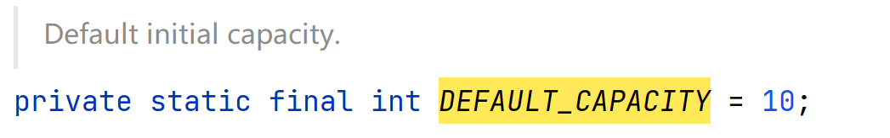
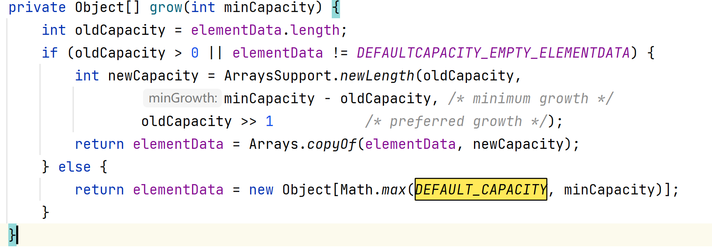

# 集合框架全面解析

以下是集合框架的结构图


Java 集合框架可以分为两条大的支线：

①、Collection，主要由 List、Set、Queue 组成：

- List 代表**有序**、**可重复**的集合，典型代表就是封装了动态数组的 [ArrayList](https://javabetter.cn/collection/arraylist.html) 和封装了链表的 [LinkedList](https://javabetter.cn/collection/linkedlist.html)；
- Set 代表**无序**、**不可重复**的集合，典型代表就是 HashSet 和 TreeSet；
- Queue 代表队列，典型代表就是双端队列 [ArrayDeque](https://javabetter.cn/collection/arraydeque.html)，以及优先级队列 [PriorityQueue](https://javabetter.cn/collection/PriorityQueue.html)。

②、Map，代表键值对的集合，典型代表就是 [HashMap](https://javabetter.cn/collection/hashmap.html)。


再详细一些:

**① Collection（单元素集合的统称）**

它是 `List`、`Set` 和 `Queue` 的父接口。它定义了单体容器最基本的规矩：能加元素（`add`）、能删元素（`remove`）、能看大小（`size`）。

- **List**：有序、可重复（像排队）。
- **Set**：无序、不重复（像朋友圈的点赞列表，一个人只能点一次）。
- **Queue**：先进先出（像排队买票）。

**② Map（键值对集合）**

Map 和 Collection **完全没有继承关系**。它存的是 `Key-Value`（键值对）。

- **核心逻辑**：通过 `Key`（钥匙）去找 `Value`（宝箱里的东西）。
- **特点**：`Key` 必须是唯一的，就像身份证号。
- **生活类比**：字典。你查“Apple”（Key），得到它的解释“苹果”（Value）。

**③ LinkedList（一种具体的物理结构）**

它是 `Collection` 家族下 `List` 接口的实现类。它的名字揭示了它的物理本质：**链表**。

- **存储方式**：数据在内存里是乱放的，每个元素都牵着下一个人的手。
- **特长**：在头尾增加、删除元素极快（$O(1)$）。
- **对比 ArrayList**：`ArrayList` 底层是数组（排排坐），找人快但插队慢；`LinkedList`（手拉手）插队快但找人慢。


核心区别:

| **特性**     | **Collection**         | **Map**                  | **LinkedList**            |
| ------------ | ---------------------- | ------------------------ | ------------------------- |
| **本质身份** | 接口（一种标准/身份）  | 接口（另一种标准/身份）  | 类（具体的工具/实现）     |
| **存储内容** | 单个对象 (Element)     | 键值对 (Key-Value)       | 单个对象 (Element)        |
| **层级关系** | 顶层根接口             | 顶层根接口               | 实现 List 接口的具体类    |
| **如何存取** | `add(E e)`             | `put(K k, V v)`          | `add(E e)` / `offer(E e)` |
| **比喻**     | 一个**大箩筐**，装苹果 | 一个**寄存柜**，凭票领包 | 一串**手拉手的孩子**      |


## 01、List

List 的特点是存取有序，可以存放重复的元素，可以用下标对元素进行操作。

### **1）`ArrayList`**

先来一段 `ArrayList` 的增删改查，学会用。

```java
// 创建一个集合
ArrayList<String> list = new ArrayList<String>();
// 添加元素
list.add("王二");
list.add("沉默");
list.add("陈清扬");

// 遍历集合 for 循环
for (int i = 0; i < list.size(); i++) {
    String s = list.get(i);
    System.out.println(s);
}
// 遍历集合 for each
for (String s : list) {
    System.out.println(s);
}

// 删除元素
list.remove(1);
// 遍历集合
for (String s : list) {
    System.out.println(s);
}

// 修改元素
list.set(1, "王二狗");
// 遍历集合
for (String s : list) {
    System.out.println(s);
}
```

简单介绍一下 ArrayList 的特征，[后面还会详细讲](https://javabetter.cn/collection/arraylist.html)。

- ArrayList 是由数组实现的，支持随机存取，也就是可以通过下标直接存取元素；
- 从尾部插入和删除元素会比较快捷，从中间插入和删除元素会比较低效，因为涉及到数组元素的复制和移动；
- 如果内部数组的容量不足时会自动扩容，因此当元素非常庞大的时候，效率会比较低。


### **2）LinkedList**

同样先来一段 `LinkedList` 的增删改查，和 `ArrayList` 几乎没什么差别。

```java
// 创建一个集合
LinkedList<String> list = new LinkedList<String>();
// 添加元素
list.add("王二");
list.add("沉默");
list.add("陈清扬");

// 遍历集合 for 循环
for (int i = 0; i < list.size(); i++) {
    String s = list.get(i);
    System.out.println(s);
}
// 遍历集合 for each
for (String s : list) {
    System.out.println(s);
}

// 删除元素
list.remove(1);
// 遍历集合
for (String s : list) {
    System.out.println(s);
}

// 修改元素
list.set(1, "王二狗");
// 遍历集合
for (String s : list) {
    System.out.println(s);
}
```

不过，LinkedList 和 ArrayList 仍然有较大的不同，[后面也会详细地讲](https://javabetter.cn/collection/linkedlist.html)。

- LinkedList 是由双向链表实现的，不支持随机存取，只能从一端开始遍历，直到找到需要的元素后返回；
- 任意位置插入和删除元素都很方便，因为只需要改变前一个节点和后一个节点的引用即可，不像 ArrayList 那样需要复制和移动数组元素；
- 因为每个元素都存储了前一个和后一个节点的引用，所以相对来说，占用的内存空间会比 ArrayList 多一些。


### **3）Vector 和 Stack**

List 的实现类还有一个 Vector，是一个元老级的类，比 ArrayList 出现得更早。ArrayList 和 Vector 非常相似，只不过 Vector 是线程安全的，像 get、set、add 这些方法都加了 `synchronized` 关键字，就导致执行效率会比较低，所以现在已经很少用了。

我就不写太多代码了，只看一下 add 方法的源码就明白了。

```java
public synchronized boolean add(E e) {
    elementData[elementCount++] = e;
    return true;
}
```

这种加了同步方法的类，注定会被淘汰掉，就像[StringBuilder 取代 StringBuffer](https://javabetter.cn/string/builder-buffer.html)那样。JDK 源码也说了：

> 如果不需要线程安全，建议使用 ArrayList 代替 Vector。


Stack 是 Vector 的一个子类，本质上也是由动态数组实现的，只不过还实现了先进后出的功能（在 get、set、add 方法的基础上追加了 pop「返回并移除栈顶的元素」、peek「只返回栈顶元素」等方法），所以叫栈。

下面是这两个方法的源码，增删改查我就不写了，和 ArrayList 和 LinkedList 几乎一样。

```java
public synchronized E pop() {
    E       obj;
    int     len = size();

    obj = peek();
    removeElementAt(len - 1);

    return obj;
}

public synchronized E peek() {
    int     len = size();

    if (len == 0)
        throw new EmptyStackException();
    return elementAt(len - 1);
}
```

不过，由于 Stack 执行效率比较低（方法上同样加了 synchronized 关键字），就被双端队列 ArrayDeque 取代了（下面会介绍）。


## 02、Set

Set 的特点是存取无序，不可以存放重复的元素，不可以用下标对元素进行操作，和 List 有很多不同。

### 1）`HashSet`

`HashSet` 其实是由 `HashMap` 实现的，HashMap会在下文提及,具体源码也会在之后章节展示,只不过值由一个固定的 Object 对象填充，而键用于操作。来简单看一下它的源码。

```java
public class HashSet<E>
    extends AbstractSet<E>
    implements Set<E>, Cloneable, java.io.Serializable
{
    private transient HashMap<E,Object> map;

    // Dummy value to associate with an Object in the backing Map
    private static final Object PRESENT = new Object();

    public HashSet() {
        map = new HashMap<>();
    }

    public boolean add(E e) {
        return map.put(e, PRESENT)==null;
    }

    public boolean remove(Object o) {
        return map.remove(o)==PRESENT;
    }
}
```

实际开发中，HashSet 并不常用，比如，如果我们需要按照顺序存储一组元素，那么 ArrayList 和 LinkedList 可能更适合；如果我们需要存储键值对并根据键进行查找，那么 HashMap 可能更适合。


> `HashSet` 在底层“偷懒”了——它其实就是一套剥掉了“值（Value）”的 `HashMap`
>
> 它的存在主要为了解决两个核心痛点：**去重（Uniqueness）** 和 **极速查找（Performance）**。
>
> ### 1. 它是最快的“查重器”
>
> 想象你有一个拥有 100 万个用户 ID 的列表，现在又来了一个新 ID，你要判断它是否已经存在。
>
> - **用 `ArrayList`**：你得从头到尾数一遍。如果运气不好，你要对比 100 万次。在算法上这叫 $O(n)$。
> - **用 `HashSet`**：它通过 Hash 算法直接计算出这个 ID 应该在哪个“坑”里，然后直接跳过去看一眼。不管里面有 10 个还是 100 万个元素，它都只需要“看一眼”。在算法上这叫 $O(1)$。
>
> **结论**：如果你不在乎顺序，只在乎**“有没有”**，`HashSet` 的速度能把 `ArrayList` 甩出几条街。
>
> 
>
> ### 2. 它定义了“集合”的数学本质
>
> 在数学中，**集合（Set）** 的定义就是：**无序且不重复**。
>
> - **`ArrayList` 是“排队”**：谁先来谁站前面，双胞胎（重复元素）可以站在一起。
> - **`HashSet` 是“圈地”**：这个圈子里，同样的元素只能占一个位置。
>
> 当你需要自动过滤掉重复数据时（比如：统计一篇文章里出现了多少个**不同的**单词），用 `HashSet` 只需要一行 `set.add(word)`，它会自动帮你把重复的踢出去。
>
> 
>
> ### 3. 底层揭秘：它其实是 `HashMap` 的“单身版”
>
> ```java
> public class HashSet<E> {
>     // 内部其实藏着一个 HashMap
>     private transient HashMap<E, Object> map;
> 
>     // 所有的 Value 都指向这个没意义的虚设对象
>     private static final Object PRESENT = new Object();
> 
>     public boolean add(E e) {
>         // 所谓的 add，其实就是把元素当做 Key 存进 Map 里
>         return map.put(e, PRESENT) == null;
>     }
> }
> ```
>
> **既然 `HashMap` 已经能干这活了，为什么要单独封装一个 `HashSet`？** 这就是为了**语义化**。如果你只需要存一堆不重复的“名字”，用 `HashMap<String, Object>` 会让代码读起来很别扭——那个 `Object` 到底是干啥的？而用 `HashSet<String>`，别人一眼就能看懂你的意图：**你只想存一堆唯一的字符串。**


来一段增删改查体验一下：

```java
// 创建一个新的HashSet
HashSet<String> set = new HashSet<>();

// 添加元素
set.add("沉默");
set.add("王二");
set.add("陈清扬");

// 输出HashSet的元素个数
System.out.println("HashSet size: " + set.size()); // output: 3

// 判断元素是否存在于HashSet中
boolean containsWanger = set.contains("王二");
System.out.println("Does set contain '王二'? " + containsWanger); // output: true

// 删除元素
boolean removeWanger = set.remove("王二");
System.out.println("Removed '王二'? " + removeWanger); // output: true

// 修改元素，需要先删除后添加
boolean removeChenmo = set.remove("沉默");
boolean addBuChenmo = set.add("不沉默");
System.out.println("Modified set? " + (removeChenmo && addBuChenmo)); // output: true

// 输出修改后的HashSet
System.out.println("HashSet after modification: " + set); // output: [陈清扬, 不沉默]
```

HashSet 主要用于去重，比如，我们需要统计一篇文章中有多少个不重复的单词，就可以使用 HashSet 来实现。

```java
// 创建一个 HashSet 对象
HashSet<String> set = new HashSet<>();

// 添加元素
set.add("沉默");
set.add("王二");
set.add("陈清扬");
set.add("沉默");

// 输出 HashSet 的元素个数
System.out.println("HashSet size: " + set.size()); // output: 3

// 遍历 HashSet
for (String s : set) {
    System.out.println(s);
}
```

从上面的例子可以看得出，HashSet 会自动去重，因为它是用 HashMap 实现的，[HashMap](https://javabetter.cn/collection/hashmap.html) 的键是唯一的（哈希值），相同键的值会覆盖掉原来的值，于是第二次 `set.add("沉默")` 的时候就覆盖了第一次的 `set.add("沉默")`。

我在《[LeetCode 的第 15 题：三数之和](https://paicoding.com/column/7/15)》的时候用到了 HashSet，大家可以通过链接去查看一下。


### 2）LinkedHashSet

LinkedHashSet 虽然继承自 HashSet，其实是由 [LinkedHashMap](https://javabetter.cn/collection/linkedhashmap.html) 实现的。

这是 LinkedHashSet 的无参构造方法

```
public LinkedHashSet() {
    super(16, .75f, true);
}
```

> `16` —— 初始容量 (Initial Capacity)
>
> `.75f` —— 加载因子 (Load Factor)
>
> **计算公式**：`初始容量 × 加载因子 = 扩容阈值`。
>
> 在这里就是：`16 × 0.75 = 12`。
>
> **逻辑**：当你存入第 **13** 个元素时，`LinkedHashSet` 就会觉得自己快满了（为了防止拥挤导致碰撞），它会立刻触发“扩容”，把车位翻倍（从 16 变成 32），然后把旧车全部重新停一遍。

[super](https://javabetter.cn/oo/this-super.html) 的意思是它将调用父类的 HashSet 的一个有参构造方法：

```java
HashSet(int initialCapacity, float loadFactor, boolean dummy) {
    map = new LinkedHashMap<>(initialCapacity, loadFactor);
}
```

看到 [LinkedHashMap](https://javabetter.cn/collection/linkedhashmap.html) 了吧，这个我们后面会去讲。

好吧，来看一段 LinkedHashSet 的增删改查吧。

```java
LinkedHashSet<String> set = new LinkedHashSet<>();

// 添加元素
set.add("沉默");
set.add("王二");
set.add("陈清扬");

// 删除元素
set.remove("王二");

// 修改元素
set.remove("沉默");
set.add("沉默的力量");

// 查找元素
boolean hasChenQingYang = set.contains("陈清扬");
System.out.println("set包含陈清扬吗？" + hasChenQingYang);
```

在以上代码中，我们首先创建了一个 LinkedHashSet 对象，然后使用 add 方法依次添加了三个元素：沉默、王二和陈清扬。接着，我们使用 remove 方法删除了王二这个元素，并使用 remove 和 add 方法修改了沉默这个元素。最后，我们使用 contains 方法查找了陈清扬这个元素是否存在于 set 中，并打印了结果。

LinkedHashSet 是一种基于哈希表实现的 Set 接口，它继承自 HashSet，并且使用链表维护了元素的插入顺序。因此，它既具有 HashSet 的快速查找、插入和删除操作的优点，又可以维护元素的插入顺序。


#### 3）TreeSet

TreeSet 是由 [TreeMap（后面会讲）](https://javabetter.cn/collection/treemap.html) 实现的，只不过同样操作的键位，值由一个固定的 Object 对象填充。

与 TreeMap 相似，TreeSet 是一种基于红黑树实现的有序集合，它实现了 SortedSet 接口，可以自动对集合中的元素进行排序。按照键的自然顺序或指定的比较器顺序进行排序。

```java
// 创建一个 TreeSet 对象
TreeSet<String> set = new TreeSet<>();

// 添加元素
set.add("沉默");
set.add("王二");
set.add("陈清扬");
System.out.println(set); // 输出 [沉默, 王二, 陈清扬]

// 删除元素
set.remove("王二");
System.out.println(set); // 输出 [沉默, 陈清扬]

// 修改元素：TreeSet 中的元素不支持直接修改，需要先删除再添加
set.remove("陈清扬");
set.add("陈青阳");
System.out.println(set); // 输出 [沉默, 陈青阳]

// 查找元素
System.out.println(set.contains("沉默")); // 输出 true
System.out.println(set.contains("王二")); // 输出 false
```

需要注意的是，`TreeSet` 不允许插入 null 元素，否则会抛出 `NullPointerException` 异常。

总体上来说，Set 集合不是关注的重点，因为底层都是由 Map 实现的，为什么要用 Map 实现?

**答 : 因为 Map 的键不允许重复、无序**


### 03、Queue

Queue，也就是队列，通常遵循先进先出（FIFO）的原则，新元素插入到队列的尾部，访问元素返回队列的头部。

#### 1）`ArrayDeque`

从名字上可以看得出，`ArrayDeque` 是一个基于数组实现的双端队列，为了满足可以同时在数组两端插入或删除元素的需求，数组必须是循环的，也就是说数组的任何一点都可以被看作是起点或者终点。

这是一个包含了 4 个元素的双端队列，和一个包含了 5 个元素的双端队列。


head 指向队首的第一个有效的元素，tail 指向队尾第一个可以插入元素的空位，因为是循环数组，所以 head 不一定从是从 0 开始，tail 也不一定总是比 head 大。

来一段 `ArrayDeque` 的增删改查吧。

```java
// 创建一个ArrayDeque
ArrayDeque<String> deque = new ArrayDeque<>();

// 添加元素
deque.add("沉默");
deque.add("王二");
deque.add("陈清扬");

// 删除元素
deque.remove("王二");

// 修改元素
deque.remove("沉默");
deque.add("沉默的力量");

// 查找元素
boolean hasChenQingYang = deque.contains("陈清扬");
System.out.println("deque包含陈清扬吗？" + hasChenQingYang);
```


#### 2）`LinkedList`

`LinkedList` 一般应该归在 List 下，只不过，它也实现了 Deque 接口，可以作为队列来使用。等于说，`LinkedList` 同时实现了 Stack、Queue、`PriorityQueue` 的所有功能。

```java
public class LinkedList<E>
    extends AbstractSequentialList<E>
    implements List<E>, Deque<E>, Cloneable, java.io.Serializable
{}
```

换句话说，`LinkedList` 和 `ArrayDeque` 都是 Java 集合框架中的双向队列（deque），它们都支持在队列的两端进行元素的插入和删除操作。不过，`LinkedList` 和 `ArrayDeque` 在实现上有一些不同：

- 底层实现方式不同：`LinkedList` 是基于链表实现的，而 `ArrayDeque` 是基于数组实现的。
- 随机访问的效率不同：由于底层实现方式的不同，`LinkedList` 对于随机访问的效率较低，时间复杂度为 O(n)，而 `ArrayDeque` 可以通过下标随机访问元素，时间复杂度为 O(1)。
- 迭代器的效率不同：`LinkedList` 对于迭代器的效率比较低，因为需要通过链表进行遍历，时间复杂度为 O(n)，而 `ArrayDeque` 的迭代器效率比较高，因为可以直接访问数组中的元素，时间复杂度为 O(1)。
- 内存占用不同：由于 `LinkedList` 是基于链表实现的，它在存储元素时需要额外的空间来存储链表节点，因此内存占用相对较高，而 `ArrayDeque` 是基于数组实现的，内存占用相对较低。

因此，在选择使用 `LinkedList` 还是 `ArrayDeque` 时，需要根据具体的业务场景和需求来选择。如果需要在双向队列的两端进行频繁的插入和删除操作，并且需要随机访问元素，可以考虑使用 `ArrayDeque`；如果需要在队列中间进行频繁的插入和删除操作，可以考虑使用 `LinkedList`。

来一段 `LinkedList` 作为队列时候的增删改查吧，注意和它作为 List 的时候有很大的不同。

```JAVA
// 创建一个 LinkedList 对象
LinkedList<String> queue = new LinkedList<>();

// 添加元素
queue.offer("沉默");
queue.offer("王二");
queue.offer("陈清扬");
System.out.println(queue); // 输出 [沉默, 王二, 陈清扬]

// 删除元素
queue.poll();
System.out.println(queue); // 输出 [王二, 陈清扬]

// 修改元素：LinkedList 中的元素不支持直接修改，需要先删除再添加
String first = queue.poll();
queue.offer("王大二");
System.out.println(queue); // 输出 [陈清扬, 王大二]

// 查找元素：LinkedList 中的元素可以使用 get() 方法进行查找
System.out.println(queue.get(0)); // 输出 陈清扬
System.out.println(queue.contains("沉默")); // 输出 false

// 查找元素：使用迭代器的方式查找陈清扬
// 使用迭代器依次遍历元素并查找
Iterator<String> iterator = queue.iterator();
while (iterator.hasNext()) {
    String element = iterator.next();
    if (element.equals("陈清扬")) {
        System.out.println("找到了：" + element);
        break;
    }
}
```

在使用 `LinkedList` 作为队列时，可以使用 offer() 方法将元素添加到队列的末尾，使用 poll() 方法从队列的头部删除元素。另外，由于 `LinkedList` 是链表结构，不支持随机访问元素，因此不能使用下标访问元素，需要使用迭代器或者 poll() 方法依次遍历元素。


| **操作类型**       | **抛出异常 (激进派)** | **返回特殊值 (温柔派)** | **失败原因 (通常情况)** |
| ------------------ | --------------------- | ----------------------- | ----------------------- |
| **插入 (Insert)**  | **`add(e)`**          | **`offer(e)`**          | 队列已满 (容量限制)     |
| **移除 (Remove)**  | **`remove()`**        | **`poll()`**            | 队列为空 (没东西可拿)   |
| **检查 (Examine)** | **`element()`**       | **`peek()`**            | 队列为空 (没东西可看)   |


#### 3）`PriorityQueue`

`PriorityQueue` 是一种优先级队列，它的出队顺序与元素的优先级有关，执行 remove 或者 poll 方法，返回的总是优先级最高的元素。

```java
// 创建一个 PriorityQueue 对象
PriorityQueue<String> queue = new PriorityQueue<>();

// 添加元素
queue.offer("沉默");
queue.offer("王二");
queue.offer("陈清扬");
System.out.println(queue); // 输出 [沉默, 王二, 陈清扬]

// 删除元素
queue.poll();
System.out.println(queue); // 输出 [王二, 陈清扬]

// 修改元素：PriorityQueue 不支持直接修改元素，需要先删除再添加
String first = queue.poll();
queue.offer("张三");
System.out.println(queue); // 输出 [张三, 陈清扬]

// 查找元素：PriorityQueue 不支持随机访问元素，只能访问队首元素
System.out.println(queue.peek()); // 输出 张三
System.out.println(queue.contains("陈清扬")); // 输出 true

// 通过 for 循环的方式查找陈清扬
for (String element : queue) {
    if (element.equals("陈清扬")) {
        System.out.println("找到了：" + element);
        break;
    }
}
```

要想有优先级，元素就需要实现 [Comparable 接口或者 Comparator 接口](https://javabetter.cn/basic-extra-meal/comparable-omparator.html)（我们后面会讲）。

这里先来一段通过实现 Comparator 接口按照年龄姓名排序的优先级队列吧。

```java
import java.util.Comparator;
import java.util.PriorityQueue;

class Student {
    private String name;
    private int chineseScore;
    private int mathScore;

    public Student(String name, int chineseScore, int mathScore) {
        this.name = name;
        this.chineseScore = chineseScore;
        this.mathScore = mathScore;
    }

    public String getName() {
        return name;
    }

    public int getChineseScore() {
        return chineseScore;
    }

    public int getMathScore() {
        return mathScore;
    }

    @Override
    public String toString() {
        return "Student{" +
                "name='" + name + '\'' +
                ", 总成绩=" + (chineseScore + mathScore) +
                '}';
    }
}

class StudentComparator implements Comparator<Student> {
    @Override
    public int compare(Student s1, Student s2) {
        // 比较总成绩
        return Integer.compare(s2.getChineseScore() + s2.getMathScore(),
                s1.getChineseScore() + s1.getMathScore());
    }
}

public class PriorityQueueComparatorExample {

    public static void main(String[] args) {
        // 创建一个按照总成绩排序的优先级队列
        PriorityQueue<Student> queue = new PriorityQueue<>(new StudentComparator());

        // 添加元素
        queue.offer(new Student("王二", 80, 90));
        System.out.println(queue);
        queue.offer(new Student("陈清扬", 95, 95));
        System.out.println(queue);
        queue.offer(new Student("小驼铃", 90, 95));
        System.out.println(queue);
        queue.offer(new Student("沉默", 90, 80));
        while (!queue.isEmpty()) {
            System.out.print(queue.poll() + " ");
        }
    }
}
```

> ### 1.为什么不能直接 `new PriorityQueue<>()`？
>
> 之所以 `String` 和 `Integer` 可以直接 `new PriorityQueue<>()` 而不需要传裁判（Comparator），是因为它们在 Java 内部属于**“自带裁判证书”**的类。**自带规则（Comparable 接口）** `String`、`Integer`、`Double` 等这些内置类，它们的源码里都写着 `implements Comparable`。这意味着它们**天生就知道**怎么和同类比大小。
>
> 而我们的Student是一个白板,所以当queue.offer的时候就会发生:
>
> **`offer` 阶段**：你塞进第一个学生，没问题。塞进第二个学生时，`PriorityQueue` 试图执行 `(Comparable)student2.compareTo(student1)`。
>
> **爆炸**：因为 `Student` 没实现这个接口，强转失败，程序直接 **`ClassCastException`**。
>
> 所以必须在构造函数里塞进一个 **“裁判” (StudentComparator)**
>
> ### 2. 为什么能 `offer(new Student(...))`？
>
> 明明构造函数里传的是 `StudentComparator`，为什么 `offer` 进去的却是 `Student`？
>
> 这里有两个不同的角色，千万不要混淆：
>
> 1. **容器里的“住户” (Elements)**：这是 `queue.offer()` 进去的东西。你的 `queue` 声明为 `PriorityQueue<Student>`，所以它**只能**也**必须**存 `Student` 对象。
> 2. **容器的“管理员” (Comparator)**：这是 `new PriorityQueue<>(...)` 构造函数里传的东西。它不存入队列，它只是站在旁边**看**两个学生，然后告诉队列谁更强。


Student 是一个学生对象，包含姓名、语文成绩和数学成绩。

StudentComparator 实现了 Comparator 接口，对总成绩做了一个排序。

PriorityQueue 是一个优先级队列，参数为 StudentComparator，然后我们添加了 4 个学生对象进去。

来看一下输出结果：

```java
[Student{name='王二', 总成绩=170}]
[Student{name='陈清扬', 总成绩=190}, Student{name='王二', 总成绩=170}]
[Student{name='陈清扬', 总成绩=190}, Student{name='王二', 总成绩=170}, Student{name='小驼铃', 总成绩=185}]
Student{name='陈清扬', 总成绩=190} Student{name='小驼铃', 总成绩=185} Student{name='沉默', 总成绩=170} Student{name='王二', 总成绩=170}
```

我们使用 offer 方法添加元素，最后用 while 循环遍历元素（通过 poll 方法取出元素），从结果可以看得出，[PriorityQueue](https://javabetter.cn/collection/PriorityQueue.html)按照学生的总成绩由高到低进行了排序。


### 04、Map

Map 保存的是键值对，键要求保持唯一性，值可以重复。

#### 1）`HashMap`

`HashMap` 实现了 Map 接口，可以根据键快速地查找对应的值——通过哈希函数将键映射到哈希表中的一个索引位置，从而实现快速访问。[后面会详细聊到](https://javabetter.cn/collection/hashmap.html)。

这里先大致了解一下 `HashMap` 的特点：

- `HashMap` 中的键和值都可以为 null。如果键为 null，则将该键映射到哈希表的第一个位置。
- 可以使用迭代器或者 `forEach` 方法遍历 `HashMap` 中的键值对。
- `HashMap` 有一个初始容量和一个负载因子。初始容量是指哈希表的初始大小，负载因子是指哈希表在扩容之前可以存储的键值对数量与哈希表大小的比率。默认的初始容量是 16，负载因子是 0.75。


来个简单的增删改查吧:

```java
// 创建一个 HashMap 对象
HashMap<String, String> hashMap = new HashMap<>();

// 添加键值对
hashMap.put("沉默", "cenzhong");
hashMap.put("王二", "wanger");
hashMap.put("陈清扬", "chenqingyang");

// 获取指定键的值
String value1 = hashMap.get("沉默");
System.out.println("沉默对应的值为：" + value1);

// 修改键对应的值
hashMap.put("沉默", "chenmo");
String value2 = hashMap.get("沉默");
System.out.println("修改后沉默对应的值为：" + value2);

// 删除指定键的键值对
hashMap.remove("王二");

// 遍历 HashMap
for (String key : hashMap.keySet()) {
    String value = hashMap.get(key);
    System.out.println(key + " 对应的值为：" + value);
}
```


#### 2）`LinkedHashMap`

`HashMap` 已经非常强大了，但它是**无序**的。如果我们需要一个**有序**的 Map，就要用到 [`LinkedHashMap`](https://javabetter.cn/collection/linkedhashmap.html)。`LinkedHashMap` 是 `HashMap` 的子类，它使用链表来记录插入/访问元素的顺序。

`LinkedHashMap` 可以看作是 `HashMap` + `LinkedList` 的合体，它使用了哈希表来存储数据，又用了双向链表来维持顺序。

来一个简单的例子:

```java
// 创建一个 LinkedHashMap，插入的键值对为 沉默 王二 陈清扬
LinkedHashMap<String, String> linkedHashMap = new LinkedHashMap<>();
linkedHashMap.put("沉默", "cenzhong");
linkedHashMap.put("王二", "wanger");
linkedHashMap.put("陈清扬", "chenqingyang");

// 遍历 LinkedHashMap
for (String key : linkedHashMap.keySet()) {
    String value = linkedHashMap.get(key);
    System.out.println(key + " 对应的值为：" + value);
}
```

来看输出结果：

```
沉默 对应的值为：cenzhong
王二 对应的值为：wanger
陈清扬 对应的值为：chenqingyang
```

从结果中可以看得出来，LinkedHashMap 维持了键值对的插入顺序，对吧？为了和 LinkedHashMap 做对比，我们用同样的数据试验一下 HashMap。

```java
// 创建一个HashMap，插入的键值对为 沉默 王二 陈清扬
HashMap<String, String> hashMap = new HashMap<>();
hashMap.put("沉默", "cenzhong");
hashMap.put("王二", "wanger");
hashMap.put("陈清扬", "chenqingyang");

// 遍历 HashMap
for (String key : hashMap.keySet()) {
    String value = hashMap.get(key);
    System.out.println(key + " 对应的值为：" + value);
}
```

来看输出结果：

```
沉默 对应的值为：cenzhong
陈清扬 对应的值为：chenqingyang
王二 对应的值为：wanger
```

HashMap 没有维持键值对的插入顺序


> ### 1. HashMap：只管快，不管序
>
> `HashMap` 的核心目标是**极致的查找速度**。为了达到 $O(1)$ 的速度，它采用了“哈希表”结构。
>
> - **它的逻辑**：当你 `put("沉默", "...")` 时，它会给“沉默”算一卦（计算 **HashCode**），根据算出来的结果把它扔到数组的一个坑位（Bucket）里。
> - **为什么不保持顺序**：坑位的位置完全取决于哈希值和数组长度的运算结果。当你遍历时，它是按照**数组下标**从头往后扫的。
> - **形象类比**：就像去电影院找座位，大家不是按领票的先后顺序坐，而是票上写着几排几号（哈希值决定位置），你就得坐哪。你进场的时候是一个个进的，但坐下后完全是散开的。
>
> ### 2. LinkedHashMap：在哈希表上牵了根绳子
>
> `LinkedHashMap` 继承自 `HashMap`，它在 `HashMap` 的基础上额外维护了一个**双向链表**。
>
> - **它的逻辑**：它依然像 `HashMap` 一样把数据存进哈希表里，但每当新来一个元素，它都会让这个新元素和上一个元素“手拉手”。
> - **为什么能保持顺序**：当你遍历 `LinkedHashMap` 时，它并不去扫那个乱七八糟的数组下标，而是**顺着这根“手拉手”的绳子（链表）**挨个往下走。
> - **形象类比**：这就像在电影院里，大家虽然坐得乱七八糟，但每个人手里都牵着一根红线，红线的另一头连着比你晚一分钟进场的人。只要拉住第一根线，就能按进场顺序找到所有人


#### 3）`TreeMap`

[TreeMap](https://javabetter.cn/collection/treemap.html) 实现了 SortedMap 接口，可以自动将键按照自然顺序或指定的比较器顺序排序，并保证其元素的顺序。内部使用红黑树来实现键的排序和查找。

同样来一个增删改查的 demo：

```java
// 创建一个 TreeMap 对象
Map<String, String> treeMap = new TreeMap<>();

// 向 TreeMap 中添加键值对
treeMap.put("沉默", "cenzhong");
treeMap.put("王二", "wanger");
treeMap.put("陈清扬", "chenqingyang");

// 查找键值对
String name = "沉默";
if (treeMap.containsKey(name)) {
    System.out.println("找到了 " + name + ": " + treeMap.get(name));
} else {
    System.out.println("没有找到 " + name);
}

// 修改键值对
name = "王二";
if (treeMap.containsKey(name)) {
    System.out.println("修改前的 " + name + ": " + treeMap.get(name));
    treeMap.put(name, "newWanger");
    System.out.println("修改后的 " + name + ": " + treeMap.get(name));
} else {
    System.out.println("没有找到 " + name);
}

// 删除键值对
name = "陈清扬";
if (treeMap.containsKey(name)) {
    System.out.println("删除前的 " + name + ": " + treeMap.get(name));
    treeMap.remove(name);
    System.out.println("删除后的 " + name + ": " + treeMap.get(name));
} else {
    System.out.println("没有找到 " + name);
}

// 遍历 TreeMap
for (Map.Entry<String, String> entry : treeMap.entrySet()) {
    System.out.println(entry.getKey() + ": " + entry.getValue());
}
```

与 HashMap 不同的是，TreeMap 会按照键的顺序来进行排序。

```java
// 创建一个 TreeMap 对象
Map<String, String> treeMap = new TreeMap<>();

// 向 TreeMap 中添加键值对
treeMap.put("c", "cat");
treeMap.put("a", "apple");
treeMap.put("b", "banana");

// 遍历 TreeMap
for (Map.Entry<String, String> entry : treeMap.entrySet()) {
    System.out.println(entry.getKey() + ": " + entry.getValue());
}
```

来看输出结果：


```
a: apple
b: banana
c: cat
```

默认情况下，已经按照键的自然顺序排过了。

> 如果说 `HashMap` 是个**乱序派**，`LinkedHashMap` 是个**守序派**(按照输入顺序)，那么 **`TreeMap` 就是个彻底的“完美主义者”：它不看你什么时候进来，它只看你“本身的大小”,哪怕是乱序输入C D A会按照 A C D来整理,而LinkedHashMap则是怎么输入 怎么输出,他会保持CDA ,而 `HashMap`的“乱序”完全是为了极致的性能，而它表现出来的“随机感”其实是数学哈希函数的结果**


# `ArrayList`(扩容机制)

`ArrayList` 可以称得上是集合框架方面最常用的类了，可以和 `HashMap` 一较高下。

从名字就可以看得出来，`ArrayList` 实现了 List 接口，并且是基于数组实现的。

数组的大小是固定的，一旦创建的时候指定了大小，就不能再调整了。也就是说，如果数组满了，就不能再添加任何元素了。`ArrayList` 在数组的基础上实现了**自动扩容**，并且提供了比数组更丰富的预定义方法（各种增删改查），非常灵活。

Java 这门编程语言和别的编程语言，比如说 C语言的不同之处就在这里，如果是 C语言的话，你就必须得动手实现自己的 ArrayList，原生的库函数里面是没有的。


## 01、创建 `ArrayList`

创建一个`ArrayList`

```java
ArrayList<String> alist = new ArrayList<String>();
```

可以通过上面的语句来创建一个字符串类型的 ArrayList（通过尖括号来限定 ArrayList 中元素的类型，如果尝试添加其他类型的元素，将会产生编译错误），更简化的写法如下：

```java
List<String> alist = new ArrayList<>();
```

由于 `ArrayList` 实现了 List 接口，所以 `alist` 变量的类型可以是 List 类型；new 关键字声明后的尖括号中可以不再指定元素的类型，因为编译器可以通过前面尖括号中的类型进行智能推断。

此时会调用无参构造方法（见下面的代码）创建一个空的数组，常量DEFAULTCAPACITY_EMPTY_ELEMENTDATA的值为 `{}`。

```java
public ArrayList() {
    this.elementData = DEFAULTCAPACITY_EMPTY_ELEMENTDATA;
}
```

如果非常确定 `ArrayList` 中元素的个数，在创建的时候还可以指定初始大小。

```java
List<String> alist = new ArrayList<>(20);
```

这样做的好处是，可以有效地避免在添加新的元素时进行不必要的扩容。


<span style="color:orange">**面试(京东):ArrayList 的延迟初始化”/“懒加载机制**</span>




虽然我们有一个默认的初始容量,当我们创建了初始的arrayList,但其实是不生效的,此时还是arrayList[空] 我研究了一下
对于:
new ArrayList()	
new ArrayList(0)	
这种情况
此时java不会在堆内存里面开辟任何空间,只有第一次调用add()的时候才会分配

当我们执行add后,就会调用grow()




他会比较我们自己设定的长度和默认长度(10) 哪一个更加 MAX,然后进行创建,此时才是真正在堆中有了

这个目的是,我们会有很多ArrayList实例,一个大型项目数以万计,如果每一个在出生时就白占 10 个坑位，内存很快就会被填满。

这个在面试里叫做:ArrayList 的延迟初始化”/“懒加载机制


## 02、向 `ArrayList` 中添加元素

可以通过 `add()` 方法向 `ArrayList` 中添加一个元素。

```java
alist.add("沉默王二");
```

我们来跟一下源码，看看 add 方法到底执行了哪些操作。跟的过程中，我们也可以偷师到 Java 源码的作者（大师级程序员）是如何优雅地写代码的。

我先给个结论，全当抛砖引玉。

```java
堆栈过程图示：
add(element)
└── if (size == elementData.length) // 判断是否需要扩容
    ├── grow(minCapacity) // 扩容
    │   └── newCapacity = oldCapacity + (oldCapacity >> 1) // 计算新的数组容量
    │   └── Arrays.copyOf(elementData, newCapacity) // 创建新的数组
    ├── elementData[size++] = element; // 添加新元素
    └── return true; // 添加成功
```

来具体看一下，先是 `add()` 方法的源码（已添加好详细地注释）

```java
/**
 * 将指定元素添加到 ArrayList 的末尾
 * @param e 要添加的元素
 * @return 添加成功返回 true
 */
public boolean add(E e) {
    ensureCapacityInternal(size + 1);  // 确保 ArrayList 能够容纳新的元素
    elementData[size++] = e; // 在 ArrayList 的末尾添加指定元素
    return true;
}
```

参数 e 为要添加的元素，此时的值为“沉默王二”，size 为 `ArrayList` 的长度，此时为 0。

继续跟下去，来看看 `ensureCapacityInternal()`方法：

```java
/**
 * 确保 ArrayList 能够容纳指定容量的元素
 * @param minCapacity 指定容量的最小值
 */
private void ensureCapacityInternal(int minCapacity) {
    if (elementData == DEFAULTCAPACITY_EMPTY_ELEMENTDATA) { // 如果 elementData 还是默认的空数组
        minCapacity = Math.max(DEFAULT_CAPACITY, minCapacity); // 使用 DEFAULT_CAPACITY 和指定容量的最小值中的较大值
    }

    ensureExplicitCapacity(minCapacity); // 确保容量能够容纳指定容量的元素
}
```

此时：

- 参数 `minCapacity` 为 1（size+1 传过来的）
- `elementData` 为存放 `ArrayList` 元素的底层数组，前面声明 `ArrayList` 的时候讲过了，此时为空 `{}`
- `DEFAULTCAPACITY_EMPTY_ELEMENTDATA` 前面也讲过了，为 `{}`

所以，if 条件此时为 true，if 语句`minCapacity = Math.max(DEFAULT_CAPACITY, minCapacity)`要执行。

`DEFAULT_CAPACITY` 为 10（见下面的代码），所以执行完这行代码后，`minCapacity` 为 10，`Math.max()` 方法的作用是取两个当中最大的那个。

```java
private static final int DEFAULT_CAPACITY = 10;
```

接下来执行 `ensureExplicitCapacity()` 方法，来看一下源码：

```java
/**
 * 检查并确保集合容量足够，如果需要则增加集合容量。
 *
 * @param minCapacity 所需最小容量
 */
private void ensureExplicitCapacity(int minCapacity) {
    // 检查是否超出了数组范围，确保不会溢出
    if (minCapacity - elementData.length > 0)
        // 如果需要增加容量，则调用 grow 方法
        grow(minCapacity);
}
```

此时：

- 参数 minCapacity 为 10
- elementData.length 为 0（数组为空）

所以 10-0>0，if 条件为 true，进入 if 语句执行 `grow()` 方法，来看源码：

> 这部分就到我们讨论过的地方了,本处位旧版本源代码,原理一致不影响阅读

```java
/**
 * 扩容 ArrayList 的方法，确保能够容纳指定容量的元素
 * @param minCapacity 指定容量的最小值
 */
private void grow(int minCapacity) {
    // 检查是否会导致溢出，oldCapacity 为当前数组长度
    int oldCapacity = elementData.length;
    int newCapacity = oldCapacity + (oldCapacity >> 1); // 扩容至原来的1.5倍
    if (newCapacity - minCapacity < 0) // 如果还是小于指定容量的最小值
        newCapacity = minCapacity; // 直接扩容至指定容量的最小值
    if (newCapacity - MAX_ARRAY_SIZE > 0) // 如果超出了数组的最大长度
        newCapacity = hugeCapacity(minCapacity); // 扩容至数组的最大长度
    // 将当前数组复制到一个新数组中，长度为 newCapacity
    elementData = Arrays.copyOf(elementData, newCapacity);
}
```

此时：

- 参数 minCapacity 为 10
- 变量 oldCapacity 为 0

所以 newCapacity 也为 0，于是 `newCapacity - minCapacity` 等于 -10 小于 0，于是第一个 if 条件为 true，执行第一个 if 语句 `newCapacity = minCapacity`，然后 newCapacity 为 10。

紧接着执行 `elementData = Arrays.copyOf(elementData, newCapacity);`，也就是进行数组的第一次扩容，长度为 10。

回到 `add()` 方法：

```java
public boolean add(E e) {
    ensureCapacityInternal(size + 1);
    elementData[size++] = e;
    return true;
}
```

执行 `elementData[size++] = e`。

> 先上车后买票,所以是(0,"王二"),然后才会++ 执行(1,"xx"),(2,"xxx")

此时：

- size 为 0
- e 为 “沉默王二”

所以数组的第一个元素（下标为 0） 被赋值为“沉默王二”，接着返回 true，第一次 add 方法执行完毕。

PS：`add` 过程中会遇到一个令新手感到困惑的右移操作符 `>>`，借这个机会来解释一下。

`ArrayList` 在第一次执行 add 后会扩容为 10，那 `ArrayList` 第二次扩容发生在什么时候呢？

答案是添加第 11 个元素时，大家可以尝试分析一下这个过程

> 其实就是1.5倍,由于右移本质上就是➗2


## 03、右移操作符

“oldCapacity 等于 10，`oldCapacity >> 1` 这个表达式等于多少呢？

“`>>` 是右移运算符，`oldCapacity >> 1` 相当于 oldCapacity 除以 2。”我给三妹解释道，“在计算机内部，都是按照二进制存储的，10 的二进制就是 1010，也就是 `0*2^0 + 1*2^1 + 0*2^2 + 1*2^3`=0+2+0+8=10 。。。。。。”


先从位权的含义说起吧。

平常我们使用的是十进制数，比如说 39，并不是简单的 3 和 9，3 表示的是 `3*10 = 30`，9 表示的是 `9*1 = 9`，和 3 相乘的 10，和 9 相乘的 1，就是**位权**。位数不同，位权就不同，第 1 位是 10 的 0 次方（也就是 `10^0=1`），第 2 位是 10 的 1 次方（`10^1=10`），第 3 位是 10 的 2 次方（`10^2=100`），最右边的是第一位，依次类推。

位权这个概念同样适用于二进制，第 1 位是 2 的 0 次方（也就是 `2^0=1`），第 2 位是 2 的 1 次方（`2^1=2`），第 3 位是 2 的 2 次方（`2^2=4`），第 4 位是 2 的 3 次方（`2^3=8`）。

十进制的情况下，10 是基数，二进制的情况下，2 是基数。

10 在十进制的表示法是 `0*10^0+1*10^1`=0+10=10。

10 的二进制数是 1010，也就是 `0*2^0 + 1*2^1 + 0*2^2 + 1*2^3`=0+2+0+8=10。

然后是**移位运算**，移位分为左移和右移，在 Java 中，左移的运算符是 `<<`，右移的运算符 `>>`。

拿 `oldCapacity >> 1` 来说吧，`>>` 左边的是被移位的值，此时是 10，也就是二进制 `1010`；`>>` 右边的是要移位的位数，此时是 1。

1010 向右移一位就是 101，空出来的最高位此时要补 0，也就是 0101。

“你可能会问那为什么不补 1 呢？

“因为是算术右移，并且是正数，所以最高位补 0；如果表示的是负数，就需要补 1。”我慢吞吞地回答道，“0101 的十进制就刚好是 `1*2^0 + 0*2^1 + 1*2^2 + 0*2^3`=1+0+4+0=5，如果多移几个数来找规律的话，就会发现，右移 1 位是原来的 1/2，右移 2 位是原来的 1/4，诸如此类。”

也就是说，`ArrayList` 的大小会扩容为原来的大小+原来大小/2，也就是 1.5 倍。


你可以通过在 `ArrayList` 中添加第 11 个元素来 debug 验证一下。


## 04、向 `ArrayList` 的指定位置添加元素

除了 `add(E e)` 方法，还可以通过 `add(int index, E element)` 方法把元素添加到 `ArrayList` 的指定位置：

```java
alist.add(0, "沉默王三");
```

`add(int index, E element)` 方法的源码如下：

```java
/**
 * 在指定位置插入一个元素。
 *
 * @param index   要插入元素的位置
 * @param element 要插入的元素
 * @throws IndexOutOfBoundsException 如果索引超出范围，则抛出此异常
 */
public void add(int index, E element) {
    rangeCheckForAdd(index); // 检查索引是否越界

    ensureCapacityInternal(size + 1);  // 确保容量足够，如果需要扩容就扩容
    System.arraycopy(elementData, index, elementData, index + 1,
            size - index); // 将 index 及其后面的元素向后移动一位
    elementData[index] = element; // 将元素插入到指定位置
    size++; // 元素个数加一
}
```

`add(int index, E element)`方法会调用到一个非常重要的[本地方法](https://javabetter.cn/oo/native-method.html) `System.arraycopy()`，它会对数组进行复制（要插入位置上的元素往后复制）。

来细品一下。

这是 `arraycopy`() 的语法：

```java
System.arraycopy(Object src, int srcPos, Object dest, int destPos, int length);
```

在 `ArrayList.add(int index, E element)` 方法中，具体用法如下：

```java
System.arraycopy(elementData, index, elementData, index + 1, size - index);
```

- `elementData`：表示要复制的源数组，即 `ArrayList` 中的元素数组。
- `index`：表示源数组中要复制的起始位置，即需要将 `index` 及其后面的元素向后移动一位。
- `elementData`：表示要复制到的目标数组，即 `ArrayList` 中的元素数组。
- `index` + 1：表示目标数组中复制的起始位置，即将 `index` 及其后面的元素向后移动一位后，应该插入到的位置。
- `size` - `index`：表示要复制的元素个数，即需要将 `index` 及其后面的元素向后移动一位，需要移动的元素个数为 size - index。


## 05、更新 `ArrayList` 中的元素

通过使用 `set()` 方法来更改 `ArrayList` 中的元素，需要提供下标和新元素。

```java
alist.set(0, "沉默王四");
```

假设原来 0 位置上的元素为“沉默王三”，现在可以将其更新为“沉默王四”。

来看一下 `set()` 方法的源码：

```java
/**
 * 用指定元素替换指定位置的元素。
 *
 * @param index   要替换的元素的索引
 * @param element 要存储在指定位置的元素
 * @return 先前在指定位置的元素
 * @throws IndexOutOfBoundsException 如果索引超出范围，则抛出此异常
 */
public E set(int index, E element) {
    rangeCheck(index); // 检查索引是否越界

    E oldValue = elementData(index); // 获取原来在指定位置上的元素
    elementData[index] = element; // 将新元素替换到指定位置上
    return oldValue; // 返回原来在指定位置上的元素
}
```

该方法会先对指定的下标进行检查，看是否越界，然后替换新值并返回旧值。


## 06、删除 `ArrayList` 中的元素

`remove(int index)` 方法用于删除指定下标位置上的元素，`remove(Object o)` 方法用于删除指定值的元素。

```java
alist.remove(1);
alist.remove("沉默王四");
```

先来看 `remove(int index)` 方法的源码：

```java
/**
 * 删除指定位置的元素。
 *
 * @param index 要删除的元素的索引
 * @return 先前在指定位置的元素
 * @throws IndexOutOfBoundsException 如果索引超出范围，则抛出此异常
 */
public E remove(int index) {
    rangeCheck(index); // 检查索引是否越界

    E oldValue = elementData(index); // 获取要删除的元素

    int numMoved = size - index - 1; // 计算需要移动的元素个数
    if (numMoved > 0) // 如果需要移动元素，就用 System.arraycopy 方法实现
        System.arraycopy(elementData, index+1, elementData, index,
                numMoved);
    elementData[--size] = null; // 将数组末尾的元素置为 null，让 GC 回收该元素占用的空间

    return oldValue; // 返回被删除的元素
}
```

需要注意的是，在 `ArrayList` 中，删除元素时，需要将删除位置后面的元素向前移动一位，以填补删除位置留下的空缺。如果需要移动元素，则需要使用 `System.arraycopy` 方法将删除位置后面的元素向前移动一位。最后，将数组末尾的元素置为 null，以便让垃圾回收机制回收该元素占用的空间。

再来看 `remove(Object o)` 方法的源码：

```java
/**
 * 删除列表中第一次出现的指定元素（如果存在）。
 *
 * @param o 要删除的元素
 * @return 如果列表包含指定元素，则返回 true；否则返回 false
 */
public boolean remove(Object o) {
    if (o == null) { // 如果要删除的元素是 null
        for (int index = 0; index < size; index++) // 遍历列表
            if (elementData[index] == null) { // 如果找到了 null 元素
                fastRemove(index); // 调用 fastRemove 方法快速删除元素
                return true; // 返回 true，表示成功删除元素
            }
    } else { // 如果要删除的元素不是 null
        for (int index = 0; index < size; index++) // 遍历列表
            if (o.equals(elementData[index])) { // 如果找到了要删除的元素
                fastRemove(index); // 调用 fastRemove 方法快速删除元素
                return true; // 返回 true，表示成功删除元素
            }
    }
    return false; // 如果找不到要删除的元素，则返回 false
}
```

该方法通过遍历的方式找到要删除的元素，null 的时候使用 == 操作符判断，非 null 的时候使用 `equals()` 方法，然后调用 `fastRemove()` 方法。

> 对于null,只能用==来进行判断,eqals是死局,因为如果不是null,任何对象object.equals(null)都会返回false,然后如果本身是null,那么会报错,因为你不能在一个不存在的东西上调用方法。

注意：

- 有相同元素时，只会删除第一个。
- 判断两个元素是否相等，可以参考[Java如何判断两个字符串是否相等](https://javabetter.cn/string/equals.html)

> 至于设置if (numMoved > 0)的目的:
>
> 可能会疑惑,如果要删除肯定是要动数组的,为什么这里还要加一个判断,其实可以分为两点来解释:
>
> ### 1.数学逻辑：`numMoved` 算的是什么？
>
> 我们先看这个公式：
>
> $$numMoved = size - index - 1$$
>
> - **`size`**：当前列表里总共有多少人。
> - **`index`**：你要删掉的那个人的位置。
> - **`- 1`**：排除掉被删掉的那个人自己。
>
> **`numMoved` 的真实含义是：被删元素后面，还有多少个“追随者”需要往前挪？**
>
> ### 2.唯一的情况
>
> 就是删除末尾的元素,此时完全不需要动,因为没有追随者在后面
>
> ### 3.为什么要加这个 `if` 判断？
>
> 你可能会问：“就算 `numMoved` 是 0，强行调一下 `System.arraycopy` 又能怎样？”
>
> 1. **性能节约**： 虽然 `System.arraycopy` 很强大，但调用一个本地（native）方法是有开销的。如果明明不需要挪动，还去走一遍搬运逻辑，那是对 CPU 的纯粹浪费。
> 2. **避免非法操作**： 虽然 `System.arraycopy` 允许长度为 0 的拷贝，但在逻辑上，明确区分“挪动”和“直接抹除”能让代码的意图更清晰。


继续往后面跟，来看一下 `fastRemove()` 方法：

```java
/**
 * 快速删除指定位置的元素。
 *
 * @param index 要删除的元素的索引
 */
private void fastRemove(int index) {
    int numMoved = size - index - 1; // 计算需要移动的元素个数
    if (numMoved > 0) // 如果需要移动元素，就用 System.arraycopy 方法实现
        System.arraycopy(elementData, index+1, elementData, index,
                numMoved);
    elementData[--size] = null; // 将数组末尾的元素置为 null，让 GC 回收该元素占用的空间
}
```

> 你可能会问：`remove` 多跑两行代码能慢多少？为什么非要拆出来？
>
> 1. **省略“无意义”的返回**： 在某些内部场景（比如 `clear()` 清空整个列表时，或者某些内部过滤逻辑中），我们**只关心把东西删掉**，根本不在乎被删掉的是谁。如果调用 `remove`，系统还得额外做一次内存读取把旧值存起来返回，这在百万级数据操作下就是浪费。
> 2. **跳过重复的检查**： 如果内部方法已经通过循环确定了 `index` 是安全的，再跑一次 `rangeCheck` 就是纯粹的 CPU 损耗。

同样是调用 `System.arraycopy()` 方法对数组进行复制和移动。


## 07、查找 `ArrayList` 中的元素

如果要正序查找一个元素，可以使用 `indexOf()` 方法；如果要倒序查找一个元素，可以使用 `lastIndexOf()` 方法。

```java
alist.indexOf("沉默王二");
alist.lastIndexOf("沉默王二");
```

来看一下 `indexOf()` 方法的源码：

```java
/**
 * 返回指定元素在列表中第一次出现的位置。
 * 如果列表不包含该元素，则返回 -1。
 *
 * @param o 要查找的元素
 * @return 指定元素在列表中第一次出现的位置；如果列表不包含该元素，则返回 -1
 */
public int indexOf(Object o) {
    if (o == null) { // 如果要查找的元素是 null
        for (int i = 0; i < size; i++) // 遍历列表
            if (elementData[i]==null) // 如果找到了 null 元素
                return i; // 返回元素的索引
    } else { // 如果要查找的元素不是 null
        for (int i = 0; i < size; i++) // 遍历列表
            if (o.equals(elementData[i])) // 如果找到了要查找的元素
                return i; // 返回元素的索引
    }
    return -1; // 如果找不到要查找的元素，则返回 -1
}
```

如果元素为 null 的时候使用“==”操作符，否则使用 `equals()` 方法。

`lastIndexOf()` 方法和 `indexOf()` 方法类似，不过遍历的时候从最后开始。

```java
/**
 * 返回指定元素在列表中最后一次出现的位置。
 * 如果列表不包含该元素，则返回 -1。
 *
 * @param o 要查找的元素
 * @return 指定元素在列表中最后一次出现的位置；如果列表不包含该元素，则返回 -1
 */
public int lastIndexOf(Object o) {
    if (o == null) { // 如果要查找的元素是 null
        for (int i = size-1; i >= 0; i--) // 从后往前遍历列表
            if (elementData[i]==null) // 如果找到了 null 元素
                return i; // 返回元素的索引
    } else { // 如果要查找的元素不是 null
        for (int i = size-1; i >= 0; i--) // 从后往前遍历列表
            if (o.equals(elementData[i])) // 如果找到了要查找的元素
                return i; // 返回元素的索引
    }
    return -1; // 如果找不到要查找的元素，则返回 -1
}
```

`contains()` 方法可以判断 ArrayList 中是否包含某个元素，其内部就是通过 `indexOf()` 方法实现的：

```java
public boolean contains(Object o) {
    return indexOf(o) >= 0;
}
```


## 08、二分查找法

如果 ArrayList 中的元素是经过排序的，就可以使用二分查找法，效率更快。

[`Collections`](https://javabetter.cn/common-tool/collections.html) 类的 `sort()` 方法可以对 ArrayList 进行排序，该方法会按照字母顺序对 String 类型的列表进行排序。如果是自定义类型的列表，还可以指定 Comparator 进行排序。

这里先简单地了解一下，后面会详细地讲。

```java
List<String> copy = new ArrayList<>(alist);
copy.add("a");
copy.add("c");
copy.add("b");
copy.add("d");

Collections.sort(copy);
System.out.println(copy);
```

输出结果如下所示：

```java
[a, b, c, d]
```

排序后就可以使用二分查找法了：

```java
int index = Collections.binarySearch(copy, "b");
```


## 09、`ArrayList`增删改查时的时间复杂度

最后简单总结一下 `ArrayList` 的时间复杂度，方便后面学习 `LinkedList` 时对比。

### 1）查询

时间复杂度为 O(1)，因为 ArrayList 内部使用数组来存储元素，所以可以直接根据索引来访问元素。

```java
/**
 * 返回列表中指定位置的元素。
 *
 * @param index 要返回的元素的索引
 * @return 列表中指定位置的元素
 * @throws IndexOutOfBoundsException 如果索引超出范围（index < 0 || index >= size()）
 */
public E get(int index) {
    rangeCheck(index); // 检查索引是否合法
    return elementData(index); // 调用 elementData 方法获取元素
}

/**
 * 返回列表中指定位置的元素。
 * 此方法不进行边界检查，因此只应由内部方法和迭代器调用。
 *
 * @param index 要返回的元素的索引
 * @return 列表中指定位置的元素
 */
E elementData(int index) {
    return (E) elementData[index]; // 返回指定索引位置上的元素
}
```


### 2）插入

添加一个元素（调用 `add()` 方法时）的时间复杂度最好情况为 O(1)，最坏情况为 O(n)。

- 如果在列表末尾添加元素，时间复杂度为 O(1)。
- 如果要在列表的中间或开头插入元素，则需要将插入位置之后的元素全部向后移动一位，时间复杂度为 O(n)。


### 3）删除

删除一个元素（调用 `remove(Object)` 方法时）的时间复杂度最好情况 O(1)，最坏情况 O(n)。

- 如果要删除列表末尾的元素，时间复杂度为 O(1)。
- 如果要删除列表中间或开头的元素，则需要将删除位置之后的元素全部向前移动一位，时间复杂度为 O(n)


### 4）修改

修改一个元素（调用 `set()`方法时）与查询操作类似，可以直接根据索引来访问元素，时间复杂度为 O(1)。

```java
/**
 * 用指定元素替换列表中指定位置的元素。
 *
 * @param index 要替换元素的索引
 * @param element 要放入列表中的元素
 * @return 原来在指定位置上的元素
 * @throws IndexOutOfBoundsException 如果索引超出范围（index < 0 || index >= size()）
 */
public E set(int index, E element) {
    rangeCheck(index); // 检查索引是否合法

    E oldValue = elementData(index); // 获取原来在指定位置上的元素
    elementData[index] = element; // 将指定位置上的元素替换为新元素
    return oldValue; // 返回原来在指定位置上的元素
}
```


## 10、总结

`ArrayList`，如果有个中文名的话，应该叫动态数组，也就是可增长的数组，可调整大小的数组。动态数组克服了静态数组的限制，静态数组的容量是固定的，只能在首次创建的时候指定。而动态数组会随着元素的增加自动调整大小，更符合实际的开发需求。

学习集合框架，`ArrayList` 是第一课，也是新手进阶的重要一课。要想完全掌握 `ArrayList`，扩容这个机制是必须得掌握，也是面试中经常考察的一个点。

要想掌握扩容机制，就必须得读源码，也就肯定会遇到 `oldCapacity >> 1`，有些初学者会选择跳过，虽然不影响整体上的学习，但也错过了一个精进的机会。


# `LinkedList`

`LinkedList`，和 `ArrayList` 是同门师兄弟，但练的内功却完全不同。`ArrayList`练的是**动态数组**，`LinkedList`练的是链表。

选择链表的原因:

举个例子来讲吧，假如你们手头要管理一推票据，可能有一张，也可能有一亿张。

该怎么办呢？

申请一个 10G 的大数组等着？那万一票据只有 100 张呢？

申请一个默认大小的数组，随着数据量的增大扩容？要知道扩容是需要重新复制数组的，很耗时间。

关键是，数组还有一个弊端就是，假如现在有 500 万张票据，现在要从中间删除一个票据，就需要把 250 万张票据往前移动一格。

遇到这种情况的时候，动态数组属于实质性废弃，所以链表横空出世,具有以下三个层次:

- 第一层叫做“单向链表”，我只有一个后指针，指向下一个数据；
- 第二层叫做“双向链表”，我有两个指针，后指针指向下一个数据，前指针指向上一个数据。
- 第三层叫做“二叉树”，把后指针去掉，换成左右指针。


## 01、`LinkedList`代码

首先来看LinkedList主要是一个私有的静态内部类，叫 Node，也就是节点。

```java
/**
 * 链表中的节点类。
 */
private static class Node<E> {
    E item; // 节点中存储的元素
    Node<E> next; // 指向下一个节点的指针
    Node<E> prev; // 指向上一个节点的指针

    /**
     * 构造一个新的节点。
     *
     * @param prev 前一个节点
     * @param element 节点中要存储的元素
     * @param next 后一个节点
     */
    Node(Node<E> prev, E element, Node<E> next) {
        this.item = element; // 存储元素
        this.next = next; // 设置下一个节点
        this.prev = prev; // 设置上一个节点
    }
}
```

它由三部分组成：

- 节点上的元素
- 下一个节点
- 上一个节点


- 对于第一个节点来说，prev 为 null；
- 对于最后一个节点来说，next 为 null；
- 其余的节点呢，prev 指向前一个，next 指向后一个。


## 02、`LinkedList`的增删改查

和师兄 `ArrayList` 一样，我的招式也无外乎“增删改查”这 4 种。在此之前，都必须得初始化。

```java
LinkedList<String> list = new LinkedList();
```

`ArrayList `在初始化的时候可以指定大小，也可以不指定，等到添加第一个元素的时候进行第一次扩容。而`LinkedList`则没有大小，只要内存够大，就可以无穷大。

### 1）招式一：增

可以调用 add 方法添加元素：

```java
list.add("沉默王二");
list.add("沉默王三");
list.add("沉默王四");
```

add 方法内部其实调用的是 `linkLast` 方法：

```java
/**
 * 将指定的元素添加到列表的尾部。
 *
 * @param e 要添加到列表的元素
 * @return 始终为 true（根据 Java 集合框架规范）
 */
public boolean add(E e) {
    linkLast(e); // 在列表的尾部添加元素
    return true; // 添加元素成功，返回 true
}
```

`linkLast`，顾名思义，就是在链表的尾部添加元素：

```java
/**
 * 在列表的尾部添加指定的元素。
 *
 * @param e 要添加到列表的元素
 */
void linkLast(E e) {
    final Node<E> l = last; // 获取链表的最后一个节点
    final Node<E> newNode = new Node<>(l, e, null); // 创建一个新的节点，并将其设置为链表的最后一个节点
    last = newNode; // 将新的节点设置为链表的最后一个节点
    if (l == null) // 如果链表为空，则将新节点设置为头节点
        first = newNode;
    else
        l.next = newNode; // 否则将新节点链接到链表的尾部
    size++; // 增加链表的元素个数
}
```

- 添加第一个元素的时候，first 和 last 都为 null。
- 然后新建一个节点 newNode，它的 prev 和 next 也为 null。
- 然后把 last 和 first 都赋值为 newNode。

此时还不能称之为链表，因为前后节点都是断裂的。


- 添加第二个元素的时候，first 和 last 都指向的是第一个节点。
- 然后新建一个节点 newNode，它的 prev 指向的是第一个节点，next 为 null。
- 然后把第一个节点的 next 赋值为 newNode。

此时的链表还不完整。


- 添加第三个元素的时候，first 指向的是第一个节点，last 指向的是最后一个节点。
- 然后新建一个节点 newNode，它的 prev 指向的是第二个节点，next 为 null。
- 然后把第二个节点的 next 赋值为 newNode。

此时的链表已经完整了。


我这个增的招式，还可以演化成另外两个版本：

- `addFirst()` 方法将元素添加到第一位；
- `addLast()` 方法将元素添加到末尾。

`addFirst` 内部其实调用的是 `linkFirst`：

```java
/**
 * 在列表的开头添加指定的元素。
 *
 * @param e 要添加到列表的元素
 */
public void addFirst(E e) {
    linkFirst(e); // 在列表的开头添加元素
}
```

`linkFirst` 负责把新的节点设为 first，并将新的 first 的 next 更新为之前的 first。

```java
/**
 * 在列表的开头添加指定的元素。
 *
 * @param e 要添加到列表的元素
 */
private void linkFirst(E e) {
    final Node<E> f = first; // 1. 先把当前带头的那个“老大哥”记下来，叫 f
    // 2. 创建一个新节点。重点：它的右手拉着老大哥 f，左手拉着空 (null)
    final Node<E> newNode = new Node<>(null, e, f); 
    first = newNode; // 3. 宣布：现在新来的这个是新的“带头大哥”了
    
    if (f == null) 
        // 【情况 A】：如果刚才的老大哥 f 是 null，说明原来链表是空的
        last = newNode; 
    else
        // 【情况 B】：如果刚才有老大哥，让老大哥的左手拉住新大哥
        f.prev = newNode; 
        
    size++;
    modCount++;
}
```

`addLast` 的内核其实和 `addFirst` 差不多，内部调用的是 `linkLast` 方法，前面分析过了。

```java
/**
 * 在列表的尾部添加指定的元素。
 *
 * @param e 要添加到列表的元素
 * @return 始终为 true（根据 Java 集合框架规范）
 */
public boolean addLast(E e) {
    linkLast(e); // 在列表的尾部添加元素
    return true; // 添加元素成功，返回 true
}
```


### 2）招式二：删

我这个删的招式还挺多的：

- `remove()`：删除第一个节点
- `remove(int)`：删除指定位置的节点
- `remove(Object)`：删除指定元素的节点
- `removeFirst()`：删除第一个节点
- `removeLast()`：删除最后一个节点

`remove()` 内部调用的是 `removeFirst()`，所以这两个招式的功效一样。

`remove(int)` 内部其实调用的是 unlink 方法。

```java
/**
 * 删除指定位置上的元素。
 *
 * @param index 要删除的元素的索引
 * @return 从列表中删除的元素
 * @throws IndexOutOfBoundsException 如果索引越界（index &lt; 0 || index &gt;= size()）
 */
public E remove(int index) {
    checkElementIndex(index); // 检查索引是否越界
    return unlink(node(index)); // 删除指定位置的节点，并返回节点的元素
}
```

unlink 方法其实很好理解，就是更新当前节点的 next 和 prev，然后把当前节点上的元素设为 null。

```java
/**
 * 从链表中删除指定节点。
 *
 * @param x 要删除的节点
 * @return 从链表中删除的节点的元素
 */
E unlink(Node<E> x) {
    final E element = x.item; // 获取要删除节点的元素
    final Node<E> next = x.next; // 获取要删除节点的下一个节点
    final Node<E> prev = x.prev; // 获取要删除节点的上一个节点

    if (prev == null) { // 如果要删除节点是第一个节点
        first = next; // 将链表的头节点设置为要删除节点的下一个节点
    } else {
        prev.next = next; // 将要删除节点的上一个节点指向要删除节点的下一个节点
        x.prev = null; // 将要删除节点的上一个节点设置为空
    }

    if (next == null) { // 如果要删除节点是最后一个节点
        last = prev; // 将链表的尾节点设置为要删除节点的上一个节点
    } else {
        next.prev = prev; // 将要删除节点的下一个节点指向要删除节点的上一个节点
        x.next = null; // 将要删除节点的下一个节点设置为空
    }

    x.item = null; // 将要删除节点的元素设置为空
    size--; // 减少链表的元素个数
    return element; // 返回被删除节点的元素
}
```

remove(Object) 内部也调用了 unlink 方法，只不过在此之前要先找到元素所在的节点：

```java
/**
 * 从链表中删除指定元素。
 *
 * @param o 要从链表中删除的元素
 * @return 如果链表包含指定元素，则返回 true；否则返回 false
 */
public boolean remove(Object o) {
    if (o == null) { // 如果要删除的元素为 null
        for (Node<E> x = first; x != null; x = x.next) { // 遍历链表
            if (x.item == null) { // 如果节点的元素为 null
                unlink(x); // 删除节点
                return true; // 返回 true 表示删除成功
            }
        }
    } else { // 如果要删除的元素不为 null
        for (Node<E> x = first; x != null; x = x.next) { // 遍历链表
            if (o.equals(x.item)) { // 如果节点的元素等于要删除的元素
                unlink(x); // 删除节点
                return true; // 返回 true 表示删除成功
            }
        }
    }
    return false; // 如果链表中不包含要删除的元素，则返回 false 表示删除失败
}
```

元素为 null 的时候，必须使用 == 来判断；元素为非 null 的时候，要使用 equals 来判断。

> 我们之前提到过 当null时用equals来判断是死局

`removeFirst` 内部调用的是 `unlinkFirst` 方法：

```jaav
/**
 * 从链表中删除第一个元素并返回它。
 * 如果链表为空，则抛出 NoSuchElementException 异常。
 *
 * @return 从链表中删除的第一个元素
 * @throws NoSuchElementException 如果链表为空
 */
public E removeFirst() {
    final Node<E> f = first; // 获取链表的第一个节点
    if (f == null) // 如果链表为空
        throw new NoSuchElementException(); // 抛出 NoSuchElementException 异常
    return unlinkFirst(f); // 调用 unlinkFirst 方法删除第一个节点并返回它的元素
}
```

unlinkFirst 负责的就是把第一个节点毁尸灭迹，并且捎带把后一个节点的 prev 设为 null。

```java
/**
 * 删除链表中的第一个节点并返回它的元素。
 *
 * @param f 要删除的第一个节点
 * @return 被删除节点的元素
 */
private E unlinkFirst(Node<E> f) {
    final E element = f.item; // 获取要删除的节点的元素
    final Node<E> next = f.next; // 获取要删除的节点的下一个节点
    f.item = null; // 将要删除的节点的元素设置为 null
    f.next = null; // 将要删除的节点的下一个节点设置为 null
    first = next; // 将链表的头节点设置为要删除的节点的下一个节点
    if (next == null) // 如果链表只有一个节点
        last = null; // 将链表的尾节点设置为 null
    else
        next.prev = null; // 将要删除节点的下一个节点的前驱设置为 null
    size--; // 减少链表的大小
    return element; // 返回被删除节点的元素
}
```


### 3）招式三：改

可以调用 `set()` 方法来更新元素：

```java
list.set(0, "沉默王五");
```

来看一下 `set()` 方法：

```java
/**
 * 将链表中指定位置的元素替换为指定元素，并返回原来的元素。
 *
 * @param index 要替换元素的位置（从 0 开始）
 * @param element 要插入的元素
 * @return 替换前的元素
 * @throws IndexOutOfBoundsException 如果索引超出范围（index < 0 || index >= size()）
 */
public E set(int index, E element) {
    checkElementIndex(index); // 检查索引是否超出范围
    Node<E> x = node(index); // 获取要替换的节点
    E oldVal = x.item; // 获取要替换节点的元素
    x.item = element; // 将要替换的节点的元素设置为指定元素
    return oldVal; // 返回替换前的元素
}
```

来看一下node方法：

```java
/**
 * 获取链表中指定位置的节点。
 *
 * @param index 节点的位置（从 0 开始）
 * @return 指定位置的节点
 * @throws IndexOutOfBoundsException 如果索引超出范围（index < 0 || index >= size()）
 */
Node<E> node(int index) {
    if (index < (size >> 1)) { // 如果索引在链表的前半部分
        Node<E> x = first;
        for (int i = 0; i < index; i++) // 从头节点开始向后遍历链表，直到找到指定位置的节点
            x = x.next;
        return x; // 返回指定位置的节点
    } else { // 如果索引在链表的后半部分
        Node<E> x = last;
        for (int i = size - 1; i > index; i--) // 从尾节点开始向前遍历链表，直到找到指定位置的节点
            x = x.prev;
        return x; // 返回指定位置的节点
    }
}
```

> 虽然底层没有索引，但 `LinkedList` 实现了 `List` 接口。作为 `List`，它必须提供 `get(int index)`、`add(int index, E element)` 等方法。

`size >> 1`：也就是右移一位，相当于除以 2。对于计算机来说，移位比除法运算效率更高，因为数据在计算机内部都是以二进制存储的。

换句话说，node 方法会对下标进行一个初步判断，如果靠近前半截，就从下标 0 开始遍历；如果靠近后半截，就从末尾开始遍历，这样可以提高效率，最大能提高一半的效率。

找到指定下标的节点就简单了，直接把原有节点的元素替换成新的节点就 OK 了，prev 和 next 都不用改动


### 4）招式四：查

查可以分为两种：

- indexOf(Object)：查找某个元素所在的位置
- get(int)：查找某个位置上的元素

来看一下 indexOf 方法的源码。

```
/**
 * 返回链表中首次出现指定元素的位置，如果不存在该元素则返回 -1。
 *
 * @param o 要查找的元素
 * @return 首次出现指定元素的位置，如果不存在该元素则返回 -1
 */
public int indexOf(Object o) {
    int index = 0; // 初始化索引为 0
    if (o == null) { // 如果要查找的元素为 null
        for (Node<E> x = first; x != null; x = x.next) { // 从头节点开始向后遍历链表
            if (x.item == null) // 如果找到了要查找的元素
                return index; // 返回该元素的索引
            index++; // 索引加 1
        }
    } else { // 如果要查找的元素不为 null
        for (Node<E> x = first; x != null; x = x.next) { // 从头节点开始向后遍历链表
            if (o.equals(x.item)) // 如果找到了要查找的元素
                return index; // 返回该元素的索引
            index++; // 索引加 1
        }
    }
    return -1; // 如果没有找到要查找的元素，则返回 -1
}
```

get 方法的内核其实还是 node 方法，node 方法之前已经说明过了，这里略过。

```java
public E get(int index) {
    checkElementIndex(index);
    return node(index).item;
}
```

其实，查这个招式还可以演化为其他的一些，比如说：

- `getFirst()` 方法用于获取第一个元素；
- `getLast()` 方法用于获取最后一个元素；
- `poll()` 和 `pollFirst()` 方法用于删除并返回第一个元素（两个方法尽管名字不同，但方法体是完全相同的）；
- `pollLast()` 方法用于删除并返回最后一个元素；
- `peekFirst()` 方法用于返回但不删除第一个元素。


## 03、LinkedList 的挑战

尽管很多人认为总是争论LinkedList与ArrayList


想象一下，你在玩一款游戏，游戏中有一个道具栏，你需要不断地往里面添加、删除道具。如果你使用的是我的师兄 ArrayList，那么每次添加、删除道具时都需要将后面的道具向后移动或向前移动，这样就会非常耗费时间。但是如果你使用的是我 LinkedList，那么只需要将新道具插入到链表中的指定位置，或者将要删除的道具从链表中删除即可，这样就可以快速地完成道具栏的更新。

除了游戏中的道具栏，我 LinkedList 还可以用于实现 LRU（Least Recently Used）缓存淘汰算法。LRU 缓存淘汰算法是一种常用的缓存淘汰策略，它的基本思想是，当缓存空间不够时，优先淘汰最近最少使用的缓存数据。在实现 LRU 缓存淘汰算法时，你可以使用我 LinkedList 来存储缓存数据，每次访问缓存数据时，将该数据从链表中删除并移动到链表的头部，这样链表的尾部就是最近最少使用的缓存数据，当缓存空间不够时，只需要将链表尾部的缓存数据淘汰即可。

总之，各有各的好，且行且珍惜。


## 04、LinkedList 的应用

如果你打算通过我来练练手，那么推荐你试一下 LeetCode 的 [002.两数相加](https://paicoding.com/column/7/2)、[019.删除链表的第 N 个节点](https://paicoding.com/column/7/19) 题目，我把题解链接放在了技术派上：