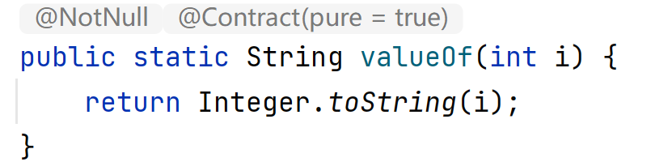
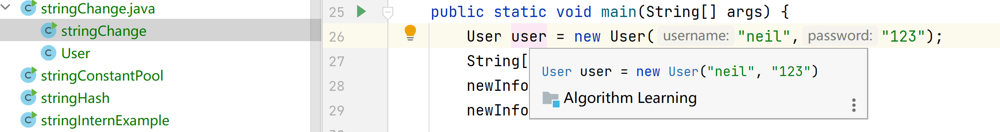
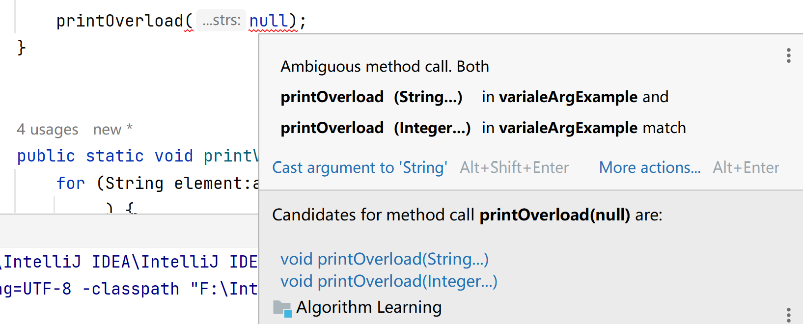
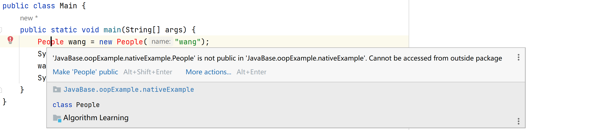
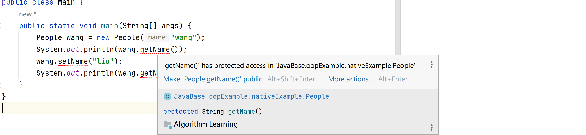

# Java基础

## 基础语法

### Abstract

#### 1.abstract 是什么？

`abstract` 是 Java 中的一个关键字，用来声明**抽象类**和**抽象方法**。

**①. 抽象类**

- 用 `abstract` 修饰的类
- **不能直接创建对象**（不能实例化）
- 可以有抽象方法和普通方法

**②. 抽象方法**

- 用 `abstract` 修饰的方法
- **只有方法声明，没有方法体**（没有大括号和实现）
- 必须被子类实现（除非子类也是抽象类）


#### 2.为什么要使用 abstract？

主要目的是**代码设计和规范**：

**①. 定义规范框架**

```java
abstract class Animal {
    // 所有动物都会叫，但叫声不同
    public abstract void makeSound();
}
```

告诉子类：“你必须实现 makeSound 方法，但具体怎么叫你自己决定”


**②.代码复用**

抽象类可以包含具体方法，子类可以直接使用

```java
abstract class Animal {
    // 抽象方法
    public abstract void makeSound();
    
    // 具体方法 - 所有动物共享
    public void eat() {
        System.out.println("吃东西");
    }
}
```


**③. 实现多态**

```java
Animal dog = new Dog();  // 抽象类引用指向具体子类
Animal cat = new Cat();
```


------

### Byte

用于表示一个 8 位（1 字节）有符号整数。它的值范围是 -128（-2^7）到 127（2^7 - 1）。

由于 byte 类型占用的空间较小，它通常用于处理大量的数据，如文件读写、网络传输等场景，以节省内存空间。

```java
byte minByte = -128;
byte maxByte = 127
```

---


### 基本数据类型

Java 中的数据类型可分为 2 种：

1）**基本数据类型**:

基本数据类型是 Java 语言操作数据的基础，包括 boolean、char、byte、short、int、long、float 和 double，共 8 种。

2）**引用数据类型**。

除了基本数据类型以外的类型，都是所谓的引用类型。常见的有[数组](https://javabetter.cn/array/array.html)（对，没错，数组是引用类型，后面我们会讲）、class（也就是[类](https://javabetter.cn/oo/object-class.html)），以及[接口](https://javabetter.cn/oo/interface.html)（指向的是实现接口的类的对象）。


[变量](https://javabetter.cn/oo/var.html)可以分为局部变量、成员变量、静态变量。

当变量是局部变量的时候，必须得先初始化，否则编译器不允许你使用它。拿 


#### 引用数据类型

基本数据类型在作为成员变量和静态变量的时候有默认值，引用数据类型也有的（学完数组&字符串，以及面向对象编程后会更加清楚，这里先简单过一下）。

[String](https://javabetter.cn/string/immutable.html) 是最典型的引用数据类型.

是不是很好奇，为什么[数组](https://javabetter.cn/array/array.html)和[接口](https://javabetter.cn/oo/interface.html)也是引用数据类型啊？

先来看数组：

```java
int [] arrays = {1,2,3};
System.out.println(arrays);
```

arrays 是一个 int 类型的数组，对吧？打印结果如下所示：

```java
[I@723279cf
```

`[I` 表示数组是 int 类型的，@ 后面是十六进制的 hashCode——这样的打印结果太“人性化”了，一般人表示看不懂！为什么会这样显示呢？查看一下 `java.lang.Object` 类的 `toString()` 方法就明白了。

```java
public String toString() {
        return getClass().getName() + "@" + Integer.toHexString(hashCode());
    }
```


数组虽然没有显式定义成一个类，但它的确是一个对象，继承了祖先类 Object 的所有方法。那为什么数组不单独定义一个类来表示呢？就像字符串 String 类那样呢？

一个合理的解释是 Java 将其隐藏了。假如真的存在一个 Array.java，我们也可以假想它真实的样子，它必须要定义一个容器来存放数组的元素，就像 String 类那样。


#### 拓展:包装类

在 Java 中，数据被分成了两大家族：**基本数据类型**（Primitive Types）和**包装类**（Wrapper Classes）。

简单来说，包装类就是将基本数据类型“包装”起来，使其具有**对象**的特征。

| **基本类型**                      | **对应的包装类**                          |
| --------------------------------- | ----------------------------------------- |
| `byte` / `short` / `int` / `long` | `Byte` / `Short` / **`Integer`** / `Long` |
| `float` / `double`                | `Float` / `Double`                        |
| `char`                            | **`Character`**                           |
| `boolean`                         | `Boolean`                                 |

**1.为什么需要设计包装类?**

既然已经有了性能极高的“基本数据类型”，为什么还要费劲搞出一套“包装类”呢？核心原因有三个：

**① 为了让基本类型“面向对象”**

Java 的口号是“万物皆对象”，但基本类型（`int`, `double` 等）打破了这个规则。

- **集合框架不支持基本类型：** 比如你常用的 `ArrayList`、`HashMap`。它们只能存储对象（`Object`）。如果你想存一串数字，你不能写 `ArrayList<int>`，必须写 `ArrayList<Integer>`。
- **泛型限制：** 泛型（`T`）只能代表引用类型，不支持基本类型。


**② 提供了更多实用的工具方法**

基本类型只是一个单纯的“数字”，而包装类像是一个“工具箱”。

- **类型转换：** 比如把字符串转成数字 `Integer.parseInt("123")`。
- **进制转换：** `Integer.toHexString(255)` 转成十六进制。
- **范围查询：** `Integer.MAX_VALUE` 告诉你 `int` 最大能存多少。


**③ 处理 `null` 的需求（非常关键）**

- **基本类型：** 必须有一个值（比如 `int` 默认是 $0$）。
- **包装类：** 作为对象，它可以是 `null`。
- **应用场景：** 在数据库里，一个“年龄”字段可能是空的。如果你用 `int` 接收，它会变成 $0$（误导）；如果你用 `Integer`，它就是 `null`，准确表达了“未知”。


**为什么基本类型不需要 `new`？**

基本数据类型（如 `int a = 10;`）是 Java 为了**性能**而保留的特例。

- **存储位置：** 基本类型的值直接存储在**栈（Stack）**中。
- **分配效率：** 栈内存的分配是极快的。当你声明 `int a = 10` 时，JVM 只是在栈里划出 4 个字节的空间，把数字 `10` 丢进去。
- **不是对象：** 它们没有方法（你不能写 `a.toString()`），也没有复杂的类结构。因此，它们不需要通过 `new` 在堆中创建复杂的对象结构。


**为什么包装类可以（且曾经必须）用 `new`？**

包装类本质上是一个普通的 **Java 类**。既然是类，它就遵循对象的规则：

- **存储位置：** 对象存储在**堆（Heap）**中。
- **创建方式：** 在 Java 的规则里，创建一个存放在堆上的对象，标准做法就是使用 `new` 关键字（调用构造函数）。
- **功能强大：** 包装类提供了很多基本类型没有的功能。
  - **集合支持：** Java 的集合（如 `ArrayList`）只能存对象，不能存 `int`。所以你必须用 `ArrayList<Integer>`。
  - **包含方法：** 你可以调用 `Integer.parseInt("123")` 等内置方法。
  - **可以为 null：** 基本类型 `int` 必须有值（默认 0），但包装类 `Integer` 可以是 `null`，这在数据库开发中非常有用（表示“无数据”）。


**为什么现在不推荐 `new` 了？**

正如之前看到的报错，现在 Java 强烈建议不要写 `new Integer(10)`，而是写 `Integer.valueOf(10)` 或直接 `Integer i = 10`。

这是因为：

1. **`new` 每次都强制开辟新内存：** 即使两个 `new Integer(10)` 值一样，它们也是堆上两个不同的垃圾。
2. **缓存池优化：** `Integer.valueOf(10)` 会优先从缓存池拿现成的对象（-128 到 127 之间）。这比 `new` 快得多，也省内存`Integer.valueOf(300)` 缓存池里没有，会自动 `new` 


### 堆（heap）和栈（stack）

堆是在程序运行时在内存中申请的空间（可理解为动态的过程）；切记，不是在编译时；因此，Java 中的对象就放在这里，这样做的好处就是：

> 当需要一个对象时，只需要通过 new 关键字写一行代码即可，当执行这行代码时，会自动在内存的“堆”区分配空间——这样就很灵活。


栈，能够和处理器（CPU，也就是脑子）直接关联，因此访问速度更快。既然访问速度快，要好好利用啊！Java 就把对象的引用放在栈里。为什么呢？因为引用的使用频率高吗？

>  Java 在编译程序时，必须明确的知道存储在栈里的东西的生命周期，否则就没法释放旧的内存来开辟新的内存空间存放引用——空间就那么大，前浪要把后浪拍死在沙滩上啊。


| **特性**     | **栈（Stack）**                                      | **堆（Heap）**                           |
| ------------ | ---------------------------------------------------- | ---------------------------------------- |
| **存放内容** | 局部变量（基本类型）、方法调用信息、**对象的引用**。 | **所有对象（`new` 出来的）**、数组。     |
| **分配方式** | **自动分配**和释放。由 JVM 自动管理。                | **动态分配**。需要用 `new` 关键字创建。  |
| **生命周期** | 随着方法的调用结束而销毁。                           | 由垃圾回收器（GC）自动回收，生命周期长。 |
| **存取速度** | **快**。操作简单，像堆叠盘子。                       | **慢**。需要通过地址查找，有额外开销。   |
| **空间大小** | 较小，有限制。                                       | 较大，是程序的主要内存区域。             |


### Catch

用于捕获 try 语句中的[异常](https://javabetter.cn/exception/gailan.html)(具体情况后面会讨论)。在 try 块中可能会抛出异常，而在 catch 块中可以捕获这些异常并进行处理。catch 块可以有多个，每个 catch 块可以捕获特定类型的异常。在 catch 块中，可以根据需要进行异常处理，例如输出错误信息、进行日志记录、恢复程序状态等。

------

### 异常

#### 异常定义

异常是指中断程序正常执行的一个不确定的事件。当异常发生时，程序的正常执行流程就会被打断。一般情况下，程序都会有很多条语句，如果没有异常处理机制，前面的语句一旦出现了异常，后面的语句就没办法继续执行了。”

“有了异常处理机制后，程序在发生异常的时候就不会中断，我们可以对异常进行捕获，然后改变程序执行的流程。”


#### Exception  和 Error 的区别:

Error 的出现，意味着程序出现了严重的问题，而这些问题不应该再交给 Java 的异常处理机制来处理，程序应该直接崩溃掉，比如说 OutOfMemoryError，内存溢出了，这就意味着程序在运行时申请的内存大于系统能够提供的内存，导致出现的错误，这种错误的出现，对于程序来说是致命的。

Exception 的出现，意味着程序出现了一些在可控范围内的问题，我们应当采取措施进行挽救。


#### checked和unchecked异常

checked 异常（检查型异常）在源代码里必须显式地捕获或者抛出，否则编译器会提示你进行相应的操作(**编译器要求你必须处理的异常**)；

而 unchecked 异常（非检查型异常）就是所谓的运行时异常，通常是可以通过编码进行规避的，并不需要显式地捕获或者抛出(**编译器不强制你处理的异常**)

思维导图如下:


首先，Exception 和 Error 都继承了 Throwable 类。换句话说，只有 Throwable 类（或者子类）的对象才能使用 throw 关键字抛出，或者作为 catch 的参数类型。

<span style = "color : orange;">面试中经常问到的一个问题是，NoClassDefFoundError 和 ClassNotFoundException 有什么区别？</span>

它们都是由于系统运行时找不到要加载的类导致的，但是触发的原因不一样。

- NoClassDefFoundError：程序在编译时可以找到所依赖的类，但是在运行时找不到指定的类文件，导致抛出该错误；原因可能是 jar 包缺失或者调用了初始化失败的类。
- ClassNotFoundException：当动态加载 Class 对象的时候找不到对应的类时抛出该异常；原因可能是要加载的类不存在或者类名写错了。

其次，像 IOException、ClassNotFoundException、SQLException 都属于 checked 异常；

像 RuntimeException 以及子类 ArithmeticException、ClassCastException、ArrayIndexOutOfBoundsException、NullPointerException，都属于 unchecked 异常。


注意打印异常堆栈信息的 `printStackTrace()` 方法，该方法会将异常的堆栈信息打印到标准的控制台下，如果是测试环境，这样的写法还 OK，如果是生产环境，这样的写法是不可取的，必须使用日志框架把异常的堆栈信息输出到日志系统中，否则可能没办法跟踪。

翻译过来就是在开发时可以用 `printStackTrace()` 看到错误，但真正上线运行的系统必须用日志记录异常，否则出问题时根本找不到原因。

---


<span style ="color : green" >🚩 争议点:</span>

checked 异常在业界是有争论的，它假设我们捕获了异常，并且针对这种情况作了相应的处理，但有些时候，根本就没法处理。

例如:

```java
try {
    Class.forName("com.example.MyClass");
} catch (ClassNotFoundException e) {
    e.printStackTrace();
}
```

如果真的出现 ClassNotFoundException，还能怎么处理？

难道你能动态去网上下载这个类？

难道你能“修复”classpath？

难道你能自动创建一个类？

难道你能提示用户去重启 JVM？

所以争议点在于checked 异常强迫开发者使用 try-catch，但实际上 catch 了也处理不了

--------------------------------

不过Checked 异常的价值取决于：
该异常是否是“能够被业务逻辑正常处理的可恢复错误”。

换句话说：

- 能靠代码恢复的 → 适合 checked
- 人类/操作系统才能解决 → 不适合 checked

这是关键。


✔ 有些 checked 异常是鸡肋（不能处理还强制你 try-catch）

如：

- ClassNotFoundException
- SQLException（大多数不可恢复）
- InterruptedException（必须 catch 很烦）

这些 catch 了你也干不了什么，只会污染代码。

------

✔ 有些 checked 异常是非常合理的（真的应该处理）

如：

- IOException（网络 + IO 操作）
- FileNotFoundException（可以让用户选择文件）
- SocketException（网络可重试）

这些异常确实是“可恢复”的。


**总之:**

Checked 异常适用于“可以预料并通过代码优雅恢复”的场景。
Unchecked 异常适用于“代码无法恢复、必须中断执行”的场景(这些异常的出现往往是 **程序逻辑错误** 或 **不可恢复的状态**，用 try-catch 捕获没有意义。)


#### try-catch-finally

值得注意的是如果一些代码确定不会抛出异常，就尽量不要把它包裹在 `try` 块里，因为加了异常处理的代码执行起来要比没有加的花费更多的时间。


一个 `try` 块后面可以跟多个 `catch` 块，用来捕获不同类型的异常并做相应的处理，当 try 块中的某一行代码发生异常时，之后的代码就不再执行，而是会跳转到异常对应的 catch 块中执行。

try-catch之后用`finally`用于执行任何必要的清理操作，无论 `try` 块中的代码是否发生异常，它都保证会被执行。


如果一个 try 块后面跟了多个与之关联的 catch 块，那么应该把特定的异常放在前面，通用型的异常放在后面，不然编译器会提示错误。举例来说。


**核心作用：资源的释放**

`finally` 最重要的用途是确保资源被正确释放，例如：

- 关闭文件流（`FileInputStream`, `FileWriter` 等）
- 关闭数据库连接（`Connection`, `Statement` 等）
- 释放网络连接
- 关闭 `Scanner` 对象（就像我们前面讨论的那样）

**执行保证**

`finally` 块的执行机制非常可靠，它会在以下任何情况发生后执行：

1. `try` 块正常执行完毕。
2. `try` 块抛出异常，并被匹配的 `catch` 块捕获。
3. `try` 块抛出异常，但没有被任何 `catch` 块捕获。
4. 在 `try` 或 `catch` 块中执行了 `return`、`break` 或 `continue` 语句（但 `finally` 会在这些跳转发生之前执行）。


使用 finally 块的时候需要遵守这些规则

- finally 块前面必须有 try 块，不要把 finally 块单独拉出来使用。编译器也不允许这样做。
- finally 块不是必选项，有 try 块的时候不一定要有 finally 块。
- 如果 finally 块中的代码可能会发生异常，也应该使用 try-catch 进行包裹。
- 即便是 try 块中执行了 return、break、continue 这些跳转语句，finally 块也会被执行。


---


#### 关于 throw 和 throws

1️⃣ `throw` —— **执行动作**,抛出一个具体的异常对象

**作用**：在方法体内部**抛出一个异常实例**，用于告诉 JVM 或调用者“出现错误了”。

当程序运行到一个逻辑上不应该继续执行的状态时（比如你的除数是 0，或者账户余额是负数），程序员可以使用 `throw` 来中断当前流程，并通知系统/调用者：“**这里出错了！**”

```java
public void divide(int a, int b) {
    if (b == 0) {
        throw new ArithmeticException("除数不能为0"); // 抛出异常对象
    }
    System.out.println(a / b);
}

```

**特点**：

1. `throw` 后面必须跟一个**异常对象**（如 `new ExceptionType()`）
2. 抛出异常后，当前方法会立即停止执行
3. 可以抛 **checked** 或 **unchecked** 异常


 📢 **比喻：**就像一个士兵发现敌人后，**拉响警报**（`throw`），并把记录有敌人位置、数量等信息的报告（异常对象）扔给指挥中心。


2️⃣**`throws` —— 事先声明,声明方法可能抛出的异常类型**

**作用**：告诉方法的调用者“这个方法可能会抛出这些异常，需要处理”。

`throws` 是给方法的**调用者**看的。它告诉调用者：“**我这个方法有风险，可能会抛出这些异常，你调用我的时候需要准备好处理它们。**” 它是 Java 强制要求的一种异常处理机制。

```java
public void readFile(String path) throws IOException {
    FileReader fr = new FileReader(path); // 可能抛出 IOException
}
```

**特点**：

1. 用在**方法声明上**
2. 后面跟异常类型，不是对象
3. 只能用于**checked 异常**，unchecked 异常可不写


⚠️ **比喻：** 就像在危险区域入口立一个**警告牌**（`throws`），告诉所有进入该区域的人：“这里可能会有地雷（异常），请做好处理准备。”


3️⃣ throw vs throws 的核心区别

| 对比点            | throw                | throws                                      |
| ----------------- | -------------------- | ------------------------------------------- |
| 用法位置          | 方法内部             | 方法声明                                    |
| 后面跟什么        | 异常对象实例         | 异常类型                                    |
| 是否终止方法      | 是，抛出异常立即终止 | 否，只是声明给调用者                        |
| checked/unchecked | 都可                 | 主要是 checked 异常，unchecked 可以不用声明 |

可以将 `throw` 理解为**制造**（或确认）问题，而 `throws` 是**报告**（或声明）问题。


### 运算符

#### 位运算符


```java
int a = 60, b = 13;
System.out.println("a 的二进制：" + Integer.toBinaryString(a)); // 111100
System.out.println("b 的二进制：" + Integer.toBinaryString(b)); // 1101

int c = a & b;
System.out.println("a & b：" + c + "，二进制是：" + Integer.toBinaryString(c));

c = a | b;
System.out.println("a | b：" + c + "，二进制是：" + Integer.toBinaryString(c));

c = a ^ b;
System.out.println("a ^ b：" + c + "，二进制是：" + Integer.toBinaryString(c));

c = ~a;
System.out.println("~a：" + c + "，二进制是：" + Integer.toBinaryString(c));

c = a << 2;
System.out.println("a << 2：" + c + "，二进制是：" + Integer.toBinaryString(c));

c = a >> 2;
System.out.println("a >> 2：" + c + "，二进制是：" + Integer.toBinaryString(c));

c = a >>> 2;
System.out.println("a >>> 2：" + c + "，二进制是：" + Integer.toBinaryString(c));
```


#### 前自增和后自增

虽然在代码中 `i++` 和 `++i` 看起来只是位置不同，但在 **JVM 内部的执行过程**（也就是在**栈**中的操作顺序）是有本质区别的。

简单来说：

- **前自增 (`++i`)**：**先加 1，后赋值/使用**。（先改变自己，再参与运算）
- **后自增 (`i++`)**：**先赋值/使用，后加 1**。（先参与运算，后改变自己）


从内存中**局部变量表**和**操作数栈**的角度来看看它们发生了什么：

**前自增 (`++i`)**

1. 变量直接在局部变量表中加 $1$。
2. 将加 $1$ 后的新值压入操作数栈。
3. **结果：** 你拿到的是增加后的值。

**后自增 (`i++`)**

1. 先将变量当前的旧值压入操作数栈。
2. 变量在局部变量表中加 $1$。
3. **结果：** 你在当前表达式中拿到的还是旧值，但变量本身已经偷偷变大了。


```java
public static void main(String[] args) {
    // 案例 1：前自增
    int a = 10;
    int b = ++a; 
    System.out.println("a = " + a); // a = 11
    System.out.println("b = " + b); // b = 11 (b 拿到了加完之后的值)

    // 案例 2：后自增
    int x = 10;
    int y = x++;
    System.out.println("x = " + x); // x = 11
    System.out.println("y = " + y); // y = 10 (y 拿到了加之前的旧值)
}
```


#### &|与&&||

**位运算符（&, |）** 和 **短路逻辑运算符（&&, ||）**

**1. 核心区别：短路效应 (Short-Circuit)**

这是它们最重要的区别。

**&& 和 || （短路运算符）**

它们非常“聪明”。如果左边的表达式已经能决定最终结果，它们就**不再计算右边的表达式**。

- **`&&` (短路与)：** 如果左边为 `false`，结果必定为 `false`，所以**右边不再执行**。
- **`||` (短路或)：** 如果左边为 `true`，结果必定为 `true`，所以**右边不再执行**。

**& 和 | （逻辑/位运算符）**

它们比较“死板”。无论左边的表达式结果是什么，**两边的表达式都会被完整计算**。


**2. 为什么要用短路运算符？（安全性）**

在 Java 开发中，短路运算符 `&&` 经常被用来防止 **空指针异常 (NullPointerException)**。

**代码对比：**

Java

```java
String s = null;

// ✅ 使用 && (安全)
if (s != null && s.length() > 0) {
    // 因为 s != null 为 false，&& 直接跳过右边，程序不会报错
}

// ❌ 使用 & (程序崩溃)
if (s != null & s.length() > 0) {
    // 即使 s != null 为 false，它依然会去计算 s.length()
    // 此时会对 null 调用方法，直接抛出 NullPointerException！
}
```


**3. 它们还可以做位运算**

这是 `&` 和 `|` 的另一副面孔：当操作数不是 `boolean` 而是 `int` 等数字时，它们变成了**位运算符**。

- **`&` (按位与)：** 只有两个二进制位都是 1，结果才是 1。
- **`|` (按位或)：** 只要有一个二进制位是 1，结果就是 1。

**例子：**

```java
int a = 5; // 二进制: 0101
int b = 3; // 二进制: 0011

int resultAnd = a & b; // 结果: 0001 (即 1)
int resultOr = a | b;  // 结果: 0111 (即 7)
```

*注意：`&&` 和 `||` 只能用于 `boolean` 类型，不能用于数字的位运算。*


**4. 总结对比表**

| **运算符** | **名称**  | **适用类型**      | **是否短路**      | **常用场景**                   |
| ---------- | --------- | ----------------- | ----------------- | ------------------------------ |
| **`&&`**   | 短路与    | 仅 `boolean`      | **是**            | 条件判断（最常用，安全高效）   |
| **`&`**    | 逻辑/位与 | `boolean` 或 数字 | 否                | 位运算、必须执行两边逻辑的情况 |
| **`        |           | `**               | 短路或            | 仅 `boolean`                   |
| **`        | `**       | 逻辑/位或         | `boolean` 或 数字 | 否                             |


**建议**

在写业务逻辑（比如 `if` 语句）时，**请始终优先使用 `&&` 和 `||`**。这不仅能提高运行效率，还能避免很多潜在的逻辑错误。


### 流程控制语句

#### switch 语句

switch 语句用来判断变量与多个值之间的相等性。变量的类型可以是：

- byte、short、char、int：基本整数类型。
- String：[字符串](https://javabetter.cn/string/immutable.html)类型。
- 枚举类型：自定义的[枚举](https://javabetter.cn/basic-extra-meal/enum.html)类型。
- 包装类：如 Byte、Short、Character、Integer。

来看一下 switch 语句的格式：

```java
switch(变量) {    
case 可选值1:    
 // 可选值1匹配后执行的代码;    
 break;  // 该关键字是可选项
case 可选值2:    
 // 可选值2匹配后执行的代码;    
 break;  // 该关键字是可选项
......    
    
default: // 该关键字是可选项     
 // 所有可选值都不匹配后执行的代码 
}
```

- 变量可以有 1 个或者 N 个值。
- 值类型必须和变量类型是一致的，并且值是确定的。
- 值必须是唯一的，不能重复，否则编译会出错。
- break 关键字是可选的，如果没有，则执行下一个 case，如果有，则跳出 switch 语句。
- default 关键字也是可选的。


示例

```java
int age = 20;
switch (age) {
    case 20 :
        System.out.println("上学");
        break;
    case 24 :
        System.out.println("苏州工作");
        break;
    case 30 :
        System.out.println("洛阳工作");
        break;
    default:
        System.out.println("未知");
        break; // 可省略
}
```


当两个值要执行的代码相同时，可以把要执行的代码写在下一个 case 语句中，而上一个 case 语句中什么也没有，这种写法在 Java 中被称为 **"Case Fall-through"（case 穿透）**。来看一下示例：

```java
String name = "沉默王二";
switch (name) {
        //......
case "沉默王二":
case "沉默王三":
    System.out.println("乒乓球爱好者");
    break;
```

- 当 `name` 是 `"沉默王二"` 时：程序找到了第一个入口。由于这一行后面没有任何代码，它会**直接“掉”到**下一行。

- 进入 `"沉默王三"` 的地盘：程序继续执行，直到它看到了 `System.out.println` 和最重要的 `break`。

- **结果**：无论是王二还是王三，最终执行的都是同一段逻辑。


这种“堆叠” case 的写法非常实用，主要优点是：

- **减少重复代码**：当多个条件对应同一个结果时（比如：周一到周五都输出“工作日”），你不需要写五次同样的 `println`。
- **逻辑清晰**：一眼就能看出哪些分类是属于同一组的。


 **现代 Java 的新姿势 (Java 12+)**

如果觉得这种堆叠方式还是有点啰嗦，现代 Java 提供了一种更简洁的 **Switch Expression（开关表达式）**，使用 `->` 符号，效果完全一样但更直观：

```java
// 这是 Java 12 之后推荐的写法
switch (name) {
    case "詹姆斯" -> System.out.println("篮球运动员");
    case "穆里尼奥" -> System.out.println("足球教练");
    case "沉默王二", "沉默王三" -> System.out.println("乒乓球爱好者"); // 直接逗号隔开
    default -> throw new IllegalArgumentException("名字没有匹配项");
}
```

*这种写法不需要写 `break`，因为它默认就是不穿透的。*


#### 枚举(enumerate)

```java
public class SwitchEnumDemo {
    public enum PlayerTypes {
        TENNIS,
        FOOTBALL,
        BASKETBALL,
        UNKNOWN
    }

    public static void main(String[] args) {
        System.out.println(createPlayer(PlayerTypes.BASKETBALL));
    }

    private static String createPlayer(PlayerTypes playerType) {
        switch (playerType) {
            case TENNIS:
                return "网球运动员费德勒";
            case FOOTBALL:
                return "足球运动员C罗";
            case BASKETBALL:
                return "篮球运动员詹姆斯";
            case UNKNOWN:
                throw new IllegalArgumentException("未知");
            default:
                throw new IllegalArgumentException(
                        "运动员类型: " + playerType);

        }
    }
}
```

但 switch 不支持 long、float、double 类型，这是因为：

- long 是 64 位整数，不在 switch 一开始设计的范围内（32 位的 int 在大多数情况下就够用了）。
- float 和 double 是浮点数，浮点数的比较不如整数简单和直接，存在精度误差。


#### For循环

**1.for-each**

```java
for(元素类型 元素 : 数组或集合){  
// 要执行的代码
}
```

例如:

```java
String [] strs = {"neil","leo","Nio"};

        for(String str : strs){
            System.out.println(str);
        }
```


**2.无限 for 循环**

```java
for(;;){
    System.out.println("xxx");
}
```

一旦运行起来，就停不下来了，除非强制停止。


#### continue

当我们需要在 for 循环或者 （do）while 循环中立即跳转到下一个循环时，就可以使用 continue 关键字，通常用于跳过指定条件下的循环体，如果循环是嵌套的，仅跳过当前循环。

来个示例：

```java
for (int i = 1; i <= 10; i++) {
    if (i == 5) {
        // 使用 continue 关键字
        continue;// 5 将会被跳过
    }
    System.out.println(i);
}
```


## 数组与字符串

### 1.数组

#### 数组的声明与初始化

先来看第一种：

```java
int[] anArray;
```

再来看第二种：

```java
int anOtherArray[];
```

不同之处就在于中括号的位置，是跟在类型关键字的后面，还是跟在变量的名称的后面。前一种的使用频率更高一些，像 ArrayList 的源码中就用了第一种方式。

同样的，数组的初始化方式也有多种，最常见的是：

```java
int[] anArray = new int[10];
```

上面这行代码中使用了 new 关键字，这就意味着数组的确是一个对象，只有对象的创建才会用到 new 关键字，[基本数据类型](https://javabetter.cn/basic-grammar/basic-data-type.html)是不用的（基本数据的包装类型是可以 new 的，包装类型就是对象）。然后，我们需要在方括号中指定数组的长度。

这时候，数组中的每个元素都会被初始化为默认值，int 类型的就为 0，Object 类型的就为 null。 不同数据类型的默认值不同，可以参照[之前的文章](https://javabetter.cn/basic-grammar/basic-data-type.html)。

另外，还可以使用大括号的方式，直接初始化数组中的元素：

```java
int anOtherArray[] = new int[] {1, 2, 3, 4, 5};
```

这时候，数组的元素分别是 1、2、3、4、5，索引依次是 0、1、2、3、4，长度是 5。

#### 数组的常用操作

过索引来访问数组的元素

```java
anArray[0] = 10;
```

变量名，加上中括号，加上元素的索引，就可以访问到数组，通过“=”操作符可以对元素进行赋值。

如果索引的值超出了数组的界限，就会抛出 `ArrayIndexOutOfBoundException`。由于数组的索引是从 0 开始，所以最大索引为 `length - 1`，不要使用超出这个范围内的索引访问数组，否则就会抛出数组越界的异常了。

比如说你声明了一个大小为 10 的数组，你用索引 10 来访问数组，就会抛出这个异常。因为数组的索引是从 0 开始的，所以数组的最后一个元素的索引是 `length - 1`，也就是 9。

当数组的元素非常多的时候，逐个访问数组就太辛苦了，所以需要通过遍历的方式。

第一种，使用 for 循环：

```java
int anOtherArray[] = new int[] {1, 2, 3, 4, 5};
for (int i = 0; i < anOtherArray.length; i++) {
    System.out.println(anOtherArray[i]);
}
```

通过 length 属性获取到数组的长度，然后从 0 开始遍历，就得到了数组的所有元素。

第二种，使用 for-each 循环：

```java
int anOtherArray[] = new int[] {1, 2, 3, 4, 5};

for (int i:anOtherArray){
    System.out.println(i);
}
```

如果不需要关心索引的话（意味着不需要修改数组的某个元素），使用 for-each 遍历更简洁一些。当然，也可以使用 while 和 do-while 循环

#### **可变参数与数组**

在 Java 中，**可变参数（Varargs，全称 Variable Arguments）** 是从 Java 5 开始引入的一个特性。它允许你在调用方法时，传入**任意数量**的参数（甚至是 0 个）。

简单来说，可变参数让你的方法变得更“灵活”，不再被死板的参数个数所限制。

在方法的声明中，在**数据类型**后面加上三个点（`...`）：

```java
public void 方法名(数据类型... 参数名) {
    // 方法体
}
```

假设我们要写一个求和的方法，如果不确定用户会传几个数字进来：

```java
public class VarargsExample {
    public static void main(String[] args) {
        // 可以传 2 个参数
        System.out.println(sum(1, 2));
        
        // 可以传 5 个参数
        System.out.println(sum(10, 20, 30, 40, 50));
        
        // 甚至可以不传参数
        System.out.println(sum()); 
    }

    // int... 代表可以接收 0 到多个 int 类型的参数
    public static int sum(int... numbers) {
        int total = 0;
        // 在方法内部，numbers 被当作【数组】来处理
        for (int n : numbers) {
            total += n;
        }
        return total;
    }
}
```


 **可变参数的本质：数组**

当你看到 `int... numbers` 时，Java 编译器在底层其实偷偷地把它转换成了 `int[] numbers`。

- **调用时**：编译器会自动把你传入的多个参数打包成一个数组。
- **执行时**：方法体内部完全按照操作数组的方式来处理这些参数。


**使用规则（必须遵守）**

虽然可变参数很方便，但为了避免歧义，Java 对它有两条严格的限制：

**① 一个方法只能有一个可变参数**

不能写成 `public void test(int... a, String... b)`，这会导致编译器不知道哪些参数属于 a，哪些属于 b。

**② 可变参数必须是参数列表的最后一个**

如果方法有多个参数，可变参数必须放在最后。

- **❌ 错误写法**：`public void test(int... nums, String name)` （编译器会报错）
- **✅ 正确写法**：`public void test(String name, int... nums)`

**原因**：Java 在匹配参数时是从左往右看的。如果可变参数在前面，它会“吞掉”后面所有的参数，导致后面的 `name` 拿不到值。

------

**5. 可变参数 vs 数组参数**

你可能会问：“那我直接定义一个数组参数 `sum(int[] numbers)` 不行吗？”

区别在于**调用的便利性**：

- **数组参数**：调用时必须手动创建一个数组，如 `sum(new int[]{1, 2, 3})`。
- **可变参数**：直接写 `sum(1, 2, 3)` 即可，代码更简洁、可读性更好。


#### 数组与 List

在 Java 中，数组与 List 关系非常密切。List 封装了很多常用的方法，方便我们对集合进行一些操作，而如果直接操作数组的话，有很多不便，因为数组本身没有提供这些封装好的操作，所以有时候我们需要把数组转成 List。

> List 会在[集合框架](https://javabetter.cn/collection/arraylist.html)一节详细介绍，这里先来个开胃菜，方便大家回头过来复盘。

最原始的方式，就是通过遍历数组的方式，一个个将数组添加到 List 中。

```java
int[] anArray = new int[] {1, 2, 3, 4, 5};

List<Integer> aList = new ArrayList<>();
for (int element : anArray) {
    aList.add(element);
}
```

更优雅的方式是通过 [Arrays 类](https://javabetter.cn/common-tool/arrays.html)（戳链接了解详情）的 `asList()` 方法：

```JAVA
List<Integer> aList = Arrays.asList(anArray);
```

不过需要注意的是，Arrays.asList 的参数需要是 Integer 数组，而 anArray 目前是 int 类型。

可以这样写：

```JAVA
List<Integer> aList1 = Arrays.asList(1, 2, 3, 4, 5);
```

或者换另外一种方式

```JAVA
List<Integer> aList = Arrays.stream(anArray).boxed().collect(Collectors.toList());
```

这又涉及到了 [Java 流](https://javabetter.cn/java8/stream.html)的知识，戳链接了解。

还有一个需要注意的是，Arrays.asList 方法返回的 ArrayList 并不是 `java.util.ArrayList`，它其实是 Arrays 类的一个内部类：

```java
private static class ArrayList<E> extends AbstractList<E>
        implements RandomAccess, java.io.Serializable{}
```

如果需要添加元素或者删除元素的话，需要把它转成 `java.util.ArrayList`。

```java
new ArrayList<>(Arrays.asList(anArray));
```

Java 8 新增了 [Stream 流](https://javabetter.cn/java8/stream.html)的概念，这就意味着我们也可以将数组转成 Stream 进行操作。

```java
String[] anArray = new String[] {"沉默王二", "一枚有趣的程序员", "好好珍重他"};
Stream<String> aStream = Arrays.stream(anArray);
```


#### 数组的排序与查找

如果想对数组进行排序的话，可以使用 Arrays 类提供的 `sort()` 方法。

- 基本数据类型按照升序排列
- 实现了 Comparable 接口的对象按照 `compareTo()` 的排序

来看第一个例子：

```java
int[] anArray = new int[] {5, 2, 1, 4, 8};
Arrays.sort(anArray);
```

排序后的结果如下所示：

```
[1, 2, 4, 5, 8]
```

<span style = "color:red">注意:此时`anArray` 变量指向的那块**堆内存区域**里的数据被彻底挪动了,所以执行了`Arrays.sort`后`anArray`内部就已经是[1,2,4,5,8]了</span>


来看第二个例子：

```sql
String[] yetAnotherArray = new String[] {"A", "E", "Z", "B", "C"};
Arrays.sort(yetAnotherArray, 1, 3,
                Comparator.comparing(String::toString).reversed());
```

只对 1-3 位置上的元素进行反序，所以结果如下所示：

```java
[A, Z, E, B, C]
```


------

<span style="color:teal">知识点</span>

`Arrays.sort()` 不仅能排整个数组，还能排**指定的区间**。

- **参数解析**：`Arrays.sort(数组, fromIndex, toIndex, ...)`
- **你的代码**：`1, 3` 表示从索引 `1` 开始，到索引 `3` **之前**结束。
- **规则**：**左闭右开** $[1, 3)$。也就是说，它只处理索引为 `1` 和 `2` 的元素，索引 `3` 及其之后的元素保持不动。


**`Comparator.comparing` (比较器)**

这是 Java 8 引入的函数式编程写法，用于定义**排序规则**。

- `String::toString`：这是一个**方法引用**(匿名内部类的终极版)。它告诉 Java：“请使用 String 对象的 `toString()` 方法返回的结果来进行比较。”
- 虽然对字符串来说直接比较就行，但这种写法在处理复杂对象（比如 `User::getName`）时非常强大。


**`.reversed()` (逆序排列)**

默认情况下，`Arrays.sort` 是**升序**（A -> Z）。

- 加上 `.reversed()` 后，排序规则反转，变成了**降序**（Z -> A）。

---


有时候，我们需要从数组中查找某个具体的元素，最直接的方式就是通过遍历的方式：

```sql
int[] anArray = new int[] {5, 2, 1, 4, 8};
for (int i = 0; i < anArray.length; i++) {
    if (anArray[i] == 4) {
        System.out.println("找到了 " + i);
        break;
    }
}
```

上例中从数组中查询元素 4，找到后通过 break 关键字退出循环。

如果数组提前进行了排序，就可以使用二分查找法，这样效率就会更高一些。`Arrays.binarySearch()` 方法可供我们使用，它需要传递一个数组，和要查找的元素。

```sql
int[] anArray = new int[] {1, 2, 3, 4, 5};
int index = Arrays.binarySearch(anArray, 4);

//或者也可以
int [] arrayList = {7,5,1,4,2,3,6};
Arrays.sort(arrayList);

int index = Arrays.binarySearch(arrayList,2);
System.out.println(index);
```

“除了一维数组，还有[二维数组](https://javabetter.cn/array/double-array.html)，比如说用二维数组打印一下杨辉三角，我们下一节会讲。”


#### 数组的复制

有时候我们需要将一个数组的值复制到另外一个数组当中，那就会涉及到数组复制的知识点。

在 [String 类](https://javabetter.cn/string/string-source.html)（讲完数组就会讲）中其实会经常遇到数组复制，比如说 `substring()` 方法。

```sql
public String substring(int beginIndex) {
    return (beginIndex == 0) ? this : new String(value, beginIndex, subLen);
}
```

如果你要求的子字符串是从索引 `0` 开始的（即截取整个字符串），那么**直接返回当前对象自己 (`this`)**

**`new String(...)`**：它会根据起始位置和长度，**拷贝**出一份新的字符数组，并创建一个**全新的 String 对象**。

**1. 拆解这个构造方法**

那么把`new String(value, beginIndex, subLen)` 逻辑公式化：

- **起始位置**：`beginIndex`
- **结束位置**：`beginIndex + subLen`
- **截取的总长度**：`subLen`

**举个例子：** 假设 `value`（原字符串数组）是 `{'h', 'e', 'l', 'l', 'o'}`，你想截取 `"ell"`。

- `beginIndex` 就是 `1`（指向 'e'）。
- `subLen` 就是 `3`（因为你要拿 'e', 'l', 'l' 这三个字符）。
- 对应的物理结束位置就是 `1 + 3 = 4`（不包含第 4 位的 'o'）。


**2.内存中到底发生了什么？**

当你调用这个构造方法时，JVM 内部会执行一个非常核心的指令：`System.arraycopy`。

我们可以把这个过程可视化：

1. **开辟空间**：在堆（Heap）中分配一块新的、大小刚好为 `subLen` 的内存区域。
2. **数据搬运**：
   - 源头：原数组 `value`。
   - 起点：`beginIndex`。
   - 目的地：新开辟的数组。
   - 搬运量：`subLen`。
3. **独立封装**：这个新的数组被封装进一个新的 `String` 对象中返回。


**3. 为什么要强调“新空间”？**

它是“开辟一个新的空间”。这意味着：

- **修改互不影响**：虽然 `String` 本身不可变，但这种物理隔离确保了即使你通过反射等特殊手段修改了原数组，截取出来的字符串也不会受到影响。
- **内存回收**：原字符串（大数组）和子字符串（小数组）在内存中是**两块独立的内存**。如果原大字符串不再被使用了，垃圾回收器（GC）可以放心地把那块大内存回收掉，而不会因为还剩一个小小的子字符串而无法回收。


<span style="color:red">你可能会问：*“直接让新字符串指向旧数组的一部分，不是更快更省内存吗？”*</span>

这就是**Java 历史上的一个大坑**：

- **旧版 Java (6 以前) 的做法**：就是共享。
  - **后果**：如果你有一个 $1\text{GB}$ 大小的字符串，你只想截取其中的 $2$ 个字符。因为新字符串还引用着那个 $1\text{GB}$ 的大数组，导致这 $1\text{GB}$ 的内存**永远无法被回收**。这叫内存泄漏（Memory Leak）。
- **新版 Java 的做法**：宁愿多花一点点时间去**复制**，也要保证截取出来的字符串是**完全独立**的。
  - **结果**：一旦原大字符串不再使用，它那 $1\text{GB}$ 的内存就能立刻被垃圾回收器（GC）收走。


那么对于数组的复制这里特别看一下;

```sql
public String(char value[], int offset, int count) {
    this.value = Arrays.copyOfRange(value, offset, offset+count);
}
```

其中的 `Arrays.copyOfRange()` 方法就是用来复制数组的，我们在讲 [Arrays 类](https://javabetter.cn/common-tool/arrays.html#_2-copyofrange)的时候就会讲到。

它底层调用的是 `System.arraycopy()` 方法，这个方法是一个 [native 方法](https://javabetter.cn/oo/native-method.html)，它是用 C/C++ 实现的，效率非常高。


System.arraycopy 方法的定义如下所示：

```java
public static native void arraycopy(Object src,  int  srcPos,
                                    Object dest, int destPos,
                                    int length);
```


| **参数**      | **含义**              | **你的代码 (第一次复制)** | **你的代码 (第二次复制)**   |
| ------------- | --------------------- | ------------------------- | --------------------------- |
| **`src`**     | **源数组** (从哪拷)   | `array1`                  | `array2`                    |
| **`srcPos`**  | **源数组起始位置**    | `0`                       | `0`                         |
| **`dest`**    | **目标数组** (拷到哪) | `mergedArray`             | `mergedArray`               |
| **`destPos`** | **目标数组存放起点**  | `0`                       | **`array1.length`** (重要!) |
| **`length`**  | **拷贝多少个元素**    | `array1.length`           | `array2.length`             |


用法如下所示：

```java
int[] array1 = {1, 2, 3};
int[] array2 = {4, 5, 6};

// 创建一个新数组，长度为两个数组长度之和
int[] mergedArray = new int[array1.length + array2.length];

// 复制第一个数组到新数组
System.arraycopy(array1, 0, mergedArray, 0, array1.length);
System.out.println(Arrays.toString(mergedArray));

// 复制第二个数组到新数组
System.arraycopy(array2, 0, mergedArray, array1.length, array2.length);
System.out.println(Arrays.toString(mergedArray));
```

输出结果如下所示：

```java
[1, 2, 3, 0, 0, 0]
[1, 2, 3, 4, 5, 6]
```

当然了，我们也可以使用循环来完成数组的复制：


```java
int[] array1 = {1, 2, 3};
int[] array2 = {4, 5, 6};

// 创建一个新数组，长度为两个数组长度之和
int[] mergedArray = new int[array1.length + array2.length];

// 复制第一个数组到新数组
int index = 0;
for (int element : array1) {
    mergedArray[index++] = element;
}

// 复制第二个数组到新数组
for (int element : array2) {
    mergedArray[index++] = element;
}
```


#### 数组越界

在我们进行数组操作的时候，最容易遇到的一个问题就是数组越界，也就是 ArrayIndexOutOfBoundsException [异常](https://javabetter.cn/exception/gailan.html)。

```java
int[] anArray = new int[] {1, 2, 3, 4, 5};
System.out.println(anArray[5]);
```

上面这段代码就会抛出数组越界的异常，因为数组的索引是从 0 开始的，所以最大索引为 `length - 1`，也就是 4，所以当我们使用 5 作为索引的时候，就会抛出异常。

所以在操作数组之前，一定要注意索引的范围。


### 2.二维数组

二维数组实际上在开发中用的不多，也很简单，就从一维到二维

#### 1.什么是二维数组

二维数组是一种数据类型，可以存储多行和多列的数据。它由一系列的行和列组成，每个元素都可以通过一个行索引和列索引来访问。例如，一个3行4列的二维数组可以表示为以下形式：

```java
array = [
  [a, b, c, d],
  [e, f, g, h],
  [i, j, k, l]
]
```

在这个例子中，第一行有4个元素，第二行有4个元素，第三行有4个元素，每个元素都有一个行索引和一个列索引。例如，元素 $array[2][3]$ 是第2行第3列的元素，它的值是 g。

使用二维数组可以有效地存储和处理表格数据，如矩阵、图像、地图等等。


#### 2.创建二维数组

要在 Java 中创建二维数组，你必须指定要存储在数组中的数据类型，后跟两个方括号和数组的名称。

语法如下所示：

```java
data_type[][] array_name;
```

让我们看一个代码示例:

```java
int[][] oddNumbers = { {1, 3, 5, 7}, {9, 11, 13, 15} };
```


#### 3.访问二维数组中的元素

我们可以使用两个方括号来访问二维中的元素。

第一个表示我们要从中访问元素的数组，而第二个表示我们要访问的元素索引。

让我们用一个例子来简化上面的解释：

```java
int[][] oddNumbers = { {1, 3, 5, 7}, {9, 11, 13, 15} };

System.out.println(oddNumbers[0][0]);
// 1
```

在上面的示例中，`oddNumbers` 数组中有两个数组——`{1, 3, 5, 7}` 和 `{9, 11, 13, 15}`。

第一个数组——`{1, 3, 5, 7}`——用 0 表示。

第二个数组——`{9, 11, 13, 15}`——用 1 表示。

第一个数组是 0，第二个是 1，第三个是 2，依此类推。

因此，要访问第一个数组中的项目，我们将 0 分配给第一个方括号。由于我们试图访问数组中的第一项，我们将使用它的索引，即 0：`oddNumbers[0][0]`。

让我们进一步分解它。

这是访问元素的代码：`oddNumbers[?][?]`。

我在两个方括号中都加上了问号——随着进展填写它们。

假设我们要访问第二个数组中的元素，我们的代码将如下所示：`oddNumbers[1][?]`。

现在我们要在第二个数组（`{9, 11, 13, 15}`）中尝试访问其中一个元素。就像一维数组一样，每个元素都有一个从零开始的索引。

因此，要访问第三个元素 `13`，我们将其索引号传递给第二个方括号：`oddNumbers[1][2]`。

来看这样一个例子：

```java
int[][] oddNumbers = { {1, 3, 5, 7}, {9, 11, 13, 15}, {17, 19, 21, 23} };
```

我们的目标是访问第三个数组中的 21。访问方式仍然通过问号来表示：`oddNumbers[?][?]`。

我们首先给第一个问号一个指向要访问的特定数组的值。

数组 0 => `{1, 3, 5, 7}`

数组 1 => `{9, 11, 13, 15}`

数组 2 => `{17, 19, 21, 23}`

我们要查找的数字在第三个数组中，所以是：`oddNumbers[2][?]`。

第二个方括号的值将指向要访问的元素。为此，我们必须指定元素的索引。以下是该数组中的索引：

17 => 索引 0

19 => 索引 1

21 => 索引 2

23 => 索引 3

21 的索引为 2，因此我们可以将其添加到第二个方括号：`oddNumbers[2][2]`。当你将其打印到控制台时，将会打印出 21。

代码如下所示:

```java
int[][] oddNumbers = { {1, 3, 5, 7}, {9, 11, 13, 15}, {17, 19, 21, 23} };

System.out.println(oddNumbers[2][2]);
// 21
```

你可以使用嵌套循环，遍历二维数组中的所有项目。这是一个例子：


#### 4.打印杨辉三角(TODO)


### 3.打印数组

之前提到过，数组也是一个对象，但 Java 中并未明确的定义这样一个类。

因此数组也就没有机会覆盖 `Object.toString()` 方法。如果尝试直接打印数组的话，输出的结果并不是我们预期的结果。

那怎么打印数组呢？


#### **1.Why不能直接打印数组?**

来看这样一个例子:

```JAVA
String [] cmowers = {"沉默","王二","一枚有趣的程序员"};
System.out.println(cmowers);
```

程序打印的结果是：

```sql
[Ljava.lang.String;@3d075dc0
```

`[Ljava.lang.String;` 表示字符串数组的 Class 名，@ 后面的是十六进制的 hashCode——这样的打印结果太“人性化”了，一般人表示看不懂！为什么会这样显示呢？查看一下 `java.lang.Object` 类的 `toString()` 方法就明白了。

```java
public String toString() {
    return getClass().getName() + "@" + Integer.toHexString(hashCode());
}
```

再次证明，数组虽然没有显式定义成一个类，但它的确是一个对象，继承了祖先类 Object 的所有方法。

**解析:**

`getClass()` 和 `hashCode()` 都是 **`java.lang.Object`** 类中定义的实例方法。

- 如果数组只是纯粹的内存块（像 C 语言的数组那样），它根本无法调用 `getClass()`。
- 既然数组可以运行这段代码并返回结果，说明数组**继承**了 `Object`。在 Java 中，**只有类（Class）才能继承，只有对象（Object）才是类的实例**。

`getClass()` 的职责是：返回该对象所属的 **类（Class）**。

如果数组没有类，`getClass()` 应该返回 `null`,但它返回了 `[I`。这说明 JVM 在内存里为数组**动态创建了一个类**，名字就叫 `[I`。


看源码的后半部分：`Integer.toHexString(hashCode())`。

- **基本类型**（如普通的 `int` 变量）是没有哈希码的。
- **对象**之所以有哈希码，是因为在内存中，每个对象的头部（Object Header）都存有身份信息。
- 当你调用数组的 `toString()`，它能算出这一串十六进制数字，说明数组在内存里不仅仅存了数据，还拥有一个**对象头**，用来存储哈希码等信息。


我们可以把这个证明过程写成一个逻辑题：

1. **已知**：`toString()` 是 `Object` 类的方法。
2. **现象**：数组可以成功调用 `toString()` 并输出 `[I@7a81197d`。
3. **推论 A**：数组一定继承自 `Object`（否则无法调用）。
4. **推论 B**：数组一定属于某个类（否则 `getClass().getName()` 拿不到 `[I`）。
5. **推论 C**：数组在内存中是一个带有结构的实体（否则 `hashCode()` 算不出值）。

**结论**：数组是一个由 JVM 动态创建类、并由该类实例化的**标准对象**。


#### **2.Why**数组不单独定义为类?

那为什么数组不单独定义一个类来表示呢？就像字符串 String 类那样呢?

**1. 性能：越接近硬件，速度越快**

`String` 是一个由 `char[]` 或 `byte[]` 包装出来的“高级工具”，而数组是计算机内存的**物理映射**。

- **物理内存**：本质上就是一排连续的格子。
- **Java 数组**：直接对应这一排格子。如果你使用 `new Array<Int>()` 这种普通的类，那么每次访问元素 `get(0)` 都需要经过：**方法调用 -> 栈帧入栈 -> 逻辑处理 -> 栈帧出栈**。
- **特殊设计**：现在的数组语法 `arr[0]` 在编译后会直接变成一条**底层的机器指令**。这种“特权”让数组成为 Java 中速度最快的数据结构。


**2. 泛型与基本类型的矛盾**

如果定义一个 `class Array`，它会面临一个巨大的难题：**基本类型（Primitive Types）怎么办？**

- 在 Java 中，`String`、`ArrayList` 等普通类只能存储**引用类型**（对象）。
- 如果数组是一个普通的类，那么 `int[]` 可能会变成 `Array<Integer>`。这会导致每一个数字都要被包装成一个 `Integer` 对象，产生巨大的内存浪费。
- 通过将数组设计为“特殊的类”，JVM 可以直接创建 `int[]`、`double[]` 这种直接存放原始数字的内存块，而不需要对象包装。


**3. 数组是“所有类的基石”**

这是一个“先有鸡还是先有蛋”的问题。

- **String 类** 的内部是用**数组**实现的。
- **ArrayList 类** 的内部也是用**数组**实现的。
- **JVM 加载类** 的过程也需要**数组**。

以`String`为例:

```java
public final class String
    implements java.io.Serializable, Comparable<String>, CharSequence {
    /** The value is used for character storage. */
    private final char value[];
}
```

如果数组本身也是一个用 Java 代码定义的“普通类”，那么在加载这个“数组类”之前，JVM 拿什么来存储这个类的信息呢？将数组设计为由 JVM 直接控制的“特殊对象”，就避免了这种循环依赖，它成为了 Java 世界诞生的**最底层建筑**。


**4. 语法的简洁性**

想象一下这两种写法的区别：

- **普通类设计**： `Array<Integer> arr = new Array<>(5);` `arr.set(0, 10);` `int val = arr.get(0);`
- **特殊设计（现状）**： `int[] arr = new int[5];` `arr[0] = 10;`

`[]` 符号是程序员最熟悉的符号，它能一眼让人看出这是在操作一块连续的内存。


#### 3.Why数组可以存储基本类型

<span style="color:green">既然数组是对象（Object），而对象通常只能持有引用，那为什么它能直接把 `int`, `double` 这种“非对象”的基本类型塞进肚子里呢？</span>

这正是 Java 数组最特殊、也最强大的地方。我们可以从以下三个核心逻辑来理解：


**1. 数组的“容器性质”是由 JVM 定制的**

普通的 Java 类（比如 `ArrayList`）是由 Java 代码定义的。根据 Java 的泛型规则，它们只能处理 `Object` 及其子类。

但**数组不是由 Java 代码定义的，它是 JVM 的“亲儿子”**。 JVM 在设计数组时，直接在底层内存模型上做了两种分类：

1. **引用类型数组 (Reference Arrays)**：内存里存的是一排地址（指针）。
2. **基本类型数组 (Primitive Arrays)**：内存里直接存的是一排原始数值。

当你写 `int[]` 时，JVM 会在内存中开辟一块**连续的、特定大小**的物理空间。

- 如果是 `int[]`，每个格子就是固定的 **32 位（4字节）**。
- 如果是 `double[]`，每个格子就是固定的 **64 位（8字节）**。


**2. 为了绝对的性能：拒绝“包装”**

如果数组不能存储基本类型，会发生什么灾难？

假设你想存 100 万个数字：

- **如果必须存对象**：Java 必须把每个 `int` 包装成 `Integer` 对象。每个 `Integer` 对象除了存数字，还要存对象头（约 12-16 字节）。这会多消耗 3 到 4 倍的内存，且 CPU 读取时还要经过“解引用”的操作，速度极慢。
- **现在的特殊设计**：`int[]` 直接把 100 万个数字紧挨着排在内存里。CPU 访问时，可以通过“基地址 + 偏移量”瞬间定位。

**这就是为什么数组被设计成“特殊的类”：它必须拥有直接操作物理内存的特权，而不受普通类“只能存对象”的规则限制。**


**3. “对象”只是数组的皮囊，“内存块”才是它的内核**

虽然我们说“数组是对象”，但这更多是指它的**行为**（可以调用 `toString`，有 `getClass`）。

但在**存储层面**，它本质上是一个**带有元数据的内存块**。

- **元数据**（对象头）：记录了这个数组是什么类型（`int[]`）、长度是多少。
- **数据区**：紧随其后，直接存放原始数据。

| **特性**     | **数组 (int[])**                | **集合 (ArrayList<Integer>)**          |
| ------------ | ------------------------------- | -------------------------------------- |
| **存储内容** | **直接存原始数值** (1, 2, 3...) | **存对象的引用** (指向 Integer 的地址) |
| **内存布局** | 连续、紧凑                      | 离散（指针指向堆的不同地方）           |
| **访问速度** | 极快（硬件级别）                | 较慢（需要寻址和拆箱）                 |
| **实现者**   | **JVM 虚拟机直接实现**          | Java 开发者编写的类                    |

数组，是 Java 世界里唯一能在大规模处理数据时，避开对象包装、直接触摸原始字节的地方。


#### 4.stream 流打印 Java 数组

“我们来看第一种打印数组的方法，使用时髦一点的[Stream 流](https://javabetter.cn/java8/stream.html)。”

第一种形式：

```java
Arrays.asList(cmowers).stream().forEach(s -> System.out.println(s));
```

第二种形式：

```java
Stream.of(cmowers).forEach(System.out::println);
```

第三种形式：

```java
Arrays.stream(cmowers).forEach(System.out::println);
```


没错，这三种方式都可以轻松胜任本职工作，并且显得有点高大上，毕竟用到了 Stream，以及 [lambda 表达式](https://javabetter.cn/java8/Lambda.html)。

后面会提及 Stream流,Lambda表达式;


#### 5.for 循环打印 Java 数组

“当然了，也可以使用传统的方式，for 循环。甚至 for-each 也行。”

```java
for(int i = 0; i < cmowers.length; i++){
    System.out.println(cmowers[i]);
}

for (String s : cmowers) {
    System.out.println(s);
}
```


#### 6.Arrays 工具类打印 Java 数组

[上一篇](https://javabetter.cn/common-tool/arrays.html)在讲 Arrays 工具类的时候，提到过另外一种方法 `Arrays.toString()` ,有些人认为 `Arrays.toString()` 是打印数组的最佳方式，没有之一。

`Arrays.toString()` 可以将任意类型的数组转成字符串，包括基本类型数组和引用类型数组。该方法有多种重载形式。

使用 `Arrays.toString()` 方法来打印数组很优雅


#### 7.POJO 的打印规约


POJO 指的是那些**极其纯净**的 Java 对象。它不继承任何复杂的框架类（比如 `Servlet` 或 `EntityBean`），也不实现奇怪的接口。

POJO 是用最纯粹的 Java 代码定义的数据模型；而重写 POJO 的 `toString` 方法，则是为了给这堆纯粹的数据穿上一件“可读”的外衣，让 `Arrays.toString()` 这种原生扫描仪能扫出我们看得懂的人话。


一个标准的 POJO 通常长这样：

1. **私有属性**（Private fields）
2. **公共的 Getter/Setter 方法**
3. **一个无参构造函数**

**比喻：** 如果复杂的框架对象是“全副武装的特种兵”，那么 POJO 就是“穿白 T 恤的普通老百姓”。它只负责**存数据**。


**为什么打印 POJO 很重要？**

当有一个 `Student` 类的 POJO 数组时：

```java
Student[] students = { new Student("张三", 20), new Student("李四", 22) };
```

如果你直接用 `Arrays.toString(students)` 打印，结果往往是： `[com.test.Student@7a81197d, com.test.Student@5ca881b5]`

**这是因为 POJO 默认继承了 `Object` 类的 `toString()`。** 正如我们之前讨论的，它只会打印“类名+哈希码”。


#### 如何让 POJO 打印得“漂亮”？

为了能一眼看出 POJO 里的内容（比如名字和年龄），我们通常会在 POJO 类里**重写（Override）** `toString()` 方法。


```java
public class Student {
    private String name;
    private int age;

    // 重写后，打印出来的就是内容而不是地址
    @Override
    public String toString() {
        return "Student{name='" + name + "', age=" + age + "}";
    }
}
```


### 4.字符串源码解读

字符串的细节特别多，什么[字符串常量池](https://javabetter.cn/string/constant-pool.html)、[字符串不可变性](https://javabetter.cn/string/immutable.html)、[字符串拼接](https://javabetter.cn/string/join.html)、字符串长度限制等等,我们慢慢来说

#### String 类的声明

```JAVA
public final class String
    implements java.io.Serializable, Comparable<String>, CharSequence {
}
```


第一，String 类是 [final](https://javabetter.cn/oo/final.html) 的，意味着它不能被子类[继承](https://javabetter.cn/oo/encapsulation-inheritance-polymorphism.html)。这些知识我们讲面向对象编程的时候都会讲到

第二，String 类实现了 [Serializable 接口](https://javabetter.cn/io/Serializbale.html)，意味着它可以[序列化](https://javabetter.cn/io/serialize.html)

第三，String 类实现了 [Comparable 接口](https://javabetter.cn/basic-extra-meal/comparable-omparator.html)，意味着最好不要用‘==’来[比较两个字符串是否相等](https://javabetter.cn/string/equals.html)，而应该用 `compareTo()` 方法去比较。

因为 == 是用来比较两个对象的地址，这个在讲[字符串比较](https://javabetter.cn/string/equals.html)的时候会详细讲。如果只是说比较字符串内容的话，可以使用 String 类的 equals 方法，源码和注释如下所示：

```java
public boolean equals(Object anObject) {
    // 检查是否是同一个对象的引用，如果是，直接返回 true
    if (this == anObject) {
        return true;
    }
    // 检查 anObject 是否是 String 类的实例
    if (anObject instanceof String) {
        String anotherString = (String) anObject; // 将 anObject 强制转换为 String 类型
        int n = value.length; // 获取当前字符串的长度
        // 检查两个字符串长度是否相等
        if (n == anotherString.value.length) {
            char v1[] = value; // 当前字符串的字符数组
            char v2[] = anotherString.value; // 另一个字符串的字符数组
            int i = 0; // 用于遍历字符数组的索引
            // 遍历比较两个字符串的每个字符
            while (n-- != 0) {
                // 如果在任何位置字符不同，则返回 false
                if (v1[i] != v2[i])
                    return false;
                i++;
            }
            // 所有字符都相同，返回 true
            return true;
        }
    }
    // 如果 anObject 不是 String 类型或长度不等，则返回 false
    return false;
}
```

第四，[String 和 StringBuffer、StringBuilder](https://javabetter.cn/string/builder-buffer.html) 一样，都实现了 CharSequence 接口，所以它们仨属于近亲。由于 String 是不可变的，所以遇到[字符串拼接](https://javabetter.cn/string/join.html)的时候就可以考虑一下 String 的另外两个好兄弟，StringBuffer 和 StringBuilder，它俩是可变的。


#### String 底层为什么由 char 数组优化为 byte 数组

```java
private final char value[];
```

Java 9 以前，String 是用 char 型[数组](https://javabetter.cn/array/array.html)实现的，之后改成了 byte 型数组实现，并增加了 coder 来表示编码。这样做的好处是在 Latin1 字符为主的程序里，可以把 String 占用的内存减少一半。当然，天下没有免费的午餐，这个改进在节省内存的同时引入了编码检测的开销。

让我们详细展开说说:

**痛点：char 数组的“空间浪费”**

在 Java 8 之前，`String` 内部使用的是 `char[]`。

- 在 Java 中，`char` 类型占用 **2 个字节**（16 位），因为它使用的是 UTF-16 编码。
- **现实情况**：绝大多数程序中的字符串其实只包含英文字母、数字或简单的标点符号。这些字符在 ASCII 或 Latin-1 编码下只需要 **1 个字节** 就能存下。

**结果**：如果你存一个字符串 `"abc"`，Java 8 会分配 6 个字节，但其实有 3 个字节全是 0，白白浪费了一半的空间。


**方案：byte 数组 + 编码标识 (coder)**

Java 9 把内部实现改成了 `byte[]`，并引入了一个叫 **`coder`** 的标记位。

```java
// Java 9+ 内部结构简图
private final byte[] value;
private final byte coder; // 标识位
```

**LATIN1 (0)**：如果字符串只包含单字节字符，`byte[]` 每个位置存 1 个字符，**内存占用直接减半**。

**UTF16 (1)**：如果字符串包含中文等复杂字符，`byte[]` 会自动切换模式，用 2 个字节存 1 个字符，回到和以前一样的逻辑。


**优化的收益**

**① 内存占用大幅下降**

据 Oracle 官方统计，绝大多数 Java 应用的堆内存（Heap）中，`String` 对象占据了约 **25% - 40%**。优化后，很多应用的整体内存占用下降了 **10% - 15%**。

**② 垃圾回收（GC）压力减小**

内存占用少了，意味着触发垃圾回收的频率降低了。同时，GC 在扫描内存时，处理更小的数据块速度也更快，从而提升了程序的整体性能。

**③ 缓存友好**

由于数据更紧凑，CPU 缓存（L1/L2 Cache）可以一次性装入更多的字符，提高了 CPU 的执行效率。


小知识:

我们使用 `jmap -histo:live pid | head -n 10` 命令就可以查看到堆内对象示例的统计信息、ClassLoader 的信息以及 finalizer 队列等。

> Java 的对象基本上都在[堆](https://javabetter.cn/jvm/neicun-jiegou.html)上。后面也会讲。这里的 pid 就是进程号，可以通过 `ps -ef | grep java` 命令查看，下图中红色框出来的第二项就是 pid。


当然了，仅仅将 `char[]` 优化为 `byte[]` 是不够的，还要配合 Latin-1 的编码方式，该编码方式是用单个字节来表示字符的，这样就比 UTF-8 编码节省了更多的空间。

换句话说，对于：

```java
String name = "jack";
```

这样的，使用 Latin-1 编码，占用 4 个字节就够了。

但对于：

```java
String name = "小二";
```

这种，木的办法，只能使用 UTF16 来编码。

针对 JDK 9 的 String 源码里，为了区别编码方式，追加了一个 coder 字段来区分。

```java
/**
 * The identifier of the encoding used to encode the bytes in
 * {@code value}. The supported values in this implementation are
 *
 * LATIN1
 * UTF16
 *
 * @implNote This field is trusted by the VM, and is a subject to
 * constant folding if String instance is constant. Overwriting this
 * field after construction will cause problems.
 */
private final byte coder;
```

Java 会根据字符串的内容自动设置为相应的编码，要么 Latin-1 要么 UTF16。

也就是说，从 `char[]` 到 `byte[]`，**中文是两个字节，纯英文是一个字节，在此之前呢，中文是两个字节，英文也是两个字节**。

在 UTF-8 中，0-127 号的字符用 1 个字节来表示，使用和 ASCII 相同的编码。只有 128 号及以上的字符才用 2 个、3 个或者 4 个字节来表示。

- 如果只有一个字节，那么最高的比特位为 0；
- 如果有多个字节，那么第一个字节从最高位开始，连续有几个比特位的值为 1，就使用几个字节编码，剩下的字节均以 10 开头。


具体的表现形式为：

- 0xxxxxxx：一个字节；
- 110xxxxx 10xxxxxx：两个字节编码形式（开始两个 1）；
- 1110xxxx 10xxxxxx 10xxxxxx：三字节编码形式（开始三个 1）；
- 11110xxx 10xxxxxx 10xxxxxx 10xxxxxx：四字节编码形式（开始四个 1）。


也就是说，UTF-8 是变长的，那对于 String 这种有随机访问方法的类来说，就很不方便。所谓的随机访问，就是 charAt、subString 这种方法，随便指定一个数字，String 要能给出结果。如果字符串中的每个字符占用的内存是不定长的，那么进行随机访问的时候，就需要从头开始数每个字符的长度，才能找到你想要的字符。

那你可能会问，UTF-16 也是变长的呢？一个字符还可能占用 4 个字节呢？

的确，UTF-16 使用 2 个或者 4 个字节来存储字符。

- 对于 Unicode 编号范围在 0 ~ FFFF 之间的字符，UTF-16 使用两个字节存储。
- 对于 Unicode 编号范围在 10000 ~ 10FFFF 之间的字符，UTF-16 使用四个字节存储，具体来说就是：将字符编号的所有比特位分成两部分，较高的一些比特位用一个值介于 D800~DBFF 之间的双字节存储，较低的一些比特位（剩下的比特位）用一个值介于 DC00~DFFF 之间的双字节存储。

但是在 Java 中，一个字符（char）就是 2 个字节，占 4 个字节的字符，在 Java 里也是用两个 char 来存储的，而 String 的各种操作，都是以 Java 的字符（char）为单位的，charAt 是取得第几个 char，subString 取的也是第几个到第几个 char 组成的子串，甚至 length 返回的都是 char 的个数。

所以 UTF-16 在 Java 的世界里，就可以视为一个定长的编码。

#### String 类的 hashCode 方法

第六，每一个字符串都会有一个 hash 值，这个哈希值在很大概率是不会重复的，因此 String 很适合来作为 [HashMap](https://javabetter.cn/collection/hashmap.html)（后面会细讲）的键值。

来看 String 类的 hashCode 方法。

```java
private int hash; // 缓存字符串的哈希码

public int hashCode() {
    int h = hash; // 从缓存中获取哈希码
    // 如果哈希码未被计算过（即为 0）且字符串不为空，则计算哈希码
    if (h == 0 && value.length > 0) {
        char val[] = value; // 获取字符串的字符数组

        // 遍历字符串的每个字符来计算哈希码
        for (int i = 0; i < value.length; i++) {
            h = 31 * h + val[i]; // 使用 31 作为乘法因子
        }
        hash = h; // 缓存计算后的哈希码
    }
    return h; // 返回哈希码
}
```

hashCode 方法首先检查是否已经计算过哈希码，如果已经计算过，则直接返回缓存的哈希码。否则，方法将使用一个循环遍历字符串的所有字符，并使用一个乘法和加法的组合计算哈希码。

这种计算方法被称为“31 倍哈希法”。计算完成后，将得到的哈希值存储在 hash 成员变量中，以便下次调用 hashCode 方法时直接返回该值，而不需要重新计算。这是一种缓存优化，称为“惰性计算”。

31 倍哈希法（31-Hash）是一种简单有效的字符串哈希算法，常用于对字符串进行哈希处理。该算法的基本思想是将字符串中的每个字符乘以一个固定的质数 31 的幂次方，并将它们相加得到哈希值。具体地，假设字符串为 s，长度为 n，则 31 倍哈希值计算公式如下：

```java
H(s) = (s[0] * 31^(n-1)) + (s[1] * 31^(n-2)) + ... + (s[n-1] * 31^0)
```

其中，s[i]表示字符串 s 中第 i 个字符的 ASCII 码值，`^`表示幂运算。

31 倍哈希法的优点在于简单易实现，计算速度快，同时也比较均匀地分布在哈希表中。

[hashCode 方法](https://javabetter.cn/basic-extra-meal/hashcode.html)，我们会在另外一个章节里详细讲，戳前面的链接了解。

我们可以通过以下方法模拟 String 的 hashCode 方法：

```java
public class HashCodeExample {
    public static void main(String[] args) {
        String text = "沉默王二";
        int hashCode = computeHashCode(text);
        System.out.println("字符串 \"" + text + "\" 的哈希码是: " + hashCode);

        System.out.println("String 的 hashCode " + text.hashCode());
    }

    public static int computeHashCode(String text) {
        int h = 0;
        for (int i = 0; i < text.length(); i++) {
            h = 31 * h + text.charAt(i);
        }
        return h;
    }
}
```

看一下结果：

```
字符串 "沉默王二" 的哈希码是: 867758096
String 的 hashCode 867758096
```

结果是一样的，又学到了吧？


#### String 类的 substring 方法

String 类中还有一个方法比较常用 substring，用来截取字符串的，来看源码。

```java
public String substring(int beginIndex) {
    // 检查起始索引是否小于 0，如果是，则抛出 StringIndexOutOfBoundsException 异常
    if (beginIndex < 0) {
        throw new StringIndexOutOfBoundsException(beginIndex);
    }
    // 计算子字符串的长度
    int subLen = value.length - beginIndex;
    // 检查子字符串长度是否为负数，如果是，则抛出 StringIndexOutOfBoundsException 异常
    if (subLen < 0) {
        throw new StringIndexOutOfBoundsException(subLen);
    }
    // 如果起始索引为 0，则返回原字符串；否则，创建并返回新的字符串
    return (beginIndex == 0) ? this : new String(value, beginIndex, subLen);
}
```

substring 方法首先检查参数的有效性，如果参数无效，则抛出 StringIndexOutOfBoundsException [异常](https://javabetter.cn/exception/gailan.html)（后面会细讲）。接下来，方法根据参数计算子字符串的长度。如果子字符串长度小于零，也会抛出 StringIndexOutOfBoundsException 异常。

如果 beginIndex 为 0，说明子串与原字符串相同，直接返回原字符串。否则，使用 value 数组（原字符串的字符数组）的一部分 new 一个新的 String 对象并返回。

下面是几个使用 substring 方法的示例：

①、提取字符串中的一段子串：

```java
String str = "Hello, world!";
String subStr = str.substring(7, 12);  // 从第7个字符（包括）提取到第12个字符（不包括）
System.out.println(subStr);  // 输出 "world"
```

②、提取字符串中的前缀或后缀：

```java
String str = "Hello, world!";
String prefix = str.substring(0, 5);  // 提取前5个字符，即 "Hello"
String suffix = str.substring(7);     // 提取从第7个字符开始的所有字符，即 "world!"
```

③、处理字符串中的空格和分隔符：

```java
String str = "   Hello,   world!  ";
String trimmed = str.trim();                  // 去除字符串开头和结尾的空格
String[] words = trimmed.split("\\s+");       // 将字符串按照空格分隔成单词数组
String firstWord = words[0].substring(0, 1);  // 提取第一个单词的首字母
System.out.println(firstWord);                // 输出 "H"
```

④、处理字符串中的数字和符号：

```java
String str = "1234-5678-9012-3456";
String[] parts = str.split("-");             // 将字符串按照连字符分隔成四个部分
String last4Digits = parts[3].substring(1);  // 提取最后一个部分的后三位数字
System.out.println(last4Digits);             // 输出 "456"
```

总之，substring 方法可以根据需求灵活地提取字符串中的子串，为字符串处理提供了便利。

#### String 类的 indexOf 方法

indexOf 方法用于查找一个子字符串在原字符串中第一次出现的位置，并返回该位置的索引。来看该方法的源码：

<span style="color:red">源码暂时有点复杂 先不看了</span>


来看示例。

①、示例 1：查找子字符串的位置

```java
String str = "Hello, world!";
int index = str.indexOf("world");  // 查找 "world" 子字符串在 str 中第一次出现的位置
System.out.println(index);        // 输出 7
```

②、示例 2：查找字符串中某个字符的位置

```java
String str = "Hello, world!";
int index = str.indexOf(",");     // 查找逗号在 str 中第一次出现的位置
System.out.println(index);        // 输出 5
```

③、示例 3：查找子字符串的位置（从指定位置开始查找）

```java
String str = "Hello, world!";
int index = str.indexOf("l", 3);  // 从索引为3的位置开始查找 "l" 子字符串在 str 中第一次出现的位置
System.out.println(index);        // 输出 3
```

④、示例 4：查找多个子字符串

```java
String str = "Hello, world!";
int index1 = str.indexOf("o");    // 查找 "o" 子字符串在 str 中第一次出现的位置
int index2 = str.indexOf("o", 5); // 从索引为5的位置开始查找 "o" 子字符串在 str 中第一次出现的位置
System.out.println(index1);       // 输出 4
System.out.println(index2);       // 输出 8
```

#### String 类的其他方法

①、比如说 `length()` 用于返回字符串长度。

②、比如说 `isEmpty()` 用于判断字符串是否为空。

③、比如说 `charAt()` 用于返回指定索引处的字符。

④、比如说 `valueOf()` 用于将其他类型的数据转换为字符串。

```java
String str = String.valueOf(123);  // 将整数 123 转换为字符串
```

valueOf 方法的背后其实调用的是包装器类的 toString 方法，比如说整数转为字符串调用的是 Integer 类的 toString 方法。




**定位**：它是**“万能转换器”**。

**特点**：重载（Overload）极其丰富。无论你传的是 `int`、`long`、`float`、`char` 还是一个自定义的对象 `Student`，你都可以统一使用 `String.valueOf()`。

**优势**：**容错性更好**。如果你传的是一个对象，`String.valueOf` 会先判断它是不是 `null`。如果是 `null`，它会返回字符串 `"null"`，而不会像 `obj.toString()` 那样直接抛出空指针异常（NPointerException）。


而 Integer 类的 toString 方法又调用了 Integer 类的静态方法 `toString(int i)`：


```java
public static String toString(int i) {
    // 最小值返回 "-2147483648"
    if (i == Integer.MIN_VALUE)
        return "-2147483648";
    // 整数的长度，负数的长度减 1
    int size = (i < 0) ? stringSize(-i) + 1 : stringSize(i);
    // 把整数复制到字符数组中
    char[] buf = new char[size];
    // 具体的复制过程
    getChars(i, size, buf);
    // 通过 new 返回字符串
    return new String(buf, true);
}
```

另外上面这句话揭示了一个 Java 包装类设计中的一个经典模式：**“实例方法”最终都会去求助“静态工具方法”**。


我们可以从“身份”和“调用链”的角度来拆解这个过程。

------

**1. 两个 `toString` 的身份大不同**

在 `Integer` 类里，其实有两个同名但性格不同的 `toString`：

- **实例方法**：`public String toString()`
  - **它是谁**：它是每一个具体的 `Integer` 对象（比如 `new Integer(123)`）自带的方法。
  - **它的使命**：把“自己”这个对象变成字符串。
- **静态方法**：`public static String toString(int i)`
  - **它是谁**：它是属于 `Integer` 类本身的工具。
  - **它的使命**：只要你给它一个 `int` 数字，它就帮你转成字符串，不需要创建任何对象。

**2. 为什么要“套娃”调用？（底层逻辑）**

当你写 `num.toString()` 时，底层是这样流转的：

```sql
// 1. 你在代码里调用：
Integer myNum = 123; 
myNum.toString(); 

// 2. Integer 类的内部实现：
public String toString() {
    // 实例方法不干重活，它直接把自己的值丢给静态方法
    return toString(this.value); 
}

// 3. 最终干脏活累活的是这个静态方法：
public static String toString(int i) {
    // 这里才是真正的进制转换、字符拼接逻辑（非常复杂且高效）
}
```

------

**3. 为什么要这样设计？（设计的艺术）**

这样做有两个巨大的好处：

**① 避免重复造轮子（代码复用）**

转换数字的逻辑非常复杂（涉及算法优化）。如果两个方法都写一遍，代码就冗余了。让实例方法直接调用静态方法，可以保证**转换逻辑只有一份**，易于维护。

**② 灵活性**

- 如果你已经有一个 `Integer` 对象，直接调用 `obj.toString()`，非常符合面向对象习惯。
- 如果你手头只有一个基本类型 `int`，又不想为了转字符串去专门 `new` 一个对象（费内存），你可以直接调用 `Integer.toString(123)`。


至于 getChars 方法，就是把整数复制到字符数组中的具体过程了，这里就不展开了。

⑥、比如说 `getBytes()` 用于返回字符串的字节数组，可以指定编码方式，比如说：

```sql
String text = "沉默王二";
System.out.println(Arrays.toString(text.getBytes(StandardCharsets.UTF_8)));
```

⑦、比如说 `trim()` 用于去除字符串两侧的空白字符，来看源码：

```sql
public String trim() {
    int len = value.length;
    int st = 0;
    char[] val = value;    /* avoid getfield opcode */

    while ((st < len) && (val[st] <= ' ')) {
        st++;
    }
    while ((st < len) && (val[len - 1] <= ' ')) {
        len--;
    }
    return ((st > 0) || (len < value.length)) ? substring(st, len) : this;
}
```

举例：`" 沉默王二 ".trim()` 会返回"沉默王二"

⑧、比如说 `toCharArray()` 用于将字符串转换为字符数组。

```java
String text = "沉默王二";
char[] chars = text.toCharArray();
System.out.println(Arrays.toString(chars));
```

除此之外，还有 [split](https://javabetter.cn/string/split.html)、[equals](https://javabetter.cn/string/equals.html)、[join](https://javabetter.cn/string/join.html) 等这些方法，我们后面会一一来细讲。


### 5.为什么字符串是不可变的?

String 可能是 Java 中使用频率最高的引用类型了，因此 String 类的设计者可以说是用心良苦。

比如说 String 的不可变性。

- String 类被 [final 关键字](https://javabetter.cn/oo/final.html)修饰，所以它不会有子类，这就意味着没有子类可以[重写](https://javabetter.cn/basic-extra-meal/override-overload.html)它的方法，改变它的行为。
- String 类的数据存储在 `char[]` 数组中，而这个数组也被 final 关键字修饰了，这就表示 String 对象是没法被修改的，只要初始化一次，值就确定了。

```java
public final class String
    implements java.io.Serializable, Comparable<String>, CharSequence {
    /** The value is used for character storage. */
    private final char value[];
}
```

为什么要这样设计呢

简单来说:

第一，可以保证 String 对象的安全性，避免被篡改，毕竟像密码这种隐私信息一般就是用字符串存储的。

以下是一个简单的 Java 示例，演示了字符串的不可变性如何有助于保证 String 对象的安全性。在本例中，我们创建了一个简单的 User 类，该类使用 String 类型的字段存储用户名和密码。同时，我们使用一个静态方法 getUserCredentials 从外部获取用户凭据。


```java
class User {
    private String username;
    private String password;

    public User(String username, String password) {
        this.username = username;
        this.password = password;
    }

    public String getUsername() {
        return username;
    }

    public String getPassword() {
        return password;
    }
}

public class StringSecurityExample {
    public static void main(String[] args) {
        String username = "neil";
        String password = "123";
        User user = new User(username, password);

        // 获取用户凭据
        String[] credentials = getUserCredentials(user);

        // 尝试修改从 getUserCredentials 返回的用户名和密码字符串
        credentials[0] = "Tom";
        credentials[1] = "321";

        // 输出原始 User 对象中的用户名和密码
        System.out.println("原始用户名: " + user.getUsername());
        System.out.println("原始密码: " + user.getPassword());
    }

    public static String[] getUserCredentials(User user) {
        String[] credentials = new String[2];
        credentials[0] = user.getUsername();
        credentials[1] = user.getPassword();
        return credentials;
    }
}
```

但结果是:

```
原始用户名: neil
原始密码: 123
```

在这个示例中，尽管我们尝试修改 getUserCredentials 返回的字符串数组（即用户名和密码），但原始 User 对象中的用户名和密码保持不变。这证明了字符串的不可变性有助于保护 String 对象的安全性。

第二，保证哈希值不会频繁变更。毕竟要经常作为[哈希表](https://javabetter.cn/collection/hashmap.html)的键值，经常变更的话，哈希表的性能就会很差劲。

在 String 类中，哈希值是在第一次计算时缓存的，后续对该哈希值的请求将直接使用缓存值。这有助于提高哈希表等数据结构的性能。以下是一个简单的示例，演示了字符串的哈希值缓存机制：

```
String text1 = "沉默王二";
String text2 = "沉默王二";

// 计算字符串 text1 的哈希值，此时会进行计算并缓存哈希值
int hashCode1 = text1.hashCode();
System.out.println("第一次计算 text1 的哈希值: " + hashCode1);

// 再次计算字符串 text1 的哈希值，此时直接返回缓存的哈希值
int hashCode1Cached = text1.hashCode();
System.out.println("第二次计算: " + hashCode1Cached);

// 计算字符串 text2 的哈希值，由于字符串常量池的存在，实际上 text1 和 text2 指向同一个字符串对象
// 所以这里直接返回缓存的哈希值
int hashCode2 = text2.hashCode();
System.out.println("text2 直接使用缓存: " + hashCode2);
```

结果是:

```
3377434
3377434
3377434
```

**1. 为什么 `hashCode1` 和 `hashCode1Cache` 一样？（哈希缓存）**

在 `String` 类的源码中，有一个私有变量：

```
private int hash; // 默认为 0
```

**逻辑如下：**

- **第一次调用 `hashCode()`**：Java 会遍历字符串的每个字符，按照公式 $s[0] \times 31^{(n-1)} + s[1] \times 31^{(n-2)} + \dots$ 计算出一个结果，并把这个结果存入 `hash` 变量中。
- **第二次调用 `hashCode()`**：Java 会先检查 `hash` 变量是否为 0。如果不是 0，说明之前算过了，**直接返回存储的值**。

**为什么要这么设计？**

因为 `String` 是不可变的。一旦内容确定，哈希值就永远不会变。缓存这个值可以避免重复计算，极大提升了作为 `HashMap` 键时的性能。


**2.为什么 `hashCode1` 和 `hashCode2` 一样？（常量池）**

虽然你写了两次 `"neil"`，但在 JVM 内存中，它们可能指向的是同一个对象。

- **字符串常量池**：当你写 `String s1 = "neil";` 时，JVM 会先去字符串常量池找有没有 "neil"。如果有，就直接把地址给 `s1`；如果没有，就创建一个。
- 当执行到 `String s2 = "neil";` 时，池里已经有了，所以 `s1` 和 `s2` 其实指向的是**堆内存中同一个地址**。

既然是同一个对象，它们的 `hashCode` 自然完全相等。


**3. 内存视角图解**

你的代码在内存中大致是这样的：

1. **栈（Stack）**：存放变量名 `s1` 和 `s2`。
2. **常量池（String Pool）**：存放真正的字符数据 `"neil"`。
3. **引用**：`s1` 和 `s2` 的值（内存地址）是相同的，都指向常量池中的那块空间。


如果 String 是可变的，那么在每次修改时都需要重新计算哈希值，这会降低性能。

其次，可以实现[字符串常量池](https://javabetter.cn/string/constant-pool.html)，Java 会将相同内容的字符串存储在字符串常量池中。这样，具有相同内容的字符串变量可以指向同一个 String 对象，节省内存空间。

由于字符串的不可变性，String 类的一些方法实现最终都返回了新的字符串对象。

就拿 `substring()` 方法来说:

```java
public String substring(int beginIndex) {
    if (beginIndex < 0) {
        throw new StringIndexOutOfBoundsException(beginIndex);
    }
    int subLen = value.length - beginIndex;
    if (subLen < 0) {
        throw new StringIndexOutOfBoundsException(subLen);
    }
    return (beginIndex == 0) ? this : new String(value, beginIndex, subLen);
}
```

`substring()` 方法用于截取字符串，最终返回的都是 new 出来的新字符串对象。

还有 `concat()` 方法:

```java
public String concat(String str) {
    int olen = str.length();
    if (olen == 0) {
        return this;
    }
    if (coder() == str.coder()) {
        byte[] val = this.value;
        byte[] oval = str.value;
        int len = val.length + oval.length;
        byte[] buf = Arrays.copyOf(val, len);
        System.arraycopy(oval, 0, buf, val.length, oval.length);
        return new String(buf, coder);
    }
    int len = length();
    byte[] buf = StringUTF16.newBytesFor(len + olen);
    getBytes(buf, 0, UTF16);
    str.getBytes(buf, len, UTF16);
    return new String(buf, UTF16);
}
```

`concat()` 方法用于拼接字符串，不管编码是否一致，最终也返回的是新的字符串对象。

`replace()` 替换方法其实也一样,也是返回新的字符串对象。

“这就意味着，不管是截取、拼接，还是替换，都不是在原有的字符串上进行的，而是重新生成了新的字符串对象。也就是说，这些操作执行过后，**原来的字符串对象并没有发生改变**。”

String 对象一旦被创建后就固定不变了，对 String 对象的任何修改都不会影响到原来的字符串对象，都会生成新的字符串对象


### 6.字符串常量池

#### new String("二哥")创建了几个对象

先从这道面试题开始

```java
String s = new String("二哥");
```

这行代码创建了几个[对象](https://javabetter.cn/oo/object-class.html)?

可能大部分人的回答是:一个

然而真正的答案是两个,使用 new 关键字创建一个字符串对象时，Java 虚拟机会先在字符串常量池中查找有没有‘二哥’这个字符串对象，如果有，就不会在字符串常量池中创建‘二哥’这个对象了，直接在堆中创建一个‘二哥’的字符串对象，然后将堆中这个‘二哥’的对象地址返回赋值给变量 s。

如果没有，先在字符串常量池中创建一个‘二哥’的字符串对象，然后再在堆中创建一个‘二哥’的字符串对象，然后将堆中这个‘二哥’的字符串对象地址返回赋值给变量 s。


在 Java 中，栈上存储的是基本数据类型的变量和对象的引用，而对象本身则存储在堆上。

对于这行代码 `String s = new String("二哥");`，它创建了两个对象：一个是字符串对象 "二哥"，它被添加到了字符串常量池中，另一个是通过 `new String()` 构造方法创建的字符串对象 "二哥"，它被分配在堆内存中，同时引用变量 s 存储在栈上，它指向堆内存中的字符串对象 "二哥"。

“**为什么要先在字符串常量池中创建对象，然后再在堆上创建呢**？这样不就多此一举了？”你可能有这样的疑问

"是的。由于字符串的使用频率实在是太高了，所以 Java 虚拟机为了提高性能和减少内存开销，在创建字符串对象的时候进行了一些优化，特意为字符串开辟了一块空间——也就是字符串常量池。"


#### 字符串常量池的作用

通常情况下，我们会采用双引号的方式来创建字符串对象，而不是通过 new 关键字的方式，就像下面 👇🏻 这样，这样就不会多此一举：

```java
String s = "三妹";
```

当你写 `String s = "三妹";` 时，JVM 的心理活动是这样的：

1. **检查常量池**：JVM 拿着 `"三妹"` 这个内容去**字符串常量池**里问：“兄弟，你这儿有叫‘三妹’的字符串吗？”
2. **分情况处理**：
   - **如果没有**：就在常量池里创建一个新的对象 `"三妹"`，然后把它的地址交给 `s`。
   - **如果有**：**直接把已有的地址**交给 `s`。它连一个新对象都不会创建。

| **特性**       | **String s = "三妹"**        | **String s = new String("二哥")**    |
| -------------- | ---------------------------- | ------------------------------------ |
| **创建对象数** | **0 个或 1 个**              | **1 个或 2 个**                      |
| **存储位置**   | 仅在**字符串常量池**         | 常量池（模板）+ **堆（副本）**       |
| **地址指向**   | **直接指向**常量池           | **指向堆内存**中的副本               |
| **性能/内存**  | **极高**（节省内存，速度快） | **较低**（浪费堆内存，增加 GC 压力） |

有了字符串常量池，就可以通过双引号的方式直接创建字符串对象，不用再通过 new 的方式在堆中创建对象了

在实际的生产开发中，其实有一个非常简单且粗暴的结论：**99.9% 的情况下，都应该使用 `""`（字面量），而永远不要写 `new String("...")`**

再来看下面这个例子：

```java
String s = "三妹";
String s1 = "三妹";
```

这两行代码只会创建一个对象，就是字符串常量池中的那个。这样的话，性能肯定就提高了！

#### 字符串常量池在内存中的什么位置呢？

到了 Java 8，永久代（PermGen）被取消，并由元空间（Metaspace）取代。元空间是一块本机内存区域，和 JVM 内存区域是分开的。不过，元空间的作用依然和之前的永久代一样，用于存储类信息、方法信息、常量池信息等静态数据。

与永久代不同，元空间具有一些优点，例如：

- 它不会导致 OutOfMemoryError 错误，因为元空间的大小可以动态调整。
- 元空间使用本机内存，而不是 JVM 堆内存，这可以避免堆内存的碎片化问题。
- 元空间中的垃圾收集与堆中的垃圾收集是分离的，这可以避免应用程序在运行过程中因为进行类加载和卸载而频繁地触发 Full GC。

再画幅图，对比来看一下，就会一目了然。


**[永久代、方法区、元空间](https://javabetter.cn/string/constant-pool.html#永久代、方法区、元空间)**

- 方法区是 Java 虚拟机规范中的一个概念，就像是一个[接口](https://javabetter.cn/oo/interface.html)吧；
- 永久代是 HotSpot 虚拟机中对方法区的一个实现，就像是接口的实现类；
- Java 8 的时候，移除了永久代，取而代之的是元空间，是方法区的另外一种实现，更灵活了。

永久代是放在运行时数据区中的，所以它的大小受到 Java 虚拟机本身大小的限制，所以 Java 8 之前，会经常遇到 `java.lang.OutOfMemoryError: PremGen Space` 的异常，PremGen Space 就是方法区的意思；而元空间是直接放在内存中的，所以只受本机可用内存的限制。

也就是说目前java内存是可以这么分类:

首先是**元空间**以及**JVM 管理的内存（堆和栈）**,元空间是本地内存,存储方法的**字节码指令**,有**类的图纸**、方法代码、运行时常量池

与之平行的是**jvm内存**里面有**栈**和**堆**,堆里面有字符串常量池,对象实例,静态变量,然后**栈**里的是存储的调用来自元空间方法的信息例如**局部变量**、方法调用的过程（栈帧）

| **区域名称**           | **物理归属** | **存什么（简记）**                       | **形象比喻**       |
| ---------------------- | ------------ | ---------------------------------------- | ------------------ |
| **元空间 (Metaspace)** | 本地内存     | **类的图纸**、方法代码、运行时常量池     | **技术档案馆**     |
| **堆 (Heap)**          | JVM 内存     | **对象实例**、**字符串常量池**、静态变量 | **公共大仓库**     |
| **栈 (Stack)**         | JVM 内存     | **局部变量**、方法调用的过程（栈帧）     | **个人临时工作台** |


#### 详解 String.intern() 方法

<span style="color:red">`intern()` 永远返回的是池里的**“原件”**地址。</span>

`String.intern()` 确实是 Java 字符串面试中的“头号常客”。如果把字符串常量池比作一个**“高级俱乐部”**，那么 `intern()` 方法就是一张**“入场申请表”**。

简单来说，`intern()` 的作用就是：**把一个原本在堆里的、零散的字符串对象，“注册”到全局统一的字符串常量池中。**

**1. `intern()` 的核心逻辑（三步走）**

当你对一个字符串对象 `s` 调用 `s.intern()` 时，JVM 会执行以下逻辑：

1. **去池子里找**：检查字符串常量池中是否已经存在一个等于（`equals`）该字符串的对象。
2. **找到了**：直接返回池子里那个对象的地址。
3. **没找到**：
   - 在 **Java 7 及以后**：将这个字符串对象的**引用**添加到常量池中（注意：不再是拷贝整个对象，而是存个地址，省空间），并返回这个引用。
   - 在 **Java 6**：将整个对象**拷贝**一份存入常量池（永久代），返回常量池中副本的地址。

**2. 为什么要用 `intern()`？（省钱秘籍）**

假设你的程序从数据库里读出了 100 万个“北京市”字符串。

- **不用 intern**：内存里会有 100 万个 `"北京市"` 对象。
- **用 intern**：这 100 万个变量最终都会指向常量池里的同一个 `"北京市"` 对象。

**结论**：`intern()` 最大的意义在于**节省内存（内存去重）**。

**3. 一个极其经典的烧脑例子**

这是几乎所有大厂都会考的 `intern()` 面试题，请看：

```java
String s1 = new String("1") + new String("1"); // 1
s1.intern();                                   // 2
String s2 = "11";                              // 3
System.out.println(s1 == s2);                  // 结果是什么？
```

**深度解析（Java 7+ 环境）：**

1. **第一步**：`s1` 在堆中创建了 `"11"` 这个对象。**注意**：此时常量池里只有 `"1"`，没有 `"11"`。
2. **第二步**：调用 `s1.intern()`。它去常量池找 `"11"`，发现没有。于是它把 `s1` 在堆里的**引用**放进了常量池。
3. **第三步**：`String s2 = "11";` 尝试创建。它去常量池找，发现里面已经有一个指向 `s1` 的引用了。于是 `s2` 直接拿到了 `s1` 的地址。
4. **最终**：`s1` 和 `s2` 指向同一个地方，返回 **`true`**。

> **变题**：如果把第 2 行和第 3 行调换位置，结果就是 `false`。因为 `s2` 会先在常量池里造一个“真身”，`s1.intern()` 回来时发现池里已有真身，就不会把自己的引用放进去了。


我们来看两个例子:

①

```java
String s1 = new String ("neil");
String s2 =s1.intern();
System.out.println(s1==s2);
```

首先,s1里的neil因为是new出来的,会有一个堆的地址,然后s1指向的是堆的地址,此时在第一步neil已经进入常量池了

然后s1.inyern(),就是去常量池找内容相同的字符串,**找到了**：直接返回那个池子里的地址,(**没找到**：这是关键！它会把**当前字符串的引用（地址）**登记到常量池里，然后再返回这个地址。)

所以s1->堆的地址,而<span style="color:red">`intern()` 永远返回的是池里的**“原件”**地址。</span>所以s2是常量池的地址,结果为false;


②

```java
String s1 = new String("1")+new String("1");
String s2 = s1.intern();
System.out.println(s1==s2);
```

在这个例子里又有一些发生变化了,此时常量池里只有1,s1的"11"是拼接出来的,

所以inter()在常量池里面没有发现"11"的内容,这时候,为了节省内存,池子说：“既然堆里已经有一个现成的 `s1` 了，我就别再造一个了。我直接**存一个指向 `s1` 的地址**吧！”

`intern()` 把这个指向 `s1` 的地址返回给了 `s2`。

所以s1和s2的地址其实是一样的,结果为true;


详细的过程:

1. 创建 "二哥" 字符串对象，存储在字符串常量池中。
2. 创建 "三妹" 字符串对象，存储在字符串常量池中。
3. 执行 `new String("二哥")`，在堆上创建一个字符串对象，内容为 "二哥"。
4. 执行 `new String("三妹")`，在堆上创建一个字符串对象，内容为 "三妹"。
5. 执行 `new String("二哥") + new String("三妹")`，会创建一个 StringBuilder 对象，并将 "二哥" 和 "三妹" 追加到其中，然后调用 StringBuilder 对象的 toString() 方法，将其转换为一个新的字符串对象，内容为 "二哥三妹"。这个新的字符串对象存储在堆上。

也就是说，当编译器遇到 `+` 号这个操作符的时候，会将 `new String("二哥") + new String("三妹")` 这行代码编译为以下代码：

```java
new StringBuilder().append("二哥").append("三妹").toString();
```

实际执行过程如下：

- 创建一个 StringBuilder 对象。
- 在 StringBuilder 对象上调用 append("二哥")，将 "二哥" 追加到 StringBuilder 中。
- 在 StringBuilder 对象上调用 append("三妹")，将 "三妹" 追加到 StringBuilder 中。
- 在 StringBuilder 对象上调用 toString() 方法，将 StringBuilder 转换为一个新的字符串对象，内容为 "二哥三妹"。


不过需要注意的是，尽管 intern 可以确保所有具有相同内容的字符串共享相同的内存空间，但也不要烂用 intern，因为任何的缓存池都是有大小限制的，不能无缘无故就占用了相对稀缺的缓存空间，导致其他字符串没有坑位可占。

另外，字符串常量池本质上是一个固定大小的 StringTable，如果放进去的字符串过多，就会造成严重的哈希冲突，从而导致链表变长，链表变长也就意味着字符串常量池的性能会大幅下降，因为要一个一个找是需要花费时间的。


#### StringBuilder和StringBuffer

区别:

由于[字符串是不可变的](https://javabetter.cn/string/immutable.html)，所以当遇到[字符串拼接](https://javabetter.cn/string/join.html)（尤其是使用`+`号操作符）的时候，就需要考量性能的问题，你不能毫无顾虑地生产太多 String 对象，对珍贵的内存造成不必要的压力。

于是 Java 就设计了一个专门用来解决此问题的 StringBuffer 类。

```java
public final class StringBuffer extends AbstractStringBuilder implements Serializable, CharSequence {

    public StringBuffer() {
        super(16);
    }
    
    public synchronized StringBuffer append(String str) {
        super.append(str);
        return this;
    }

    public synchronized String toString() {
        return new String(value, 0, count);
    }

    // 其他方法
}
```

不过，由于 StringBuffer 操作字符串的方法加了 [`synchronized` 关键字](https://javabetter.cn/thread/synchronized-1.html)进行了同步，主要是考虑到多线程环境下的安全问题，所以如果在非多线程环境下，执行效率就会比较低，因为加了没必要的锁。

于是 Java 就给 StringBuffer “生了个兄弟”，名叫 StringBuilder，说，“孩子，你别管线程安全了，你就在单线程环境下使用，这样效率会高得多，如果要在多线程环境下修改字符串，你到时候可以使用 [`ThreadLocal`](https://javabetter.cn/thread/ThreadLocal.html) 来避免多线程冲突。”

```java
public final class StringBuilder extends AbstractStringBuilder
    implements java.io.Serializable, CharSequence
{
    // ...

    public StringBuilder append(String str) {
        super.append(str);
        return this;
    }

    public String toString() {
        // Create a copy, don't share the array
        return new String(value, 0, count);
    }

    // ...
}
```

除了类名不同，方法没有加 synchronized，基本上完全一样。

实际开发中，StringBuilder 的使用频率也是远高于 StringBuffer，甚至可以这么说，StringBuilder 完全取代了 StringBuffer。


之前讲过:Java 是一门解释型的编程语言，所以当编译器遇到 `+` 号这个操作符的时候，会将 `new String("二哥") + new String("三妹")` 这行代码解释为以下代码：

```java
new StringBuilder().append("二哥").append("三妹").toString();
```

这个过程是我们看不见的，但这正是 Java 的“智能”之处，它可以在编译的时候偷偷地帮我们做很多优化，这样既可以提高我们的开发效率（`+` 号写起来比创建 StringBuilder 对象便捷得多），也不会影响 JVM 的执行效率。

当然了，如果我们使用 [javap](https://javabetter.cn/jvm/bytecode.html) 反编译 `new String("二哥") + new String("三妹")` 的字节码的时候，也是能看出 StringBuilder 的影子的。

> [javap 和字节码](https://javabetter.cn/jvm/bytecode.html)会在后面讲 JVM 的时候详细讲解，戳链接了解详情。

```java
0: new           #2                  // class java/lang/StringBuilder
3: dup
4: invokespecial #3                  // Method java/lang/StringBuilder."<init>":()V
7: new           #4                  // class java/lang/String
10: dup
11: ldc           #5                  // String 二哥
13: invokespecial #6                  // Method java/lang/String."<init>":(Ljava/lang/String;)V
16: invokevirtual #7                  // Method java/lang/StringBuilder.append:(Ljava/lang/String;)Ljava/lang/StringBuilder;
19: new           #4                  // class java/lang/String
22: dup
23: ldc           #8                  // String 三妹
25: invokespecial #6                  // Method java/lang/String."<init>":(Ljava/lang/String;)V
28: invokevirtual #7                  // Method java/lang/StringBuilder.append:(Ljava/lang/String;)Ljava/lang/StringBuilder;
31: invokevirtual #9                  // Method java/lang/StringBuilder.toString:()Ljava/lang/String;
34: areturn
```

可以看到 Java 编译器将字符串拼接操作（`+`）转换为了 StringBuilder 对象的 append 方法，然后再调用 StringBuilder 对象的 toString 方法返回拼接后的字符串。


**StringBuilder的内部实现**

来看一下 StringBuilder 的 toString 方法：

```JAVA
public String toString() {
    return new String(value, 0, count);
}
```

value 是一个 char 类型的[数组](https://javabetter.cn/array/array.html)：

```JAVA
/**
 * The value is used for character storage.
 */
char[] value;
```

在 StringBuilder 对象创建时，会为 value 分配一定的内存空间（初始容量 16），用于存储字符串。

```JAVA
/**
 * Constructs a string builder with no characters in it and an
 * initial capacity of 16 characters.
 */
public StringBuilder() {
    super(16);
}
```

随着字符串的拼接，value 数组的长度会不断增加，因此在 StringBuilder 对象的实现中，value 数组的长度是可以[动态扩展的，就像ArrayList那样](https://javabetter.cn/collection/arraylist.html)。

继续来看 StringBuilder 的 toString 方法：

```JAVA
public String toString() {
    return new String(value, 0, count);
}
```

value 用于存储 StringBuilder 对象中包含的字符序列。count 是一个 int 类型的变量，表示字符序列的长度。toString() 方法会调用 `new String(value, 0, count)`，使用 value 数组中从 0 开始的前 count 个元素创建一个新的字符串对象，并将其返回。

再来看一下 append 方法：

```JAVA
public StringBuilder append(String str) {
    super.append(str);
    return this;
}
```

实际上是调用了 AbstractStringBuilder 中的 `append(String str)` 方法。在 AbstractStringBuilder 中，`append(String str)` 方法会检查当前字符序列中的字符是否够用，如果不够用则会进行扩容，并将指定字符串追加到字符序列的末尾。

```java
public AbstractStringBuilder append(String str) {
    if (str == null)
        return appendNull();
    int len = str.length();
    ensureCapacityInternal(count + len);
    str.getChars(0, len, value, count);
    count += len;
    return this;
}
```

**为什么要返回 this？**：这就是为什么你可以写 **链式调用** 的原因，比如：`sb.append("A").append("B").append("C");`。因为每次 `append` 完，它又把自己交还给了你。


来看一下 ensureCapacityInternal 方法：

```java
private void ensureCapacityInternal(int minimumCapacity) {
    // 不够用了，扩容
    if (minimumCapacity - value.length > 0)
        expandCapacity(minimumCapacity);
}

void expandCapacity(int minimumCapacity) {
    // 扩容策略：新容量为旧容量的两倍加上 2
    int newCapacity = value.length * 2 + 2;
    // 如果新容量小于指定的最小容量，则新容量为指定的最小容量
    if (newCapacity - minimumCapacity < 0)
        newCapacity = minimumCapacity;
    // 如果新容量小于 0，则新容量为 Integer.MAX_VALUE
    if (newCapacity < 0) {
        if (minimumCapacity < 0) // overflow
            throw new OutOfMemoryError();
        newCapacity = Integer.MAX_VALUE;
    }
    // 将字符序列的容量扩容到新容量的大小
    value = Arrays.copyOf(value, newCapacity);
}
```

`ensureCapacityInternal(int minimumCapacity)` 方法用于确保当前字符序列的容量至少等于指定的最小容量 minimumCapacity。如果当前容量小于指定的容量，就会为字符序列分配一个新的内部数组。新容量的计算方式如下：

- 如果指定的最小容量大于当前容量，则新容量为两倍的旧容量加上 2。为什么要加 2 呢？对于非常小的字符串（比如空的或只有一个字符的 StringBuilder），仅仅将容量加倍可能仍然不足以容纳更多的字符。在这种情况下，+ 2 提供了一个最小的增长量，确保即使对于很小的初始容量，扩容后也能至少添加一些字符而不需要立即再次扩容。
- 如果指定的最小容量小于等于当前容量，则不会进行扩容，直接返回当前对象.

在进行扩容之前，`ensureCapacityInternal(int minimumCapacity)` 方法会先检查当前字符序列的容量是否足够，如果不足就会调用 `expandCapacity(int minimumCapacity)` 方法进行扩容。`expandCapacity(int minimumCapacity)` 方法首先计算出新容量，然后使用 `Arrays.copyOf(char[] original, int newLength)` 方法将原字符数组扩容到新容量的大小。

> - [Arrays](https://javabetter.cn/common-tool/arrays.html) 是 Java 中用于操作数组的工具类，后面也会讲到。
> - 关于扩容，后面在讲[ArrayList](https://javabetter.cn/collection/arraylist.html)的时候会再次说明，到时候你可以回头对比来看一下，因为 ArrayList 底部实现也是数组。

**StringBuilder的 reverse 方法**

StringBuilder 还提供了一个 reverse 方法，用于反转当前字符序列中的字符。

```java
public StringBuilder reverse() {
    super.reverse();
    return this;
}
```

也是调用了父类 AbstractStringBuilder 中的 `reverse()` 方法，我把一些非核心代码剔除掉了。

```java
public AbstractStringBuilder reverse() {
    int n = count - 1; // 字符序列的最后一个字符的索引
    // 遍历字符串的前半部分
    for (int j = (n-1) >> 1; j >= 0; j--) {
        int k = n - j; // 计算相对于 j 对称的字符的索引
        char cj = value[j]; // 获取当前位置的字符
        char ck = value[k]; // 获取对称位置的字符
        value[j] = ck; // 交换字符
        value[k] = cj; // 交换字符
    }
    return this; // 返回反转后的字符串构建器对象
}
```


1. **初始化**： `n` 是字符串中最后一个字符的索引。
2. 字符串反转：
   - 方法通过一个 `for` 循环遍历字符串的前半部分和后半部分，这是一个非常巧妙的点，比从头到尾遍历省了一半的时间。`(n-1) >> 1` 是 `(n-1) / 2` 的位运算表示，也就是字符串的前半部分的最后一个字符的索引。
   - 在每次迭代中，计算出与当前索引 `j` 对称的索引 `k`，并交换这两个索引位置的字符。

LeetCode 的第 7 题《[007.整数反转](https://leetcode-cn.com/problems/reverse-integer/)》要求我们反转一个整数，其实就可以借助 StringBuilder 的 reverse 方法来实现。


一定要记得：`reverse()` 会**改变原对象**的内容！

```java
StringBuilder sb = new StringBuilder("Java");
sb.reverse(); 
System.out.println(sb); // 输出 avaJ，原来的 Java 已经找不回来了
```

如果你想保留原字符串，记得先 `new` 一个新的 `StringBuilder` 再反转。


#### equals()与==的区别

直接说结论:

- ==”操作符用于比较两个对象的地址是否相等。
- `.equals()` 方法用于比较两个对象的内容是否相等。

```java
String mangseng = new String("Champion");
String jiaoyue = new String("Champion");

System.out.println(mangseng.equals(jiaoyue));
System.out.println(mangseng == jiaoyue);
```

就上面这段代码来说，`.equals()` 输出的结果为 true，而“==”操作符输出的结果为 false——前者要求内容相等就可以，后者要求必须是同一个对象。

Java 的所有类都默认地继承 Object 这个超类，该类有一个名为 `.equals()` 的方法。”一边说，我一边打开了 Object 类的源码。

```java
public boolean equals(Object obj) {
    return (this == obj);
}
```

你看，Object 类的 `.equals()` 方法默认采用的是`==`操作符进行比较。假如子类没有重写该方法的话，那么`==`操作符和 `.equals()` 方法的功效就完全一样——比较两个对象的内存地址是否相等。

但实际情况中，有不少类重写了 `.equals()` 方法，因为比较内存地址的要求比较严格，不太符合现实中所有的场景需求。拿 String 类来说，我们在比较字符串的时候，的确只想判断它们俩的内容是相等的就可以了，并不想比较它们俩是不是同一个对象。

况且，字符串有[字符串常量池](https://javabetter.cn/string/constant-pool.html)的概念，本身就推荐使用 `String s = "字符串"` 这种形式来创建字符串对象，而不是通过 new 关键字的方式，因为可以把字符串缓存在字符串常量池中，方便下次使用，不用遇到 new 就在堆上开辟一块新的空间。


来看一下 String 类的 `.equals()` 方法的源码

```java
public boolean equals(Object anObject) {
    if (this == anObject) {
        return true;
    }
    if (anObject instanceof String) {
        String aString = (String)anObject;
        if (coder() == aString.coder()) {
            return isLatin1() ? StringLatin1.equals(value, aString.value)
                    : StringUTF16.equals(value, aString.value);
        }
    }
    return false;
}
```

首先，如果两个字符串对象的可以“==”，那就直接返回 true 了，因为这种情况下，字符串内容是必然相等的。否则就按照字符编码进行比较，分为 UTF16 和 Latin1，差别不是很大，就拿 Latin1 的来说吧。

```java
@HotSpotIntrinsicCandidate
public static boolean equals(byte[] value, byte[] other) {
    if (value.length == other.length) {
        for (int i = 0; i < value.length; i++) {
            if (value[i] != other[i]) {
                return false;
            }
        }
        return true;
    }
    return false;
}
```

这个 JDK 版本是 Java 17，也就是最新的 LTS（长期支持）版本。该版本中，String 类使用字节数组实现的，所以比较两个字符串的内容是否相等时，可以先比较字节数组的长度是否相等，不相等就直接返回 false；否则就遍历两个字符串的字节数组，只有有一个字节不相等，就返回 false。

这是 Java 8 中的 equals 方法源码：

```java
public boolean equals(Object anObject) {
    // 判断是否为同一对象
    if (this == anObject) {
        return true;
    }
    // 判断对象是否为 String 类型
    if (anObject instanceof String) {
        String anotherString = (String)anObject;
        int n = value.length;
        // 判断字符串长度是否相等
        if (n == anotherString.value.length) {
            char v1[] = value;// 这里的 value 是 A 的电池
            char v2[] = anotherString.value;
            int i = 0;
            // 判断每个字符是否相等
            while (n-- != 0) {
                if (v1[i] != v2[i])
                    return false;
                i++;
            }
            return true;
        }
    }
    return false;
}
```

值得注意的是`instanceof` 是给“运行期”看的，而 `(String)` 强制转换是给“编译器”看的。

JDK 8 比 JDK 17 更容易懂一些：首先判断两个对象是否为同一个对象，如果是，则返回 true。接着，判断对象是否为 String 类型，如果不是，则返回 false。如果对象为 String 类型，则比较两个字符串的长度是否相等，如果长度不相等，则返回 false。如果长度相等，则逐个比较每个字符是否相等，如果都相等，则返回 true，否则返回 false。


一些练习:

第一题：

```java
new String("小萝莉").equals("小萝莉")
```

第二题：

```java
new String("小萝莉") == "小萝莉"
```

第三题：

```
new String("小萝莉") == new String("小萝莉")
```

第四题：

```java
"小萝莉" == "小萝莉"
```

第五题：

```java
"小萝莉" == "小" + "萝莉"
```

第六题：

```java
new String("小萝莉").intern() == "小萝莉"
```


答案如下

________________


✔

❌

❌

✔

✔

✔注意:<span style="color:red">`intern()` 永远返回的是池里的**“原件”**地址。</span>


如果要进行两个字符串对象的内容比较，除了 `.equals()` 方法，还有其他两个可选的方案。
**1）`Objects.equals()`**

`Objects.equals()` 这个静态方法的优势在于不需要在调用之前判空。

```JAVA
public static boolean equals(Object a, Object b) {
    return (a == b) || (a != null && a.equals(b));
}
```

如果直接使用 `a.equals(b)`，则需要在调用之前对 a 进行判空，否则可能会抛出空指针 `java.lang.NullPointerException`。`Objects.equals()` 用起来就完全没有这个担心。

| **写法**                                                    | **安全性**                   | **代码观感**               |
| ----------------------------------------------------------- | ---------------------------- | -------------------------- |
| **`a.equals(b)`**                                           | **高危**（a 为 null 直接崩） | 简洁但危险                 |
| **`a != null && a.equals(b)`**                              | 安全                         | 稍微有点丑，每次都要重复写 |
| <span style="color:green">**`Objects.equals(a, b)`**</span> | **绝对安全**                 | **优雅、现代、易读**       |


**2) String 类的 `.contentEquals()`**

`.contentEquals()` 的优势在于可以将字符串与任何的字符序列（StringBuffer、StringBuilder、String、CharSequence）进行比较。

<span style="color:blue">//TODO</span>

未来考虑完成这部分


## <span style="color:red">Java面向对象</span>

由于面向对象太过于重要因此虽然属于Java基础部分但由于md格式,单独拎出来以便更好的设计子标题

### Java中的类和对象

#### 01、面向过程和面向对象

OOP 的英文全称是 Object Oriented Programming，要理解它的话，就要先理解面向对象，要想理解面向对象的话，就要先理解面向过程，因为一开始没有面向对象的编程语言，都是面向过程。

举个简单点的例子来区分一下面向过程和面向对象。

有一天，你想吃小碗汤了，怎么办呢？有两个选择：

1）自己买食材，豆腐皮啊、肉啊、蒜苔啊等等，自己动手做。

2）到饭店去，只需要对老板喊一声，“来份小碗汤。”

第一种就是面向过程，第二种就是面向对象。

面向过程有什么劣势呢？假如你买了小碗汤的食材，临了又想吃宫保鸡丁了，你是不是还得重新买食材？

面向对象有什么优势呢？假如你不想吃小碗汤了，你只需要对老板说，“我那个小碗汤如果没做的话，换成宫保鸡丁吧！”

面向过程是流程化的，一步一步，上一步做完了，再做下一步。

面向对象是模块化的，我做我的，你做你的，我需要你做的话，我就告诉你一声。我不需要知道你到底怎么做，只看功劳不看苦劳。

不过，如果追到底的话，面向对象的底层其实还是面向过程，只不过把面向过程进行了抽象化，封装成了类，方便我们的调用。


#### 02、类

对象可以是现实中看得见的任何物体，比如说，一只特立独行的猪；也可以是想象中的任何虚拟物体，比如说能七十二变的孙悟空。

Java 通过类（class）来定义这些物体，这些物体有什么状态，通过字段来定义，比如说比如说猪的颜色是纯色还是花色；这些物体有什么行为，通过方法来定义，比如说猪会吃，会睡觉。

定义一个简单的类:

```java
public class Person {
    private String name;
    private int age;
    private int sex;

    private void eat() {
    }

    private void sleep() {
    }

    private void dadoudou() {
    }
}
```

一个类可以包含：

- 字段（Field）
- 方法（Method）
- 构造方法（Constructor）

在 Person 类中，字段有 3 个，分别是 name、age 和 sex，它们也称为成员[变量](https://javabetter.cn/oo/var.html)——在类内部但在方法外部，方法内部的叫临时变量。

成员变量有时候也叫做实例变量，在编译时不占用内存空间，在运行时获取内存，也就是说，只有在对象实例化（`new Person()`）后，字段才会获取到内存，这也正是它被称作“实例”变量的原因。

[方法](https://javabetter.cn/oo/method.html)有 3 个，分别是 `eat()`、`sleep()` 和 `dadoudou()`，表示 Person 这个对象可以做什么，也就是吃饭睡觉打豆豆。

这时候你可能会问:“怎么没有[构造方法](https://javabetter.cn/oo/construct.html)呢？"

的确在 Person 类的源码文件（.java）中没看到，但在反编译后的字节码文件（.class）中是可以看得到的。

```java
//
// Source code recreated from a .class file by IntelliJ IDEA
// (powered by Fernflower decompiler)
//

package com.itwanger.twentythree;

public class Person {
    private String name;
    private int age;
    private int sex;

    public Person() {
    }

    private void eat() {
    }

    private void sleep() {
    }

    private void dadoudou() {
    }
}
```

`public Person(){}` 就是默认的构造方法，因为是空的构造方法（方法体中没有内容），所以可以缺省。Java 聪明就聪明在这，有些很死板的代码不需要开发人员添加，它会偷偷地做了。

#### 03、new 一个对象

创建 Java 对象时，需要用到 `new` 关键字。

```java
Person person = new Person();
```

这行代码就通过 Person 类创建了一个 Person 对象。所有**对象**在创建的时候都会在**堆内存中分配空间**。

创建对象的时候，需要一个 `main()` 方法作为入口， `main()` 方法可以在当前类中，也可以在另外一个类中。

第一种：`main()` 方法直接放在 Person 类中。

```java
public class Person {
    private String name;
    private int age;
    private int sex;

    private void eat() {}
    private void sleep() {}
    private void dadoudou() {}

    public static void main(String[] args) {
        Person person = new Person();
        System.out.println(person.name);
        System.out.println(person.age);
        System.out.println(person.sex);
    }
}
```

输出结果如下所示：

```
null
0
0
```

第二种：`main()` 方法不在 Person 类中，而在另外一个类中。



实际开发中，我们通常不在当前类中直接创建对象并使用它，而是放在使用对象的类中，比如说上图中的 User 类。

可以把 UserTest 类和 User类放在两个文件中，也可以放在一个文件（命名为 PersonTest.java）中，就像下面这样。

```java
public class UserTest {
    public static void main(String[] args) {
        Person person = new Person();
    }
}

class User {
    private String name;
    private int age;
    private int sex;

    private void eat() {}
    private void sleep() {}
    private void dadoudou() {}
}
```


#### 04、初始化对象

在之前的例子中，程序输出结果为：

```
null
0
0
```

为什么会有这样的输出结果呢？因为 Person 对象没有初始化，因此输出了 String 的默认值 null，int 的默认值 0。

那怎么初始化 Person 对象（对字段赋值）呢？

**第一种：通过对象的引用变量。**

```java
public class Person {
    private String name;
    private int age;
    private int sex;

    public static void main(String[] args) {
        Person person = new Person();
        person.name = "张三";
        person.age = 18;
        person.sex = 1;
        
        System.out.println(person.name);
        System.out.println(person.age);
        System.out.println(person.sex);
    }
}
```

person 被称为对象 Person 的引用变量，见下图：


通过对象的引用变量，可以直接对字段进行初始化（`person.name = "张三"`），所以以上代码输出结果如下所示：

```
张三
18
1
```

**第二种：通过方法初始化。**

```java
public class Person {
    private String name;
    private int age;
    private int sex;

    public void initialize(String n, int a, int s) {
        name = n;
        age = a;
        sex = s;
    }

    public static void main(String[] args) {
        Person person = new Person();
        person.initialize("张三",18,1);

        System.out.println(person.name);
        System.out.println(person.age);
        System.out.println(person.sex);
    }
}
```

在 Person 类中新增方法 `initialize()`，然后在新建对象后传参进行初始化（`person.initialize("张三", 18, 1)`）。


**第三种：通过构造方法初始化。**

```java
/**
 * @author 沉默王二，一枚有趣的程序员
 */
public class Person {
    private String name;
    private int age;
    private int sex;

    public Person(String name, int age, int sex) {
        this.name = name;
        this.age = age;
        this.sex = sex;
    }

    public static void main(String[] args) {
        Person person = new Person("沉默王二", 18, 1);

        System.out.println(person.name);
        System.out.println(person.age);
        System.out.println(person.sex);
    }
}
```

这也是最标准的一种做法，直接在 new 的时候把参数传递过去。

补充一点知识，匿名对象。匿名对象意味着没有引用变量，它只能在创建的时候被使用一次。

`new Person();`

可以直接通过匿名对象调用方法：

`new Person().initialize("沉默王二", 18, 1);`


#### 05、关于 Object 类

在 Java 中，经常提到一个词“万物皆对象”，其中的“万物”指的是 Java 中的所有类，而这些类都是 Object 类的子类。

Object 主要提供了 11 个方法，大致可以分为六类：


**[对象比较：](https://javabetter.cn/oo/object-class.html#对象比较)**

①、`public native int hashCode()` ：[native 方法](https://javabetter.cn/oo/native-method.html)，用于返回对象的哈希码。

```java
public native int hashCode();
```

按照约定，相等的对象必须具有相等的哈希码。如果重写了 equals 方法，就应该重写 hashCode 方法。可以使用 [Objects.hash()](https://javabetter.cn/common-tool/Objects.html#获取对象的hashcode) 方法来生成哈希码。

```java
public int hashCode() {
    return Objects.hash(name, age);
}
```


②、`public boolean equals(Object obj)`：用于比较 2 个对象的内存地址是否相等。

```java
public boolean equals(Object obj) {
    return (this == obj);
}
```

如果比较的是两个对象的值是否相等，就要重写该方法，比如 [String 类](https://javabetter.cn/string/string-source.html)、Integer 类等都重写了该方法。举个例子，假如有一个 Person 类，我们认为只要年龄和名字相同，就是同一个人，那么就可以这样重写 equals 方法：

```java
class Person1 {
    private String name;
    private int age;

    // 省略 gettter 和 setter 方法

    public boolean equals(Object obj) {
        if (this == obj) {
            return true;
        }
        if (obj instanceof Person1) {
            Person1 p = (Person1) obj;
            return this.name.equals(p.getName()) && this.age == p.getAge();
        }
        return false;
    }
}
```


**[对象拷贝：](https://javabetter.cn/oo/object-class.html#对象拷贝)**

`protected native Object clone() throws CloneNotSupportedException`：naitive 方法，返回此对象的一个副本。默认实现只做[浅拷贝](https://javabetter.cn/basic-extra-meal/deep-copy.html)，且类必须实现 Cloneable 接口。

Object 本身没有实现 Cloneable 接口，所以在不重写 clone 方法的情况下直接直接调用该方法会发生 CloneNotSupportedException 异常。

**[对象转字符串：](https://javabetter.cn/oo/object-class.html#对象转字符串)**

`public String toString()`：返回对象的字符串表示。默认实现返回类名@哈希码的十六进制表示，但通常会被重写以返回更有意义的信息。

```java
public String toString() {
    return getClass().getName() + "@" + Integer.toHexString(hashCode());
}
```

比如说一个 Person 类，我们可以重写 toString 方法，返回一个有意义的字符串：

```java
public String toString() {
    return "Person{" +
            "name='" + name + '\'' +
            ", age=" + age +
            '}';
}
```

当然了，这项工作也可以直接交给 IDE，比如 IntelliJ IDEA，直接右键选择 Generate，然后选择 toString 方法，就会自动生成一个 toString 方法。

也可以交给 [Lombok](https://javabetter.cn/springboot/lombok.html)，使用 @Data 注解，它会自动生成 toString 方法。

数组也是一个对象，所以通常我们打印数组的时候，会看到诸如 `[I@1b6d3586` 这样的字符串，这个就是 int 数组的哈希码。


**[多线程调度：](https://javabetter.cn/oo/object-class.html#多线程调度)**

每个对象都可以调用 Object 的 wait/notify 方法来实现等待/通知机制。我们来写一个例子：

```java
public class WaitNotifyDemo {
    public static void main(String[] args) {
        Object lock = new Object();
        new Thread(() -> {
            synchronized (lock) {
                System.out.println("线程1：我要等待");
                try {
                    lock.wait();
                } catch (InterruptedException e) {
                    e.printStackTrace();
                }
                System.out.println("线程1：我被唤醒了");
            }
        }).start();
        new Thread(() -> {
            synchronized (lock) {
                System.out.println("线程2：我要唤醒");
                lock.notify();
                System.out.println("线程2：我已经唤醒了");
            }
        }).start();
    }
}
```

解释一下：

- 线程 1 先执行，它调用了 `lock.wait()` 方法，然后进入了等待状态。
- 线程 2 后执行，它调用了 `lock.notify()` 方法，然后线程 1 被唤醒了。

①、`public final void wait() throws InterruptedException`：调用该方法会导致当前线程等待，直到另一个线程调用此对象的`notify()`方法或`notifyAll()`方法。

②、`public final native void notify()`：唤醒在此对象监视器上等待的单个线程。如果有多个线程等待，选择一个线程被唤醒。

③、`public final native void notifyAll()`：唤醒在此对象监视器上等待的所有线程。

④、`public final native void wait(long timeout) throws InterruptedException`：等待 timeout 毫秒，如果在 timeout 毫秒内没有被唤醒，会自动唤醒。

⑥、`public final void wait(long timeout, int nanos) throws InterruptedException`：更加精确了，等待 timeout 毫秒和 nanos 纳秒，如果在 timeout 毫秒和 nanos 纳秒内没有被唤醒，会自动唤醒。


**[反射：](https://javabetter.cn/oo/object-class.html#反射)**

推荐阅读：[二哥的 Java 进阶之路：掌握 Java 反射](https://javabetter.cn/basic-extra-meal/fanshe.html)

`public final native Class<?> getClass()`：用于获取对象的类信息，如类名。比如说：

```java
public class GetClassDemo {
    public static void main(String[] args) {
        Person p = new Person();
        Class<? extends Person> aClass = p.getClass();
        System.out.println(aClass.getName());
    }
}
```

输出结果：

```java
com.itwanger.Person
```

**[垃圾回收：](https://javabetter.cn/oo/object-class.html#垃圾回收)**

`protected void finalize() throws Throwable`：当垃圾回收器决定回收对象占用的内存时调用此方法。用于清理资源，但 Java 不推荐使用，因为它不可预测且容易导致问题，Java 9 开始已被弃用。


#### 06、关于对象一些小知识

**1）抽象的历程**

所有编程语言都是一种抽象，甚至可以说，我们能够解决的问题的复杂程度取决于抽象的类型和质量。

Smalltalk 是历史上第一门获得成功的面向对象语言，也为 Java 提供了灵感。它有 5 个基本特征：

- 万物皆对象。
- 一段程序实际上就是多个对象通过发送消息的方式来告诉彼此该做什么。
- 通过组合的方式，可以将多个对象封装成其他更为基础的对象。
- 对象是通过类实例化的。
- 同一类型的对象可以接收相同的消息。

总结一句话就是：

> 状态+行为+标识=对象，每个对象在内存中都会有一个唯一的地址。

**2）对象具有接口**

所有的对象，都可以被归为一类，并且同一类对象拥有一些共同的行为和特征。在 Java 中，class 关键字用来定义一个类型。

创建抽象数据类型是面向对象编程的一个基本概念。你可以创建某种类型的变量，Java 中称之为对象或者实例，然后你就可以操作这些变量，Java 中称之为发送消息或者发送请求，最后对象决定自己该怎么做。

类描述了一系列具有相同特征和行为的对象，从宽泛的概念上来说，类其实就是一种自定义的数据类型。

一旦创建了一个类，就可以用它创建任意多个对象。面向对象编程语言遇到的最大一个挑战就是，如何把现实/虚拟的元素抽象为 Java 中的对象。

对象能够接收什么样的请求是由它的[接口](https://javabetter.cn/oo/interface.html)定义的。具体是怎么做到的，就由它的实现方法来实现。


**3）访问权限修饰符**

类的创建者有时候也被称为 API 提供者，对应的，类的使用者就被称为 API 调用者。

JDK 就给我们提供了 Java 的基础实现，JDK 的作者也就是基础 API 的提供者（Java 多线程部分的作者 Doug Lea 是被 Java 程序员敬佩的一个大佬），我们这些 Java 语言的使用者，说白了就是 JDK 的调用者。

当然了，假如我们也提供了新的类给其他调用者，我们也就成为了新的创建者。

API 创建者在创建新的类的时候，只暴露必要的接口，而隐藏其他所有不必要的信息，之所以要这么做，是因为如果这些信息对调用者是不可见的，那么创建者就可以随意修改隐藏的信息，而不用担心对调用者的影响。

这里就必须要讲到 [Java 的权限修饰符](https://javabetter.cn/oo/access-control.html)。

访问权限修饰符的第一个作用是，防止类的调用者接触到他们不该接触的内部实现；第二个作用是，让类的创建者可以轻松修改内部机制而不用担心影响到调用者的使用。

- public
- private
- protected

还有一种“默认”的权限修饰符，是缺省的，它修饰的类可以访问同一个包下面的其他类。

这个“默认”权限（也叫 **Package-Private**，包私有）非常有意思，因为它在代码里**不需要写任何关键字**。

你可以把它理解为一种**“邻里关系”**：只要我们住在同一个文件夹（包）里，大家就是熟人，互通有无；一旦搬出这个文件夹，我就不认识你了。

------

**1. 形象的比喻：同一个公寓的邻居**

想象有三个包（文件夹）：

- **包 A（幸福公寓 1 单元）**：里面住着 `张三` 类和 `李四` 类。
- **包 B（幸福公寓 2 单元）**：里面住着 `王五` 类。

如果你把 `张三` 的某个变量设为**默认权限**（啥也不写）：

- **同包可访问**：`李四` 敲敲门就能用 `张三` 的东西，因为他们都在 1 单元，是隔壁邻居。
- **跨包不可见**：`王五` 虽然也住在幸福公寓，但他在 2 单元。对他来说，`张三` 的东西是锁着的，根本看不见。

------

**2. 代码长什么样？**

注意看，变量 `name` 前面什么都没有写，这就是“默认”权限。

```java
package com.village.neighborhood; // 声明在哪个包里

class Dog {
    String name = "旺财"; // 默认权限（Package-Private）
    
    void bark() {
        System.out.println("汪！");
    }
}
```

------

**3. 四种权限的“地盘”对比**

为了让你一眼看清这四兄弟的区别，我们直接上表：

| **修饰符**      | **当前类** | **同一个包** | **子类 (不同包)** | **全世界** | **形象描述**                   |
| --------------- | ---------- | ------------ | ----------------- | ---------- | ------------------------------ |
| **`public`**    | ✅          | ✅            | ✅                 | ✅          | **大喇叭**（谁都能看）         |
| **`protected`** | ✅          | ✅            | ✅                 | ❌          | **家族遗产**（熟人和后代能看） |
| **（默认）**    | ✅          | ✅            | ❌                 | ❌          | **包厢**（仅限同包病友）       |
| **`private`**   | ✅          | ❌            | ❌                 | ❌          | **私人日记**（只有自己能看）   |

**为什么要设计这种“默认”权限？**

你可能会问：既然有了 `public` 和 `private`，为什么还要搞个“包私有”？

它的核心意义在于 **封装（Encapsulation）**。 在一个复杂的项目里，你可能会写 10 个类来完成一个功能。但你只希望用户看到其中 1 个类（`public`），剩下的 9 个类只是辅助工具（默认权限）。

通过把这 9 个辅助类设为默认权限，你可以确保：

1. **外界看不见**：别人引用你的 JAR 包时，不会被这些杂乱的辅助类干扰。
2. **内部好协作**：由于它们在同一个包里，它们之间可以自由调用，不需要写麻烦的 Getter/Setter。


**5. 一个容易踩的坑**

**类本身也可以是默认权限。**

```java
// 如果你不写 public
class SecretTool { 
    // ...
}
```

如果你这样写了，那么这个 `SecretTool` 类在包外面连 `import` 都 import 不进来！它被死死地锁在了这个文件夹内部。

**[4）组合](https://javabetter.cn/oo/object-class.html#_4-组合)**

我们可以把一个创建好的类作为另外一个类的成员变量来使用，利用已有的类组成成一个新的类，被称为“复用”，组合代表的关系是 has-a 的关系。

在面向对象的世界里，继承描述的是 **“is-a”（是一个）** 的关系（比如：狗**是一个**动物）；而组合描述的是 **“has-a”（有一个）** 的关系（比如：电脑**有一个** CPU）。

组合其实非常简单：就是在你的类里，把另一个类作为**成员变量（属性）**放进来。

```java
// 零件一：武器
class Weapon {
    String name = "多兰之剑";
}

// 零件二：技能
class Skill {
    String name = "大招：大杀四方";
}

// 整体：英雄
public class Champion {
    private String name;
    
    // 【这就是组合】：把其他对象组合进来作为自己的零件
    private Weapon myWeapon = new Weapon(); 
    private Skill mySkill = new Skill();

    public void fight() {
        System.out.println(name + " 拿着 " + myWeapon.name + " 释放了 " + mySkill.name);
    }
}
```


**组合 vs. 继承：到底选哪个？**

这是很多初学者最头疼的问题。我们来对比一下：

| **特性**     | **继承 (Inheritance)**            | **组合 (Composition)**          |
| ------------ | --------------------------------- | ------------------------------- |
| **关系类型** | **is-a** (学生是一个人)           | **has-a** (学生有一本书)        |
| **耦合度**   | **高** (父类一改，子类必变)       | **低** (零件之间相对独立)       |
| **灵活性**   | **差** (运行期间不能换爹)         | **好** (运行期间可以随时换零件) |
| **可见性**   | 子类能看到父类的 `protected` 内容 | 只能看到零件的 `public` 接口    |


**为什么要推崇“组合优于继承”？**

在软件工程中有一句至理名言：**“多用组合，少用继承”**（Favor composition over inheritance）。

原因有两个：

1. **防止“类爆炸”**： 如果你用继承，要写“红色的车”、“蓝色的车”、“红色的卡车”、“蓝色的卡车”……你会写出无数个类。 如果用组合，你只需要一个 `Car` 类，然后给它组合一个 `Color` 零件。颜色变了，换个零件就行，类还是那一个。
2. **动态可变**： 继承是**静态**的。你写代码时确定了 A 继承 B，程序运行的时候你就不能改成继承 C。 组合是**动态**的。比如你的英雄刚开始拿着“木剑”，打到一半捡到“屠龙刀”，你只需要执行 `this.weapon = new DragonSword();`，瞬间就完成了升级。


**[6）多态](https://javabetter.cn/oo/object-class.html#_6-多态)**

比如说有一个父类Shape

```java
public class Shape {
    public void draw() {
        System.out.println("形状");
    }
}
```

子类Circle

```java
public class Circle extends Shape{
    @Override
    public void draw() {
        System.out.println("圆形");
    }
}
```

子类Line

```java
public class Line extends Shape {
    @Override
    public void draw() {
        System.out.println("线");
    }
}
```

测试类

```java
public class Test {
    public static void main(String[] args) {
        Shape shape1 = new Line();
        shape1.draw();
        Shape shape2 = new Circle();
        shape2.draw();
    }
}
```

运行结果：

```
线
圆形
```

在测试类中，shape1 的类型为 Shape，shape2 的类型也为 Shape，但调用 `draw()` 方法后，却能自动调用子类 Line 和 Circle 的 `draw()` 方法，这是为什么呢？

其实就是 Java 中的[多态](https://javabetter.cn/oo/polymorphism.html)。

### 


**[5）继承](https://javabetter.cn/oo/object-class.html#_5-继承)**

[继承](https://javabetter.cn/oo/extends-bigsai.html)是 Java 中非常重要的一个概念，子类继承父类，也就拥有了父类中 protected 和 public 修饰的方法和字段，同时，子类还可以扩展一些自己的方法和字段，也可以重写继承过来方法。

常见的例子，就是形状可以有子类圆形、方形、三角形，它们的基础接口是相同的，比如说都有一个 `draw()` 的方法，子类可以继承这个方法实现自己的绘制方法。

如果子类只是重写了父类的方法，那么它们之间的关系就是 is-a 的关系，但如果子类增加了新的方法，那么它们之间的关系就变成了 is-like-a 的关系


### package 包

#### [01 关于包](https://javabetter.cn/oo/package.html#关于包)

在前面的代码中，我们把类和接口命名为`Person`、`Student`、`Hello`等简单的名字。

在团队开发中，如果小明写了一个`Person`类，小红也写了一个`Person`类，现在，小白既想用小明的`Person`，也想用小红的`Person`，怎么办？

如果小军写了一个`Arrays`类，恰好 JDK 也自带了一个`Arrays`类，如何解决类名冲突？

在 Java 中，我们使用`package`来解决名字冲突。

Java 定义了一种名字空间，称之为包：`package`。一个类总是属于某个包，类名（比如`Person`）只是一个简写，真正的完整类名是`包名.类名`。

例如：

小明的`Person`类存放在包`ming`下面，因此，完整类名是`ming.Person`；

小红的`Person`类存放在包`hong`下面，因此，完整类名是`hong.Person`；

小军的`Arrays`类存放在包`mr.jun`下面，因此，完整类名是`mr.jun.Arrays`；

JDK 的`Arrays`类存放在包`java.util`下面，因此，完整类名是`java.util.Arrays`。

在定义`class`的时候，我们需要在第一行声明这个`class`属于哪个包。

小明的`Person.java`文件：

```java
package ming; // 申明包名ming

public class Person {
}
```

小军的`Arrays.java`文件：

```java
package mr.jun; // 申明包名mr.jun

public class Arrays {
}
```

在 Java 虚拟机执行的时候，JVM 只看完整类名，因此，只要包名不同，类就不同。

包可以是多层结构，用`.`隔开。例如：`java.util`。

> 要特别注意：包没有父子关系。java.util和java.util.zip是不同的包，两者没有任何继承关系。

没有定义包名的`class`，它使用的是默认包，非常容易引起名字冲突，因此，不推荐不写包名的做法。

我们还需要按照包结构把上面的 Java 文件组织起来。假设以`package_sample`作为根目录，`src`作为源码目录，那么所有文件结构就是：

```java
package_sample
└─ src
    ├─ hong
    │  └─ Person.java
    │  ming
    │  └─ Person.java
    └─ mr
       └─ jun
          └─ Arrays.java
```

即所有 Java 文件对应的目录层次要和包的层次一致。

编译后的`.class`文件也需要按照包结构存放。如果使用 IDE，把编译后的`.class`文件放到`bin`目录下，那么，编译的文件结构就是：

```java
package_sample
└─ bin
   ├─ hong
   │  └─ Person.class
   │  ming
   │  └─ Person.class
   └─ mr
      └─ jun
         └─ Arrays.class
```

编译的命令相对比较复杂，我们需要在`src`目录下执行`javac`命令：

```java
javac -d ../bin ming/Person.java hong/Person.java mr/jun/Arrays.java
```

在 IDE 中，会自动根据包结构编译所有 Java 源码，所以不必担心使用命令行编译的复杂命令。


#### [02 包的作用域](https://javabetter.cn/oo/package.html#包的作用域)

位于同一个包的类，可以访问包作用域的字段和方法。

不用`public`、`protected`、`private`修饰的字段和方法就是包作用域。例如，`Person`类定义在`hello`包下面：

```java
package hello;

public class Person {
    // 包作用域:
    void hello() {
        System.out.println("Hello!");
    }
}
```

`Main`类也定义在`hello`包下面，就可以直接访问 Person 类：

```java
package hello;

public class Main {
    public static void main(String[] args) {
        Person p = new Person();
        p.hello(); // 可以调用，因为Main和Person在同一个包
    }
}
```


#### [03 导入包](https://javabetter.cn/oo/package.html#导入包)

在一个`class`中，我们总会引用其他的`class`。例如，小明的`ming.Person`类，如果要引用小军的`mr.jun.Arrays`类，他有三种写法：

第一种，直接写出完整类名，例如：

```java
// Person.java
package ming;

public class Person {
    public void run() {
        mr.jun.Arrays arrays = new mr.jun.Arrays();
    }
}
```

很显然，每次都要写完整的类名比较痛苦。

因此，第二种写法是用`import`语句，导入小军的`Arrays`，然后写简单类名：

```java
// Person.java
package ming;

// 导入完整类名:
import mr.jun.Arrays;

public class Person {
    public void run() {
        Arrays arrays = new Arrays();
    }
}
```

在写`import`的时候，可以使用`*`，表示把这个包下面的所有`class`都导入进来（但不包括子包的`class`）：

```java
// Person.java
package ming;

// 导入mr.jun包的所有class:
import mr.jun.*;

public class Person {
    public void run() {
        Arrays arrays = new Arrays();
    }
}
```

我们一般不推荐这种写法，因为在导入了多个包后，很难看出`Arrays`类属于哪个包。

还有一种`import static`的语法，它可以导入一个类的静态字段和静态方法：

```java
package main;

// 导入System类的所有静态字段和静态方法:
import static java.lang.System.*;

public class Main {
    public static void main(String[] args) {
        // 相当于调用System.out.println(…)
        out.println("Hello, world!");
    }
}
```

`import static`很少使用。

Java 编译器最终编译出的`.class`文件只使用 *完整类名*，因此，在代码中，当编译器遇到一个`class`名称时：

- 如果是完整类名，就直接根据完整类名查找这个`class`；
- 如果是简单类名，按下面的顺序依次查找：
  - 查找当前`package`是否存在这个`class`；
  - 查找`import`的包是否包含这个`class`；
  - 查找`java.lang`包是否包含这个`class`。


如果按照上面的规则还无法确定类名，则编译报错。

我们来看一个例子：

```java
// Main.java
package test;

import java.text.Format;

public class Main {
    public static void main(String[] args) {
        java.util.List list; // ok，使用完整类名 -> java.util.List
        Format format = null; // ok，使用import的类 -> java.text.Format
        String s = "hi"; // ok，使用java.lang包的String -> java.lang.String
        System.out.println(s); // ok，使用java.lang包的System -> java.lang.System
        MessageFormat mf = null; // 编译错误：无法找到MessageFormat: MessageFormat cannot be resolved to a type
    }
}
```

因此，编写 class 的时候，编译器会自动帮我们做两个 import 动作：

- 默认自动`import`当前`package`的其他`class`；
- 默认自动`import java.lang.*`。

> 注意：自动导入的是java.lang包，但类似java.lang.reflect这些包仍需要手动导入。

如果有两个`class`名称相同，例如，`mr.jun.Arrays`和`java.util.Arrays`，那么只能`import`其中一个，另一个必须写完整类名。


#### [04 包的最佳实践](https://javabetter.cn/oo/package.html#包的最佳实践)

为了避免名字冲突，我们需要确定唯一的包名。推荐的做法是使用倒置的域名来确保唯一性。例如：

- org.apache
- org.apache.commons.log
- com.tobebetterjavaer.sample

子包就可以根据功能自行命名。

要注意不要和`java.lang`包的类重名，即自己的类不要使用这些名字：

- String
- System
- Runtime
- ...

要注意也不要和 JDK 常用类重名：

- java.util.List
- java.text.Format
- java.math.BigInteger
- ...

#### [05 小结](https://javabetter.cn/oo/package.html#小结)

Java 内建的`package`机制是为了避免`class`命名冲突；

JDK 的核心类使用`java.lang`包，编译器会自动导入；

JDK 的其它常用类定义在`java.util.*`，`java.math.*`，`java.text.*`，……；

包名推荐使用倒置的域名，例如`org.apache`。


### Java变量

Java 变量就好像一个容器，可以保存程序在运行过程中的值，它在声明的时候会定义对应的[数据类型](https://javabetter.cn/basic-grammar/basic-data-type.html)（Java 分为两种数据类型：基本数据类型和引用数据类型）。变量按照作用域的范围又可分为三种类型：局部变量，成员变量和静态变量。

比如说，`int data = 88;`，其中 data 就是一个变量，它的值为 88，类型为整型（int）。

#### [01、局部变量](https://javabetter.cn/oo/var.html#_01、局部变量)

在方法体内声明的变量被称为局部变量，该变量只能在该方法内使用，类中的其他方法并不知道该变量。来看下面这个示例：

```java
public class LocalVariable {
    public static void main(String[] args) {
        int a = 10;
        int b = 10;
        int c = a + b;
        System.out.println(c);
    }
}
```

其中 a、b、c 就是局部变量，它们只能在当前这个 main 方法中使用。

声明局部变量时的注意事项：

- 局部变量声明在方法、构造方法或者语句块中。
- 局部变量在方法、构造方法、或者语句块被执行的时候创建，当它们执行完成后，将会被销毁。
- 访问修饰符不能用于局部变量。
- 局部变量只在声明它的方法、构造方法或者语句块中可见。
- 局部变量是在栈上分配的。
- 局部变量没有默认值，所以局部变量被声明后，必须经过初始化，才可以使用。


#### [02、成员变量](https://javabetter.cn/oo/var.html#_02、成员变量)

在类内部但在方法体外声明的变量称为成员变量，或者实例变量，或者字段。之所以称为实例变量，是因为该变量只能通过类的实例（对象）来访问。来看下面这个示例：

```java
public class InstanceVariable {
    int data = 88;
    public static void main(String[] args) {
        InstanceVariable iv = new InstanceVariable();
        System.out.println(iv.data); // 88
    }
}
```

其中 iv 是一个变量，它是一个引用类型的变量。`new` 关键字可以创建一个类的实例（也称为对象），通过“=”操作符赋值给 iv 这个变量，iv 就成了这个对象的引用，通过 `iv.data` 就可以访问成员变量了。

声明成员变量时的注意事项：

- 成员变量声明在一个类中，但在方法、构造方法和语句块之外。
- 当一个对象被实例化之后，每个成员变量的值就跟着确定。
- 成员变量在对象创建的时候创建，在对象被销毁的时候销毁。
- 成员变量的值应该至少被一个方法、构造方法或者语句块引用，使得外部能够通过这些方式获取实例变量信息。
- 成员变量可以声明在使用前或者使用后。
- 访问修饰符可以修饰成员变量。
- 成员变量对于类中的方法、构造方法或者语句块是可见的。一般情况下应该把成员变量设为私有。通过使用访问修饰符可以使成员变量对子类可见；成员变量具有默认值。数值型变量的默认值是 0，布尔型变量的默认值是 false，引用类型变量的默认值是 null。变量的值可以在声明时指定，也可以在构造方法中指定。


<span style="color:orange">**（面试）成员变量 vs. 局部变量**</span>

| **特性**     | **成员变量 (Member)**                    | **局部变量 (Local)**               |
| ------------ | ---------------------------------------- | ---------------------------------- |
| **定义位置** | 类中，方法外                             | 方法内或参数列表                   |
| **内存位置** | **堆 (Heap)**（随对象存在）              | **栈 (Stack)**（随方法调用存在）   |
| **生命周期** | 对象创建时出生，对象被回收时死亡         | 方法开始执行出生，方法结束死亡     |
| **默认值**   | **有默认值**（int是0, boolean是false等） | **没有默认值**，不赋值直接用会报错 |


<span style="color:orange">**(面试)初始化的先后顺序**</span>

如果类里既有成员变量赋值，又有构造函数，谁先执行？

**执行顺序如下：**

1. **静态变量/静态代码块**（类加载时执行，仅一次）。
2. **成员变量默认初始化**（比如 int 变成 0）。
3. **成员变量显式赋值**（比如你写的 `int data = 88;`）。
4. **构造函数**（最后进行最后的装潢）。

> [!NOTE] **面试坑点：** 如果你在构造函数里改了成员变量的值，那么最后生效的是构造函数里的值。


<span style="color:orange">**(面试)两个特殊的修饰符**</span>

在成员变量面前，除了 `public/private`，面试官最爱问这两个：

① `final` (终身制)

一旦给成员变量加了 `final`，它就变成了**常量**。

- **注意：** 你必须在对象造好之前（要么声明时，要么在构造函数里）给它赋值，否则编译器会抗议。赋值后，再也不能改。

② `static` (公有制)

- 不加 `static`：每个对象都有一份独立的副本（比如每个英雄都有自己的血条）。
- 加上 `static`：所有对象共享同一个变量（比如所有英雄共享同一个“游戏版本号”）。


<span style="color:orange">**(面试)进阶避雷点：变量名冲突 (Shadowing)**</span>

如果你在方法里定义了一个和成员变量**同名**的局部变量，会发生什么？

```java
public class Hero {
    int health = 100; // 成员变量

    public void takeDamage(int health) { // 参数也叫 health
        // 这里的 health 指的是参数（局部变量）
        // 如果想访问成员变量，必须加 this
        this.health = health; 
    }
}
```

**面试官会问：** “如果我不加 `this`，这行代码在干什么？” **标准回答：** “这叫**变量屏蔽**。不加 `this`，你只是在把局部变量赋给自己，成员变量的值完全没变。”


#### [03、静态变量](https://javabetter.cn/oo/var.html#_03、静态变量)

通过 [static 关键字](https://javabetter.cn/oo/static.html)声明的变量被称为静态变量（类变量），它可以直接被类访问，来看下面这个示例：

```java
public class StaticVariable {
    static int data = 99;
    public static void main(String[] args) {
        System.out.println(StaticVariable.data); // 99
    }
}
```

其中 data 就是静态变量，通过`类名.静态变量`就可以访问了，不需要创建类的实例。

声明静态变量时的注意事项：

- 静态变量在类中以 static 关键字声明，但必须在方法构造方法和语句块之外。
- 无论一个类创建了多少个对象，类只拥有静态变量的一份拷贝。
- <span style = "color:red">静态变量除了被声明为常量外很少使用。</span>
- 静态变量储存在静态存储区。
- 静态变量在程序开始时创建，在程序结束时销毁。
- 与成员变量具有相似的可见性。但为了对类的使用者可见，大多数静态变量声明为 public 类型。
- 静态变量的默认值和实例变量相似。
- 静态变量还可以在静态语句块中初始化。


换言之,`static`（静态）就是一个“共享”标记。

在 Java 中，如果你给一个成员加上 `static`，它就不再属于某个具体的“对象”了，而是属于整个“类”。

形象比喻：饮水机 vs 水杯

- **实例变量**：像每个员工自己桌上的**水杯**。张三喝光了自己杯里的水，李四的杯子还是满的。
- **静态变量**：像办公室里的**大饮水机**。张三把饮水机里的水喝光了，李四去接水时也发现没水了。


**`static` 的核心特征**

① “先于对象而存在”

静态变量在类被加载时（JVM 第一次看到这个类时）就已经出生了。这时候你甚至还没写 `new`，它就已经在内存里待命了。

② “一处改，处处改”

因为所有对象指向的都是同一个静态地址，所以任何一个对象修改了静态变量，其他对象看到的值都会变。

③ “通过类名直接访问”

你不需要 `new` 一个对象，直接用 `类名.变量名` 就能拿到它。


```java
public class Champion {
    public String name;          // 实例变量：每个英雄名字不同
    public static String game;   // 静态变量：所有英雄都在同一个游戏里

    public static void main(String[] args) {
        // 直接通过类名赋值，不需要 new
        Champion.game = "英雄联盟"; 

        Champion c1 = new Champion();
        c1.name = "亚索";

        Champion c2 = new Champion();
        c2.name = "提莫";

        System.out.println(c1.name + " 在玩 " + c1.game);
        System.out.println(c2.name + " 在玩 " + c2.game);
        
        // 如果改了静态变量
        c1.game = "金铲铲"; 
        
        // c2 的 game 也会跟着变！
        System.out.println(c2.name + " 也在玩 " + c2.game); 
    }
}
```


**什么时候该用 `static`？**

并不是所有变量都要加 `static`，只有符合以下情况时才考虑：

1. **数据共享**：比如总人数计数器、全局配置信息、公用的常量（如 `Math.PI`）。
2. **工具类方法**：比如 `Arrays.sort()` 或 `Math.abs()`。你不需要创建一个“数学对象”才能算绝对值，直接用就行。
3. **单例模式**：确保整个程序只有一个实例。


**<span style="color:red">!!一个必须要警惕的限制!!</span>**

**<span style="color:red">静态方法里不能直接访问非静态成员！</span>**

> **原因：** 静态方法（比如 `main`）出生的时候，对象可能还没 `new` 出来。就像“祖先”不能花“重孙子”兜里的钱，因为重孙子那时候还没出生呢！


<span style="color:orange">**(面试)静态变量 vs 实例变量**</span>

| **特性**     | **静态变量 (static)**        | **实例变量 (非 static)**       |
| ------------ | ---------------------------- | ------------------------------ |
| **所属关系** | 属于 **类** (Class)          | 属于 **对象** (Instance)       |
| **内存位置** | **方法区 / 元空间**          | **堆内存**                     |
| **出现时间** | **类加载时** (早)            | **对象创建时** (晚)            |
| **访问方式** | `类名.变量名` (推荐)         | `对象名.变量名`                |
| **生命周期** | 随类的加载而生，随类卸载而死 | 随对象创建而生，随对象回收而死 |


 **Q1: 为什么静态变量住在“方法区”或“元空间”？**

A1:首先要分清两个概念：**“逻辑概念”和“物理实现”**。

- **方法区（Method Area）** 是 JVM 规范里的一个**逻辑区域**。它就像是一个“公共图书馆”，里面存放的是所有类的“设计图纸”（类信息、常量池、方法代码等）。
- **元空间（Metaspace）** 是 Java 8 之后对方法区的**具体物理实现**。

**为什么静态变量要放在这？**

因为静态变量属于**类**，而不属于**对象**。

- **堆（Heap）** 是用来放“实物”（对象）的。每一个 `new` 出来的对象都在堆里占一块地。
- **方法区/元空间** 是用来放“规则”的。

这两个问题直接戳中了 Java 内存模型和类加载机制的核心。我们把这两个硬核知识点拆解成通俗易懂的逻辑。

------

**为什么静态变量住在“方法区”或“元空间”？**

首先要分清两个概念：**“逻辑概念”和“物理实现”**。

- **方法区（Method Area）** 是 JVM 规范里的一个**逻辑区域**。它就像是一个“公共图书馆”，里面存放的是所有类的“设计图纸”（类信息、常量池、方法代码等）。
- **元空间（Metaspace）** 是 Java 8 之后对方法区的**具体物理实现**。

**为什么静态变量要放在这？**

因为静态变量属于**类**，而不属于**对象**。

- **堆（Heap）** 是用来放“实物”（对象）的。每一个 `new` 出来的对象都在堆里占一块地。
- **方法区/元空间** 是用来放“规则”的。

如果静态变量放在堆里，由于堆里的对象会被垃圾回收（GC）频繁清理，而静态变量通常需要**随类共存亡**（类不卸载，变量就不消失），所以把它放在存放类信息的区域是最合理的。

**技术变迁小贴士（面试加分项）：** 实际上，在 **Java 8** 之后，静态变量的“数据本体”被挪到了堆（Heap）中一个特殊的 `Class` 对象末尾，但我们逻辑上依然认为它属于**方法区**的范畴，因为它的生命周期是由类加载器决定的，而不是由 `new` 决定的。


**理解“静态不能访问非静态”：时空错位**

**时间维度：出生顺序不同**

1. **静态成员（祖先）**：在类被加载的时候就“出生”了。此时，内存里可能一个对象都没有。
2. **非静态成员（重孙子）**：只有在你执行 `new` 的那一刻才出生。

**逻辑悖论：** 当 `main` 方法（静态）运行的时候，它就像一个**时空旅行者**回到了过去。它想调用一个 `name` 变量，但此时 `new Person()` 还没执行，`name` 根本还没出生。编译器为了防止你“访问一个不存在的东西”，直接在编译阶段就报错。

**空间维度：找不到目标**

非静态变量必须依赖于**具体的对象**。

假设你写了：

```JAVA
public class Student {
    String name; // 非静态
    
    public static void printName() {
        System.out.println(name); // 报错！
    }
}
```

如果你 `new` 了 100 个学生，每个学生的名字都不同。当你在静态方法 `printName` 里调用 `name` 时，JVM 会很困惑：**“大哥，这儿有 100 个名字，你到底要我打印哪一个？”**

因为静态方法里没有 `this` 指针，它抓不住具体的任何一个实例。


#### [04、常量](https://javabetter.cn/oo/var.html#_04、常量)

在 Java 中，有些数据的值是不会发生改变的，这些数据被叫做常量——使用 [final 关键字](https://javabetter.cn/oo/final.html)修饰的成员变量。常量的值一旦给定就无法改变！

常量在程序运行过程中主要有 2 个作用：

- 代表常数，便于修改（例如：圆周率的值，`final double PI = 3.14`）
- 增强程序的可读性（例如：常量 UP、DOWN 用来代表上和下，`final int UP = 0`）

Java 要求常量名必须大写。来看下面这个示例：

```java
public class FinalVariable {
    final String CHEN = "沉";
    static final String MO = "默";
    public static void main(String[] args) {
        FinalVariable fv = new FinalVariable();
        System.out.println(fv.CHEN);
        System.out.println(MO);
    }
}
```


### Java中的方法

#### [01、Java中的方法是什么？](https://javabetter.cn/oo/method.html#_01、java中的方法是什么)

方法用来实现代码的可重用性，我们编写一次方法，并多次使用它。通过增加或者删除方法中的一部分代码，就可以提高整体代码的可读性。

只有方法被调用时，它才会执行。Java 中最有名的方法当属 `main()` 方法，这是程序的入口。

简单来说，如果**类**是“图纸”，**对象**是“实物”，那么**方法（Method）就是这个实物“能执行的动作”或“拥有的技能”**。

在“万物皆对象”的思想里，成员变量描述对象**“是什么”**（静态），而方法描述对象**“能干什么”**（动态）。


#### [02、如何声明方法？](https://javabetter.cn/oo/method.html#_02、如何声明方法)

方法的声明反映了方法的一些信息，比如说可见性、返回类型、方法名和参数。如下图所示。


**访问权限**：它指定了方法的可见性。Java 提供了四种[访问权限修饰符](https://javabetter.cn/oo/access-control.html)：

- public：该方法可以被所有类访问。
- private：该方法只能在定义它的类中访问。
- protected：该方法可以被同一个包中的类，或者不同包中的子类访问。
- default：如果一个方法没有使用任何访问权限修饰符，那么它是 package-private 的，意味着该方法只能被同一个包中的类可见。


**返回类型**：方法返回的数据类型，可以是基本数据类型、对象和集合，如果不需要返回数据，则使用 void 关键字。

**方法名**：方法名最好反应出方法的功能，比如，我们要创建一个将两个数字相减的方法，那么方法名最好是 subtract。

方法名最好是一个动词，并且以小写字母开头。如果方法名包含两个以上单词，那么第一个单词最好是动词，然后是形容词或者名词，并且要以驼峰式的命名方式命名。比如：

- 一个单词的方法名：`sum()`
- 多个单词的方法名：`stringComparision()`

一个方法可能与同一个类中的另外一个方法同名，这被称为方法重载。

**参数**：参数被放在一个圆括号内，如果有多个参数，可以使用逗号隔开。参数包含两个部分，参数类型和参数名。如果方法没有参数，圆括号是空的。

**方法签名**：每一个方法都有一个签名，包括方法名和参数,这个是为了方法重载

**方法体**：方法体放在一对花括号内，把一些代码放在一起，用来执行特定的任务。


#### [03、方法有哪几种？](https://javabetter.cn/oo/method.html#_03、方法有哪几种)

方法可以分为两种，一种叫标准类库方法，一种叫用户自定义方法。

**1）预先定义方法**

Java 提供了大量预先定义好的方法供我们调用，也称为标准类库方法，或者内置方法。比如说 String 类的 `length()`、`equals()`、`compare()` 方法，以及我们在初学 Java 阶段最常用的 `println()` 方法，用来在控制台打印信息。

```java
public class PredefinedMethodDemo {
    public static void main(String[] args) {
        System.out.println("沉默王二，一枚有趣的程序员");
    }
}
```

在上面的代码中，我们使用了两个预先定义的方法，`main()` 方法是程序运行的入口，`println()` 方法是 `PrintStream` 类的一个方法。这些方法已经提前定义好了，所以我们可以直接使用它们。

我们可以通过集成开发工具查看预先定义方法的方法签名，当我们把鼠标停留在 `println()` 方法上面时，就会显示下图中的内容：


`println()` 方法的访问权限修饰符是 public，返回类型为 void，方法名为 println，参数为 `String x`，以及 Javadoc（方法是干嘛的）。

预先定义方法让编程变得简单了起来，我们只需要在实现某些功能的时候直接调用这些方法即可，不需要重新编写。

Java 的一个非常大的优势，就是，JDK 的设计者（开发者）为我们提供了大量的标准类库方法，这对于初学编程的新手来说极其友好；不仅如此，GitHub/码云上也有大量可以直接拿到生产环境下使用的第三方类库，比如说 hutool 啊、Apache 包啊、一线大厂或者顶级开发大佬贡献的类库，比如说 Druid、Gson 等等。

但如果你想从一个初级开发者（俗称调包侠）晋升为一名优秀的 Java 工程师，那就需要深入研究这些源码，并掌握，最好是能自己写出来这些源码，最起码能自定义一些源码，以便为我们所用。

**[2）用户自定义方法](https://javabetter.cn/oo/method.html#_2-用户自定义方法)**

当预先定义方法无法满足我们的要求时，就需要自定义一些方法，比如说，我们来定义这样一个方法，用来检查数字是偶数还是奇数。

```java
public static void findEvenOdd(int num) {
    if (num % 2 == 0) {
        System.out.println(num + " 是偶数");
    } else {
        System.out.println(num + " 是奇数");
    }
}
```

方法名叫做 `findEvenOdd`，访问权限修饰符是 public，并且是静态的（static），返回类型是 void，参数有一个整型（int）的 num。方法体中有一个 if else 语句，如果 num 可以被 2 整除，那么就打印这个数字是偶数，否则就打印这个数字是奇数。

方法被定义好后，如何被调用呢？

```java
public class EvenOddDemo {
    public static void main(String[] args) {
        findEvenOdd(10);
        findEvenOdd(11);
    }

    public static void findEvenOdd(int num) {
        if (num % 2 == 0) {
            System.out.println(num + " 是偶数");
        } else {
            System.out.println(num + " 是奇数");
        }
    }
}
```

`main()` 方法是程序的入口，并且是静态的，那么就可以直接调用同样是静态方法的 `findEvenOdd()`。

当一个方法被 static 关键字修饰时，它就是一个静态方法。换句话说，静态方法是属于类的，不属于类实例的（不需要通过 new 关键字创建对象来调用，直接通过类名就可以调用）。

<span style="color:red">如果一个方法没有 `static` 修饰，它就属于**实例方法（Instance Method）**。</span>

<span style="color:red">简单来说，**静态方法是“公共技能”，而实例方法是“私人技能”。** 既然是私人技能，你就必须先请出那个“私人”（也就是**实例化对象**），才能调用这个技能,我们接下来就要讲这个</span>


#### [04、什么是实例方法？](https://javabetter.cn/oo/method.html#_04、什么是实例方法)

没有使用 [static 关键字](https://javabetter.cn/oo/static.html)修饰，但在类中声明的方法被称为实例方法，在调用实例方法之前，必须创建类的对象。

```java
public class InstanceMethodExample {
    public static void main(String[] args) {
        InstanceMethodExample instanceMethodExample = new InstanceMethodExample();
        System.out.println(instanceMethodExample.add(1, 2));
    }

    public int add(int a, int b) {
        return a + b;
    }
}
```

`add()` 方法是一个实例方法，需要创建 InstanceMethodExample 对象来访问。

实例方法有两种特殊类型：

- getter 方法
- setter 方法

getter 方法用来获取私有变量（private 修饰的字段）的值，setter 方法用来设置私有变量的值。

```java
public class Person {
    private String name;
    private int age;
    private int sex;

    public String getName() {
        return name;
    }

    public void setName(String name) {
        this.name = name;
    }

    public int getAge() {
        return age;
    }

    public void setAge(int age) {
        this.age = age;
    }

    public int getSex() {
        return sex;
    }

    public void setSex(int sex) {
        this.sex = sex;
    }
}
```

getter 方法以 get 开头，setter 方法以 set 开头。

对于getter和setter的命名,虽然编译器不强制，但 **Java 框架（Frameworks）** 强制。

如果你用 Spring、MyBatis 或者 JSON 解析工具（如 Jackson）：

1. **它们会“猜”**：当你告诉工具要读取 `name` 属性时，工具会利用**反射（Reflection）**机制，在你的类里寻找 `getName()` 这个方法。
2. **找不到就罢工**：如果你为了标新立异写成 `fetchName()`，这些框架就会两手一摊：“对不起，我没找到 `getName`，我认为这个属性不存在。”

**所以，Getter/Setter 更像是一种“协议”, **“行业潜规则”。 就像你和邻居约定好，虽然没有法律规定，但大家都把垃圾放在门口，清洁工才好收走。


#### [05、什么是静态方法？](https://javabetter.cn/oo/method.html#_05、什么是静态方法)

相应的，有 [static 关键字](https://javabetter.cn/oo/static.html)修饰的方法就叫做静态方法。

```java
public class StaticMethodExample {
    public static void main(String[] args) {
        System.out.println(add(1,2));
    }

    public static int add(int a, int b) {
        return a + b;
    }
}
```

StaticMethodExample 类中，mian 和 add 方法都是静态方法，不同的是，main 方法是程序的入口。当我们调用静态方法的时候，就不需要 new 出来类的对象，就可以直接调用静态方法了，一些工具类的方法都是静态方法，比如说 hutool 工具类库，里面有大量的静态方法可以直接调用。

> Hutool 的目标是使用一个工具方法代替一段复杂代码，从而最大限度的避免“复制粘贴”代码的问题，彻底改变我们写代码的方式。

以计算 MD5 为例：

- 👴【以前】打开搜索引擎 -> 搜“Java MD5 加密” -> 打开某篇博客-> 复制粘贴 -> 改改好用
- 👦【现在】引入 Hutool -> SecureUtil.md5()

Hutool 的存在就是为了减少代码搜索成本，避免网络上参差不齐的代码出现导致的 bug。


#### [06、什么是抽象方法？](https://javabetter.cn/oo/method.html#_06、什么是抽象方法)

没有方法体的方法被称为抽象方法，它总是在[抽象类](https://javabetter.cn/oo/abstract.html)中声明。这意味着如果类有抽象方法的话，这个类就必须是抽象的。可以使用 abstract 关键字创建抽象方法和抽象类。

```java
abstract class AbstractDemo {
    abstract void display();
}
```

当一个类继承了抽象类后，就必须重写抽象方法：

```java
public class MyAbstractDemo extends AbstractDemo {
    @Override
    void display() {
        System.out.println("重写了抽象方法");
    }

    public static void main(String[] args) {
        MyAbstractDemo myAbstractDemo = new MyAbstractDemo();
        myAbstractDemo.display();
    }
}
```

输出结果如下所示：

```java
重写了抽象方法
```


如果说普通方法是**“现成的工具”**，那么抽象方法就是一个**“必须填写的申请表”**。它在父类里先挖一个坑，并规定好坑的形状（方法名、参数、返回值），然后指着这个坑对子类说：“这个活儿我定好了，但具体怎么干，你来！”

我们可以从以下三个维度来深度解析这个“占位符”：


**1. 它是一种“强制性的契约”**

抽象方法最霸道的地方在于：**只要一个类继承了包含抽象方法的抽象类，除非它自己也想当“甩手掌柜”（也声明为抽象类），否则它必须实现（Override）这些方法。**

如果不写，编译器就会无情地报错：

> “嘿！你既然继承了我的名号，就得把我留下的那几个‘占位’的方法给填上，不然你别想通过编译！”


**2. 为什么要搞这种“占位”？（以“闹钟”为例）**

想象你在设计一个“闹钟”系统：

- **父类（抽象类）**：`Alarm`
- **抽象方法**：`public abstract void ring();`

为什么 `ring()` 要设计成抽象的？

因为“闹钟肯定会响”，这是共性。但**具体的响声**是不确定的：

- **小鸟闹钟**：响声是“叽叽喳喳”。
- **重金属闹钟**：响声是“咚咚锵锵”。
- **振动闹钟**：响声是“嗡嗡嗡”。

作为设计师，你在父类里无法写死响声逻辑，所以你留下一个**抽象方法来占位**。你定义了“闹钟必须会响”这个规则，而把“怎么响”的自由留给了具体的闹钟产品。


**3. 抽象方法的“长相”特征**

由于它只是个占位符，所以它长得很清爽：

1. **有 `abstract` 关键字**：亮明身份。
2. **没有大括号 `{}`**：因为它没有具体的“活儿”。
3. **以分号 `;` 结尾**：到此为止，剩下的子类再说。


```java
public abstract void run(); // 只有声明，没有实现
```

------

**4. 抽象方法 vs. 普通方法**

| **维度**       | **普通方法 (Concrete)**    | **抽象方法 (Abstract)**                |
| -------------- | -------------------------- | -------------------------------------- |
| **是否有逻辑** | 有 `{...}`，拿来即用       | 无 `{}`，只是个空壳                    |
| **子类态度**   | 子类可以不理它（直接继承） | **子类必须重写**（除非子类也是抽象类） |
| **存在的意义** | 提供通用的功能复用         | **定义标准和规范**，强制子类实现       |

**5.它的灵魂伴侣：多态**

“占位”最爽的地方在于：你可以拿着一个父类的引用，去调用那个被占位的方法，而实际执行的是子类的具体逻辑。

```java
// 我只知道它是个闹钟，我不管它怎么响
Alarm myAlarm = new BirdAlarm(); 
myAlarm.ring(); // 虽然在 Alarm 里 ring 是占位的，但这里会准确发出“叽叽喳喳”声
```


**总结**

**抽象方法就是父类在“画饼”，而子类负责“烙饼”。** 它保证了整个家族的成员都拥有某些共同的技能，同时也保证了每个成员能根据自己的特色去打磨这些技能。


### Java可变参数

想象一下你去吃烧烤。如果你和老板说：“我要 1 串羊肉、1 串牛肉、1 串板筋……”，老板得拿个本子一个个记，这叫**普通参数**。

但如果你和老板说：“老板，这些品种**随便来点**”，这个“随便来点”就是**可变参数（Variable Arguments，简称 Varargs）**。

在 Java 中，可变参数允许你调用方法时传入**任意数量**的参数（甚至是 0 个）。


可变参数是 Java 1.5 的时候引入的功能，它允许方法使用任意多个、类型相同（`is-a`）的值作为参数。就像下面这样。

```java
public static void main(String[] args) {
    print("n");
    print("n", "e");
    print("n", "e", "i");
    print("n", "e", "i", "l");
}

public static void print(String... strs) {
    for (String s : strs)
        System.out.print(s);
    System.out.println();
}
```

静态方法 `print()` 就使用了可变参数，所以 `print("n")` 可以，`print("n", "i")` 也可以，甚至 3 个、 4 个或者更多个字符串都可以作为参数传递给 `print()` 方法。

说到可变参数，[阿里巴巴开发手册](https://javabetter.cn/pdf/ali-java-shouce.html)上有这样一条规约。


意思就是尽量不要使用可变参数，如果要用的话，可变参数必须要在参数列表的最后一位。既然坑位有限，只能在最后，那么可变参数就只能有一个（悠着点，悠着点）。如果可变参数不在最后一位，IDE 就会提示对应的错误，如下图所示。


可变参数看起来就像是个语法糖，它背后究竟隐藏了什么呢？让我们来一探究竟，在追求真理这条路上我们要执着。

其实也很简单。**当使用可变参数的时候，实际上是先创建了一个数组，该数组的大小就是可变参数的个数，然后将参数放入数组当中，再将数组传递给被调用的方法**。

这就是为什么可以使用数组作为参数来调用带有可变参数的方法的根本原因。代码如下所示:

```java
public static void main(String[] args) {
    print(new String[]{"n"});
    print(new String[]{"n", "e"});
    print(new String[]{"n", "e", "i"});
    print(new String[]{"n", "e", "i", "l"});
}

public static void print(String... strs) {
    for (String s : strs)
        System.out.print(s);
    System.out.println();
}
```

那如果方法的参数是一个数组，然后像使用可变参数那样去调用方法的时候，能行得通吗？

**思考题：一般什么时候使用可变参数呢？**

可变参数，可变参数，顾名思义，当一个方法需要处理任意多个相同类型的对象时，就可以定义可变参数。Java 中有一个很好的例子，就是 String 类的 `format()` 方法，就像下面这样。

```java
System.out.println(String.format("年纪是: %d", 18));
System.out.println(String.format("年纪是: %d 名字是: %s", 18, "沉默王二"));
```

`%d` 表示将整数格式化为 10 进制整数，`%s` 表示输出字符串。

如果不使用可变参数，那需要格式化的参数就必须使用“+”号操作符拼接起来了。麻烦也就惹上身了。

在实际的项目代码中，[slf4j](https://javabetter.cn/gongju/slf4j.html) 的日志输出就经常要用到可变参数（[log4j](https://javabetter.cn/gongju/log4j.html) 就没法使用可变参数，日志中需要记录多个参数时就痛苦不堪了）。就像下面这样。

```java
protected Logger logger = LoggerFactory.getLogger(getClass());
logger.debug("名字是{}", mem.getName());
logger.debug("名字是{}，年纪是{}", mem.getName(), mem.getAge());
```

查看源码就可以发现，`debug()` 方法使用了可变参数。

```java
public void debug(String format, Object... arguments);
```

那在使用可变参数的时候有什么注意事项吗？”三妹问。

有的。我们要避免重载带有可变参数的方法——这样很容易让编译器陷入自我怀疑中。

```java
public static void main(String[] args) {
    print(null);
}

public static void print(String... strs) {
    for (String a : strs)
        System.out.print(a);
    System.out.println();
}

public static void print(Integer... ints) {
    for (Integer i : ints)
        System.out.print(i);
    System.out.println();
}
```


这时候，编译器完全不知道该调用哪个 `print()` 方法，`print(String... strs)` 还是 `print(Integer... ints)`，傻傻分不清。



假如真的需要重载带有可变参数的方法，就必须在调用方法的时候给出明确的指示，不要让编译器去猜。

```java
public static void main(String[] args) {
    String [] strs = null;
    print(strs);

    Integer [] ints = null;
    print(ints);
}

public static void print(String... strs) {
}

public static void print(Integer... ints) {
}
```


### Native 本地方法

当你看到一个方法被 `native` 修饰时，意味着这个方法**不是用 Java 写的**，而是调用了底层的 **C 或 C++** 实现的代码。

**1. 为什么要有 `native`？（Java 的无奈与追求）**

Java 虽然号称“一次编写，到处运行”，但它运行在虚拟机（JVM）里，本质上是和底层硬件隔了一层。有些事情，Java 实在“手伸得不够长”：

- **直接操作系统/硬件**：比如你要控制打印机、直接读写内存地址、或者获取操作系统的精确时钟。这些活儿 Java 干不了，必须请 C/C++ 这种“离硬件更近”的语言出马。
- **极致的性能**：虽然现在的 JVM 优化得极好，但在处理超大规模的视频解码、加密算法或科学计算时，原生 C++ 编译出的机器码依然有绝对的速度优势。
- **复用老代码**：很多牛逼的库（比如数据库驱动、图形库）早在 Java 诞生前就用 C 语言写好了，没必要用 Java 重写一遍，直接调用就行。


**2. `native` 方法长什么样？**

它和普通方法最大的区别是：**没有方法体（没有 `{}`）**。

```java
public class Object {
    // 这是一个典型的 native 方法
    // 它只给出一个声明，具体逻辑在底层的动态链接库（.dll 或 .so）里
    public native int hashCode(); 
}
```


**3. 它背后的“跨国翻译官”：JNI**

`native` 方法之所以能跑起来，全靠 **JNI (Java Native Interface)**。

1. **Java 端**：声明一个 `native` 方法。
2. **C/C++ 端**：编写具体的逻辑代码。
3. **连接处**：将 C/C++ 代码编译成**动态链接库**（Windows 下是 `.dll`，Linux 下是 `.so`）。
4. **运行时**：JVM 通过 `System.loadLibrary()` 加载这个库，当程序调用这个 `native` 方法时，JVM 就像翻译官一样，把请求转发给底层的 C/C++ 代码。


现在让我们尝试用 C语言实现一个 native 方法

类似 Thread 类中的 `private native start0()` 方法；

又或者 Object.class 类中的 getClass() 方法、hashCode()方法、clone() 方法，其中方法签名如下：

```java
public final native Class<?> getClass();
public native int hashCode();
protected native Object clone() throws CloneNotSupportedException;
```

也就是用【native】关键词修饰的方法，多数情况下不需要用 Java 语言实现。

你可能会问为什么要用 native 来修饰方法呢，这样做有什么用？


#### **1.还是要提到JNI：Java Native Interface**

一般情况下，我们完全可以使用 Java 语言编写程序，但某些情况下，Java 可能满足不了需求，或者不能更好的满足需求，比如：

- ①、标准的 Java 类库不支持。
- ②、我们已经用另一种语言，比如说 C/C++ 编写了一个类库，如何用 Java 代码调用呢？
- ③、某些运行次数特别多的方法，为了加快性能，需要用更接近硬件的语言（比如汇编）编写。

上面这三种需求，说到底就是如何用 Java 代码调用不同语言编写的代码。那么 JNI 应运而生了。

从 Java 1.1 开始，Java Native Interface (JNI)标准就成为 Java 平台的一部分，它允许 Java 代码和其他语言编写的代码进行交互。

JNI 一开始是为了本地已编译语言，尤其是 C 和 C++而设计的，但是它并不妨碍你使用其他语言，只要调用约定受支持就可以了。使用 Java 与本地已编译的代码交互，通常会丧失平台可移植性，但是，有些情况下这样做是可以接受的，甚至是必须的，比如，使用一些旧的库，与硬件、操作系统进行交互，或者为了提高程序的性能。JNI 标准至少保证本地代码能工作能在任何 Java 虚拟机实现下。


通过 JNI，我们就可以通过 Java 程序（代码）调用到操作系统相关的技术实现的库函数，从而与其他技术和系统交互；同时其他技术和系统也可以通过 JNI 提供的相应原生接口调用 Java 应用系统内部实现的功能。

“二哥，等一下，Java 不是跨平台的吗？如果用 JNI，那么程序不就失去了跨平台的优点？”不得不说，三妹这个问题起到好处。

“确实是这样的。”我掐灭了中指和无名指之间的烟头，继续娓娓道来。

JNI 的缺点：

- ①、程序不再跨平台。要想跨平台，必须在不同的系统环境下重新编译本地语言部分。
- ②、程序不再是绝对安全的，本地代码的不当使用可能导致整个程序崩溃。一个通用规则是，你应该让本地方法集中在少数几个类当中。这样就降低了 Java 和 C/C++ 之间的耦合性。

目前来讲使用 JNI 的缺点相对于优点还是可以接受的，可能后面随着 Java 的技术发展，我们不再需要 JNI，但是目前 JDK 还是一直提供了对 JNI 标准的支持。


#### 2、用 C 语言编写程序本地方法

上面讲解了什么是 JNI，接下来我们来写个例子：如何用 Java 代码调用本地的 C 程序。

> 官方文档如下：https://docs.oracle.com/javase/8/docs/technotes/guides/jni/spec/jniTOC.html

步骤如下：

①、编写带有 native 方法的 Java 类，生成.java 文件；

②、使用 javac 命令编译所编写的 Java 类，生成.class 文件；

③、使用 javah -jni java 类名 生成扩展名为 h 的头文件，也即生成 .h 文件；

④、使用 C/C++（或者其他编程想语言）实现本地方法，创建 .h 文件的实现，也就是创建 .cpp 文件实现.h 文件中的方法；

⑤、将 C/C++ 编写的文件生成动态连接库，生成 dll 文件；

下面我们通过一个 HelloWorld 程序的调用来完成这几个步骤。


**01）编写带有 native 方法的 Java 类 HelloJNI.java**

在 一个目录下创建 HelloJNI.java 文件，内容如下所示。

```java
public class HelloJNI {
    static {
        System.loadLibrary("hello"); // 加载名为 libhello.dylib 的动态链接库
    }

    // 定义本地方法
    private native void helloJNI();

    public static void main(String[] args) {
        new HelloJNI().helloJNI(); // 调用本地方法
    }
}
```

**PS：后面执行的命令都将在 testjni 的目录下**。

解释一下这段代码：

`private native void helloJNI()`：用 native 声明的方法告知 JVM 调用该方法在外部定义，也就是我们会用 C 语言去实现。

`System.loadLibrary("hello")`：加载动态库，参数 hello 是动态库的名字。我们可以这样理解：程序中的方法 helloJNI() 在程序中没有实现，但是我们下面要调用这个方法，怎么办呢？

我们就需要对这个方法进行初始化，所以用了 [static 代码块进行初始化](https://javabetter.cn/oo/static.html)，后面会讲到。


**02）编译 HelloJNI.java**

在命令行通过 `javac HelloJNI.java` 来编译源代码。

```bash
javac HelloJNI.java

javac -h . ClassName.java

```

执行完毕后，会在 HelloJNI.java 所在目录下生成一个名为 HelloJNI.h 的头文件。打开 HelloJNI.h 文件，可以看到如下代码。

```c
/* DO NOT EDIT THIS FILE - it is machine generated */
#include <jni.h>
/* Header for class JavaBase_oopExample_nativeExample_HelloJNI */

#ifndef _Included_JavaBase_oopExample_nativeExample_HelloJNI
#define _Included_JavaBase_oopExample_nativeExample_HelloJNI
#ifdef __cplusplus
extern "C" {
#endif
/*
 * Class:     JavaBase_oopExample_nativeExample_HelloJNI
 * Method:    helloJNI
 * Signature: ()V
 */
JNIEXPORT void JNICALL Java_JavaBase_oopExample_nativeExample_HelloJNI_helloJNI
  (JNIEnv *, jobject);

#ifdef __cplusplus
}
#endif
#endif

```

看不懂没关系，无所谓，直到它是自动生成的就好。

**04）使用 C 语言实现本地方法**

执行完毕后，会在当前目录下生成一个名为 libhello.dylib 的动态链接库。


#### 3、JNI 调用 C 的流程图


我来简述一下

native 用来修饰方法，用 native 声明的方法表示该方法的实现在外部定义，可以用任何语言去实现它，比如说 C/C++。 简单地讲，一个 native Method 就是一个 Java 调用非 Java 代码的接口。

native 语法：

- ①、修饰方法的位置必须在返回类型之前，和其余的方法控制符前后关系不受限制。
- ②、不能用 abstract 修饰，也没有方法体，也没有左右大括号。
- ③、返回值可以是任意类型


### Java构造方法


在 Java 中，构造方法是一种特殊的方法，当一个类被实例化的时候，就会调用构造方法。只有在构造方法被调用的时候，对象才会被分配内存空间。每次使用 `new` 关键字创建对象的时候，构造方法至少会被调用一次。

构造方法（Constructor）是 Java 类中一种极其特殊的“方法”。如果说类是“图纸”，那么构造方法就是**“施工队”**

如果你在一个类中没有看见构造方法，并不是因为构造方法不存在，而是被缺省了，编译器会给这个类提供一个默认的构造方法。就是说，Java 有两种类型的构造方法：**无参构造方法和有参构造方法**。

注意，之所以叫它构造方法，是因为对象在创建的时候，需要通过构造方法初始化值——描写对象有哪些初始化状态。


#### 01、创建构造方法的规则

构造方法必须符合以下规则：

- 构造方法的名字必须和类名一样；
- 构造方法没有返回类型，包括 void；
- 构造方法不能是抽象的（abstract）、静态的（static）、最终的（final）、同步的（synchronized）。

简单解析一下最后一条规则。

- 由于构造方法不能被子类继承，所以用 final 和 abstract 关键字修饰没有意义；
- 构造方法用于初始化一个对象，所以用 static 关键字修饰没有意义；
- 多个线程不会同时创建内存地址相同的同一个对象，所以用 synchronized 关键字修饰没有必要。

构造方法的语法格式如下：

```java
class class_name {
    public class_name(){}    // 默认无参构造方法
    public ciass_name([paramList]){}    // 定义有参数列表的构造方法
    …
    // 类主体
}
```

值得注意的是，如果用 void 声明构造方法的话，编译时不会报错，但 Java 会把这个所谓的“构造方法”当成普通方法来处理。

```java
public class Demo {
    void Demo(){ }
}
```

`void Demo(){}` 看起来很符合构造方法的写法（与类名相同），但其实只是一个不符合规范的普通方法，方法名的首字母使用了大写，方法体为空，它并不是默认的无参构造方法，可以通过反编译后的字节码验证。

```java
public class Demo {
    public Demo() {
    }

    void Demo() {
    }
}
```

`public Demo() {}` 才是真正的无参构造方法。

不过，可以使用[访问权限修饰符](https://javabetter.cn/oo/access-control.html)（private、protected、public、default）来修饰构造方法，访问权限修饰符决定了构造方法的创建方式


#### 02、默认构造方法

如果一个构造方法中没有任何参数，那么它就是一个默认构造方法，也称为无参构造方法。

```JAVA
public class Bike {
    Bike(){
        System.out.println("一辆自行车被创建");
    }

    public static void main(String[] args) {
        Bike bike = new Bike();
    }
}
```

在上面这个例子中，我们为 Bike 类中创建了一个无参的构造方法，它在我们创建对象的时候被调用。

程序输出结果如下所示：

```
一辆自行车被创建
```

通常情况下，无参构造方法是可以缺省的，我们开发者并不需要显式的声明无参构造方法，把这项工作交给编译器就可以了。


默认构造方法的目的是什么？它为什么是一个空的啊？

默认构造方法的目的主要是为对象的字段提供默认值，看下面这个例子你就明白了。

```java
public class Person {
    private String name;
    private int age;

    public static void main(String[] args) {
        Person p = new Person();
        System.out.println("姓名 " + p.name + " 年龄 " + p.age);
    }
}
```

输出结果如下所示：

```
姓名 null 年龄 0
```

在上面的例子中，默认构造方法初始化了 name 和 age 的值，name 是 String 类型，所以默认值为 null，age 是 int 类型，所以默认值为 0。如果没有默认构造方法的话，这项工作就无法完成了。

#### 03、有参构造方法

有参数的构造方法被称为有参构造方法，参数可以有一个或多个。有参构造方法可以为不同的对象提供不同的值。当然，也可以提供相同的值。

```java
public class ParamConstructorPerson {
    private String name;
    private int age;

    public ParamConstructorPerson(String name, int age) {
        this.name = name;
        this.age = age;
    }

    public void out() {
        System.out.println("姓名 " + name + " 年龄 " + age);
    }

    public static void main(String[] args) {
        ParamConstructorPerson p1 = new ParamConstructorPerson("沉默王二",18);
        p1.out();

        ParamConstructorPerson p2 = new ParamConstructorPerson("沉默王三",16);
        p2.out();
    }
}
```

在上面的例子中，构造方法有两个参数（name 和 age），这样的话，我们在创建对象的时候就可以直接为 name 和 age 赋值了。

```java
new ParamConstructorPerson("沉默王二",18);
new ParamConstructorPerson("沉默王三",16);
```

如果没有有参构造方法的话，就需要通过 setter 方法给字段赋值了。


#### 04、重载构造方法

在 Java 中，构造方法和方法类似，只不过没有返回类型。它也可以像方法一样被[重载](https://javabetter.cn/basic-extra-meal/override-overload.html)。构造方法的重载也很简单，只需要提供不同的参数列表即可。编译器会通过参数的数量来决定应该调用哪一个构造方法。

```java
public class OverloadingConstrutorPerson {
    private String name;
    private int age;
    private int sex;

    public OverloadingConstrutorPerson(String name, int age, int sex) {
        this.name = name;
        this.age = age;
        this.sex = sex;
    }

    public OverloadingConstrutorPerson(String name, int age) {
        this.name = name;
        this.age = age;
    }

    public void out() {
        System.out.println("姓名 " + name + " 年龄 " + age + " 性别 " + sex);
    }

    public static void main(String[] args) {
        OverloadingConstrutorPerson p1 = new OverloadingConstrutorPerson("沉默王二",18, 1);
        p1.out();

        OverloadingConstrutorPerson p2 = new OverloadingConstrutorPerson("沉默王三",16);
        p2.out();
    }
}
```

创建对象的时候，如果传递的是三个参数，那么就会调用 `OverloadingConstrutorPerson(String name, int age, int sex)` 这个构造方法；如果传递的是两个参数，那么就会调用 `OverloadingConstrutorPerson(String name, int age)` 这个构造方法。


#### 05、构造方法和方法的区别

构造方法和方法之间的区别还是蛮多的，比如说下面这些：


#### 06、复制对象

复制一个对象可以通过下面三种方式完成：

- 通过构造方法
- 通过对象的值
- 通过 Object 类的 `clone()` 方法

**1）通过构造方法**

```java
public class CopyConstrutorPerson {
    private String name;
    private int age;

    public CopyConstrutorPerson(String name, int age) {
        this.name = name;
        this.age = age;
    }

    public CopyConstrutorPerson(CopyConstrutorPerson person) {
        this.name = person.name;
        this.age = person.age;
    }

    public void out() {
        System.out.println("姓名 " + name + " 年龄 " + age);
    }

    public static void main(String[] args) {
        CopyConstrutorPerson p1 = new CopyConstrutorPerson("沉默王二",18);
        p1.out();

        CopyConstrutorPerson p2 = new CopyConstrutorPerson(p1);
        p2.out();
    }
}
```

在上面的例子中，有一个参数为 CopyConstrutorPerson 的构造方法，可以把该参数的字段直接复制到新的对象中，这样的话，就可以在 new 关键字创建新对象的时候把之前的 p1 对象传递过去。

 **拷贝构造方法（Copy)**的目的只有一个：**以一个现有的对象为蓝本，克隆出一个一模一样的“双胞胎”对象。**

**第一步：制造原型 (`p1`)**

```Java
CopyConstrutorPerson p1 = new CopyConstrutorPerson("沉默王二", 18);
```

通过普通的构造方法，在内存里造出了“沉默王二”这个原型。

**第二步：克隆复刻 (`p2`)**

```java
CopyConstrutorPerson p2 = new CopyConstrutorPerson(p1);
```

这里调用了你写的第二个构造方法。你把 `p1` 丢了进去，程序读取了 `p1` 的姓名和年龄，然后给 `p2` 赋了相同的值。

**结果**：内存中现在有两个独立的对象，它们的内容完全一样，但它们是**两个不同的实体**


可能会有疑问 <span style="color:darkcyan">为什么不直接用 `p2 = p1`？</span>

这是初学者最容易产生疑问的地方。如果你写 `p2 = p1`：

- **后果**：这只是把“遥控器”复制了一份。`p1` 和 `p2` 实际上指向堆内存里的**同一个对象**。
- **风险**：如果你改了 `p2.name`，`p1.name` 也会跟着变，因为它们本质是同一台电视机。

**使用拷贝构造方法的意义**：实现了**解耦**。你修改 `p2` 的任何属性，都不会影响到 `p1`。


<span style="color:darkcyan">什么时候会用到它？</span>

**场景 A：创建“快照” (Snapshot)**

想象你在写一个游戏。玩家在挑战 BOSS 前，你需要记录他当前的状态（血量、装备）。

- 你可以用拷贝构造函数存一个 `playerBackup`。
- 这样玩家挑战失败后，你可以直接用备份恢复状态，而不用担心挑战过程中的数据修改弄脏了原始记录。


**场景 B：防御性拷贝 (Defensive Copying) —— 最实用的面试点**

当你编写一个类，需要接收外部传来的对象，或者把内部的对象返回给外部时，**千万不要直接给地址**。

```java
public class Team {
    private Person leader;
    
    // 危险写法：外部改了传进来的 person，leader 也会变
    // public Team(Person person) { this.leader = person; } 

    // 安全写法：利用拷贝构造函数，存一份属于 Team 的副本
    public Team(Person person) {
        this.leader = new Person(person); 
    }
}
```

通过这种方式，即便外部的人把传进来的那个 `person` 改得面目全非，`Team` 里的 `leader` 依然是它刚加入时的样子。


**场景 C：替代复杂的 `Object.clone()`**

Java 原生自带一个 `clone()` 方法，但它名声狼藉（需要处理 `CloneNotSupportedException`，还需要强制类型转换）。

- **业界共识**：大多数 Java 大牛（如《Effective Java》作者 Joshua Bloch）都建议：**使用拷贝构造函数来代替 `clone()` 方法**。它更简单、更安全。


**2）通过对象的值**

```java
public class CopyValuePerson {
    private String name;
    private int age;

    public CopyValuePerson(String name, int age) {
        this.name = name;
        this.age = age;
    }

    public CopyValuePerson() {
    }

    public void out() {
        System.out.println("姓名 " + name + " 年龄 " + age);
    }

    public static void main(String[] args) {
        CopyValuePerson p1 = new CopyValuePerson("沉默王二",18);
        p1.out();

        CopyValuePerson p2 = new CopyValuePerson();
        p2.name = p1.name;
        p2.age = p1.age;
        
        p2.out();
    }
}
```

这种方式比较粗暴，直接拿 p1 的字段值复制给 p2 对象（`p2.name = p1.name`）。


**3）通过 Object 类的 `clone()` 方法**

```java
public class ClonePerson implements Cloneable {
    private String name;
    private int age;

    public ClonePerson(String name, int age) {
        this.name = name;
        this.age = age;
    }

    @Override
    protected Object clone() throws CloneNotSupportedException {
        return super.clone();
    }

    public void out() {
        System.out.println("姓名 " + name + " 年龄 " + age);
    }

    public static void main(String[] args) throws CloneNotSupportedException {
        ClonePerson p1 = new ClonePerson("沉默王二",18);
        p1.out();

        ClonePerson p2 = (ClonePerson) p1.clone();
        p2.out();
    }
}
```

通过 `clone()` 方法复制对象的时候，ClonePerson 必须先实现 Cloneable 接口的 `clone()` 方法，然后再调用 `clone()` 方法（`ClonePerson p2 = (ClonePerson) p1.clone()`）。


//TODO

> 拓展阅读：[浅拷贝与深拷贝](https://javabetter.cn/basic-extra-meal/deep-copy.html)

#### 07、其他问题

**Q1:“构造方法真的不返回任何值吗？”**

A1:“构造方法虽然没有返回值，但返回的是类的对象。”

**Q2:“构造方法只能完成字段初始化的工作吗？”**

A2:“初始化字段只是构造方法的一种工作，它还可以做更多，比如启动线程，调用其他方法等。”


### Java访问权限修饰符


| **修饰符**         | **本类** | **同一个包** | **子类** | **任何地方** | **形象比喻**                               |
| ------------------ | -------- | ------------ | -------- | ------------ | ------------------------------------------ |
| **private**        | ✅        | ❌            | ❌        | ❌            | **个人日记**：只有自己能看                 |
| **default** (不写) | ✅        | ✅            | ❌        | ❌            | **家庭秘密**：只限同一个包（家人）         |
| **protected**      | ✅        | ✅            | ✅        | ❌            | **家族遗产**：家人和外地的后代（子类）可用 |
| **public**         | ✅        | ✅            | ✅        | ✅            | **公共广告**：谁都能看，谁都能用           |


我们先来讨论一下为什么需要访问权限控制。其实之前我们在讲[类和对象](https://javabetter.cn/oo/object-class.html)的时候有提到，今天我们来详细地聊一聊

考虑两个场景：

场景 1：工程师 A 编写了一个类 ClassA，但是工程师 A 并不希望 ClassA 被其他类都访问到，该如何处理呢？

场景 2：工程师 A 编写了一个类 ClassA，其中有两个方法 fun1、fun2，工程师只想让 fun1 对外可见，也就是说，如果别的工程师来调用 ClassA，只可以调用方法 fun1，该怎么处理呢？


此时，访问权限控制便可以起到作用了。

在 Java 中，提供了四种访问权限控制：

- 默认访问权限（包访问权限）
- public
- private
- protected

类只可以用默认访问权限和 public 修饰。比如说：

```java
public class Wanger{}
```

或者

```java
class Wanger{}
```

但变量和方法则都可以修饰。

#### 1. 修饰类

- 默认访问权限（包访问权限）：用来修饰类的话，表示该类只对同一个包中的其他类可见。
- public：用来修饰类的话，表示该类对其他所有的类都可见。

例 1：

Main.java:

```java
package JavaBase.oopExample.PermissionModifiers;

public class Main {
	public static void main(String\[\] args) {

		People people = new People("Tom");
		System.out.println(people.getName());
	}

}
```

People.java

```java
package JavaBase.oopExample.PermissionModifiers;

class People {//默认访问权限（包访问权限）

	private String name = null;

	public People(String name) {
		this.name = name;
	}

	public String getName() {
		return name;
	}

	public void setName(String name) {
		this.name = name;
	}
}
```

从代码可以看出，修饰 People 类采用的是默认访问权限，而由于 People 类和 Main 类在同一个包中，因此 People 类对于 Main 类是可见的。

例子 2：

People.java

```java
package JavaBase.oopExample.nativeExample;

class People {//默认访问权限（包访问权限）

	private String name = null;

	public People(String name) {
		this.name = name;
	}

	public String getName() {
		return name;
	}

	public void setName(String name) {
		this.name = name;
	}
}
```

此时 People 类和 Main 类不在同一个包中，会发生什么情况呢？

下面是 Main 类中的提示的错误：



提示 Peolple 类在 Main 类中不可见。从这里就可以看出，如果用默认访问权限去修饰一个类，该类只对同一个包中的其他类可见，对于不同包中的类是不可见的。

正如上图的快速修正提示所示，将 People 类的默认访问权限更改为 public 的话，People 类对于 Main 类便可见了。


#### 2. 修饰方法和变量

- 默认访问权限（包访问权限）：如果一个类的方法或变量被包访问权限修饰，也就意味着只能在同一个包中的其他类中显示地调用该类的方法或者变量，在不同包中的类中不能显式地调用该类的方法或变量。
- private：如果一个类的方法或者变量被 private 修饰，那么这个类的方法或者变量只能在该类本身中被访问，在类外以及其他类中都不能显式的进行访问。
- protected：如果一个类的方法或者变量被 protected 修饰，对于同一个包的类，这个类的方法或变量是可以被访问的。对于不同包的类，只有继承于该类的类才可以访问到该类的方法或者变量。
- public：被 public 修饰的方法或者变量，在任何地方都是可见的。


例 3：

Main.java 没有变化

People.java

```java
package JavaBase.oopExample.PermissionModifiers;

public class People {

	private String name = null;

	public People(String name) {
		this.name = name;
	}

	String getName() {    //默认访问权限（包访问权限）
		return name;
	}

	void setName(String name) {   //默认访问权限（包访问权限）
		this.name = name;
	}
}
```

此时在 Main 类是可以显示调用方法 getName 和 setName 的。


但是如果 People 类和 Main 类不在同一个包中：

```java
package com.tobebetterjavaer.test2;    //与Main类处于不同包中

public class People {

	private String name = null;

	public People(String name) {
		this.name = name;
	}

	String getName() {    //默认访问权限（包访问权限）
		return name;
	}

	void setName(String name) {   //默认访问权限（包访问权限）
		this.name = name;
	}
}
```

此时在 Main 类中会提示错误：


由此可以看出，如果用默认访问权限来修饰类的方法或者变量，则只能在同一个包的其他类中进行访问。

例 4:

People.java

```java
package JavaBase.oopExample.PermissionModifiers;

public class People {
    private String name = null;

    public People(String name) {
        this.name = name;
    }

    protected String getName() {
        return name;
    }


    protected  void setName(String name) {
        this.name = name;
    }

}
```

此时是可以在 Main 中显示调用方法 getName 和 setName 的。

如果 People 类和 Main 类处于不同包中：



如果在 com.cxh.test1 中定一个类 Man 继承 People，则可以在类 Man 中显示调用方法 getName 和 setName：

```java
package JavaBase.oopExample.PermissionModifiers;

import JavaBase.oopExample.nativeExample.People;

public class MAN extends People {
    public MAN(String name) {
        super(name);
    }

    public String toString(){
        return getName();
    }

}
```


> 解析一下上面的MAN,更多详情会在继承章节提及
>
>  **问题 1：`super(name)` 是干什么的？为什么强制生成？**
>
> 要理解这个，你得记住 Java 继承里的一个核心逻辑：**“先有老子，才有儿子”。**
>
> 
>
>  1. 为什么必须调 `super`？
>
> 当你执行 `new MAN("wang")` 时，系统不仅要造一个 `MAN` 对象，还要初始化它继承自 `People` 的那部分属性。
>
> - 在你的 `People` 类中，你定义了一个有参构造函数：`public People(String name)`。
> - 这意味着：**任何一个 `People`（或其子类）在出生时，都必须提供一个 `name`。**
> - 因为 `MAN` 继承了 `People`，所以 `MAN` 出生时，必须负责把这个 `name` 传给父类的构造函数，帮父类完成初始化。
>
> 
>
>  2. 为什么是“强制”的？
>
> - **规则**：子类的构造函数第一行，**必须**调用父类的构造函数。
> - 如果你没写 `super(...)`，Java 编译器会尝试自动帮你加一行 `super();`（调用父类无参构造）。
> - **冲突点**：但你的 `People` 类里**没有无参构造函数**（因为你手动写了一个有参的，默认的被收回了）。
> - **结果**：编译器发现自己没法自动帮你完成初始化，于是它就会报错，强迫你手动写出 `super(name)`，明确告诉它怎么初始化父类。
>
> 
>
>  **问题 2：`getName()` 哪里来的？为什么能直接 `return` 方法？**
>
>  1. 这个方法是从哪来的？
>
> 这就是**继承（Inheritance）**的魔力。
>
> - 虽然你在 `MAN` 这个类里没有写 `getName()` 方法，但因为你写了 `extends People`。
> - **只要父类中被 `public` 或 `protected` 修饰的东西，子类都会全盘接收。**
> - 在你之前的代码里，`People` 的 `getName()` 是 `public` 的，所以 `MAN` 自动“学会”了这个技能。
>
>  2. 为什么可以直接 `return getName();`？
>
> 这里有一个语法上的误解，我们拆开来看：
>
> - `return getName();` 并不是“返回一个方法”，而是**“执行这个方法，并返回它的执行结果”**。
> - 过程如下：
>   1. 调用 `getName()`。
>   2. `getName()` 跑去父类那里拿到了 `name` 字符串（比如 "wang"）。
>   3. `toString()` 方法接收到这个字符串，然后再把它 `return` 出去。
> - 因为 `getName()` 的返回值类型是 `String`，而 `toString()` 要求返回的也是 `String`，所以类型完全匹配，合法！


#### 3.总结

补充一些关于 Java 包和类文件的知识：

1）Java 中的包主要是为了防止类文件命名冲突以及方便进行代码组织和管理；

2）对于一个 Java 源代码文件，如果存在 public 类的话，只能有一个 public 类，且此时源代码文件的名称必须和 public 类的名称完全相同。

另外，如果还存在其他类，这些类在包外是不可见的。如果源代码文件没有 public 类，则源代码文件的名称可以随意命名。


很简单，换句话说，**不想让别人看的就 private，想让人看的就 public，想同一个班级/部门看的就默认，想让下一级看的就 protected**


### Java代码初始化块

这一章是我们了解实例初始化和静态初始化的过程,代码初始化块用于初始化一些[成员变量](https://javabetter.cn/oo/var.html),对象在创建的时候会执行代码初始化块，又称实例初始化块，主要和静态初始化块做区分。

可以直接通过‘=’操作符对成员变量进行初始化，但通过代码初始化块可以做更多的事情，比如说打印出成员变量初始化后的值。

来看下面的代码，我们可以直接通过 `=` 操作符对成员变量进行初始化。

```java
class Bike{  
    int speed=100;  
}
```

那为什么还需要代码初始化块呢?你可能有这样的疑问

我们可以通过代码初始化块执行一个更复杂的操作，比如为集合填充值。来看下面这段代码。

```java
public class Bike {
    List<String> list;

    {
        list = new ArrayList<>();
        list.add("沉默王二");
        list.add("沉默王三");
    }

    public static void main(String[] args) {
        System.out.println(new Bike().list);
    }
}
```

如果只使用‘=’操作符的话，是没办法完成集合初始化的，对吧？‘=’ 后面只能 new 出集合，却没办法填充值，代码初始化就可以完成这项工作。

“[构造方法](https://javabetter.cn/oo/construct.html)执行得早还是代码初始化块啊，哥？”三妹这个问题问的还是挺有水平的。

“不要着急，三妹，先来看下面这个例子。”

```sql
public class Car {
    Car() {
        System.out.println("构造方法");
    }

    {
        System.out.println("代码初始化块");
    }

    public static void main(String[] args) {
        new Car();
    }
}
```

我们来看一下程序的输出结果就一下子明白了。

```
代码初始化块
构造方法
```

从输出结果看上去，仿佛代码初始化块执行得更早，对吧？

<span style="color:red">事实上是这样子吗？</span>

对象在初始化的时候会先调用构造方法，这是毫无疑问的，只不过，构造方法在执行的时候会把代码初始化块放在构造方法中其他代码之前，所以，先看到了"代码初始化块"，后看到了"构造方法".


编译器把代码初始化块放到了构造方法中


对于代码初始化来说，它有三个规则:

- 类实例化的时候执行代码初始化块；
- 实际上，代码初始化块是放在构造方法中执行的，只不过比较靠前；
- 代码初始化块里的执行顺序是从前到后的。

这些规则不用死记硬背，大致了解一下就行了。我们继续来看下面这段代码:

```java
class A {
    A () {
        System.out.println("父类构造方法");
    }
}
public class B extends A{
    B() {
        System.out.println("子类构造方法");
    }

    {
        System.out.println("代码初始化块");
    }

    public static void main(String[] args) {
        new B();
    }
}
```

来看一下输出结果

```
父类构造方法
代码初始化块
子类构造方法
```

在默认情况下，子类的构造方法在执行的时候会主动去调用父类的构造方法。也就是说，其实是构造方法先执行的，再执行的代码初始化块。

这个例子再次印证了之前的第二条规则：代码初始化块是放在构造方法中执行的，只不过比较靠前

除了这种实例化代码初始化块，还有静态初始化，不过我们会放到 [static 关键字](https://javabetter.cn/oo/static.html)中去讲，这里先大致了解一下。

下面是一个 Java 示例代码，演示实例初始化块和静态初始化块的用法：

```java
public class Example {
    // 静态变量
    public static int staticVar = 1;
    // 实例变量
    public int instanceVar = 2;

    // 静态初始化块
    static {
        System.out.println("执行静态初始化块");
        staticVar = 3;
    }

    // 实例初始化块
    {
        System.out.println("执行实例初始化块");
        instanceVar = 4;
    }

    // 构造方法
    public Example() {
        System.out.println("执行构造方法");
    }

    public static void main(String[] args) {
        System.out.println("执行main方法");

        Example e1 = new Example();
        Example e2 = new Example();

        System.out.println("e1的静态变量：" + e1.staticVar);
        System.out.println("e1的实例变量：" + e1.instanceVar);
        System.out.println("e2的静态变量：" + e2.staticVar);
        System.out.println("e2的实例变量：" + e2.instanceVar);
    }
}
```

在这个示例代码中，有一个静态变量 staticVar 和一个实例变量 instanceVar，以及一个静态初始化块和一个实例初始化块。在静态初始化块中，我们打印了一条消息并修改了静态变量的值；在实例初始化块中，我们也打印了一条消息并修改了实例变量的值。

来看一下执行结果：

```
执行静态初始化块
执行main方法
执行实例初始化块
执行构造方法
执行实例初始化块
执行构造方法
e1的静态变量：3
e1的实例变量：4
e2的静态变量：3
e2的实例变量：4
```

从输出结果可以看出，静态初始化块在类加载时执行，只会执行一次，并且优先于实例初始化块和构造方法的执行；实例初始化块在每次创建对象时执行，在构造方法之前执行。


我们可以把这个过程想象成**一场舞台剧的开演**：

------

**1. 程序的“开场逻辑”：执行顺序**

当你运行这段代码时，输出结果的顺序绝对不是随机的。它遵循一套严格的“排队规则”：

1. **静态先行（舞台搭建）**：在 `main` 方法执行前，JVM 先加载类，执行静态变量赋值和**静态初始化块**。这辈子只执行**一次**。
2. **`main` 出场（主角登场）**：静态准备好了，舞台交给 `main`。
3. **实例跟随（演员化妆）**：每次 `new` 对象时，先执行实例变量赋值和**实例初始化块**，最后才是**构造方法**。

**具体的输出顺序预测：**

> 1. 执行静态初始化块
> 2. 执行main方法
> 3. 执行实例初始化块（e1 开始造了）
> 4. 执行构造方法
> 5. 执行实例初始化块（e2 开始造了）
> 6. 执行构造方法

------

**2. 深度剖析：四个关键组件**

**① 静态初始化块 (`static { ... }`)**

- **它是干嘛的**：给全类共享的资源“开机”。比如加载数据库驱动、读取全局配置文件。
- **特点**：**众生平等，仅此一次**。不管你 `new` 多少个对象，它都不会再跑了。

**② 实例初始化块 (`{ ... }`)**

- **它是干嘛的**：给每个对象做“通用预处理”。
- **它和构造函数的关系**：它其实是构造函数的“前置补丁”。编译器在编译时，会把这个块里的代码偷偷塞到**每一个**构造函数的最前面。
- **为什么用它**：如果你有 5 个重载构造函数，且它们都有一段重复的初始化逻辑，写在实例块里就不用写 5 遍了。

**③ 静态变量 vs 实例变量（内存真相）**

在你的代码最后打印输出时，你会发现一个有趣的现象：

- **`staticVar`**：`e1` 改了它，`e2` 看到的也是改后的值。因为它住在“方法区”，全类共用一个。
- **`instanceVar`**：`e1` 和 `e2` 各有一个 `4`。它们互不干涉，住在“堆内存”里不同的房间。

------

**3. 一个容易忽略的细节：变量赋值的“暗箱操作”**

在 Java 里，变量的初始化其实分两步：

1. **显式赋值**：你写的 `int staticVar = 1;`。
2. **块赋值**：你在 `static { ... }` 里写的 `staticVar = 3;`。

**谁赢了？** 后执行的赢。 由于代码是从上往下扫描的，所以 `staticVar` 先变成 `1`，紧接着被静态块改成了 `3`。最终 `e1` 拿到的就是 `3`。

------

**4. 总结：Java 初始化的“四字经”**

> **静态优先**：类加载时先搞定 static。 **父类优先**：如果有继承，先搞定老子的再搞定儿子的。 **块在先**：实例块永远在构造函数之前执行。 **最后构造**：构造函数是对象诞生的最后一道工序。


**实例初始化块在实际中的例子:**

实际场景：数据库连接池的默认配置

在大型系统中，初始化一个数据库连接对象非常复杂。你可能需要初始化一些底层的监控埋点、计数器。

```java
public class MyDatabaseConnection {
    private long connectionId;
    private MetricsCollector metrics;

    {
        // 每一个连接创建时，都必须向监控系统注册自己
        this.connectionId = System.nanoTime();
        this.metrics = new MetricsCollector();
        this.metrics.reportStatus("CREATED");
    }
    
    // 下面无论有多少个不同参数的构造函数（连接不同数据库、不同超时时间）
    // 都会自动完成上面的注册逻辑
}
```


### Java抽象类

#### 01、定义抽象类

定义抽象类的时候需要用到关键字 `abstract`，放在 `class` 关键字前，就像下面这样。

```
abstract class AbstractPlayer {
}
```

关于抽象类的命名，《[阿里的 Java 开发手册](https://javabetter.cn/pdf/ali-java-shouce.html)》上有强调，“抽象类命名要使用 Abstract 或 Base 开头”，这条规约还是值得遵守的，真正做到名如其意。

<span style="color:red">另外 在 Java 的接口（interface）中，如果你定义了一个方法，既没有加 `static`，也没有加 `default`，而且**没有大括号 `{}`**，那么它会被**隐式地（implicitly）**认定为 `public abstract`。</span>

#### 02、抽象类的特征

抽象类是不能实例化的，尝试通过 `new` 关键字实例化的话，编译器会报错，提示“类是抽象的，不能实例化”。


虽然抽象类不能实例化，但可以有子类。子类通过 `extends` 关键字来继承抽象类。就像下面这样。

```java
public class BasketballPlayer extends AbstractPlayer {
}
```

如果一个类定义了一个或多个抽象方法，那么这个类必须是抽象类。

当我们尝试在一个普通类中定义抽象方法的时候，编译器会有两处错误提示。第一处在类级别上，提示“这个类必须通过 `abstract` 关键字定义”，见下图。


第二处在尝试定义 abstract 的方法上，提示“抽象方法所在的类不是抽象的”，见下图。


抽象类中既可以定义抽象方法，也可以定义普通方法，就像下面这样：

```java
public abstract class AbstractPlayer {
    abstract void play();
    
    public void sleep() {
        System.out.println("运动员也要休息而不是挑战极限");
    }
}
```

抽象类派生的子类必须实现父类中定义的抽象方法。比如说，抽象类 AbstractPlayer 中定义了 `play()` 方法，子类 BasketballPlayer 中就必须实现。

```java
public class BasketballPlayer extends AbstractPlayer {
    @Override
    void play() {
        System.out.println("我是张伯伦，篮球场上得过 100 分");
    }
}
```

如果没有实现的话，编译器会提示“子类必须实现抽象方法”，见下图:


#### 03、抽象类的应用场景

“二哥，抽象方法我明白了，那什么时候使用抽象方法呢？能给我讲讲它的应用场景吗？”三妹及时的插话道。

“这问题问的恰到好处呀！”我扶了扶眼镜继续说。

**[01）第一种场景**

当我们希望一些通用的功能被多个子类复用的时候，就可以使用抽象类。比如说，AbstractPlayer 抽象类中有一个普通的方法 `sleep()`，表明所有运动员都需要休息，那么这个方法就可以被子类复用。

```java
abstract class AbstractPlayer {
    public void sleep() {
        System.out.println("运动员也要休息而不是挑战极限");
    }
}
```

子类 BasketballPlayer 继承了 AbstractPlayer 类：

```java
class BasketballPlayer extends AbstractPlayer {
}
```

也就拥有了 `sleep()` 方法。BasketballPlayer 的对象可以直接调用父类的 `sleep()` 方法：

```java
BasketballPlayer basketballPlayer = new BasketballPlayer();
basketballPlayer.sleep();
```

子类 FootballPlayer 继承了 AbstractPlayer 类：

```java
class FootballPlayer extends AbstractPlayer {
}
```

也拥有了 `sleep()` 方法，FootballPlayer 的对象也可以直接调用父类的 `sleep()` 方法：

```java
FootballPlayer footballPlayer = new FootballPlayer();
footballPlayer.sleep();
```

这样是不是就实现了代码的复用呢？


**02）第二种场景**

当我们需要在抽象类中定义好 API，然后在子类中扩展实现的时候就可以使用抽象类。比如说，AbstractPlayer 抽象类中定义了一个抽象方法 `play()`，表明所有运动员都可以从事某项运动，但需要对应子类去扩展实现，表明篮球运动员打篮球，足球运动员踢足球。

```java
abstract class AbstractPlayer {
    abstract void play();
}
```

BasketballPlayer 继承了 AbstractPlayer 类，扩展实现了自己的 `play()` 方法。

```java
public class BasketballPlayer extends AbstractPlayer {
    @Override
    void play() {
        System.out.println("我是张伯伦，我篮球场上得过 100 分，");
    }
}
```

FootballPlayer 继承了 AbstractPlayer 类，扩展实现了自己的 `play()` 方法。

```java
public class FootballPlayer extends AbstractPlayer {
    @Override
    void play() {
        System.out.println("我是C罗，我能接住任意高度的头球");
    }
}
```

为了进一步展示抽象类的特性，我们再来看一个具体的示例。

> PS：[网站](https://javabetter.cn/oo/abstract.html)评论区说涉及到了文件的读写以及 Java 8 的新特性，不适合新人，如果觉得自己实在是看不懂，跳过，等学了 IO 流再来看也行。如果说是为了复习 Java 基础知识，就不存在这个问题了。

假设现在有一个文件，里面的内容非常简单，只有一个“Hello World”，现在需要有一个读取器将内容从文件中读取出来，最好能按照大写的方式，或者小写的方式来读。

这时候，最好定义一个抽象类 BaseFileReader：

```java
/**
 * 抽象类，定义了一个读取文件的基础框架，其中 mapFileLine 是一个抽象方法，具体实现需要由子类来完成
 */
abstract class BaseFileReader {
    protected Path filePath; // 定义一个 protected 的 Path 对象，表示读取的文件路径

    /**
     * 构造方法，传入读取的文件路径
     * @param filePath 读取的文件路径
     */
    protected BaseFileReader(Path filePath) {
        this.filePath = filePath;
    }

    /**
     * 读取文件的方法，返回一个字符串列表
     * @return 字符串列表，表示文件的内容
     * @throws IOException 如果文件读取出错，抛出该异常
     */
    public List<String> readFile() throws IOException {
        return Files.lines(filePath) // 使用 Files 类的 lines 方法，读取文件的每一行
                .map(this::mapFileLine) // 对每一行应用 mapFileLine 方法，将其转化为指定的格式
                .collect(Collectors.toList()); // 将处理后的每一行收集到一个字符串列表中，返回
    }

    /**
     * 抽象方法，子类需要实现该方法，将文件中的每一行转化为指定的格式
     * @param line 文件中的每一行
     * @return 转化后的字符串
     */
    protected abstract String mapFileLine(String line);
}
```

- filePath 为文件路径，使用 protected 修饰，表明该成员变量可以在需要时被子类访问到。
- `readFile()` 方法用来读取文件，方法体里面调用了抽象方法 `mapFileLine()`——需要子类来扩展实现大小写的不同读取方式。

在我看来，BaseFileReader 类设计的就非常合理，并且易于扩展，子类只需要专注于具体的大小写实现方式就可以了。

小写的方式：

```java
class LowercaseFileReader extends BaseFileReader {
    protected LowercaseFileReader(Path filePath) {
        super(filePath);
    }

    @Override
    protected String mapFileLine(String line) {
        return line.toLowerCase();
    }
}
```

大写的方式：

```java
class UppercaseFileReader extends BaseFileReader {
    protected UppercaseFileReader(Path filePath) {
        super(filePath);
    }

    @Override
    protected String mapFileLine(String line) {
        return line.toUpperCase();
    }
}
```

从文件里面一行一行读取内容的代码被子类复用了。与此同时，子类只需要专注于自己该做的工作，LowercaseFileReader 以小写的方式读取文件内容，UppercaseFileReader 以大写的方式读取文件内容。

来看一下测试类 FileReaderTest：

```java
public class FileReaderTest {
    public static void main(String[] args) throws URISyntaxException, IOException {
        URL location = FileReaderTest.class.getClassLoader().getResource("helloworld.txt");
        Path path = Paths.get(location.toURI());
        BaseFileReader lowercaseFileReader = new LowercaseFileReader(path);
        BaseFileReader uppercaseFileReader = new UppercaseFileReader(path);
        System.out.println(lowercaseFileReader.readFile());
        System.out.println(uppercaseFileReader.readFile());
    }
}
```

在项目的 resource 目录下建一个文本文件，名字叫 helloworld.txt，里面的内容就是“Hello World”。文件的具体位置如下图所示，我用的集成开发环境是 Intellij IDEA。


在 resource 目录下的文件可以通过 `ClassLoader.getResource()` 的方式获取到 URI 路径，然后就可以取到文本内容了。

输出结果如下所示：

```
[hello world]
[HELLO WORLD]
```


#### 04、抽象类总结

好了，对于抽象类我们简单总结一下：

- 1、抽象类不能被实例化。
- 2、抽象类应该至少有一个抽象方法，否则它没有任何意义。
- 3、抽象类中的抽象方法没有方法体。
- 4、抽象类的子类必须给出父类中的抽象方法的具体实现，除非该子类也是抽象类。


### Java接口


1.解决“多重继承”的灾难（单继承限制）接口让不相关的类拥有了共同的行为特征，而不需要它们在血缘(继承)上有任何关系。

2.它是“契约”，实现真正的解耦,在生产开发中，接口最重要的意义在于：**制定标准，不问实现。**


| **维度**     | **继承 (extends)**               | **接口 (implements)**                 |
| ------------ | -------------------------------- | ------------------------------------- |
| **关键词**   | **is - a** (是一个)              | **has - a / can - do** (具备某种能力) |
| **关系强度** | 极强（亲爹），改了父类，子类全变 | 弱（契约），只管方法签名的统一        |
| **数量限制** | 只能有一个                       | 可以有无数个（斜杠青年）              |
| **核心目的** | **代码复用**（继承遗产）         | **行为规范**（统一标准）              |


<span style="color:red">在“传统”的 Java 认知里，接口确实是一份**“霸王条款”**：如果你引用（实现）了一个普通的接口，你**必须**实现它定义的**所有**抽象方法，一个都不能少,但是还有几种方法可以规避,以自由自在的引用</span>

<span style="color:red">①default 可以不强制</span>

<span style="color:red">②通过Adapter设计方式可以规避(详见 03 接口的三种模式,内部其实是通过抽象类重新定义了空方法体来规避)</span>

#### 01、定义接口

接口通过 interface 关键字来定义，它可以包含一些常量和方法，来看下面这个示例。

```java
public interface Electronic {
    // 常量
    String LED = "LED";

    // 抽象方法
    int getElectricityUse();

    // 静态方法
    static boolean isEnergyEfficient(String electtronicType) {
        return electtronicType.equals(LED);
    }

    // 默认方法
    default void printDescription() {
        System.out.println("电子");
    }
}
```

<span style="color:red">在 Java 的接口（interface）中，如果你定义了一个方法，既没有加 `static`，也没有加 `default`，而且**没有大括号 `{}`**，那么它会被**隐式地（implicitly）**认定为 `public abstract`。</span>


来看一下这段代码反编译后的字节码。

```java
public interface Electronic
{

    public abstract int getElectricityUse();

    public static boolean isEnergyEfficient(String electtronicType)
    {
        return electtronicType.equals("LED");
    }

    public void printDescription()
    {
        System.out.println("\u7535\u5B50");
    }

    public static final String LED = "LED";
}
```

发现没？接口中定义的所有变量或者方法，都会自动添加上 `public` 关键字。

接下来，我来一一解释下 Electronic 接口中的核心知识点。


**1）接口中定义的变量会在编译的时候自动加上 `public static final` 修饰符**（注意看一下反编译后的字节码），也就是说上例中的 LED 变量其实就是一个常量。

Java 官方文档上有这样的声明：

> Every field declaration in the body of an interface is implicitly public, static, and final.

换句话说，接口可以用来作为常量类使用，还能省略掉 `public static final`，看似不错的一种选择，对吧？

不过，这种选择并不可取。因为接口的本意是对方法进行抽象，而常量接口会对子类中的变量造成命名空间上的“污染


**2）没有使用 `private`、`default` 或者 `static` 关键字修饰的方法是隐式抽象的**，在编译的时候会自动加上 `public abstract` 修饰符。也就是说上例中的 `getElectricityUse()` 其实是一个抽象方法，没有方法体——这是定义接口的本意。


**3）从 Java 8 开始，接口中允许有静态方法**，比如说上例中的 `isEnergyEfficient()` 方法。

静态方法无法由（实现了该接口的）类的对象调用，它只能通过接口名来调用，比如说 `Electronic.isEnergyEfficient("LED")`。

接口中定义静态方法的目的是为了提供一种简单的机制，使我们不必创建对象就能调用方法，从而提高接口的竞争力。


**4）接口中允许定义 `default` 方法**也是从 Java 8 开始的，比如说上例中的 `printDescription()` 方法，它始终由一个代码块组成，为实现该接口而不覆盖该方法的类提供默认实现。既然要提供默认实现，就要有方法体，换句话说，默认方法后面不能直接使用“;”号来结束——编译器会报错。


**那么什么是 `default` 方法？**

简单来说，`default` 方法就是**“带代码正文的接口方法”**。它允许你在接口里写出具体的逻辑，而不需要强迫子类去重写它。

**为什么要发明 `default`？（解决“毁灭性更新”）**

想象一下，你写了一个牛逼的框架，全世界有 100 万个类实现了你的 `Electronic` 接口。

有一天，你想给这个接口增加一个 `checkBattery()`（检查电池）的功能：

- **没有 `default` 时**：你一旦加上这个抽象方法，全世界这 100 万个类在升级框架时都会**编译失败**，因为它们没实现这个新方法。你会收到 100 万封投诉信。
- **有了 `default` 后**：你把 `checkBattery()` 定义为 `default`。这 100 万个类**不需要改任何代码**就能顺利升级，且它们自动拥有了“检查电池”的功能。

这在编程里叫作 **“向下兼容性（Backward Compatibility）”**。

| **特性**             | **抽象方法 (int getUse();)**       | **默认方法 (default void print();)** |
| -------------------- | ---------------------------------- | ------------------------------------ |
| **是否有 `{ }`**     | **没有**，以分号结尾               | **必须有**，包含代码逻辑             |
| **子类是否强制实现** | **必须实现**，否则子类也得是抽象类 | **可选**，可以直接继承使用           |
| **存在的目的**       | 订立**强制**标准                   | 提供**通用**逻辑，方便接口扩展       |
| **调用方式**         | 通过子类对象调用                   | 通过子类对象调用                     |


**1）接口不允许直接实例化**，否则编译器会报错。


需要定义一个类去实现接口，见下例。

```JAVA
public class Computer implements Electronic {

    public static void main(String[] args) {
        new Computer();
    }

    @Override
    public int getElectricityUse() {
        return 0;
    }
}
```

然后再实例化。

```JAVA
Electronic e = new Computer();
```


**2）接口可以是空的**，既可以不定义变量，也可以不定义方法。最典型的例子就是 Serializable 接口，在 `java.io` 包下。

```java
public interface Serializable {
}
```

Serializable 接口用来为序列化的具体实现提供一个标记，也就是说，只要某个类实现了 Serializable 接口，那么它就可以用来序列化了。

**3）不要在定义接口的时候使用 final 关键字**，否则会报编译错误，因为接口就是为了让子类实现的，而 final 阻止了这种行为。

`interface`（接口）是为了“求合伙”，而 `final` 是为了“搞封闭”。**`final` 的使命**：它是一道**“终点线”**。如果它修饰一个类，说明这个类**不能被继承**；如果修饰一个方法，说明这个方法**不能被重写**。它的口号是：**“到此为止，不许更改。”**


**4）接口的抽象方法不能是 private、protected 或者 final**，否则编译器都会报错。


**5）接口的变量是隐式 `public static final`（常量）**，所以其值无法改变。


#### 02、接口的作用

**第一，使某些实现类具有我们想要的功能**，比如说，实现了 Cloneable 接口的类具有拷贝的功能，实现了 Comparable 或者 Comparator 的类具有比较功能。

Cloneable 和 Serializable 一样，都属于标记型接口，它们内部都是空的。实现了 Cloneable 接口的类可以使用 `Object.clone()` 方法，否则会抛出 CloneNotSupportedException。

```java
public class CloneableTest implements Cloneable {
    @Override
    protected Object clone() throws CloneNotSupportedException {
        return super.clone();
    }

    public static void main(String[] args) throws CloneNotSupportedException {
        CloneableTest c1 = new CloneableTest();
        CloneableTest c2 = (CloneableTest) c1.clone();
    }
}
```

> **`c1 = new CloneableTest()`**：你在内存的堆区（Heap）开辟了一块空间，打上了 `c1` 的标记。
>
> **`c2 = (CloneableTest) c1.clone()`**：注意！`clone()` 方法的内部逻辑是：**“去内存里再找一块新空地，把 `c1` 里的内容一模一样地刻在上面，然后给这块新空地打上 `c2` 的标记。”**
>
> 所以，虽然你只写了一个 `new`，但 **`clone()` 相当于帮你执行了第二次“隐形的 `new`”**。
>
> ### 2. 为什么 `==` 结果是 `false`？
>
> 在 Java 中，对于**对象**来说，c1`==`c2 比较的不是“长得像不像”，而是**“地址是不是同一个”**。
>
> - **`c1` 的地址**：比如是 `0x001`。
> - **`c2` 的地址**：因为它是被克隆出来的独立副本，它的地址是 `0x002`。


运行后没有报错。现在把 `implements Cloneable` 去掉。

运行后抛出 CloneNotSupportedException：

```
Exception in thread "main" java.lang.CloneNotSupportedException: JavaBase.oopExample.InterfaceExample.CloneableTest
	at java.base/java.lang.Object.clone(Native Method)
	at JavaBase.oopExample.InterfaceExample.CloneableTest.clone(CloneableTest.java:7)
	at JavaBase.oopExample.InterfaceExample.CloneableTest.main(CloneableTest.java:13)
```


**第二，Java 原则上只支持单一继承，但通过接口可以实现多重继承的目的**。

如果有两个类共同继承（extends）一个父类，那么父类的方法就会被两个子类重写。然后，如果有一个新类同时继承了这两个子类，那么在调用重写方法的时候，编译器就不能识别要调用哪个类的方法了。这也正是著名的菱形问题，见下图。
<div align="center">
  
</div>

简单解释下，ClassC 同时继承了 ClassA 和 ClassB，ClassC 的对象在调用 ClassA 和 ClassB 中重写的方法时，就不知道该调用 ClassA 的方法，还是 ClassB 的方法。

接口没有这方面的困扰。来定义两个接口，Fly 接口会飞，Run 接口会跑。

```java
public interface Fly {
    void fly();
}
public interface Run {
    void run();
}
```

然后让 Pig 类同时实现这两个接口。

```java
public class Pig implements Fly,Run{
    @Override
    public void fly() {
        System.out.println("会飞的猪");
    }

    @Override
    public void run() {
        System.out.println("会跑的猪");
    }
}
```

在某种形式上，接口实现了多重继承的目的：现实世界里，猪的确只会跑，但在雷军的眼里，站在风口的猪就会飞，这就需要赋予这只猪更多的能力，通过抽象类是无法实现的，只能通过接口。


**第三，实现多态**

什么是多态呢？通俗的理解，就是同一个事件发生在不同的对象上会产生不同的结果，鼠标左键点击窗口上的 X 号可以关闭窗口，点击超链接却可以打开新的网页。

多态可以通过继承（`extends`）的关系实现，也可以通过接口的形式实现。

Shape 接口表示一个形状。

```java
public interface Shape {
    String name();
}
```

Circle 类实现了 Shape 接口，并重写了 `name()` 方法。

```java
public class Circle implements Shape {
    @Override
    public String name() {
        return "圆";
    }
}
```

Square 类也实现了 Shape 接口，并重写了 `name()` 方法。

```java
public class Square implements Shape {
    @Override
    public String name() {
        return "正方形";
    }
}
```

然后来看测试类。

```java
List<Shape> shapes = new ArrayList<>();
Shape circleShape = new Circle();
Shape squareShape = new Square();

shapes.add(circleShape);
shapes.add(squareShape);

for (Shape shape : shapes) {
    System.out.println(shape.name());
}
```

这就实现了多态，变量 circleShape、squareShape 的引用类型都是 Shape，但执行 `shape.name()` 方法的时候，Java 虚拟机知道该去调用 Circle 的 `name()` 方法还是 Square 的 `name()` 方法。

说一下多态存在的 3 个前提：

- 1、要有继承关系，比如说 Circle 和 Square 都实现了 Shape 接口。
- 2、子类要重写父类的方法，Circle 和 Square 都重写了 `name()` 方法。
- 3、父类引用指向子类对象，circleShape 和 squareShape 的类型都为 Shape，但前者指向的是 Circle 对象，后者指向的是 Square 对象。


然后，我们来看一下测试结果：

```
圆
正方形
```

也就意味着，尽管在 for 循环中，shape 的类型都为 Shape，但在调用 `name()` 方法的时候，它知道 Circle 对象应该调用 Circle 类的 `name()` 方法，Square 对象应该调用 Square 类的 `name()` 方法。


#### 03、接口的三种模式

**在编程领域，好的设计模式能够让我们的代码事半功倍**。在使用接口的时候，经常会用到三种模式，分别是策略模式、适配器模式和工厂模式。

**1）策略模式**

策略模式的思想是，针对一组算法，将每一种算法封装到具有共同接口的实现类中，接口的设计者可以在不影响调用者的情况下对算法做出改变。示例如下：

```java
package JavaBase.oopExample.InterfaceExample;

 interface Coach {
    void defend();
}


class Danny implements Coach{

    @Override
    public void defend() {
        System.out.println("注意BP");
    }
}

class TeacherMa implements Coach{

    @Override
    public void defend() {
        System.out.println("干就完了");
    }
}

class Homme implements Coach{

    @Override
    public void defend() {
        System.out.println("全体入侵对方f6");
    }
}

public class Demo{
    public static void defend(Coach coach){
        coach.defend();
    }


    public static void main(String[] args) {
        defend(new TeacherMa());
        defend(new Danny());
    }
}
```

<span style="color:red">注意这里的`Coach coach`并非实例化(**接口绝非可以实例化**),这里的 `Coach coach` 的意思是：**“我这个方法需要一个参数，这个参数必须是‘拿到了 Coach 证书’的人**</span>

当调用 `defend(new Danny())` 时：

1. `new Danny()` 创建了一个真正的对象（实体）。
2. 这个对象被赋值给了 `coach` 这个标签。
3. 虽然 `coach` 的类型是 `Coach`，但它背后指着的那个魂魄是 `Danny`。


**2.为什么能写 `defend(xx)`？接口定义里明明没有参数！**

第一个 `defend`：接口里的“动作”（没参数）

```java
interface Coach {
    void defend(); // 我们叫它“执行防守动作”
}
```

这个方法是定义给 **具体教练** 做的。比如 Danny 去防守，他不需要参数，他自己知道怎么做。


第二个 `defend`：Demo 类里的“指挥工具”（有参数）

```java
public class Demo {
    // 我们叫它“指挥某位教练去防守”
    public static void defend(Coach coach) { 
        coach.defend(); // 这里的 coach 就是你传进来的那个“人”
    }
}
```

**重点来了：** 在 `main` 方法里调用的是 `Demo.defend(new Danny())`。

- 你调用的是 **Demo 类里的静态方法**。
- 这个方法确实定义了一个参数 `Coach coach`。
- **作用：** 这个方法像是一个“指挥官”。你得告诉指挥官：“请 **Danny** 去防守”。那个 **Danny** 就是传进去的参数。


<span style="color:teal">`Demo.defend()` 方法可以接受不同风格的 Coach，并根据所传递的参数对象的不同而产生不同的行为，这被称为“**策略模式**”。</span>

这句话说得非常精辟。如果说**“多态”**是 Java 提供的**武器**，那么**“策略模式”**就是你使用这把武器的一种**高级战术**。


**1. 核心理解：算法（策略）的自由切换**

在代码里，“如何防守”就是一个**策略（Strategy）**。

- **不变的部分（抽象策略）**：所有教练都必须有“防守”这个动作（`Coach` 接口）。这就是**规则**。
- **变化的部分（具体策略）**：
  - Danny 的策略是“研究 BP”。
  - 马老师的策略是“干就完了”。
  - Homme 的策略是“入侵 F6”。

**策略模式的精髓：** 你的 `Demo.defend(Coach coach)` 方法像是一个**通用的播放器**，而具体的教练对象就像是不同的**光盘**。播放器本身不需要改动，你插什么盘，它就播什么内容。


**2.为什么要叫“策略”？（对比“硬编码”）**

为了理解“策略模式”的伟大，我们看看**如果不使用它**，你的代码会变得多复杂：

```java
// 反面教材：不用策略模式，用传统的 if-else
public static void defend(String coachName) {
    if (coachName.equals("TeacherMa")) {
        System.out.println("干就完了");
    } else if (coachName.equals("Danny")) {
        System.out.println("注意BP");
    } else if (coachName.equals("Homme")) {
        System.out.println("全体入侵对方f6");
    }
}
```

**这种写法的致命伤：**

- **死板**：每增加一个新教练，都得回来修改 `defend` 方法，加一个 `else if`。
- **违背开闭原则**：好的代码应该对扩展开放（加新教练），对修改关闭（不动旧代码）。

**而策略模式写法：** 当写好了 `defend(Coach coach)` 之后，这个方法就**“退役”**了——开发者永远不需要再改它。想加新战术？直接新建一个类实现 `Coach` 接口就行。


**2）适配器模式**

适配器模式的思想是，针对调用者的需求对原有的接口进行转接。生活当中最常见的适配器就是HDMI（英语：`High Definition Multimedia Interface`，中文：高清多媒体接口）线，可以同时发送音频和视频信号。适配器模式的示例如下

```java
package JavaBase.oopExample.InterfaceExample;

interface Coach2 {
    void defend();

    void attack();
}


abstract class AdapterCoach implements Coach2 {
    @Override
    public void defend() {}

    @Override
    public void attack() {}
}

class Condi extends AdapterCoach{
    @Override
    public void defend() {
        System.out.println("不要怂 就是干");
    }
}

public class Demo2 {
    public static void main(String[] args) {
        Coach2 coach2 = new Condi();
        coach2.attack();
        coach2.defend();
    }
}

```

惯例先来解释一下代码:

**`Coach2 coach2 = new Condi();` 的意义是什么？**

这一行代码就是大名鼎鼎的 **“向上转型”**（Upcasting），它是实现 **“多态”** 的核心步骤。

**核心意义：解耦（Decoupling）**

- **左边 `Coach2 coach2`（类型）**：这是一个**接口引用**。它像是一个“遥控器”或“身份标签”。它规定了你只能按 `defend()` 和 `attack()` 这两个按键。
- **右边 `new Condi()`（对象）**：这是**真实的实体**。它是具体的执行者。

**为什么要这样写，而不是 `Condi c = new Condi();`？** 想象一下，如果你的项目经理要求明天把 `Condi` 换成 `LeeSin`。

- **如果你写死为 `Condi c`**：你可能需要修改代码中所有用到 `c` 的地方。
- **如果你写为 `Coach2 coach2`**：你只需要修改 `new` 后面的内容：`Coach2 coach2 = new LeeSin();`。**下面的 `coach2.attack()` 一行代码都不用动！**

> **一句话总结**：这让你的程序不再关注具体的“人”，而只关注他的“职位（接口）”。只要你在这个职位上，我就能按标准调遣你。


| **维度**     | **直接实现接口**           | **使用适配器模式**                       |
| ------------ | -------------------------- | ---------------------------------------- |
| **代码量**   | 必须实现接口内**所有**方法 | 只需要实现**感兴趣**的方法               |
| **灵活性**   | 较低，代码冗余             | 高，子类代码非常简洁                     |
| **适用场景** | 接口方法很少（1-2 个）     | 接口方法很多，但实现类只需要其中一小部分 |


Coach 接口中定义了两个方法（`defend()` 和 `attack()`），如果类直接实现该接口的话，就需要对两个方法进行实现。

如果我们只需要对其中一个方法进行实现的话，就可以使用一个抽象类作为中间件，即适配器（AdapterCoach），用这个抽象类实现接口，并对抽象类中的方法置空（方法体只有一对花括号），这时候，新类就可以绕过接口，继承抽象类，我们就可以只对需要的方法进行覆盖，而不是接口中的所有方法


**3）工厂模式**

所谓的工厂模式理解起来也不难，就是什么工厂生产什么，比如说宝马工厂生产宝马，奔驰工厂生产奔驰，A 级学院毕业 A 级教练，C 级学院毕业 C 级教练。示例如下：

```java
// 教练
interface Coach {
    void command();
}

// 教练学院
interface CoachFactory {
    //承诺返回一个符合 Coach 接口的对象。
    Coach createCoach();
}

// A级教练
class ACoach implements Coach {

    @Override
    public void command() {
        System.out.println("我是A级证书教练");
    }
    
}

// A级教练学院
class ACoachFactory implements CoachFactory {

    @Override
    public Coach createCoach() {
        return new ACoach();
    }
    
}

// C级教练
class CCoach implements Coach {

    @Override
    public void command() {
        System.out.println("我是C级证书教练");
    }
    
}

// C级教练学院
class CCoachFactory implements CoachFactory {

    @Override
    public Coach createCoach() {
        return new CCoach();
    }
    
}

public class Demo {
    public static void create(CoachFactory factory) {
        factory.createCoach().command();
    }
    
    public static void main(String[] args) {
        // 对于一支球队来说，需要什么样的教练就去找什么样的学院
        // 学院会介绍球队对应水平的教练。
        create(new ACoachFactory());
        create(new CCoachFactory());
    }
}
```
有两个接口，一个是 Coach（教练），可以 command()（指挥球队）；另外一个是 CoachFactory（教练学院），能 createCoach()（教出一名优秀的教练）。然后 ACoach 类实现 Coach 接口，ACoachFactory 类实现 CoachFactory 接口；CCoach 类实现 Coach 接口，CCoachFactory 类实现 CoachFactory 接口。当需要 A 级教练时，就去找 A 级教练学院；当需要 C 级教练时，就去找 C 级教练学院。

依次类推，我们还可以用 BCoach 类实现 Coach 接口，BCoachFactory 类实现 CoachFactory 接口，从而不断地丰富教练的梯队。

这段代码展示的是工厂方法模式（Factory Method Pattern），它是设计模式中的“名门望族”。

你已经写出了它的精髓：将对象的“生产过程”彻底解耦。 如果说之前的“策略模式”是让你灵活地用工具，那么“工厂模式”就是让你灵活地造工具。

**1.为什么要搞这么复杂？（核心痛点）**
你可能会想：“我直接在 main 里 new ACoach() 不行吗？非要绕个弯造个工厂？”

想象一下，如果你是一个俱乐部老板（Client/Demo3）：

没有工厂：你得亲自去人才市场筛选、面试、签合同（new ACoach()）。如果以后教练的入职流程变复杂了（构造函数多了 10 个参数），你这个老板得亲自改简历。

有了工厂：你只需要联系专门的猎头公司（ACoachFactory）。你跟猎头说：“给我派个教练来！”猎头就把人（ACoach）送过来了。你不需要知道他是怎么被招进来的，你只需要下令 command() 即可。


**2.工厂模式的四大角色**

| **角色**     | **代码中的类**                   | **职责**                                                |
| ------------ | -------------------------------- | ------------------------------------------------------- |
| **抽象产品** | `Coach3`                         | 定义了产品的标准（必须会 `command`）。                  |
| **具体产品** | `ACoach`, `CCoach`               | 标准的具体实现（A级教练、C级教练）。                    |
| **抽象工厂** | `CoachFactory`                   | 规定了“猎头公司”必须具备“提供教练”的能力。              |
| **具体工厂** | `ACoachFactory`, `CCoachFactory` | 真正的“造人”机构。`ACoachFactory` 只负责生产 `ACoach`。 |


**3.解读 create(CoachFactory factory) 的魔法**
这一行代码是整个模式的“灵魂之笔”：

```java
public static void create(CoachFactory factory){
    factory.createCoach().command();
}
```

**极致解耦**：这个 `create` 方法完全不知道 `ACoach` 的存在，它只认 `CoachFactory`。

**连环多态**：

1. 第一层：`factory` 是多态的，它可能是 A 工厂也可能是 C 工厂。
2. 第二层：`factory.createCoach()` 返回的对象也是多态的，它只要符合 `Coach3` 接口就行。

**结果**：你可以在不修改 `create` 方法任何一行代码的情况下，无限增加 `SCoach`、`GlobalCoach` 等。这完美符合了 **“开闭原则”**（对扩展开放，对修改关闭）。


**4. 什么时候该用工厂模式？**

1. **当一个类不知道它所必须创建的对象的类的时候**：老板不知道明天需要哪种教练。
2. **当一个类希望由其子类来指定它所创建的对象的时候**：把 `new` 的权利下交给具体的工厂。
3. **当创建对象的逻辑很复杂时**：比如创建一个教练需要先检查证书、背调、分配宿舍等，这些逻辑写在工厂里，能保证 `main` 方法的清爽。


**5. 你的代码逻辑演进图**

1. **`Demo3` 调用 `create(new ACoachFactory())`**。
2. **`ACoachFactory` 里的 `createCoach()` 启动，执行 `new ACoach()`**。
3. **返回一个 `ACoach` 实例给 `Demo3`**。
4. **`Demo3` 拿着这个实例（哪怕它以为这只是个普通的 `Coach3`）执行 `command()`**。

> [!TIP] **小细节**：你把工厂类也做成了接口（`CoachFactory`），这是非常高级的写法。这意味着你可以根据不同的环境（比如测试环境、生产环境）切换不同的工厂。


#### 04其他 

如果你的目标是：**“一部分方法必须强制实现，另一部分方法可以随意偷懒”**，那么 `default` 和 `Adapter` 确实是两种最核心的手段。

但它们在 **“强制力”** 和 **“代码结构”** 上有着微妙的差别。我们可以把这两种方式看作是**“混合合同”**的两种签署方式：

------

**1. 方式一：`default` 混合模式（现代派）**

这是 Java 8 之后最推荐的做法。你直接在接口里玩“加减法”。

- **强制的部分**：不加 `default`，保持纯抽象。
- **自由的部分**：加上 `default`，给个空实现 `{ }`。

```java
interface Coach {
    // 强制：没这个按键你就不叫教练！
    void defend(); 

    // 自由：想攻就攻，不想攻用默认的（空动作）
    default void attack() {} 
}
```

**优点**：

1. **极简**：不需要额外的抽象类，结构非常扁平。
2. **不占名额**：实现类依然可以 `extends` 另一个父类（Java 是单继承的）。

------

**2. 方式二：适配器模式（经典派）**

虽然 `default` 很香，但适配器模式（你的 `AdapterCoach`）在某些特定场景下依然无可替代。

如果你想强制实现某些方法，你的适配器类应该这样写：

```java
abstract class AdapterCoach implements Coach2 {
    // 这里故意不写 defend() 的实现，或者把它声明为抽象
    // 这样继承 AdapterCoach 的类依然被强制要求写 defend()

    @Override
    public void attack() {} // 帮子类把 attack 给做了（空实现）
}
```

**为什么还要用它？**

1. **保护旧接口**：如果你引用的接口是第三方提供的（你改不了源码，加不了 `default`），你只能自己写个适配器来挡箭。
2. **更复杂的预处理**：适配器里可以写一些复杂的逻辑，而接口的 `default` 方法通常只建议写非常简单的默认行为。

------

**3. 核心对比：你该选哪种？**

| **特性**     | **default 关键字**                 | **Adapter 抽象类**                             |
| ------------ | ---------------------------------- | ---------------------------------------------- |
| **层级结构** | **扁平**。只有 1 层关系。          | **深层**。多了一个中间层。                     |
| **强制力**   | 接口定义死，编译器直接盯着。       | 通过抽象类“过滤”，更灵活。                     |
| **继承权**   | **不占用**。实现类还能继承别的类。 | **占用**。子类继承了适配器，就不能继承别的了。 |
| **适用版本** | Java 8 及以上。                    | 所有 Java 版本。                               |

------

**4. 深度理解：这是一种“契约的分级”**

你可以把这种设计理解为**“核心条款”**与**“附加条款”**：

- **核心条款（抽象方法）**：这是你作为这个角色的**底线**。比如作为 `Coach`，你必须会 `defend`，这是强制的。
- **附加条款（default/Adapter 实现）**：这是**赠送功能**。如果你有特殊需求，你可以改（重写）；如果你没需求，就用默认的。

------

**总结**

1. **想强制**：就让它保持 **`abstract`**（接口里不加 `default`，适配器里不去实现它）。
2. **想自由**：就给它一个 **`{ }`**（接口里加 `default`，或者适配器里写个空实现）。

这就是 Java 灵活性的来源：**它既能用强力约束保证系统的稳定性，又能用默认实现给开发者留出“偷懒”的空间。**


#### 05 各个设计模式使用情况

| **模式/方式**              | **使用频次** | **核心优势**                                                 | **解决的问题**                               |
| -------------------------- | ------------ | ------------------------------------------------------------ | -------------------------------------------- |
| **面向接口/策略模式**      | ⭐⭐⭐⭐⭐ (极高) | **极致灵活性**。调用者不需要知道你是谁，只要能用就行。       | 解决“代码写死”的问题，实现功能切换。         |
| **适配器模式 (Adapter)**   | ⭐⭐⭐ (中)     | **代码整洁度**。子类可以“偷懒”，只关心自己想做的事。         | 解决“臃肿接口”带来的空方法冗余。             |
| **工厂方法模式 (Factory)** | ⭐⭐⭐⭐ (高)    | **生产过程解耦**。对象的创建逻辑被隐藏，以后换型号不影响业务。 | 解决“对象创建太复杂”或“不知道该造谁”的问题。 |

**① 策略模式：程序员的“基本功”**

你在 `Demo` 里写的 `defend(Coach coach)` 就是这个。

- **优势**：它是实现“多态”的最直接方式。它把“行为”从“类”里抽离出来。
- **应用场景**：只要你有超过一种实现方式（比如：不同的支付方式、不同的教练风格、不同的排序算法），你就在用它。
- **使用现状**：它是所有设计模式的基石，是**用得最多**的。

**② 适配器模式：程序员的“润滑剂”**

你在 `AdapterCoach` 里写的空实现。

- **优势**：它不增加功能，但能极大提高**开发效率**和**代码可读性**。它让你的具体类（如 `Condi`）变得非常纯粹。
- **应用场景**：常用于处理那些“大而全”的接口。比如 Windows 窗口监听器有 7、8 个方法（关闭、最小化、激活等），你只想处理“关闭”，如果不加适配器，你得写 7 个空方法。
- **注意**：在 Java 8 引入 `default` 关键字后，这种**“抽象类适配器”**的使用率在下降，因为我们可以直接在接口里写默认实现了。

**③ 工厂模式：系统的“流水线”**

你在 `Demo3` 里写的 `create(CoachFactory factory)`。

- **优势**：**封装性**。当一个对象的创建过程很麻烦（比如要连数据库、要读取配置、要初始化一堆参数）时，工厂能保证每次造出来的对象都是合格的。
- **应用场景**：在框架设计中无处不在。比如 Spring 的核心就是 `BeanFactory`。它让业务逻辑（`Demo3`）和对象的来源（`Factory`）彻底分手。
- **使用现状**：在大型项目、涉及多方协作、或需要根据环境动态生成对象时，它是**不可替代**的。

 


#### 04、抽象类和接口的区别

简单总结一下抽象类和接口的区别。

在 Java 中，通过关键字 `abstract` 定义的类叫做抽象类。Java 是一门面向对象的语言，因此所有的对象都是通过类来描述的；但反过来，并不是所有的类都是用来描述对象的，抽象类就是其中的一种。

以下示例展示了一个简单的抽象类：

```java
// 个人认为，一名教练必须攻守兼备
abstract class Coach {
	public abstract void defend();

	public abstract void attack();
}
```

我们知道，有抽象方法的类被称为抽象类，也就意味着抽象类中还能有不是抽象方法的方法。这样的类就不能算作纯粹的接口，尽管它也可以提供接口的功能——只能说抽象类是普通类与接口之间的一种中庸之道。


**接口（英文：Interface），在 Java 中是一个抽象类型，是抽象方法的集合**；接口通过关键字 `interface` 来定义。接口与抽象类的不同之处在于：


- 1、抽象类可以有方法体的方法，但接口没有（Java 8 以前）。
- 2、接口中的成员变量隐式为 `static final`，但抽象类不是的。
- 3、一个类可以实现多个接口，但只能继承一个抽象类。


以下示例展示了一个简单的接口：

```java
// 隐式的abstract
interface Coach {
	// 隐式的public
	void defend();
	void attack();
}
```

- 接口是隐式抽象的，所以声明时没有必要使用 `abstract` 关键字；
- 接口的每个方法都是隐式抽象的，所以同样不需要使用 `abstract` 关键字；
- 接口中的方法都是隐式 `public` 的。


那么抽象类和接口有什么差别呢？

**1）语法层面上**

- 抽象类可以包含具体方法的实现；而在接口中，方法默认是 public abstract 的，但从 Java 8 开始，接口也可以包含有实现的默认方法和静态方法。
- 抽象类中的成员变量可以是各种类型的，而接口中的成员变量只能是 public static final 类型的；
- 接口中不能含有静态代码块，而抽象类可以有静态代码块；
- 一个类只能继承一个抽象类，而一个类却可以实现多个接口


**2）设计层面上**

抽象类是对一种事物的抽象，即对类抽象，继承抽象类的子类和抽象类本身是一种 `is-a` 的关系。而接口是对行为的抽象。抽象类是对整个类整体进行抽象，包括属性、行为，但是接口却是对类局部（行为）进行抽象。

举个简单的例子，飞机和鸟是不同类的事物，但是它们都有一个共性，就是都会飞。那么在设计的时候，可以将飞机设计为一个类 Airplane，将鸟设计为一个类 Bird，但是不能将 飞行 这个特性也设计为类，因此它只是一个行为特性，并不是对一类事物的抽象描述。

此时可以将 飞行 设计为一个接口 Fly，包含方法 fly()，然后 Airplane 和 Bird 分别根据自己的需要实现 Fly 这个接口。然后至于有不同种类的飞机，比如战斗机、民用飞机等直接继承 Airplane 即可，对于鸟也是类似的，不同种类的鸟直接继承 Bird 类即可。从这里可以看出，继承是一个 "是不是"的关系，而 接口 实现则是 "有没有"的关系。如果一个类继承了某个抽象类，则子类必定是抽象类的种类，而接口实现则是有没有、具备不具备的关系，比如鸟是否能飞（或者是否具备飞行这个特点），能飞行则可以实现这个接口，不能飞行就不实现这个接口。

接口是对类的某种行为的一种抽象，接口和类之间并没有很强的关联关系，举个例子来说，所有的类都可以实现 [`Serializable` 接口](https://javabetter.cn/io/Serializbale.html)，从而具有序列化的功能，但不能说所有的类和 Serializable 之间是 `is-a` 的关系。

抽象类作为很多子类的父类，它是一种模板式设计。而接口是一种行为规范，它是一种辐射式设计。什么是模板式设计？最简单例子，大家都用过 ppt 里面的模板，如果用模板 A 设计了 ppt B 和 ppt C，ppt B 和 ppt C 公共的部分就是模板 A 了，如果它们的公共部分需要改动，则只需要改动模板 A 就可以了，不需要重新对 ppt B 和 ppt C 进行改动。而辐射式设计，比如某个电梯都装了某种报警器，一旦要更新报警器，就必须全部更新。也就是说对于抽象类，如果需要添加新的方法，可以直接在抽象类中添加具体的实现，子类可以不进行变更；而对于接口则不行，如果接口进行了变更，则所有实现这个接口的类都必须进行相应的改动。


### Java内部类

分为**成员内部类、局部内部类、匿名内部类、静态内部类**

在 Java 中，可以将一个类定义在另外一个类里面或者一个方法里面，这样的类叫做内部类。

#### 1）成员内部类

成员内部类是最常见的内部类，看下面的代码：

```java
class Wanger {
    int age = 18;
    
    class Wangxiaoer {
        int age = 81;
    }
}
```

看起来内部类 Wangxiaoer 就好像 Wanger 的一个成员，成员内部类可以无限制访问外部类的所有成员属性。

```java
public class Wanger {
    int age = 18;
    private String name = "沉默王二";
    static double money = 1;

    class Wangxiaoer {
        int age = 81;
        
        public void print() {
            System.out.println(name);
            System.out.println(money);
        }
    }
}
```

内部类可以随心所欲地访问外部类的成员，但外部类想要访问内部类的成员，就不那么容易了，必须先创建一个成员内部类的对象，再通过这个对象来访问：


# 其他

### `Class`(大写C)和`class`(小写c)的区别

`class` —— Java 的关键字

作用：**定义一个类**

例如：

```java
public class Person {
}
```


`Class` —— Java 中代表“类”的类

每一个类在运行时都会对应一个 Class 对象。

举例：

```
Class<?> c = Person.class;
```

这里的 `Class` 表示 Java 运行时表示类的一种对象。

它可以干什么？

- 获取类名
- 反射创建对象
- 获取方法/字段/构造器
- 获取注解
- 动态加载类


🌟 打比方帮助理解

假设 **class 是蓝图（图纸）**
 而 **Class 是描述这张图纸的对象。**

🌱 `class`（小写）

写下：

```
class Dog { }
```

就像在纸上画了一个狗的模型蓝图。

🌳 `Class`（大写）

当程序运行时，JVM 会将这个蓝图加载成一个对象：

```
Class<Dog>
```

这是描述“Dog 这个类本身”的对象。


**🌟  两者最根本的区别**

| 名称      | 类型                   | 作用                         |
| --------- | ---------------------- | ---------------------------- |
| **class** | 关键字（keyword）      | 定义 Java 类                 |
| **Class** | java.lang 包中的一个类 | 表示“类的结构信息”，用于反射 |