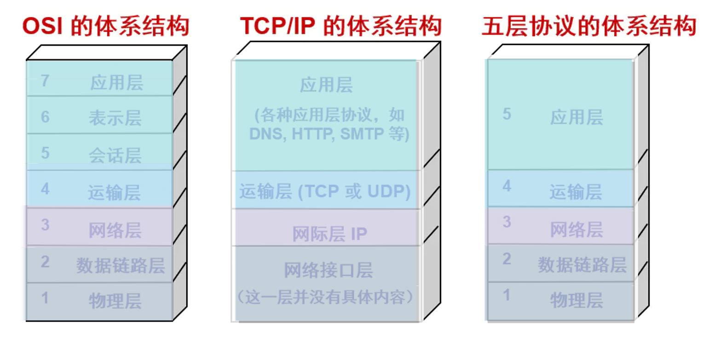
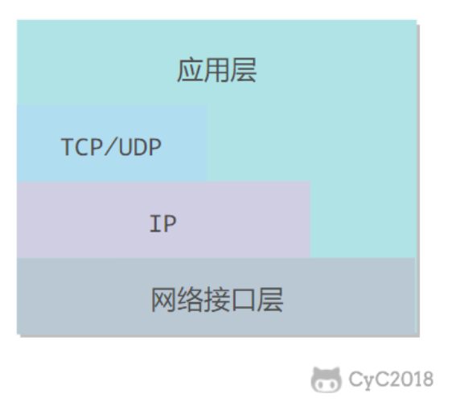

#  1.概述

## 网络的网络

网络把主机连接起来，而互连网（internet）是把多种不同的网络连接起来，因此互连网是网络的网络。而互联网（Internet）是全球范围的互连网。

## ISP

### 1.ISP定义

**ISP (Internet Service Provider，因特网服务提供者)** 

简单来说，互联网不是一整块铁板，而是由成千上万个相互连接的小网络组成的，而 ISP 就是这些小网络的管理者。

ISP 是为用户提供互联网接入服务的组织或机构。

- **个人视角**：它是每个月交网费的对象（如中国电信、中国联通、Comcast）。
- **技术视角**：它是一个由路由器和通信链路组成的网络基础设施

互联网服务提供商 ISP 可以从互联网管理机构获得许多 IP 地址，同时拥有通信线路以及路由器等联网设备，个人或机构向 ISP 缴纳一定的费用就可以接入互联网。

### 2.ISP 的层次结构（重点）

目前的互联网是一种多层次 ISP 结构，ISP 根据覆盖面积的大小分为第一层 ISP、区域 ISP 和接入 ISP。互联网交换点 IXP 允许两个 ISP 直接相连而不用经过第三个 ISP

**第一层：主干网 ISP (Tier-1 ISPs)**

- **地位**：互联网的“心脏”。
- **特点**：覆盖全球，拥有极高带宽的光纤骨干网。
- **关系**：Tier-1 之间是**对等关系 (Peering)**，它们互相传输流量是不收钱的，因为大家规模相当。

**第二层：区域 ISP (Regional ISPs)**

- **地位**：连接 Tier-1 和本地 ISP 的中介。
- **特点**：可能覆盖一个国家或几个省份。
- **关系**：它们向 Tier-1 购买流量（是 Tier-1 的客户）。

**第三层：本地 ISP (Local ISPs)**

- **地位**：离用户最近的一层（Access Network）。
- **特点**：直接接入校园网、企业网或家庭住宅。
- **数据开发关联**：你的数据服务器或抓取任务，通常部署在某个数据中心的本地 ISP 范围内。

### 3. 关键术语：IXP 

**IXP (Internet Exchange Point)**

在 ISP 的讲解中，经常会提到 **IXP（因特网交换点）**。

- **定义**：一个汇接点，让多个 ISP 在这里“碰头”并交换流量。
- **意义**：如果没有 IXP，两个竞争的 ISP 之间发邮件可能要绕到大洋彼岸。有了 IXP，流量可以直接在本地交换，显著降低延迟。

### 4. 面试 (数据开发)

虽然你可能不去拉光纤，但 ISP 的知识在以下场景中极其重要：

1. **多线接入 (Multi-homing)**：
   - 为什么大型数据中心要接入“BGP 多线”？因为如果只接一家 ISP，当该 ISP 线路出故障或跨网访问（电信访联通）时，你的数据服务会变得极慢。
2. **内容分发网络 (CDN)**：
   - CDN 的核心思想就是“**把内容缓存到离用户最近的边缘 ISP 中**”。通过 ISP 层次结构，你可以理解为什么在上海访问存储在广州的数据会慢。
3. **网络中立性 (Net Neutrality)**：
   - 面试时如果聊到行业趋势，你可以提到：ISP 是否有权对特定流量（如视频流、大数据同步流量）进行限速或额外收费？

## 主机之间的通信方式

### 客户-服务器（C/S）

客户是服务的请求方，服务器是服务的提供方。

这是目前互联网最主流的模型，也是面试中最常默认的场景。

**核心特点：**

|                     **服务器 (Server)**                      |                       客户机 (Client)                       |
| :----------------------------------------------------------: | :---------------------------------------------------------: |
|             **永久性访问**：它必须 24 小时在线。             |            **主动发起**：间歇性地与服务器联系。             |
| **固定 IP**：拥有永久的、广为人知的 IP 地址，方便客户端寻找。 | **动态 IP**：可以随时上线下线，IP 地址通常由 ISP 动态分配。 |
|     **中心化**：它是服务的中心，通常部署在大型数据中心。     |         **不直接通信**：客户机之间不直接交换数据。          |

**数据开发中的例子：**

- **MySQL/PostgreSQL**：你的程序（Client）连接数据库服务器（Server）。
- **RESTful API**：你的数据抓取脚本请求 Web 服务器。

### 对等（P2P）

P2P(Peer-to-Peer Architecture) 是一种“去中心化”的思维，它挑战了传统服务器的权威,**不区分客户和服务器。**

**核心特点：**

- **对等性 (Peers)**：没有固定的服务器。主机之间是对等关系，既是服务的请求者，也是服务的提供者。
- **自扩展性 (Self-scalability)**：这是 P2P 最迷人的地方。在 C/S 模式下，用户越多服务器压力越大；在 P2P 中，**每个对等方在下载文件的同时也在上传文件**，从而为系统增加了服务能力。
- **间歇性连接**：节点可以随时加入或退出，且 IP 地址经常变动。

**数据开发中的关联：**

- **分布式存储**：虽然像 HDFS 有 NameNode（中心节点），但数据块的传输在某些特定场景（如集群间数据分发）会借鉴 P2P 思想来减轻主控节点的压力。
- **区块链 (Blockchain)**：典型的 P2P 网络应用。

###  C/S vs P2P：深度对比表

| **特性**     | **客户-服务器 (C/S)**            | **P2P (对等网络)**               |
| ------------ | -------------------------------- | -------------------------------- |
| **管理**     | 中心化，易于管理和控制           | 分散化，管理极其困难             |
| **可伸缩性** | 随着用户增加，服务器可能成为瓶颈 | 用户越多，资源越多，伸缩性极强   |
| **可靠性**   | 服务器宕机则服务停止             | 单个节点退出不影响整体，鲁棒性强 |
| **成本**     | 需要昂贵的服务器硬件和高带宽     | 利用普通用户的闲散带宽和存储     |

### 面试

**面试官问：“P2P 既然这么完美（省钱又快），为什么现在的互联网还是以 C/S 为主？”**

回答：

1. **管理难**：C/S 架构方便控制权限、计费和内容审核。
2. **安全性**：P2P 节点不可控，容易传播病毒或垃圾信息。
3. **ISP 压力**：P2P 的大量上传流量会给 ISP 的上行带宽带来巨大压力，很多 ISP 会限制 P2P。
4. **一致性**：在数据开发中，保证分布式数据的一致性在 C/S 模式下相对容易，而在完全 P2P 的环境下是极大的技术挑战。

##  计算机网络体系结构

 一般而言计算机网络体系结构分为三种:

- OSI 七层模型:**法律上的标准**。定义严谨，层次分明,分得最细，包含了表示层和会话层,但**几乎不用**（仅作为参考模型）。
- TCP/IP 四层模型:**事实上的标准**。互联网真正运行的模型。将应用层、表示层、会话层合并；将物理层和数据链路层合并为“网络接口层”。**实际在用**（代码实现和协议部署）。
- 五层原理体系结构:**教学上的折中**。为了方便学生理解而生,**教材首选**（《自顶向下》用的就是它）。

**关键区别点：**

- **消失的表示层和会话层：** 在 OSI 中，**表示层**负责数据格式化（如加密、压缩），**会话层**负责建立和管理会话。但在 TCP/IP 中，专家们认为这些功能应该由应用开发者自己处理（例如在 HTTP 协议内完成），因此合并到了应用层。
- **底层的合并：** TCP/IP 最初并不关心具体的物理线路是光纤还是电缆，所以统一称为“网络接口层”。但在学习时，理解电信号（物理层）和 MAC 地址转发（链路层）的区别至关重要，所以教学上会把它们拆开。

### 五层协议

**对于自顶向下教材对五层协议体系的理解:**

- **应用层** ：为特定应用程序提供数据传输服务，例如 HTTP、DNS 等协议。数据单位为报文。
- **传输层** ：为进程提供通用数据传输服务。由于应用层协议很多，定义通用的传输层协议就可以支持不断增多的应用层协议。运输层包括两种协议：传输控制协议 TCP，提供面向连接、可靠的数据传输服务，数据单位为报文段；用户数据报协议 UDP，提供无连接、尽最大努力的数据传输服务，数据单位为用户数据报。TCP 主要提供完整性服务，UDP 主要提供及时性服务。
- **网络层** ：为主机提供数据传输服务。而传输层协议是为主机中的进程提供数据传输服务。网络层把传输层传递下来的报文段或者用户数据报封装成分组。
- **数据链路层** ：网络层针对的还是主机之间的数据传输服务，而主机之间可以有很多链路，链路层协议就是为同一链路的主机提供数据传输服务。数据链路层把网络层传下来的分组封装成帧。
- **物理层** ：考虑的是怎样在传输媒体上传输数据比特流，而不是指具体的传输媒体。物理层的作用是尽可能屏蔽传输媒体和通信手段的差异，使数据链路层感觉不到这些差异。

### 形象理解:

- **应用层（信件内容）：** 你在纸上写了一句 "Hello"。
- **传输层（信封）：** 你给信套上信封，写上**端口号**（指定给这栋楼里的哪个人，比如小王）。
- **网络层（包裹）：** 邮局给信套上大包裹，写上**IP 地址**（指定发往哪座城市、哪条街道）。
- **链路层（运输车）：** 包裹被装上具体的卡车，车牌号就是 **MAC 地址**（负责从一个邮局开到下一个邮局）。
- **物理层（道路）：** 卡车行驶在水泥路（光纤/电缆）上。

**面试**

**面试官通常会以“五层模型”为逻辑框架提问，但要求你掌握“OSI 七层”的名词。**

1. **基础面试（八股文）：** 面试官常问：“请简述 OSI 七层模型”。这时候你需要背出那七层：物、链、网、传、会、表、应。这是考察你的基本功。
2. **实战/数据开发面试：** 重点会落在**第 3 层（网络层）**、**第 4 层（传输层）\**和\**第 5 层（应用层）**。
   - **传输层：** TCP 的三次握手、四次挥手、滑动窗口、拥塞控制（必考）。
   - **网络层：** IP 寻址、路由协议、ICMP（Ping 的原理）。
   - **应用层：** HTTP/HTTPS 协议、DNS 解析。

### OSI 参考模型

在**面试**中，**OSI 参考模型 (Open Systems Interconnection Reference Model)** 是就是我们常说的七层模型。

它是国际标准化组织 (ISO) 在 1984 年制定的一个理论框架，旨在让全世界不同的计算机系统都能实现互联。

OSI 模型最显著的特点是将应用层进一步细分成了三层。我们可以从下往上（自底向上）看：

- **表示层** ：数据压缩、加密以及数据描述，这使得应用程序不必关心在各台主机中数据内部格式不同的问题。
- **会话层** ：建立及管理会话。

五层协议没有表示层和会话层，而是将这些功能留给应用程序开发者处理。

| **层级** | **名称**                  | **核心功能**                           | **数据开发关联**                    |
| -------- | ------------------------- | -------------------------------------- | ----------------------------------- |
| **7**    | 应用层 (Application)      | 为应用程序提供网络服务接口             | HTTP API 调用、Spark 任务提交       |
| **6**    | **表示层 (Presentation)** | **数据格式转换**、加密/解密、压缩/解压 | JSON/Protobuf 序列化、数据加解密    |
| **5**    | **会话层 (Session)**      | 建立、管理和终止**会话** (Session)     | 数据库连接维持、检查点 (Checkpoint) |
| **4**    | 传输层 (Transport)        | 提供端到端的可靠数据传输               | TCP 握手、端口号管理                |
| **3**    | 网络层 (Network)          | 寻址和路由选择                         | IP 地址寻址                         |
| **2**    | 数据链路层 (Link)         | 物理寻址、成帧、差错检测               | 交换机、MAC 地址                    |
| **1**    | 物理层 (Physical)         | 原始比特流的机械和电气传输             | 网线、光纤、比特流                  |

**1.为什么要多出“表示层”和“会话层”？**

这是面试官最喜欢问的细节：**“TCP/IP 只有应用层，为什么 OSI 要单独分出表示层和会话层？”**

**表示层 (Presentation Layer)**

它的工作是确保一个系统的应用层发出的信息能被另一个系统的应用层读取。

- **翻译官角色**：不同机器可能使用不同的编码（如 ASCII 与 EBCDIC）。
- **现代实现**：在今天的互联网中，这些功能通常由程序员在**应用层**自己搞定（比如你用 JSON 还是 XML，用 Gzip 还是 Snappy 压缩）。

**会话层 (Session Layer)**

它的工作是建立、管理和同步不同机器上的进程之间的对话。

- **断点续传**：如果传输大文件时网络断了，会话层可以利用“检查点”从上次断开的地方恢复。
- **现代实现**：这部分功能现在大多也被合并到了传输层（TCP 维持连接）或应用层（如断点续传逻辑）。

**3. 面试官的“灵魂拷问”**

### **问：OSI 模型和 TCP/IP 模型哪个更好？**

**答：** **OSI** 在**理论**上更完备、分工更明确，非常适合学习和研究，是“教科书级别”的参考标准。

- **TCP/IP** 在**实践**中大获全胜。因为它更简洁，先有协议（如 TCP、IP），后有模型。而 OSI 是先拍脑门定了模型，再去写协议，导致很多协议实现过于复杂，最终被市场淘汰。

**问：数据开发中，OSI 哪一层最关键？**

**答：** 作为数据开发，你对 **第 6 层（表示层）** 应该有特殊感情。因为在处理大数据（如 Spark/Flink）时，**序列化 (Serialization)** 性能直接决定了计算速度，而这就是典型的表示层工作。

###  TCP/IP

它只有四层，相当于五层协议中数据链路层和物理层合并为网络接口层。

TCP/IP 体系结构不严格遵循 OSI 分层概念，应用层可能会直接使用 IP 层或者网络接口层。

### 数据在各层之间的传递过程

在向下的过程中，需要添加下层协议所需要的首部或者尾部，而在向上的过程中不断拆开首部和尾部。

路由器只有下面三层协议，因为路由器位于网络核心中，不需要为进程或者应用程序提供服务，因此也就不需要传输层和应用层。

> 怎么理解上面的话呢?

理解了**封装（Encapsulation）**与**中间节点（Intermediate Nodes）**的功能，就抓住了计算机网络的灵魂,可以通过“**快递包裹**”的类比和“**协议栈视角**”来深度拆解这两句话。

**1.数据在各层之间的传递：封装与解封装**

数据在发送端是“**穿衣服**”（添加首部），在接收端是“**脱衣服**”（拆开首部）。

**为什么每一层都要加首部（Header）？**

每一层的首部都包含了该层完成任务所必需的“控制信息”。

- **传输层首部 (TCP/UDP)**：包含了**端口号**。如果没有它，目标主机不知道把数据交给哪个 App（是微信还是 Web 服务器？）。
- **网络层首部 (IP)**：包含了**目的 IP 地址**。如果没有它，路由器不知道把包发往哪个地理位置。
- **链路层首部和尾部 (Ethernet)**：包含了 **MAC 地址**和**差错检测码 (CRC)**。如果没有它，相邻的网卡无法确认数据是否在传输中损坏。

**过程详解：**

1. **向下传递（发送端）**：应用层数据被切分，每一层都在上一层的基础上包裹一层自己的控制信息。这就好比写了一封信，塞进信封（传输层），再装入快递盒（网络层），最后贴上物流运单（链路层）。
2. **向上传递（接收端）**：每经过一层，该层协议会读取对应的首部，根据指令处理完后，把首部“撕掉”，将纯载荷（Payload）交给上层。

**2.为什么路由器只有下面三层？**

这是一个极高频的面试题。要理解这一点，必须区分**端系统（End Systems）\**和\**中间系统（Intermediate Systems）**。

这是一个非常经典且深刻的科班问题。理解了**封装（Encapsulation）**与**中间节点（Intermediate Nodes）**的功能，你就抓住了计算机网络的灵魂。

我们可以通过“**快递包裹**”的类比和“**协议栈视角**”来深度拆解这两句话。

------

## 1. 数据在各层之间的传递：封装与解封装

正如你所提到的，数据在发送端是“**穿衣服**”（添加首部），在接收端是“**脱衣服**”（拆开首部）。

### 为什么每一层都要加首部（Header）？

每一层的首部都包含了该层完成任务所必需的“控制信息”。

- **传输层首部 (TCP/UDP)**：包含了**端口号**。如果没有它，目标主机不知道把数据交给哪个 App（是微信还是 Web 服务器？）。
- **网络层首部 (IP)**：包含了**目的 IP 地址**。如果没有它，路由器不知道把包发往哪个地理位置。
- **链路层首部和尾部 (Ethernet)**：包含了 **MAC 地址**和**差错检测码 (CRC)**。如果没有它，相邻的网卡无法确认数据是否在传输中损坏。

### 过程详解：

1. **向下传递（发送端）**：应用层数据被切分，每一层都在上一层的基础上包裹一层自己的控制信息。这就好比写了一封信，塞进信封（传输层），再装入快递盒（网络层），最后贴上物流运单（链路层）。
2. **向上传递（接收端）**：每经过一层，该层协议会读取对应的首部，根据指令处理完后，把首部“撕掉”，将纯载荷（Payload）交给上层。

------

## 2. 为什么路由器只有下面三层？

这是一个极高频的面试题。要理解这一点，必须区分**端系统（End Systems）\**和\**中间系统（Intermediate Systems）**。

**核心逻辑：**

- **端系统（你的电脑/服务器）**：运行完整的五层协议栈。因为它需要运行应用程序（应用层），并保证数据传输的可靠性（传输层）。
- **路由器（网络核心）**：它的唯一使命是**“路口导流”**。

**路由器的工作内容：**

1. **物理层**：接收光/电信号，变成比特流。
2. **数据链路层**：识别出当前的帧（Frame），检查一下有没有传错。
3. **网络层（重点）**：查看 IP 首部里的**目的 IP 地址**，查询自己的路由表，决定这个包该从哪个路口（接口）转发出去。

**为什么不需要 4-5 层？**

- **不需要传输层**：传输层负责的是“端到端”的可靠性（如丢包重传）。路由器只管转发，如果路径拥塞，它直接丢包，重传的事情由发件人和收件人（两端的主机）去操心。
- **不需要应用层**：路由器不需要知道你是在发邮件还是在看视频，它只看 IP 地址。就像快递员不需要拆开你的包裹看里面是什么，他只需要看快递单上的收货地址。

**3. 数据开发者的视角：为什么这很重要？**

在处理大数据集群（如 Spark, Kafka）时，理解这一点能帮你解决**网络瓶颈**问题：

- **MTU（最大传输单元）**：如果你应用层产生的数据块太大，超过了链路层的限制，网络层（路由器）就不得不进行**分片 (Fragmentation)**。
- **性能损耗**：路由器分片和重组会消耗大量的 CPU 资源，导致数据传输延迟增加。
- **结论**：这就是为什么在调优分布式系统时，我们需要合理设置 `MTU` 和数据包大小，尽量让数据在三层（路由器）能顺畅流过，而不产生额外的拆包开销。