# 一、基于transformers的自然语言处理(NLP)入门


自然语言处理（Natural Language Processing, NLP）是一种重要的人工智能（Artificial Intelligence, AI）技术。我们随处可以见到NLP技术的应用，比如网络搜索，广告，电子邮件，智能客服，机器翻译，智能新闻播报等等。最近几年，基于深度学习（Deep Learning, DL）的NLP技术在各项任务中取得了很好的效果，这些基于深度学习模型的NLP任务解决方案通常不使用传统的、特定任务的特征工程而是仅仅使用一个端到端（end-to-end）的神经网络模型就可以获得很好的效果。

本教程将会基于最前沿的深度学习模型结构（transformers）来解决NLP里的几个经典任务。通过本教程的学习，我们将能够了解transformer相关原理、熟练使用transformer相关的深度学习模型来解决NLP里的实际问题以及在各类任务上取得很好的效果。


## 常见的NLP任务

本教程将NLP任务划分为4个大类：1、文本分类， 2、序列标注，3、问答任务——抽取式问答和多选问答，4、生成任务——语言模型、机器翻译和摘要生成。

* 文本分类：对单个、两个或者多段文本进行分类。举例：“这个教程真棒！”这段文本的情感倾向是正向的，“我在学习transformer”和“如何学习transformer”这两段文本是相似的。
* 序列标注：对文本序列中的token、字或者词进行分类。举例：“我在**国家图书馆**学transformer。”这段文本中的**国家图书馆**是一个**地点**，可以被标注出来方便机器对文本的理解。
* 问答任务——抽取式问答和多选问答：1、抽取式问答根据**问题**从一段给定的文本中找到**答案**，答案必须是给定文本的一小段文字。举例：问题“小学要读多久?”和一段文本“小学教育一般是六年制。”，则答案是“六年”。2、多选式问答，从多个选项中选出一个正确答案。举例：“以下哪个模型结构在问答中效果最好？“和4个选项”A、MLP，B、cnn，C、lstm，D、transformer“，则答案选项是D。
* 生成任务——语言模型、机器翻译和摘要生成：根据已有的一段文字生成（generate）一个字通常叫做语言模型，根据一大段文字生成一小段总结性文字通常叫做摘要生成，将源语言比如中文句子翻译成目标语言比如英语通常叫做机器翻译。

虽然各种基于transformer的深度学习模型已经在多个人工构建的NLP任务中表现出色，但由于人类语言博大精深，深度学习模型依然有很长的路要走。


这里先来简单看一下transformer的发展


**1. 起点：NN (神经网络) —— 静态的“快照”**

- **状态：** 只能处理固定长度的输入（比如一张图片）。
- **缺陷：** 它没有“时间”概念。如果你给它看一个句子，它会把单词拆开看，完全不管前后的逻辑顺序。

**2. 进化：RNN (循环神经网络) —— 滚动的“流水账”**

- **突破：** 引入了 `hidden state`，让网络有了“记忆”，可以处理任意长度的序列。
- **代价：** 记忆极其脆弱。信息在传递过程中像“传声筒游戏”一样，传到后面就变味了（梯度消失/信息稀释）。

**3. 改良：LSTM (长短期记忆) —— 带锁的“保险箱”**

- **突破：** 意识到 RNN 的记忆太乱，于是发明了“门控机制”。
- **进步：** 它能通过“遗忘门”和“输入门”精准控制什么该记、什么该忘。这让它能处理比 RNN 长得多的句子（比如从几十个词进步到几百个词）。
- **依然存在的死穴：** 它还是**串行**的。必须读完第 1 个词才能读第 2 个，这导致它无法利用现代 GPU 的强大并行算力，训练速度慢得感人。

**4. 颠覆：Transformer —— 全局的“聚光灯” (Attention)**

- **革命：** Transformer 说：“我们不要再像老牛拉车一样一个词一个词往后传了！”
- **神操作：**
  - 它直接把整个句子**啪**地一下扔进模型里。
  - 靠 **Attention（注意力机制）**，每个词都能在瞬间看清全句。
- **结果：** 1. **记忆力无限：** 距离不再是问题，句首和句尾之间没有“稀释”。 
                    2.**速度起飞：** 因为是同时输入，GPU 可以火力全开并行计算。


# 二、Transformer相关原理

## 1.Attention

篇章1中我们对Transformers在NLP中的兴起做了概述。本教程的学习路径是：Attention->Transformer->BERT->NLP应用。因此，本篇章将从attention开始，逐步对Transformer结构所涉及的知识进行深入讲解，希望能给读者以形象生动的描述。

问题：Attention出现的原因是什么？ 潜在的答案：基于循环神经网络（RNN）一类的seq2seq模型，在处理长文本时遇到了挑战，而对长文本中不同位置的信息进行attention有助于提升RNN的模型效果。

于是学习的问题就拆解为：

1. 什么是seq2seq模型？
2. 基于RNN的seq2seq模型如何处理文本/长文本序列？
3. seq2seq模型处理长文本序列时遇到了什么问题？
4. 基于RNN的seq2seq模型如何结合attention来改善模型效果？


### 1.1 seq2seq框架

seq2seq是一种常见的NLP模型结构，全称是：sequence to sequence，翻译为“序列到序列”。顾名思义：从一个文本序列得到一个新的文本序列。典型的任务有：机器翻译任务，文本摘要任务。

### 1.2 细节

将seq2seq模型进行拆解，seq2seq模型由编码器（Encoder）和解码器（Decoder）组成。编码器会处理输入序列中的每个元素并获得输入信息，这些信息会被转换成为一个向量（称为context向量）。

当我们处理完整个输入序列后，编码器把 context向量 发送给解码器，解码器通过context向量中的信息，逐个元素输出新的序列。

深入学习机器翻译任务中的seq2seq模型，seq2seq模型中的编码器和解码器一般采用的是循环神经网络RNN（Transformer模型还没出现的过去时代）。编码器将输入的法语单词序列编码成context向量（在encoder和decoder中间出现），然后解码器根据context向量解码出英语单词序列。

context向量是什么？本质上是一组浮点数。而这个context的数组长度是基于编码器RNN的隐藏层神经元数量的。在实际应用中，context向量的长度是自定义的，比如可能是256，512或者1024。

那么RNN是如何具体地处理输入序列的呢？

1. 假设序列输入是一个句子，这个句子可以由$n$个词表示：$sentence = {w_1, w_2,...,w_n}$。
2. RNN首先将句子中的每一个词映射成为一个向量得到一个向量序列：$X = {x_1, x_2,...,x_n}$，每个单词映射得到的向量通常又叫做：word embedding。
3. 然后在处理第$t \in [1,n]$个时间步的序列输入$x_t$时，RNN网络的输入和输出可以表示为：$h_{t} = RNN(x_t, h_{t-1})$
   - 输入：RNN在时间步$t$的输入之一为单词$w_t$经过映射得到的向量$x_t$。
   - 输入：RNN另一个输入为上一个时间步$t-1$得到的hidden state向量$h_{t-1}$，同样是一个向量。
   - 输出：RNN在时间步$t$的输出为$h_t$ hidden state向量。


让我们来进一步可视化一下基于RNN的seq2seq模型中的编码器在第1个时间步是如何工作：

RNN在第2个时间步，采用第1个时间步得到hidden state#10（隐藏层状态）和第2个时间步的输入向量input#1，来得到新的输出hidden state#1

编码器在每个时间步得到对应hidden sate，并将最终的hidden state传输给解码器，解码器根据编码器所给予的最后一个hidden state信息解码处输出序列。注意，最后一个 hidden state实际上是我们上文提到的context向量。

接着，结合编码器处理输入序列，一起来看下解码器如何一步步得到输出序列的l。与编码器类似，解码器在每个时间步也会得到 hidden state（隐藏层状态），而且也需要把 hidden state（隐藏层状态）从一个时间步传递到下一个时间步。

编码器首先按照时间步依次编码每个法语单词，最终将最后一个hidden state也就是context向量传递给解码器，解码器根据context向量逐步解码得到英文输出。

> 需要知道几个重点
>
> ### 1.什么是embeded word?
>
> 可以理解为是一段话,里面有很多有意义的单词,这些单词被一个个切分,组成最基本的理解单位,例如:苹果、香蕉、橙子,以供处理
>
> ### 2.Hidden State 是在干什么
>
> Hidden State 像一杯果汁,有着固定的**体积（维度）,例如永远是 256 毫升**这其实就是他自己的长度。虽然体积没变，但随着新水果的加入，果汁的**味道（数值）**一直在变(稀释)。
>
> ### 3.RNN在embeded word和Hidden State中间干了什么?context是什么?
>
> 虽然每输入一个embeded word,就会有 Hidden State 被生成(更新),产生Hidden State#1,Hidden State#2....Hidden State#n
>
> context就是最后一个更新的Hidden State#n,它是编码器的**唯一输出**。它就像是一个密闭的**集装箱**，里面装载了原句所有的语义、情感和逻辑。

你可以理解为 例如一串句子要机器翻译,那么步骤就是

1. 会分为一个个单词,被封装成embeded words,
2. 然后每输入一个就是一个hidden state,这个hidden state是随着输入单词 不断迭代的,直到读取完所有embeded words,
3. 此时最后的hiden state存储了所有的单词信息,这个就是context但是受限于长度,有一些单词的意思就被**稀释**掉了


所以针对最大**稀释**问题,科学家们给出了两个方向的答案：

1. **改良“杯子”：** 把普通的 RNN 换成 **LSTM**（它有个专门的“长时记忆”通道，像个保险箱一样保护重要信息不被稀释）。
2. **开外挂：** 也就是我刚才提到的 **Attention**（既然最后一杯水味道淡了，那我们就把之前每一步加调料时的那一勺原汁都留着，要用的时候直接去尝原汁）。


### 1.3 Attention的出现

基于RNN的seq2seq模型编码器所有信息都编码到了一个context向量中，便是这类模型的瓶颈。一方面单个向量很难包含所有文本序列的信息，另一方面RNN递归地编码文本序列使得模型在处理长文本时面临非常大的挑战（比如RNN处理到第500个单词的时候，很难再包含1-499个单词中的所有信息了）。

面对以上问题，Bahdanau等2014发布的[Neural Machine Translation by Jointly Learning to Align and Translate](https://arxiv.org/abs/1409.0473) 和 Luong等2015年发布的[Effective Approaches to Attention-based Neural Machine Translation ](https://arxiv.org/abs/1508.04025)两篇论文中，提出了一种叫做注意力**attetion**的技术。通过attention技术，seq2seq模型极大地提高了机器翻译的质量。归其原因是：attention注意力机制，使得seq2seq模型可以有区分度、有重点地关注输入序列。


让我们继续来理解带有注意力的seq2seq模型：一个注意力模型与经典的seq2seq模型主要有2点不同：

1. 首先，编码器会把更多的数据传递给解码器。编码器把所有时间步的 hidden state（隐藏层状态）传递给解码器，而不是只传递最后一个 hidden state（隐藏层状态）:
2. 注意力模型的解码器在产生输出之前，做了一个额外的attention处理。如下图所示，具体为：
   - 由于编码器中每个 hidden state（隐藏层状态）都对应到输入句子中一个单词，那么解码器要查看所有接收到的编码器的 hidden state（隐藏层状态）。
   - 给每个 hidden state（隐藏层状态）计算出一个分数（我们先忽略这个分数的计算过程）。
   - 所有hidden state（隐藏层状态）的分数经过softmax进行归一化。
   - 将每个 hidden state（隐藏层状态）乘以所对应的分数，从而能够让高分对应的 hidden state（隐藏层状态）会被放大，而低分对应的 hidden state（隐藏层状态）会被缩小。
   - 将所有hidden state根据对应分数进行加权求和，得到对应时间步的context向量。


所以，attention可以简单理解为：一种有效的加权求和技术，其艺术在于如何获得权重。

现在，让我们把所有内容都融合到下面的图中，来看看结合注意力的seq2seq模型解码器全流程，动态图展示的是第4个时间步：

1. 注意力模型的解码器 RNN 的输入包括：一个word embedding 向量，和一个初始化好的解码器 hidden state，图中是$h_{init}$。
2. RNN 处理上述的 2 个输入，产生一个输出和一个新的 hidden state，图中为h4。
3. 注意力的步骤：我们使用编码器的所有 hidden state向量和 h4 向量来计算这个时间步的context向量（C4）。
4. 我们把 h4 和 C4 拼接起来，得到一个橙色向量。
5. 我们把这个橙色向量输入一个前馈神经网络（这个网络是和整个模型一起训练的）。
6. 根据前馈神经网络的输出向量得到输出单词：假设输出序列可能的单词有N个，那么这个前馈神经网络的输出向量通常是N维的，每个维度的下标对应一个输出单词，每个维度的数值对应的是该单词的输出概率。
7. 在下一个时间步重复1-6步骤。


### 1.4为什么Attention可以实现距离和遗忘问题

在 RNN 里，距离是**“爬行”**出来的；在 Attention 里，距离是**“映射”**出来的。

#### 1. 为什么 RNN 的距离是 $n$？

想象你在传话：

- 你在第一页，动词在第一百页。
- 信息必须经过第二页、第三页……第九十九页。
- 每一页的 **Hidden State ($h_t$)** 都要进行一次复杂的矩阵乘法。
- **物理路径：** 100 步。每一步都有可能丢失信息。


#### 2. 为什么 Attention 的距离是 $1$？

Attention 抛弃了“传话”模式，改成了**“广播”模式**。

在计算时，每一个单词向量 $x_i$ 都会被投影成三个身份：**Query (查询)**、**Key (键)** 和 **Value (值)**。

#### 核心数学操作：点积 (Dot Product)

假设你想知道第 1 个词（主语）和第 100 个词（动词）的关系：

1. **直接计算：** 我们直接用第 1 个词的 $Query$ 去和第 100 个词的 $Key$ 做**点积运算**。

   $$\text{Score} = Q_1 \cdot K_{100}$$

2. **瞬间获得：** 这个点积的结果就是一个数字，代表了这两个词的相关性。

3. **计算路径：** 无论这两个词在内存里的物理位置隔了多远，在 CPU/GPU 运算时，这只是**一次乘法和一次加法**。


#### 3. 一个直观的比喻：档案室 vs. 手机通讯录

- **RNN（档案室）：** 所有的档案按顺序叠在一起。如果你想看第 100 份档案，你必须先搬开前面的 99 份。这就产生了“距离”。
- **Attention（通讯录）：** 虽然通讯录里有 100 个人，但你想联系第 100 个人时，不需要先给前 99 个人打电话。你只需要点一下他的名字（Query 匹配 Key），信号**瞬间**就接通了。


#### 4. “距离为 1”的代价：计算量的爆炸

虽然“距离为 1”解决了遗忘问题，但天下没有免费的午餐。

- **RNN 的计算量：** 跟长度 $n$ 成正比（$O(n)$）。句子长一倍，时间多一倍。
- **Attention 的计算量：** 跟长度的**平方**成正比（$O(n^2)$）。
  - 因为**每一个词**都要去跟**其他所有词**算一次点积。
  - 如果有 10 个词，要算 $10 \times 10 = 100$ 次。
  - 如果有 1000 个词，就要算 $1000 \times 1000 = 1,000,000$ 次！


## 2.transformer

在学习完attention后，我们知晓了attention为循环神经网络带来的优点。那么有没有一种神经网络结构直接基于attention构造，并且不再依赖RNN、LSTM或者CNN网络结构了呢？

答案便是：**Transformer**。因此，我们将在本小节对Transformer所涉及的细节进行深入探讨。

Transformer模型在2017年被google提出，直接基于Self-Attention结构，取代了之前NLP任务中常用的RNN神经网络结构，并在WMT2014 Englishto-German和WMT2014 English-to-French两个机器翻译任务上都取得了当时的SOTA(State of the art)。

与RNN这类神经网络结构相比，Transformer一个巨大的优点是：**模型在处理序列输入时，可以对整个序列输入进行并行计算，不需要按照时间步循环递归处理输入序列。**


**Transformer 相较于单纯 Attention 机制的优势**

你可能会问：既然 Attention 这么强，为什么不直接在 RNN 上加个 Attention 就算了（其实早期确实是这么做的，叫 Seq2Seq + Attention）？为什么要发明 **Transformer** 这么复杂的结构？

Transformer 的出现，是为了解决 Attention 在实际工程中的**两个短板**：

**A. 从“串行”到“并行” (Parallelism) —— 速度的飞跃**

这是 Transformer 战胜一切的根本原因。

- **旧模型（RNN+Attention）：** 虽然有 Attention，但你还是得先算出 $h_1$ 才能算 $h_2$。GPU 的强大算力被浪费在排队等候上。
- **Transformer：** 它彻底去掉了循环结构。整句话的所有词**同时**输入。既然不需要等待前一个词的计算结果，GPU 可以像千手观音一样同时处理成千上万个词。这让训练超大规模模型（如 GPT）成为了可能。

**B. 多头注意力 (Multi-Head Attention) —— “多角度观察”**

单纯的 Attention 只能生成一组权重。

- **Transformer：** 它把 Attention 拆成了多个“头”（比如 8 个或 12 个）。

  - **头 1：** 关注语法关系（主谓宾）。

  - **头 2：** 关注代词指代（“他”指的是谁）。

  - **头 3：** 关注情感色彩。

    这种“多维视角”让模型对语言的理解深度远超单一的 Attention。

**C. 位置编码 (Positional Encoding) —— 弥补“空间感”**

因为 Transformer 是全员同时进入，它失去了 RNN 天生的“先后顺序”。Transformer 巧妙地通过给每个词打上**时间戳（位置向量）**，既保留了并行能力，又让模型知道谁在前谁在后。


好的现在让我们进入正式的部分

之前章节详细介绍了RNN神经网络如何循环递归处理输入序列。

下图先便是Transformer整体结构图，与之前篇章中介绍的seq2seq模型类似，Transformer模型结构中的左半部分为编码器（encoder），右半部分为解码器（decoder），下面我们来一步步拆解 Transformer。

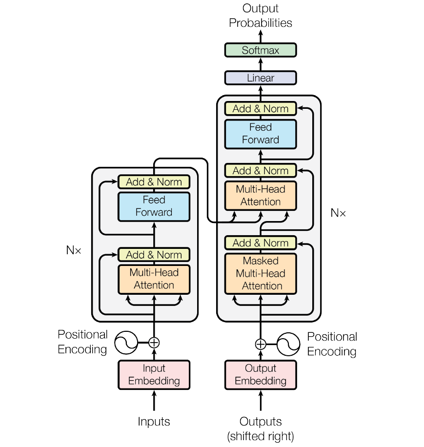

transformer模型结构

注释和引用说明：本文将通过总-分的方式对Transformer进行拆解和讲解，希望有助于帮助初学者理解Transformer模型结构。本文主要参考[illustrated-transformer](http://jalammar.github.io/illustrated-transformer)。


### 2.1 Transformer宏观结构

注意：本小节为讲解方式为：总-分，先整体，再局部。

Transformer最开始提出来解决机器翻译任务，因此可以看作是seq2seq模型的一种。本小节先抛开Transformer模型中结构具体细节，先从seq2seq的角度对Transformer进行宏观结构的学习。

以机器翻译任务为例，先将Transformer这种特殊的seqseq模型看作一个黑盒，黑盒的输入是法语文本序列，输出是英语文本序列（对比之前章节的seq2seq框架知识我们可以发现，Transformer宏观结构属于seq2seq范畴，只是将之前seq2seq中的编码器和解码器，从RNN模型替换成了Transformer模型）。

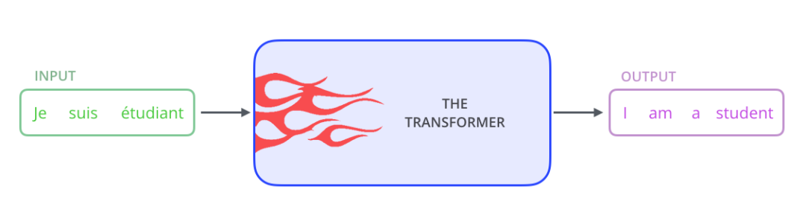

将上图中的中间部分“THE TRANSFORMER”拆开成seq2seq标准结构，得到下图：左边是编码部分encoders，右边是解码器部分decoders。

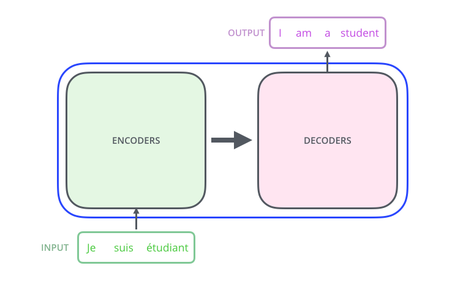

下面，再将上图中的编码器和解码器细节绘出，得到下图。我们可以看到，编码部分（encoders）由多层编码器(Encoder)组成（Transformer论文中使用的是6层编码器，这里的层数6并不是固定的，你也可以根据实验效果来修改层数）。同理，解码部分（decoders）也是由多层的解码器(Decoder)组成（论文里也使用了6层解码器）。每层编码器网络结构是一样的，每层解码器网络结构也是一样的。不同层编码器和解码器网络结构不共享参数。


> 如图所示**必须等所有 Encoder 层全部跑完，Decoder 才会大规模介入开始生成。** 这是“全篇理解”再“逐字输出”的模式.

> #### 可能会问:那么decoder会发生像RNN那样的遗忘吗?
>
> #### 1.结构变化
>
> 在理论结构上，Decoder 彻底终结了 RNN 那种“物理意义上的遗忘”；但在处理极长文本时，它会面临一种新的“注意力稀释”问题。
>
> **RNN 的遗忘原因：** 像我们之前聊的，它靠一个 $h_t$ 像接力棒一样传。传到第 100 个人手里，第 1 个人的力气（梯度/信息）早就耗尽了。这就是**物理距离**造成的遗忘。
>
> **ransformer Decoder 的逻辑：** * 它引入了 **Encoder-Decoder Attention** 机制。
>
> - 每当 Decoder 准备输出一个新单词时，它都会**回过头去，把 Encoder 产生的所有单词向量（$h_1$ 到 $h_n$）全部扫一遍**。
> - 注意，是**直接看**，不经过任何中间转手。
>
> #### 2.Self-Attention 机制
>
> Decoder 不仅盯着 Encoder 看，它自己内部也有记忆。
>
> - 当 Decoder 已经输出了 "I", "love" 这两个词，准备输出第三个词时，它会通过 **Self-Attention** 同时看向 "I" 和 "love"。
> - 它不需要像 RNN 那样把 "I" 的信息压缩进 "love" 的隐藏状态里，它是**独立地、完整地**保留了已经生成的所有单词。
>
> #### 3.虽然不“遗忘”，但它会“分心” Attention Saturation
>
> 虽然 Decoder 解决了物理上的遗忘，但在现实中，当处理**超长文本**（比如几万字）时，它会遇到一种类似“遗忘”的尴尬——**注意力稀释**：
>
> 1. **分母变大：** Attention 的本质是给所有单词打分（权重加起来等于 100%）。如果输入有 10,000 个词，每个词分到的注意力就会变得非常小。
> 2. **噪音干扰：** 面对海量信息，模型可能会在打分时产生偏差，把注意力放到了不重要的废话上，从而忽略了关键信息。
> 3. **计算窗口限制：** 现在的 LLM（大模型）都有一个 **Context Window（上下文窗口）** 限制（比如 128k）。一旦对话超过这个长度，最前面的信息会被直接**强行切掉**。这更像是一种“硬删除”，而不是 RNN 那种“慢慢变淡”。

接下来，我们看一下单层encoder，单层encoder主要由以下两部分组成，如下图所示

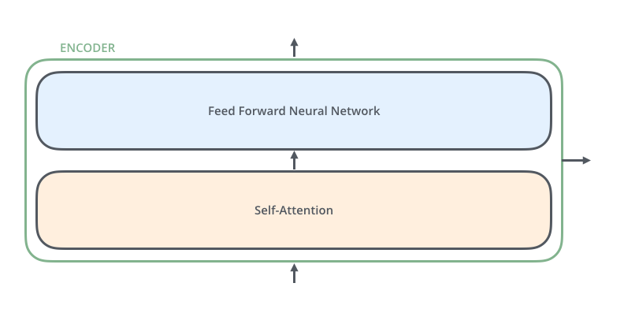

- Self-Attention Layer
- Feed Forward Neural Network（前馈神经网络，缩写为 FFNN）

编码器的输入文本序列$w_1, w_2,...,w_n$最开始需要经过embedding转换，得到每个单词的向量表示$x_1, x_2,...,x_n$，其中$x_i \in \mathbb{R}^{d}$是维度为$d$的向量，然后所有向量经过一个Self-Attention神经网络层进行变换和信息交互得到$h_1, h_2,...h_n$，其中$h_i \in \mathbb{R}^{d}$是维度为$d$的向量。self-attention层处理一个词向量的时候，不仅会使用这个词本身的信息，也会使用句子中其他词的信息（你可以类比为：当我们翻译一个词的时候，不仅会只关注当前的词，也会关注这个词的上下文的其他词的信息）。Self-Attention层的输出会经过前馈神经网络得到新的$x_1, x_2,..,x_n$，依旧是$n$个维度为$d$的向量。这些向量将被送入下一层encoder，继续相同的操作。

> 如何理解👆上面这段话
>
> 我们可以把这一层 Encoder 的内部运作拆解为两个阶段：
>
> - **“信息社交（Self-Attention）”** 
> -  **“深度加工（FFNN）”**。
>
> #### Self-**Attention**
>
> 在 RNN 里，单词 $x_t$ 只能看到过去的“残影” $h_{t-1}$。但在 Transformer 的这一层里，发生了翻天覆地的变化：
>
> - **全员交互：** 句子里的 $n$ 个词向量同时进入这一层。
> - **打分与吸收：** 当处理 $x_1$ 时，它会去“打量”全句所有的词（包括它自己），计算一个关联分。
>   - 例如句子：“苹果（$x_1$） 很好（$x_2$） 吃（$x_3$）”。
>   - 处理“苹果”时，Self-Attention 发现它和“吃”的关系最紧密，于是把“吃”的特征抓取一部分过来。
> - **输出 $h_i$：** 此时的 $h_1$ 不再是孤立的“苹果”，而是**“由于‘吃’而被定义了语义的苹果”**。
>
> **本质：** 这一步让每个单词向量从“死词典里的意思”变成了“具体语境下的意思”。
>
> 
>
> #### Feed Forward (FFNN，前馈神经网络层)
>
> $h_1, h_2 \dots h_n$ 经过 FFNN 后又变成了新的 $x_1, x_2 \dots x_n$。
>
> 注意你描述中的细节：$h_1, h_2 \dots h_n$ 经过 FFNN 后又变成了新的 $x_1, x_2 \dots x_n$。
>
> - **局部深度加工：** 如果说 Self-Attention 是让大家互相交流（社交），那么 FFNN 就是让每个单词**回到自己的工位上独立思考**。
> - **不干预他人：** 在 FFNN 这一步，处理 $h_1$ 的过程完全不依赖 $h_2$。它通过两层全连接映射，对已经吸收了上下文信息的向量进行非线性变换，挖掘更深层的特征。
> - **维度恢复：** 它把向量揉碎再重组，但最后保持维度 $d$ 不变，方便塞进下一层 Encoder。
>
> 
>
> #### 从RNN到Self-Attention到transformer
>
> **进门（Embedding）：** 10 个专家（单词向量）带着自己的初稿走进第一层。
>
> **大厅讨论（Self-Attention）：** 大家聚在一起开会。每个专家都听取其他人的意见，并修改自己的初稿。此时每个人手里拿的都是**“集思广益版”**。
>
> **单人隔间（FFNN）：** 开完会，每个专家回到自己的隔间，把刚才记下的笔记整理、升华，写出**“第一层深度报告”**。


与编码器对应，如下图，解码器在编码器的self-attention和FFNN中间插入了一个Encoder-Decoder Attention层，这个层帮助解码器聚焦于输入序列最相关的部分（类似于seq2seq模型中的 Attention）。

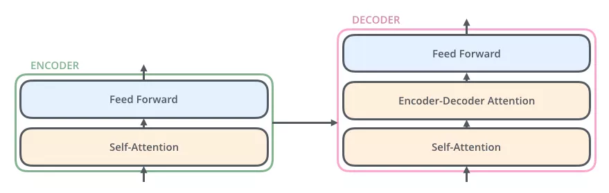

> 如果说 **Self-Attention** 是在做“内部消化”（Encoder 理解原文，Decoder 梳理已生成的译文），那么 **Encoder-Decoder Attention**（也叫 **Cross-Attention**，交叉注意力）就是在做**“对齐”**。

总结一下，我们基本了解了Transformer由编码部分和解码部分组成，而编码部分和解码部分又由多个网络结构相同的编码层和解码层组成。每个编码层由self-attention和FFNN组成，每个解码层由self-attention、FFN和encoder-decoder attention组成。

以上便是Transformer的宏观结构啦，下面我们开始看宏观结构中的模型细节。


### 2.2 Transformer结构细节

了解了Transformer的宏观结构之后。下面，让我们来看看Transformer如何将输入文本序列转换为向量表示，又如何逐层处理这些向量表示得到最终的输出。

> 既然我不像 RNN 那样一个接一个输入，那我怎么知道单词的顺序？

因此本节主要内容依次包含：

- 输入处理
  - 词向量
  - 位置向量
- 编码器
- 解码器

#### 2.2.3 输入处理

#### ①词向量

> “词向量决定了‘你是谁’

和常见的NLP 任务一样，我们首先会使用词嵌入算法（embedding algorithm），将输入文本序列的每个词转换为一个词向量。实际应用中的向量一般是 256 或者 512 维。但为了简化起见，我们这里使用4维的词向量来进行讲解。

如下图所示，假设我们的输入文本是序列包含了3个词，那么每个词可以通过词嵌入算法得到一个4维向量，于是整个输入被转化成为一个向量序列。在实际应用中，我们通常会同时给模型输入多个句子，如果每个句子的长度不一样，我们会选择一个合适的长度，作为输入文本序列的最大长度：如果一个句子达不到这个长度，那么就填充先填充一个特殊的“padding”词；如果句子超出这个长度，则做截断。最大序列长度是一个超参数，通常希望越大越好，但是更长的序列往往会占用更大的训练显存/内存，因此需要在模型训练时候视情况进行决定。

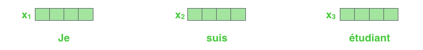

词向量

输入序列每个单词被转换成词向量表示还将加上位置向量来得到该词的最终向量表示。


#### ②位置向量

> 位置向量决定了‘你在哪’

如下图所示，Transformer模型对每个输入的词向量都加上了一个位置向量。这些向量有助于确定每个单词的位置特征，或者句子中不同单词之间的距离特征。词向量加上位置向量背后的直觉是：将这些表示位置的向量添加到词向量中，得到的新向量，可以为模型提供更多有意义的信息，比如词的位置，词之间的距离等。

> #### 为什么 Transformer 必须有位置向量？
>
> 这是由 Transformer 的**并行性**决定的。
>
> - **RNN：** 它是“天然有序”的。因为必须读完第一个词才能读第二个，时间先后就代表了位置。
> - **Transformer：** 它是“全员瞬移”的。所有单词 $x_1, x_2, x_3$ 同时进入模型。如果没有位置向量，模型眼里的“我爱吃苹果”和“苹果爱吃我”是完全一样的。
>
> **所以，位置向量是给模型装上的“时间轴”。**

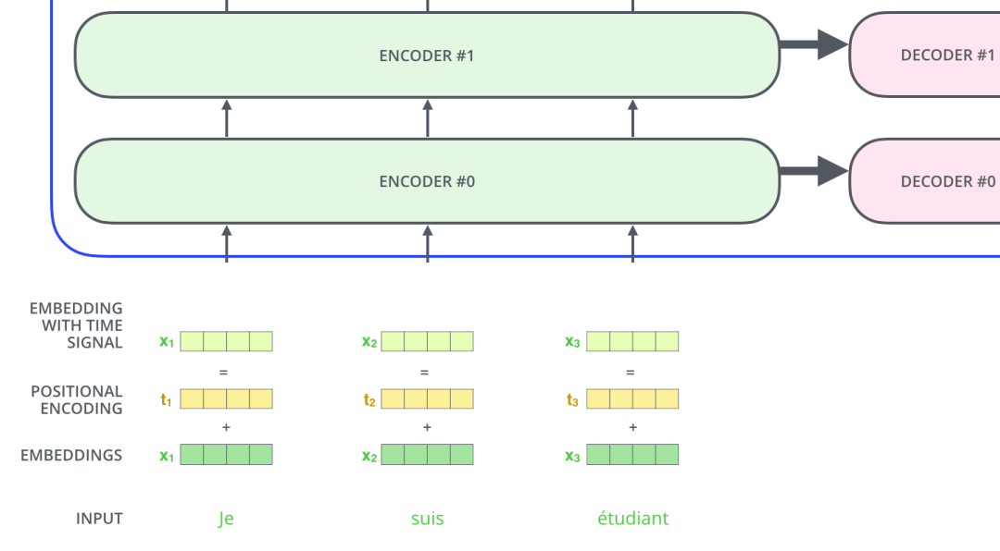

依旧假设词向量和位置向量的维度是4，我们在下图中展示一种可能的位置向量+词向量：

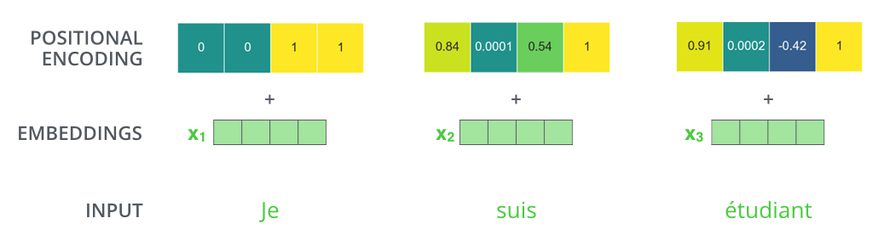

那么它是怎么把位置“塞”进去的？注意这里是是直接相加 ($+$)，而不是拼接 ($concat$)。

- **操作：** 每一个词向量（Embedding）都会加上一个相同维度的位置向量（Position Encoding）。
- **结果：** 得到的新向量 $x_1, x_2, x_3$ 既包含了单词本身的语义（比如“Je”的意思），又被染上了位置的“底色”（比如“我在第 1 位”）。

> **直觉理解：** 就像给每个单词的衣服上喷了一种特定颜色的香水。第一位的单词喷一种，第二位的喷另一种。模型通过“闻”这股香味，就能判断这个词坐在哪个位置。

那么带有位置编码信息的向量到底遵循什么模式？原始论文中给出的设计表达式为： $$ PE_{(pos,2i)} = sin(pos / 10000^{2i/d_{\text{model}}}) \ PE_{(pos,2i+1)} = cos(pos / 10000^{2i/d_{\text{model}}}) $$ 上面表达式中的$pos$代表词的位置，$d_{model}$代表位置向量的维度，$i \in [0, d_{model})$代表位置$d_{model}$维位置向量第$i$维。于是根据上述公式，我们可以得到第$pos$位置的$d_{model}$维位置向量。

估计有人要懵了这是什么跟什么,来解释一下

资料中给出了公式：

$$PE_{(pos,2i)} = \sin(pos / 10000^{2i/d_{\text{model}}})$$

$$PE_{(pos,2i+1)} = \cos(pos / 10000^{2i/d_{\text{model}}})$$

这个公式看起来很吓人，但它的本质是**利用波长不同的三角函数给位置打标**：

- **$pos$（位置下标）：** 它是第几个词。

- **$i$（维度下标）：** 在 512 维的向量里，每一维的变化频率都不一样。

- **为什么要用 $\sin$ 和 $\cos$？**

  1. **周期性：** 就像时钟的齿轮。通过不同频率的组合，模型可以唯一地确定每一个位置。
  2. **相对距离：** 因为 $\sin(A+B)$ 可以由 $\sin A, \cos B$ 等线性表示，这意味着模型不仅能知道绝对位置，还能轻松计算出词与词之间的**相对距离**。

  

在下图中，我们画出了一种位置向量在第4、5、6、7维度、不同位置的的数值大小。横坐标表示位置下标，纵坐标表示数值大小。

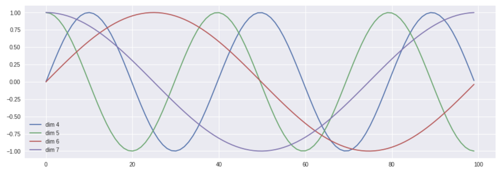

当然，上述公式不是唯一生成位置编码向量的方法。但这种方法的优点是：可以扩展到未知的序列长度。例如：当我们的模型需要翻译一个句子，而这个句子的长度大于训练集中所有句子的长度，这时，这种位置编码的方法也可以生成一样长的位置编码向量。


#### ③编码器encoder

编码部分的输入文本序列经过输入处理之后得到了一个向量序列，这个向量序列将被送入第1层编码器，第1层编码器输出的同样是一个向量序列，再接着送入下一层编码器：第1层编码器的输入是融合位置向量的词向量，*更上层编码器的输入则是上一层编码器的输出*。

下图展示了向量序列在单层encoder中的流动：融合位置信息的词向量进入self-attention层，self-attention的输出每个位置的向量再输入FFN神经网络得到每个位置的新向量。

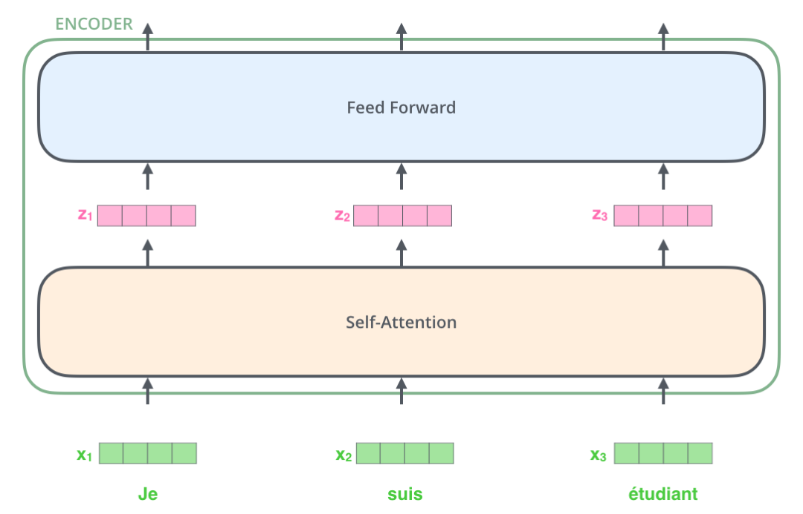

下面再看一个2个单词的例子：

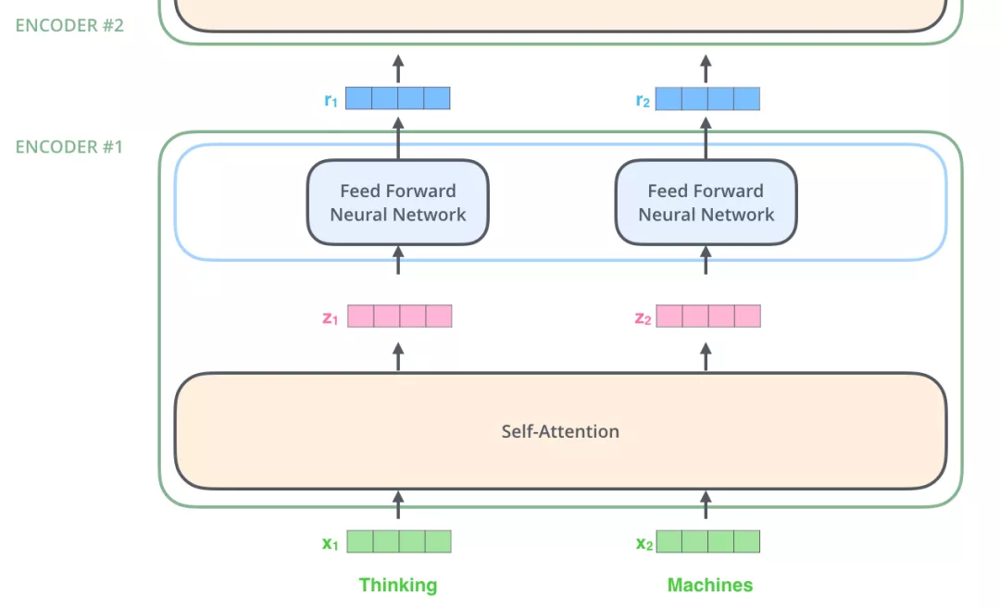

图：2个单词的例子：$x_1, x_2 \to z_1, z_2 \to r_1, r_2$


#### ④Self-Attention层

下面来分析一下上图中Self-Attention层的具体机制.

##### Self-Attention概览

假设我们想要翻译的句子是：

```
The animal didn't cross the street because it was too tired
```

这个句子中的 *it* 是一个指代词，那么 *it* 指的是什么呢？它是指 *animal* 还是*street*？这个问题对人来说，是很简单的，但是对模型来说并不是那么容易。但是，如果模型引入了*Self Attention*机制之后，便能够让模型把it和animal关联起来了。同样的，当模型处理句子中其他词时，*Self Attentio*n机制也可以使得模型不仅仅关注当前位置的词，还会关注句子中其他位置的相关的词，进而可以更好地理解当前位置的词。

与之前章节中提到的RNN对比一下：RNN 在处理序列中的一个词时，会考虑句子前面的词传过来的*hidden state*，而*hidden state*就包含了前面的词的信息；而*Self Attention*机制指得是，当前词会直接关注到自己句子中前后相关的所有词语，如下图 *it*的例子：

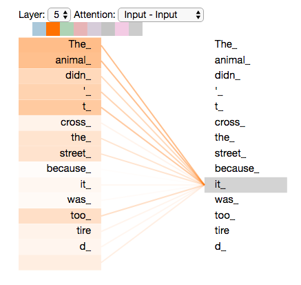

图：一个词和其他词的attention

上图所示的*it*是一个真实的例子，是当Transformer在第5层编码器编码“it”时的状态，可视化之后显示*it*有一部分注意力集中在了“The animal”上，并且把这两个词的信息融合到了"it"中。


接下来会很炸裂,因为涉及诸多计算,首先需要明白QKV


##### $Q, K, V$ 

在 Self-Attention 里，每个单词向量进入后，都会变身为三个身份。我们可以用**“找对象”**来比喻：

- **Query ($q$) —— “我的择偶标准”：** 告诉系统，我（当前单词）想要找什么样的词。
- **Key ($k$) —— “我的个人标签”：** 告诉系统，我有什么特征，欢迎别人来匹配我。
- **Value ($v$) —— “我的真实内涵”：** 如果你觉得我合适，我就把这些信息贡献给你。

要彻底理解 **$Q$（Query，查询）**、**$K$（Key，键）**和 **$V$（Value，值）**，我们不能只看数学公式，得先从它们的“出身”和“职责”聊起。

在 Transformer 之前，向量就是向量，它既要代表词义，又要参与计算，压力很大。Transformer 的天才之处在于：**它把一个单词向量“分身”成了三个不同的角色。**

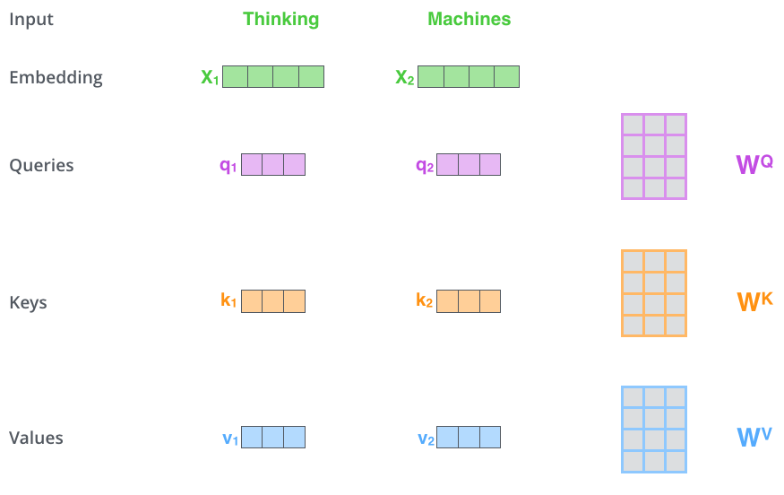

在上图中（如 **2-qkv.png**），可以看到每一个输入词向量 $x_1, x_2$ 并不是直接去算 Attention 的。

**推导公式：**

1. **$q = x \cdot W^Q$**
2. **$k = x \cdot W^K$**
3. **$v = x \cdot W^V$**

- **$x$：** 是输入的词向量（包含了 Embedding 和位置编码）。
- **$W^Q, W^K, W^V$：** 是三个**可学习的权重矩阵**。你可以把它们想象成三组不同的“滤镜”。

**本质：** 通过矩阵相乘，我们把原始的词向量 $x$ 投影到了三个不同的特征空间。这就像同一个演员（单词 $x$），在不同的剧本里扮演了三个角色：**提问者 (Q)**、**被选者 (K)**、**贡献者 (V)**。


**详细拆解：这三个角色到底是干嘛的？**

我们可以用一个**“图书馆找书”**或者**“招聘匹配”**的例子来直观理解：

**1.Query (Q - 查询) —— “我要找什么？”**

- **动作：** 当模型处理到某个词（比如 "it"）时，这个词会发出一个 $q$。
- **含义：** 它代表了当前单词对全句其他词的“需求”。
- **直觉：** "it" 的 $q$ 向量在说：“我是一个代词，我想找一个能代表我真实含义的名词。”

**1.Key (K - 键) —— “我能提供什么标签？”**

- **动作：** 句子里的每一个词（包括 "it" 自己）都会提供一个 $k$。
- **含义：** 它代表了这个词的“身份描述”，用来给别人的 $q$ 来匹配。
- **直觉：** "animal" 的 $k$ 向量在说：“我是一个动物，我是个名词，我是个主语。”

**3.Value (V - 值) —— “我真正的内涵是什么？”**

- **动作：** 每一个词也会提供一个 $v$。
- **含义：** 如果匹配成功了，系统就会把 $v$ 里的信息提取走。
- **直觉：** "animal" 的 $v$ 向量包含了关于“动物”的所有深度语义特征（比如毛发、生命体等）。

-----

##### Self-Attention细节

先通过一个简单的例子来理解一下：什么是“self-attention自注意力机制”？假设一句话包含两个单词：Thinking Machines。

自注意力的一种理解是：Thinking-Thinking，Thinking-Machines，Machines-Thinking，Machines-Machines，共$2^2$种两两attention。

那么具体如何计算呢？

假设Thinking、Machines这两个单词经过词向量算法得到向量是$X_1, X_2$： 

那么我们将分为六步去拆解:


**第1步: 计算KQV**

$$  q_1 = X_1 W^Q, q_2 = X_2 W^Q; $$

$$k_1 = X_1 W^K, k_2 = X_2 W^K;$$

$$v_1 = X_1 W^V, v_2 = X_2 W^V, W^Q, W^K, W^K \in \mathbb{R}^{d_x \times d_k}\ $$

首先每个单词通过乘以三个不同的矩阵（$W^Q, W^K, W^V$），得到自己的 $q, k, v$。

- **注意：** 这些矩阵是全句通用的，模型在训练中会学习如何提取最好的 $q, k, v$。


**第2-3步: 打分 (Scoring)与缩放 (Scaling)**

$$score_{11} = \frac{q_1 \cdot q_1}{\sqrt{d_k}} , score_{12} = \frac{q_1 \cdot q_2}{\sqrt{d_k}} ; $$

$$score_{21} = \frac{q_2 \cdot q_1}{\sqrt{d_k}}, score_{22} = \frac{q_2 \cdot q_2}{\sqrt{d_k}}; \ $$

让我们细分一下


**打分 (Scoring) —— 谁是我要找的人？**

我们要计算 "Thinking" ($q_1$) 和句中所有词（包括它自己）的匹配度。

- 计算方法是**点积 (Dot Product)**：$q_1 \cdot k_1$（看自己）和 $q_1 \cdot k_2$（看 Machines）。
- **含义：** 分数越高，说明这两个词的关系越紧密。比如在句子 "The animal... it..." 中，当处理 "it" 时，"it" 的 $q$ 和 "animal" 的 $k$ 会算出极高的分数。


**缩放 (Scaling) —— 降温**

把分数除以 $\sqrt{d_k}$（比如维度是 64，就除以 8）。

- **目的：** 防止分数太大，导致后面的 Softmax 运算进入“死区”（梯度消失），让训练更稳。


**第4步:归一化 (Softmax)**

$$score_{11} = \frac{e^{score_{11}}}{e^{score_{11}} + e^{score_{12}}},score_{12} = \frac{e^{score_{12}}}{e^{score_{11}} + e^{score_{12}}}; score_{21} = \frac{e^{score_{21}}}{e^{score_{21}} + e^{score_{22}}},score_{22} = \frac{e^{score_{22}}}{e^{score_{21}} + e^{score_{22}}} \ $$ 


**归一化 (Softmax) —— 确定注意力权重**

通过 Softmax，把分数变成 0 到 1 之间的百分比，且总和为 1。

- **图 2-think2** 显示：Thinking 对自己的注意力是 0.88，对 Machines 是 0.12。
- **这代表：** 在当前语境下，Thinking 的含义 88% 取决于自己，12% 取决于 Machines。


**第5-6步:加权与求和 (Weighting & Summing) —— 融合新意义**

$$ z_1 = v_1 \times score_{11} + v_2 \times score_{12}; z_2 = v_1 \times score_{21} + v_2 \times score_{22} $$

1. 用刚才的百分比（0.88 和 0.12）去乘以对应的 **Value ($v$)**。
2. 把结果加起来，得到最终的输出 $z_1$。


下面，我们将上诉self-attention计算的6个步骤进行可视化。

第1步：对输入编码器的词向量进行线性变换得到：Query向量: $q_1, q_2$，Key向量: $k_1, k_2$，Value向量: $v_1, v_2$。这3个向量是词向量分别和3个参数矩阵相乘得到的，而这个矩阵也是是模型要学习的参数。


Query向量：$q_1, q_2$，Key向量: $k_1, k_2$，Value向量: $v_1, v_2$。

Query 向量，Key 向量，Value 向量是什么含义呢？

其实它们就是 3 个向量，给它们加上一个名称，可以让我们更好地理解 Self-Attention 的计算过程和逻辑。attention计算的逻辑常常可以描述为：**query和key计算相关或者叫attention得分，然后根据attention得分对value进行加权求和。**


第2步：计算Attention Score（注意力分数）。假设我们现在计算第一个词*Thinking* 的Attention Score（注意力分数），需要根据*Thinking* 对应的词向量，对句子中的其他词向量都计算一个分数。这些分数决定了我们在编码*Thinking*这个词时，需要对句子中其他位置的词向量的权重。

Attention score是根据"*Thinking*" 对应的 Query 向量和其他位置的每个词的 Key 向量进行点积得到的。Thinking的第一个Attention Score就是$q_1$和$k_1$的内积，第二个分数就是$q_1$和$k_2$的点积。这个计算过程在下图中进行了展示，下图里的具体得分数据是为了表达方便而自定义的。

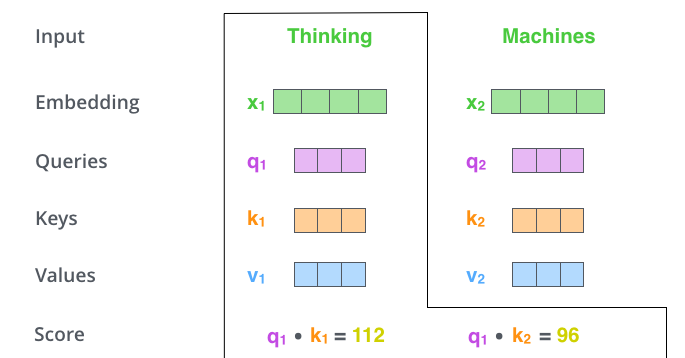

第3步：把每个分数除以 $\sqrt{d_k}$，$d_{k}$是Key向量的维度。你也可以除以其他数，除以一个数是为了在反向传播时，求梯度时更加稳定。

第4步：接着把这些分数经过一个Softmax函数，Softmax可以将分数归一化，这样使得分数都是正数并且加起来等于1， 如下图所示。 这些分数决定了Thinking词向量，对其他所有位置的词向量分别有多少的注意力。

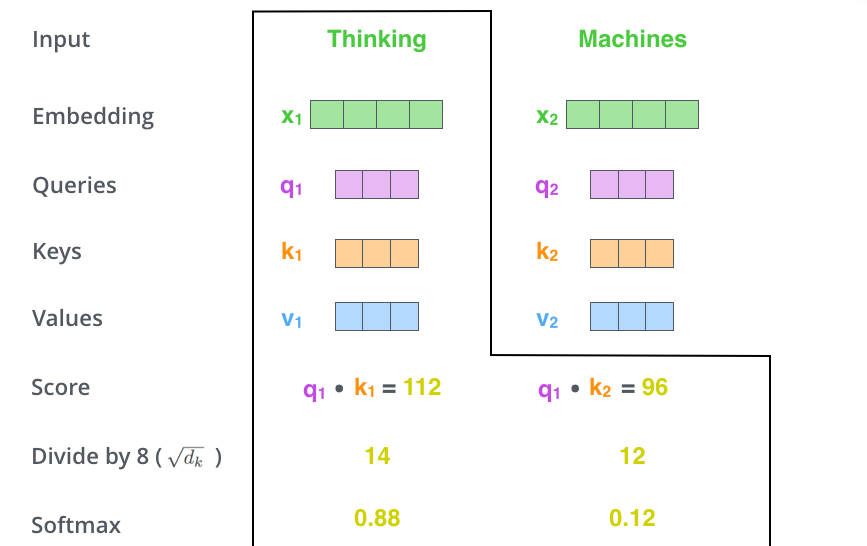

第5步：得到每个词向量的分数后，将分数分别与对应的Value向量相乘。这种做法背后的直觉理解就是：对于分数高的位置，相乘后的值就越大，我们把更多的注意力放到了它们身上；对于分数低的位置，相乘后的值就越小，这些位置的词可能是相关性不大的。

第6步：把第5步得到的Value向量相加，就得到了Self Attention在当前位置（这里的例子是第1个位置）对应的输出。

最后，在下图展示了 对第一个位置词向量计算Self Attention 的全过程。最终得到的当前位置（这里的例子是第一个位置）词向量会继续输入到前馈神经网络。注意：上面的6个步骤每次只能计算一个位置的输出向量，在实际的代码实现中，Self Attention的计算过程是使用矩阵快速计算的，一次就得到所有位置的输出向量。

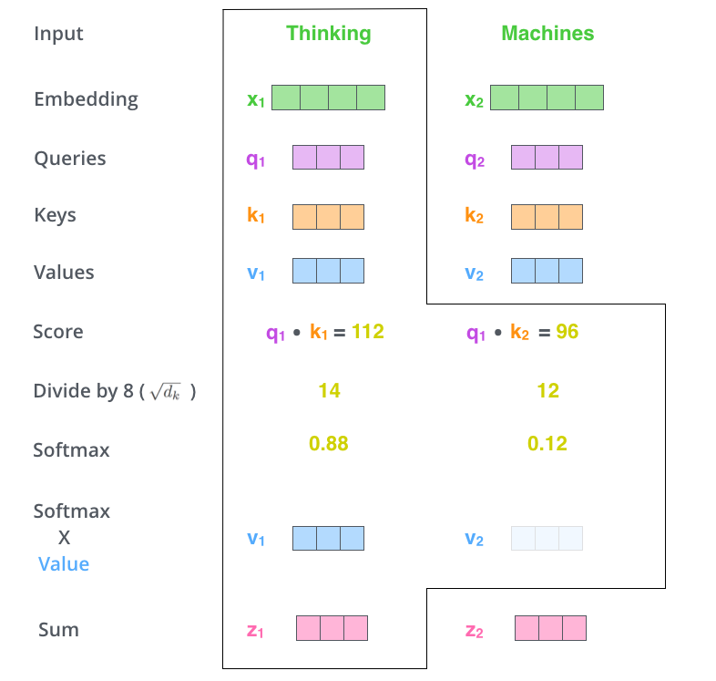

**匹配（$Q \cdot K$）：** 拿 "Thinking" 的 $q_1$ 去跟全句所有词的 $k$ 做点积。点积在数学上衡量的是**相似度**。

- 如果 $q_1$（找动作执行者）和 $k_1$（我是个动词）很像，分数就高。

**打分（Softmax）：** 把分数变成权重百分比（比如 0.88, 0.12）。

**提取（$\times V$）：** 根据权重，去提取大家的 $v$。

- 因为 "Thinking" 跟自己的匹配度最高，所以它会拿走 $v_1$ 中 88% 的信息；同时它觉得 "Machines" 也有点关系，于是拿走 $v_2$ 中 12% 的信息。

**融合：** 把这些拿回来的信息加在一起，就得到了这个词在当前语境下的新表示。


你可能有问题

**1.为什么要费这么大劲算这个？**

**答案是：为了让单词“活”起来。**

- **RNN 的问题：** 无论什么语境，“苹果”的含义在进入 hidden state 前基本是死的。
- **Self-Attention 的魔力：** 经过这 6 步，输出的 $z_1$ 不再是原始的 "Thinking"。它是一个**“吸收了全句精华后的 Thinking”**。
- 就像 **图 2-attention-word** 展示的那样，"it" 这个词在经过计算后，它的向量里已经偷偷“装进”了 "animal" 的特征。


**2.为什么要设计成 $Q, K, V$ 三个，而不是直接用 $X$？**

**解耦需求与身份：** 在一个句子中，同一个词作为“寻找者”时的需求，和它作为“被找者”时的标签，往往是不一样的。

- 比如在“我（A） 打（B） 球（C）”中：
  - “打”（B）作为 $Q$ 时，它想找动作的发出者（主语）和承受者（宾语）。
  - “打”（B）作为 $K$ 时，它要标记自己是一个谓语动词。
- **如果不分 $Q, K, V$：** 所有的计算都会被限制在同一个线性空间里，模型就很难学习到这种复杂的、不对称的关系（比如 A 对 B 很重要，但 B 对 A 不一定重要）。


##### Self-Attention矩阵计算

将self-attention计算6个步骤中的向量放一起，比如$X=[x_1;x_2]$，便可以进行矩阵计算啦。下面，依旧按步骤展示self-attention的矩阵计算方法。 

$$ X = [X_1;X_2] \ Q = X W^Q, K = X W^K, V=X W^V \ Z = softmax(\frac{QK^T}{\sqrt{d_k}}) V $$ 

**第1步：计算 Query，Key，Value 的矩阵。**

首先，我们把所有词向量放到一个矩阵X中，然后分别和3个权重矩阵$W^Q, W^K W^V$ 相乘，得到 Q，K，V 矩阵。矩阵X中的每一行，表示句子中的每一个词的词向量。

Q，K，V 矩阵中的每一行表示 Query向量，Key向量，Value 向量，向量维度是$d_k$。

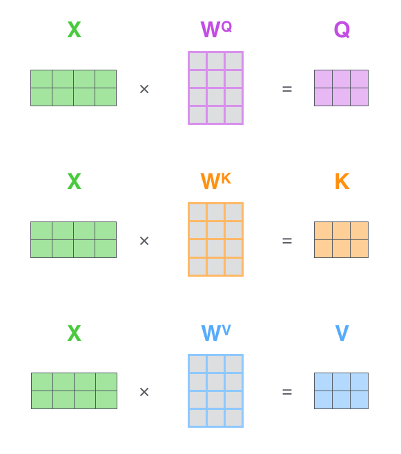

**第2步：由于我们使用了矩阵来计算，我们可以把上面的第 2 步到第 6 步压缩为一步，直接得到 Self Attention 的输出。**

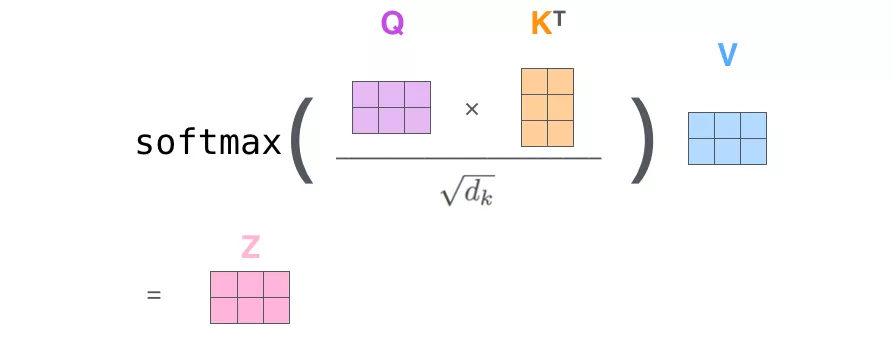

> 你可能有问题:
>
> #### 1. $X$ 是单个词向量还是全体的总和？
>
> 在矩阵运算中，$X$ 既不是单个词，也不是它们的加法总和，而是它们的**“堆叠组合”**。
>
> - **物理形态：** 假设你的句子有 $n$ 个单词，每个词向量的维度是 $d$。那么矩阵 $X$ 就是一个 **$n \times d$** 的大表格。
> - **每一行代表一个词：** 第一行是 $x_1$（比如 Thinking），第二行是 $x_2$（比如 Machines）。
> - **为什么要这么排？** * **并行化：** 如果你一个词一个词算，那是 RNN 的做法。把它们排成一个矩阵 $X$，计算机（尤其是 GPU）就可以一次性把整句话的 $Q, K, V$ 全部算出来。
>   - **矩阵运算：** 当 $X$ 乘以 $W^Q$ 时，矩阵乘法的规则会自动让每一行（每个单词）都和权重矩阵相乘，互不干扰，效率极高。
>
> 
>
> #### 2. 权重矩阵 ($W^Q, W^K, W^V$) 是怎么来的？谁定义的？
>
> 这是一个典型的“先有框架，后有灵魂”的过程：
>
> ① 谁定义的？（程序员定义“形状”）
>
> **算法工程师（或者说模型的设计者）\**定义了这些矩阵的\**维度（Shape）**。
>
> - 比如你定义词向量 $d=512$，想让 $Q, K, V$ 的维度也是 64。那么你就会定义 $W^Q$ 是一个 $512 \times 64$ 的矩阵。
> - **但这时的矩阵里全是随机乱跳的数字（噪声）**，它现在什么也不会。
>
> ② 它是怎么来的？（机器定义“数值”）
>
> 这些矩阵里的具体数值，是**通过海量数据的训练（Training）**得来的。
>
> 1. **随机初始化：** 模型刚出生时，$W^Q, W^K, W^V$ 里的数字是随机生成的。此时它的 Attention 乱指一气。
> 2. **预测与纠错：** 模型尝试翻译一个句子，结果发现翻错了。
> 3. **反向传播 (Backpropagation)：** 系统计算出误差，然后顺着网络往回找，告诉这些权重矩阵：“嘿，$W^Q$ 你刚才那个数字太大了，导致模型没关注到主语，往小了调一点！”
> 4. **进化：** 经过几千亿次这样的微调（梯度下降），这些矩阵里的数字终于定型了。
>
> > **本质：** 权重矩阵就是模型的**“知识资产”**。模型之所以聪明，全在这些数字里。它们学会了如何把原始的 $X$ 投影到一个能反映语义联系的空间。
>
> #### 3.深度理解：如果没有权重矩阵会怎样？
>
> 如果你直接拿 $X$ 去跟 $X$ 算 Attention，而不经过 $W$ 变换，那么：
>
> - **没有学习能力：** 单词之间的关系被写死了。
> - **视角单一：** 每一层能学到的东西都一样。
> - **有了 $W$：** 不同的权重矩阵就像不同的**“滤镜”**。有的滤镜专门看语法，有的专门看情感。这也是为什么 Transformer 可以有“多头（Multi-Head）”——因为我们可以定义很多组不同的 $W$ 矩阵。


#### 多头注意力机制

Transformer 的论文通过增加多头注意力机制（一组注意力称为一个 attention head），进一步完善了Self-Attention。这种机制从如下两个方面增强了attention层的能力：

- **它扩展了模型关注不同位置的能力**。在上面的例子中，第一个位置的输出$z_1$包含了句子中其他每个位置的很小一部分信息，但$z_1$仅仅是单个向量，所以可能仅由第1个位置的信息主导了。

- 而当我们翻译句子：`The animal didn’t cross the street because it was too tired`时，我们不仅希望模型关注到"it"本身，还希望模型关注到"The"和“animal”，甚至关注到"tired"。这时，多头注意力机制会有帮助。

  如果你只有**一双眼睛（单头）**，当你看到 "it" 时，你可能只能注意到 "it" 指的是 "animal"（语法关系）。 但如果你有**多双眼睛（多头）**：

  - **第一双眼（橙色头）：** 盯着语法，发现 "it" 指代 "animal"。
  - **第二双眼（绿色头）：** 盯着状态，发现 "it" 的属性是 "tired"。
  - **第三双眼：** 盯着动作，发现 "it" 的行为是 "cross"。

- **多头注意力机制赋予attention层多个“子表示空间”**。下面我们会看到，多头注意力机制会有多组$W^Q, W^K W^V$ 的权重矩阵（在 Transformer 的论文中，使用了 8 组注意力),，因此可以将$X$变换到更多种子空间进行表示。接下来我们也使用8组注意力头（attention heads））。每一组注意力的权重矩阵都是随机初始化的，但经过训练之后，每一组注意力的权重$W^Q, W^K W^V$ 可以把输入的向量映射到一个对应的”子表示空间“。

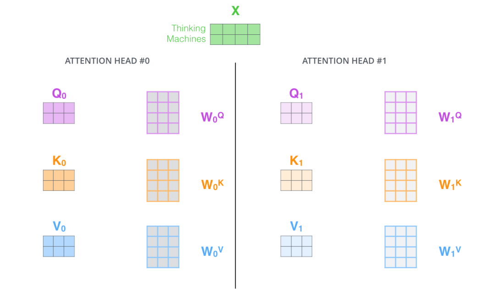

在多头注意力机制中，我们不再只有一组 $W^Q, W^K, W^V$,我们为每组注意力设定单独的 WQ, WK, WV 参数矩阵。每一组的参数都是随机初始化的，所以它们会进化出不同的“眼光”。

将输入X和每组注意力的WQ, WK, WV 相乘，得到8组 Q, K, V 矩阵。

接着，我们把这 8 组 QKV 各自按照我们之前学的 6 步流程计算。得到每组的 Z 矩阵，你会得到 8 个不同的输出矩阵 $Z_0, Z_1, \dots, Z_7$。

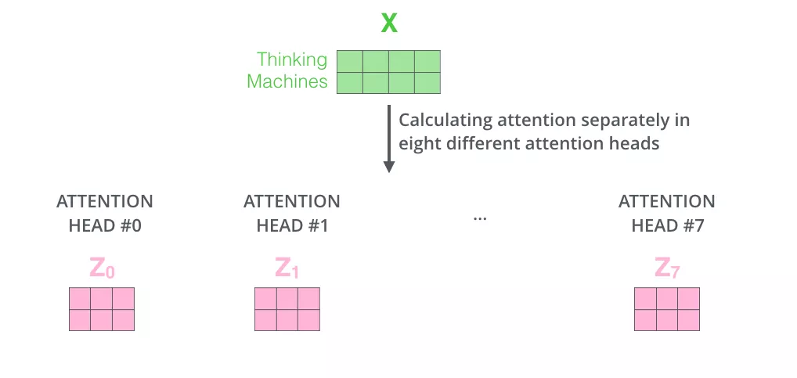

现在问题来了：后面的**前馈神经网络（FFNN）**是个死心眼，它只接收一个矩阵，不接收 8 个(由于前馈神经网络层接收的是 1 个矩阵,其中每行的向量表示一个词，且也不是 8 个矩阵，)。

所以我们 简单粗暴，把这 8 个 $Z$ 矩阵横着“粘”在一起，变成一个超级宽的长方形矩阵，但是拼接后的矩阵太宽了，没法直接传给下一层。

所以我们再定义一个专门的权重矩阵 **$W^O$**,让宽矩阵乘以 $W^O$，把它“压缩”回原来的维度（比如 512 维）,这个 $W^O$ 就像是一个**主编**，它负责把 8 个专家的报告（$Z_0 \sim Z_7$）汇总成一份精简的最终稿（最终的 $Z$）。最终映射到前馈神经网络层所需要的维度。

> #### $W^O$ 的不是空的！它有“权重”
>
> 在机器学习里，只要带 $W$ 的，都是需要通过海量数据**训练出来的参数**。
>
> - **它的身份：** $W^O$ 是一个**可学习的线性变换层（Linear Layer）**。
> - **它的初始化：** 刚开始它确实是一堆随机数，但经过训练后，它记住了：**哪些头的报告更可信，哪些头的信息应该组合在一起产生新意义。**
>
> 
>
> #### **这么压缩会发生信息丢失吗？**
>
> 在数学上，当我们将一个高维向量（拼接后的宽矩阵）映射回低维向量（原来的 $d_{model}$ 维度）时，确实存在**维度压缩**。但这种“丢失”在深度学习中通常被称为**“特征提取”或“降噪”**。
>
> - **为什么不叫丢失：** * 实际上，在 Transformer 的设计中，通常 $8 \text{个头} \times \text{每个头的维度 (64)} = 512$。
>   - 拼接后的总长度正好等于原始维度 $d_{model}$（也是 512）。
>   - 所以，$W^O$ 其实是在做一次 **$512 \times 512$ 的线性变换**。空间并没有变小，只是把 8 个头的零散信息进行了一次**全方位的“化学反应”**。
> - **如果有丢失，也是故意的：** 即便维度变小了，模型也会通过训练学会保留最核心的、对预测下一个词最有用的信息，而扔掉那些重复的、无用的噪音。

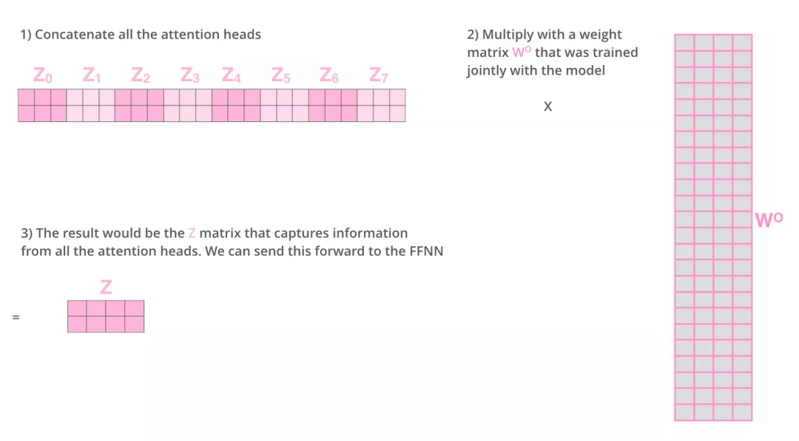

关于长度以及怎么变成Z请看:

在你的直觉里，如上图所示,你可能觉得 $Z_0, Z_1 \dots$ 每一个的宽度都和原始词向量 $X$ 一样宽（比如 512）。如果真是那样，8 个拼在一起确实会变成 4096 宽。

但实际上，**每一头在出生时就进行了“瘦身”：**

- **原始宽度 ($d_{model}$)**：512。
- **头的数量 ($h$)**：8。
- **每个头的宽度 ($d_k$)**：$512 \div 8 = \mathbf{64}$。

所以，你看图中的 $Z_0$ 到 $Z_7$，它们每一个都只有 **64 维**。

让我们带入数字算一遍：

1. **输入 $X$**：是一个 $2 \times 512$ 的矩阵（假设 2 个单词）。
2. **拆分**：我们用 8 组不同的矩阵，把这 512 维的信息拆分到了 8 个“子空间”里。每个头只负责处理其中的 **64 维**。
   - $Z_0$ 是 $2 \times 64$
   - $Z_1$ 是 $2 \times 64$
   - ……
3. **拼接 (Concatenate)**：把这 8 个 $2 \times 64$ 的矩阵横着粘在一起。
   - 计算：$64 \times 8 = \mathbf{512}$。
4. **结果**：拼接后的矩阵尺寸正好又是 **$2 \times 512$**。


> **那为什么还需要 $W^O$？**
>
> 既然拼接完已经是 512 宽了，为什么还要乘以一个 $W^O$ 矩阵呢？
>
> 虽然宽度回到了 512，但现在的 512 维是**“各说各话”**的：
>
> - 前 64 维是专家 0 的意见。
> - 次 64 维是专家 1 的意见。
> - ……
>
> 这就像是 8 个翻译官每人写了一段话，然后你把这 8 段话生硬地粘在了一起。
>
> **$W^O$ 的作用是“化学反应”：**
>
> - 它是一个 $512 \times 512$ 的矩阵。
> - 当拼接后的矩阵乘以 $W^O$ 时，它会把这 8 个专家的意见进行**加权融合**。
> - **最终输出的 $Z$ ($2 \times 512$)**：它的每一维都不再只属于某一个专家，而是 8 个专家共同商议后的结果。

总结一下就是：

1. 把8个矩阵 {Z0,Z1...,Z7} 拼接起来
2. 把拼接后的矩阵和WO权重矩阵相乘
3. 得到最终的矩阵Z，这个矩阵包含了所有 attention heads（注意力头） 的信息。这个矩阵会输入到FFNN (Feed Forward Neural Network)层。

以上就是多头注意力的全部内容。最后将所有内容放到一张图中,它展示了从 Embedding 输入，到 8 组矩阵并行计算，最后拼接、投影（$W^O$）的完整闭环。：

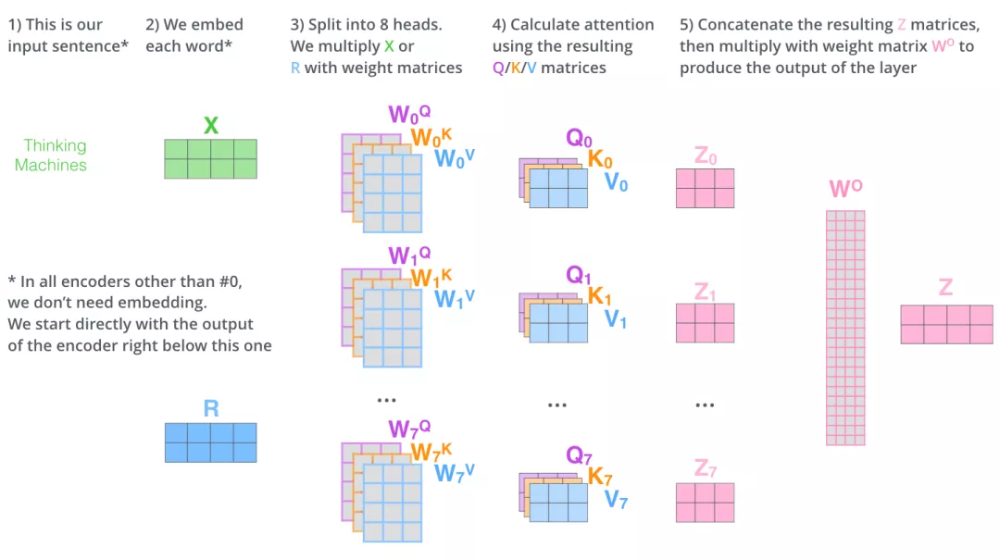

学习了多头注意力机制，让我们再来看下当我们前面提到的it例子，不同的attention heads （注意力头）对应的“it”attention了哪些内容。下图中的绿色和橙色线条分别表示2组不同的attentin heads：

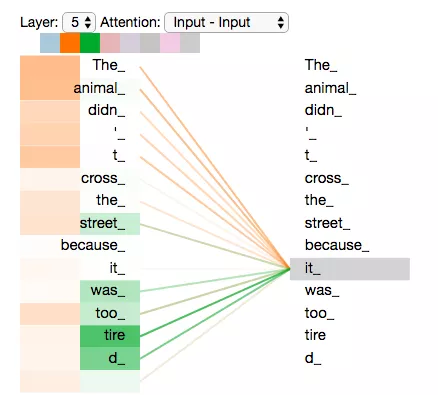

当我们编码单词"it"时，橙色线条和绿色线条指向了不同的词。这就是两个“头”在各忙各的：一个在找**“它是谁”**（animal），一个在找**“它怎么了”**（tired）。其中一个 attention head （橙色注意力头）最关注的是"the animal"，另外一个绿色 attention head 关注的是"tired"。这就是多头机制的威力——**它能同时捕捉多个维度的关联。**

因此在某种意义上，"it"在模型中的表示，融合了"animal"和"tire"的部分表达。

