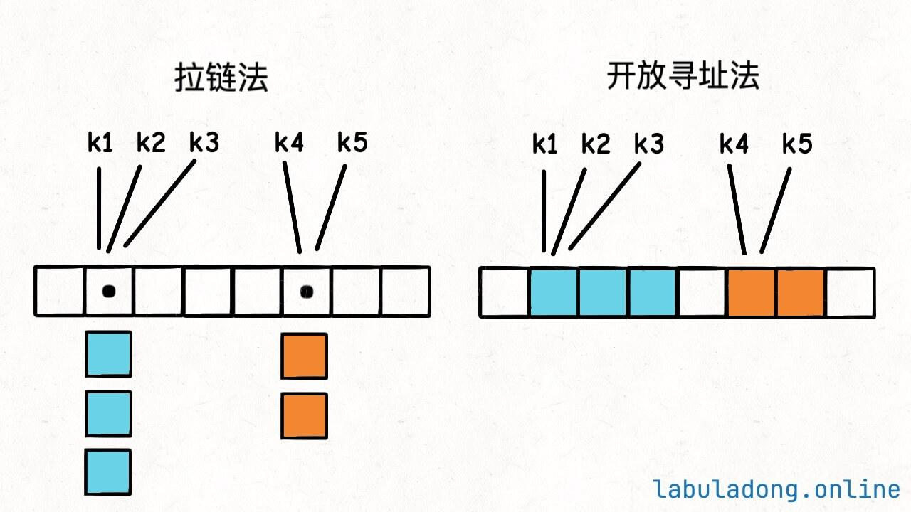
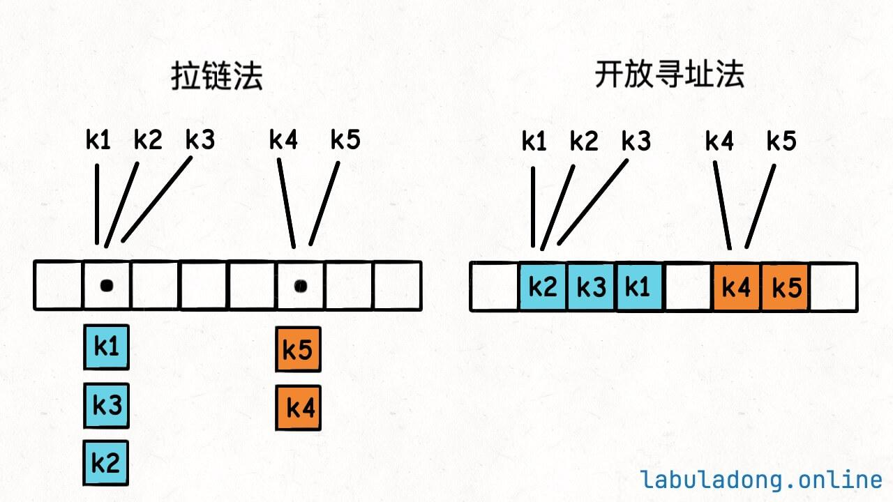

# 基础

## 时间复杂度

### 简单理解

1、时空复杂度用 Big O 表示法表示（类似$ O(1),O(n2),O(logn)$ 等）。**它们都是估计值，不需要精确计算，常数项和低增长项都可以忽略，仅需保留最高增长项**。

比方说 $O(2n2+3n+1)$等同于 $O(n2)$，$O(1000n+1000)$等同于 $O(n)$。

2、我们分析算法复杂度时，分析的是最坏情况的复杂度。这一点会在下面的示例中体现。

3、时间复杂度用来衡量一个算法的执行效率，空间复杂度用来衡量算法的内存消耗，它们都是越小越好。

比方说时间复杂度 $O(n)$ 的算法比 $O(n2)$ 的算法执行效率高，空间复杂度 $O(1)$ 的算法比 $O(n)$ 的算法内存消耗小。

当然，一般我们要说明这个 $n*$* 代表什么，比如 $n$代表输入的数组的长度。

4、如何估算？**现在你可以简单理解：时间复杂度大部分情况下就是看 for 循环的最大嵌套层数；空间复杂度就看算法申请了多少空间来存储数据**


### 时间/空间复杂度案例分析

**示例一，时间复杂度 $O(n)$，空间复杂度 $O(1)\$**：

```java
// 输入一个整数数组，返回所有元素的和
int getSum(int[] nums) {
    int sum = 0;
    for (int i = 0; i < nums.length; i++) {
        sum += nums[i];
    }
    return sum;
}
```

算法包含一个 for 循环遍历 `nums` 数组，所以时间复杂度是$ O(n)$，其中 `n` 代表 `nums` 数组的长度。

我们的算法只使用了一个 `sum` 变量，这个 `nums` 是题目给的输入，不算在我们算法的空间复杂度里面，所以空间复杂度是 $ O(1)$。


**示例二，时间复杂度 $O(n)$，空间复杂度 $O(1)$**：

```java
// 当 n 是 10 的倍数时，计算累加和，否则返回 -1
int sum(int n) {
    if (n % 10 != 0) {
        return -1;
    }
    int sum = 0;
    for (int i = 0; i <= n; i++) {
        sum += i;
    }
    return sum;
}
```

其实只有当 `n` 是 10 的倍数时，算法才会执行 for 循环，时间复杂度是 $O(n)$。其他情况下算法会直接返回，时间复杂度是 $O(1)$。

但是算法复杂度只考察最坏情况，所以这个算法的时间复杂度是 $O(n)$，空间复杂度是 $O(1)$。


**示例三，时间复杂度 $O(n^2)$，空间复杂度 $O(1)$**：

```java
// 数组是否存在两个数，它们的和为 target？
boolean hasTargetSum(int[] nums, int target) {
    for (int i = 0; i < nums.length; i++) {
        for (int j = i + 1; j < nums.length; j++) {
            if (nums[i] + nums[j] == target) {
                return true;
            }
        }
    }
    return false;
}
```

算法嵌套了两层 for 循环，所以时间复杂度是 $O(n^2)$，其中 $n$ 代表 `nums` 数组的长度。

我们的算法只使用了 `i, j` 两个变量，这是常数级别的空间消耗，所以空间复杂度是 O(1)*O*(1)。

你也许会说，内层的 for 循环并没有遍历整个数组，且有可能提前 return，算法实际执行的次数应该是小于$ n^2$ 的，时间复杂度还是 $O(n^2)$吗？

是的，还是 $O(n^2)$。具体到不同的输入，算法的实际执行次数确实会小于 $O(n^2)$，但我们不需要关心这些细节，估算一个最坏情况的时间复杂度就可以了。

每层 for 循环在最坏情况下都是 $O(n)$ 的时间复杂度，套在一起，总的时间复杂度是 $O(n^2)$。


**示例四，时间复杂度 $O(n)$，空间复杂度 $O(n)$**：

```java
void exampleFn(int n) {
    int[] nums = new int[n];
}
```

这个函数中创建了一个大小为 `n` 的数组，所以空间复杂度是 $O(n)$。	

上述代码申请数组空间并将 `n` 个元素初始化为 0。内存申请操作的时间复杂度可以认为是  $O(n)$，但为所有元素赋值的操作相当于一个隐藏的 for 循环（由编程语言为我们自动完成），时间复杂度是  $O(n)$。所以总的时间复杂度是  $O(n)$。

时间复杂度并不仅仅体现在你看得到的 for 循环，每一行代码都可能有隐藏的时间复杂度。所以说要了解编程语言提供的常用数据结构实现原理，这是准确分析时间复杂度的基础。


**示例五，时间复杂度 $O(n)$，空间复杂度 $O(n)$**：

```Java
// 输入一个整数数组，返回一个新的数组，新数组的每个元素是原数组对应元素的平方
int[] squareArray(int[] nums) {
    int[] res = new int[nums.length];
    for (int i = 0; i < nums.length; i++) {
        res[i] = nums[i] * nums[i];
    }
    return res;
}
```

算法初始化 `res` 数组需要 $O(n)$ 的时间复杂度，包含一个 for 循环，时间复杂度也是 $O(n)$，总的时间复杂度是还是 $O(n)$ 其中 `n` 代表 `nums` 数组的长度。

我们声明了一个新的数组 `res`，这个数组的长度和 `nums` 数组一样，所以空间复杂度是 O(n)*O*(*n*)。

好了，初学者明白上面这些基本的时间、空间复杂度分析暂时就够用了，继续往下学习吧。


## 数组/动态数组(手把手带你实现动态数组)

静态数组在创建的时候就要确定数组的元素类型和元素数量。只有在 C++、Java、Golang 这类语言中才提供了创建静态数组的方式，类似 Python、JavaScript 这类语言并没有提供静态数组的定义方式。

静态数组的用法比较原始，实际软件开发中很少用到，写算法题也没必要用，我们一般直接用动态数组。但为了理解原理，在这里还是要讲解一下。

定义一个静态数组的方法如下：

```java
// 定义一个大小为 10 的静态数组
int[] arr = new int[10];

// 使用索引赋值
arr[0] = 1;
arr[1] = 2;

// 使用索引取值
int a = arr[0];
```


就这，没有其他什么操作了。

拿 Java来举例吧，`int arr[10]` 这段代码到底做了什么事情呢？主要有这么几件事：

1、在内存中开辟了一段**连续的内存空间**，大小是 `10 * sizeof(int)` 字节。一个 int 在计算机内存中占 4 字节，也就是总共 40 字节。

2、定义了一个名为 `arr` 的数组指针，指向这段内存空间的首地址。

那么 `arr[1] = 2` 这段代码又做了什么事情呢？主要有这么几件事：

1、计算 `arr` 的首地址加上 `1 * sizeof(int)` 字节（4 字节）的偏移量，找到了内存空间中的第二个元素的**首地址**。

2、从这个地址开始的 4 个字节的内存空间中写入了整数 `2`。

> 写给初学者
>
> 我记得以前刚上大学的时候要学 C 语言基础，有些同学就绕不清楚什么指针的数组，数组的指针，绕来绕去的。其实只要明白了上面这个简单的流程，一切就很清楚了。
>
> 1、为什么数组的索引从 0 开始？就是方便取地址。`arr[0]` 就是 `arr` 的首地址，从这个地址往后的 4 个字节存储着第一个元素的值；`arr[1]` 就是 `arr` 的首地址加上 `1 * 4` 字节，也就是第二个元素的首地址，这个地址往后的 4 个字节存储着第二个元素的值。`arr[2], arr[3]` 以此类推。
>
> 2、因为数组的名字 `arr` 就指向整块内存的首地址，所以数组名 `arr` 就是一个指针。你直接取这个地址的值，就是第一个元素的值。也就是说，`*arr` 的值就是 `arr[0]`，即第一个元素的值。
>
> 3、如果不用 `memset` 这种函数初始化数组的值，那么数组内的值是不确定的。因为 `int arr[10]` 这个语句只是请操作系统在内存中开辟了一块连续的内存空间，你也不知道这块空间是谁使用过的二手内存，你也不知道里面存了什么奇奇怪怪的东西。所以一般我们会用 `memset` 函数把这块内存空间的值初始化一下再使用。
>
> 当然，上面讲的这些内容都是针对 C/C++，因为大家学习计算机基础的时候都接触过。其他比如 Java Golang 这种语言，静态数组创建出来后会自动帮你把元素值都初始化为 0，所以不需要再显式进行初始化。

我梳理一下上面的因果逻辑，静态数组本质上就是一块**连续的**内存空间，`int arr[10]` 这个语句我们可以得知：

1、我们知道这块内存空间的首地址（数组名 `arr` 就指向这块内存空间的首地址）。

2、我们知道了每个元素的类型（比如 int），也就是知道了每个元素占用的内存空间大小（比如一个 int 占 4 字节，32 bit）。

3、这块内存空间是连续的，其大小为 `10 * sizeof(int)` 即 40 字节。

**所以，我们获得了数组的超能力「随机访问」：只要给定任何一个数组索引，我可以在 $O(1)$ 的时间内直接获取到对应元素的值**。

因为我可以通过首地址和索引直接计算出目标元素的内存地址。计算机的内存寻址时间可以认为是 $O(1)$，所以数组的随机访问时间复杂度是 $O(1)$。

但是，一个人最大的优势往往也是他的最大劣势。数组连续内存的特性给了他随机访问的超能力，但它也因此吃了不少苦，下面介绍。


### 增删查改

**数据结构的职责就是增删查改**，再无其他。

那么刚刚介绍数组这种数据结构的底层原理，我们其实只介绍了「查」和「改」的部分，也就是通过索引修改和访问对应元素的值。那么「增删」这两个操作又是如何实现的呢？


#### 增

要想给静态数组增加元素，这就有些复杂了，需要分情况讨论。

**情况一，数组末尾追加（append）元素**

比方说，我有一个大小为 10 的数组，里面装了 4 个元素，现在想在末尾追加一个元素，怎么办？

比较简单，直接在对应的索引赋值就行了，这是大概的代码逻辑：

```java
// 大小为 10 的数组已经装了 4 个元素
int[] arr = new int[10];
for (int i = 0; i < 4; i++) {
    arr[i] = i;
}

// 现在想在数组末尾追加一个元素 4
arr[4] = 4;

// 再在数组末尾追加一个元素 5
arr[5] = 5;

// 依此类推
// ...
```

**可以看到，由于只是对索引赋值，所以在数组末尾追加元素的时间复杂度是 O(1)\*O\*(1)**。

情况二，数组中间插入（insert）元素

比方说，我有一个大小为 10 的数组 `arr`，前 4 个位置装了元素，现在想在第 3 个位置（索引 2 `arr[2]`）插入一个新元素，怎么办？

这就要涉及「数据搬移」，给新元素腾出空位，然后再才能插入新元素。大概的代码逻辑是这样的：

```java
// 大小为 10 的数组已经装了 4 个元素
int[] arr = new int[10];
for (int i = 0; i < 4; i++) {
    arr[i] = i;
}

// 在索引 2 置插入元素 666
// 需要把索引 2 以及之后的元素都往后移动一位
// 注意要倒着遍历数组中已有元素避免覆盖，不懂的话请看下方可视化面板
for (int i = 4; i > 2; i--) {
    arr[i] = arr[i - 1];
}

// 现在第 3 个位置空出来了，可以插入新元素
arr[2] = 666;
```

**综上，在数组中间插入元素的时间复杂度是 $O(N)$，因为涉及到数据搬移，给新元素腾地方**


情况三，数组空间已满

静态数组在创建时就要确定大小，比方说现在我创建了一个数组 `int arr[10]`（一块 40 字节的连续内存空间），然后往里面存了 10 个元素，这时候我想再插入一个元素，怎么办？无论是追加在尾部还是插入到中间，都没有位置留给新元素了。

有的读者可能说，这个简单呀，在这 40 字节后面再加上 4 个字节的连续内存空间，用来存储新的元素，不就行了吗？

**不行的，连续内存必须一次性分配，分配完了之后就不能随意增减了**。因为你这块连续内存后面的内存空间可能已经被其他程序占用了，不能说你想要就给你。

那怎么办呢？只能重新申请一块更大的内存空间，把原来的数据复制过去，再插入新的元素，这就是数组的「扩容」操作。

比方说，我重新创建一个更大的数组 `int arr[20]`，然后把原来的 10 个元素复制过去，这样就有空余位置插入新的元素了。

大概的逻辑是这样的：

```java
// 大小为 10 的数组已经装满了
int[] arr = new int[10];
for (int i = 0; i < 10; i++) {
    arr[i] = i;
}

// 现在想在数组末尾追加一个元素 10
// 需要先扩容数组
int[] newArr = new int[20];
// 把原来的 10 个元素复制过去
for (int i = 0; i < 10; i++) {
    newArr[i] = arr[i];
}

// 旧数组的内存空间将由垃圾收集器处理
// ...

// 在新的大数组中追加新元素
newArr[10] = 10;
```

**综上，数组的扩容操作会涉及到新数组的开辟和数据的复制，时间复杂度是 $O(N)$。**


#### 删

删除元素的操作和增加元素的操作类似，也需要分情况讨论。

**情况一，删除末尾元素**

比方说，我有一个大小为 10 的数组，里面装了 5 个元素，现在想删除末尾的元素，怎么办？

很简单，直接把末尾元素标记为一个特殊值代表已删除就行了，我们这里简单举例，就用 -1 作为特殊值代表已删除好了。后面带大家具体实现动态数组的时候，会有更完善的方法删除数组元素，这里只是为了说明删除数组尾部元素的本质就是进行一次随机访问，时间复杂度是 $O(1)$。

大概的代码逻辑是这样的：

```java
// 大小为 10 的数组已经装了 5 个元素
int[] arr = new int[10];
for (int i = 0; i < 5; i++) {
    arr[i] = i;
}

// 删除末尾元素，暂时用 -1 代表元素已删除
arr[4] = -1;
```


**情况二，删除中间元素**

比方说，我有一个大小为 10 的数组，里面装了 5 个元素，现在想删除第 2 个元素（`arr[1]`），怎么办？

这也要涉及「数据搬移」，把被删元素后面的元素都往前移动一位，保持数组元素的连续性。

大概的代码逻辑是这样的：

```java
// 大小为 10 的数组已经装了 5 个元素
int[] arr = new int[10];
for (int i = 0; i < 5; i++) {
    arr[i] = i;
}

// 删除 arr[1]
// 需要把 arr[1] 之后的元素都往前移动一位
// 注意要正着遍历数组中已有元素避免覆盖，不懂的话请看下方可视化面板
for (int i = 1; i < 4; i++) {
    arr[i] = arr[i + 1];
}

// 最后一个元素置为 -1 代表已删除
arr[4] = -1;
```


**综上，在数组中间删除元素的时间复杂度是 $O(N)$，因为涉及到数据搬移**。


### 动态数组

刚才讲了静态数组的超能力和种种局限性，现在讲动态数组，动态数组是静态数组的强化版，也是我们在实际软件开发或者写算法题时最常用的数据结构之一。

首先，你不要以为动态数组可以解决静态数组在中间增删元素效率差的问题，不可能解决的。数组随机访问的超能力源于数组连续的内存空间，而连续的内存空间就不可避免地面对数据搬移和扩缩容的问题。

**动态数组底层还是静态数组，只是自动帮我们进行数组空间的扩缩容，并把增删查改操作进行了封装，让我们使用起来更方便而已**。

简单列举一下各个语言的动态数组使用方法：

```java
// 创建动态数组
// 不用显式指定数组大小，它会根据实际存储的元素数量自动扩缩容
ArrayList<Integer> arr = new ArrayList<>();

for (int i = 0; i < 10; i++) {
    // 在末尾追加元素，时间复杂度 O(1)
    arr.add(i);
}

// 在中间插入元素，时间复杂度 O(N)
// 在索引 2 的位置插入元素 666
arr.add(2, 666);

// 在头部插入元素，时间复杂度 O(N)
arr.add(0, -1);

// 删除末尾元素，时间复杂度 O(1)
arr.remove(arr.size() - 1);

// 删除中间元素，时间复杂度 O(N)
// 删除索引 2 的元素
arr.remove(2);

// 根据索引查询元素，时间复杂度 O(1)
int a = arr.get(0);

// 根据索引修改元素，时间复杂度 O(1)
arr.set(0, 100);

// 根据元素值查找索引，时间复杂度 O(N)
int index = arr.indexOf(666);
```

在后面的章节，我会手把手带大家实现一个动态数组，让大家更加深入地理解动态数组的原理。


### 环形数组技巧及实现

一句话总结:

环形数组技巧利用求模（余数）运算，将普通数组变成逻辑上的环形数组，可以让我们用 $O(1)$ 的时间在数组头部增删元素。

> 这里解释一下
>
> #### 1.取余
>
> 在计算机内存里，数组其实还是直的。我们怎么让它在逻辑上“首尾相连”呢？**靠的就是 `%`（取余）。**
>
> 假设数组长度 `length = 5`：
>
> - **向后走（顺时针）：** `(i + 1) % 5`。 当 `i = 4` 时，`(4 + 1) % 5 = 0`。看！它从末尾跳回了开头！
> - **向前走（逆时针）：** `(i - 1 + 5) % 5`。 当 `i = 0` 时，`(0 - 1 + 5) % 5 = 4`。看！它从开头跳回了末尾！
>
> 为什么要-1?
>
> - 是因为我想去前一个格子,假设你现在站在 **0 号格**（数组的第一个位置）,往前走一格，`0 - 1 = -1`。
>
> 但为什么要+5,而不能直接 `(0 - 1) % 5`？?
>
> - 因为在很多编程语言（包括 Java）中，负数取模的结果可能是负数（比如 `-1 % 5` 结果是 `-1`），这依然没法用作数组索引。
>
> 
>
> #### 2.复杂度为$O(1)$
>
> 假设我们有一个长度为 **5** 的物理数组，现在里面只有 **a, b, c** 三个元素。
>
> 在环形结构里，`head` 和 `tail` 不一定非要从 0 开始。假设初始状态如下：
>
> **物理存储：** `[ _, a, b, c, _ ]` （下划线代表空位）
>
> **索引位置：**     ` 0, 1, 2, 3, 4`
>
> **指针状态：** `head = 1` (指向 a), `tail = 3` (指向 c)
>
> 
>
> **现在执行动作：在头部插入元素 `d` （即 `addFirst(d)`）**
>
> 如果我们按照普通数组的逻辑，要把 `a, b, c` 都往后挪一位，腾出 `index 1` 给 `d`。但环形数组不这么干。
>
> 第一步：计算新 `head` 的位置
>
> 利用我们学过的“向左走”公式：
>
> $$newHead = (head - 1 + 5) \% 5$$
>
> $$newHead = (1 - 1 + 5) \% 5 = 0$$
>
> 
>
> 第二步：填入数据
>
> 把 `d` 放入物理数组的 `index 0`。
>
> - **物理存储：** `[ d, a, b, c, _ ]`
>
> 
>
> 第三步：更新指针
>
> `head` 变为 `0`。此时，逻辑上的顺序是 `head(0) -> 1 -> 2 -> 3(tail)`，即 `d, a, b, c`。
>
> **为什么这次操作是 $O(1)$？**
>
> 你看，计算机只是做了一次减法、一次取模、一次赋值。**a, b, c 动都没动**。
>
> 
>
> 动作：再在头部插入元素 `e` （见证“环形”的瞬间）
>
> 现在我们想再加一个 `e`。
>
> 第一步：计算新 `head`
>
> $$newHead = (head - 1 + 5) \% 5$$
>
> 由于现在的 `head` 是 `0`：
>
> $$newHead = (0 - 1 + 5) \% 5 = 4$$
>
> 第二步：填入数据
>
> 把 `e` 放入物理数组的 `index 4`。
>
> - **物理存储：** `[ d, a, b, c, e ]` （注意！e 跑到数组末尾去了）
>
> 第三步：更新指针
>
> `head` 变为 `4`。
>
> 
>
> 虽然物理上数组看起来乱七八糟 `[d, a, b, c, e]`，但对于 `ArrayDeque` 来说，它只认指针：
>
> - 它从 `head` (索引 4) 开始读：第一个是 **e**。
> - 下一位 `(4+1)%5 = 0`：第二个是 **d**。
> - 下一位 `(0+1)%5 = 1`：第三个是 **a**。
> - 以此类推...
>
> **逻辑顺序变成了：e -> d -> a -> b -> c**
>
> 当然如果是快满了,java会自动检测到 `head` 和 `tail` 快要碰头,然后执行扩容


### 环形数组原理

上面介绍了基本概念,那么我们来看看原理,其实也属于上面的概念扩展,需要强调的是:<span style="color:red">这里物理上本质永远都是普通数组,不存在一个叫做环形数组的单独构型,所以我们讨论的**环形数组**这个概念是逻辑上的,体现在size的取模上</span>

#### 概念再次强化

首先数组可能是环形的么？不可能。数组就是一块线性连续的内存空间，怎么可能有环的概念？

但是，我们可以在「逻辑上」把数组变成环形的,所以**环形数组**始终讨论的逻辑上的闭环，比如下面这段代码：

```java
// 长度为 5 的数组
int[] arr = new int[]{1, 2, 3, 4, 5};
int i = 0;
// 模拟环形数组，这个循环永远不会结束
while (i < arr.length) {
    System.out.println(arr[i]);
    i = (i + 1) % arr.length;
}
```

**这段代码的关键在于求模运算 `%`，也就是求余数**。当 `i` 到达数组末尾元素时，`i + 1` 和 `arr.length` 取余数又会变成 0，即会回到数组头部，这样就在逻辑上形成了一个环形数组，永远遍历不完。

这就是环形数组技巧。这个技巧如何帮助我们在 O(1)*O*(1) 的时间在数组头部增删元素呢？

> 下面内容和上面的前言一致,但我写的前言会更加细致一些,看不懂看前言

是这样，假设我们现在有一个长度为 6 的数组，现在其中只装了 3 个元素，如下（未装元素的位置用 `_` 标识）：

```
[1, 2, 3, _, _, _]
```

现在我们要在数组头部删除元素 `1`，那么我们可以把数组变成这样：

```
[_, 2, 3, _, _, _]
```

即，我们仅仅把元素 `1` 的位置标记为空，但并不做数据搬移。

此时，如果我们要在数组头部增加元素 `4` 和元素 `5`，我们可以把数组变成这样：

```
[4, 2, 3, _, _, 5]
```

你可以看到，当头部没有位置添加新元素时，它转了一圈，把新元素加到尾部了。


**核心原理**

上面只是让大家对环形数组有一个直观地印象，环形数组的关键在于，它维护了两个指针 `start` 和 `end`，`start` 指向第一个有效元素的索引，`end` 指向最后一个有效元素的下一个位置索引。

这样，当我们在数组头部添加或删除元素时，只需要移动 `start` 索引，而在数组尾部添加或删除元素时，只需要移动 `end` 索引。

当 `start, end` 移动超出数组边界（`< 0` 或 `>= arr.length`）时，我们可以通过求模运算 `%` 让它们转一圈到数组头部或尾部继续工作，这样就实现了环形数组的效果。


####  动手环节

纸上得来终觉浅，绝知此事要躬行。

> 关键点、注意开闭区间
>
> 在我的代码中，环形数组的区间被定义为左闭右开的，即 `[start, end)` 区间包含数组元素。所以其他的方法都是以左闭右开区间为基础实现的。
>
> 那么肯定就会有读者问，为啥要左闭右开，我就是想两端都开，或者两端都闭，不行么？
>
> 在 [滑动窗口算法核心框架](https://labuladong.online/zh/algo/essential-technique/sliding-window-framework/) 中定义滑动窗口的边界时也会有类似的问题，这里我也解释一下。
>
> **理论上，你可以随意设计区间的开闭，但一般设计为左闭右开区间是最方便处理的**。
>
> 因为这样初始化 `start = end = 0` 时，区间 `[0, 0)` 中没有元素，但只要让 `end` 向右移动（扩大）一位，区间 `[0, 1)` 就包含一个元素 `0` 了。
>
> 如果你设置为两端都开的区间，那么让 `end` 向右移动一位后开区间 `(0, 1)` 仍然没有元素；
> 例如如果你想包含“0号”这个元素,得把 `end` 挪到 `1`，变成 `(0, 1)`。但是 `end` 永远比你实际想要的元素大，而 `start` 永远比你想要的元素小。这种“两头够不着”的感觉会让逻辑变得极其混乱。
>
> 如果你设置为两端都闭的区间，那么初始区间 `[0, 0]` 就已经包含了一个元素。为了表示“空仓库”，你不得不把 `end` 设为 `-1`（即 `[0, -1]`）。
>
> 这两种情况都会给边界处理带来不必要的麻烦，如果你非要使用的话，需要在代码中做一些特殊处理。

最后，请看代码实现：

```java
public class CycleArray<T> {
    private T[] arr;
    private int start;
    private int end;
    private int count;
    private int size;

    //可以不写无参,但是这样每次都必须写一个确定的值类似于new CycleArray(10)
    //所以不如写了无参但是让有参处理一个默认的初始值 用户直接写 new CycleArray(),然后系统自动给个默认值
    public CycleArray() {
        //这里因为1是int类型所以就会自动丢给底下的有参(int size)处理,写1是最小默认,节省地方,想写10 1000(太占地方了)都可以
        this(1);
    }

    public CycleArray(int size) {
        this.size = size;
        this.arr = (T[]) new Object[size];
        this.start = 0;
        this.end = 0;
        this.count = 0;
    }


    // 自动扩缩容辅助函数
    private void resize(int newSize){
        T[] newArr = (T[])new Object[newSize];
        for (int i = 0; i < count; i++) {
            //这里还用取模是因为 可以跳到 [ E, _, B, C, D ] 里的E所在的地方,
            // 从而形成新的[ B, C, D, E, _, _, _, _, _, _ ]
            newArr[i] = arr[(start+i)%size];
        }
        arr = newArr;
        start = 0;
        end = count;
        size = newSize;

    }


    public void addFirst(T val){
        if(isFull()){
            resize(size*2);
        }
        //左边是闭区间,然后往前插入,就要-1
        start = (start-1+size)%size;
        arr[start] = val;
        count++;
    }

    public void removeFirst(){
        if (isEmpty()){
            throw new IllegalStateException("Array is empty");
        }
        arr[start] = null;
        start = (start + 1 + size)%size;
        count --;
        // 如果数组元素数量减少到原大小的四分之一，则减小数组大小为一半
        if (count>0 && count == size/4){
            //这里的count>0是防止数组刚产生就会为0,举例count为0,size为3,此时不加>0就会直接触发 因为resize(这时条件只有count==3/4)而3/4会变成0满足
            //resize里的参数会变成新的size,于是此时size为0,而取模运算中size会作为分母,分母为0会触发ArithmeticException: / by zero。
            resize(size/2);
        }

    }

    // 获取数组头部元素，时间复杂度 O(1)
    public T getHead(){
        if (isEmpty()){
            throw new IllegalStateException("Array is empty");
        }

        return arr[start];
    }

    public T getLast(){
        if (isEmpty()){
            throw new IllegalStateException("Array is empty");
        }
        return arr[(end-1+size)%size];
    }


    public void addLast(T val){
        if(isFull()){
            resize(size*2);
        }
        // 因为 end 是开区间，所以是先赋值，再右移
        arr[end] = val;
        end = (end + 1 )%size;
        count++;
    }

    public void removeLast(){
        if (isEmpty()){
            throw new IllegalStateException("Array is empty");
        }
        end = (end-1 +size)%size;
        arr[end] = null;
        count--;
        if (count> 0 && count==size/4){
            resize(size/2);
        }
    }


    public boolean isEmpty() {
        return count==0;
    }

    public boolean isFull() {
        return count == size;
    }
}
```

再次强调,<span style="color:red">这里物理上永远都是普通数组,而**环形数组**这个概念是逻辑上的,体现在size的取模上,而resize是一个大洗牌保证了扩展后start和end会回到我们期望构想的环形两端</span>


#### 思考题

数组增删头部元素的效率真的只能是$ O(N)$么？

我们都说，在数组增删头部元素的时间复杂度是 O(N)*O*(*N*)，因为需要搬移元素。但是，如果我们使用环形数组，其实是可以实现在 $O(1)$ 的时间复杂度内增删头部元素的。

当然，上面实现的这个环形数组只提供了 `addFirst, removeFirst, addLast, removeLast` 这几个方法，并没有提供 [我们之前实现的动态数组](https://labuladong.online/zh/algo/data-structure-basic/array-implement/) 的某些方法，比如删除指定索引的元素，获取指定索引的元素，在指定索引插入元素等等。

但是你可以思考一下，难道环形数组实现不了这些方法么？环形数组实现这些方法，时间复杂度相比普通数组，有退化吗？

好像没有吧。

环形数组也可以删除指定索引的元素，也要做数据搬移，和普通数组一样，复杂度是 O(N)*O*(*N*)；

环形数组也可以获取指定索引的元素（随机访问），只不过不是直接访问对应索引，而是要通过 `start` 计算出真实索引，但计算和访问的时间复杂度依然是 $O(1)$；

环形数组也可以在指定索引插入元素，当然也要做数据搬移，和普通数组一样，复杂度是 $O(N)$。

你可以思考一下是不是这样。如果是这样，为什么编程语言的标准库中提供的动态数组容器底层并没有用环形数组技巧。

> 答:
> ①环形数组的每一次 `get(i)` 都要做加法和取模运算。而 `ArrayList` 的核心使命是**极致的随机访问速度**。为了一个不常用的“删头”操作，去拖慢全世界所有 `get` 操作的速度，在工程上是不划算的。
>
> ②普通数组的数据在物理内存上是绝对线性连续的，CPU 预取数据时非常开心。环形数组如果发生了“绕回”，数据在逻辑上连续但在物理上跳跃，这会对 **CPU 缓存命中率** 产生微小的负面影响。
>
> 假设物理数组长度为 5，地址从 `100` 到 `116`。目前里面存了 `A, B, C, D` 四个元素，且发生了“绕回”：
>
> **物理存储状况：**
>
> - 索引 0：`D` (地址 **100**) —— 这是逻辑上的**末尾**
> - 索引 1：`空` (地址 **104**)
> - 索引 2：`A` (地址 **108**) —— 这是逻辑上的**开头** (start)
> - 索引 3：`B` (地址 **112**)
> - 索引 4：`C` (地址 **116**)
>
> **当你按顺序读取（A -> B -> C -> D）时：**
>
> 1. 读取 A：访问地址 **108**
> 2. 读取 B：访问地址 **112** (递增 +4)
> 3. 读取 C：访问地址 **116** (递增 +4)
> 4. 读取 D：**跳跃！** 访问地址 **100** (从高地址**猛地跳回**低地址)
>
> ③标准库的设计原则是：**“让简单的东西保持简单”**。
>
> - 如果你想要最快的索引访问，用 `ArrayList`。
> - 如果你想要最快的双端增删，用 `ArrayDeque`（它的底层就是你刚才写的环形数组）。

#### 实际场景

**A. 实现队列 (FIFO)**

这是最常见的场景。比如银行排队系统、任务调度系统。因为队列需要不断从头部取数据，如果用普通数组，系统会因为不断的搬运数据而卡死。

**B. 环形缓冲区 (Ring Buffer) —— 高级进阶**

在高性能领域（如**音频流处理、网络数据包接收、日志系统**），环形数组是唯一的王者 。

- **逻辑：** 设定一个固定大小的圆环。新数据不断进来，老数据不断被覆盖。
- **优点：** 永远不需要 `resize`，永远不需要搬运数据，空间利用率极高。

**C. 滑动窗口算法**

比如你要计算“最近 10 分钟的平均股价”。你可以用一个长度为 10 的环形数组，每过一分钟存一个新价格，顶掉最老的那个。


## 链表（链式存储）基本原理

### 1.定义

如果说**数组**是一排**排好号的电影院座位**（位置固定且连在一起），那么**链表**就是一场**全城范围的寻宝游戏**。

链表（linked list）是一种线性数据结构，其中的每个元素都是一个节点对象，各个节点通过“引用”相连接。引用记录了下一个节点的内存地址，通过它可以从当前节点访问到下一个节点。


链表的“人话”定义:

在链表里，数据不是排排坐的。每个数据（我们叫它**节点 Node**）都住在内存的一个随机角落里。

为了能找到彼此，每个节点手里都拽着一张小纸条，上面写着：**“下一个人的地址在哪里”**。

一个典型的节点包含两部分：

1. **数据域 (Data)：** 存你的宝贝（数字、字符串等）。
2. **指针域 (Next)：** 指向下一个节点的内存地址。


观察上图:链表的组成单位是节点（node）对象。每个节点都包含两项数据：节点的“值”和指向下一节点的“引用”。

- 链表的首个节点被称为“头节点”，最后一个节点被称为“尾节点”。
- 尾节点指向的是“空”，它在 Java、C++ 和 Python 中分别被记为 `null`、`nullptr` 和 `None` 。
- 在 C、C++、Go 和 Rust 等支持指针的语言中，上述“引用”应被替换为“指针”。


### **2.链表家族**

1. **单链表：** 只有 `Next` 指针。就像单行道，只能往前走，回不了头。
2. **双链表：** 每个节点既有 `Next` 也有 `Prev`（指向前一个）。就像双向车道，虽然费点内存，但更灵活。
3. **循环链表：** 最后一个人的 `Next` 指向了第一个人。像个圆环（常用于解决“约瑟夫环”问题或轮询调度）。


刷过力扣的读者肯定对单链表非常熟悉，力扣上的单链表节点定义如下：

```java
class ListNode {
    int val;
    ListNode next;
    ListNode(int x) { val = x; }
}
```

这仅仅是一个最简单的**单链表节点**，方便力扣出算法题来考你。在实际的编程语言中，我们使用的链表节点会稍微复杂一点，类似这样：

```java
class Node<E> {
    E val;
    Node<E> next;
    Node<E> prev;

    Node(Node<E> prev, E element, Node<E> next) {
        this.val = element;
        this.next = next;
        this.prev = prev;
    }
}
```

主要区别有两个：

1、编程语言标准库一般都会提供泛型，即你可以指定 `val` 字段为任意类型，而力扣的单链表节点的 `val` 字段只有 int 类型。

2、编程语言标准库一般使用的都是双链表而非单链表。单链表节点只有一个 `next` 指针，指向下一个节点；而双链表节点有两个指针，`prev` 指向前一个节点，`next` 指向下一个节点。

有了 `prev` 前驱指针，链表支持双向遍历，但由于要多维护一个指针，增删查改时会稍微复杂一些，后面带大家实现双链表时会具体介绍。


### 3.为什么要发明链表？

数组不是挺好吗？

前面介绍了 [数组（顺序存储）的底层原理](https://labuladong.online/zh/algo/data-structure-basic/array-basic/)，说白了就是一块连续的内存空间，有了这块内存空间的首地址，就能直接通过索引计算出任意位置的元素地址。

链表不一样，一条链表并不需要一整块连续的内存空间存储元素。链表的元素可以分散在内存空间的天涯海角，通过每个节点上的 `next, prev` 指针，将零散的内存块串联起来形成一个链式结构。

这样做的好处很明显，首先就是可以提高内存的利用效率，链表的节点不需要挨在一起，给点内存 new 出来一个节点就能用，操作系统会觉得这娃好养活。

另外一个好处，它的节点要用的时候就能接上，不用的时候拆掉就行了，从来不需要考虑扩缩容和数据搬移的问题，理论上讲，链表是没有容量限制的（除非把所有内存都占满，这不太可能）。

当然，不可能只有好处没有局限性。数组最大的优势是支持通过索引快速访问元素，而链表就不支持。

这个不难理解吧，因为元素并不是紧挨着的，所以如果你想要访问第 3 个链表元素，你就只能从头结点开始往顺着 `next` 指针往后找，直到找到第 3 个节点才行。

上面是对链表这种数据结构的基本介绍，接下来我们就结合代码实现单/双链表的几个基本操作。


> 附上数组和链表的对比

| **特性**            | **数组 (Array)**              | **链表 (Linked List)**      | **谁赢了？** |
| ------------------- | ----------------------------- | --------------------------- | ------------ |
| **找第 i 个元素**   | 瞬间找到 ($O(1)$)             | 得从头一个一个数 ($O(n)$)   | **数组**     |
| **在中间插入/删除** | 后面所有人都要挪位置 ($O(n)$) | 只要把“纸条”改一下 ($O(1)$) | **链表**     |
| **内存分配**        | 必须提前要一块连续的大地盘    | 随用随申请，哪里有空住哪里  | **链表**     |


### 4.ListNode和DoublyListNode到底是什么:

在之后我们很快就会见到ListNode和DoublyListNode,来说一下他们这个类到底是什么:

<span style="color:red">DoublyNodeList里面存储着val以及prev和next的DoublyNodeList对象,然后这里的prev和next是以地址存在的,在实际我们的遍历中,是通过next以及prev的地址然后得到对应的prev以及next的DoublyNodeList对象,然后里面存储着下下一个(相对于首个节点而言)的val以及prev和next的DoublyNodeList对象,这样在遍历的**感官**上让我们感觉好像拥有了prev以及next里的内容,但**实际上只根据当前节点根本不知道下一个节点里的实际内容,因为本质上是地址**,然后我们是通过地址访问相当于才跳转并刷新出下一个节点的内容,再不进入下一个节点之前,当前节点的next实际上存储的只是冷冰冰的地址</span>


### 单链表

#### 基本操作

我先写一个工具函数，用于创建一条单链表，方便后面的讲解：

```java
class ListNode {
    int val;
    ListNode next;
    ListNode(int x) { val = x; }
}

// 输入一个数组，转换为一条单链表
ListNode createLinkedList(int[] arr) {
    if (arr == null || arr.length == 0) {
        return null;
    }
    //不变的头
    ListNode head = new ListNode(arr[0]);
    //cur是一个随时往下走的指针
    ListNode cur = head;
    for (int i = 1; i < arr.length; i++) {
        cur.next = new ListNode(arr[i]);
        cur = cur.next;
    }
    return head;
}
```


对于上面整个自定义的工具类多说一下,我们不依赖createLinkedList手动就可以实现链表,createLinkedList把手动指定的环节 工具化:

```java
ListNode a = new ListNode(1);
ListNode b = new ListNode(2);
ListNode c = new ListNode(3);

a.next = b;
b.next = c;


ListNode pointer = a;
while(pointer!=null){
	System.out.println(pointer.val);
    pointer = pointer.next;
}

```

重点就在 ListNode里的next,彼此通过next连接,此时的初始值pointer存储的是数值"1"以及1下一个地址("2"的地址)

我们一步一步来看;
①ListNode a = new ListNode(1);

此时a只有数值val=1,还没有next的值,此时为null

②然后a.next = b;

此时a就有了数值val=1 以及下一个的地址(也就是数值为2名为b的**地址**)

b和c以及未来新加的都同理,所以当连起来后,只要知道a,尽管a只有b的值,从他开始他也会知道b,c乃至未来的d,e

然后pointer(header)在这里就是从第一个开始,然后一个遍历而已

知道这个就明白:`createLinkedList`是帮我们把手动a.next = b的这个过程通过遍历来实现了


#### 查/改

**单链表的遍历/查找/修改**

比方说，我想访问单链表的每一个节点，并打印其值，可以这样写：

```java
// 创建一条单链表
ListNode head = createLinkedList(new int[]{1, 2, 3, 4, 5});

// 遍历单链表
for (ListNode p = head; p != null; p = p.next) {
    System.out.println(p.val);
}
```

类似的，如果是要通过索引访问或修改链表中的某个节点，也只能用 for 循环从头结点开始往后找，直到找到索引对应的节点，然后进行访问或修改。

这个操作的最坏时间复杂度是 O(n)*O*(*n*)，其中 n*n* 是链表的长度。


#### 增

##### 1.在单链表头部插入新元素

我们会持有单链表的头结点，所以只需要将插入的节点接到头结点之前，并将新插入的节点作为头结点即可。

```java
// 创建一条单链表
ListNode head = createLinkedList(new int[]{1, 2, 3, 4, 5});

// 在单链表头部插入一个新节点 0
ListNode newNode = new ListNode(0);
//此时已经连上了
newNode.next = head;
//这一步的意义是让火车头知道谁是新的,不然每次要通过mewNode从头开始不利于规范
head = newNode;

// 现在链表变成了 0 -> 1 -> 2 -> 3 -> 4 -> 5
```

这个操作的时间复杂度是 $O(1)$。


##### 2.在单链表尾部插入新元素

直接看代码吧，很简单：

```java
// 创建一条单链表
ListNode head = createLinkedList(new int[]{1, 2, 3, 4, 5});

// 在单链表尾部插入一个新节点 6
ListNode p = head;
// 先走到链表的最后一个节点
while (p.next != null) {
    p = p.next;
}
// 现在 p 就是链表的最后一个节点
// 在 p 后面插入新节点
p.next = new ListNode(6);

// 现在链表变成了 1 -> 2 -> 3 -> 4 -> 5 -> 6
```

这个操作的时间复杂度是 O(n)，因为需要先遍历到链表尾部。当然，如果我们持有对链表尾节点的引用，那么在尾部插入新节点的操作就会变得非常简单，不用每次从头去遍历了。这个优化会在后面具体实现双链表时介绍。


##### 3.在单链表中间插入新元素

这个操作稍微有点复杂，我们还是要先找到要插入位置的前驱节点，然后操作前驱节点把新节点插入进去：

```java
// 创建一条单链表
ListNode head = createLinkedList(new int[]{1, 2, 3, 4, 5});

// 在第 3 个节点后面插入一个新节点 66
// 先要找到前驱节点，即第 3 个节点
ListNode p = head;
for (int i = 0; i < 2; i++) {
    p = p.next;
}
// 此时 p 指向第 3 个节点
// 组装新节点的后驱指针
ListNode newNode = new ListNode(66);
newNode.next = p.next;

// 插入新节点
p.next = newNode;

// 现在链表变成了 1 -> 2 -> 3 -> 66 -> 4 -> 5
```

这个操作的时间复杂度是 $O(n)$，因为需要先找到插入位置的前驱节点。


#### 删

##### 1.在单链表中删除一个节点

删除一个节点，首先要找到要被删除节点的前驱节点，然后把这个前驱节点的 `next` 指针指向被删除节点的下一个节点。这样就能把被删除节点从链表中摘除了。

```java
// 创建一条单链表
ListNode head = createLinkedList(new int[]{1, 2, 3, 4, 5});

// 删除第 4 个节点，要操作前驱节点
ListNode p = head;
for (int i = 0; i < 2; i++) {
    p = p.next;
}

// 此时 p 指向第 3 个节点，即要删除节点的前驱节点
// 把第 4 个节点从链表中摘除
p.next = p.next.next;

// 现在链表变成了 1 -> 2 -> 3 -> 5
```

这个操作的时间复杂度是 $O(n)$，因为需要先找到被删除节点的前驱节点。


##### 2.在单链表尾部删除元素

这个操作比较简单，找到倒数第二个节点，然后把它的 `next` 指针置为 null 就行了：

```java
// 创建一条单链表
ListNode head = createLinkedList(new int[]{1, 2, 3, 4, 5});

// 删除尾节点
ListNode p = head;
// 找到倒数第二个节点
while (p.next.next != null) {
    p = p.next;
}

// 此时 p 指向倒数第二个节点
// 把尾节点从链表中摘除
p.next = null;

// 现在链表变成了 1 -> 2 -> 3 -> 4
```

这个操作的时间复杂度是 $O(n)$，因为需要先遍历到倒数第二个节点。


##### 3.在单链表头部删除元素

这个操作比较简单，直接把 `head` 移动到下一个节点就行了，直接看代码吧：

```java
// 创建一条单链表
ListNode head = createLinkedList(new int[]{1, 2, 3, 4, 5});

// 删除头结点
head = head.next;

// 现在链表变成了 2 -> 3 -> 4 -> 5
```

这个操作的时间复杂度是 $O(1)$。

不过可能有读者疑惑，之前那个旧的头结点 `1` 的 next 指针依然指向着节点 `2`，这样会不会造成内存泄漏？

不会的，这个节点 `1` 指向其他的节点是没关系的，只要保证没有其他引用指向这个节点 `1`，它就能被垃圾回收器回收掉。

当然，如果你非要显式把节点 `1` 的 next 指针置为 null，这是个很好的习惯，在其他场景中可能可以避免指针错乱的潜在问题。

在下面这个可视化面板中，我显式地把待删除节点的 next 指针置为 null 了：

> 链表的增删查改操作确实比数组复杂。这是因为链表的节点不是紧挨着的，所以要增删一个节点，必须先找到它的前驱和后驱节点进行协同，然后才能通过指针操作把它插入或删除。
>
> 上面给出的代码还仅仅是最简单的例子，你会发现在头部、尾部、中间增删元素的代码都不一样。如果要实现一个真正可用的链表，你还要考虑到很多边界情况，比如链表可能为空、前后驱节点可能为空等，这些情况都得保证不出错。
>
> 而且，上面只是介绍了「单链表」，而我们下一章要实现的是「双链表」，双链表要同时维护前驱和后驱指针，指针操作会更复杂一些。
>
> 是不是已经不敢想了？不要怕，其实没你想的那么难，几个原因：
>
> 1、其实搞来搞去就那几个操作，等会儿带你动手实现链表 API 的时候，你亲自写一写，就会了。
>
> 2、复杂操作我都配了可视化面板，你可以结合面板中的代码和动画进行理解。
>
> 3、最重要的，我们会使用「**虚拟头结点**」技巧，把头、尾、中部的操作统一起来，同时还能避免处理头尾指针为空情况的边界情况。
>
> 虚拟节点技巧在 [单链表经典算法技巧](https://labuladong.online/zh/algo/essential-technique/linked-list-skills-summary/) 中也会经常运用，这里仅仅简单提一下，具体实现会在后面讲到。


### 双链表

#### 基本操作

先写一个工具函数，用于创建一条双链表，方便后面的讲解：

```java
class DoublyListNode {
    int val;
    DoublyListNode next, prev;
    DoublyListNode(int x) { val = x; }
}

DoublyListNode createDoublyLinkedList(int[] arr) {
    if (arr == null || arr.length == 0) {
        return null;
    }
    DoublyListNode head = new DoublyListNode(arr[0]);
    DoublyListNode cur = head;
    // for 循环迭代创建双链表
    for (int i = 1; i < arr.length; i++) {
        DoublyListNode newNode = new DoublyListNode(arr[i]);
        cur.next = newNode;
        newNode.prev = cur;
        cur = cur.next;
    }
    return head;
}
```


#### 查/改

> 双链表的遍历/查找/修改

对于双链表的遍历和查找，我们可以从头节点或尾节点开始，根据需要向前或向后遍历：

```java
// 创建一条双链表
DoublyListNode head = createDoublyLinkedList(new int[]{1, 2, 3, 4, 5});
DoublyListNode tail = null;

// 从头节点向后遍历双链表
for (DoublyListNode p = head; p != null; p = p.next) {
    System.out.println(p.val);
    tail = p;
}

// 从尾节点向前遍历双链表
for (DoublyListNode p = tail; p != null; p = p.prev) {
    System.out.println(p.val);
}
```

这个操作的最坏时间复杂度是 $O(n)$。访问或修改节点时，可以根据索引是靠近头部还是尾部，选择合适的方向遍历，这样可以一定程度上提高效率。


#### 增

##### 1.在双链表头部插入新元素

在双链表头部插入元素，需要调整新节点和原头节点的指针：

```java
// 创建一条双链表
DoublyListNode head = createDoublyLinkedList(new int[]{1, 2, 3, 4, 5});

// 在双链表头部插入新节点 0
DoublyListNode newHead = new DoublyListNode(0);
newHead.next = head;
head.prev = newHead;
head = newHead;
// 现在链表变成了 0 -> 1 -> 2 -> 3 -> 4 -> 5
```

这个操作的时间复杂度是 $O(1)$。


##### 2.在双链表尾部插入新元素

在双链表尾部插入元素时，如果我们持有尾节点的引用，这个操作会非常简单：

```java
// 创建一条双链表
DoublyListNode head = createDoublyLinkedList(new int[]{1, 2, 3, 4, 5});

DoublyListNode tail = head;
// 先走到链表的最后一个节点
while (tail.next != null) {
    tail = tail.next;
}

// 在双链表尾部插入新节点 6
DoublyListNode newNode = new DoublyListNode(6);
tail.next = newNode;
newNode.prev = tail;
// 更新尾节点引用
tail = newNode;

// 现在链表变成了 1 -> 2 -> 3 -> 4 -> 5 -> 6
```

这个操作的时间复杂度是 $O(n)$，因为需要先遍历到尾节点。如果持有尾节点引用，则是 $O(1)$。


##### 3.在双链表中间插入新元素

在双链表的指定位置插入新元素，需要调整前驱节点和后继节点的指针。

比如下面的例子，把元素 66 插入到索引 3（第 4 个节点）的位置：

```java
// 创建一条双链表
DoublyListNode head = createDoublyLinkedList(new int[]{1, 2, 3, 4, 5});

// 想要插入到索引 3（第 4 个节点）
// 需要操作索引 2（第 3 个节点）的指针
DoublyListNode p = head;
for (int i = 0; i < 2; i++) {
    p = p.next;
}

// 组装新节点
DoublyListNode newNode = new DoublyListNode(66);
newNode.next = p.next;
newNode.prev = p;

// 插入新节点
p.next.prev = newNode;
p.next = newNode;

// 现在链表变成了 1 -> 2 -> 3 -> 66 -> 4 -> 5
```

这个操作的时间复杂度是 $O(n)$，因为需要先找到插入位置。


#### 删

##### 1.在双链表中删除一个节点

在双链表中删除节点时，需要调整前驱节点和后继节点的指针来摘除目标节点：

```
// 创建一条双链表
DoublyListNode head = createDoublyLinkedList(new int[]{1, 2, 3, 4, 5});

// 删除第 4 个节点
// 先找到第 3 个节点
DoublyListNode p = head;
for (int i = 0; i < 2; i++) {
    p = p.next;
}

// 现在 p 指向第 3 个节点，我们它后面那个节点摘除出去
DoublyListNode toDelete = p.next;

// 把 toDelete 从链表中摘除
p.next = toDelete.next;
toDelete.next.prev = p;

// 把 toDelete 的前后指针都置为 null 是个好习惯（可选）
toDelete.next = null;
toDelete.prev = null;

// 现在链表变成了 1 -> 2 -> 3 -> 5
```

当然为了安全性向大厂看齐建议写成:

```java
DoublyListNode head = DoublyListNode.createDoublyLinkedList(new int[]{1,2,3,00,5,6,7});
DoublyListNode p = head;
for (int i = 0; i < 2; i++) {
     p = p.next;
}
DoublyListNode toDelete = p.next;
DoublyListNode boundTest = toDelete.next;

p.next = boundTest;
if (boundTest != null){
     toDelete.next.prev = p;
}


toDelete.next = null;
toDelete.prev = null;
toDelete.printList();
head.printList();
```

>  其中之所以`p.next = boundTest;`在if外面是因为有可能我们删除的是最后一个元素,而boundTest此时就是最后一个元素的next,所以当然有可能为null
>
> 然后是为什么要判断`boundTest != null`因为如果boundTest是null,那么就会触发`NullPointerException (NPE，空指针异常)。`而众所周知,`null` 在内存中代表“什么都没有”。,不能让“什么都没有”去执行动作。
>
> 然后手动写null会防止内存泄漏,是个好习惯


##### 2.在双链表头部删除元素

在双链表头部删除元素需要调整头节点的指针

```java
// 创建一条双链表
DoublyListNode head = createDoublyLinkedList(new int[]{1, 2, 3, 4, 5});

// 删除头结点
DoublyListNode toDelete = head;
head = head.next;
head.prev = null;

// 清理已删除节点的指针
toDelete.next = null;

// 现在链表变成了 2 -> 3 -> 4 -> 5
```

然后工业级开发:

```java
public int pollFirst() {
    // 1. 暂存当前头节点 (f 代表 first)
    final DoublyListNode f = head;
    if (f == null) return -1; // 判空

    int element = f.val;
    // 2. 暂存下一个节点
    final DoublyListNode nextNode = f.next;

    // 3. 斩断旧头的后路 (帮助 GC)
    f.next = null; 

    // 4. 移动 head 指针
    head = nextNode;

    // 5. 处理新头的路标
    if (nextNode == null) {
        // 说明删掉的是最后一个节点，tail 也要置空
        tail = null; 
    } else {
        // 斩断新头的前路，彻底孤立旧头
        nextNode.prev = null;
    }

    size--;
    return element;
}
```

以上的所有目的都是为了防止内存泄漏

这个操作的时间复杂度是 $O(1)$。


##### 3.在双链表尾部删除元素

在单链表中，由于缺乏前驱指针，所以删除尾节点时需要遍历到倒数第二个节点，操作它的 `next` 指针，才能把尾节点摘除出去。

但在双链表中，由于每个节点都存储了前驱节点的指针，所以我们可以直接操作尾节点，把它自己从链表中摘除

```
// 创建一条双链表
DoublyListNode head = createDoublyLinkedList(new int[]{1, 2, 3, 4, 5});

// 删除尾节点
DoublyListNode p = head;
// 找到尾结点
while (p.next != null) {
    p = p.next;
}

// 现在 p 指向尾节点
// 把尾节点从链表中摘除
p.prev.next = null;

// 把被删结点的指针都断开是个好习惯（可选）
p.prev = null;

// 现在链表变成了 1 -> 2 -> 3 -> 4
```

这个操作的时间复杂度是 $O(n)$，因为需要先遍历到尾节点。如果持有尾节点引用，则是 $O(1)。$


## 数组链表的种种变换


## 队列/栈基本原理

计算机的两种存储方式，顺序存储（数组）和链式存储（链表）都讲完了，之后的所有数据结构都是基于这两种存储方式之上玩花活。

本文讲解队列和栈的基本原理，后面的文章会讲解如何用代码具体实现。

先说概念吧，其实队列和栈都是**「操作受限」**的数据结构。说它操作受限，主要是和基本的数组和链表相比，它们提供的 API 是不完整的。

比方说我们前面实现的数组和链表，增删查改的 API 都实现过了，你可以对任意一个索引元素进行增删查改，只要索引不越界，就随便你。

> 数组和链表是**物理存储结构**。它们非常大方，给你提供了最高的自由度：
>
> - 你想看第 5 个元素？没问题（下标或遍历）。
> - 你想在第 3 个位置插个数据？随你便。
> - 你想改掉中间那个数？请便。
>
> > **总结：** 它们像是一张白纸，你想在哪个位置写字、擦字都可以。

但是对于队列和栈，它们的操作是受限的：**队列只能在一端插入元素，另一端删除元素；栈只能在某一端插入和删除元素**。说白了就是把数组链表提供的 API 删掉了一部分，只保留头尾操作元素的 API 给你用。

> 栈和队列**逻辑结构**。它们在底层其实就是用数组或链表实现的，但它们故意把那些自由的功能“阉割”掉了，只留下最核心的两个操作：
>
> - **栈 (Stack)：** 只准你在**一端**进出。像一桶薯片，你不能直接拿最底下的，必须先吃掉上面的。这就是 **LIFO (后进先出)**。
> - **队列 (Queue)：** 只准你在**队尾**进，**队头**出。像排队买奶茶，不准插队，不准从中间离场。这就是 **FIFO (先进先出)**。

形象地理解，队列只允许在队尾插入元素，在队头删除元素，栈只允许在栈顶插入元素，从栈顶删除元素。这个图中把栈竖着画，队列横着画，只是为了更形象，但实际上它们底层都是数组和链表实现的，后面会讲到：


队列就像排队买票，先来的先离开，后来的后离开；栈就像一摞盘子，最先放的压在最下面，最后放的留在最上面，拿的时候也是最上面的先被拿走。所以我们常说，队列是一种「先进先出」的数据结构，栈是一种「先进后出」的数据结构，就是这个道理。


> 为什么非要“受限”？（核心原因）
>
> 你可能会问：“明明数组什么都能干，为什么我还要用一个‘残缺’的栈或队列？”
>
> ### 原因 A：安全性（防止乱搞）
>
> 在很多场景下，我们**不希望**数据被随意修改。
>
> - **场景：** 浏览器的“后退”功能。
> - 如果用数组实现，不小心删掉了中间的一个历史记录，那“后退”逻辑就全乱了。
> - 如果封装成一个**栈**，程序员就只能操作“最近的一个页面”，从机制上保证了业务逻辑的正确性。
>
> ### 原因 B：语义化（代码更好懂）
>
> 当你声明一个 `Stack` 时，别的程序员一看就懂：“哦，这里的数据处理遵循先进后出。” 如果你用一个 `Array` 来模拟，别人还得研究你到底是 `push` 还是 `unshift`，增加了维护成本。


这两种数据结构的基本 API 如下：

```java
// 队列的基本 API
class MyQueue<E> {
    // 向队尾插入元素，时间复杂度 O(1)
    void push(E e);

    // 从队头删除元素，时间复杂度 O(1)
    E pop();

    // 查看队头元素，时间复杂度 O(1)
    E peek();

    // 返回队列中的元素个数，时间复杂度 O(1)
    int size();
}

// 栈的基本 API
class MyStack<E> {
    // 向栈顶插入元素，时间复杂度 O(1)
    void push(E e);

    // 从栈顶删除元素，时间复杂度 O(1)
    E pop();

    // 查看栈顶元素，时间复杂度 O(1)
    E peek();

    // 返回栈中的元素个数，时间复杂度 O(1)
    int size();
}
```

不同编程语言中，队列和栈提供的方法名称可能不一样，但每个方法的效果肯定是一样的。

有些语言的标准库可能没有直接提供队列和栈，你可以自己用数组或者链表模拟出队列和栈的效果。下一章我就会先带你用链表实现队列和栈。


## 哈希表的原理和实现

> 前置知识
>
> 阅读本文前，你需要先学习：
>
> - [数组（顺序存储）基础](https://labuladong.online/zh/algo/data-structure-basic/array-basic/)

首先，我需要先阐明一个初学者很容易犯的概念错误。

请问，哈希表和我们常说的 Map（键值映射 就是键值对）是不是同一个东西？不是。

这一点用 Java 来讲解就很清楚，`Map` 是一个 Java 接口，仅仅声明了若干个方法，并没有给出方法的具体实现：

```java
interface Map<K, V> {
    V get(K key);
    void put(K key, V value);
    V remove(K key);
    // ...
}
```

Map 接口本身只定义了键值映射的一系列操作，`HashMap` 这种数据结构根据自身特点实现了这些操作。还有其他数据结构也实现了这个接口，比如 `TreeMap`、`LinkedHashMap` 等等。

换句话说，你可以说 `HashMap` 的 `get, put, remove` 方法的复杂度都是$ O(1)$ 的，但你不能说 `Map` 接口的复杂度都是 $O(1)$。因为如果换成其他的实现类，比如底层用二叉树结构实现的 `TreeMap`，这些方法的复杂度就变成 $O(logN)$了。

我为什么要强调这一点呢？主要是针对使用非 Java 语言的读者。

其他编程语言可能没有 Java 这么清晰的接口定义，所以很容易让读者把哈希表和 Map 键值对混为一谈，听到键值对操作，就认为其增删查改的复杂度一定是 $O(1)$。这是不对的，具体要看这个底层的数据结构是如何实现键值操作的。

那么这一章节我会带大家动手实现一个哈希表，探讨哈希表为什么能做到增删查改 $O(1)$ 复杂度，以及解决哈希冲突的两种办法。


### 哈希表的基本原理

哈希表可以理解为一个加强版的数组。

数组可以通过索引在 $O(1)$的时间复杂度内查找到对应元素，索引是一个非负整数。

哈希表是类似的，可以通过 `key` 在 $O(1)$的时间复杂度内查找到这个 `key` 对应的 `value`。`key` 的类型可以是数字、字符串等多种类型。

怎么做的？特别简单，哈希表的底层实现就是一个数组（我们不妨称之为 `table`）。它先把这个 `key` 通过一个哈希函数（我们不妨称之为 `hash`）转化成数组里面的索引，然后增删查改操作和数组基本相同：

```java
// 哈希表伪码逻辑
class MyHashMap {

    private Object[] table;

    // 增/改，复杂度 O(1)
    public void put(K key, V value) {
        int index = hash(key);
        table[index] = value;
    }

    // 查，复杂度 O(1)
    public V get(K key) {
        int index = hash(key);
        return table[index];
    }

    // 删，复杂度 O(1)
    public void remove(K key) {
        int index = hash(key);
        table[index] = null;
    }

    // 哈希函数，把 key 转化成 table 中的合法索引
    // 时间复杂度必须是 O(1)，才能保证上述方法的复杂度都是 O(1)
    private int hash(K key) {
        // ...
    }
}
```

具体实现上有不少细节需要处理，比如哈希函数的设计、哈希冲突的处理等等。但你只要明白了上面的核心原理，就已经成功了一半了，剩下的就是写代码了，这有何难呢？

下面我们来具体介绍一下上述增删查改过程中几个关键的概念和可能出现的问题。


### 几个关键概念及原理

#### **`key` 是唯一的，`value` 可以重复**

哈希表中，不可能出现两个相同的 `key`，而 `value` 是可以重复的。

明白了上面讲的原理应该很好理解，你直接类比数组就行了：

**数组里面每个索引都是唯一的，不可能说你这个数组有两个索引 0。至于数组里面存什么元素，随便你，没人 care**。

所以哈希表是一样的，`key` 的值不可能出现重复，而 `value` 的值可以随意。


#### 哈希函数

哈希函数的作用是把任意长度的输入（key）转化成固定长度的输出（索引）。

你也看到了，增删查改的方法中都会用到哈希函数来计算索引，如果你设计的这个哈希函数复杂度是 $O(N)$，那么哈希表的增删查改性能就会退化成 $O(N)$，**所以说这个函数的性能很关键**。

> 解释一下:平时我们说 `HashMap` 的增删查改是 $O(1)$，其实这是一种“理想状态”下的**广告语**。实际上，哈希表完成一次操作的总耗时是：$$\text{总时间} = \text{计算哈希的时间 (Hash Function)} + \text{定位数组下标的时间} + \text{处理碰撞的时间}$$
>
> 无论是 `put`、`get` 还是 `remove`，第一行代码永远是算哈希。
>
> - **如果哈希函数是 $O(1)$**：比如算一个整数的哈希，不管这个数字多大，CPU 瞬间就算出来了。这时候，总耗时确实接近 $O(1)$。
> - **如果哈希函数是 $O(n)$**：意思是说，你给这个函数一个 Key，它算出的速度取决于 Key 的长度，或者是更糟糕的情况——取决于 Map 里已经存了多少数据。
>
> 定位位置本身很快的,但是还记得吗hash要先被处理,就好像快递柜（HashMap）取快递,如果取件码是 4 位数字,你输入 4 位数（$O(1)$ 算法），柜门秒开。整个过程是 **$O(1)$**。
>
> 管理员规定，取件码必须是一篇 1000 字的文章，而且他需要**逐字阅读**这篇文章（$O(n)$ 算法）才能告诉你快递在哪。即便快递柜本身定位很快，但因为你**“算码”**的过程太慢了，你取快递的整体体验就变成了 **$O(n)$**。

**这个函数还要保证的一点是，输入相同的 `key`，输出也必须要相同，这样才能保证哈希表的正确性**。不能说现在你计算 `hash("123") = 5`，待会儿计算 `hash("123") = 6`，这样的话哈希表就废了。

那么哈希函数是如何把非整数类型的 `key` 转化成整数索引的？又是如何保证这个索引是合法的呢？


##### 如何把 `key` 转化成整数?

这个问题可以有很多种答案，不同的哈希函数设计会有不同的方法，我这里就结合 Java 语言说一个简单的办法。其他编程语言也是类似的，可以参考这个思路，查询相关的标准库文档。

任意 Java 对象都会有一个 `int hashCode()` 方法，在实现自定义的类时，如果不重写这个方法，那么它的默认返回值可以认为是该对象的内存地址。一个对象的内存地址显然是全局唯一的一个整数。

所以我们只要调用 `key` 的 `hashCode()` 方法就相当于把 `key` 转化成了一个整数，且这个整数是全局唯一的。

当然，这个方法也有一些问题，下面会讲解，但现在至少找到了一种把任意对象转化为整数的方法。


##### 如何保证索引合法?

`hashCode` 方法返回的是 `int` 类型，首先一个问题就是，这个 `int` 值可能是负数，而数组的索引是非负整数。

那么你肯定想这样写代码，把这个值转化成非负数：

```java
int h = key.hashCode();
if (h < 0) h = -h;
```

但这样有问题，`int` 类型可以表示的最小值是 `-2^31`，而最大值是 `2^31 - 1`。所以如果 `h = -2^31`，那么 `-h = 2^31` 就会超出 `int` 类型的最大值，这叫做整型溢出，编译器会报错，甚至产生不可预知的结果。

为什么 `int` 的最小值是 `-2^31`，而最大值是 `2^31 - 1`？

> **负数区**：拿走了 $2,147,483,648$ 个状态。
>
> **非负数区（正数 + 0）**：拿走了剩下的 $2,147,483,648$ 个状态。

这涉及计算机补码编码的原理，简单说，`int` 就是 32 个二进制位，其中最高位（最左边那位）是符号位，符号位是 0 时表示正数，是 1 时表示负数。

现在的问题是，我想保证 `h` 非负，但又不能用负号直接取反。那么一个简单直接的办法是利用这种补码编码的原理，直接把最高位的符号位变成 0，就可以保证 `h` 是非负数了：

```java
int h = key.hashCode();
// 位运算，把最高位的符号位去掉
// 另外，位运算的运行速度也会比一般的算术运算快
// 所以你看标准库的源码，能用位运算的地方它都会优先使用位运算
h = h & 0x7fffffff;
// 这个 0x7fffffff 的二进制表示是 0111 1111 ... 1111
// 即除了最高位（符号位）是 0，其他位都是 1
// 把 0x7fffffff 和其他 int 进行 & 运算之后，最高位（符号位）就会被清零，即保证了 h 是非负数
```

> 这里面的`&`位与运算:它的规则只有一条：**只有当两个位都是 1 时，结果才为 1；否则结果就是 0。**
>
> 不管原来的位 $X$ 是什么（0 还是 1），只要遇到了 `& 0`，结果强行变成 `0`。符号位为 `0` 就代表这个数是**正数**。

关于补码编码的原理我这里就不详细展开了，有兴趣的话你可以自己搜索学习一下。

好的，上面解决了 `hashCode` 可能是负数的问题，但还有一个问题，就是这个 `hashCode` 一般都很大，我们需要把它映射成 `table` 数组的合法索引。

这个问题对你来说应该不难吧，我们之前在 [环形数组原理及实现](https://labuladong.online/zh/algo/data-structure-basic/cycle-array/) 里面用 `%` 求模运算来保证索引永远落在数组的合法范围内。所以这里也可以用 `%` 运算来保证索引的合法性，完整的 `hash` 函数实现如下：

```java
int hash(K key) {
    int h = key.hashCode();
    // 保证非负数
    h = h & 0x7fffffff;
    // 映射到 table 数组的合法索引
    return h % table.length;
}
```

#### 哈希冲突

哈希冲突在Java基础的容器篇有详细介绍,这里简单说一下:
上面给出了 `hash` 函数的实现，那么你肯定也会想到，如果两个不同的 `key` 通过哈希函数得到了相同的索引，怎么办呢？这种情况就叫做「哈希冲突」。

> **哈希冲突是否可以避免？**
>
> 哈希冲突不可能避免，只能在算法层面妥善处理出现哈希冲突的情况。
>
> 哈希冲突是一定会出现的，因为这个 `hash` 函数相当于是把一个无穷大的空间映射到了一个有限的索引空间，所以必然会有不同的 `key` 映射到同一个索引上。
>
> 就好比三维物体映射到二维影子一样，这种有损压缩必然会出现信息丢失，有损信息本就无法和原信息一一对应。

出现哈希冲突的情况怎么解决？两种常见的解决方法:

- 一种是**拉链法**
- 另一种是**线性探查法**（也经常被叫做**开放寻址法**）。

名字听起来高大上，说白了就是纵向延伸和横向延伸两种思路嘛：



拉链法相当于是哈希表的底层数组并不直接存储 `value` 类型，而是存储一个链表，当有多个不同的 `key` 映射到了同一个索引上，这些 `key -> value` 对儿就存储在这个链表中，这样就能解决哈希冲突的问题。

而线性探查法的思路是，一个 `key` 发现算出来的 `index` 值已经被别的 `key` 占了，那么它就去 `index + 1` 的位置看看，如果还是被占了，就继续往后找，直到找到一个空的位置为止。

比方说上图，key 的插入顺序是 `k2, k4, k5, k3, k1`，那么哈希表底层就会变成这样：



这里先讲一下原理，后面的章节我会手把手带大家分别实现这两种方法来解决哈希冲突。

#### 扩容和负载因子

相信大家都听说过「负载因子」这个专业术语，现在你明白了哈希冲突的问题，就能理解负载因子的意义了。

拉链法和线性探查法虽然能解决哈希冲突的问题，但是它们会导致性能下降。

比如拉链法，你算出来 `index = hash(key)` 这个索引了，结果过去查出来的是个链表，你还得遍历一下这个链表，才能在里面找到你要的 `value`。这个过程的时间复杂度是 $O(K)$，`K` 是这个链表的长度。

线性探查法也是类似的，你算出来 `index = hash(key)` 这个索引了，你去这个索引位置查看，发现存储的不是要找的 `key`，但由于线性探查法解决哈希冲突的方式，你并不能确定这个 `key` 真的不存在，你必须顺着这个索引往后找，直到找到一个空的位置或者找到这个 `key` 为止，这个过程的时间复杂度也是 $O(K)$，`K` 为连续探查的次数。

所以说，如果频繁出现哈希冲突，那么 `K` 的值就会增大，这个哈希表的性能就会显著下降。这是我们需要避免的。

那么为什么会频繁出现哈希冲突呢？两个原因呗：

1、哈希函数设计的不好，导致 `key` 的哈希值分布不均匀，很多 `key` 映射到了同一个索引上。

2、哈希表里面已经装了太多的 `key-value` 对了，这种情况下即使哈希函数再完美，也没办法避免哈希冲突。

对于第一个问题没什么好说的，开发编程语言标准库的大佬们已经帮你设计好了哈希函数，你只要调用就行了。

对于第二个问题是我们可以控制的，即避免哈希表装太满，这就引出了「负载因子」的概念。

> #### 负载因子
>
> 负载因子是一个哈希表装满的程度的度量。一般来说，负载因子越大，说明哈希表里面存储的 `key-value` 对越多，哈希冲突的概率就越大，哈希表的操作性能就越差。
>
> **负载因子的计算公式也很简单，就是 `size / table.length`**。
>
> $$\text{负载因子} = \frac{\text{已有的元素个数 (size)}}{\text{数组的总长度 (capacity)}}$$
>
> 其中 `size` 是哈希表里面的 `key-value` 对的数量，`table.length` 是哈希表底层数组的容量。
>
> 你不难发现，用拉链法实现的哈希表，负载因子可以无限大，因为链表可以无限延伸；用线性探查法实现的哈希表，负载因子不会超过 1。
>
> 像 Java 的 `HashMap`，允许我们创建哈希表时自定义负载因子，不设置的话默认是 `0.75`，这意味着：当数组被填满 **75%** 的时候，`HashMap` 就会启动“扩容”程序。这个值是经验值，一般保持默认就行了。
>
> **当哈希表内元素达到负载因子时，哈希表的扩容**和之前讲解 [动态数组的实现](https://labuladong.online/zh/algo/data-structure-basic/array-implement/) 是类似的，就是把哈希表底层 `table` 数组的容量扩大，把数据搬移到新的大数组中。`size` 不变，`table.length` 增加，负载因子就减小了。

#### 为什么不能依赖哈希表的遍历顺序

你大概也听过一个编程常识，即哈希表中键的遍历顺序是无序的，不能依赖哈希表的遍历顺序来编写程序。这是为什么呢？

哈希表的遍历本质上就是遍历那个底层 `table` 数组：

```java
// 遍历所有 key 的伪码逻辑

// 哈希表底层的 table 数组
KVNode[] table = new KVNode[1000];

// 获取哈希表中的所有键
// 我们不能依赖这个 keys 列表的顺序
List<KeyType> keys = new ArrayList<>();

for (int i = 0; i < table.length; i++) {
    KVNode node = table[i];
    if (node != null) {
        keys.add(node.key);
    }
}
```

你如果理解了前面讲的内容，应该已经能够理解这个问题了。

首先，由于 `hash` 函数要把你的 `key` 进行映射，所以 `key` 在底层 `table` 数组中的分布是随机的，不像数组/链表结构那样有个明确的元素顺序。

**遍历的顺序完全取决于元素被投放到哪个桶里。** 想象你在一个有 100 个柜子的更衣室：

- 你第一个存入 `"Apple"`，它的哈希索引算出是 **90**。

- 你第二个存入 `"Banana"`，它的哈希索引算出是 **10**。

当你按顺序扫描柜子（0 到 99）时，你会先看到索引 10 的 `"Banana"`，再看到索引 90 的 `"Apple"`。**虽然 Apple 先来，但 Banana 先出。** 这种顺序对人类来说是随机的。


其次，刚才讲了哈希表达到负载因子时会怎样？会扩容对吧，也就是 `table.length` 会变化，且会搬移元素。

那么这个搬移数据的过程，是不是要用 `hash` 函数重新计算 `key` 的哈希值，然后放到新的 `table` 数组中？

**而这个 `hash` 函数，它计算出的索引值依赖 `table.length`。也就是说，哈希表自动扩缩容后，同一个 `key` 存储在 `table` 的索引可能发生变化，所以遍历结果的顺序就和之前不一样了**。

一旦扩容，所有的 Key 都要重新计算位置：

- 原来在索引 5 的 Key，扩容后可能变成了索引 21。
- 原来在索引 8 的 Key，扩容后可能还是索引 8。

你观察到的现象就是，这次遍历的第一个键是 `key1`，但是增删几个元素再遍历，发生了扩缩,可能发现 `key1` 跑到最后去了。

所以说，这些东西没必要背的，原理搞明白了，你稍微推理下自己都能想通。

> 值得一提的是并不是所有的map家族都这么乱,我们后面都会介绍
>
> | **Map 类型**        | **遍历顺序**                       | **背后原理**                                               |
> | ------------------- | ---------------------------------- | ---------------------------------------------------------- |
> | **`HashMap`**       | **无序**（严格说是不可预知的顺序） | 纯靠哈希算法分发，扩容会洗牌。                             |
> | **`LinkedHashMap`** | **插入顺序**                       | 在哈希表的基础上，额外维护了一根双向链表记录谁先来谁后来。 |
> | **`TreeMap`**       | **大小顺序**                       | 内部是红黑树，按照 Key 的大小（如 A-Z）排序。              |


#### 为什么不建议在 for 循环中增/删哈希表的 `key`

注意我这里说的是不建议，并不是一定不可以。因为不同的编程语言标准库对哈希表的实现不同，有些语言针对这种情况做了优化，所以到底行不行，要查阅文档。

我们这里仅从哈希表的原理上分析，在 for 循环中增/删哈希表的 `key`，是很容易出现问题的，原因和上面相同，还是扩缩容导致的哈希值变化。

遍历哈希表的 `key`，本质就是遍历哈希表底层的 `table` 数组，如果一边遍历一边增删元素，如果遍历到一半，插入/删除操作触发了扩缩容，整个 `table` 数组都变了，那么请问，接下来应该是什么行为？还有，在遍历过程中新插入/删除的元素，是否应该被遍历到？

> 遍历过程种如果添加新元素会导致:
>
> **情况 A**：新元素被哈希到了索引 **5**。可你已经扫过 5 了，这个新元素是不是就被“漏掉”了？
>
> **情况 B**：新元素触发了**扩容（Resize）**。整个数组从 16 变成了 32，所有的元素位置大洗牌。原来在索引 8 的元素可能跑到了 24。
>
> - 结果：你可能会**重复遍历**同一个元素，也可能会**彻底漏掉**一堆元素。

扩缩容导致 `key` 顺序变化是哈希表的特有行为，但即便排除这个因素，任何其他数据结构，也都不建议在遍历的过程中同时进行增删，否则很容易导致非预期的行为。

如果你非要这样做，请确保查阅了相关文档，明确这个操作的行为是什么，做到心里有数。

> 另外提一下Java对此的一些保护措施: Java 的保护机制：Fail-Fast (快速失败)
>
> ①`modCount`
>
> 为了防止这种混乱发生，Java 的 `HashMap` 内部维护了一个名为 **`modCount`**（修改次数）的计数器。
>
> - **开始遍历时**：迭代器（Iterator）会记录下当前的 `expectedModCount = modCount`。
> - **每次迈步前**：迭代器都会检查一下：`if (modCount != expectedModCount)`。
> - **触发报警**：如果你在循环里偷偷 `put` 或 `remove` 了，`modCount` 就会增加。迭代器一比对，发现“有人动过奶酪”，立刻抛出 `ConcurrentModificationException` 异常，直接让程序罢工，防止你拿到错误的数据。
>
> ②“删”也不行吗？（唯一的后门）
>
> 你可能会想：“我不增，我只删当前这个元素行不行？”
>
> - **错误写法**：`map.remove(key)`。这依然会改变 `modCount`，导致下一次循环循环报错。
>
> - **正确写法**：使用 **`Iterator.remove()`**。
>
>   - 为什么它行？因为 `Iterator` 自己的 `remove` 方法在删完之后，会顺手把 `expectedModCount` 更新一下，让它和最新的 `modCount` 保持同步。这相当于“官方认可”的修改。
>
>   其实迭代器内部其实也是调用了 Map 的删除逻辑。但是，Map 的 `modCount` 会发生变化

#### `key` 必须是不可变的

**只有那些不可变类型，才能作为哈希表的 `key`，这一点很重要**。

> 在Java种基础包装类被设计成了 **Immutable（不可变）**

所谓不可变类型，就是说这个对象一旦创建，它的值就不能再改变了。比如 Java 中的 `String, Integer` 等类型，一旦创建了这些对象，你就只能读取它的值，而不能再修改它的值了。

作为对比，Java 中的 `ArrayList`、`LinkedList` 这些对象，它们创建出来之后，可以往里面随意增删元素，所以它们是可变类型。

因此，你可以把 `String` 对象作为哈希表的 `key`，但不能把 `ArrayList` 对象作为哈希表的 `key`：

> 在 Java 里，强行写 `HashMap<ArrayList, String>` 是可以编译通过的。但会死得很惨：
>
> ```java
> ArrayList<Integer> list = new ArrayList<>();
> list.add(1);
> map.put(list, "这是我的秘密"); // 存进去了，位置由 [1] 的哈希值决定
> 
> list.add(2); // 糟糕！你修改了 Key 的内容
> map.get(list); // 返回 null！
> ```
>
> 因为 `ArrayList` 的哈希值是根据它里面的元素算的。你加了个 `2`，它的 `hashCode` 变了。
>
> 也就是原本是`<[1],"这是我的秘密">`,`add(2)`后变成了`<[1,2],"这是我的秘密">`
>
> 此时`[1].hashCode()`和`[1,2].hashCode`完全不一样
>
> `Map` 拿着新的哈希值去别的桶里找，自然找不到。**你的“秘密”被永远锁在了那个旧桶里，钥匙却断了。**

在实际开发中，能当 Key 的对象必须满足两个条件：

1. **必须实现 `hashCode()` 和 `equals()`**：这是 `HashMap` 识别身份的唯一标准。
2. **最好是不可变的**：
   - **String**（最常用，90% 的场景）。
   - **Integer / Long**（常用）。
   - **Enum（枚举）**：天然不可变且唯一，非常适合当 Key。
   - **自定义对象**：如果你要用自己的 `User` 类当 Key，你必须保证：**参与计算 hashCode 的那些字段（比如 id），在存入 Map 后绝对不能改！**


```java
// 可以把不可变类型作为 key
Map<String, AnyOtherType> map1 = new HashMap<>();
Map<Integer, AnyOtherType> map2 = new HashMap<>();

// 不应该把可变类型作为 key
// 注意，这样写并不会产生语法错误，但是代码非常容易出 bug
Map<ArrayList<Integer>, AnyOtherType> map3 = new HashMap<>();
```

为啥不建议把可变类型作为 `key` 呢？就比如这个 `ArrayList` 吧，它的 `hashCode` 方法的实现逻辑如下：

> #### 另外既然这么做有风险为什么`ArrayList`有`hashCode`方法呢?
>
> ①在 Java 中，任何类都继承自 `Object`，所以任何类都有 `hashCode()` 方法。但 `ArrayList` 特意**重写（Override）**了这个方法，让它变得“随群”——**它的哈希值是根据它装的所有元素算出来的。**
>
> ②`hashCode`还有一个功能为了便于对比是否一样,Java 规定，如果两个对象 `equals`（内容一样），那么它们的 `hashCode` 必须一样。为了让两个内容相同的 `ArrayList` 被认为是“同一个东西”，它必须根据内容算哈希。

```java
public int hashCode() {
    int h = 0;
    for (int i = 0; i < elementData.length; i++) {
        h = 31 * h + elementData[i];
    }
}
```

**第一个就是效率问题**，每次计算 `hashCode` 都要遍历整个数组，复杂度是 $O(N)$，这样就会导致哈希表的增删查改操作的复杂度退化成 $O(N)$。

更严重的问题是，`ArrayList` 的 `hashCode` 是根据它里面的元素计算出来的，如果你往这个 `ArrayList` 里面增删元素，或者其中某个元素的 `hashCode` 值发生改变，那么这个 `ArrayList` 的 `hashCode` 返回值也会发生改变。

比方说，你现在用一个 `ArrayList` 类型的 `arr` 变量作为哈希表的 `key` 在哈希表中保存了对应的 `value`。但如果 `arr` 中的某个元素在程序的其他位置被修改了，那么 `arr` 的 `hashCode` 就会变化。此时你再用这个 `arr` 变量去哈希表中查询，发现找不到任何值了。

**也就是说，你存入哈希表的 `key-value` 意外丢失了，这是非常非常严重的 bug，还会带来潜在的内存泄漏问题**,这里是刚才讨论数组变化导致消失的具体案例:

```java
public class Test {
    public static void main(String[] args) {
        // 错误示例
        // 把可变类型作为 HashMap 的 key
        Map<ArrayList<Integer>, Integer> map = new HashMap<>();

        ArrayList<Integer> arr = new ArrayList<>();
        arr.add(1);
        arr.add(2);

        map.put(arr, 999);
        System.out.println(map.containsKey(arr)); // true
        System.out.println(map.get(arr)); // 999

        arr.add(3);
        // 出现严重 bug，键值对丢失
        System.out.println(map.containsKey(arr)); // false
        System.out.println(map.get(arr)); // null

        // 此时 map 底层的 table 中，arr 的键值对数据依然存在
        // 但是由于 arr 的 hashCode 改变了，此键值对无法被查找到
        // 这也会导致内存泄漏，因为这个 arr 变量被 map 引用着，无法被垃圾回收
    }
}
```

上面就是一个简单的错误示例。你也许会说，把元素 `3` 删掉，`arr -> 999` 这个键值对不就又出现了？或者，直接遍历哈希表底层的 `table` 数组，应该也可以看到这个键值对。

拜托🙏🏻，你这是在写代码还是在写盗墓笔记呢？一会儿出现一会儿消失，你这个哈希表是幽灵附体了吗？

开个玩笑。实际上可变类型本身就是一种不确定性，在代码构成的屎山里，你怎么知道这个 `arr` 传递到哪里被修改了呢？

所以正确的做法是，使用不可变类型作为哈希表的 `key`，比方说用 `String` 类型作为 `key`。因为 Java 中的 `String` 对象一旦创建出来，它的值就不允许被改变，你就不会遇到上面的问题。

`String` 类型的 `hashCode` 方法也需要遍历所有字符，但是由于它的不可变性，这个值只要算出来一次，就可以缓存下来，不用每次都重新计算，所以 [平均时间复杂度](https://labuladong.online/zh/algo/essential-technique/complexity-analysis/) 依然是 $O(1)$。

我这里是用 Java 举的例子，其他语言也是类似的，你需要查询相关文档，了解标准库提供的哈希表是如何计算对象哈希值的，避免产生类似的问题。


#### 总结

上面的说明应该已经吧哈希表的底层原理全部串起来了，最后模拟几个面试问题来总结一下本文的内容：

**1、为什么我们常说，哈希表的增删查改效率都是 $O(1)$？**

因为哈希表底层就是操作一个数组，其主要的时间复杂度来自于哈希函数计算索引和哈希冲突。只要保证哈希函数的复杂度在 O(1)*O*(1)，且合理解决哈希冲突的问题，那么增删查改的复杂度就都是 $O(1)$。

**2、哈希表的遍历顺序为什么会变化**？

因为哈希表在达到负载因子时会扩容，这个扩容过程会导致哈希表底层的数组容量变化，哈希函数计算出来的索引也会变化，所以哈希表的遍历顺序也会变化。

**3、哈希表的增删查改效率一定是 $O(1)$吗**？

不一定，正如前面分析的，只有哈希函数的复杂度是 $O(1)$，且合理解决哈希冲突的问题，才能保证增删查改的复杂度是 $O(1)$。

哈希冲突好解决，都是有标准答案的。关键是哈希函数的计算复杂度。如果使用了错误的 `key` 类型，比如前面用 `ArrayList` 作为 `key` 的例子，那么哈希表的复杂度就会退化成 $O(N)$。

**4、为啥一定要用不可变类型作为哈希表的 `key`**？

因为哈希表的主要操作都依赖于哈希函数计算出来的索引，如果 `key` 的哈希值会变化，会导致键值对意外丢失，产生严重的 bug。

要对自己使用的编程语言标准库中的源码有一定的了解，才能保证写出高效的代码。

下面，就我将手把手带大家分别用拉链法和线性探查法来实现简单的哈希表，来加深对哈希表的理解。


