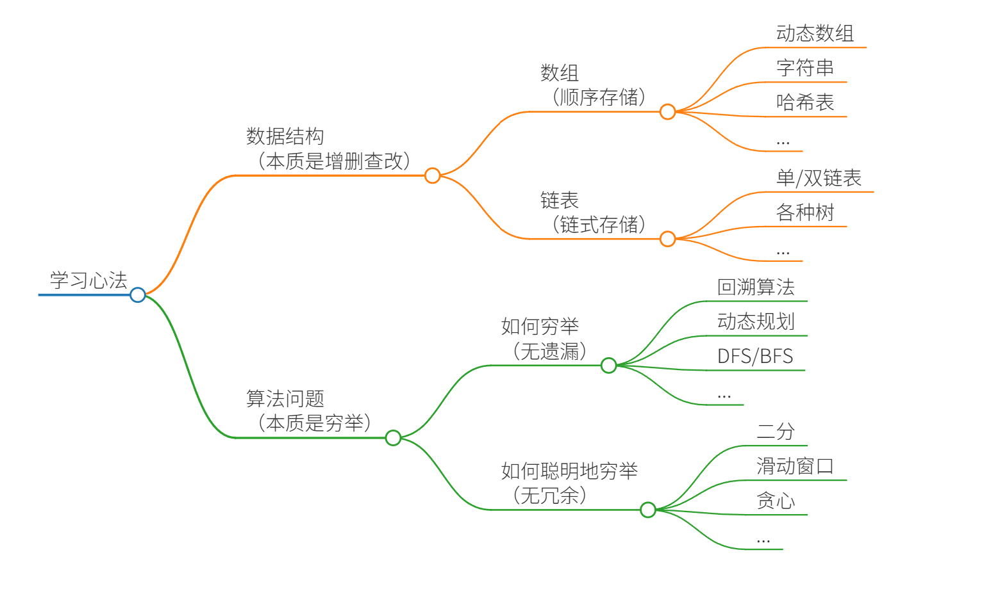
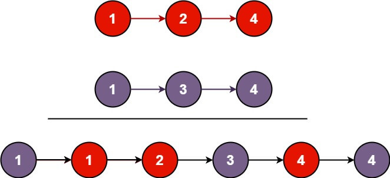

# 学习数据结构和算法的框架思维

> 本文阅读方法
>
> 本文会把很多算法进行抽象和归纳，所以会包含大量其他文章链接。
>
> **第一次阅读本文的读者遇到没学过的算法或不理解的地方请跳过，只要对本文所总结的理论有些印象即可**。在学习本站后面的算法技巧时，你自然可以逐渐理解本文的精髓所在，日后回来重读本文，会有更深的体会。

本文所做的总结是本站所有内容的纲领，主要有两部分：一是谈我对数据结构和算法本质的理解，二是概括各种常用的算法。

全文没有什么硬核的代码，都是我的经验之谈，肯定能帮你少走弯路，更透彻地理解和掌握算法。



## 总结一切数据结构和算法

种种数据结构，皆为**数组**（顺序存储）和**链表**（链式存储）的变换。

数据结构的关键点在于**遍历和访问**，即增删查改等基本操作。

种种算法，皆为**穷举**。

穷举的关键点在于**无遗漏和无冗余**。熟练掌握算法框架，可以做到无遗漏；充分利用信息，可以做到无冗余。

真正理解上面几句话，不仅本文 7000 字都不用看了，乃至本站的几十篇算法教程和习题都不用做了。

如果不理解，那么我就用下面的几千字，以及后面的几十篇文章和习题，来阐明上述的两句总结。大家在学习的时候，时刻品味这两句话，会大幅提高学习效率。

## 数据结构的存储方式

**数据结构的存储方式只有两种：[数组（顺序存储）](https://labuladong.online/zh/algo/data-structure-basic/array-basic/) 和 [链表（链式存储）](https://labuladong.online/zh/algo/data-structure-basic/linkedlist-basic/)**。

这句话怎么理解，不是还有哈希表、栈、队列、堆、树、图等等各种数据结构吗？

我们分析问题，一定要有递归的思想，自顶向下，从抽象到具体。你上来就列出这么多，那些都属于上层建筑，而数组和链表才是结构基础。因为那些多样化的数据结构，究其源头，都是在链表或者数组上的特殊操作，API 不同而已。

比如说 [队列、栈](https://labuladong.online/zh/algo/data-structure-basic/queue-stack-basic/) 这两种数据结构既可以使用链表也可以使用数组实现。用数组实现，就要处理扩容缩容的问题；用链表实现，没有这个问题，但需要更多的内存空间存储节点指针。

[图结构](https://labuladong.online/zh/algo/data-structure-basic/graph-basic/) 的两种存储方式，邻接表就是链表，邻接矩阵就是二维数组。邻接矩阵判断连通性迅速，并可以进行矩阵运算解决一些问题，但是如果图比较稀疏的话很耗费空间。邻接表比较节省空间，但是很多操作的效率上肯定比不过邻接矩阵。

[哈希表](https://labuladong.online/zh/algo/data-structure-basic/hashmap-basic/) 就是通过散列函数把键映射到一个大数组里。而且对于解决散列冲突的方法，[拉链法](https://labuladong.online/zh/algo/data-structure-basic/hashtable-chaining/) 需要链表特性，操作简单，但需要额外的空间存储指针；[线性探查法](https://labuladong.online/zh/algo/data-structure-basic/linear-probing-key-point/) 需要数组特性，以便连续寻址，不需要指针的存储空间，但操作稍微复杂些。

[树结构](https://labuladong.online/zh/algo/data-structure-basic/binary-tree-basic/)，用数组实现就是「堆」，因为「堆」是一个完全二叉树，用数组存储不需要节点指针，操作也比较简单，经典应用有 [二叉堆](https://labuladong.online/zh/algo/data-structure-basic/binary-heap-basic/)；用链表实现就是很常见的那种「树」，因为不一定是完全二叉树，所以不适合用数组存储。为此，在这种链表「树」结构之上，又衍生出各种巧妙的设计，比如 [二叉搜索树](https://labuladong.online/zh/algo/data-structure-basic/tree-map-basic/)、AVL 树、[红黑树](https://labuladong.online/zh/algo/data-structure-basic/rbtree-basic/)、[区间树](https://labuladong.online/zh/algo/data-structure-basic/segment-tree-basic/)、B 树等等，以应对不同的问题。

综上，数据结构种类很多，甚至你也可以发明自己的数据结构，但是底层存储无非数组或者链表，二者的优缺点如下：

**[数组](https://labuladong.online/zh/algo/data-structure-basic/array-basic/)** 由于是紧凑连续存储，可以随机访问，通过索引快速找到对应元素，而且相对节约存储空间。但正因为连续存储，内存空间必须一次性分配够，所以说数组如果要扩容，需要重新分配一块更大的空间，再把数据全部复制过去，时间复杂度 O(N)*O*(*N*)；而且你如果想在数组中间进行插入和删除，每次必须搬移后面的所有数据以保持连续，时间复杂度 O(N)*O*(*N*)。

**[链表](https://labuladong.online/zh/algo/data-structure-basic/linkedlist-basic/)** 因为元素不连续，而是靠指针指向下一个元素的位置，所以不存在数组的扩容问题；如果知道某一元素的前驱和后驱，操作指针即可删除该元素或者插入新元素，时间复杂度 O(1)*O*(1)。但是正因为存储空间不连续，你无法根据一个索引算出对应元素的地址，所以不能随机访问；而且由于每个元素必须存储指向前后元素位置的指针，会消耗相对更多的储存空间。


## 数据结构的基本操作

**对于任何数据结构，其基本操作无非遍历 + 访问，再具体一点就是：增删查改**。

数据结构种类很多，但它们存在的目的都是在不同的应用场景，尽可能高效地增删查改，这就是数据结构的使命。

如何遍历 + 访问？我们仍然从最高层来看，各种数据结构的遍历 + 访问无非两种形式：线性的和非线性的。

线性就是 for/while 迭代为代表，非线性就是递归为代表。再具体一步，无非以下几种框架：

数组遍历框架，典型的线性迭代结构：

```java
void traverse(int[] arr) {
    for (int i = 0; i < arr.length; i++) {
        // 迭代访问 arr[i]
    }
}
```

链表遍历框架，兼具迭代和递归结构：

```java
// 基本的单链表节点
class ListNode {
    int val;
    ListNode next;
}

void traverse(ListNode head) {
    for (ListNode p = head; p != null; p = p.next) {
        // 迭代访问 p.val
    }
}

void traverse(ListNode head) {
    // 递归访问 head.val
    traverse(head.next);
}
```

二叉树遍历框架，典型的非线性递归遍历结构：

```java
// 基本的二叉树节点
class TreeNode {
    int val;
    TreeNode left, right;
}

void traverse(TreeNode root) {
    traverse(root.left);
    traverse(root.right);
}
```

你看二叉树的递归遍历方式和链表的递归遍历方式，相似不？再看看二叉树结构和单链表结构，相似不？如果再多几条叉，N 叉树你会不会遍历？

二叉树框架可以扩展为 N 叉树的遍历框架：

```java
// 基本的 N 叉树节点
class TreeNode {
    int val;
    TreeNode[] children;
}

void traverse(TreeNode root) {
    for (TreeNode child : root.children)
        traverse(child);
}
```

`N` 叉树的遍历又可以扩展为图的遍历，因为图就是好几 `N` 叉棵树的结合体。你说图是可能出现环的？这个很好办，用个布尔数组 `visited` 做标记就行了，[图结构遍历](https://labuladong.online/zh/algo/data-structure-basic/graph-traverse-basic/) 中有具体讲解。

**所谓框架，就是套路。不管增删查改，这些代码都是永远无法脱离的结构**，你可以把这个结构作为大纲，根据具体问题在框架上添加代码就行了。

## 算法的本质

**如果要让我一句话总结，我想说算法的本质就是「穷举」**。

这么说肯定有人要反驳了，真的所有算法问题的本质都是穷举吗？没有例外吗？

例外肯定是有的，比如 [一行代码就能解决的算法题](https://labuladong.online/zh/algo/frequency-interview/one-line-solutions/)，这些题目类似脑筋急转弯，都是通过观察，发现规律，然后找到最优解法，不过这类算法问题较少，不必特别纠结。再比如，密码学算法、机器学习算法，它们的本质确实不是穷举，而是数学原理的编程实现，所以这类算法的本质是数学，不在我们所探讨的「数据结构和算法」的范畴之内。

**顺便强调下，「算法工程师」做的这个「算法」，和「数据结构与算法」中的这个「算法」完全是两码事**，免得一些初学读者误解。

对前者来说，重点在数学建模和调参经验，计算机真就只是拿来做计算的工具而已；而后者的重点是计算机思维，需要你能够站在计算机的视角，抽象、化简实际问题，然后用合理的数据结构去解决问题。

所以，你千万别以为学好了数据结构和算法就能去做算法工程师，也不要以为只要不做算法工程师就不需要学习数据结构和算法。

坦白说，大部分开发岗位工作中都是基于现成的开发框架做事，不怎么会碰到底层数据结构和算法相关的问题，但另一个事实是，只要你想找技术相关的岗位，数据结构和算法的考察是绕不开的，因为这块知识点是公认的程序员基本功。

**为了区分，不妨称算法工程师研究的算法为「数学算法」，称刷题面试的算法为「计算机算法」，我写的内容主要聚焦的是「计算机算法」**。

这样解释应该很清楚了吧，我猜大部分人的目标是通过算法笔试，找一份开发岗位的工作，所以你真的不需要有多少数学基础，只要学会用计算机思维解决问题就够了。

其实计算机思维也没什么高端的，你想想计算机的特点是啥？不就是快嘛，你的脑回路一秒只能转一圈，人家 CPU 转几万圈无压力。所以计算机解决问题的方式大道至简，就是**穷举**。

就比如让你计算一个数组中的最大值是什么，你怎么做？只能用 for 循环遍历穷举所有元素找最大的那个，没有更好的办法了，对吧？这就是穷举，这就是算法，so easy。

我记得自己刚入门的时候，也觉得计算机算法是一个很高大上的东西，每见到一道题，就想着能不能推导出一个什么数学公式，啪的一下就能把答案算出来。

比如你和一个没学过计算机算法的人说你写了个计算排列组合的算法，他大概以为你发明了一个公式，可以直接算出所有排列组合。

但实际上呢？没什么高大上的公式，[回溯算法秒杀排列组合子集问题](https://labuladong.online/zh/algo/essential-technique/permutation-combination-subset-all-in-one/) 会讲解，其实就是把排列组合的所有可能抽象成一棵多叉树结构，然后你写代码去遍历这棵树，把所有的结果收集起来罢了。这有啥神奇的？

对计算机算法的误解也许是以前学数学留下的「后遗症」，数学题一般都是你仔细观察，找几何关系，列方程，然后算出答案。如果说你需要进行大规模穷举来寻找答案，那大概率是你的解题思路出问题了。

而计算机解决问题的思维恰恰相反：有没有什么数学公式就交给你们人类去推导吧，如果能找到一些巧妙的定理那最好，但如果找不到，那就穷举呗，反正只要复杂度允许，没有什么答案是穷举不出来的。

理论上讲只要不断随机打乱一个数组，总有一天能得到有序的结果呢！当然，这绝不是一个好算法，因为鬼知道它要运行多久才有结果。

技术岗笔试面试考的那些算法题，求个最大值最小值什么的，你怎么求？把所有可行解穷举出来就能找到最值了呗，说白了不就这么点事儿么。

## 穷举的难点

> 穷举的两个关键
>
> 你千万不要觉得穷举这个事儿很简单，穷举有两个关键难点：**无遗漏、无冗余**。
>
> 遗漏，会直接导致答案出错，比如让你求最小值，你穷举时恰好把那个最小值漏掉了，这不就错了嘛。
>
> 冗余，会拖慢算法的运行速度，比如你的代码把完全相同的计算流程重复了十遍，那你的算法不就慢了十倍么，就有可能超过判题平台的时间限制。
>
> **为什么会遗漏**？因为你对算法框架掌握不到位，不知道正确的穷举代码。
>
> **为什么会冗余**？因为你没有充分利用信息，导致了重复计算。
>
> 所以，当你看到一道算法题，可以从这两个维度去思考：
>
> **1、如何穷举**？即无遗漏地穷举所有可能解。
>
> **2、如何聪明地穷举**？即避免穷举过程中的冗余计算，消耗尽可能少的资源求出答案。

### 如何穷举

**什么算法的难点在「如何穷举」呢？一般是递归类问题，比方说回溯算法、动态规划系列算法**。

先说回溯算法，就拿我们高中学过的排列组合问题举例，我们当时都可以找到规律在草稿纸上推导排列组合：根据第一位可能的选择，先固定第一位，然后看第二位有哪些可能的选择，然后固定第二位... 以此类推，但如果未经训练，你很难用代码来穷举所有排列组合，因为你很难把这个手动穷举的过程抽象成程序化的规律。

首先，你要把排列组合问题抽象成一棵树，其次你要精确地使用代码**遍历**这棵树的所有节点，不能漏不能多，才能写出正确的代码。在后面的章节中，我会先介绍 [回溯算法核心框架](https://labuladong.online/zh/algo/essential-technique/backtrack-framework/)，然后在 [回溯算法解决子集排列组合问题](https://labuladong.online/zh/algo/essential-technique/permutation-combination-subset-all-in-one/) 一次性解决所有子集排列组合问题。

动态规划比回溯算法更难一点。它俩本质上都是穷举，但思考模式不同，回溯算法是「**遍历**」的思维，而动态规划是「**分解问题**」的思维。


> 啥叫分解问题的思维？
>
> 我都不用举正儿八经的例子，就比方说，你看那棵树，回答我，树上有多少片叶子？
>
> 你如何穷举？顺着树枝去一片片数么？当然也可以的，但这是遍历的思维模式，胜似你手动推导排列组合的过程，属于回溯算法的范畴
>
> **如果你具备分解问题的思维模式，你应该告诉我：树上只有一片叶子，和剩下的叶子**。
>
> 听到这个回答，就知道是个算法高手。
>
> 还有不开窍的小同学追问，那剩下的叶子有多少呢？答曰，只有一片，和剩下的叶子。不要再往下问了，只能说，谜底就在谜面上，到了那个时候，你自然知道剩多少了。

所以你知道为啥我说动态规划这类问题的难点在于「如何穷举」了吧？一个脑瓜正常的人，本来就不会用这种奇怪的思维方式来思考问题，但这种思维结合计算机就是杀手锏，所以你要练，练好了，随心所欲写算法，咋写都是对的。

我在 [动态规划核心框架](https://labuladong.online/zh/algo/essential-technique/dynamic-programming-framework/) 阐述了动态规划系列问题的解题过程，无非就是先写出暴力穷举解法（状态转移方程），加个备忘录就成自顶向下的递归解法了，再改一改就成自底向上的递推迭代解法了，[动态规划的降维打击](https://labuladong.online/zh/algo/dynamic-programming/space-optimization/) 里也讲过如何利用空间压缩技巧优化动态规划算法的空间复杂度。

其中加备忘录、空间压缩技巧都是固定的套路，不是难点。你亲自去做动态规划的题目就会发现，自己根本想不出状态转移方程，即第一步的暴力解法都写不出来，所以说找状态转移方程（如何穷举）才是难点。

我专门写了 [动态规划设计方法：数学归纳法](https://labuladong.online/zh/algo/dynamic-programming/longest-increasing-subsequence/) 这篇文章，告诉你穷举的核心是数学归纳法，明确函数的定义，分解问题，然后利用这个定义递归求解子问题。

### 如何聪明地穷举

**什么算法的难点在「如何聪明地穷举」呢？一些耳熟能详的非递归算法技巧，都可以归在这一类**。

最简单的例子，比方说让你在有序数组中寻找一个元素，用一个 for 循环暴力穷举谁都会，但 [二分搜索算法](https://labuladong.online/zh/algo/essential-technique/binary-search-framework/) 就是更聪明的穷举方式，拥有更好的时间复杂度。

还有前文 [Union Find 并查集算法详解](https://labuladong.online/zh/algo/data-structure/union-find/) 告诉你一种高效计算连通分量的技巧，理论上说，想判断图中的两个节点是否连通，我用 DFS/BFS 暴力搜索（穷举）肯定可以做到，但人家 Union Find 算法硬是用数组模拟树结构，给你把连通性相关的操作复杂度给干到 $O(1)$了。

这就属于聪明地穷举，大佬们把这些技巧发明出来，你学过就会用，没学过恐怕很难想出这种思路。

再比如贪心算法技巧，前文 [当老司机学会贪心算法](https://labuladong.online/zh/algo/frequency-interview/gas-station-greedy/) 就告诉你，所谓贪心算法就是在题目中发现一些规律（专业点叫贪心选择性质），使得你不用完整穷举所有解就可以得出答案。

人家动态规划好歹是无冗余地穷举所有解，然后找一个最值，你贪心算法可好，都不用穷举所有解就可以找到答案，所以前文 [贪心算法解决跳跃游戏](https://labuladong.online/zh/algo/essential-technique/greedy/) 中贪心算法的效率比动态规划还高。当然，并不是所有问题都存在贪心选择性质让你投机取巧，所以全量穷举虽然朴实无华且枯燥，但真的是任何情况下都可以用的。

下面我概括性地列举一些常见的算法技巧，供大家学习参考。


## 数组/单链表系列算法

**单链表常考的技巧就是双指针，属于「如何聪明地穷举」这一类**，[单链表双指针技巧汇总](https://labuladong.online/zh/algo/essential-technique/linked-list-skills-summary/) 全给你总结好了，会者不难，难者不会。

比如判断单链表是否成环，拍脑袋的暴力解是什么？就是用一个 `HashSet` 之类的数据结构来缓存走过的节点，遇到重复的就说明有环对吧。但我们用快慢指针可以避免使用额外的空间，这就是聪明地穷举嘛。

**数组常用的技巧有也是双指针相关的技巧，也都属于「如何聪明地穷举」这一类**。[数组双指针技巧汇总](https://labuladong.online/zh/algo/essential-technique/array-two-pointers-summary/) 全给你总结好了，会者不难，难者不会。

**首先说二分搜索技巧**，可以归为两端向中心的双指针。如果让你在数组中搜索元素，一个 for 循环花 O(N)*O*(*N*) 时间穷举肯定能搞定对吧，但是二分搜索告诉你，如果数组是有序的，它只要 O(logN)*O*(*l**o**g**N*) 的复杂度，这不就是一种更聪明的搜索方式么。

[二分搜索框架详解](https://labuladong.online/zh/algo/essential-technique/binary-search-framework/) 给你总结了二分搜索代码模板，保证不会出现搜索边界的问题。[二分搜索算法运用](https://labuladong.online/zh/algo/frequency-interview/binary-search-in-action/) 给你总结了二分搜索相关题目的共性以及如何将二分搜索思想运用到实际算法中。

**再说说 [滑动窗口算法技巧](https://labuladong.online/zh/algo/essential-technique/sliding-window-framework/)**，典型的快慢双指针。你用嵌套 for 循环花 O(N2)*O*(*N*2) 的时间肯定可以穷举出所有子数组，也就必然可以找到符合题目要求的子数组。但是滑动窗口算法表示，在某些场景下，它可以用一快一慢两个指针，只需 O(N)*O*(*N*) 的时间就可以找到答案，这就是更聪明地穷举方式。

[滑动窗口算法框架详解](https://labuladong.online/zh/algo/essential-technique/sliding-window-framework/) 介绍了滑动窗口算法的适用场景以及通用代码模板，保你写出正确的代码。[滑动窗口习题](https://labuladong.online/zh/algo/problem-set/sliding-window/) 中手把手带你运用滑动窗口框架解决各种问题。

**最后说说 [前缀和技巧](https://labuladong.online/zh/algo/data-structure/prefix-sum/) 和 [差分数组技巧](https://labuladong.online/zh/algo/data-structure/diff-array/)**。

如果频繁地让你计算子数组的和，每次用 for 循环去遍历肯定没问题，但前缀和技巧预计算一个 `preSum` 数组，就可以避免循环。

类似的，如果频繁地让你对子数组进行增减操作，也可以每次用 for 循环去操作，但差分数组技巧维护一个 `diff` 数组，也可以避免循环。

数组链表的技巧差不多就这些了，都比较固定，只要你都见过，运用出来的难度不算大，下面来说一说稍微有些难度的算法。


## 二叉树系列算法

老读者都知道，二叉树的重要性我之前说了无数次，因为二叉树模型几乎是所有高级算法的基础，尤其是那么多人说对递归的理解不到位，更应该好好刷二叉树相关题目。

> Tip
>
> 在本站的二叉树章节，我会按照固定的公式和思维模式讲解 150 道二叉树题目，可以手把手带你刷完二叉树分类的题目，迅速掌握递归思维。

**[二叉树心法（纲领篇）](https://labuladong.online/zh/algo/essential-technique/binary-tree-summary/) 说过，二叉树题目的递归解法可以分两类思路，第一类是遍历一遍二叉树得出答案，第二类是通过分解问题计算出答案，这两类思路分别对应着 [回溯算法核心框架](https://labuladong.online/zh/algo/essential-technique/backtrack-framework/) 和 [动态规划核心框架](https://labuladong.online/zh/algo/essential-technique/dynamic-programming-framework/)**。

### 遍历的思维模式

**什么叫通过遍历一遍二叉树得出答案**？

就比如说计算二叉树最大深度这个问题让你实现 `maxDepth` 这个函数，你这样写代码完全没问题：

```java
class Solution {

    // 记录最大深度
    int res = 0;
    // 记录当前遍历节点的深度
    int depth = 0;

    // 主函数
    int maxDepth(TreeNode root) {
        traverse(root);
        return res;
    }

    // 二叉树遍历框架
    void traverse(TreeNode root) {
        if (root == null) {
            // 到达叶子节点
            res = Math.max(res, depth);
            return;
        }
        // 前序遍历位置
        depth++;
        traverse(root.left);
        traverse(root.right);
        // 后序遍历位置
        depth--;
    }
}
```


# 双指针技巧秒杀七道链表题目

读完本文，你不仅学会了算法套路，还可以顺便解决如下题目：

|                           LeetCode                           |                             力扣                             | 难度 |
| :----------------------------------------------------------: | :----------------------------------------------------------: | :--: |
| [21. Merge Two Sorted Lists](https://leetcode.com/problems/merge-two-sorted-lists/) | [21. 合并两个有序链表](https://leetcode.cn/problems/merge-two-sorted-lists/) |  🟢   |
| [86. Partition List](https://leetcode.com/problems/partition-list/) | [86. 分隔链表](https://leetcode.cn/problems/partition-list/) |  🟡   |
| [23. Merge k Sorted Lists](https://leetcode.com/problems/merge-k-sorted-lists/) | [23. 合并 K 个升序链表](https://leetcode.cn/problems/merge-k-sorted-lists/) |  🔴   |
| [19. Remove Nth Node From End of List](https://leetcode.com/problems/remove-nth-node-from-end-of-list/) | [19. 删除链表的倒数第 N 个结点](https://leetcode.cn/problems/remove-nth-node-from-end-of-list/) |  🟡   |
| [876. Middle of the Linked List](https://leetcode.com/problems/middle-of-the-linked-list/) | [876. 链表的中间结点](https://leetcode.cn/problems/middle-of-the-linked-list/) |  🟢   |
| [142. Linked List Cycle II](https://leetcode.com/problems/linked-list-cycle-ii/) | [142. 环形链表 II](https://leetcode.cn/problems/linked-list-cycle-ii/) |  🟡   |
| [160. Intersection of Two Linked Lists](https://leetcode.com/problems/intersection-of-two-linked-lists/) | [160. 相交链表](https://leetcode.cn/problems/intersection-of-two-linked-lists/) |  🟢   |
| [141. Linked List Cycle](https://leetcode.com/problems/linked-list-cycle/) | [141. 环形链表](https://leetcode.cn/problems/linked-list-cycle/) |  🟢   |
| [LCR 140. 训练计划 II](https://leetcode.com/problems/lian-biao-zhong-dao-shu-di-kge-jie-dian-lcof/) | [LCR 140. 训练计划 II](https://leetcode.cn/problems/lian-biao-zhong-dao-shu-di-kge-jie-dian-lcof/) |  🟢   |

> 前置知识
>
> 阅读本文前，你需要先学习：
>
> - [链表基础](https://labuladong.online/zh/algo/data-structure-basic/linkedlist-basic/)

本文总结一下单链表的基本技巧，每个技巧都对应着至少一道算法题：

1、合并两个有序链表

2、链表的分解

3、合并 `k` 个有序链表

4、寻找单链表的倒数第 `k` 个节点

5、寻找单链表的中点

6、判断单链表是否包含环并找出环起点

7、判断两个单链表是否相交并找出交点

这些解法都用到了双指针技巧，所以说对于单链表相关的题目，双指针的运用是非常广泛的，下面我们就来一个一个看。


## 合并两个有序链表

这是最基本的链表技巧，力扣第 21 题「[合并两个有序链表](https://leetcode.cn/problems/merge-two-sorted-lists/)」就是这个问题，给你输入两个有序链表，请你把他俩合并成一个新的有序链表：

将两个升序链表合并为一个新的 **升序** 链表并返回。新链表是通过拼接给定的两个链表的所有节点组成的。 

**示例 1：**



```
输入：l1 = [1,2,4], l2 = [1,3,4]
输出：[1,1,2,3,4,4]
```

**示例 2：**

```
输入：l1 = [], l2 = []
输出：[]
```

**示例 3：**

```
输入：l1 = [], l2 = [0]
输出：[0]
```

**提示：**

- 两个链表的节点数目范围是 `[0, 50]`
- `-100 <= Node.val <= 100`
- `l1` 和 `l2` 均按 **非递减顺序** 排列

```java
// 函数签名如下
ListNode mergeTwoLists(ListNode l1, ListNode l2);
```

这题比较简单，我们直接看解法：

```java
class Solution {
    public ListNode mergeTwoLists(ListNode l1, ListNode l2) {
        // 虚拟头结点
        ListNode dummy = new ListNode(-1), p = dummy;
        ListNode p1 = l1, p2 = l2;

        while (p1 != null && p2 != null) {
            // 比较 p1 和 p2 两个指针
            // 将值较小的的节点接到 p 指针
            if (p1.val > p2.val) {
                p.next = p2;
                p2 = p2.next;
            } else {
                p.next = p1;
                p1 = p1.next;
            }
            // p 指针不断前进
            p = p.next;
        }

        if (p1 != null) {
            p.next = p1;
        }

        if (p2 != null) {
            p.next = p2;
        }

        return dummy.next;
    }
}
```

